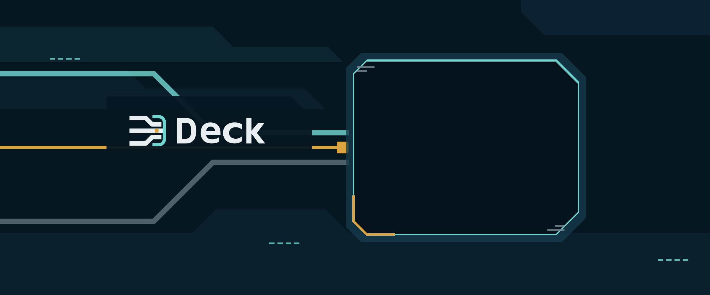

# Deck



## The command deck for reproducible AI work

`install → inspect → configure → launch → verify`

Deck is a CLI/TUI for turning an AI runner into a repeatable work environment. It detects the tools you already have, runs runner-specific preflight checks, lets you review packages and MCP configuration, materializes the Developer Team, assigns models and reasoning effort, and leaves you with evidence you can inspect.

## Start with the shortest path

Published binaries are installed with the supported installer:

```sh
curl -fsSL https://raw.githubusercontent.com/kevin15011/deck/main/scripts/install.sh | bash
```

The installer currently targets **macOS and Linux**, on **x64 and arm64**. It verifies release checksums by default and can install into a custom directory. See [Getting started](docs/getting-started.md) for source-checkout and first-run paths.

Then open the interactive deck:

```sh
deck
```

Choose a runner, let preflight show what is ready, select the packages and team content you want, review the plan, and apply it. Confirm the installation identity with:

```sh
deck version
```

## What is live today

| Surface | Status | What Deck actually does |
|---|---|---|
| Pi | **Supported** | Detects Pi, reviews its packages, configures its runner surfaces, installs the Developer Team, and can launch `deck pi developer`. |
| OpenCode | **Supported** | Detects OpenCode, reviews its package/config evidence, configures its runner surfaces, and installs the Developer Team through the TUI flow. |
| Claude and Codex | **Detection only** | Checks whether `claude` or `codex` is present in `PATH`; no operational runner adapter is exposed for them. |
| Adaptive memory | **Optional** | Defaults to none; Engram is experimental; Supermemory is MCP-based and needs runtime configuration. |
| Developer Team | **Supported** | Seven adaptive roles, proportional verification, runner-native materialization, and separate lifecycle skills. |
| Bundled external skills | **Supported** | 29 reusable standalone skills are shipped as content and cataloged by user goal. |

## The product loop

### 1. Make the runner legible

Deck does not assume runner parity. Pi and OpenCode each provide an adapter with its own environment inspection, package review, MCP configuration, team materialization, model inventory, and verification behavior. The TUI keeps those differences visible instead of hiding them behind a generic promise.

### 2. Turn a request into a safe work route

The Developer Team is adaptive rather than a mandatory phase chain. Lead may work directly on a clear low-risk change, or route only the uncertainty, durable design, implementation complexity, readiness repair, or protected risk that justifies another role. The result is one functional candidate with proportional checks, not a parade of artifacts.

### 3. Keep context useful and subordinate

Adaptive memory can supply auxiliary context, but it never outranks OpenSpec artifacts, source, tests, or current runner evidence. Project-local skills are discovery candidates, not bundled Deck content or authority. Runner-scoped skill-registry operations are explicit and bounded.

### 4. Operate the installation like a system

`deck doctor` reports Deck state, binaries, runner configuration, MCP checks, memory-provider visibility, release information, and actionable suggestions. `deck update` and `deck upgrade` share the self-update path; verified backups support rollback when an operation needs to be unwound.

## Choose your next move

| If you want to… | Read |
|---|---|
| Install Deck and configure your first runner | [Getting started](docs/getting-started.md) |
| Understand Pi/OpenCode boundaries | [Runners](docs/runners.md) and [support matrix](docs/reference/support-matrix.md) |
| Configure packages, MCP, models, or reasoning | [Configuration](docs/configuration.md) |
| Understand the seven roles and adaptive routing | [Developer Team](docs/developer-team.md) |
| Browse all lifecycle and bundled skills | [Skills](docs/skills.md) |
| Decide whether memory belongs in your workflow | [Adaptive memory](docs/adaptive-memory.md) |
| Run updates, advisories, rollback, or diagnostics | [Operations](docs/operations.md) |
| Validate OpenSpec or discover project-local skills | [Project workflows](docs/project-workflows.md) |
| Look up exact command forms | [CLI reference](docs/reference/cli.md) |
| Recover from a blocked setup | [Troubleshooting](docs/troubleshooting.md) |

> **Audience:** People evaluating, installing, or operating Deck.
> **Authority:** Product orientation; executable source and tests define current behavior.
> **Maintainer:** Deck maintainers.
> **Evidence:** [CLI parser](apps/cli/src/cli-args.ts), [CLI composition](apps/cli/src/main.tsx), [installer](scripts/install.sh), [runner capability registry](packages/core/src/runner-capability-registry.ts), and [documentation governance](tests/documentation-governance.test.ts).

For repository architecture and maintainer procedures, use [Architecture](docs/architecture.md), [Contributing](CONTRIBUTING.md), and [release guidance](docs/maintainers/releasing.md).

Deck is maintained at <https://github.com/kevin15011/deck>.
