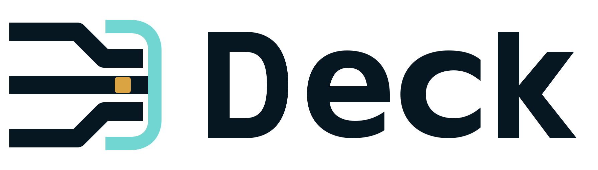

# Deck product documentation

<picture>
  <source media="(prefers-color-scheme: dark)" srcset="assets/brand/deck-logo-horizontal-light.png">
  <source media="(prefers-color-scheme: light)" srcset="assets/brand/deck-logo-horizontal-dark.png">
  
</picture>

Deck's product docs explain the path from installation to an operating AI work environment. Start with the task that matches what you are doing; the README is the product overview, not a repository index.

> **Audience:** People using, evaluating, or supporting Deck.
> **Authority:** Product guides; source, tests, and runner output define current behavior.
> **Maintainer:** Deck maintainers.
> **Evidence:** [root README](../README.md), [CLI parser](../apps/cli/src/cli-args.ts), runner adapters under [`packages/adapter-*`](../packages), and [documentation governance](../tests/documentation-governance.test.ts).

## Quick paths

| Goal | Start here | Then |
|---|---|---|
| First installation | [Getting started](getting-started.md) | [Runners](runners.md) |
| Configure an existing environment | [Configuration](configuration.md) | [Operations](operations.md) |
| Understand AI work routing | [Developer Team](developer-team.md) | [Project workflows](project-workflows.md) |
| Add context carefully | [Adaptive memory](adaptive-memory.md) | [Troubleshooting](troubleshooting.md) |
| Find a command or status | [CLI reference](reference/cli.md) | [Support matrix](reference/support-matrix.md) |

## Guides

- [Getting started](getting-started.md) — installer, source checkout, first TUI run, and readiness checks.
- [Runners](runners.md) — Claude detection-only boundaries and operational Pi/OpenCode/Codex support.
- [Configuration](configuration.md) — Deck config, packages, MCP, models, reasoning, and runner-specific persistence.
- [Developer Team](developer-team.md) — the seven roles, adaptive routing, and conditional Quality.
- [Skills](skills.md) — lifecycle skills, all 29 bundled external skills, and project-local discovery boundaries.
- [Adaptive memory](adaptive-memory.md) — none, Supermemory runtime, optional scoped MCP recall, governance, and authority.
- [Operations](operations.md) — doctor, version, updates, release advisories, rollback, and recovery signals.
- [Project workflows](project-workflows.md) — onboarding, implementation, validation, discovery, and closure.
- [Troubleshooting](troubleshooting.md) — symptom-first recovery paths.

## References

- [CLI reference](reference/cli.md) — parser-backed commands and flags.
- [Support matrix](reference/support-matrix.md) — current status labels, runner differences, and scoped gaps.

## Repository boundaries

Product docs intentionally stay separate from contributor and maintainer internals. Use [Architecture](architecture.md) for stable package boundaries, [Developer Team execution](developer-team-execution.md) for runtime rollout details, and [release guidance](maintainers/releasing.md) for maintainer-only release procedure.
