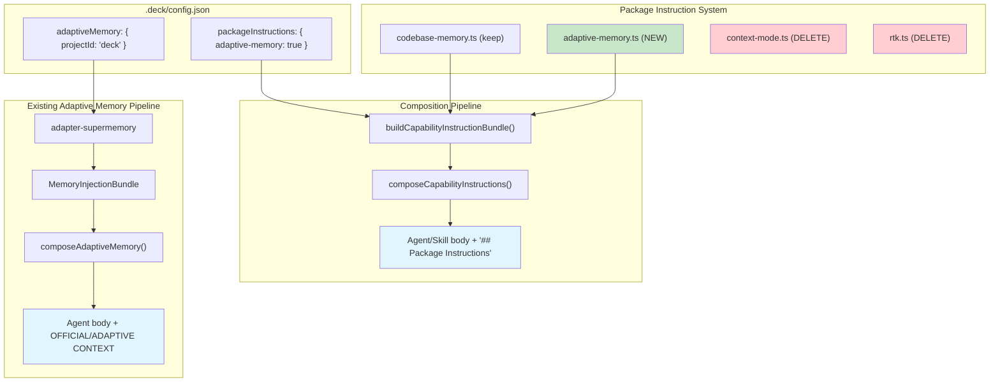

# Design: Adaptive Memory Protocol — Package Instruction Model

## Source

- Proposal: `adaptive-memory-protocol` proposal artifact
- Capabilities affected: `adaptive-memory-protocol` (new), `project-auto-scoping` (new), `deck-config-json` (modified), `instruction-bundles` (modified)
- Spec status: not yet available (parallel)

## Current Architecture Context

### Two Parallel Injection Systems

Deck has **two independent injection systems** for agent instructions:

1. **Adaptive Memory** (`packages/core/src/memory/adaptive-memory.ts`):
   - Provider-built `MemoryInjectionBundle` with instruction fragments + tool bindings
   - Providers: `adapter-supermemory`, `adapter-engram`
   - Composed via `composeAdaptiveMemory()` — wraps content in `OFFICIAL CONTEXT` / `ADAPTIVE CONTEXT` sections
   - Injected through `manifest.ts` → `memoryBundle` field → adapters serialize to runner-native format

2. **Package Instructions** (`packages/core/src/teams/developer/instruction-bundles/`):
   - Config-toggled `CapabilityInstructionBundle` with instruction fragments only (no tool bindings)
   - Packages: `codebase-memory`, `context-mode`, `rtk`
   - Composed via `composeCapabilityInstructions()` — appends `## Package Instructions (configured)` section
   - Injected through `manifest.ts` → `capabilityInstructions` field → adapters serialize

Both systems coexist. The adaptive memory protocol belongs in **Package Instructions** (behavioral rules, provider-agnostic) while the existing adaptive memory system continues handling provider-specific tool bindings and session-scoped context injection.

### Package Instruction Registration Flow

```
deck-config.ts → PACKAGE_INSTRUCTION_PACKAGE_IDS (const array)
                → PACKAGE_BUILDERS (Record<pkgId, () => Bundle>)
                → PACKAGE_ORDER (canonical ordering)
                → Default config (all false)
                → validateDeckConfig() enforces field membership
```

Adding a new package requires: (1) new package ID in the const array, (2) new builder function, (3) builder registration, (4) default config entry. Removing a package requires the inverse.

### Stale Bundles

`context-mode.ts` and `rtk.ts` are stale — their content duplicates the package instructions already injected via `.deck/config.json` toggles. They produce routing instructions that were relevant when Deck managed AGENTS.md directly but are now redundant because package instructions flow through the bundle/composition pipeline.

### Config Schema

`DeckSupermemoryConfig` already has `projectId?: string`. The field exists in the schema but is not set in the current `config.json`. Detection code is needed to populate it.

### Git Repository

Remote: `git@github.com:kevin15011/deck.git` → expected `projectId`: `"deck"`.

## Proposed Architecture

### Core Principle: Behavioral Protocol as Package Instruction

The adaptive memory protocol is a **Package Instruction** — not an AGENTS.md edit, not a memory injection. It defines behavioral rules (WHEN to save/search/summarize) that are provider-agnostic. The existing adaptive memory system handles provider-specific tool routing through its own injection pipeline.

### Component / Module Boundaries

| Component | Responsibility | Change Type |
|---|---|---|
| `instruction-bundles/adaptive-memory.ts` | New package: behavioral memory protocol fragments | new |
| `instruction-bundles/index.ts` | Registry: add `adaptive-memory` package ID, builder, ordering | modified |
| `config/deck-config.ts` | Add `adaptive-memory` to `PACKAGE_INSTRUCTION_PACKAGE_IDS`, defaults, validation | modified |
| `instruction-bundles/context-mode.ts` | Stale package | deleted |
| `instruction-bundles/rtk.ts` | Stale package | deleted |
| `config/deck-config.ts` (removals) | Remove `context-mode`, `rtk` from package IDs, defaults, validation | modified |
| `instruction-bundles/index.test.ts` | Update tests for new package and removed packages | modified |
| `config/deck-config.test.ts` | Update tests for new package IDs | modified |
| `packages/core/src/utils/git.ts` | New: git remote URL → project name extraction | new |
| `packages/core/src/utils/git.test.ts` | Tests for git URL parsing | new |
| `~/.config/opencode/instructions/codebase-memory-routing.md` | Stale routing file | deleted |
| `~/.config/opencode/instructions/context-mode-routing.md` | Stale routing file | deleted |
| `~/.config/opencode/instructions/rtk-routing.md` | Stale routing file | deleted |
| `.deck/config.json` | Set `projectId`, enable `adaptive-memory`, disable stale packages | modified |

### D1: Package Bundle File

**File**: `packages/core/src/teams/developer/instruction-bundles/adaptive-memory.ts`

**Function**: `buildAdaptiveMemoryInstructionBundle(): CapabilityInstructionBundle`

**Surfaces**: `agent` and `skill` (same pattern as `codebase-memory.ts`)

**Content**: Provider-agnostic behavioral protocol covering:
- Save triggers (proactive: decisions, bug fixes, patterns, config changes, discoveries)
- Search-before-action guidance
- Session summary (mandatory on close)
- Advisory-only constraint relative to OpenSpec
- Graceful degradation (fail open when provider unavailable)

**No config parameters**: The builder takes no arguments (same signature as all other builders). Provider-specific routing is handled by the existing `MemoryInjectionBundle` pipeline, not by this package instruction.

### D2: Provider Routing — Already Solved by Existing Architecture

The previous design tried to put provider routing in AGENTS.md. That was wrong because:

1. The **Package Instruction** system delivers behavioral rules — it is provider-agnostic by design.
2. The **Adaptive Memory** system already handles provider-specific tool routing through `MemoryInjectionBundle.toolBindings` and `MemoryInstructionFragment`.

**Architecture**:
- `adaptive-memory` package instruction → behavioral rules (WHEN to save/search)
- `adapter-supermemory` / `adapter-engram` → `MemoryInjectionBundle` → tool routing (HOW to save/search)

These are separate concerns handled by separate systems. No routing table needed in the package instruction.

### D3: projectId Auto-Detection

**Where**: New utility `packages/core/src/utils/git.ts`

**Function**: `extractProjectNameFromGitRemote(remoteUrl: string): string | undefined`

**Extraction rules**:

| Input Format | Extraction | Result |
|---|---|---|
| `git@github.com:user/repo.git` | `[:/]?([^/]+?)(?:\.git)?$` | `repo` |
| `https://github.com/user/repo.git` | same | `repo` |
| `https://github.com/user/repo` | same | `repo` |
| `ssh://user@host/path/to/repo.git` | same | `repo` |
| `/local/path/to/repo` | `([^/]+)/?$` | `repo` |

**Fallback**: `path.basename(projectRoot)` if git extraction fails.

**When**: Run during `deck install` or when `projectId` is missing from config. NOT run every session.

**Storage**: Written to `.deck/config.json` → `adaptiveMemory.supermemory.projectId`.

**Config precedence**: If `projectId` is already set in config and non-empty, skip re-detection. Manual override wins.

### D4: Stale Bundle Deletion

**Delete from instruction-bundles/**:
- `context-mode.ts`
- `rtk.ts`

**Remove from `index.ts`**:
- Remove imports of `buildContextModeInstructionBundle` and `buildRtkInstructionBundle`
- Remove from `PACKAGE_BUILDERS` record
- Remove from `PACKAGE_ORDER` array

**Remove from `deck-config.ts`**:
- Remove `"context-mode"` and `"rtk"` from `PACKAGE_INSTRUCTION_PACKAGE_IDS`
- Remove from default config object in `getDefaultDeckConfig()` and `normalizePackageInstructionConfig()`
- Remove from `PACKAGE_INSTRUCTION_PACKAGE_FIELDS` set

**Delete stale routing files** (3 files):
- `~/.config/opencode/instructions/codebase-memory-routing.md`
- `~/.config/opencode/instructions/context-mode-routing.md`
- `~/.config/opencode/instructions/rtk-routing.md`

**Migration**: No migration path needed. These are static instruction files read per-session. Old sessions simply won't find them next session. Package instruction toggles in config already control which instructions are active.

### D5: File Impact — Complete List

| File / Path | Action | Rationale |
|---|---|---|
| `packages/core/src/teams/developer/instruction-bundles/adaptive-memory.ts` | create | New package instruction bundle |
| `packages/core/src/teams/developer/instruction-bundles/context-mode.ts` | delete | Stale bundle |
| `packages/core/src/teams/developer/instruction-bundles/rtk.ts` | delete | Stale bundle |
| `packages/core/src/teams/developer/instruction-bundles/index.ts` | modify | Register adaptive-memory, remove context-mode/rtk |
| `packages/core/src/teams/developer/instruction-bundles/index.test.ts` | modify | Update tests for new/deleted packages |
| `packages/core/src/config/deck-config.ts` | modify | Update package IDs, defaults, validation |
| `packages/core/src/config/deck-config.test.ts` | modify | Update test fixtures |
| `packages/core/src/utils/git.ts` | create | Git remote URL → project name extraction |
| `packages/core/src/utils/git.test.ts` | create | Tests for URL parsing |
| `~/.config/opencode/instructions/codebase-memory-routing.md` | delete | Stale routing file |
| `~/.config/opencode/instructions/context-mode-routing.md` | delete | Stale routing file |
| `~/.config/opencode/instructions/rtk-routing.md` | delete | Stale routing file |
| `.deck/config.json` | modify | Set projectId, enable adaptive-memory, disable stale packages |

### D6: Testing

| Test Target | What to Test |
|---|---|
| `index.test.ts` | Update fixture `makeConfig` to use `adaptive-memory` instead of `context-mode`/`rtk`; verify `buildCapabilityInstructionBundle(["adaptive-memory"])` produces agent + skill fragments; verify fragment content contains protocol keywords |
| `deck-config.test.ts` | Update all test fixtures referencing `context-mode`/`rtk` to use `adaptive-memory`; verify validation accepts `adaptive-memory` as package ID; verify defaults include `adaptive-memory: false` |
| `git.test.ts` | Test `extractProjectNameFromGitRemote()` for SSH, HTTPS, local paths, edge cases (trailing slash, `.git` suffix, no suffix); test fallback to directory basename |
| `adaptive-memory.ts` | Verify builder returns 2 fragments (agent, skill); verify fragments have correct packageId, surfaces, non-empty markdown; verify markdown contains expected protocol sections |

### Data Flow

```
Config .deck/config.json
│
├─ packageInstructions.pi["adaptive-memory"]: true
│   └─→ buildCapabilityInstructionBundle(["adaptive-memory", "codebase-memory"])
│       └─→ composeCapabilityInstructions(base, bundle, { surface: "agent" })
│           └─→ Appended as "## Package Instructions (configured)" section
│               in agent body and skill body
│
├─ adaptiveMemory.activeProvider: "supermemory"
│   └─→ adapter-supermemory builds MemoryInjectionBundle
│       └─→ composeAdaptiveMemory(base, bundle, { surface: "agent" })
│           └─→ Wrapped in OFFICIAL CONTEXT / ADAPTIVE CONTEXT sections
│
└─ adaptiveMemory.supermemory.projectId: "deck"
    └─→ Passed to supermemory adapter for scoped tags
```

### API / Contract Implications

| Interface | Change | Backward Compatible |
|---|---|---|
| `CapabilityInstructionPackageId` | Add `"adaptive-memory"`, remove `"context-mode"`, `"rtk"` | no (type change) |
| `PACKAGE_INSTRUCTION_PACKAGE_IDS` const | Same additions/removals | no (const change) |
| `getDefaultDeckConfig()` | New default key | yes (additive for new key; removal is breaking for stale keys) |
| `NormalizedDeckConfig` shape | Updated package maps | no (structural change) |
| `DeckSupermemoryConfig` | No change — `projectId` already exists | yes |
| `buildCapabilityInstructionBundle()` signature | No change — still takes `packageId[]` | yes |
| `composeCapabilityInstructions()` signature | No change | yes |

**Breaking change note**: Removing `"context-mode"` and `"rtk"` from the package ID union is a type-level breaking change. Any code referencing those IDs will fail to compile. This is intentional — the stale bundles and their references are being removed. No external consumers exist outside this repo.

### State / Persistence Implications

**`.deck/config.json`** updated:

```json
{
  "version": 1,
  "adaptiveMemory": {
    "activeProvider": "supermemory",
    "supermemory": {
      "mcpServerName": "supermemory",
      "searchMode": "memories",
      "maxMemoriesPerSession": 7,
      "userId": "kevin",
      "projectId": "deck",
      "teamId": "developer",
      "orgId": "GCO"
    }
  },
  "packageInstructions": {
    "pi": { "codebase-memory": true, "adaptive-memory": true },
    "opencode": { "codebase-memory": true, "adaptive-memory": true }
  }
}
```

Changes: (1) `projectId` added, (2) `context-mode`/`rtk` keys removed, (3) `adaptive-memory` key added and enabled.

### Migration / Backward Compatibility

1. **Package ID removal**: `context-mode` and `rtk` are removed from the union type. Existing configs with `context-mode: true` or `rtk: true` will fail validation with `DECK_CONFIG_UNKNOWN_FIELD`. **Mitigation**: The config validator already rejects unknown fields. Users must update config.json to remove stale keys. The install/setup flow should handle this.

2. **Stale routing files**: Deleted. These are static instruction files read per-session. No runtime dependency.

3. **Skills**: Zero changes required. All 11 skills use provider-agnostic "memory adapter" language.

4. **Existing memory injection**: Unchanged. The adaptive memory pipeline (`MemoryInjectionBundle`) continues to work independently.

## Testing Strategy

| Layer | Approach |
|---|---|
| Unit: `git.ts` | Test URL parsing for all supported formats, edge cases, fallbacks |
| Unit: `adaptive-memory.ts` bundle | Verify fragments, surfaces, markdown content |
| Unit: `index.ts` | Verify new package in build order, dedup, composition |
| Unit: `deck-config.ts` | Verify new package ID accepted, stale IDs rejected, defaults correct |
| Integration: config validation | Round-trip write/read config with new fields |
| Manual: routing file cleanup | Confirm three files deleted |
| Manual: session test | Start opencode session, confirm protocol appears in agent instructions |

## Observability / Error Handling

- **Provider unavailable**: Protocol specifies fail-open. Agents continue without memory.
- **Missing projectId**: Memory operations proceed without project scoping.
- **Stale config keys**: Validation rejects unknown package IDs with clear error messages.

## Security / Performance / Accessibility Considerations

None specific to this change beyond existing patterns.

## Tradeoffs

| Decision | Chosen | Rejected Alternative | Rationale |
|---|---|---|---|
| Protocol delivery | Package Instruction bundle | AGENTS.md editing | Deck uses a bundle system, not direct AGENTS.md editing; bundles flow through config toggles and composition pipeline |
| Provider routing | Existing MemoryInjectionBundle pipeline | Routing table in package instruction | Provider routing is already solved by the adaptive memory system; duplicating it in package instructions violates separation of concerns |
| Bundle builder signature | Zero-argument (same as all bundles) | Config-parameterized builder | Consistency with existing pattern; provider specifics live in the adaptive memory pipeline |
| Stale package removal | Delete immediately | Deprecation period | No external consumers; stale content creates confusion; clean removal is safer |
| projectId storage | Inside `supermemory` config block | Top-level `adaptiveMemory` block | Schema already has `projectId` in `DeckSupermemoryConfig`; moving it would be a schema-breaking change with no benefit since project scope can differ per provider |
| projectId detection | Cache once in config | Detect every session | Stable projectId critical for memory continuity; re-detection risks breaking scoping on remote rename |

## Risks

| Risk | Likelihood | Impact | Mitigation |
|---|---|---|---|
| Breaking change: removing `context-mode`/`rtk` from type union breaks code referencing those IDs | Low | Medium | Only internal consumers; all references found and updated in same change |
| Config with stale keys fails validation after upgrade | Medium | Low | Document in migration; installer could strip unknown keys gracefully |
| Supermemory `projectId` not populated by adapter | Low | Medium | Verify adapter-supermemory reads projectId from config; add to injection context |
| Protocol content too verbose for system prompt | Low | Medium | Target ~80 lines for agent surface; skill surface is a condensed version |
| Git remote detection fails for unusual formats | Medium | Low | Regex covers SSH/HTTPS/local; fallback to directory basename |

## Open Decisions

1. **Should the installer auto-strip stale package keys from existing config.json?** The validator will reject `context-mode`/`rtk` as unknown fields. A migration step in the installer could silently remove them, or we could require manual config cleanup. Recommend: auto-strip in installer.

2. **Should the `adaptive-memory` package instruction be enabled by default for new installs?** If `activeProvider` is set to something other than `"none"`, the protocol is useful. Recommend: enabled when `activeProvider !== "none"`, disabled otherwise. This requires the builder to receive config or the adapter to conditionally include it. For simplicity in the initial implementation, default to `false` and let the installer enable it when a provider is configured.

3. **Should the `adaptive-memory` package instruction surface on `"session"` in addition to `"agent"` and `"skill"`?** The protocol is primarily behavioral guidance for agents during work. Session surface would add it to the orchestrator's session instructions. This could be valuable for the orchestrator's own behavior. Recommend: start with `agent` + `skill` surfaces only; add `session` later if needed.

## Dependencies

- Supermemory MCP server installed and accessible (provides `supermemory_execute`, `supermemory_search_docs`) — only needed at runtime, not for this change
- Git available in environment for project auto-detection (optional — falls back to directory basename)

## Next Steps

Ready for Task (`deck-developer-task`) to break this design into implementation tasks, combined with Spec.

## Mermaid Summary Source


