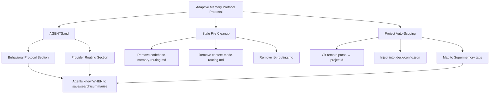

# Proposal: Adaptive Memory Protocol for Deck

## Intent

Deck currently has no provider-agnostic adaptive memory protocol. Engram was previously injected globally via `AGENTS.md`, but it has been removed. Supermemory is configured in `.deck/config.json` with static user/team/org IDs, yet agents have no behavioral instructions on when or how to use it. Additionally, three stale routing instruction files remain from a prior tool setup and need cleanup. Finally, there is no project-level scoping — the project ID should auto-detect from the git repository name rather than require manual configuration.

This change introduces a provider-agnostic adaptive memory protocol that works with Supermemory today and can accommodate future providers, while adding automatic project scoping from git.

## Goal

Equip all Deck agents with a behavioral memory protocol (when to save, search, and summarize) scoped to user, team, organization, and auto-detected project, with provider-agnostic routing that defaults to the configured Supermemory MCP.

## Scope

### In Scope
1. **Add** a provider-agnostic adaptive memory protocol section to `AGENTS.md`
2. **Add** a provider routing section to `AGENTS.md` mapping operations to the active provider's tools
3. **Remove** three stale routing instruction files from `~/.config/opencode/instructions/`:
   - `codebase-memory-routing.md`
   - `context-mode-routing.md`
   - `rtk-routing.md`
4. **Add** `projectId` auto-detection to `.deck/config.json` (derived from git remote repo name)
5. **Verify** all 11 deck skills remain compatible with the new protocol language

### Out of Scope
- Migrating existing Engram memories to Supermemory
- Adding new memory providers beyond Supermemory
- Changing the existing `codebase-memory-mcp` instructions in `AGENTS.md`
- Modifying Supermemory MCP server behavior or tool signatures
- UI or CLI commands for memory management

## Affected Capabilities

### New Capabilities
- `adaptive-memory-protocol`: Provider-agnostic behavioral rules for when agents save, search, and summarize memories
- `project-auto-scoping`: Automatic project ID derivation from git repository name

### Modified Capabilities
- `deck-config-json`: Addition of `projectId` field under `adaptiveMemory` block
- `agents-md`: New memory protocol and routing sections appended

### Unchanged Capabilities
- `codebase-memory-mcp`: Instructions remain as-is; only stale routing file removed
- `supermemory-mcp`: Tool signatures unchanged; only usage instructions added to agents
- `deck-skills`: Existing skill language already compatible ("If a memory adapter is available, you MAY optionally save...")

## Approach

1. **Protocol Section in `AGENTS.md`**  
   Define a behavioral contract: proactive save triggers (decisions, bug fixes, patterns, config changes, discoveries), mandatory session-close summary, topic-key upserts for evolving topics, search-before-action guidance, and the "advisory only" constraint relative to OpenSpec.

2. **Provider Routing Section in `AGENTS.md`**  
   A small routing table mapping generic operations (`save`, `search`, `summarize`) to the active provider's concrete tools. For Supermemory: `supermemory_execute` for saves/queries, `supermemory_search_docs` for retrieval. Future providers add their own row without changing the protocol.

3. **Stale File Cleanup**  
   Delete `~/.config/opencode/instructions/codebase-memory-routing.md`, `context-mode-routing.md`, and `rtk-routing.md`. These are superseded by the unified protocol in `AGENTS.md` and by the package instruction toggles in `.deck/config.json`.

4. **Project Auto-Scoping in `.deck/config.json`**  
   Add `projectId` under `adaptiveMemory`. Derive it at load time from the git remote URL (e.g., extract `deck` from `git@github.com:kevin15011/deck.git`). If extraction fails, fall back to the directory basename. Map `projectId` to Supermemory tags for scoped searches and saves.

5. **Graceful Degradation**  
   If the provider is unavailable, tools are missing, or git detection fails, the protocol must fail open — agents continue working without memory persistence.

## Alternatives and Tradeoffs

| Alternative | Why Considered | Why Not Chosen |
|---|---|---|
| Keep provider-specific instructions in separate files per provider (e.g., `supermemory-routing.md`) | Clean separation, easy to swap | Adds file sprawl; agents need to know which file to read; central `AGENTS.md` is the canonical agent instruction location |
| Hardcode project ID in `config.json` instead of auto-detecting | Simple, explicit | Requires manual update for every repo; violates DRY since git already knows the project name |
| Use a separate memory manifest file outside `AGENTS.md` | Avoids bloating `AGENTS.md` | `AGENTS.md` is the single source of truth for agent behavior; splitting creates indirection |
| Retain stale routing files as "legacy compatibility" | Zero risk of breaking something | Files reference removed tools (Engram) and create confusion; package toggles already handle routing |

## Risks

| Risk | Likelihood | Mitigation |
|---|---|---|
| Existing deck skills reference "adaptive context" in ways that conflict with new protocol language | Low | Audit all 11 skills before merging; existing language is already provider-agnostic |
| Supermemory tool signatures differ from assumed interface in routing section | Low | Verify against actual `supermemory_search_docs` and `supermemory_execute` before finalizing routing; keep routing table minimal and generic |
| Git repo name extraction fails for non-standard remotes (HTTPS, multiple remotes, bare repos) | Medium | Implement robust parser supporting SSH, HTTPS, and local paths; fallback to directory basename; document edge cases |
| Removing routing files breaks older agent sessions that relied on them | Low | These files are static instructions, not runtime dependencies; agents re-read instructions per session |
| `AGENTS.md` becomes too large and unfocused | Medium | Keep memory protocol concise (behavioral rules + routing table); do not duplicate existing package instructions |

## Rollback Plan

1. **Restore `AGENTS.md`**: Remove the memory protocol and routing sections; the `codebase-memory-mcp` block remains untouched.
2. **Restore routing files**: Recover the three deleted `.md` files from git history (they were never tracked in the Deck repo, but user may have backups; otherwise recreate from known content).
3. **Revert `.deck/config.json`**: Remove the `projectId` field from the `adaptiveMemory` block.
4. **Verify skills**: Confirm no skill files were modified during the change.

## Dependencies

- Supermemory MCP server must be installed and available (`supermemory_execute`, `supermemory_search_docs` tools accessible).
- Git must be available in the environment for project auto-detection.
- No external API keys or network dependencies beyond what Supermemory already requires.

## Open Questions

1. Should the protocol include a specific TTL or expiration policy for project-scoped memories vs. user-scoped memories?
2. Do we want to support multiple `projectId` sources (e.g., `.deck/config.json` override takes precedence over git auto-detection)?
3. Should the routing table include explicit mapping for `engram_mem_*` tools as a future provider row, or wait until a second provider is actually integrated?
4. Are there any active workflows or custom scripts that reference the three stale routing files by path?

## Acceptance Direction

- [ ] `AGENTS.md` contains a behavioral memory protocol section and a provider routing section
- [ ] The three stale routing files no longer exist in `~/.config/opencode/instructions/`
- [ ] `.deck/config.json` contains an auto-detected `projectId` mapped to the current git repo name (`deck`)
- [ ] All 11 deck skill files still pass a compatibility check (no broken references to removed files or conflicting language)
- [ ] A test agent session successfully saves and retrieves a scoped memory via Supermemory using only the new protocol

## Next Steps

Ready for Spec (`deck-developer-spec`) and Design (`deck-developer-design`) in parallel.

## Mermaid Summary Source

