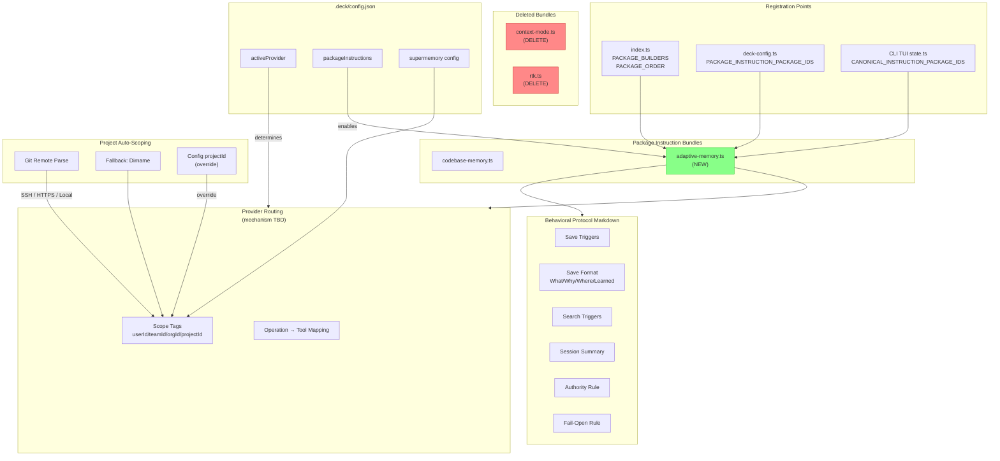

# Spec: Adaptive Memory Protocol — Package Instruction Model

## Source

- Proposal: adaptive-memory-protocol proposal artifact (v2 — package instruction model)
- Capabilities affected: adaptive-memory-bundle (new), package-registration (modified), project-auto-scoping (new), stale-bundle-cleanup (new), skill-compatibility (verified)

## Requirements

### Capability: adaptive-memory-bundle

REQ-BUNDLE-001: A new package instruction bundle file MUST export a builder function that returns a `CapabilityInstructionBundle` containing the provider-agnostic behavioral memory protocol.
  Priority: MUST
  Surface: Integration
  Rationale: The package instruction system is the canonical mechanism for injecting behavioral instructions into agent/skill/session files. The protocol must live in this system, not in AGENTS.md or external routing files.

REQ-BUNDLE-002: The bundle MUST produce fragments for surfaces `"agent"` and `"skill"`. No `"session"` surface is required.
  Priority: MUST
  Surface: Integration
  Rationale: The behavioral protocol applies to agents and skills that perform work. Session files serve a different purpose (global session context).

REQ-BUNDLE-003: The protocol markdown MUST define proactive save triggers for at least: architectural decisions, bug fixes, new patterns or conventions, configuration changes, and important discoveries.
  Priority: MUST
  Surface: General
  Rationale: Without explicit triggers, agents will either never save or save indiscriminately. Defined triggers ensure consistent, useful memory accumulation.

REQ-BUNDLE-004: The protocol markdown MUST define the save format using structured fields: **What** (concise description), **Why** (reasoning), **Where** (files/paths affected), **Learned** (gotchas/edge cases).
  Priority: MUST
  Surface: Data
  Rationale: Structured saves ensure memories are searchable, consistent, and useful across sessions.

REQ-BUNDLE-005: The protocol markdown MUST define reactive search triggers (user says "remember/recall") and proactive search triggers (overlapping past work, similar patterns encountered).
  Priority: MUST
  Surface: General
  Rationale: Search-before-action prevents duplicated work and leverages institutional knowledge.

REQ-BUNDLE-006: The protocol markdown MUST require a session-close summary before the agent ends a session, using a structured format covering Goal, Instructions, Discoveries, Accomplished, Next Steps, and Relevant Files.
  Priority: MUST
  Surface: General
  Rationale: Without mandatory session summaries, cross-session continuity is lost.

REQ-BUNDLE-007: The protocol markdown MUST state an authority rule: OpenSpec artifacts and Spec Registry entries are always authoritative; adaptive memory is advisory and MUST NOT override official artifacts.
  Priority: MUST
  Surface: Security
  Rationale: Prevents memory drift from corrupting the official specification and change history. This rule MUST be consistent with the existing authority rule in `adaptive-context-renderer.ts`.

REQ-BUNDLE-008: The protocol markdown MUST fail open: if the provider is unavailable, tools are missing, or operations error, agents MUST continue working without memory persistence.
  Priority: MUST
  Surface: General
  Rationale: Memory is advisory, not critical-path. Agent functionality must never depend on memory availability.

REQ-BUNDLE-009: The protocol markdown MUST NOT reference any specific provider name, tool name, or MCP server name. All provider-specific details belong in a separate routing concern.
  Priority: MUST
  Surface: General
  Rationale: The protocol defines WHAT to do (save, search, summarize) not HOW or with WHICH tool. Provider names are a routing concern.

REQ-BUNDLE-010: The protocol markdown SHOULD include guidance on topic-key upserts for evolving topics (e.g., architecture decisions that get refined over time).
  Priority: SHOULD
  Surface: General
  Rationale: Evolving topics benefit from updating a single memory entry rather than creating duplicates.

REQ-BUNDLE-011: The protocol markdown SHOULD recommend a maximum number of memories per session to prevent over-saving.
  Priority: SHOULD
  Surface: General
  Rationale: Unbounded saves degrade search quality and increase noise. A soft limit encourages quality over quantity.

REQ-BUNDLE-012: The protocol markdown SHOULD define the scope hierarchy (personal, project, team, org) and when to use each scope level.
  Priority: SHOULD
  Surface: General
  Rationale: Proper scoping prevents cross-project contamination and ensures memories are retrieved at the right granularity.

### Capability: provider-routing-injection

REQ-ROUTE-001: The system MUST inject provider-specific routing information into agent instructions so that agents know which tools to call for save, search, and summarize operations when a provider is active.
  Priority: MUST
  Surface: Integration
  Rationale: The provider-agnostic protocol tells agents WHEN to save/search, but they also need to know WHICH tools to use. This routing must be generated from `.deck/config.json` → `activeProvider`.

REQ-ROUTE-002: The routing information MUST be generated at instruction-build time from the active provider configuration, not hardcoded at development time.
  Priority: MUST
  Surface: Integration
  Rationale: The routing table must adapt when the user switches providers without requiring code changes.

REQ-ROUTE-003: When `activeProvider` is `"none"` or missing, the system MUST omit provider routing but still include the provider-agnostic behavioral protocol.
  Priority: MUST
  Surface: General
  Rationale: The behavioral protocol (when to save, how to format) is useful guidance regardless of whether a provider is active. Routing is the only part that depends on provider availability.

REQ-ROUTE-004: The routing information MUST document the scoping tags (userId, teamId, orgId, projectId) passed to the provider and their source in `.deck/config.json`.
  Priority: SHOULD
  Surface: Integration
  Rationale: Ensures agents attach correct scope tags when calling the provider.

### Capability: package-registration

REQ-REG-001: The `CapabilityInstructionPackageId` type in `instruction-bundles/index.ts` MUST include `"adaptive-memory"` as a valid value.
  Priority: MUST
  Surface: Data
  Rationale: The type system must recognize the new package ID for config validation and bundle building.

REQ-REG-002: The `PACKAGE_BUILDERS` record in `instruction-bundles/index.ts` MUST map `"adaptive-memory"` to the new builder function.
  Priority: MUST
  Surface: Integration
  Rationale: The content registry uses PACKAGE_BUILDERS to resolve enabled packages into instruction bundles.

REQ-REG-003: The `PACKAGE_ORDER` array in `instruction-bundles/index.ts` MUST include `"adaptive-memory"` at a position that ensures memory protocol instructions appear after tool-specific instructions (codebase-memory).
  Priority: MUST
  Surface: Integration
  Rationale: Instruction ordering affects how agents interpret combined guidance. Memory behavioral protocol is higher-level than tool-specific instructions.

REQ-REG-004: The `PACKAGE_INSTRUCTION_PACKAGE_IDS` constant in `deck-config.ts` MUST include `"adaptive-memory"` as a valid value, and the corresponding `PackageInstructionPackageId` type MUST reflect it.
  Priority: MUST
  Surface: Data
  Rationale: Config validation uses this constant to accept or reject package IDs in `.deck/config.json`.

REQ-REG-005: The `CANONICAL_INSTRUCTION_PACKAGE_IDS` constant in the CLI TUI state module MUST include `"adaptive-memory"` as a valid value.
  Priority: MUST
  Surface: UI
  Rationale: The CLI dashboard uses this constant to display available packages for toggling.

REQ-REG-006: Default config defaults in `deck-config.ts` MUST include `"adaptive-memory": false` for all runners (pi, opencode).
  Priority: MUST
  Surface: Data
  Rationale: New packages default to disabled. Users must explicitly enable them.

### Capability: project-auto-scoping

REQ-SCOPE-001: The system MUST auto-detect the project ID from the git repository remote URL and store it as `projectId` in `.deck/config.json` under `adaptiveMemory.supermemory`.
  Priority: MUST
  Surface: Data
  Rationale: Project scoping prevents cross-project memory contamination. Auto-detection from git eliminates manual configuration.

REQ-SCOPE-002: The project ID extraction MUST support SSH URLs (e.g., `git@github.com:user/repo.git`), HTTPS URLs (e.g., `https://github.com/user/repo.git`), and local file paths (e.g., `/home/user/repo`).
  Priority: MUST
  Surface: Data
  Rationale: Git remotes use multiple URL formats. The parser must handle all common variants.

REQ-SCOPE-003: If git remote URL parsing fails, the system MUST fall back to using the repository directory basename as the project ID.
  Priority: MUST
  Surface: General
  Rationale: Graceful degradation ensures project scoping works even in non-standard git setups.

REQ-SCOPE-004: If git is not available or the directory is not a git repository, the system MUST fall back to using the working directory basename as the project ID.
  Priority: MUST
  Surface: General
  Rationale: Covers the case where git is not installed or the project is not version-controlled.

REQ-SCOPE-005: The `projectId` MUST be passed to the active provider as a scoping tag alongside the existing userId, teamId, and orgId.
  Priority: MUST
  Surface: Integration
  Rationale: The four-tag hierarchy (user/team/org/project) enables scoped memory operations at any level.

REQ-SCOPE-006: If `.deck/config.json` already contains a non-empty `projectId` value, that value MUST take precedence over auto-detected values.
  Priority: SHOULD
  Surface: Data
  Rationale: Allows manual override when auto-detection produces an incorrect value.

REQ-SCOPE-007: Project ID auto-detection MUST be triggered during the installer/setup flow (e.g., the CLI TUI "install" action), not at every agent session start.
  Priority: SHOULD
  Surface: General
  Rationale: Auto-detection is a setup-time concern, not a runtime concern. Running it at every session start would be wasteful and could overwrite manual overrides.

### Capability: stale-bundle-cleanup

REQ-CLEANUP-001: The files `context-mode.ts` and `rtk.ts` in the instruction-bundles directory MUST be deleted.
  Priority: MUST
  Surface: General
  Rationale: These bundles are being replaced by the unified adaptive-memory bundle. Their content (tool-specific routing) will be incorporated into the new routing mechanism.

REQ-CLEANUP-002: The imports and references to `buildContextModeInstructionBundle` and `buildRtkInstructionBundle` MUST be removed from `instruction-bundles/index.ts`.
  Priority: MUST
  Surface: Integration
  Rationale: Dead imports cause build failures and confusion.

REQ-CLEANUP-003: The values `"context-mode"` and `"rtk"` MUST be removed from `PACKAGE_BUILDERS`, `PACKAGE_ORDER`, `PACKAGE_INSTRUCTION_PACKAGE_IDS`, `CANONICAL_INSTRUCTION_PACKAGE_IDS`, and all default config defaults.
  Priority: MUST
  Surface: Data
  Rationale: Stale package IDs in the registry cause config validation errors and dashboard inconsistencies.

REQ-CLEANUP-004: After cleanup, the `CapabilityInstructionPackageId` type MUST contain exactly `"codebase-memory"` and `"adaptive-memory"`.
  Priority: MUST
  Surface: Data
  Rationale: The type must reflect the actual set of valid package IDs. Stale IDs must be removed to prevent invalid config.

REQ-CLEANUP-005: No active deck skill or agent instruction file MUST reference any of the two deleted bundle files or their package IDs by name.
  Priority: MUST
  Surface: General
  Rationale: Deleting packages that are still referenced would break agent sessions or config validation.

### Capability: skill-compatibility

REQ-COMPAT-001: All existing deck skills that contain "If a memory adapter is available" language MUST remain compatible with the new protocol without modification to skill files.
  Priority: MUST
  Surface: General
  Rationale: The protocol is additive. Existing skill language must work unchanged to avoid a cascading update across all skills.

REQ-COMPAT-002: The new protocol language MUST NOT contradict or override the existing authority rule already present in deck skills and `adaptive-context-renderer.ts`.
  Priority: MUST
  Surface: Security
  Rationale: Consistency between skill-level, renderer-level, and bundle-level authority rules prevents ambiguity.

## Acceptance Scenarios

### Capability: adaptive-memory-bundle

#### Scenario: Bundle produces agent and skill fragments
**Given** the `adaptive-memory` package instruction bundle is built
**When** the builder function is called
**Then** the returned bundle contains at least two fragments with `surface: "agent"` and `surface: "skill"` respectively, both with `packageId: "adaptive-memory"`
> Covers: REQ-BUNDLE-001, REQ-BUNDLE-002

#### Scenario: Agent proactively saves an architectural decision
**Given** an agent has the adaptive-memory protocol in its instructions
**When** the agent makes an architectural decision (e.g., "Switched from sessions to JWT")
**Then** the agent saves a memory with structured fields: What, Why, Where, Learned — without referencing any specific provider tool name
> Covers: REQ-BUNDLE-003, REQ-BUNDLE-004, REQ-BUNDLE-009

#### Scenario: Agent saves a bug fix
**Given** an agent has the adaptive-memory protocol in its instructions
**When** the agent completes a bug fix
**Then** the agent saves a memory describing what was wrong, why, and how it was fixed, using the structured format
> Covers: REQ-BUNDLE-003, REQ-BUNDLE-004

#### Scenario: Agent searches memory on user request
**Given** a user asks "what did we decide about auth last session?"
**When** the agent processes the request
**Then** the agent searches memory for relevant past decisions before responding
> Covers: REQ-BUNDLE-005

#### Scenario: Agent searches memory proactively on overlapping work
**Given** an agent starts work on a feature
**When** the feature area overlaps with past work (e.g., same module, similar pattern)
**Then** the agent proactively searches memory for relevant past context
> Covers: REQ-BUNDLE-005

#### Scenario: Agent produces session-close summary
**Given** an agent is about to end a session
**When** the session concludes
**Then** the agent produces a structured summary with Goal, Instructions, Discoveries, Accomplished, Next Steps, and Relevant Files sections
> Covers: REQ-BUNDLE-006

#### Scenario: Memory conflicts with OpenSpec artifact
**Given** a memory contains information that contradicts an official OpenSpec artifact
**When** the agent encounters the contradiction
**Then** the agent follows the OpenSpec artifact and ignores the conflicting memory
> Covers: REQ-BUNDLE-007

#### Scenario: Provider is unavailable
**Given** the configured memory provider is not responding or its tools are not available
**When** an agent attempts any memory operation
**Then** the agent continues working normally without saving or searching memory, and does not report an error to the user
> Covers: REQ-BUNDLE-008

#### Scenario: Evolving topic gets updated via topic key
**Given** an agent makes a new observation about an existing architectural topic
**When** the agent saves the memory
**Then** the agent uses a topic key to update the existing memory rather than creating a duplicate
> Covers: REQ-BUNDLE-010

#### Variant: No topic key exists yet
- Given no previous memory exists for this topic
- When the agent saves with a topic key
- Then a new memory is created with that topic key for future updates

#### Scenario: Protocol markdown contains no provider names
**Given** the adaptive-memory bundle is built
**When** the markdown content of all fragments is inspected
**Then** no fragment contains any of: "supermemory", "engram", "mem_save", "mem_search", "mem_session_summary", or any MCP server name
> Covers: REQ-BUNDLE-009

### Capability: provider-routing-injection

#### Scenario: Routing is generated for active supermemory provider
**Given** `.deck/config.json` has `activeProvider: "supermemory"` with valid supermemory config
**When** the instruction bundle is built
**Then** provider-specific routing markdown is included that maps save/search/summarize operations to the active provider's tools
> Covers: REQ-ROUTE-001, REQ-ROUTE-002

#### Scenario: Routing is omitted when no provider is active
**Given** `.deck/config.json` has `activeProvider: "none"` or no `activeProvider` field
**When** the instruction bundle is built
**Then** the provider-agnostic behavioral protocol is still included but no provider routing section is present
> Covers: REQ-ROUTE-003

#### Scenario: Routing documents scope tags
**Given** an agent needs to save a scoped memory and provider routing is active
**When** the agent consults the routing section
**Then** the routing section lists the scoping tags (userId, teamId, orgId, projectId) and identifies their source in `.deck/config.json`
> Covers: REQ-ROUTE-004

### Capability: package-registration

#### Scenario: adaptive-memory appears in config validation
**Given** a `.deck/config.json` with `"packageInstructions": { "opencode": { "adaptive-memory": true } }`
**When** the config is validated
**Then** validation passes without error
> Covers: REQ-REG-001, REQ-REG-004

#### Scenario: adaptive-memory defaults to disabled
**Given** a fresh project with no `.deck/config.json`
**When** default config is generated
**Then** `"adaptive-memory": false` is present under both `pi` and `opencode` in `packageInstructions`
> Covers: REQ-REG-006

#### Scenario: Bundle builder is registered
**Given** the instruction-bundles index module
**When** `PACKAGE_BUILDERS["adaptive-memory"]` is accessed
**Then** it returns a valid builder function that produces a `CapabilityInstructionBundle`
> Covers: REQ-REG-002

#### Scenario: Package order is deterministic
**Given** the `PACKAGE_ORDER` array
**When** inspected
**Then** `"adaptive-memory"` appears after `"codebase-memory"` in the array
> Covers: REQ-REG-003

#### Scenario: CLI TUI includes adaptive-memory
**Given** the CLI TUI dashboard is rendered
**When** the package instructions section is displayed
**Then** `"adaptive-memory"` appears as a toggleable option
> Covers: REQ-REG-005

### Capability: project-auto-scoping

#### Scenario: Project ID extracted from SSH git remote
**Given** the git remote URL is `git@github.com:kevin15011/deck.git`
**When** the system auto-detects the project ID
**Then** the extracted project ID is `deck`
> Covers: REQ-SCOPE-001, REQ-SCOPE-002

#### Scenario: Project ID extracted from HTTPS git remote
**Given** the git remote URL is `https://github.com/kevin15011/deck.git`
**When** the system auto-detects the project ID
**Then** the extracted project ID is `deck`
> Covers: REQ-SCOPE-002

#### Scenario: Project ID extracted from local file path remote
**Given** the git remote URL is `/home/user/my-project`
**When** the system auto-detects the project ID
**Then** the extracted project ID is `my-project`
> Covers: REQ-SCOPE-002

#### Scenario: Git remote URL parsing fails
**Given** the git remote URL is malformed or empty
**When** the system attempts project ID extraction
**Then** the system falls back to the repository directory basename
> Covers: REQ-SCOPE-003

#### Scenario: Directory is not a git repository
**Given** the working directory is not inside a git repository
**When** the system attempts project ID extraction
**Then** the system falls back to the working directory basename
> Covers: REQ-SCOPE-004

#### Scenario: Project ID used as scoping tag
**Given** the system has auto-detected `projectId: "deck"`
**When** an agent saves a memory
**Then** the memory is tagged with `deck` as the project scope alongside userId, teamId, and orgId
> Covers: REQ-SCOPE-005

#### Scenario: Manual projectId override in config
**Given** `.deck/config.json` contains `"projectId": "custom-project"` under `adaptiveMemory.supermemory`
**When** the system resolves the project ID
**Then** it uses `custom-project` instead of auto-detecting from git
> Covers: REQ-SCOPE-006

### Capability: stale-bundle-cleanup

#### Scenario: Stale bundle files are deleted
**Given** the files `context-mode.ts` and `rtk.ts` exist in the instruction-bundles directory
**When** the cleanup is performed
**Then** both files no longer exist in that directory
> Covers: REQ-CLEANUP-001

#### Scenario: Stale references removed from index
**Given** the instruction-bundles `index.ts` previously imported `context-mode` and `rtk` builders
**When** cleanup is complete
**Then** no import statement references `context-mode` or `rtk`, and `PACKAGE_BUILDERS` and `PACKAGE_ORDER` do not contain `"context-mode"` or `"rtk"`
> Covers: REQ-CLEANUP-002

#### Scenario: Stale IDs removed from config schema
**Given** `deck-config.ts` previously had `"context-mode"` and `"rtk"` in `PACKAGE_INSTRUCTION_PACKAGE_IDS`
**When** cleanup is complete
**Then** `PACKAGE_INSTRUCTION_PACKAGE_IDS` contains exactly `["codebase-memory", "adaptive-memory"]`
> Covers: REQ-CLEANUP-003, REQ-CLEANUP-004

#### Scenario: Stale IDs removed from CLI TUI
**Given** `CANONICAL_INSTRUCTION_PACKAGE_IDS` in the TUI state previously included `"context-mode"` and `"rtk"`
**When** cleanup is complete
**Then** the constant contains exactly `["codebase-memory", "adaptive-memory"]`
> Covers: REQ-CLEANUP-003

#### Scenario: No deck file references deleted bundles
**Given** the two bundles have been deleted
**When** all TypeScript files in the project are scanned for references to `buildContextModeInstructionBundle` or `buildRtkInstructionBundle`
**Then** no file contains a reference to either deleted export
> Covers: REQ-CLEANUP-005

### Capability: skill-compatibility

#### Scenario: Existing skill language works with new protocol
**Given** a deck skill contains the phrase "If a memory adapter is available, you MAY optionally save"
**When** the new adaptive-memory package is enabled
**Then** the skill's language remains valid and does not conflict with the protocol
> Covers: REQ-COMPAT-001

#### Scenario: Authority rule is consistent between systems
**Given** the protocol states "OpenSpec artifacts are authoritative; adaptive memory is advisory"
**When** compared to the existing authority rule in `adaptive-context-renderer.ts`
**Then** the two statements are consistent and not contradictory
> Covers: REQ-COMPAT-002

## Validation Rules

| Field / Input | Rule | Error Condition | REQ-ID |
|---|---|---|---|
| `activeProvider` in `.deck/config.json` | MUST be a non-empty string matching a provider config block key, or `"none"` | Missing or empty value — protocol included, routing omitted | REQ-ROUTE-001, REQ-ROUTE-003 |
| `projectId` (auto-detected) | MUST be a non-empty string, stripped of `.git` suffix | Extraction returns empty string — fall back to directory basename | REQ-SCOPE-001, REQ-SCOPE-003 |
| Git remote URL | MUST be parseable to extract repo name | Malformed URL — fall back to directory basename | REQ-SCOPE-002 |
| Save content (What/Why/Where/Learned) | `What` and `Why` MUST be non-empty; `Where` and `Learned` MAY be empty | Missing required fields — skip save, continue session | REQ-BUNDLE-004 |
| Session summary | MUST contain Goal and Accomplished sections at minimum | Missing required sections — attempt best-effort summary | REQ-BUNDLE-006 |
| `adaptive-memory` in `PACKAGE_BUILDERS` | MUST map to a function returning a valid bundle | Missing or invalid builder — build-time TypeScript error | REQ-REG-002 |
| Config with stale package IDs | `"context-mode"` and `"rtk"` are no longer valid package IDs | Config validation rejects unknown package fields | REQ-CLEANUP-003 |

## Error Contracts

| Condition | Behavior | Severity | REQ-ID |
|---|---|---|---|
| Memory provider tools unavailable | Skip all memory operations; agent continues normally | Silent (no user-facing error) | REQ-BUNDLE-008 |
| Memory save operation fails | Log warning; do not retry; continue session | Warning | REQ-BUNDLE-008 |
| Memory search operation fails | Proceed without memory context; do not retry | Silent | REQ-BUNDLE-008 |
| Git not found in PATH | Fall back to directory basename for projectId | Graceful degradation | REQ-SCOPE-004 |
| `.deck/config.json` missing or malformed | Skip memory protocol entirely; agent works without memory | Graceful degradation | REQ-BUNDLE-008 |
| `activeProvider` value has no matching provider config | Routing section omitted; behavioral protocol still active | Graceful degradation | REQ-ROUTE-003 |
| Config references stale package IDs (`context-mode`, `rtk`) | Config validation rejects with `DECK_CONFIG_UNKNOWN_FIELD` error | Error (blocking) | REQ-CLEANUP-003 |

## States and Transitions

> Omitted — no meaningful state lifecycle. The protocol is a behavioral instruction set, not a stateful system.

## Open Questions

1. **Routing Mechanism**: How does provider-specific routing (which tool to call for save/search/summarize) get into agent instructions? Options:
   - **A**: The adaptive-memory builder function accepts config and generates provider-specific routing markdown at bundle-build time. This requires modifying the builder signature or using a different build path.
   - **B**: The existing `AdaptiveMemoryProvider.buildInjection()` system in `packages/core/src/memory/` handles routing injection separately from the package instruction bundle. The bundle provides only behavioral rules.
   - **C**: A hybrid where the package instruction bundle provides behavioral rules and the adaptive memory system provides routing, both composed into the agent file.
   
   The proposal identifies this as a design question. The spec does not prescribe an implementation; the design phase must resolve it.

2. **TTL/Expiration Policy**: Should the protocol include a specific TTL or expiration policy for project-scoped memories vs. user-scoped memories? The proposal flags this but does not provide a direction.

3. **Multiple Project ID Sources**: Should `.deck/config.json` `projectId` override always take precedence over auto-detection, or should there be a merge/inheritance strategy for multi-project setups?

4. **Existing Config Migration**: What happens to users who already have `"context-mode": true` or `"rtk": true` in their `.deck/config.json` when those package IDs are removed? The config validation will reject them with `DECK_CONFIG_UNKNOWN_FIELD`. Should there be a migration step?

5. **Context-Mode and RTK Functionality**: Deleting the context-mode and RTK bundles removes those tool instructions from the package instruction system. Are these tool instructions being relocated to a different delivery mechanism, or are they being removed entirely? If relocated, that mechanism should be specified.

## Compliance Matrix

| REQ-ID | Scenario(s) | Status |
|---|---|---|
| REQ-BUNDLE-001 | Bundle produces agent and skill fragments | Defined |
| REQ-BUNDLE-002 | Bundle produces agent and skill fragments | Defined |
| REQ-BUNDLE-003 | Agent proactively saves an architectural decision, Agent saves a bug fix | Defined |
| REQ-BUNDLE-004 | Agent proactively saves an architectural decision, Agent saves a bug fix | Defined |
| REQ-BUNDLE-005 | Agent searches memory on user request, Agent searches memory proactively | Defined |
| REQ-BUNDLE-006 | Agent produces session-close summary | Defined |
| REQ-BUNDLE-007 | Memory conflicts with OpenSpec artifact | Defined |
| REQ-BUNDLE-008 | Provider is unavailable | Defined |
| REQ-BUNDLE-009 | Protocol markdown contains no provider names | Defined |
| REQ-BUNDLE-010 | Evolving topic gets updated via topic key | Defined |
| REQ-BUNDLE-011 | (Guidance only — no dedicated scenario) | Defined |
| REQ-BUNDLE-012 | (Guidance only — no dedicated scenario) | Defined |
| REQ-ROUTE-001 | Routing generated for active supermemory provider | Defined |
| REQ-ROUTE-002 | Routing generated for active supermemory provider | Defined |
| REQ-ROUTE-003 | Routing omitted when no provider is active | Defined |
| REQ-ROUTE-004 | Routing documents scope tags | Defined |
| REQ-REG-001 | adaptive-memory appears in config validation | Defined |
| REQ-REG-002 | Bundle builder is registered | Defined |
| REQ-REG-003 | Package order is deterministic | Defined |
| REQ-REG-004 | adaptive-memory appears in config validation | Defined |
| REQ-REG-005 | CLI TUI includes adaptive-memory | Defined |
| REQ-REG-006 | adaptive-memory defaults to disabled | Defined |
| REQ-SCOPE-001 | Project ID extracted from SSH git remote | Defined |
| REQ-SCOPE-002 | Project ID from SSH, HTTPS, local path remotes | Defined |
| REQ-SCOPE-003 | Git remote URL parsing fails | Defined |
| REQ-SCOPE-004 | Directory is not a git repository | Defined |
| REQ-SCOPE-005 | Project ID used as scoping tag | Defined |
| REQ-SCOPE-006 | Manual projectId override in config | Defined |
| REQ-SCOPE-007 | (Guidance — triggered during installer flow) | Defined |
| REQ-CLEANUP-001 | Stale bundle files are deleted | Defined |
| REQ-CLEANUP-002 | Stale references removed from index | Defined |
| REQ-CLEANUP-003 | Stale IDs removed from config schema, Stale IDs removed from CLI TUI | Defined |
| REQ-CLEANUP-004 | Stale IDs removed from config schema | Defined |
| REQ-CLEANUP-005 | No deck file references deleted bundles | Defined |
| REQ-COMPAT-001 | Existing skill language works with new protocol | Defined |
| REQ-COMPAT-002 | Authority rule is consistent between systems | Defined |

## Mermaid Summary Source

