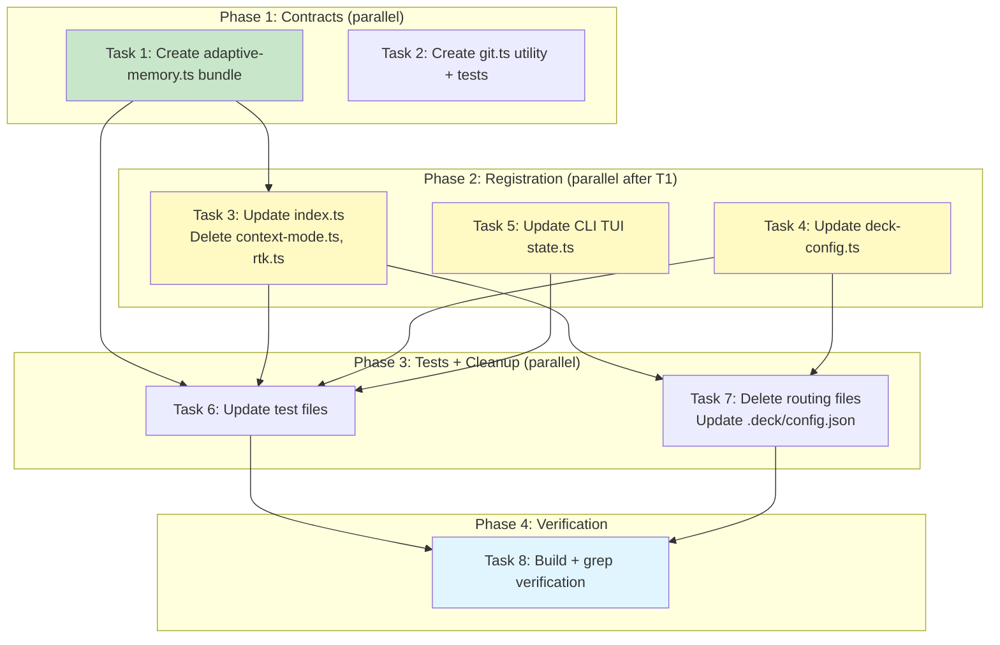

# Tasks: Adaptive Memory Protocol — Package Instruction Model (v2)

## Source

- Spec: adaptive-memory-protocol spec artifact (v2 — package instruction model)
- Design: adaptive-memory-protocol design artifact (v2 — package instruction model)
- Capabilities affected: adaptive-memory-bundle (new), package-registration (modified), project-auto-scoping (new), stale-bundle-cleanup (new), skill-compatibility (verified)

## Task Groups

### Group: Shared / Contracts

#### Task 1: Create adaptive-memory instruction bundle

**Owner**: General Apply
**Priority**: P0
**Complexity**: Medium
**Parallel**: Yes
**Depends on**: none

**Description**
Create `packages/core/src/teams/developer/instruction-bundles/adaptive-memory.ts` exporting `buildAdaptiveMemoryInstructionBundle(): CapabilityInstructionBundle`. The function returns 2 fragments (surface `agent` and `skill`), both with `packageId: "adaptive-memory"`. The markdown content is a provider-agnostic behavioral memory protocol covering:

1. **Save Triggers** (proactive): architectural decisions, bug fixes, new patterns/conventions, configuration changes, important discoveries
2. **Save Format**: structured fields — **What** (required), **Why** (required), **Where** (optional), **Learned** (optional)
3. **Search-Before-Action**: reactive (user says "remember/recall") and proactive (overlapping past work)
4. **Session Summary**: mandatory on close — Goal, Instructions, Discoveries, Accomplished, Next Steps, Relevant Files
5. **Topic Keys**: use topic_key for evolving topics to update a single memory
6. **Session Limit**: soft max of 7 memories per session
7. **Scope Hierarchy**: personal, project, team, org — project scope by default
8. **Authority Rule**: OpenSpec artifacts are authoritative; adaptive memory is advisory and MUST NOT override official artifacts
9. **Fail-Open Rule**: if provider unavailable, tools missing, or operations error, agents MUST continue without memory persistence. No user-facing errors

CRITICAL: The markdown MUST NOT contain any provider name, tool name, or MCP server name (REQ-BUNDLE-009). No "supermemory", "engram", "mem_save", "mem_search", etc.

Follow the same structural pattern as `codebase-memory.ts` — agent surface gets the full protocol (~80 lines), skill surface gets a condensed version (~40 lines).

**Files**
- `packages/core/src/teams/developer/instruction-bundles/adaptive-memory.ts` — create

**Verification**
- Builder returns exactly 2 fragments with surfaces `["agent", "skill"]` and `packageId: "adaptive-memory"`
- Grep all fragment markdown for "supermemory", "engram", "mem_save", "mem_search", "mem_session_summary" → zero matches
- Markdown contains sections for: Save Triggers, Save Format (What/Why/Where/Learned), Search-Before-Action, Session Summary, Authority Rule, Fail-Open Rule
- TypeScript compiles: `bun run tsc --noEmit` passes

---

#### Task 2: Create git utility for project name extraction

**Owner**: General Apply
**Priority**: P1
**Complexity**: Low
**Parallel**: Yes
**Depends on**: none

**Description**
Create `packages/core/src/utils/git.ts` with function `extractProjectNameFromGitRemote(remoteUrl: string): string | undefined`. Extraction rules:

| Input | Result |
|---|---|
| `git@github.com:user/repo.git` | `repo` |
| `https://github.com/user/repo.git` | `repo` |
| `https://github.com/user/repo` | `repo` |
| `ssh://user@host/path/to/repo.git` | `repo` |
| `/local/path/to/repo` | `repo` |

Also add a fallback helper `getProjectFallbackName(projectRoot: string): string` that returns `path.basename(projectRoot)`.

Create `packages/core/src/utils/git.test.ts` with tests for:
- SSH URL extraction
- HTTPS URL with and without `.git` suffix
- Local file path
- Empty/malformed URLs return `undefined`
- Fallback returns directory basename
- Edge cases: trailing slash, multiple `.git` in path

**Files**
- `packages/core/src/utils/git.ts` — create
- `packages/core/src/utils/git.test.ts` — create

**Verification**
- `bun test packages/core/src/utils/git.test.ts` passes all cases
- `extractProjectNameFromGitRemote("git@github.com:kevin15011/deck.git")` returns `"deck"`
- TypeScript compiles

---

### Group: Registration

#### Task 3: Register adaptive-memory and remove stale packages from index.ts

**Owner**: General Apply
**Priority**: P0
**Complexity**: Low
**Parallel**: No — depends on Task 1 (new bundle file must exist for import)
**Depends on**: Task 1

**Description**
Update `packages/core/src/teams/developer/instruction-bundles/index.ts`:

1. **Import**: Remove `import { buildContextModeInstructionBundle } from "./context-mode"` and `import { buildRtkInstructionBundle } from "./rtk"`. Add `import { buildAdaptiveMemoryInstructionBundle } from "./adaptive-memory"`.
2. **Type**: Change `CapabilityInstructionPackageId` from `"codebase-memory" | "context-mode" | "rtk"` to `"codebase-memory" | "adaptive-memory"`.
3. **PACKAGE_BUILDERS**: Remove `"context-mode"` and `rtk` entries. Add `"adaptive-memory": buildAdaptiveMemoryInstructionBundle`.
4. **PACKAGE_ORDER**: Change from `["codebase-memory", "context-mode", "rtk"]` to `["codebase-memory", "adaptive-memory"]`. Adaptive-memory must appear after codebase-memory (REQ-REG-003).

Then **delete** the stale bundle files:
- `packages/core/src/teams/developer/instruction-bundles/context-mode.ts` — delete
- `packages/core/src/teams/developer/instruction-bundles/rtk.ts` — delete

After these changes, `CapabilityInstructionPackageId` MUST contain exactly `"codebase-memory"` and `"adaptive-memory"` (REQ-CLEANUP-004).

**Files**
- `packages/core/src/teams/developer/instruction-bundles/index.ts` — modify
- `packages/core/src/teams/developer/instruction-bundles/context-mode.ts` — delete
- `packages/core/src/teams/developer/instruction-bundles/rtk.ts` — delete

**Verification**
- `buildCapabilityInstructionBundle(["adaptive-memory"])` returns 2 fragments (agent, skill)
- `PACKAGE_ORDER` is `["codebase-memory", "adaptive-memory"]`
- Neither `context-mode.ts` nor `rtk.ts` exist in the instruction-bundles directory
- Grep `index.ts` for "context-mode" and "rtk" → zero matches
- TypeScript compiles

---

#### Task 4: Update deck-config.ts constants and defaults

**Owner**: General Apply
**Priority**: P0
**Complexity**: Low
**Parallel**: Yes (touches different file than Task 3)
**Depends on**: none

**Description**
Update `packages/core/src/config/deck-config.ts`:

1. **`PACKAGE_INSTRUCTION_PACKAGE_IDS`** (line 37): Change from `["codebase-memory", "context-mode", "rtk"]` to `["codebase-memory", "adaptive-memory"]`. The derived type `PackageInstructionPackageId` updates automatically.
2. **`getDefaultDeckConfig()`** (line 119-130): Change default package maps from `{ "codebase-memory": false, "context-mode": false, rtk: false }` to `{ "codebase-memory": false, "adaptive-memory": false }` for both `pi` and `opencode` runners.
3. **`normalizePackageInstructionConfig()`** (lines 341-412): Update the `defaultResult` and `result` objects on lines 347-349 and 370-372 to use `{ "codebase-memory": false, "adaptive-memory": false }` instead of the stale keys.
4. **`PACKAGE_INSTRUCTION_PACKAGE_FIELDS`** (line 113): This set is derived from `PACKAGE_INSTRUCTION_PACKAGE_IDS`, so it updates automatically.

**Files**
- `packages/core/src/config/deck-config.ts` — modify

**Verification**
- `PACKAGE_INSTRUCTION_PACKAGE_IDS` is `["codebase-memory", "adaptive-memory"]` (length 2)
- `getDefaultDeckConfig().packageInstructions.pi` has keys `["codebase-memory", "adaptive-memory"]` both `false`
- `validateDeckConfig({ version: 1, packageInstructions: { pi: { "adaptive-memory": true } } })` succeeds
- `validateDeckConfig({ version: 1, packageInstructions: { pi: { "context-mode": true } } })` throws `DECK_CONFIG_UNKNOWN_FIELD`
- TypeScript compiles

---

#### Task 5: Update CLI TUI state constants

**Owner**: General Apply
**Priority**: P1
**Complexity**: Low
**Parallel**: Yes (touches different file than Tasks 3, 4)
**Depends on**: none

**Description**
Update `apps/cli/src/tui/pi-runner-dashboard/state.ts`:

1. **`CANONICAL_INSTRUCTION_PACKAGE_IDS`** (line 90): Change from `["codebase-memory", "context-mode", "rtk"]` to `["codebase-memory", "adaptive-memory"]`.
2. **`DEFAULT_RUNNER_DASHBOARD_STATE.selectedCapabilities`** (lines 213-217): Change from `{ "context-mode": false, "codebase-memory": false, rtk: false }` to `{ "codebase-memory": false, "adaptive-memory": false }`.
3. **JSDoc comment** (line 127): Update the comment `"codebase-memory, context-mode, rtk"` to `"codebase-memory, adaptive-memory"`.

**Files**
- `apps/cli/src/tui/pi-runner-dashboard/state.ts` — modify

**Verification**
- `CANONICAL_INSTRUCTION_PACKAGE_IDS` equals `["codebase-memory", "adaptive-memory"]`
- `DEFAULT_RUNNER_DASHBOARD_STATE.selectedCapabilities` has no `"context-mode"` or `"rtk"` keys
- TypeScript compiles

---

### Group: Tests

#### Task 6: Update test files for new package IDs

**Owner**: General Apply
**Priority**: P0
**Complexity**: Medium
**Parallel**: No — depends on Tasks 3, 4, 5 (test fixtures must match new types)
**Depends on**: Task 3, Task 4, Task 5

**Description**
Update test files to reflect the removal of `context-mode`/`rtk` and addition of `adaptive-memory`.

**`packages/core/src/teams/developer/instruction-bundles/index.test.ts`**:
1. `makeConfig()` helper (lines 16-33): Replace `"context-mode"` and `rtk` with `"adaptive-memory"` in all package maps
2. "multiple packages" test (line 55): Change from `["codebase-memory", "context-mode", "rtk"]` to `["codebase-memory", "adaptive-memory"]`, expect 4 fragments (2 per package), update assertions
3. "deduplicates" test (line 79): Replace `"context-mode"` with `"adaptive-memory"`
4. "each fragment has surface" test (line 91): Replace `["codebase-memory", "context-mode", "rtk"]` with `["codebase-memory", "adaptive-memory"]`, update `toBeOneOf` array
5. "getEnabledPackageInstructionIds" tests: Update all fixtures using stale IDs to use `"adaptive-memory"` instead
6. "canonical order" test (line 151): Update expected order to `["codebase-memory", "adaptive-memory"]`
7. "multiple matching fragments" test (line 244): Replace `"context-mode"` with `"adaptive-memory"`, update `toContain` to match new bundle heading

**`packages/core/src/config/deck-config.test.ts`**:
1. "PACKAGE_INSTRUCTION_PACKAGE_IDS" test (lines 56-63): Change from 3 items to 2, assert `"codebase-memory"` and `"adaptive-memory"`, remove `"context-mode"` and `"rtk"` assertions
2. "returns provider none defaults" test (lines 70-83): Update expected default to use `"adaptive-memory": false` instead of stale keys
3. "defaults all package instruction toggles" test (lines 97-106): Update assertions for `"adaptive-memory"` instead of stale keys
4. "accepts valid per-runner" test (lines 108-123): Use `"adaptive-memory"` instead of `"context-mode"` and `rtk`
5. "treats null config" test (lines 137-146): Update assertions
6. "rejects unknown package ID" test (lines 162-174): Keep using a truly unknown ID like `"unknown-pkg"` (this stays the same)
7. "rejects non-boolean" tests: Replace stale IDs with `"adaptive-memory"` in field path assertions
8. "accepts all booleans" test (lines 244-259): Update to use `"adaptive-memory"` in input
9. "persists packageInstructions" test (lines 377-399): Replace stale IDs with `"adaptive-memory"`
10. "round-trip" test (lines 419-439): Replace stale IDs with `"adaptive-memory"`

**Files**
- `packages/core/src/teams/developer/instruction-bundles/index.test.ts` — modify
- `packages/core/src/config/deck-config.test.ts` — modify

**Verification**
- `bun test packages/core/src/teams/developer/instruction-bundles/index.test.ts` — all tests pass
- `bun test packages/core/src/config/deck-config.test.ts` — all tests pass
- No test references `"context-mode"` or `"rtk"` as valid package IDs

---

### Group: Cleanup

#### Task 7: Delete stale routing files and update project config

**Owner**: General Apply
**Priority**: P1
**Complexity**: Low
**Parallel**: No — depends on Tasks 3, 4 (code changes must be stable first)
**Depends on**: Task 3, Task 4

**Description**
Delete the 3 stale routing instruction files from `~/.config/opencode/instructions/`:
- `codebase-memory-routing.md` — delete
- `context-mode-routing.md` — delete
- `rtk-routing.md` — delete

Update `.deck/config.json`:
1. Add `"projectId": "deck"` inside `adaptiveMemory.supermemory`
2. Add `"packageInstructions"` section with `"adaptive-memory": true` for both runners
3. Remove any `"context-mode"` or `"rtk"` keys if present (they shouldn't be, since the current config has no `packageInstructions` section)

Target `.deck/config.json`:
```json
{
  "version": 1,
  "adaptiveMemory": {
    "activeProvider": "supermemory",
    "supermemory": {
      "mcpServerName": "supermemory",
      "searchMode": "memories",
      "maxMemoriesPerSession": 7,
      "userId": "kevin",
      "projectId": "deck",
      "teamId": "developer",
      "orgId": "GCO"
    }
  },
  "packageInstructions": {
    "pi": { "codebase-memory": true, "adaptive-memory": true },
    "opencode": { "codebase-memory": true, "adaptive-memory": true }
  }
}
```

**Files**
- `~/.config/opencode/instructions/codebase-memory-routing.md` — delete
- `~/.config/opencode/instructions/context-mode-routing.md` — delete
- `~/.config/opencode/instructions/rtk-routing.md` — delete
- `.deck/config.json` — modify

**Verification**
- None of the 3 routing files exist at `~/.config/opencode/instructions/`
- `.deck/config.json` has `projectId: "deck"` under `adaptiveMemory.supermemory`
- `.deck/config.json` has `packageInstructions` with both runners having `"adaptive-memory": true`
- Config validates: `readDeckConfig(projectRoot)` succeeds

---

### Group: Verification

#### Task 8: Build verification and broken-reference scan

**Owner**: General Apply
**Priority**: P1
**Complexity**: Low
**Parallel**: No — depends on all prior tasks
**Depends on**: Task 6, Task 7

**Description**
Run full verification to confirm no broken references remain:

1. **TypeScript build**: `bun run tsc --noEmit` in project root — must pass
2. **Test suite**: Run all modified test files — must pass
3. **Grep for stale references**: Search all `.ts` files in the project for:
   - `"context-mode"` as a string literal → zero matches in source (tests may reference it in error-path tests)
   - `"rtk"` as a package ID string → zero matches (watch out for unrelated uses like "cert", "sort", etc.)
   - `buildContextModeInstructionBundle` → zero matches
   - `buildRtkInstructionBundle` → zero matches
   - `context-mode.ts` import → zero matches
4. **Skill compatibility**: Grep all `SKILL.md` files under `.opencode/skills/deck-developer-*` and `~/.config/opencode/skills/` for references to any deleted routing file names. Confirm zero matches.
5. **Protocol content check**: Verify the adaptive-memory bundle markdown contains no provider-specific names (run the same grep as Task 1 verification).

**Files**
- (no file changes — read-only verification)

**Verification**
- TypeScript compiles cleanly
- All tests pass
- Grep scan reports zero stale references in source code
- Skill files contain no broken references to deleted files

## Dependency Graph

```
Task 1 (adaptive-memory bundle) ──→ Task 3 (index.ts + delete stale bundles) ──┐
                                                                                  ├──→ Task 6 (update tests) ──→ Task 8 (verification)
Task 2 (git utility) ──────────────────────────────────────────────────────────┘     │
                                                                                  │
Task 4 (deck-config.ts) ───────────────────────────────────────────────────────┤    │
                                                                               │    │
Task 5 (CLI TUI state.ts) ─────────────────────────────────────────────────────┘    │
                                                                                      │
Task 4 (deck-config.ts) ──→ Task 7 (delete routing files + config.json) ────────────┘
```

## Parallelization Plan

| Phase | Tasks | Can Run in Parallel |
|---|---|---|
| Contracts | Task 1, Task 2 | Yes — independent new files |
| Registration | Task 3, Task 4, Task 5 | Yes — Task 3 depends on Task 1; Tasks 4, 5 are independent of each other and Task 1 |
| Tests | Task 6 | No — depends on Tasks 3, 4, 5 |
| Cleanup | Task 7 | No — depends on Tasks 3, 4; can run in parallel with Task 6 |
| Verification | Task 8 | No — depends on Tasks 6, 7 |

## Responsibility Contracts

| Contract / Boundary | Owner | Consumers | Notes |
|---|---|---|---|
| `CapabilityInstructionPackageId` type | Task 3 (index.ts) | Task 6 (tests) | Must be `"codebase-memory" \| "adaptive-memory"` — stale IDs removed |
| `PackageInstructionPackageId` type | Task 4 (deck-config.ts) | Task 6 (tests), Task 7 (config) | Derived from `PACKAGE_INSTRUCTION_PACKAGE_IDS` const — automatically in sync |
| `CANONICAL_INSTRUCTION_PACKAGE_IDS` | Task 5 (state.ts) | CLI TUI dashboard | Must match the other two types' values |
| Adaptive-memory bundle markdown | Task 1 | Runtime agents/skills | Provider-agnostic; no tool names or provider names |
| `extractProjectNameFromGitRemote()` | Task 2 | Task 7 (populates config projectId) | Standalone utility; no runtime coupling |

## Complexity Summary

| Complexity | Count | Task Numbers |
|---|---|---|
| Low | 6 | 2, 3, 4, 5, 7, 8 |
| Medium | 2 | 1, 6 |
| High | 0 | — |

## Flagged for Splitting

None — all tasks are within single-session scope. Task 6 (test updates) touches 2 test files with ~30 assertions total but is repetitive mechanical work (search-and-replace of stale IDs).

## Review Workload Forecast

| Signal | Value |
|---|---|
| Estimated changed lines | 100-400 |
| 400-line budget risk | Low |
| Scope reduction recommended | No |
| Sequential work slices recommended | No |
| Decision needed before Apply | No |

**Rationale**: Task 1 is the largest single change (~120 lines new file). Tasks 2-5 are small constant updates across multiple files (~20-30 lines each). Task 6 updates test fixtures mechanically (~40 lines changed). Task 7 deletes 3 files and modifies config.json (~3 lines). Task 8 is read-only. Net impact: ~+250 lines added, ~-250 lines removed (including deleted stale bundles). Well within the 400-line budget.

## Open Questions / Blockers

None — tasks are ready for Apply.

The open questions from the Spec (TTL policy, multi-project ID sources, context-mode/RTK functionality relocation) are advisory and documented for future consideration. They do not block this implementation:

- **TTL/Expiration**: No TTL fields exist in the current schema. Adding them is a future enhancement.
- **Multi-project IDs**: Single projectId is sufficient for the current architecture.
- **Context-mode/RTK relocation**: Their tool-routing instructions were already redundant with the package instruction system. Context-mode and RTK continue to function as installed MCP tools; only their instruction bundles are removed.
- **Config migration**: Users with `context-mode: true` or `rtk: true` in their config will get a validation error. The CLI TUI installer should handle this gracefully (auto-strip unknown keys), but that is outside the scope of this change.

## Mermaid Summary Source


