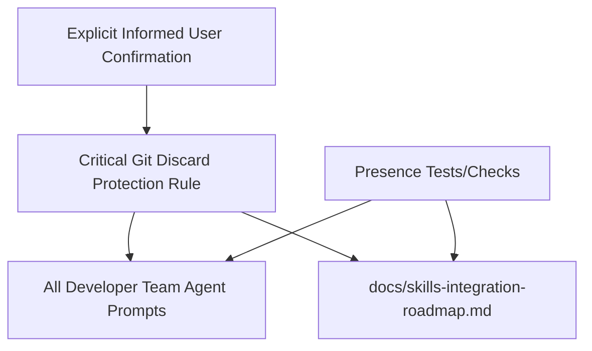

# Proposal: Add Critical Git Safety Rule

## Intent

Prevent Developer Team agents from discarding, rewriting, or permanently deleting Git/worktree changes without explicit, fully informed user authorization. Current guidance is partial and mostly post-incident/advisory, leaving a prevention gap across agent prompts and the roadmap.

## Goal

All Developer Team agent prompts and the skills integration roadmap explicitly contain a critical no-discard Git safety rule with a clear confirmation path for user-approved exceptions.

## Scope

### In Scope
- Add a critical Git discard protection rule to all Developer Team agent prompt content: Orchestrator, Explorer, Proposal, Spec, Design, Task, Apply Backend, Apply Frontend, Apply General, Verify, Review, and Archive.
- Cover destructive/discarding Git operations including hard/mixed/soft reset, worktree/staged restore, checkout forms that discard work or switch context unsafely, clean, stash drop/clear, and history-rewriting rebase commands.
- Define the exception path: warn about consequences, require explicit confirmation in a new message, and execute only when the user repeats/provides the exact command with awareness of data loss.
- Update `docs/skills-integration-roadmap.md` to reflect this critical safety rule as part of Developer Team skill/prompt integration.
- Add or update tests/checks that verify the rule is present across all required agent prompt sources and roadmap documentation.

### Out of Scope
- Implementing runtime-specific launcher, shell hook, or MCP command blocking.
- Changing Git workflow behavior unrelated to destructive/discarding operations.
- Adding broader destructive-operation policies for non-Git commands such as `rm -rf` or database wipes.
- Creating a standalone `git-safety` skill in this change.

## Affected Capabilities

> This section is the contract between Proposal and Spec/Design phases.

### New Capabilities
- `developer-team-git-discard-protection`: Developer Team agents refuse destructive Git discard/rewrite commands unless the user follows an explicit informed-confirmation flow.

### Modified Capabilities
- `developer-team-agent-prompts`: Agent prompts gain a uniform critical Git safety rule across all Developer Team roles.
- `skills-integration-roadmap`: Roadmap reflects Git safety as a tracked Developer Team prompt/skill integration concern.

### Unchanged Capabilities
- `developer-team-git-suggestions`: Non-destructive Git suggestions and archive-phase Git guidance remain advisory unless they involve discard/rewrite operations.
- `openspec-change-workflow`: Proposal, Spec, Design, Task, Apply, Verify, Review, and Archive phase semantics remain unchanged.

## Approach

Use the Explorer-recommended broad prompt coverage approach: add the same critical no-discard Git safety rule to each Developer Team agent prompt source, preferably in a consistent high-visibility safety section near existing role constraints/non-goals. Update roadmap documentation and add verification that checks every required agent and the roadmap include the rule.

## Alternatives and Tradeoffs

| Alternative | Why Considered | Why Not Chosen |
|---|---|---|
| Orchestrator-only rule | Lowest-effort central prevention | Does not protect sub-agents invoked outside Orchestrator. |
| Every agent prompt source | Strongest environment-agnostic coverage | Higher maintenance burden, but best matches critical safety intent. |
| Standalone `git-safety` skill | DRY single source of truth | Requires new skill/runtime-loading assumptions; deferred to avoid under-enforcement. |
| Hybrid Orchestrator + Apply/Archive only | Covers highest-risk agents with less churn | Leaves Explorer/Proposal/Spec/Design/Task/Verify/Review gaps. |

## Risks

| Risk | Likelihood | Mitigation |
|---|---|---|
| Over-blocking legitimate user-requested Git operations | Medium | Keep an explicit informed-confirmation exception path. |
| Inconsistent wording across agents | Medium | Use one canonical rule text and test presence across required files. |
| Missing an agent prompt source | Medium | Maintain an explicit required-agent list in tests/checks. |
| Ambiguous destructive-command examples | Low | Spec phase should define exact command families and safe exception behavior. |
| Roadmap update drifts from prompt implementation | Low | Verify roadmap mention in the same change validation. |

## Rollback Plan

Revert the prompt-safety additions, roadmap update, and associated presence tests/checks from this change. Because the change is documentation/prompt/test focused, rollback should restore previous agent prompt text and roadmap content without data migration. Do not use destructive Git commands for rollback; use normal file edits or an explicitly reviewed revert workflow.

## Dependencies

- Existing Developer Team prompt source files under `packages/core/src/teams/developer/`.
- Existing roadmap document at `docs/skills-integration-roadmap.md`.
- Existing test/check framework capable of asserting generated prompt/source text content.

## Open Questions

- Should the Orchestrator system prompt receive the same rule in addition to agent/skill prompt content?
- Should a future separate change create broader destructive-operation protection for non-Git commands?
- Should checkout branch switching be scoped more narrowly to only forms that can discard or obscure uncommitted work?

## Acceptance Direction

- [ ] Every Developer Team agent prompt source contains the canonical critical Git discard protection rule.
- [ ] `docs/skills-integration-roadmap.md` documents the safety rule as part of Developer Team prompt/skill integration.
- [ ] Tests/checks fail if any required Developer Team agent prompt source omits the rule.
- [ ] The rule includes destructive Git command coverage, explicit warning behavior, new-message confirmation, exact-command repetition, and supersedence over conflicting instructions.
- [ ] No runtime-specific launcher or shell-hook behavior is required for acceptance.

## Next Steps

Ready for Spec (`deck-developer-spec`) and Design (`deck-developer-design`) in parallel.

## Mermaid Summary Source

