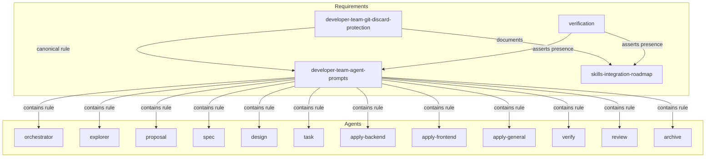

# Spec: Add Critical Git Safety Rule

## Source

- Proposal: `add-critical-git-safety-rule` proposal artifact
- Exploration: `add-critical-git-safety-rule` exploration artifact
- Capabilities affected: `developer-team-git-discard-protection` (new), `developer-team-agent-prompts` (modified), `skills-integration-roadmap` (modified)

---

## Blocker Classification

**Classification: Non-blocking — no external dependencies or unresolved blockers.**

All required files exist, the rule is documentation/prompt/test focused, and no runtime or external system changes are required.

---

## Requirements

### Capability: developer-team-git-discard-protection (new)

REQ-GDP-001: Every Developer Team agent MUST refuse to execute destructive Git discard/rewrite commands unless the user has completed an explicit informed-confirmation flow.
  Priority: MUST
  Surface: General
  Rationale: Core safety guarantee — agents must never silently discard user work.

REQ-GDP-002: Destructive Git commands MUST include at minimum: `git reset --hard`, `git reset --mixed`, `git reset --soft`, `git restore --staged`, `git restore` (worktree), `git checkout -- <path>`, `git clean -fd`, `git clean -fdx`, `git stash drop`, `git stash clear`, `git rebase -i`, `git rebase --onto`, and any other command that irrevocably discards uncommitted or unpushed work.
  Priority: MUST
  Surface: General
  Rationale: Explicit enumeration prevents ambiguity about which commands are blocked.

REQ-GDP-003: When a user requests a destructive Git command, the agent MUST respond with: (a) a plain-language explanation of what the command does, (b) a statement that the operation is irreversible, and (c) a requirement that the user confirms in a separate new message — not as part of a larger request.
  Priority: MUST
  Surface: General
  Rationale: Informed consent requires the user to understand consequences before confirming.

REQ-GDP-004: After the agent delivers the warning, the agent MUST NOT execute the command until the user explicitly repeats or provides the exact command in a follow-up message that confirms awareness of data loss.
  Priority: MUST
  Surface: General
  Rationale: Prevents accidental confirmation buried in multi-part instructions.

REQ-GDP-005: The safety rule MUST explicitly state that it supersedes all other agent instructions, including any conflicting guidance in the agent's role definition, skill content, or delegated task description.
  Priority: MUST
  Surface: General
  Rationale: Ensures the rule cannot be overridden by agent-specific logic.

REQ-GDP-006: Non-destructive Git operations (e.g., `git status`, `git diff`, `git log`, `git stash`, `git commit`, `git add`, safe `git checkout` to an existing branch with no uncommitted changes) SHOULD NOT be blocked by this rule.
  Priority: SHOULD
  Surface: General
  Rationale: Prevents over-blocking that would impair normal workflow.

REQ-GDP-007: The canonical rule text MUST be identical across all agent prompt sources to ensure uniform behavior regardless of which agent handles the request.
  Priority: MUST
  Surface: General
  Rationale: Differing wording creates enforcement gaps or inconsistent user experience.

REQ-GDP-008: `git checkout` to switch branches SHOULD be treated as destructive only when the switch would discard or obscure uncommitted work; safe branch switches with a clean working tree need not trigger the confirmation flow.
  Priority: SHOULD
  Surface: General
  Rationale: Addresses open question from proposal about scoping checkout more narrowly.

### Capability: developer-team-agent-prompts (modified)

REQ-AP-001: The following 12 Developer Team agent prompt source files MUST each contain the canonical Git discard protection rule: `orchestrator-content.ts`, `explorer-content.ts`, `proposal-content.ts`, `spec-content.ts`, `design-content.ts`, `task-content.ts`, `apply-backend-content.ts`, `apply-frontend-content.ts`, `apply-general-content.ts`, `verify-content.ts`, `review-content.ts`, `archive-content.ts`.
  Priority: MUST
  Surface: Data
  Rationale: Broadest coverage eliminates environment-specific enforcement gaps.

REQ-AP-002: The rule MUST be placed in a clearly labeled high-visibility section (e.g., "CRITICAL SAFETY RULE — Git Discard Protection") within each agent's prompt content, positioned near existing role constraints or non-goals for discoverability.
  Priority: MUST
  Surface: General
  Rationale: Visibility ensures agents and maintainers can find and audit the rule.

REQ-AP-003: The Orchestrator system prompt (if it exists as a separate artifact from the Orchestrator agent body) SHOULD also contain the canonical rule.
  Priority: SHOULD
  Surface: General
  Rationale: Session-level enforcement adds defense-in-depth; deferred pending open question resolution.

### Capability: skills-integration-roadmap (modified)

REQ-SIR-001: `docs/skills-integration-roadmap.md` MUST document the critical Git discard protection rule as a tracked Developer Team prompt/skill integration concern.
  Priority: MUST
  Surface: General
  Rationale: Keeps roadmap accurate as a reference for safety rule status.

REQ-SIR-002: The roadmap entry MUST reference the rule's scope (all Developer Team agents) and the canonical rule text location.
  Priority: MUST
  Surface: General
  Rationale: Traceability from roadmap to implementation.

### Capability: verification (cross-cutting)

REQ-VER-001: Automated tests or checks MUST exist that fail if any of the 12 required agent prompt source files omits the canonical Git discard protection rule text.
  Priority: MUST
  Surface: General
  Rationale: Prevents regression where an agent is updated or added without the rule.

REQ-VER-002: Automated tests or checks MUST fail if `docs/skills-integration-roadmap.md` omits a reference to the Git discard protection rule.
  Priority: MUST
  Surface: General
  Rationale: Ensures roadmap stays in sync with prompt implementation.

---

## Acceptance Scenarios

### Capability: developer-team-git-discard-protection

#### Scenario: Agent blocks destructive reset without confirmation
**Given** a Developer Team agent is processing a user request
**When** the user asks the agent to run `git reset --hard HEAD~1`
**Then** the agent MUST NOT execute the command and MUST respond with a warning explaining: (1) the command will discard uncommitted changes and move HEAD back, (2) this is irreversible, and (3) the user must confirm in a new message by repeating the exact command
> Covers: REQ-GDP-001, REQ-GDP-002, REQ-GDP-003, REQ-GDP-004

#### Scenario: Agent blocks stash drop without confirmation
**Given** a Developer Team agent is processing a user request
**When** the user asks the agent to run `git stash drop`
**Then** the agent MUST NOT execute the command and MUST deliver the informed-confirmation warning before proceeding
> Covers: REQ-GDP-001, REQ-GDP-002, REQ-GDP-003

#### Scenario: Agent executes destructive command after explicit confirmation
**Given** a Developer Team agent has warned the user about a destructive command and the consequences
**When** the user sends a new separate message explicitly repeating the exact destructive command (e.g., `git reset --hard HEAD~1`) and confirming awareness of data loss
**Then** the agent MAY execute the command as requested
> Covers: REQ-GDP-004

#### Scenario: Agent refuses confirmation buried in multi-part request
**Given** a Developer Team agent has warned the user about a destructive command
**When** the user includes the confirmation within a larger request (e.g., "yes go ahead and also run the tests and update the README")
**Then** the agent MUST NOT execute the destructive command and MUST reiterate that confirmation must be in a separate message
> Covers: REQ-GDP-003, REQ-GDP-004

#### Scenario: Safety rule supersedes conflicting instructions
**Given** a Developer Team agent has a task description that says "clean up and reset to a known state"
**When** the agent would need to run `git reset --hard` to fulfill the task
**Then** the agent MUST apply the confirmation flow before executing, regardless of the task instruction, because the safety rule supersedes all other instructions
> Covers: REQ-GDP-005

#### Scenario: Non-destructive Git operations proceed normally
**Given** a Developer Team agent is processing a user request
**When** the user asks the agent to run `git status`, `git diff`, or `git log`
**Then** the agent executes the command without requiring confirmation
> Covers: REQ-GDP-006

#### Scenario: Safe branch switch proceeds without confirmation
**Given** a Developer Team agent is processing a user request AND the working tree is clean
**When** the user asks the agent to run `git checkout main`
**Then** the agent MAY execute the command without the confirmation flow
> Covers: REQ-GDP-006, REQ-GDP-008

#### Scenario: Unsafe branch switch triggers confirmation
**Given** a Developer Team agent is processing a user request AND the working tree has uncommitted changes that would be overwritten or lost
**When** the user asks the agent to run `git checkout other-branch`
**Then** the agent MUST apply the confirmation flow before executing
> Covers: REQ-GDP-002, REQ-GDP-008

#### Scenario: Canonical text is identical across all agents
**Given** all 12 Developer Team agent prompt source files
**When** the canonical Git discard protection rule text is extracted from each
**Then** the text MUST be byte-identical across all 12 files
> Covers: REQ-GDP-007, REQ-AP-001

### Capability: developer-team-agent-prompts

#### Scenario: All 12 agents contain the rule
**Given** the Developer Team agent prompt source files
**When** each of the 12 files is searched for the canonical rule text
**Then** every file MUST contain the rule
> Covers: REQ-AP-001

#### Scenario: Rule is in a labeled high-visibility section
**Given** a Developer Team agent prompt source file
**When** the file content is examined
**Then** the rule MUST appear under a section heading that contains "CRITICAL SAFETY" or equivalent high-visibility label, positioned near existing role constraints or non-goals
> Covers: REQ-AP-002

#### Scenario: New agent added without rule fails verification
**Given** a new Developer Team agent prompt source file is added
**When** the verification test suite runs
**Then** the test MUST fail if the new file does not contain the canonical rule
> Covers: REQ-VER-001

### Capability: skills-integration-roadmap

#### Scenario: Roadmap documents the safety rule
**Given** `docs/skills-integration-roadmap.md`
**When** the file content is examined
**Then** it MUST contain a reference to the critical Git discard protection rule as a Developer Team integration concern
> Covers: REQ-SIR-001

#### Scenario: Roadmap references rule scope and location
**Given** the roadmap entry for the Git safety rule
**When** the entry is examined
**Then** it MUST state the scope (all Developer Team agents) and reference where the canonical rule text lives
> Covers: REQ-SIR-002

#### Scenario: Roadmap omission fails verification
**Given** `docs/skills-integration-roadmap.md` is edited to remove the safety rule reference
**When** the verification test suite runs
**Then** the test MUST fail
> Covers: REQ-VER-002

---

## Validation Rules

| Field / Input | Rule | Error Message | REQ-ID |
|---|---|---|---|
| Agent prompt source file | Must contain canonical rule text | "Agent prompt missing Git discard protection rule" | REQ-AP-001 |
| Canonical rule text | Must be byte-identical across all 12 agents | "Git safety rule text mismatch between agents" | REQ-GDP-007 |
| Roadmap file | Must contain Git safety rule reference | "Roadmap missing Git discard protection rule reference" | REQ-SIR-001 |
| Confirmation message | Must be a separate user message, not embedded in larger request | "Confirmation must be in a separate message" | REQ-GDP-003 |

## Error Contracts

| Condition | Error Code | Message | Context |
|---|---|---|---|
| Agent attempts destructive Git command without prior user confirmation | RULE_VIOLATION_GIT_DISCARD | "Cannot execute {command}: this is a destructive Git operation. {explanation}. To proceed, send a new message with the exact command." | Agent response to user |
| Verification test finds agent without rule | TEST_FAIL_AGENT_MISSING_RULE | "Required agent {filename} does not contain the canonical Git discard protection rule" | CI/test output |
| Verification test finds roadmap without rule | TEST_FAIL_ROADMAP_MISSING_RULE | "skills-integration-roadmap.md does not reference the Git discard protection rule" | CI/test output |

## States and Transitions

> No meaningful state lifecycle exists for this change. The rule is a static prompt inclusion, not a stateful system.

## Open Questions

1. **OQ-1**: Should the Orchestrator system prompt (separate from Orchestrator AGENT_BODY) also receive the rule? (Affects REQ-AP-003 priority escalation.)
2. **OQ-2**: Should `git checkout` branch switching be scoped more narrowly to only forms that can discard or obscure uncommitted work? (Addressed as SHOULD in REQ-GDP-008; exact scoping deferred to Design/implementation.)
3. **OQ-3**: Should a future separate change create broader destructive-operation protection for non-Git commands (e.g., `rm -rf`, database wipes)? (Out of scope for this change; flagged for roadmap consideration.)

## Compliance Matrix

| REQ-ID | Scenario(s) | Status |
|---|---|---|
| REQ-GDP-001 | Agent blocks destructive reset without confirmation, Agent blocks stash drop without confirmation | Defined |
| REQ-GDP-002 | Agent blocks destructive reset without confirmation, Unsafe branch switch triggers confirmation | Defined |
| REQ-GDP-003 | Agent blocks destructive reset without confirmation, Agent refuses confirmation buried in multi-part request | Defined |
| REQ-GDP-004 | Agent executes destructive command after explicit confirmation, Agent refuses confirmation buried in multi-part request | Defined |
| REQ-GDP-005 | Safety rule supersedes conflicting instructions | Defined |
| REQ-GDP-006 | Non-destructive Git operations proceed normally, Safe branch switch proceeds without confirmation | Defined |
| REQ-GDP-007 | Canonical text is identical across all agents | Defined |
| REQ-GDP-008 | Safe branch switch proceeds without confirmation, Unsafe branch switch triggers confirmation | Defined |
| REQ-AP-001 | All 12 agents contain the rule, Canonical text is identical across all agents | Defined |
| REQ-AP-002 | Rule is in a labeled high-visibility section | Defined |
| REQ-AP-003 | — (SHOULD; depends on OQ-1 resolution) | Defined |
| REQ-SIR-001 | Roadmap documents the safety rule | Defined |
| REQ-SIR-002 | Roadmap references rule scope and location | Defined |
| REQ-VER-001 | New agent added without rule fails verification | Defined |
| REQ-VER-002 | Roadmap omission fails verification | Defined |

## Mermaid Summary Source

