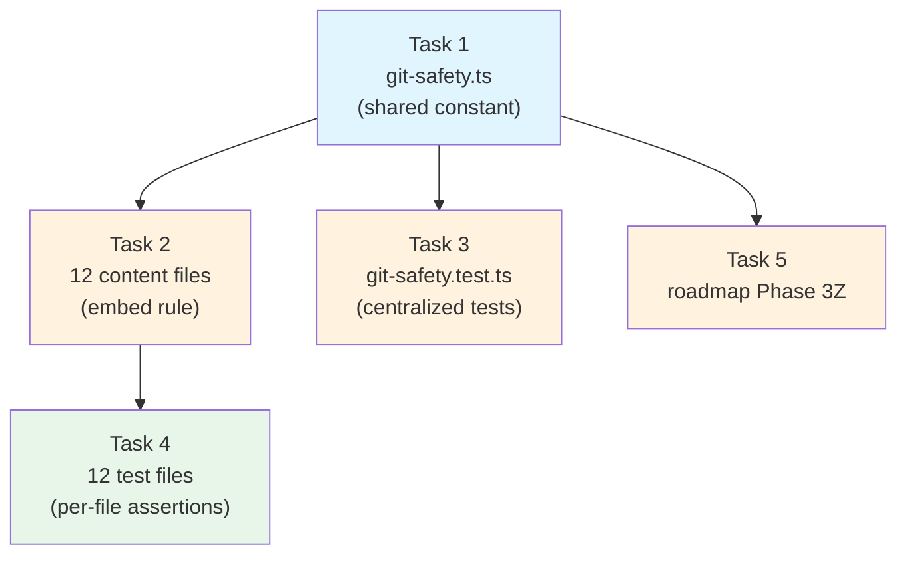

# Tasks: Add Critical Git Safety Rule

## Source

- Spec: `add-critical-git-safety-rule` spec artifact
- Design: `add-critical-git-safety-rule` design artifact
- Capabilities affected: `developer-team-git-discard-protection` (new), `developer-team-agent-prompts` (modified), `skills-integration-roadmap` (modified), `verification` (cross-cutting)

## Constraint

**Critical instruction from Orchestrator**: Do not run destructive git commands during any task execution.

---

## Task Groups

### Group: Shared / Contracts

#### Task 1: Create canonical rule module `git-safety.ts`

**Owner**: General Apply
**Priority**: P0 (blocking)
**Complexity**: Low
**Parallel**: Yes
**Depends on**: none

**Description**

Create `packages/core/src/teams/developer/git-safety.ts` as the single source of truth. Export:

1. `GIT_DISCARD_PROTECTION_RULE: string` — the canonical rule text covering all requirements from REQ-GDP-001 through REQ-GDP-008. The text must include:
   - A clearly labeled high-visibility heading: `"## CRITICAL SAFETY RULE — Git Discard Protection"`
   - Explicit enumeration of destructive commands: `git reset --hard`, `git reset --mixed`, `git reset --soft`, `git restore --staged`, `git restore` (worktree), `git checkout -- <path>`, `git clean -fd`, `git clean -fdx`, `git stash drop`, `git stash clear`, `git rebase -i`, `git rebase --onto`, and any other command that irrevocably discards uncommitted or unpushed work
   - Informed-confirmation flow: (a) plain-language explanation of consequences, (b) statement that the operation is irreversible, (c) requirement that the user confirms in a separate new message with the exact command
   - Explicit supersedence clause: the rule overrides all other agent instructions, including role definitions, skill content, and delegated task descriptions
   - Safe-operation exceptions: `git status`, `git diff`, `git log`, `git stash`, `git commit`, `git add`, safe `git checkout` to an existing branch with a clean working tree
   - Scoped checkout guidance: `git checkout` branch switching triggers the flow only when it would discard or obscure uncommitted work

2. `GIT_SAFETY_SENTINEL: string` — a short unique sentinel string (e.g., `"CRITICAL_SAFETY_GIT_DISCARD_PROTECTION"`) embedded in the rule, used for reliable presence detection in tests.

3. `assertGitSafetyRulePresent(body: string, label: string): void` — a helper that throws if the sentinel is absent from the given body string, with a descriptive error including the label.

**Files**
- `packages/core/src/teams/developer/git-safety.ts` — create

**Verification**
- File compiles with `bun build --no-bundle packages/core/src/teams/developer/git-safety.ts`
- Exports are accessible: `GIT_DISCARD_PROTECTION_RULE`, `GIT_SAFETY_SENTINEL`, `assertGitSafetyRulePresent`
- REQ-GDP-007 (byte-identical text) is structurally enforced by having a single constant

---

### Group: Content Integration

#### Task 2: Embed rule in all 12 Developer Team content files

**Owner**: General Apply
**Priority**: P0 (blocking)
**Complexity**: Medium
**Parallel**: No — depends on Task 1
**Depends on**: Task 1

**Description**

Modify each of the 12 content files to import `GIT_DISCARD_PROTECTION_RULE` from `./git-safety` and concatenate it into both `*_AGENT_BODY` and `*_SKILL_BODY`.

For each file:
1. Add `import { GIT_DISCARD_PROTECTION_RULE } from "./git-safety";` at the top
2. Append the rule to `*_AGENT_BODY` after the existing `## Non-Goals` section: `${existingBody}\n\n${GIT_DISCARD_PROTECTION_RULE}`
3. Append the rule to `*_SKILL_BODY` after the existing `## Rules` section: `${existingBody}\n\n${GIT_DISCARD_PROTECTION_RULE}`

Files to modify (all under `packages/core/src/teams/developer/`):
- `orchestrator-content.ts`
- `explorer-content.ts`
- `proposal-content.ts`
- `spec-content.ts`
- `design-content.ts`
- `task-content.ts`
- `apply-backend-content.ts`
- `apply-frontend-content.ts`
- `apply-general-content.ts`
- `verify-content.ts`
- `review-content.ts`
- `archive-content.ts`

**CRITICAL**: Do NOT modify `visual-explanations-content.ts` — it is not in scope for Developer Team agents.

**Files**
- `packages/core/src/teams/developer/orchestrator-content.ts` — modify
- `packages/core/src/teams/developer/explorer-content.ts` — modify
- `packages/core/src/teams/developer/proposal-content.ts` — modify
- `packages/core/src/teams/developer/spec-content.ts` — modify
- `packages/core/src/teams/developer/design-content.ts` — modify
- `packages/core/src/teams/developer/task-content.ts` — modify
- `packages/core/src/teams/developer/apply-backend-content.ts` — modify
- `packages/core/src/teams/developer/apply-frontend-content.ts` — modify
- `packages/core/src/teams/developer/apply-general-content.ts` — modify
- `packages/core/src/teams/developer/verify-content.ts` — modify
- `packages/core/src/teams/developer/review-content.ts` — modify
- `packages/core/src/teams/developer/archive-content.ts` — modify

**Verification**
- `bun test packages/core/src/teams/developer/` passes (existing tests continue to pass)
- Grep for `GIT_DISCARD_PROTECTION_RULE` import in all 12 files confirms presence
- REQ-AP-001 (all 12 agents contain the rule), REQ-AP-002 (high-visibility labeled section)

---

### Group: Verification / Testing

#### Task 3: Create centralized presence and structural test suite

**Owner**: General Apply
**Priority**: P0 (blocking)
**Complexity**: Medium
**Parallel**: No — depends on Task 1
**Depends on**: Task 1

**Description**

Create `packages/core/src/teams/developer/git-safety.test.ts` containing:

1. **Rule-content structural test**: Asserts that `GIT_DISCARD_PROTECTION_RULE` contains all required destructive-command families (one sentinel per family: `git reset --hard`, `git restore --staged`, `git checkout --`, `git clean -fd`, `git stash drop`, `git rebase -i`) and all four required behavior elements (explicit warning, new-message confirmation, exact-command repetition, supersedence clause). Covers REQ-GDP-002, REQ-GDP-003, REQ-GDP-004, REQ-GDP-005.

2. **Cross-agent presence test**: Imports all 12 content modules and asserts `GIT_SAFETY_SENTINEL` is present in every `*_AGENT_BODY` (12 checks) and every `*_SKILL_BODY` (12 checks) — 24 total surface assertions. Covers REQ-VER-001, REQ-AP-001, REQ-GDP-007.

3. **Byte-identity test**: Extracts the rule text from each of the 24 surfaces (by matching the sentinel-delimited block) and asserts all 24 extractions are byte-identical. Covers REQ-GDP-007.

4. **Roadmap presence test**: Reads `docs/skills-integration-roadmap.md` and asserts a sentinel phrase (e.g., `"Critical Git Discard Protection"` or `"Phase 3Z"`) appears. Covers REQ-VER-002, REQ-SIR-001.

Use `bun:test` (`describe`/`test`/`expect`). No new test framework or dependencies.

**Files**
- `packages/core/src/teams/developer/git-safety.test.ts` — create

**Verification**
- `bun test packages/core/src/teams/developer/git-safety.test.ts` passes (after Task 2 completes)
- All 24 surface assertions pass
- Roadmap assertion passes (after Task 5 completes)

---

#### Task 4: Add per-file test assertions to 12 existing test files

**Owner**: General Apply
**Priority**: P1 (important)
**Complexity**: Low
**Parallel**: No — depends on Task 2
**Depends on**: Task 1, Task 2

**Description**

Add 1–2 assertions to each of the 12 existing `*-content.test.ts` files to create a per-file defense-in-depth layer. Each test file already imports its `*_AGENT_BODY` and `*_SKILL_BODY`. Add:

```typescript
test("contains critical Git discard protection rule", () => {
  expect(AGENT_BODY).toContain("CRITICAL SAFETY RULE — Git Discard Protection");
  expect(SKILL_BODY).toContain("CRITICAL SAFETY RULE — Git Discard Protection");
});
```

Place the new test at the end of the primary `describe` block in each file. This pattern matches the existing assertion style in `design-content.test.ts` (e.g., `does not contain old artifact-store mode selection`).

Files to modify (all under `packages/core/src/teams/developer/`):
- `orchestrator-content.test.ts`, `explorer-content.test.ts`, `proposal-content.test.ts`, `spec-content.test.ts`, `design-content.test.ts`, `task-content.test.ts`, `apply-backend-content.test.ts`, `apply-frontend-content.test.ts`, `apply-general-content.test.ts`, `verify-content.test.ts`, `review-content.test.ts`, `archive-content.test.ts`

**Files**
- `packages/core/src/teams/developer/orchestrator-content.test.ts` — modify
- `packages/core/src/teams/developer/explorer-content.test.ts` — modify
- `packages/core/src/teams/developer/proposal-content.test.ts` — modify
- `packages/core/src/teams/developer/spec-content.test.ts` — modify
- `packages/core/src/teams/developer/design-content.test.ts` — modify
- `packages/core/src/teams/developer/task-content.test.ts` — modify
- `packages/core/src/teams/developer/apply-backend-content.test.ts` — modify
- `packages/core/src/teams/developer/apply-frontend-content.test.ts` — modify
- `packages/core/src/teams/developer/apply-general-content.test.ts` — modify
- `packages/core/src/teams/developer/verify-content.test.ts` — modify
- `packages/core/src/teams/developer/review-content.test.ts` — modify
- `packages/core/src/teams/developer/archive-content.test.ts` — modify

**Verification**
- `bun test packages/core/src/teams/developer/` passes — all existing and new assertions green
- Each test file's new assertion independently validates presence in its own module

---

### Group: Documentation

#### Task 5: Update skills-integration roadmap with Phase 3Z

**Owner**: General Apply
**Priority**: P1 (important)
**Complexity**: Low
**Parallel**: No — depends on Task 1
**Depends on**: Task 1

**Description**

Add a new subsection to `docs/skills-integration-roadmap.md` documenting the Git safety rule as a tracked Developer Team prompt/skill integration concern. Insert as a new top-level section or as "Phase 3Z — Cross-cutting Git safety rule" after the existing Phase 3 phases, before Section 7 (Immediate Next Recovery Steps).

The entry must include:
1. Rule name: "Critical Git Discard Protection Rule"
2. Scope: all 12 Developer Team agents
3. Canonical rule text location: `packages/core/src/teams/developer/git-safety.ts` (`GIT_DISCARD_PROTECTION_RULE`)
4. Surfaces: both `*_AGENT_BODY` and `*_SKILL_BODY` in each content module
5. Verification: `git-safety.test.ts` centralized presence + structural test
6. Rationale: addresses data-loss gap identified after working-tree reset incident (roadmap line 3–4)
7. Status: implemented

Covers REQ-SIR-001, REQ-SIR-002.

**Files**
- `docs/skills-integration-roadmap.md` — modify

**Verification**
- File contains "Critical Git Discard Protection" (or equivalent sentinel matching Task 3's assertion)
- File contains reference to `git-safety.ts` as canonical rule location
- File states scope as "all Developer Team agents"

---

## Dependency Graph

```
Task 1 (git-safety.ts)
  ├── Task 2 (embed in 12 content files)
  │     └── Task 4 (per-file test assertions)
  ├── Task 3 (centralized test suite)
  └── Task 5 (roadmap update)
```

## Parallelization Plan

| Phase | Tasks | Can Run in Parallel |
|---|---|---|
| Phase 1 (Contracts) | Task 1 | Yes — no dependencies |
| Phase 2 (Integration + Testing + Docs) | Task 2, Task 3, Task 5 | Yes — all depend only on Task 1, mutually independent |
| Phase 3 (Defense-in-depth) | Task 4 | No — depends on Task 2 |

## Responsibility Contracts

| Contract / Boundary | Owner | Consumers | Notes |
|---|---|---|---|
| `GIT_DISCARD_PROTECTION_RULE` constant | General Apply (Task 1) | Task 2, Task 3 | Single source of truth. All 24 surfaces derive from this one constant. |
| `GIT_SAFETY_SENTINEL` constant | General Apply (Task 1) | Task 3 | Used for reliable presence detection across all surfaces. |
| `assertGitSafetyRulePresent()` helper | General Apply (Task 1) | Task 3, Task 4 | Throws on absence; enables both centralized and per-file checks. |
| Content module body exports (`*_AGENT_BODY`, `*_SKILL_BODY`) | General Apply (Task 2) | Task 3, Task 4 | String contract preserved; rule appended additively. |
| Roadmap sentinel phrase | General Apply (Task 5) | Task 3 | Must match the sentinel asserted in the centralized test. |

## Complexity Summary

| Complexity | Count | Task Numbers |
|---|---|---|
| Low | 3 | Task 1, Task 4, Task 5 |
| Medium | 2 | Task 2, Task 3 |
| High | 0 | — |

## Flagged for Splitting

None — no task exceeds medium complexity or touches 4+ independent concerns. Task 2 touches 12 files but applies an identical 3-line pattern to each, making it mechanical rather than complex.

## Review Workload Forecast

| Signal | Value |
|---|---|
| Estimated changed lines | 100–400 (~330 estimated) |
| 400-line budget risk | Low |
| Scope reduction recommended | No |
| Sequential work slices recommended | No — 3 execution phases is already minimal |
| Decision needed before Apply | No |

**Rationale**: This change is content-only (TypeScript string constants + markdown). No runtime behavior, no schema, no API, no database. The largest task (Task 2) is mechanical: identical import+append pattern across 12 files. Task 3 creates a new test file with ~120 lines of assertions. Total estimated changed lines ~330, comfortably under 400-line budget. No architectural decisions remain open — all were resolved in Design.

## Open Questions / Blockers

- **OQ-1** (from Spec): Should the Orchestrator system prompt (separate from AGENT_BODY) also receive the rule? — Marked as SHOULD in REQ-AP-003. Not blocking for Apply. If escalated later, a small augmentation to `content-registry.ts` would be needed. **Classification: allowed-with-stub** — Task 2 adds the rule to orchestrator AGENT_BODY and SKILL_BODY, which is sufficient for the MUST-tier requirements.
- **OQ-2** (from Spec): Exact scoping of `git checkout` branch switching — Addressed in rule text via REQ-GDP-008 (SHOULD). The canonical rule text in Task 1 will include the scoped guidance. **Classification: non-blocking**.
- **OQ-3** (from Spec): Broader destructive-operation protection for non-Git commands — Out of scope. Flagged for roadmap. **Classification: non-blocking**.

> All open questions are classified. Tasks are ready for Apply.

## Mermaid Summary Source


