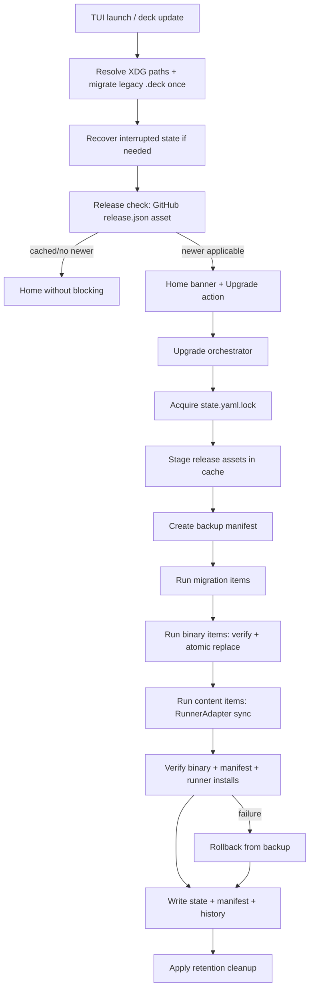
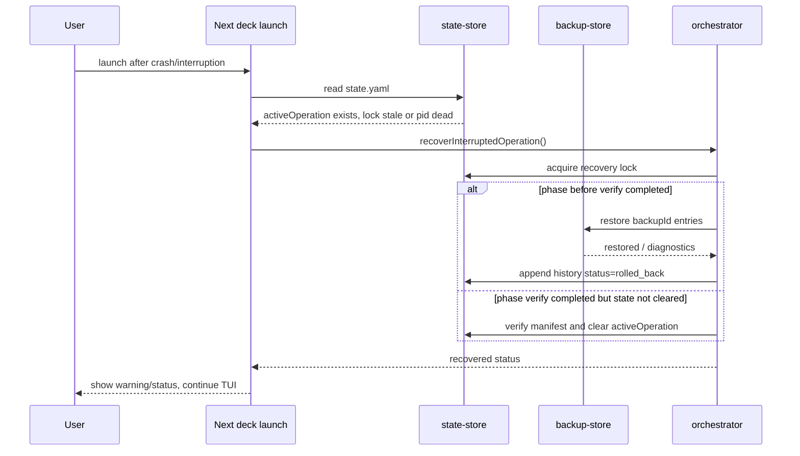
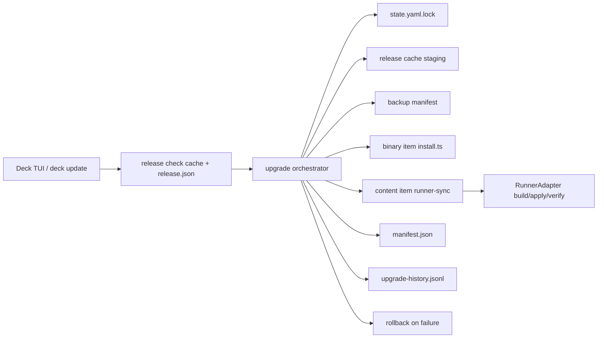

# Design: Add Self-Update System

## Source

- Proposal: `add-self-update-system` proposal artifact
- Capabilities affected: `release-descriptor-detection`, `tui-upgrade-notification`, `xdg-deck-storage`, `legacy-deck-config-migration`, `atomic-upgrade-rollback`, `runner-upgrade-sync`, `deck-upgrade-command`, `github-release-download`, `binary-install-replace`, `tui-home-menu`, `runner-adapter-composition`, `release-pipeline`
- Spec status: not yet available (Spec runs in parallel)
- Registry mode: deferred; this document is written without modifying `state.yaml` or `events.yaml`.

## 1. Architecture Overview

### Current Architecture Context

- `apps/cli/src/upgrade-command/index.ts` is a binary-only CLI orchestrator: checks GitHub, compares versions, prompts, then calls `performUpgrade()`.
- `apps/cli/src/upgrade-command/github-release.ts` fetches GitHub Release data through `curl`, picks a platform tarball by name, and extracts SHA-256 from release body text.
- `apps/cli/src/upgrade-command/install.ts` downloads/extracts/verifies/replaces the binary with a local `.backup` and rollback on replace failure.
- `apps/cli/src/runtime/paths.ts` currently resolves legacy/global `config.json` under `~/.config/.deck/` or `~/.deck/`, not the proposed XDG split.
- `packages/core/src/config/deck-config.ts` owns existing JSON Deck config (`version`, `adaptiveMemory`, `packageInstructions`, `orchestratorPersonality`, `profiles`, `activeProfile`).
- `packages/core/src/runner-adapter.ts` already exposes install/backup/rollback/verify hooks usable for runner sync.
- `apps/cli/src/runner-adapters.ts` is the concrete adapter registry composition root (`pi`, `opencode`).
- TUI home currently renders static menu options; `upgrade-tools` is a placeholder and has no action handler.
- Release workflow currently uploads platform tarballs and `checksums.txt`, but no rich `release.json` descriptor.

### Upgrade Flow Diagram



### Module Map

| Component | Responsibility | Change Type |
|---|---|---|
| `apps/cli/src/upgrade-command/index.ts` | CLI entry point; delegates to new orchestrator; keeps confirmations/version behavior | modified |
| `apps/cli/src/upgrade-command/github-release.ts` | Fetch/cached descriptor lookup and compatibility helpers | modified |
| `apps/cli/src/upgrade-command/install.ts` | Binary download/extract/checksum/atomic replace primitives | modified |
| `apps/cli/src/upgrade-command/orchestrator.ts` | Ordered release item execution, lock, backup, rollback, verification | new |
| `apps/cli/src/upgrade-command/release-descriptor.ts` | `release.json` parsing, platform selection, checksum lookup | new |
| `apps/cli/src/upgrade-command/state-store.ts` | `state.yaml`, lock, history pointer, interrupted state recovery | new |
| `apps/cli/src/upgrade-command/manifest-store.ts` | Deck-owned file inventory and schema migrations | new |
| `apps/cli/src/upgrade-command/backup-store.ts` | Backup manifests, restore, retention | new |
| `apps/cli/src/upgrade-command/runner-sync.ts` | Detect installed runners and re-apply Deck content with `RunnerAdapter` | new |
| `apps/cli/src/upgrade-command/xdg-migration.ts` | One-shot legacy `~/.config/.deck/` → XDG migration | new |
| `apps/cli/src/runtime/paths.ts` | Add XDG config/state/cache path resolver; keep legacy compatibility reads | modified |
| `apps/cli/src/tui/app.tsx` | Non-blocking release check state and user-triggered upgrade action | modified |
| `apps/cli/src/tui/screens/home-screen.tsx` | Render upgrade banner/status | modified |
| `apps/cli/src/menu-options.ts` | Replace placeholder with explicit upgrade/update action label | modified |
| `packages/core/src/runner-adapter.ts` | Add optional runner detection/sync metadata hooks only if existing methods cannot express sync safely | modified optional |
| `packages/core/src/config/deck-config.ts` | Keep JSON config as sync source of truth; may expose global XDG JSON helpers | modified minimal |
| `.github/workflows/release.yml` | Attach `release.json` with assets/checksums | modified |
| `scripts/build-binaries.ts` | Emit machine-readable asset metadata for descriptor generation | modified |
| `scripts/prepare-release.ts` | Generate/validate release descriptor | new |

### RunnerAdapter Reuse Strategy

- Reuse:
  - `listAdapters()` from `apps/cli/src/runner-adapters.ts` to enumerate candidates.
  - `RunnerAdapter.buildDeveloperTeamInstallPlan()` to regenerate Deck-managed content from existing selections.
  - `RunnerAdapter.backupDeveloperTeamFiles()`, `rollbackDeveloperTeamFiles()`, `applyDeveloperTeamInstall()`, and `verifyDeveloperTeamInstall()` for per-runner safety.
- Add:
  - `runner-sync.ts` composes existing adapter calls in `--sync` semantics: no package installs, only Deck-generated prompts/skills/subagents/MCP config where applicable.
  - Optional adapter facet only if needed by implementation: `detectDeckInstall(input): RunnerDeckInstallStatus` returning managed config paths and whether Deck artifacts exist. First implementation may use filesystem scan outside the adapter to avoid widening the core contract prematurely.
- Do not add `installs.json`; existing `config.json` / normalized `DeckConfig.packageInstructions[runnerId]` remains canonical for selections.

## 2. Schemas

### `state.yaml` — `~/.local/state/deck/state.yaml`

- Purpose: update state, lock visibility, last release check, active operation, and history pointer.
- Migration: versioned; unknown future `schemaVersion` causes read-only fail-safe.

```ts
import { z } from "zod";

export interface DeckUpdateStateYaml {
  schemaVersion: 1;
  currentVersion: string;
  installKind: "binary" | "homebrew" | "development" | "unknown";
  lock?: {
    active: boolean;
    pid?: number;
    operationId?: string;
    startedAt?: string;
    staleAfterSeconds: 900;
  };
  lastCheck?: {
    checkedAt: string;
    channel: "stable" | "beta" | "dev";
    latestVersion?: string;
    releaseJsonCachePath?: string;
    etag?: string;
    result: "available" | "none" | "network-error" | "blocked";
  };
  activeOperation?: {
    id: string;
    version: string;
    phase: "staging" | "backup" | "migration" | "binary" | "content" | "verify" | "rollback";
    backupId?: string;
    releaseCachePath?: string;
    startedAt: string;
  };
  installHistory: {
    path: string; // ~/.local/state/deck/history/upgrade-history.jsonl
    retention: { maxEntries: 100; maxAgeDays: 180 };
  };
}

export const DeckUpdateStateYamlSchema = z.object({
  schemaVersion: z.literal(1),
  currentVersion: z.string().min(1),
  installKind: z.enum(["binary", "homebrew", "development", "unknown"]),
  lock: z.object({
    active: z.boolean(), pid: z.number().int().positive().optional(), operationId: z.string().optional(),
    startedAt: z.string().datetime().optional(), staleAfterSeconds: z.literal(900),
  }).optional(),
  lastCheck: z.object({
    checkedAt: z.string().datetime(), channel: z.enum(["stable", "beta", "dev"]), latestVersion: z.string().optional(),
    releaseJsonCachePath: z.string().optional(), etag: z.string().optional(),
    result: z.enum(["available", "none", "network-error", "blocked"]),
  }).optional(),
  activeOperation: z.object({
    id: z.string(), version: z.string(),
    phase: z.enum(["staging", "backup", "migration", "binary", "content", "verify", "rollback"]),
    backupId: z.string().optional(), releaseCachePath: z.string().optional(), startedAt: z.string().datetime(),
  }).optional(),
  installHistory: z.object({
    path: z.string(), retention: z.object({ maxEntries: z.literal(100), maxAgeDays: z.literal(180) }),
  }),
});
```

### `manifest.json` — `~/.local/state/deck/manifest.json`

- Purpose: Deck-owned file inventory; rollback and drift detection.
- Migration strategy:
  - `schemaVersion` migrates one version at a time through internal pure functions: `migrateManifestV1ToV2`, `migrateManifestV2ToV3`, etc.
  - Before migration, write a backup under `~/.cache/deck/backups/<ts>/manifest.pre-migration.json`.
  - Migration writes `manifest.json.tmp`, fsyncs where available, then renames atomically.
  - Missing optional fields get defaults; missing required `path` or checksum-like identity marks entry `unmanaged` and excludes it from mutation.
  - Future schema versions are rejected with a clear error; no clean reinstall.

```ts
import { z } from "zod";

export interface DeckManifestJson {
  schemaVersion: 2;
  generatedAt: string;
  deckVersion: string;
  files: DeckManifestFile[];
}

export interface DeckManifestFile {
  path: string; // absolute path
  owner: "deck" | "runner:pi" | "runner:opencode" | `runner:${string}`;
  checksum: { algorithm: "sha256"; value: string };
  deck_version: string;
  kind: "binary" | "config" | "prompt" | "skill" | "subagent" | "mcp" | "state" | "content";
  sourceItemId?: string;
  lastWrittenAt: string;
}

export const DeckManifestFileSchema = z.object({
  path: z.string().min(1),
  owner: z.union([z.enum(["deck", "runner:pi", "runner:opencode"]), z.string().regex(/^runner:/)]),
  checksum: z.object({ algorithm: z.literal("sha256"), value: z.string().regex(/^[a-f0-9]{64}$/) }),
  deck_version: z.string().min(1),
  kind: z.enum(["binary", "config", "prompt", "skill", "subagent", "mcp", "state", "content"]),
  sourceItemId: z.string().optional(),
  lastWrittenAt: z.string().datetime(),
});

export const DeckManifestJsonSchema = z.object({
  schemaVersion: z.literal(2), generatedAt: z.string().datetime(), deckVersion: z.string(),
  files: z.array(DeckManifestFileSchema),
});
```

### `config.yaml` — `~/.config/deck/config.yaml`

- Coexists with existing `config.json`; it does **not** replace JSON in this change.
- `config.json` remains canonical for existing Deck selections (`packageInstructions`, memory, personality, profiles) and sync source-of-truth.
- `config.yaml` owns updater preferences and a non-canonical snapshot of last-known selections for release-check UX/recovery.
- Legacy `~/.config/.deck/config.json` migrates to `~/.config/deck/config.json` for compatibility with existing core JSON APIs.

```ts
import { z } from "zod";

export interface DeckUpdaterConfigYaml {
  schemaVersion: 1;
  channel: "stable" | "beta" | "dev";
  auto_update: false; // reserved; upgrades remain explicit
  releaseCheck: { enabled: boolean; timeoutMs: 5000; cacheTtlSeconds: 21600 };
  lastKnownSelections?: {
    packageInstructions?: Record<string, Record<string, boolean>>;
    adaptiveMemoryProvider?: string;
    orchestratorPersonality?: "guia" | "pragmatica";
    activeProfile?: string;
  };
}

export const DeckUpdaterConfigYamlSchema = z.object({
  schemaVersion: z.literal(1),
  channel: z.enum(["stable", "beta", "dev"]).default("stable"),
  auto_update: z.literal(false).default(false),
  releaseCheck: z.object({ enabled: z.boolean().default(true), timeoutMs: z.literal(5000), cacheTtlSeconds: z.literal(21600) }),
  lastKnownSelections: z.object({
    packageInstructions: z.record(z.string(), z.record(z.string(), z.boolean())).optional(),
    adaptiveMemoryProvider: z.string().optional(),
    orchestratorPersonality: z.enum(["guia", "pragmatica"]).optional(),
    activeProfile: z.string().optional(),
  }).optional(),
});
```

### `release.json` — GitHub Release asset

```ts
import { z } from "zod";

export interface DeckReleaseJson {
  schemaVersion: 1;
  version: string;
  tag: string;
  channel: "stable" | "beta" | "dev";
  publishedAt: string;
  minDeckVersion?: string;
  notesUrl?: string;
  items: ReleaseItem[];
}

export type ReleaseItem =
  | BinaryReleaseItem | ContentReleaseItem | MigrationReleaseItem | AdvisoryReleaseItem | ChannelEolReleaseItem;

export interface BaseReleaseItem {
  id: string;
  kind: "binary" | "content" | "migration" | "advisory" | "channel_eol";
  required: boolean;
  minDeckVersion?: string;
}

export interface BinaryReleaseItem extends BaseReleaseItem {
  kind: "binary";
  platform: "linux-x64" | "linux-arm64" | "darwin-arm64" | string;
  assetName: string;
  url: string;
  checksum: { algorithm: "sha256"; value: string; target: "archive" | "binary" };
}

export interface ContentReleaseItem extends BaseReleaseItem {
  kind: "content";
  assetName: string;
  url: string;
  checksum: { algorithm: "sha256"; value: string };
  contentKinds: Array<"prompts" | "skills" | "subagents" | "mcp" | "packageInstructions">;
}

export interface MigrationReleaseItem extends BaseReleaseItem {
  kind: "migration";
  migrationId: string;
  fromSchema: { manifest?: number; state?: number; config?: number };
  toSchema: { manifest?: number; state?: number; config?: number };
}

export interface AdvisoryReleaseItem extends BaseReleaseItem { kind: "advisory"; severity: "info" | "warning" | "critical"; message: string; url?: string; }
export interface ChannelEolReleaseItem extends BaseReleaseItem { kind: "channel_eol"; channel: string; message: string; migrateToChannel?: string; }

export const DeckReleaseJsonSchema: z.ZodType<DeckReleaseJson> = z.object({
  schemaVersion: z.literal(1), version: z.string(), tag: z.string(), channel: z.enum(["stable", "beta", "dev"]),
  publishedAt: z.string().datetime(), minDeckVersion: z.string().optional(), notesUrl: z.string().url().optional(),
  items: z.array(z.discriminatedUnion("kind", [
    z.object({ id: z.string(), kind: z.literal("binary"), required: z.boolean(), minDeckVersion: z.string().optional(), platform: z.string(), assetName: z.string(), url: z.string().url(), checksum: z.object({ algorithm: z.literal("sha256"), value: z.string().regex(/^[a-f0-9]{64}$/), target: z.enum(["archive", "binary"]) }) }),
    z.object({ id: z.string(), kind: z.literal("content"), required: z.boolean(), minDeckVersion: z.string().optional(), assetName: z.string(), url: z.string().url(), checksum: z.object({ algorithm: z.literal("sha256"), value: z.string().regex(/^[a-f0-9]{64}$/) }), contentKinds: z.array(z.enum(["prompts", "skills", "subagents", "mcp", "packageInstructions"])) }),
    z.object({ id: z.string(), kind: z.literal("migration"), required: z.boolean(), minDeckVersion: z.string().optional(), migrationId: z.string(), fromSchema: z.record(z.string(), z.number()).optional(), toSchema: z.record(z.string(), z.number()).optional() }),
    z.object({ id: z.string(), kind: z.literal("advisory"), required: z.boolean(), minDeckVersion: z.string().optional(), severity: z.enum(["info", "warning", "critical"]), message: z.string(), url: z.string().url().optional() }),
    z.object({ id: z.string(), kind: z.literal("channel_eol"), required: z.boolean(), minDeckVersion: z.string().optional(), channel: z.string(), message: z.string(), migrateToChannel: z.string().optional() }),
  ])),
});
```

### Existing `packageInstructions[runnerId]`

```ts
import { z } from "zod";

export type DeckPackageInstructionRunnerConfig = Partial<Record<
  "codebase-memory" | "context-mode" | "rtk" | "adaptive-memory" | "serena",
  boolean
>>;

export type DeckPackageInstructionConfig = Partial<Record<string, DeckPackageInstructionRunnerConfig>>;

export const DeckPackageInstructionRunnerConfigSchema = z.object({
  "codebase-memory": z.boolean().optional(),
  "context-mode": z.boolean().optional(),
  rtk: z.boolean().optional(),
  "adaptive-memory": z.boolean().optional(),
  serena: z.boolean().optional(),
}).strict().partial();

export const DeckPackageInstructionConfigSchema = z.record(z.string(), DeckPackageInstructionRunnerConfigSchema);
```

- Required addition for sync: none to the persisted JSON shape.
- Runtime sync derives enabled package instruction IDs from `NormalizedDeckConfig.packageInstructions[runnerId]` and passes a generated `CapabilityInstructionBundle` to `RunnerAdapter.buildDeveloperTeamInstallPlan()`.

### Backup schemas — `~/.cache/deck/backups/<backupId>/backup-manifest.json`

```ts
import { z } from "zod";

export interface BackupEntry {
  id: string;
  sourcePath: string;
  backupPath: string;
  owner: "deck" | "runner:pi" | "runner:opencode" | `runner:${string}`;
  kind: "binary" | "config" | "prompt" | "skill" | "subagent" | "mcp" | "state" | "manifest" | "content";
  existed: boolean;
  checksumBefore?: { algorithm: "sha256"; value: string };
  sizeBytes?: number;
}

export interface BackupManifest {
  schemaVersion: 1;
  backupId: string; // ISO-ish timestamp + operation id
  createdAt: string;
  operationId: string;
  deckVersionBefore: string;
  targetVersion?: string;
  reason: "upgrade" | "migration" | "rollback-test";
  entries: BackupEntry[];
  retention: { keepLatest: 5; maxAgeDays: 30; protectIfReferencedByState: true };
}

export const BackupEntrySchema = z.object({
  id: z.string(), sourcePath: z.string(), backupPath: z.string(),
  owner: z.union([z.enum(["deck", "runner:pi", "runner:opencode"]), z.string().regex(/^runner:/)]),
  kind: z.enum(["binary", "config", "prompt", "skill", "subagent", "mcp", "state", "manifest", "content"]),
  existed: z.boolean(), checksumBefore: z.object({ algorithm: z.literal("sha256"), value: z.string().regex(/^[a-f0-9]{64}$/) }).optional(),
  sizeBytes: z.number().int().nonnegative().optional(),
});

export const BackupManifestSchema = z.object({
  schemaVersion: z.literal(1), backupId: z.string(), createdAt: z.string().datetime(), operationId: z.string(),
  deckVersionBefore: z.string(), targetVersion: z.string().optional(), reason: z.enum(["upgrade", "migration", "rollback-test"]),
  entries: z.array(BackupEntrySchema),
  retention: z.object({ keepLatest: z.literal(5), maxAgeDays: z.literal(30), protectIfReferencedByState: z.literal(true) }),
});
```

## 3. Sequence Diagrams

### `deck update` happy path

```mermaid
sequenceDiagram
    participant User
    participant TUI as Deck TUI
    participant Check as release-check
    participant Orch as upgrade-orchestrator
    participant Store as state/manifest stores
    participant GH as GitHub Release assets
    participant Backup as backup-store
    participant Bin as install.ts
    participant Sync as runner-sync
    participant Adapter as RunnerAdapter

    User->>TUI: launch deck
    TUI->>Store: migrateLegacyIfNeeded(); recoverInterrupted()
    TUI->>Check: checkLatest({timeoutMs:5000, cacheTtl:6h}) async
    Check->>GH: fetch release.json (+ ETag)
    GH-->>Check: descriptor
    Check-->>TUI: upgrade available
    TUI-->>User: banner + Update Deck action
    User->>TUI: select update
    TUI->>Orch: runUpdate(version)
    Orch->>Store: acquire state.yaml.lock
    Orch->>GH: download selected assets
    Orch->>Store: verify descriptor/assets checksums
    Orch->>Backup: backup Deck-owned + runner files
    Orch->>Bin: performBinaryItem(stage, verify, atomic replace)
    Orch->>Sync: syncContentItems()
    Sync->>Adapter: build/apply/verify developer team install
    Adapter-->>Sync: per-runner result
    Orch->>Store: write manifest + history + clear activeOperation
    Orch-->>TUI: success; restart message
```

### `deck update` interrupted path



### `content`-only release flow

```mermaid
sequenceDiagram
    participant Orch as orchestrator
    participant Desc as release.json
    participant Backup as backup-store
    participant Config as config.json/config.yaml
    participant Sync as runner-sync
    participant Adapter as RunnerAdapter
    participant Manifest as manifest-store

    Orch->>Desc: select content items; no binary item for platform
    Orch->>Config: read config.json source-of-truth + YAML preferences
    Orch->>Sync: detect installed Deck runners
    Sync-->>Orch: runner ids with Deck artifacts
    Orch->>Backup: backup managed runner files
    loop detected runner
        Sync->>Adapter: buildDeveloperTeamInstallPlan(existing selections)
        Sync->>Adapter: applyDeveloperTeamInstall(no package install side effects)
        Sync->>Adapter: verifyDeveloperTeamInstall(plan)
    end
    Orch->>Manifest: record updated runner-owned entries
    Orch->>Config: update YAML lastKnownSelections snapshot only
```

### `migration` flow

```mermaid
sequenceDiagram
    participant Deck
    participant Paths as XDG paths
    participant Backup as backup-store
    participant Migrator as xdg/schema migrators
    participant State as state-store
    participant Manifest as manifest-store

    Deck->>Paths: detect legacy ~/.config/.deck/config.json
    Paths-->>Deck: legacy present; XDG not migrated
    Deck->>Backup: backup legacy directory + state/manifest if present
    Deck->>Migrator: migrateLegacyDeckConfig()
    Migrator->>Paths: write ~/.config/deck/config.json and config.yaml
    Deck->>State: read/migrate/write state.yaml tmp + rename
    Deck->>Manifest: read/migrate v1->v2 tmp + rename
    State-->>Deck: schemaVersion current
    Manifest-->>Deck: schemaVersion current
    Deck->>State: record migration history entry
```

### `rollback` flow

```mermaid
sequenceDiagram
    participant Orch as orchestrator
    participant Store as state-store
    participant Backup as backup-store
    participant Adapter as RunnerAdapter
    participant Manifest as manifest-store

    Orch->>Store: set activeOperation.phase=rollback
    Orch->>Backup: read backup-manifest.json
    loop backup entries reverse order
        alt runner entry with adapter rollback metadata
            Backup->>Adapter: rollbackDeveloperTeamFiles(adapterBackup)
        else file entry
            Backup->>Backup: restore backupPath -> sourcePath or delete created file
        end
    end
    Orch->>Manifest: restore previous manifest snapshot
    Orch->>Store: append history status=rolled_back; clear lock
```

## 4. File Impact

| File / Path | Action | Rationale |
|---|---|---|
| `openspec/changes/add-self-update-system/design.md` | create | Design artifact |
| `apps/cli/src/upgrade-command/orchestrator.ts` | create | Coordinate descriptor item execution, locking, backup, rollback, verification |
| `apps/cli/src/upgrade-command/orchestrator.test.ts` | create | Unit/integration coverage for ordered flows and failure paths |
| `apps/cli/src/upgrade-command/release-descriptor.ts` | create | Parse/validate `release.json`, select applicable release items |
| `apps/cli/src/upgrade-command/release-descriptor.test.ts` | create | Descriptor schema, platform, item ordering tests |
| `apps/cli/src/upgrade-command/state-store.ts` | create | XDG state, lock, cache metadata, interrupted recovery |
| `apps/cli/src/upgrade-command/state-store.test.ts` | create | Lock/stale lock/history/state migration tests |
| `apps/cli/src/upgrade-command/manifest-store.ts` | create | Manifest read/write/checksum/schema migrations |
| `apps/cli/src/upgrade-command/manifest-store.test.ts` | create | v1→v2 migration, atomic write, drift tests |
| `apps/cli/src/upgrade-command/backup-store.ts` | create | Backup manifest, restore, retention cleanup |
| `apps/cli/src/upgrade-command/backup-store.test.ts` | create | Retention, restore, missing-file, disk failure tests |
| `apps/cli/src/upgrade-command/runner-sync.ts` | create | Detect installed runners and sync Deck content through adapters |
| `apps/cli/src/upgrade-command/runner-sync.test.ts` | create | Detection and partial sync tests with fake adapters |
| `apps/cli/src/upgrade-command/xdg-migration.ts` | create | One-shot legacy `~/.config/.deck/` migration |
| `apps/cli/src/upgrade-command/xdg-migration.test.ts` | create | Idempotency, backup, config preservation tests |
| `apps/cli/src/upgrade-command/index.ts` | modify | Delegate from binary-only flow to orchestrator; add `deck update`/flags if routed here |
| `apps/cli/src/upgrade-command/__tests__/index.test.ts` | modify | CLI orchestration, Homebrew no-op, dev-mode behavior |
| `apps/cli/src/upgrade-command/github-release.ts` | modify | Fetch descriptor asset with timeout/cache; remove body SHA parsing dependency |
| `apps/cli/src/upgrade-command/__tests__/github-release.test.ts` | modify | Descriptor fetching, cache TTL, timeout, network failure |
| `apps/cli/src/upgrade-command/install.ts` | modify | Expose primitives for staged binary item; backup path from backup-store |
| `apps/cli/src/upgrade-command/__tests__/install.test.ts` | modify | Atomic replacement/checksum rollback coverage |
| `apps/cli/src/runtime/paths.ts` | modify | Add XDG config/state/cache path APIs and legacy migration paths |
| `apps/cli/src/runtime/paths.test.ts` | create/modify | XDG env/default/legacy path resolution tests |
| `apps/cli/src/runtime/build-info.ts` | modify | Expose enough install metadata for release checks; no major contract change |
| `apps/cli/src/menu-options.ts` | modify | Replace upgrade placeholder with explicit `Update Deck` action |
| `apps/cli/src/menu-options.test.ts` | create/modify | Menu label/action coverage |
| `apps/cli/src/tui/app.tsx` | modify | Non-blocking check, banner state, update action dispatch |
| `apps/cli/src/tui/app.test.tsx` | create/modify | TUI state/action behavior with mocked release check |
| `apps/cli/src/tui/screens/home-screen.tsx` | modify | Render upgrade banner/status props |
| `apps/cli/src/tui/screens/home-screen.test.tsx` | create/modify | Banner/accessibility-ish text rendering tests |
| `apps/cli/src/runner-adapters.ts` | modify | Expose adapter list to runner sync or pass registry dependency |
| `packages/core/src/runner-adapter.ts` | modify optional | Add optional detection/sync facet only if filesystem scan outside adapter is insufficient |
| `packages/core/src/config/deck-config.ts` | modify minimal | Ensure XDG JSON compatibility helpers preserve `packageInstructions` source-of-truth |
| `packages/core/src/config/deck-config.test.ts` | modify | Legacy/XDG global config compatibility tests |
| `scripts/prepare-release.ts` | create | Generate/validate `release.json` from build outputs |
| `scripts/prepare-release.test.ts` | create | Descriptor generation tests |
| `scripts/build-binaries.ts` | modify | Emit metadata consumable by descriptor helper |
| `scripts/build-binaries.test.ts` | create/modify | Metadata/checksum naming tests |
| `.github/workflows/release.yml` | modify | Attach `release.json` in release assets |
| Deleted files | none | No deletion expected |

## 5. Architecture Decisions

### D1: Storage layout — XDG split

- Decision: use `~/.config/deck/` for `config.yaml` and compatibility `config.json`, `~/.local/state/deck/` for `state.yaml`, `manifest.json`, history and logs, and `~/.cache/deck/` for release assets/backups.
- Alternatives: all under `~/.config/deck/`; project-local state.
- Rationale: matches XDG semantics: user preferences vs mutable state vs disposable cache.
- Trade-offs: more paths to reason about; requires migration helpers and tests.

### D2: Release descriptor — `release.json` asset

- Decision: every release attaches validated `release.json` plus `checksums.txt`/assets.
- Alternatives: parse release body; infer from GitHub prerelease flag.
- Rationale: typed release items support binary/content/migration/advisory/channel EOL without fragile text parsing.
- Trade-offs: release pipeline must generate and validate one more asset.

### D3: Sync source-of-truth — reuse `config.json`

- Decision: existing Deck JSON config remains canonical for selections; `config.yaml` stores updater prefs and non-canonical snapshots only.
- Alternatives: new `installs.json`; make YAML replace JSON immediately.
- Rationale: avoids duplicated selection state and respects proposal constraint.
- Trade-offs: two config files coexist until a later config-format refactor.

### D4: Atomicity — staging + rename + lock + backup

- Decision: acquire lock, stage assets, write backups, mutate through temp+rename where possible, then verify and record state.
- Alternatives: backup-only; in-place replace.
- Rationale: prevents concurrent corruption and gives recovery points for binary/content/migration changes.
- Trade-offs: more disk usage and implementation complexity.

### D5: Schema migration — internal migrate function

- Decision: implement versioned pure migration functions for state/manifest/config with backup before atomic rewrite.
- Alternatives: reject all older schemas; clean reinstall.
- Rationale: preserves user customizations and resolves v1→v2 unknown concretely.
- Trade-offs: migration code needs long-term tests; future schemas need explicit migrations.

### D6: XDG migration of legacy `~/.config/.deck/` — one-shot on first run

- Decision: on launch/update, detect legacy path, back it up, copy/migrate to XDG, record completion in state.
- Alternatives: explicit user command only.
- Rationale: makes upgraded Deck work from any entry point without requiring prior user knowledge.
- Trade-offs: first launch may do filesystem work; failures must be non-destructive and visible.

### D7: Content vs binary separation in release items

- Decision: descriptor items separate binary, content, migration, advisory, and channel EOL work.
- Alternatives: monolithic release asset/action.
- Rationale: supports content-only updates and migrations without binary replacement.
- Trade-offs: orchestrator must define item ordering and partial-failure semantics.

### D8: Runner detection — filesystem scan

- Decision: detect Deck-installed runners by scanning known config roots for Deck-managed artifacts/manifest entries, then sync only detected runners.
- Alternatives: query runner registries/CLIs; no detection and just attempt all adapters.
- Rationale: avoids depending on runner CLI availability and prevents touching uninstalled runners.
- Trade-offs: hardcoded current runner paths remain until separate adapter path refactor.

## 6. Error Handling Strategy

| Failure | Behavior |
|---|---|
| Network failure during release check | TUI remains responsive; use cached descriptor if younger than 6h; record `lastCheck.result=network-error`; no banner unless cached newer release exists. CLI `deck update` reports advisory and exits 0 if no explicit upgrade started. |
| Checksum mismatch | Fail closed. Do not apply item; rollback any already-mutated items; record history status `failed_checksum`; keep backup protected. |
| Lock contention | If lock PID alive and age < 15m, refuse with message. If PID dead or age ≥ 15m, mark stale, acquire recovery lock, run interrupted recovery first. |
| Disk full | Treat write/rename/download failure as fatal. Roll back from backup if mutation started; preserve staged partial files until retention cleanup; report path and needed operation. |
| XDG migration failure | Do not delete legacy files. Keep backup if created, continue using legacy compatibility read if possible, record state/history diagnostic once state path is writable. |
| Partial sync failure | Per-runner results recorded. Successful runner changes remain only if verification passes globally; failing runners roll back through adapter backup. Overall update status is `partial_failure` unless all required content items pass. |
| Schema migration function throws | Abort before product mutation, restore pre-migration backup, write history if possible, and require user retry after updated Deck or manual repair. Unknown future schema is a clear blocked state, not reinstall. |
| Homebrew install detected | Self-upgrade binary replacement is disabled; show `brew upgrade deck`. Content-only sync may still run only if explicitly requested and descriptor item is not binary-required. |

## 7. Testing Strategy

- Unit tests (`bun test`): every implementation module gets a sibling/corresponding test file.
  - `release-descriptor`: schema validation, platform matching, required item ordering, malformed descriptors.
  - `state-store`: atomic writes, stale locks, active operation recovery, history rotation.
  - `manifest-store`: v1→v2 migration, future-schema rejection, checksum/drift.
  - `backup-store`: backup/restore/delete-created-file semantics, retention: keep latest 5 and ≤30 days, protected active backup.
  - `runner-sync`: filesystem detection, generated capability instruction bundle, no package reinstall side effects, partial failure.
  - `xdg-migration`: idempotency, data preservation, backup before write, legacy fallback.
- Integration tests:
  - Whole `deck update` flow with mocked GitHub/release assets and fake binary path.
  - Binary + content release, content-only release, migration release, advisory/channel EOL release.
  - Mock adapter registry with successful and failing runners.
- TUI tests:
  - Home renders immediately while release check is pending.
  - Banner appears for cached/fetched newer applicable release.
  - Network failure does not crash or block home.
  - Selecting `Update Deck` calls the orchestrator, not automatic install on launch.
- Backward compatibility tests:
  - Legacy `~/.config/.deck/config.json` detection and migration to `~/.config/deck/config.json`.
  - Existing `packageInstructions`, memory provider, personality, profiles preserved.
  - Development mode and Homebrew mode refuse binary self-upgrade.
- Migration tests:
  - Idempotent first-run XDG migration.
  - `manifest.json` v1→v2 preserves path/checksum/user customization fields where present.
  - Atomicity: simulated crash leaves recoverable state and backups.
  - Data preservation: runner custom models/profiles not overwritten except Deck-owned generated files.

## 8. Open Questions for Tasks Phase

- Exact CLI routing/name: keep `deck upgrade`, add alias `deck update`, or both; design assumes both can target the same orchestrator.
- Whether to widen `RunnerAdapter` with optional `detectDeckInstall()` or keep all detection in `runner-sync.ts` for v1.
- Whether content-only sync should be allowed for Homebrew installs by default or require an explicit `--content-only` flag.
- Test harness choice for Ink/TUI tests if current app tests lack stable renderer utilities.

## State / Persistence Details

- Runner sync history: append JSONL entries at `~/.local/state/deck/history/upgrade-history.jsonl` with operation id, release version, item ids, per-runner status, backup id, checksums, started/finished timestamps, and diagnostics. Retain latest 100 entries and entries newer than 180 days; `state.yaml.installHistory.path` points to this file.
- Backup retention: after successful update, keep latest 5 backup directories and any backup newer than 30 days; always keep backup referenced by `state.yaml.activeOperation` or latest failed/rolled_back history entry. Release cache keeps current target plus latest 2 release versions; cache cleanup never removes active operation assets.
- Release check timeout/cache: 5,000ms request timeout; 6-hour TTL for successful release descriptor cache; ETag/conditional requests when available; failed network checks may be retried after 15 minutes but never block TUI.
- Homebrew detection: classify as Homebrew when `realpath(process.argv[0])` or its symlink chain is under `$HOMEBREW_PREFIX`, `/opt/homebrew/Cellar/deck/`, `/opt/homebrew/bin/deck`, `/usr/local/Cellar/deck/`, or `/usr/local/bin/deck` resolving to Cellar. Do not shell out to `brew` for normal checks.

## API / Contract Implications

| Interface | Change | Backward Compatible |
|---|---|---|
| `runUpgrade(args)` | Delegates to release descriptor orchestrator; keeps version/dev-mode/confirmation semantics | yes |
| `getLatestReleaseInfo()` | Becomes descriptor-aware and cache-aware; legacy `ReleaseInfo` can be adapted for tests/compat | partial |
| `performUpgrade()` | Exposes lower-level staged binary install primitives or accepts backup/staging options | yes if wrapper retained |
| `HomeScreen` props | Add optional release-check/banner state | yes |
| `getHomeMenuOptions()` | `upgrade-tools` becomes real update action label | yes |
| `RunnerAdapter` | Existing methods reused; optional detection facet only if necessary | yes |

## Security / Performance / Accessibility Considerations

- Security: fail closed on missing/mismatched checksum for binary/content assets; descriptor URL must be HTTPS GitHub release asset URL; never store tokens in YAML/history/backups beyond existing redaction rules.
- Performance: release check is async and bounded to 5s; cached descriptor avoids repeated GitHub calls for 6h; backup hashing may be O(files) but only on explicit update.
- Accessibility/TUI: banner text must be plain and actionable; no automatic upgrade on focus/launch.

## Risks

| Risk | Likelihood | Impact | Mitigation |
|---|---|---|---|
| Migrating config JSON/YAML split confuses source-of-truth | Medium | Medium | Document coexistence; keep JSON canonical for selections; YAML snapshot non-canonical. |
| Binary replacement across filesystem boundaries is not atomic | Medium | High | Stage binary in target dir for final rename; fallback copy only before final same-dir rename. |
| Runner filesystem detection misses valid installs | Medium | Medium | Combine manifest entries with known config roots; report detected/skipped runners. |
| Backup cache grows too large | Medium | Low | Retention: latest 5 + ≤30 days + protected active/failed. |
| Release descriptor schema drift blocks older Deck | Medium | Medium | Version descriptors; older clients fail safe and can use Homebrew/manual install. |
| TUI release check introduces flaky tests | Medium | Low | Inject release-check dependency; fake timers/cache in tests. |

## Dependencies

- GitHub Releases API/assets.
- Existing build info generation and binary release workflow.
- Existing adapter packages and `RunnerAdapter` methods.
- YAML parser/stringifier dependency or existing project dependency decision during Tasks.

## Next Steps

Ready for Task (`deck-developer-task`) to combine with Spec and break into implementation tasks.

## Mermaid Summary Source


