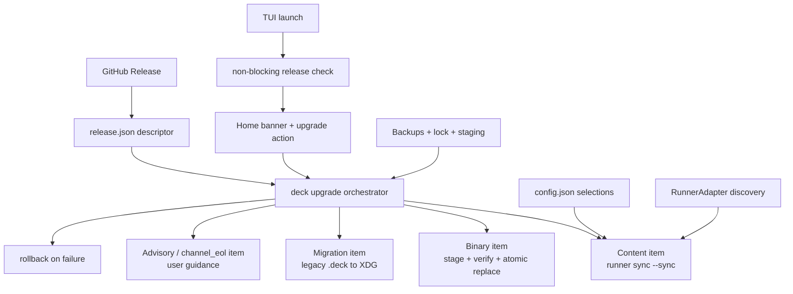

# Proposal: Add Self-Update System

## Intent

Deck needs a repo-agnostic upgrade path that updates the CLI/binary and Deck-managed runner content after installation. The current `deck upgrade` path is CLI-only and binary-focused; the TUI does not surface upgrade state, release metadata is inferred fragilely from GitHub release text, and content sync must preserve user selections across detected runners without reinstalling packages.

## Goal

Ship an atomic, rollback-safe self-update system that detects rich GitHub Release descriptors, highlights available upgrades in the TUI, updates Deck-owned files, and syncs installed runners using existing user configuration.

## Scope

### In Scope
- Add GitHub Release `release.json` descriptor support with item kinds: `binary`, `content`, `migration`, `advisory`, and `channel_eol`.
- Replace regex-based SHA-256 release-body parsing in `apps/cli/src/upgrade-command/github-release.ts` with descriptor/checksum asset handling.
- Extend the existing `deck upgrade` flow in `apps/cli/src/upgrade-command/{index,github-release,install}.ts` to coordinate binary upgrade, content sync, migrations, advisories, backups, and rollback.
- Add a non-blocking TUI release check at `apps/cli/src/tui/app.tsx` launch and render an “Upgrade available” banner in `apps/cli/src/tui/screens/home-screen.tsx`.
- Convert the `upgrade-tools` placeholder in `apps/cli/src/tui/menu-options.ts` into an explicit user-triggered upgrade action.
- Introduce XDG Base Directory storage with one-shot migration from legacy `~/.config/.deck/`:
  - `~/.config/deck/config.yaml` for user choices and release channel.
  - `~/.local/state/deck/` for `state.yaml`, `manifest.json`, and `logs/`.
  - `~/.cache/deck/` for `releases/vX.Y.Z/` and `backups/<ts>/`.
- Reuse existing legacy config data as the sync source of truth: `packageInstructions[runnerId]`, `adaptiveMemory`, `orchestratorPersonality`, and `profiles` from `~/.config/.deck/config.json` during migration/sync.
- Re-run the install pipeline in `--sync` mode so selected packages, models, memory system, and personality are re-applied without reinstalling packages.
- Auto-discover installed Deck runners and sync only detected runners through the existing `RunnerAdapter` pattern; OpenCode is the first implementation.
- Back up Deck-owned files and runner files before mutation, then apply lock + staging + atomic rename safeguards.
- Update release tooling: `scripts/prepare-release.ts` helper and `.github/workflows/release.yml` attachment of `release.json` alongside binary assets and `checksums.txt`.
- Document Homebrew behavior in release notes: Homebrew users should use `brew upgrade deck`.

### Out of Scope
- Refactoring hardcoded `~/.config/opencode/` runner paths; this remains a separate OpenCode adapter refactor.
- macOS x64 binary support; CI currently builds macOS arm64 only.
- Homebrew self-upgrade integration or conflict resolution beyond documentation.
- Creating a separate `installs.json`; existing config fields remain the source of truth for selections.
- Reinstalling selected packages during upgrade sync.
- Automatic upgrade installation from the TUI; users must explicitly choose the upgrade action.
- Detailed `manifest.json` v1→v2 schema strategy; deferred to Design and must preserve user customizations.
- Creating implementation tasks, detailed specs, or final architecture decisions in this phase.

## Affected Capabilities

> This section is the contract between Proposal and Spec/Design phases.

### New Capabilities
- `release-descriptor-detection`: Deck can read rich GitHub Release metadata from `release.json`, including binary/content/migration/advisory/channel EOL items.
- `tui-upgrade-notification`: The TUI can check for upgrades non-blockingly and show an “Upgrade available” banner/action.
- `xdg-deck-storage`: Deck uses XDG Base Directory paths for config, state, release cache, backups, logs, and manifests.
- `legacy-deck-config-migration`: Deck performs a one-shot reversible migration from `~/.config/.deck/` to the new XDG layout.
- `atomic-upgrade-rollback`: Upgrade applies lock, staging, atomic rename, pre-mutation backup, and rollback on failure.
- `runner-upgrade-sync`: Deck syncs detected installed runners through `RunnerAdapter` without reinstalling packages.

### Modified Capabilities
- `deck-upgrade-command`: Existing `apps/cli/src/upgrade-command/{index,github-release,install}.ts` expands from binary-only CLI upgrade to coordinated release-item execution.
- `github-release-download`: Existing `apps/cli/src/upgrade-command/github-release.ts` stops relying on release-body SHA-256 regex parsing and uses release assets/descriptors.
- `binary-install-replace`: Existing `apps/cli/src/upgrade-command/install.ts` remains responsible for verified binary replacement but participates in broader backup/rollback orchestration.
- `tui-home-menu`: Existing `apps/cli/src/tui/app.tsx`, `apps/cli/src/tui/screens/home-screen.tsx`, and `apps/cli/src/tui/menu-options.ts` gain release-check state and an explicit upgrade action.
- `runner-adapter-composition`: Existing `packages/core/src/runner-adapter.ts` and `apps/cli/src/runner-adapters.ts` are reused for multi-runner sync, with OpenCode first.
- `release-pipeline`: Existing `scripts/build-binaries.ts` and `.github/workflows/release.yml` add descriptor preparation/attachment.

### Unchanged Capabilities
- `package-installation`: Upgrade sync must not reinstall packages; it only re-applies generated Deck content from recorded selections.
- `opencode-runner-paths`: OpenCode writes continue using the current hardcoded `~/.config/opencode/` behavior until a separate refactor.
- `homebrew-distribution`: Homebrew formula updates remain external to Deck self-upgrade.

## Approach

- **Release model**: Attach `release.json` to every GitHub Release. The descriptor declares version, tag, publication time, channel, notes URL, and typed release items with hashes and kind-specific metadata.
- **Upgrade orchestration**: Keep the existing upgrade command as the entry point, but execute descriptor items in a safe order: advisory/channel checks, migrations, binary staging/replacement, content sync, verification, cleanup.
- **Storage migration**: On first run, detect legacy `~/.config/.deck/`, back it up, migrate data into XDG paths, and preserve/re-map existing `config.json` selections into `~/.config/deck/config.yaml` or compatibility-read paths as Design determines.
- **Selection reuse**: Treat legacy `config.json` fields as source of truth for sync: `packageInstructions[runnerId]`, `adaptiveMemory`, `orchestratorPersonality`, and `profiles`. Do not introduce `installs.json`.
- **Runner sync**: Auto-discover runners with Deck-installed artifacts, then invoke the install pipeline with `--sync` so runner files are regenerated from user selections without package install side effects.
- **Atomicity**: Use `state.yaml.lock` to prevent concurrent updates, stage release content under `~/.cache/deck/releases/vX.Y.Z/`, mutate through atomic rename where possible, and always create `~/.cache/deck/backups/<ts>/` before touching Deck or runner-owned files.
- **TUI**: On TUI mount, run a non-blocking release check. Home renders an upgrade banner when a newer release is found; upgrade only starts when the user selects the former `upgrade-tools` option.
- **Release tooling**: Add `scripts/prepare-release.ts` to guide maintainers through generating `release.json`; update `.github/workflows/release.yml` to attach it automatically.
- **Execution mode**: SDD proceeds automatically after this proposal; Spec and Design can run in parallel.

## Alternatives and Tradeoffs

| Alternative | Why Considered | Why Not Chosen |
|---|---|---|
| Keep binary-only `deck upgrade` | Reuses existing path with minimal changes | Does not sync runner content, migrations, advisories, or TUI visibility. |
| Use GitHub release body parsing for all metadata | Already exists for SHA-256 parsing | Fragile and insufficient for rich typed release items. |
| Add separate `installs.json` | Could record per-runner install history | Pre-agreed decision: existing `config.json` already stores user selections; avoid duplicate source of truth. |
| Clean reinstall on upgrade | Simple implementation | Risks destroying user customizations and violates the requirement to preserve selections. |
| Single-runner OpenCode-only design | Faster first implementation | Conflicts with repo-agnostic multi-runner requirement; `RunnerAdapter` is already available. |

## Risks

| Risk | Likelihood | Mitigation |
|---|---|---|
| XDG migration moves or maps legacy config incorrectly, losing user choices | Medium | Back up legacy `~/.config/.deck/` before migration; make migration one-shot, logged, and reversible; preserve `packageInstructions`, memory, personality, and profiles explicitly. |
| Atomic rename semantics vary across filesystems or target runner paths | Medium | Stage on same filesystem when possible; fall back to validated copy + rename; keep backups for rollback. |
| Runner sync overwrites user-edited runner files | Medium | Limit mutations to Deck-owned/managed files; back up runner paths; surface changed files and rollback option. |
| Release descriptor schema drift breaks older Deck versions | Medium | Version descriptor schema; keep binary upgrade compatibility path; make required items explicit and fail safe. |
| Non-blocking TUI check causes launch latency, noise, or network errors | Low | Run asynchronously, cache result/state, suppress failures to advisory status, never block home render. |
| Homebrew users accidentally invoke binary self-upgrade | Low | Detect or document Homebrew installs where feasible; release notes direct users to `brew upgrade deck`; self-upgrade can no-op. |
| Concurrent upgrade attempts corrupt state | Low | Enforce `state.yaml.lock`, stale-lock handling, staged writes, and rollback verification. |

## Rollback Plan

- **If the feature ships with issues**: disable rich self-update by making the new upgrade path a no-op or reverting to the legacy binary-only `deck upgrade` command while retaining safe release checks.
- **Binary rollback**: restore the previous binary from the pre-mutation backup or keep the existing install rollback path when replacement fails.
- **Content rollback**: restore Deck-owned and runner files from `~/.cache/deck/backups/<ts>/` and record rollback status in state/logs.
- **Migration rollback**: because migration from `~/.config/.deck/` is one-shot and breaking, keep a full backup of the legacy directory before moving/mapping it; provide a documented path to restore the legacy directory and ignore XDG state if migration fails.
- **Release pipeline rollback**: continue publishing binaries/checksums; if `release.json` generation is faulty, mark the release advisory/blocked and use the legacy upgrade path until corrected.

## Dependencies

- GitHub Releases assets and API availability.
- Existing binary build/release pipeline: `scripts/build-binaries.ts` and `.github/workflows/release.yml`.
- Existing upgrade command: `apps/cli/src/upgrade-command/{index,github-release,install}.ts`.
- Existing TUI files: `apps/cli/src/tui/app.tsx`, `apps/cli/src/tui/screens/home-screen.tsx`, `apps/cli/src/tui/menu-options.ts`.
- Existing runner abstractions: `packages/core/src/runner-adapter.ts` and `apps/cli/src/runner-adapters.ts`.
- Existing user selection data in legacy `~/.config/.deck/config.json`.

## Open Questions

- What is the exact migration/compatibility strategy for `manifest.json` and `state.yaml` schema versions, including v1→v2 fields and forward/backward compatibility?
- How should Deck record runner sync history if `installs.json` is explicitly out of scope: in `manifest.json`, `state.yaml`, logs only, or derived from discovered managed files?
- How should Homebrew-installed binaries be detected, if at all, versus only documented in release notes?
- What backup retention policy should apply to `~/.cache/deck/backups/<ts>/` and release caches?

## Success Criteria

- [ ] TUI launch remains responsive and shows “Upgrade available” only when a newer applicable release descriptor is found.
- [ ] User-triggered upgrade verifies release assets, backs up Deck and runner files, stages changes, applies atomically, and rolls back on failure.
- [ ] Legacy `~/.config/.deck/` is migrated once to XDG paths without losing package selections, memory provider, model/profile choices, or personality.
- [ ] Sync re-applies selected Deck content to detected installed runners without reinstalling packages.
- [ ] OpenCode is supported through `RunnerAdapter`; the design remains ready for additional runners.
- [ ] `release.json` is generated and attached by release tooling; SHA-256 parsing no longer depends on release-body regex.
- [ ] Homebrew users have clear release-note guidance to use `brew upgrade deck`.
- [ ] Tests/verification cover release descriptor parsing, migration safety, backup/rollback behavior, TUI notification state, and sync no-package-install behavior.

## Next Steps

Ready for Spec (`deck-developer-spec`) and Design (`deck-developer-design`) in parallel.

## Mermaid Summary Source

