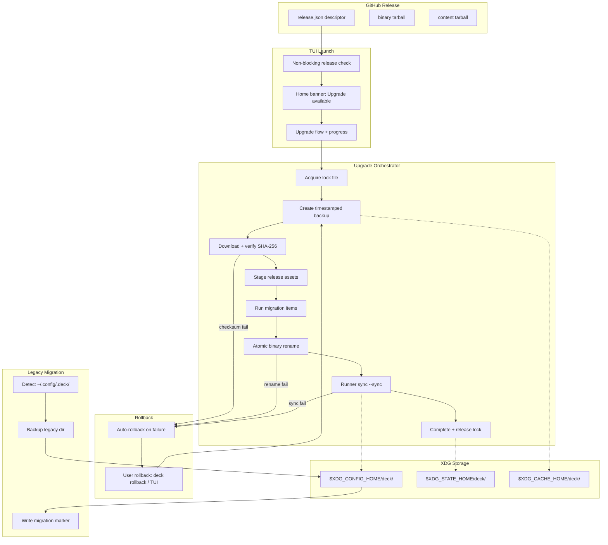

# Spec: Add Self-Update System

## Source

- Proposal: `add-self-update-system` proposal artifact
- Capabilities affected:
  - **New**: `release-descriptor-detection`, `tui-upgrade-notification`, `xdg-deck-storage`, `legacy-deck-config-migration`, `atomic-upgrade-rollback`, `runner-upgrade-sync`
  - **Modified**: `deck-upgrade-command`, `github-release-download`, `binary-install-replace`, `tui-home-menu`, `runner-adapter-composition`, `release-pipeline`

## Non-Goals / Out of Scope

- Refactoring hardcoded `~/.config/opencode/` runner paths (separate OpenCode adapter refactor).
- macOS x64 binary support (CI builds arm64 only).
- Homebrew self-upgrade integration beyond documentation.
- Creating a separate `installs.json`; existing config fields remain the source of truth.
- Reinstalling selected packages during upgrade sync.
- Automatic upgrade installation from the TUI; users must explicitly choose the upgrade action.
- Detailed `manifest.json` v1→v2 schema strategy (deferred to Design).
- Implementation code, architecture decisions, or task decomposition.

---

## Requirements

### Capability: `release-descriptor-detection`

**REQ-RD-001**: Deck MUST read the release descriptor from a `release.json` asset attached to the target GitHub Release.
- Priority: MUST
- Surface: Integration
- Rationale: Replaces fragile regex-based SHA-256 parsing from release body with a structured, versioned descriptor.

**REQ-RD-002**: `release.json` MUST be valid JSON and contain: `version`, `tag_name`, `published_at`, `channel`, and `items` (array).
- Priority: MUST
- Surface: Data
- Rationale: Defines the minimum contract between the release pipeline and the upgrade system.

**REQ-RD-003**: Each item in `items` MUST have: `kind`, `required` (boolean), `asset_name`, `sha256`, and `notes`.
- Priority: MUST
- Surface: Data
- Rationale: Typed release items enable structured upgrade orchestration.

**REQ-RD-004**: The supported `kind` values MUST be: `binary`, `content`, `migration`, `advisory`, `channel_eol`.
- Priority: MUST
- Surface: Data
- Rationale: Covers all upgrade scenarios defined in the proposal.

**REQ-RD-005**: `binary` items MUST have an `asset_name` matching the pattern `deck_v{VERSION}_{OS}-{ARCH}.tar.gz`.
- Priority: MUST
- Surface: Data
- Rationale: Compatibility with existing binary naming convention.

**REQ-RD-006**: `content` items MUST have an `asset_name` for the content tarball.
- Priority: MUST
- Surface: Data
- Rationale: Content-only releases must be downloadable.

**REQ-RD-007**: `migration` items MUST have `from_schema_version` and `to_schema_version` fields.
- Priority: MUST
- Surface: Data
- Rationale: Migration steps must declare schema boundaries for correct sequencing.

**REQ-RD-008**: `advisory` items MUST have `severity` and `affected_versions` fields.
- Priority: MUST
- Surface: Data
- Rationale: Advisories must communicate urgency and scope.

**REQ-RD-009**: `channel_eol` items MUST have a `successor_channel` field.
- Priority: MUST
- Surface: Data
- Rationale: Users on deprecated channels must know where to migrate.

**REQ-RD-010**: The SHA-256 value in the descriptor MUST be the source of truth for asset verification, replacing regex-parsed body checksums.
- Priority: MUST
- Surface: Security
- Rationale: Structured verification is safer than regex extraction.

**REQ-RD-011**: If `release.json` is missing from a GitHub Release, Deck MUST fall back to the legacy upgrade path (binary-only, body-parsed checksum).
- Priority: MUST
- Surface: Integration
- Rationale: Backward compatibility with releases published before this feature.

---

### Capability: `xdg-deck-storage`

**REQ-XDG-001**: Deck MUST read/write state under `$XDG_STATE_HOME/deck/` (default `~/.local/state/deck/`).
- Priority: MUST
- Surface: Data
- Rationale: Separates mutable runtime state from configuration per XDG spec.

**REQ-XDG-002**: Deck MUST read/write config under `$XDG_CONFIG_HOME/deck/` (default `~/.config/deck/`).
- Priority: MUST
- Surface: Data
- Rationale: Config isolation per XDG spec; replaces `~/.config/.deck/`.

**REQ-XDG-003**: Deck MUST read/write cache under `$XDG_CACHE_HOME/deck/` (default `~/.cache/deck/`).
- Priority: MUST
- Surface: Data
- Rationale: Release downloads and backups belong in cache, not state or config.

**REQ-XDG-004**: On first run after upgrade, Deck MUST migrate existing `~/.config/.deck/` data to the new XDG split paths.
- Priority: MUST
- Surface: Data
- Rationale: Users upgrading must not lose configuration.

**REQ-XDG-005**: The migration MUST be one-shot and idempotent — a marker file prevents re-execution.
- Priority: MUST
- Surface: Data
- Rationale: Prevents duplicate migrations on subsequent launches.

**REQ-XDG-006**: The migration MUST preserve all existing user choices in `config.json`, including `packageInstructions`, `adaptiveMemory`, `orchestratorPersonality`, and `profiles`.
- Priority: MUST
- Surface: Data
- Rationale: Data loss during migration is unacceptable.

**REQ-XDG-007**: If migration fails, Deck MUST abort the current operation and surface a clear error message indicating what failed and how to recover.
- Priority: MUST
- Surface: UI
- Rationale: Silent migration failure leads to data loss or inconsistent state.

**REQ-XDG-008**: The state directory MUST hold `state.yaml`, `manifest.json`, and `logs/`.
- Priority: MUST
- Surface: Data
- Rationale: Runtime artifacts separated from config and cache.

**REQ-XDG-009**: The cache directory MUST hold `releases/vX.Y.Z/` (downloaded release assets) and `backups/<ts>/` (timestamped backups).
- Priority: MUST
- Surface: Data
- Rationale: Ephemeral data belongs in cache per XDG spec.

---

### Capability: `legacy-deck-config-migration`

**REQ-MIG-001**: Deck MUST detect the presence of `~/.config/.deck/config.json` and trigger migration before any other Deck operation.
- Priority: MUST
- Surface: Integration
- Rationale: Migration must complete before config is read by other subsystems.

**REQ-MIG-002**: Migration MUST create a full backup of `~/.config/.deck/` before any file is moved or rewritten.
- Priority: MUST
- Surface: Data
- Rationale: Safety net for migration failures.

**REQ-MIG-003**: The migration marker file MUST be written only after all migration steps complete successfully.
- Priority: MUST
- Surface: Data
- Rationale: Marker written too early would skip recovery on partial migration.

---

### Capability: `tui-upgrade-notification`

**REQ-TUI-001**: On TUI launch, Deck MUST perform a non-blocking release check.
- Priority: MUST
- Surface: UI
- Rationale: Upgrade awareness must not delay TUI startup.

**REQ-TUI-002**: The release check MUST NOT block the TUI from rendering the home screen.
- Priority: MUST
- Surface: UI
- Rationale: Network latency or GitHub unavailability must not freeze the UI.

**REQ-TUI-003**: The release check SHOULD have a hard timeout (suggested: 3 seconds).
- Priority: SHOULD
- Surface: Integration
- Rationale: Prevents indefinite waits on slow networks.

**REQ-TUI-004**: If a newer release is detected, the home menu MUST display an "Upgrade available" option showing version, kinds, and required/optional flags.
- Priority: MUST
- Surface: UI
- Rationale: User must be informed of available upgrades and their nature.

**REQ-TUI-005**: `advisory` items MUST be surfaced as a red banner in the TUI.
- Priority: MUST
- Surface: UI
- Rationale: Security and stability advisories require immediate visibility.

**REQ-TUI-006**: `channel_eol` items MUST notify the user that the current release channel is being deprecated and indicate the successor channel.
- Priority: MUST
- Surface: UI
- Rationale: Users must be aware of channel deprecation to plan migration.

**REQ-TUI-007**: If the release channel is unreachable or the check fails, the TUI MUST launch normally and MUST NOT display an upgrade banner.
- Priority: MUST
- Surface: UI
- Rationale: Network failures must not degrade the user experience.

**REQ-TUI-008**: Selecting the "Upgrade available" option MUST navigate to an upgrade flow with progress indication.
- Priority: MUST
- Surface: UI
- Rationale: User must see progress during upgrade execution.

---

### Capability: `atomic-upgrade-rollback`

**REQ-ATM-001**: Before mutating any file during upgrade, Deck MUST create a timestamped backup in `$XDG_CACHE_HOME/deck/backups/<ts>/`.
- Priority: MUST
- Surface: Data
- Rationale: Every mutation must be reversible.

**REQ-ATM-002**: Backups MUST include both Deck-owned files and runner files that Deck will touch.
- Priority: MUST
- Surface: Data
- Rationale: Partial backups make rollback incomplete.

**REQ-ATM-003**: Deck MUST keep at least the last 3 successful backups.
- Priority: MUST
- Surface: Data
- Rationale: Minimum safety net for iterative rollback.

**REQ-ATM-004**: Older backups beyond the retention minimum SHOULD be pruned based on age.
- Priority: SHOULD
- Surface: Data
- Rationale: Prevents unbounded disk usage.

**REQ-ATM-005**: Deck MUST write a lock file before starting any upgrade.
- Priority: MUST
- Surface: Integration
- Rationale: Prevents concurrent upgrade state corruption.

**REQ-ATM-006**: Concurrent upgrade attempts MUST be rejected with a clear error message.
- Priority: MUST
- Surface: UI
- Rationale: User must understand why upgrade was rejected.

**REQ-ATM-007**: Binary replacement MUST use atomic rename: write to a staging path, then `rename(2)` to the target.
- Priority: MUST
- Surface: Integration
- Rationale: Guarantees the binary is either old or new, never a partial write.

**REQ-ATM-008**: If an upgrade is interrupted, the next Deck launch MUST detect the incomplete state via the lock file and staging artifacts.
- Priority: MUST
- Surface: Integration
- Rationale: Interrupted upgrades must not silently corrupt.

**REQ-ATM-009**: An interrupted upgrade MUST result in either the old version or the new version running — never a mixed state.
- Priority: MUST
- Surface: Integration
- Rationale: Atomicity guarantee.

**REQ-ATM-010**: `binary` MUST be the only kind that replaces the Deck binary file.
- Priority: MUST
- Surface: Integration
- Rationale: Content/migration/advisory items must not touch the binary.

**REQ-ATM-011**: `content` items MUST NOT replace the Deck binary file.
- Priority: MUST
- Surface: Integration
- Rationale: Content sync is limited to runner-managed files.

**REQ-ATM-012**: A failed upgrade MUST auto-rollback from the most recent backup.
- Priority: MUST
- Surface: Integration
- Rationale: Minimizes user impact from upgrade failures.

---

### Capability: `runner-upgrade-sync`

**REQ-SYNC-001**: After a `binary` upgrade, Deck MUST run a sync step that re-applies user selections to each detected runner.
- Priority: MUST
- Surface: Integration
- Rationale: Binary upgrade may change file formats; selections must be re-applied.

**REQ-SYNC-002**: Sync MUST re-write prompts, skills, sub-agents, and config files into each detected runner.
- Priority: MUST
- Surface: Integration
- Rationale: Runner state must reflect the upgraded Deck version's output.

**REQ-SYNC-003**: Sync MUST NOT reinstall npm, pip, or system packages.
- Priority: MUST
- Surface: Integration
- Rationale: Package reinstallation is explicitly out of scope; sync is content-only.

**REQ-SYNC-004**: Sync MUST read the user's package selections from `$XDG_CONFIG_HOME/deck/config.json` → `packageInstructions[runnerId]`.
- Priority: MUST
- Surface: Data
- Rationale: Config is the single source of truth for selections.

**REQ-SYNC-005**: Sync MUST preserve user-configured models and memory system settings.
- Priority: MUST
- Surface: Data
- Rationale: Model/memory choices must survive sync.

**REQ-SYNC-006**: A standalone `content`-only release MUST be applicable without a binary upgrade.
- Priority: MUST
- Surface: Integration
- Rationale: Content fixes should not require a new binary.

**REQ-SYNC-007**: `migration` items MUST require an automatic backup before applying.
- Priority: MUST
- Surface: Integration
- Rationale: Migrations transform data; backup is mandatory before mutation.

---

### Capability: `runner-adapter-composition`

**REQ-RUN-001**: On TUI launch, Deck MUST scan for installed runners (opencode v1; future: claude, codex).
- Priority: MUST
- Surface: Integration
- Rationale: Sync must only target runners that are actually installed.

**REQ-RUN-002**: Sync MUST apply only to detected runners.
- Priority: MUST
- Surface: Integration
- Rationale: No-op for uninstalled runners avoids errors and wasted work.

**REQ-RUN-003**: The `RunnerAdapter` interface MUST be the single integration point for any new runner.
- Priority: MUST
- Surface: Integration
- Rationale: Adding a runner must not require changes outside the adapter.

---

### Capability: `rollback`

**REQ-RBK-001**: A user MUST be able to run `deck rollback` (CLI) to restore the most recent backup.
- Priority: MUST
- Surface: UI
- Rationale: CLI-driven recovery is essential for headless environments.

**REQ-RBK-002**: Rollback MUST also be available via the TUI menu.
- Priority: MUST
- Surface: UI
- Rationale: GUI users need recovery without CLI knowledge.

**REQ-RBK-003**: Rollback MUST restore both the Deck binary and all runner files that were backed up.
- Priority: MUST
- Surface: Integration
- Rationale: Partial rollback leaves the system in an inconsistent state.

**REQ-RBK-004**: Rollback MUST be safe to run even if the binary upgrade succeeded but the sync step failed.
- Priority: MUST
- Surface: Integration
- Rationale: Sync failures are a real scenario; rollback must cover it.

**REQ-RBK-005**: After rollback, Deck MUST update its internal state (`state.yaml`) to reflect the rolled-back version.
- Priority: MUST
- Surface: Data
- Rationale: State must match reality after rollback.

---

### Capability: `user-selection-persistence`

**REQ-USP-001**: The user's package selections, configured models, and memory system MUST be persisted in `$XDG_CONFIG_HOME/deck/config.json`.
- Priority: MUST
- Surface: Data
- Rationale: Single source of truth for user choices.

**REQ-USP-002**: The persisted configuration MUST NOT include any secrets (tokens, keys, passwords).
- Priority: MUST
- Surface: Security
- Rationale: Config files may be shared, logged, or backed up; secrets must not leak.

**REQ-USP-003**: On every install or sync operation, the persisted selections MUST be the authoritative source of truth.
- Priority: MUST
- Surface: Data
- Rationale: Ensures consistency across install, upgrade, and sync.

---

### Capability: `release-pipeline`

**REQ-REL-001**: A `scripts/prepare-release.ts` script MUST guide the maintainer through creating `release.json`.
- Priority: MUST
- Surface: General
- Rationale: Manual JSON creation is error-prone; guided tooling prevents schema mistakes.

**REQ-REL-002**: The GitHub Actions release workflow MUST attach `release.json` as an asset to each GitHub Release.
- Priority: MUST
- Surface: Integration
- Rationale: The descriptor must be co-located with binary assets.

**REQ-REL-003**: A `CHANGELOG.md` SHOULD be generated or maintained from release notes.
- Priority: SHOULD
- Surface: General
- Rationale: Change visibility is important but not blocking for self-update.

---

## Acceptance Scenarios

### Capability: `release-descriptor-detection`

#### Scenario: Parse valid release.json from GitHub Release
**Given** a GitHub Release with a `release.json` asset containing valid descriptor with `version`, `tag_name`, `published_at`, `channel`, and `items`
**When** Deck fetches the release descriptor
**Then** Deck parses all fields and typed items correctly
> Covers: REQ-RD-001, REQ-RD-002, REQ-RD-003

#### Scenario: Descriptor with all five kind types
**Given** a `release.json` containing items of kinds `binary`, `content`, `migration`, `advisory`, `channel_eol`
**When** Deck parses the descriptor
**Then** each item is classified by kind with its kind-specific fields preserved
> Covers: REQ-RD-004, REQ-RD-005, REQ-RD-006, REQ-RD-007, REQ-RD-008, REQ-RD-009

#### Scenario: SHA-256 from descriptor is used for verification
**Given** a `release.json` with `sha256` in a binary item
**When** Deck downloads and verifies the binary asset
**Then** the SHA-256 from the descriptor is compared against the downloaded file's hash (not the release body)
> Covers: REQ-RD-010

#### Scenario: Missing release.json falls back to legacy path
**Given** a GitHub Release without a `release.json` asset
**When** Deck checks for upgrades
**Then** Deck falls back to the legacy binary-only upgrade path using release-body regex checksum
> Covers: REQ-RD-011

#### Scenario: Malformed release.json is rejected
**Given** a GitHub Release with a `release.json` that is invalid JSON or missing required fields
**When** Deck parses the descriptor
**Then** Deck rejects the descriptor with a clear error and does not proceed with upgrade
> Covers: REQ-RD-002

---

### Capability: `xdg-deck-storage`

#### Scenario: XDG paths used when environment variables set
**Given** `XDG_CONFIG_HOME=/tmp/xdg-config`, `XDG_STATE_HOME=/tmp/xdg-state`, `XDG_CACHE_HOME=/tmp/xdg-cache`
**When** Deck starts
**Then** Deck reads config from `/tmp/xdg-config/deck/`, state from `/tmp/xdg-state/deck/`, cache from `/tmp/xdg-cache/deck/`
> Covers: REQ-XDG-001, REQ-XDG-002, REQ-XDG-003

#### Scenario: Default XDG paths when no environment variables
**Given** no `XDG_*` environment variables are set
**When** Deck starts
**Then** config uses `~/.config/deck/`, state uses `~/.local/state/deck/`, cache uses `~/.cache/deck/`
> Covers: REQ-XDG-001, REQ-XDG-002, REQ-XDG-003

#### Scenario: State directory contains expected files
**Given** a fresh Deck installation with XDG paths
**When** Deck runs
**Then** `$XDG_STATE_HOME/deck/` contains `state.yaml`, `manifest.json`, and `logs/`
> Covers: REQ-XDG-008

#### Scenario: Cache directory holds release assets and backups
**Given** an upgrade that downloads release v1.2.0 and creates a backup
**When** the upgrade completes
**Then** `$XDG_CACHE_HOME/deck/releases/v1.2.0/` contains the downloaded assets and `$XDG_CACHE_HOME/deck/backups/<ts>/` contains the backup
> Covers: REQ-XDG-009

---

### Capability: `legacy-deck-config-migration`

#### Scenario: Legacy config migrated to XDG on first run
**Given** `~/.config/.deck/config.json` exists with `packageInstructions`, `adaptiveMemory`, `orchestratorPersonality`, and `profiles`
**And** no migration marker exists
**When** Deck starts for the first time after upgrade
**Then** all config data is migrated to `$XDG_CONFIG_HOME/deck/config.json` preserving all fields
**And** a migration marker is written
**And** subsequent launches skip migration
> Covers: REQ-MIG-001, REQ-XDG-004, REQ-XDG-005, REQ-XDG-006

#### Scenario: Migration creates backup before moving data
**Given** `~/.config/.deck/config.json` exists
**When** migration starts
**Then** a full backup of `~/.config/.deck/` is created before any file is moved or rewritten
> Covers: REQ-MIG-002

#### Scenario: Migration marker prevents re-run
**Given** the migration marker file exists from a previous successful migration
**When** Deck starts
**Then** migration is skipped entirely
> Covers: REQ-XDG-005

#### Scenario: Migration failure aborts with error
**Given** `~/.config/.deck/config.json` exists but is corrupted (invalid JSON)
**When** Deck attempts migration
**Then** Deck aborts with a clear error indicating migration failure and how to recover
**And** no migration marker is written
> Covers: REQ-XDG-007, REQ-MIG-003

#### Variant: Marker written only after full success
- Given migration starts and copies config successfully
- And the step to write `state.yaml` fails
- Then the migration marker is NOT written
- And on next launch, migration is re-attempted
> Covers: REQ-MIG-003

---

### Capability: `tui-upgrade-notification`

#### Scenario: Non-blocking release check on TUI launch
**Given** the TUI is launching
**When** the home screen begins rendering
**Then** the home screen renders immediately without waiting for the release check
**And** the release check runs in the background
> Covers: REQ-TUI-001, REQ-TUI-002

#### Scenario: Upgrade available banner appears after check
**Given** the release check completes and finds a newer version `v2.0.0` with items of kind `binary` (required) and `content` (optional)
**When** the result arrives
**Then** the home menu displays "Upgrade available: v2.0.0" with the kinds and required/optional flags
> Covers: REQ-TUI-004

#### Scenario: Advisory shown as red banner
**Given** the release descriptor contains an `advisory` item with `severity: "high"`
**When** the release check result is processed
**Then** a red banner is displayed in the TUI with the advisory information
> Covers: REQ-TUI-005

#### Scenario: Channel EOL notification
**Given** the release descriptor contains a `channel_eol` item with `successor_channel: "stable"`
**When** the user views the upgrade details
**Then** the TUI displays a notification that the current channel is deprecated and directs the user to the `stable` channel
> Covers: REQ-TUI-006

#### Scenario: Network failure suppresses upgrade banner
**Given** the release check fails due to network error or timeout
**When** the TUI is rendering
**Then** no upgrade banner or option is displayed
**And** the TUI functions normally
> Covers: REQ-TUI-007

#### Scenario: Release check timeout
**Given** the release check exceeds the hard timeout
**When** the timeout fires
**Then** the check is cancelled and no upgrade banner is displayed
> Covers: REQ-TUI-003

#### Scenario: Upgrade flow from TUI
**Given** the home menu shows "Upgrade available: v2.0.0"
**When** the user selects that option
**Then** the TUI navigates to an upgrade flow screen with progress indication
> Covers: REQ-TUI-008

---

### Capability: `atomic-upgrade-rollback`

#### Scenario: Timestamped backup created before mutation
**Given** an upgrade is about to start
**When** Deck begins mutating files
**Then** a timestamped backup directory is created under `$XDG_CACHE_HOME/deck/backups/<ts>/`
**And** the backup includes Deck-owned files and runner files that will be touched
> Covers: REQ-ATM-001, REQ-ATM-002

#### Scenario: Backup retention enforced
**Given** 5 backups exist in `$XDG_CACHE_HOME/deck/backups/`
**When** a new backup is created
**Then** at least the last 3 successful backups are retained
**And** older backups MAY be pruned
> Covers: REQ-ATM-003, REQ-ATM-004

#### Scenario: Lock file prevents concurrent upgrades
**Given** an upgrade is in progress (lock file exists)
**When** a second upgrade is attempted
**Then** the second attempt is rejected with a clear error message
> Covers: REQ-ATM-005, REQ-ATM-006

#### Scenario: Atomic binary replacement via rename
**Given** a binary item is being applied
**When** the new binary is ready for installation
**Then** the new binary is written to a staging path first, then renamed to the target via `rename(2)`
> Covers: REQ-ATM-007

#### Scenario: Interrupted upgrade detected on next launch
**Given** an upgrade was interrupted (lock file exists, staging files present)
**When** Deck launches again
**Then** Deck detects the incomplete upgrade state
**And** either the old version or the new version is active (never a mixed state)
> Covers: REQ-ATM-008, REQ-ATM-009

#### Scenario: Binary is the only kind that replaces the binary
**Given** a release with items of kinds `binary`, `content`, and `advisory`
**When** the upgrade executes
**Then** only the `binary` item replaces the Deck executable
**And** `content` and `advisory` items do not touch the binary
> Covers: REQ-ATM-010, REQ-ATM-011

#### Scenario: Failed upgrade auto-rolls back
**Given** an upgrade fails during the sync step
**When** the failure is detected
**Then** Deck automatically restores files from the most recent backup
> Covers: REQ-ATM-012

---

### Capability: `runner-upgrade-sync`

#### Scenario: Sync after binary upgrade
**Given** a `binary` upgrade from v1.0.0 to v2.0.0 completes successfully
**And** the user has OpenCode installed with selections in `config.json`
**When** the post-upgrade sync runs
**Then** prompts, skills, sub-agents, and config files are re-written into the OpenCode runner directory
> Covers: REQ-SYNC-001, REQ-SYNC-002

#### Scenario: Sync does not reinstall packages
**Given** an upgrade with a sync step
**When** sync executes
**Then** no npm, pip, or system package installations occur
> Covers: REQ-SYNC-003

#### Scenario: Sync reads selections from config
**Given** `$XDG_CONFIG_HOME/deck/config.json` contains `packageInstructions.opencode` with selected packages
**When** sync runs for the OpenCode runner
**Then** sync reads selections from `packageInstructions.opencode` and applies them
> Covers: REQ-SYNC-004

#### Scenario: Sync preserves model and memory settings
**Given** the user has configured a specific model and memory provider in `config.json`
**When** sync runs
**Then** the model and memory provider settings are preserved unchanged
> Covers: REQ-SYNC-005

#### Scenario: Content-only release without binary upgrade
**Given** a release containing only a `content` item (no `binary` item)
**When** the user applies the upgrade
**Then** the content sync executes without replacing the Deck binary
> Covers: REQ-SYNC-006

#### Scenario: Migration item triggers backup
**Given** a release containing a `migration` item with `from_schema_version: 1` and `to_schema_version: 2`
**When** the migration is about to execute
**Then** an automatic backup is created before the migration runs
> Covers: REQ-SYNC-007

---

### Capability: `runner-adapter-composition`

#### Scenario: Runner discovery on TUI launch
**Given** OpenCode is installed at `~/.config/opencode/`
**When** the TUI launches
**Then** Deck detects OpenCode as an installed runner
> Covers: REQ-RUN-001

#### Scenario: Sync only targets detected runners
**Given** only OpenCode is installed (no Claude, no Codex)
**When** sync runs
**Then** only the OpenCode runner receives sync updates
> Covers: REQ-RUN-002

#### Scenario: New runner added via RunnerAdapter only
**Given** a new `ClaudeRunnerAdapter` implementing the `RunnerAdapter` interface is registered
**When** Deck runs
**Then** Claude is discovered and synced without changes outside the adapter
> Covers: REQ-RUN-003

---

### Capability: `rollback`

#### Scenario: User-initiated rollback via CLI
**Given** a backup exists from a recent upgrade
**When** the user runs `deck rollback`
**Then** the Deck binary and all runner files are restored to the pre-upgrade state
**And** `state.yaml` reflects the rolled-back version
> Covers: REQ-RBK-001, REQ-RBK-003, REQ-RBK-005

#### Scenario: User-initiated rollback via TUI
**Given** a backup exists
**When** the user selects the rollback option from the TUI menu
**Then** the same rollback behavior as `deck rollback` occurs
> Covers: REQ-RBK-002

#### Scenario: Rollback after successful binary but failed sync
**Given** a binary upgrade succeeded but the sync step failed
**When** the user triggers rollback
**Then** the previous binary is restored AND runner files are restored from backup
> Covers: REQ-RBK-004

---

### Capability: `user-selection-persistence`

#### Scenario: Selections persisted to config.json
**Given** the user selects packages, a model, and a memory provider during installation
**When** installation completes
**Then** selections are written to `$XDG_CONFIG_HOME/deck/config.json`
**And** no secrets (tokens, keys, passwords) are included
> Covers: REQ-USP-001, REQ-USP-002

#### Scenario: Sync uses persisted selections as source of truth
**Given** a sync operation is triggered
**When** sync reads user selections
**Then** it reads from `$XDG_CONFIG_HOME/deck/config.json` exclusively
> Covers: REQ-USP-003

---

### Capability: `release-pipeline`

#### Scenario: prepare-release.ts generates valid release.json
**Given** a maintainer runs `scripts/prepare-release.ts`
**When** the script completes
**Then** a valid `release.json` is generated matching the descriptor schema
> Covers: REQ-REL-001

#### Scenario: CI attaches release.json to GitHub Release
**Given** a GitHub Actions release workflow runs
**When** the release is published
**Then** `release.json` is attached as a release asset alongside binary tarballs and checksums
> Covers: REQ-REL-002

#### Scenario: CHANGELOG maintained from release notes
**Given** a maintainer uses `prepare-release.ts` and provides release notes
**When** the release is created
**Then** a CHANGELOG entry SHOULD be generated
> Covers: REQ-REL-003

---

## Validation Rules

| Field / Input | Rule | Error Condition | REQ-ID |
|---|---|---|---|
| `release.json` | MUST be valid JSON with required top-level fields | Reject descriptor, fall back to legacy if possible | REQ-RD-002 |
| `items[].kind` | MUST be one of `binary`, `content`, `migration`, `advisory`, `channel_eol` | Reject descriptor | REQ-RD-004 |
| `items[].sha256` | MUST be 64-char lowercase hex | Fail verification if mismatch | REQ-RD-010 |
| `items[].required` | MUST be boolean | Reject descriptor | REQ-RD-003 |
| Migration marker | MUST NOT exist before migration completes | Write marker atomically at end | REQ-MIG-003 |
| Lock file | MUST NOT be held by another process | Reject concurrent upgrade | REQ-ATM-005 |
| Config secrets | MUST NOT contain tokens/keys/passwords | Validation on write | REQ-USP-002 |
| Backup count | MUST keep ≥ 3 successful backups | Prune only beyond minimum | REQ-ATM-003 |
| SHA-256 verification | MUST match descriptor value exactly | Abort upgrade, trigger rollback | REQ-RD-010 |

## Error Contracts

| Condition | Error Code | Message | Detail |
|---|---|---|---|
| `release.json` not found on release | FALLBACK_LEGACY | "No release.json found; using legacy upgrade path" | Continue with legacy path |
| `release.json` malformed | DESCRIPTOR_INVALID | "Release descriptor is invalid: {reason}" | Abort upgrade |
| SHA-256 mismatch | CHECKSUM_MISMATCH | "Checksum mismatch for {asset_name}: expected {expected}, got {actual}" | Abort, trigger rollback |
| Network timeout | NETWORK_TIMEOUT | "Release check timed out" | Suppress in TUI; log for CLI |
| Lock file held | UPGRADE_LOCKED | "Another upgrade is in progress. Remove {lock_path} only if you are sure no other upgrade is running." | Reject upgrade |
| Migration failure | MIGRATION_FAILED | "Migration from legacy config failed: {reason}. Backup at {backup_path}." | Abort, do not write marker |
| Backup creation failure | BACKUP_FAILED | "Failed to create pre-upgrade backup: {reason}" | Abort upgrade |
| Atomic rename failure | REPLACE_FAILED | "Atomic binary replacement failed: {reason}" | Auto-rollback from backup |
| Rollback failure | ROLLBACK_FAILED | "Rollback failed: {reason}. Manual recovery from {backup_path}." | Critical; surface prominently |
| Runner sync failure | SYNC_FAILED | "Sync failed for runner {runnerId}: {reason}. Rollback available." | Offer rollback |

## States and Transitions

### Upgrade State Machine

| State | Description | Entry Criteria |
|---|---|---|
| `idle` | No upgrade in progress | Default state |
| `checking` | Release check in progress | TUI launch or CLI `deck upgrade` |
| `available` | Newer release found | Check completes with newer version |
| `backing-up` | Creating pre-upgrade backup | User confirms upgrade |
| `locked` | Lock file acquired | Backup succeeds |
| `downloading` | Downloading release assets | Lock acquired |
| `staging` | Staging files for atomic replacement | Download + verify succeeds |
| `migrating` | Running migration items | Staging complete, migration items present |
| `replacing` | Atomic binary replacement | Binary item ready |
| `syncing` | Post-upgrade runner sync | Binary replaced or content-only |
| `completed` | Upgrade finished successfully | Sync complete |
| `rolled-back` | Upgrade failed, restored from backup | Any step failure triggers rollback |
| `interrupted` | Process killed during upgrade | Lock file + staging artifacts remain |

### Transitions

| From | To | Trigger | Side Effects |
|---|---|---|---|
| `idle` | `checking` | TUI launch / `deck upgrade` | Non-blocking async |
| `checking` | `available` | Newer version found | TUI shows banner |
| `checking` | `idle` | No newer version / error | TUI normal, log error |
| `available` | `backing-up` | User confirms upgrade | Backup created |
| `backing-up` | `locked` | Backup succeeds | Lock file written |
| `locked` | `downloading` | Assets ready | Download starts |
| `downloading` | `staging` | Download + checksum OK | Files staged |
| `staging` | `migrating` | Migration items exist | Schema migration |
| `staging` | `replacing` | No migration items | Skip to binary |
| `migrating` | `replacing` | Migrations complete | Schema updated |
| `replacing` | `syncing` | Atomic rename succeeds | New binary active |
| `syncing` | `completed` | Sync succeeds | Lock released, cleanup |
| `any` | `rolled-back` | Step failure | Backup restored, lock released |
| `any` | `interrupted` | Process killed | Lock + staging remain |
| `interrupted` | `idle` | Next launch detects + recovers | Clean up or rollback |

---

## Open Questions

- **OQ-1**: What is the exact backup retention policy? The spec mandates ≥ 3 backups and suggests age-based pruning, but the exact thresholds (e.g., max age in days, max total size) are deferred to Design.
- **OQ-2**: What is the exact timeout value for the release check? The spec suggests 3 seconds but leaves the final value to Design.
- **OQ-3**: How should prerelease channels be detected and handled in the descriptor? The spec defines `channel` in the descriptor but does not specify prerelease vs. stable channel logic.
- **OQ-4**: What is the exact `manifest.json` v1→v2 schema migration strategy? Deferred to Design per proposal.
- **OQ-5**: How should Homebrew-installed binaries be detected (if at all) beyond release-note documentation? The proposal marks this as a low-likelihood risk.
- **OQ-6**: How should runner sync history be recorded without `installs.json`? The proposal explicitly excludes `installs.json` but the recording mechanism is unresolved.
- **OQ-7**: What is the exact config file format after migration — `config.json` or `config.yaml`? The proposal mentions both; Design must resolve.

---

## Compliance Matrix

| REQ-ID | Scenario(s) | Status |
|---|---|---|
| REQ-RD-001 | Parse valid release.json | Defined |
| REQ-RD-002 | Parse valid release.json, Malformed release.json | Defined |
| REQ-RD-003 | Parse valid release.json | Defined |
| REQ-RD-004 | Descriptor with all five kind types | Defined |
| REQ-RD-005 | Descriptor with all five kind types | Defined |
| REQ-RD-006 | Descriptor with all five kind types | Defined |
| REQ-RD-007 | Descriptor with all five kind types | Defined |
| REQ-RD-008 | Descriptor with all five kind types | Defined |
| REQ-RD-009 | Descriptor with all five kind types | Defined |
| REQ-RD-010 | SHA-256 from descriptor used for verification | Defined |
| REQ-RD-011 | Missing release.json falls back to legacy path | Defined |
| REQ-XDG-001 | XDG paths used when env vars set, Default XDG paths | Defined |
| REQ-XDG-002 | XDG paths used when env vars set, Default XDG paths | Defined |
| REQ-XDG-003 | XDG paths used when env vars set, Default XDG paths | Defined |
| REQ-XDG-004 | Legacy config migrated to XDG on first run | Defined |
| REQ-XDG-005 | Migration marker prevents re-run | Defined |
| REQ-XDG-006 | Legacy config migrated to XDG on first run | Defined |
| REQ-XDG-007 | Migration failure aborts with error | Defined |
| REQ-XDG-008 | State directory contains expected files | Defined |
| REQ-XDG-009 | Cache directory holds release assets and backups | Defined |
| REQ-MIG-001 | Legacy config migrated to XDG on first run | Defined |
| REQ-MIG-002 | Migration creates backup before moving data | Defined |
| REQ-MIG-003 | Marker written only after full success | Defined |
| REQ-TUI-001 | Non-blocking release check on TUI launch | Defined |
| REQ-TUI-002 | Non-blocking release check on TUI launch | Defined |
| REQ-TUI-003 | Release check timeout | Defined |
| REQ-TUI-004 | Upgrade available banner appears after check | Defined |
| REQ-TUI-005 | Advisory shown as red banner | Defined |
| REQ-TUI-006 | Channel EOL notification | Defined |
| REQ-TUI-007 | Network failure suppresses upgrade banner | Defined |
| REQ-TUI-008 | Upgrade flow from TUI | Defined |
| REQ-ATM-001 | Timestamped backup created before mutation | Defined |
| REQ-ATM-002 | Timestamped backup created before mutation | Defined |
| REQ-ATM-003 | Backup retention enforced | Defined |
| REQ-ATM-004 | Backup retention enforced | Defined |
| REQ-ATM-005 | Lock file prevents concurrent upgrades | Defined |
| REQ-ATM-006 | Lock file prevents concurrent upgrades | Defined |
| REQ-ATM-007 | Atomic binary replacement via rename | Defined |
| REQ-ATM-008 | Interrupted upgrade detected on next launch | Defined |
| REQ-ATM-009 | Interrupted upgrade detected on next launch | Defined |
| REQ-ATM-010 | Binary is the only kind that replaces the binary | Defined |
| REQ-ATM-011 | Binary is the only kind that replaces the binary | Defined |
| REQ-ATM-012 | Failed upgrade auto-rolls back | Defined |
| REQ-SYNC-001 | Sync after binary upgrade | Defined |
| REQ-SYNC-002 | Sync after binary upgrade | Defined |
| REQ-SYNC-003 | Sync does not reinstall packages | Defined |
| REQ-SYNC-004 | Sync reads selections from config | Defined |
| REQ-SYNC-005 | Sync preserves model and memory settings | Defined |
| REQ-SYNC-006 | Content-only release without binary upgrade | Defined |
| REQ-SYNC-007 | Migration item triggers backup | Defined |
| REQ-RUN-001 | Runner discovery on TUI launch | Defined |
| REQ-RUN-002 | Sync only targets detected runners | Defined |
| REQ-RUN-003 | New runner added via RunnerAdapter only | Defined |
| REQ-RBK-001 | User-initiated rollback via CLI | Defined |
| REQ-RBK-002 | User-initiated rollback via TUI | Defined |
| REQ-RBK-003 | User-initiated rollback via CLI | Defined |
| REQ-RBK-004 | Rollback after successful binary but failed sync | Defined |
| REQ-RBK-005 | User-initiated rollback via CLI | Defined |
| REQ-USP-001 | Selections persisted to config.json | Defined |
| REQ-USP-002 | Selections persisted to config.json | Defined |
| REQ-USP-003 | Sync uses persisted selections as source of truth | Defined |
| REQ-REL-001 | prepare-release.ts generates valid release.json | Defined |
| REQ-REL-002 | CI attaches release.json to GitHub Release | Defined |
| REQ-REL-003 | CHANGELOG maintained from release notes | Defined |

---

## Mermaid Summary Source

