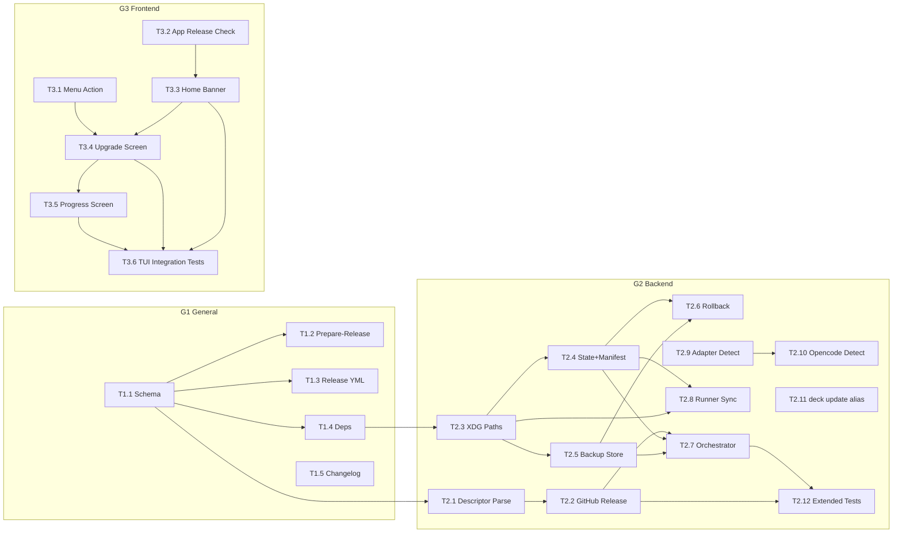

# Tasks: Deck Self-Update System

## Source

- Spec: `add-self-update-system` spec artifact
- Design: `add-self-update-system` design artifact
- Capabilities affected: `release-descriptor-detection`, `tui-upgrade-notification`, `xdg-deck-storage`, `legacy-deck-config-migration`, `atomic-upgrade-rollback`, `runner-upgrade-sync`, `deck-upgrade-command`, `github-release-download`, `binary-install-replace`, `tui-home-menu`, `runner-adapter-composition`, `release-pipeline`

## Resolved Design Open Questions

1. **CLI command strategy**: support both `deck update` and `deck upgrade` as aliases to the same handler; keep `upgrade` for backwards compatibility.
2. **Runner detection**: add optional `detectDeckInstall()` to `RunnerAdapter`; opencode implements it.
3. **Homebrew behavior**: refuse binary self-upgrade for Homebrew-owned binary; allow content/migration sync by default.
4. **TUI test harness**: use existing Bun test patterns; if no Ink harness exists, add minimal render helper/snapshot tests.

---

## Execution Groups

### G1 General / Release Infrastructure

#### T1.1 Add `release.json` schema fixture + release descriptor docs

**Owner**: General Apply
**Priority**: P0
**Complexity**: Low
**Parallel**: Yes
**Depends on**: none
**Status**: unblocked

**Description**
Create a TypeScript type file and Zod schema for `release.json` (from design §2). Include a JSON fixture example file and a brief doc explaining the descriptor schema, item kinds, and required fields.

**Files**
- `apps/cli/src/upgrade-command/release-descriptor.ts` — create (types + Zod schema only)
- `docs/release-descriptor.md` — create (schema documentation)

**TDD Plan**
1. Write tests for Zod schema validation: valid descriptor, missing fields, unknown kind, invalid checksum.
2. Implement types and Zod schema to pass.

**Verification**
```bash
bun test apps/cli/src/upgrade-command/release-descriptor.test.ts
tsc --noEmit
```

---

#### T1.2 Add `scripts/prepare-release.ts`

**Owner**: General Apply
**Priority**: P1
**Complexity**: Medium
**Parallel**: Yes
**Depends on**: T1.1 (uses schema for validation)

**Description**
Create a CLI script that guides maintainers through generating `release.json`. Prompts for version, tag, channel, item kinds, platform assets, checksums. Validates output against the Zod schema from T1.1. Outputs `release.json` to stdout or file.

**Files**
- `scripts/prepare-release.ts` — create
- `scripts/prepare-release.test.ts` — create

**TDD Plan**
1. Test descriptor generation with valid inputs.
2. Test validation rejects incomplete items.
3. Test checksum integration (read from file).
4. Implement to pass.

**Verification**
```bash
bun test scripts/prepare-release.test.ts
tsc --noEmit
```

---

#### T1.3 Update `.github/workflows/release.yml` to attach `release.json`

**Owner**: General Apply
**Priority**: P1
**Complexity**: Low
**Parallel**: Yes
**Depends on**: T1.1 (schema must exist)

**Description**
Modify the release workflow to run `prepare-release.ts` (or consume pre-built `release.json`) and upload it as a GitHub Release asset alongside binary tarballs and `checksums.txt`.

**Files**
- `.github/workflows/release.yml` — modify

**TDD Plan**
1. Verify workflow YAML is valid.
2. Verify `release.json` appears in expected upload step.
3. Manual: dry-run release workflow if possible.

**Verification**
```bash
# YAML syntax check
bun -e "const y = require('yaml'); y.parse(require('fs').readFileSync('.github/workflows/release.yml','utf8')); console.log('valid')"
```

---

#### T1.4 Add/adjust package deps only if needed for schema validation

**Owner**: General Apply
**Priority**: P2
**Complexity**: Low
**Parallel**: Yes
**Depends on**: T1.1

**Description**
If `zod` or `yaml` dependencies are not already in the project, add them to the CLI package. Otherwise verify existing versions are sufficient. This is a housekeeping task to ensure no missing deps block other tasks.

**Files**
- `apps/cli/package.json` — modify (if needed)
- `package.json` — modify (workspace root, if needed)

**TDD Plan**
1. Verify `bun install` succeeds.
2. Verify `import { z } from 'zod'` resolves.

**Verification**
```bash
bun install
tsc --noEmit
```

---

#### T1.5 Add CHANGELOG or release-notes stub documenting self-update/Homebrew behavior

**Owner**: General Apply
**Priority**: P2
**Complexity**: Low
**Parallel**: Yes
**Depends on**: none

**Description**
Add a `CHANGELOG.md` entry (or create if missing) documenting the self-update feature, Homebrew user guidance (`brew upgrade deck`), and the `release.json` descriptor format.

**Files**
- `CHANGELOG.md` — create or modify

**TDD Plan**
N/A — documentation only.

**Verification**
```bash
# Verify file exists and is non-empty
test -s CHANGELOG.md && echo "ok"
```

---

### G2 Backend / Upgrade Core

#### T2.1 Add `release-descriptor.ts` parsing + platform selection

**Owner**: Backend Apply
**Priority**: P0
**Complexity**: Medium
**Parallel**: No — extends T1.1 types with parsing logic
**Depends on**: T1.1
**Status**: unblocked

**Description**
Implement descriptor parsing: fetch `release.json` from GitHub Release assets, validate with Zod schema, select applicable items for current platform/OS/arch, order items by kind priority (advisory → migration → binary → content → channel_eol), and compute the effective item list. Legacy fallback when `release.json` absent.

**Files**
- `apps/cli/src/upgrade-command/release-descriptor.ts` — modify (add parsing logic)
- `apps/cli/src/upgrade-command/release-descriptor.test.ts` — create

**TDD Plan**
1. Test: parse valid descriptor → typed items.
2. Test: platform selection filters correct binary item.
3. Test: missing `release.json` → legacy fallback flag.
4. Test: malformed descriptor → DESCRIPTOR_INVALID error.
5. Test: item ordering matches spec priority.
6. Implement to pass all tests.

**Verification**
```bash
bun test apps/cli/src/upgrade-command/release-descriptor.test.ts
```

---

#### T2.2 Refactor `github-release.ts` to fetch/validate `release.json`, with legacy fallback

**Owner**: Backend Apply
**Priority**: P0
**Complexity**: Medium
**Parallel**: No — depends on T2.1
**Depends on**: T2.1
**Status**: unblocked

**Description**
Modify `github-release.ts` to attempt fetching `release.json` asset first. If found and valid, use descriptor-based upgrade flow. If missing, fall back to existing body-parsed SHA-256 legacy path. Add ETag/conditional request support and cache TTL (6h). Wire timeout from config (5000ms default).

**Files**
- `apps/cli/src/upgrade-command/github-release.ts` — modify
- `apps/cli/src/upgrade-command/__tests__/github-release.test.ts` — modify

**TDD Plan**
1. Test: descriptor present → uses descriptor checksum.
2. Test: descriptor absent → legacy body-parsing path.
3. Test: ETag cached → conditional request.
4. Test: timeout expires → network-error result.
5. Test: cache TTL respected → skip fetch within window.
6. Implement to pass.

**Verification**
```bash
bun test apps/cli/src/upgrade-command/__tests__/github-release.test.ts
```

---

#### T2.3 Add XDG split path helpers + legacy `~/.config/.deck` migration in `runtime/paths.ts`

**Owner**: Backend Apply
**Priority**: P0
**Complexity**: Medium
**Parallel**: Yes (no code dependency on T2.1/T2.2)
**Depends on**: T1.4 (deps available)
**Status**: unblocked

**Description**
Add XDG path resolver functions: `getConfigDir()`, `getStateDir()`, `getCacheDir()` respecting `$XDG_CONFIG_HOME`, `$XDG_STATE_HOME`, `$XDG_CACHE_HOME` with defaults. Add `migrateLegacyDeckConfig()` one-shot function: detect `~/.config/.deck/config.json`, create full backup, copy/migrate to `~/.config/deck/config.json`, write migration marker atomically. Preserve all existing fields: `packageInstructions`, `adaptiveMemory`, `orchestratorPersonality`, `profiles`.

**Files**
- `apps/cli/src/runtime/paths.ts` — modify
- `apps/cli/src/runtime/paths.test.ts` — create/modify
- `apps/cli/src/upgrade-command/xdg-migration.ts` — create
- `apps/cli/src/upgrade-command/xdg-migration.test.ts` — create

**TDD Plan**
1. Test: XDG env vars set → correct paths.
2. Test: defaults → `~/.config/deck/`, `~/.local/state/deck/`, `~/.cache/deck/`.
3. Test: legacy present → migration runs, marker written.
4. Test: marker exists → migration skipped.
5. Test: corrupt legacy → MIGRATION_FAILED error, no marker.
6. Test: all config fields preserved after migration.
7. Implement to pass.

**Verification**
```bash
bun test apps/cli/src/runtime/paths.test.ts apps/cli/src/upgrade-command/xdg-migration.test.ts
```

---

#### T2.4 Add state/manifest schemas and persistence helpers

**Owner**: Backend Apply
**Priority**: P0
**Complexity**: High
**Parallel**: No — depends on T2.3 (XDG paths)
**Depends on**: T2.3
**Status**: unblocked

**Description**
Create `state-store.ts` and `manifest-store.ts` with full Zod schemas from design §2. Implement atomic read/write (temp file + rename), lock file management with PID and stale-after detection, `activeOperation` tracking, and `installHistory` JSONL append. Implement `manifest-store.ts` with v1→v2 migration pure function, atomic write, and checksum/drift helpers.

**Files**
- `apps/cli/src/upgrade-command/state-store.ts` — create
- `apps/cli/src/upgrade-command/state-store.test.ts` — create
- `apps/cli/src/upgrade-command/manifest-store.ts` — create
- `apps/cli/src/upgrade-command/manifest-store.test.ts` — create

**TDD Plan**
1. Test: state read/write round-trip.
2. Test: lock acquire/release.
3. Test: stale lock detection (PID dead or age ≥ 15m).
4. Test: concurrent lock rejection.
5. Test: activeOperation set/clear.
6. Test: history append + rotation.
7. Test: manifest v1→v2 migration preserves entries.
8. Test: unknown future schema → rejected.
9. Test: atomic write (temp + rename).
10. Implement to pass.

**Verification**
```bash
bun test apps/cli/src/upgrade-command/state-store.test.ts apps/cli/src/upgrade-command/manifest-store.test.ts
```

---

#### T2.5 Add backup/retention module

**Owner**: Backend Apply
**Priority**: P1
**Complexity**: Medium
**Parallel**: No — depends on T2.3 (XDG cache path)
**Depends on**: T2.3
**Status**: unblocked

**Description**
Create `backup-store.ts` implementing backup manifest creation, file copy/backup, restore (reverse-order), and retention cleanup (keep latest 5, max age 30 days, protect referenced backup). Use Zod schema from design §2.

**Files**
- `apps/cli/src/upgrade-command/backup-store.ts` — create
- `apps/cli/src/upgrade-command/backup-store.test.ts` — create

**TDD Plan**
1. Test: backup creates manifest with correct entries.
2. Test: restore reverses all entries.
3. Test: restore handles missing backup files gracefully.
4. Test: retention prunes old backups, keeps latest 5.
5. Test: referenced backup is protected from pruning.
6. Test: file that didn't exist is deleted on restore (not error).
7. Implement to pass.

**Verification**
```bash
bun test apps/cli/src/upgrade-command/backup-store.test.ts
```

---

#### T2.6 Add rollback module and CLI `deck rollback`

**Owner**: Backend Apply
**Priority**: P1
**Complexity**: Medium
**Parallel**: No — depends on T2.4 (state store), T2.5 (backup store)
**Depends on**: T2.4, T2.5
**Status**: unblocked

**Description**
Add rollback orchestration: read backup manifest, restore entries in reverse, invoke per-runner adapter rollback for runner entries, update `state.yaml` with `rolled_back` history entry, clear lock. Wire `deck rollback` CLI command.

**Files**
- `apps/cli/src/upgrade-command/rollback.ts` — create
- `apps/cli/src/upgrade-command/rollback.test.ts` — create
- `apps/cli/src/upgrade-command/index.ts` — modify (add rollback subcommand routing)

**TDD Plan**
1. Test: rollback restores binary from backup.
2. Test: rollback restores runner files via adapter.
3. Test: rollback updates state to `rolled_back`.
4. Test: rollback with no backup → ROLLBACK_FAILED error.
5. Test: partial rollback → critical error with manual path.
6. Implement to pass.

**Verification**
```bash
bun test apps/cli/src/upgrade-command/rollback.test.ts
```

---

#### T2.7 Add upgrade orchestrator state machine

**Owner**: Backend Apply
**Priority**: P0
**Complexity**: High
**Parallel**: No — depends on T2.2 (descriptor), T2.4 (state), T2.5 (backup)
**Depends on**: T2.2, T2.4, T2.5
**Status**: unblocked

**Description**
Create `orchestrator.ts` implementing the full upgrade state machine from spec §States and Transitions. Ordered execution: lock → backup → download/stage → migration items → binary item (atomic replace) → content items (runner sync) → verify → write state/manifest/history → release lock → cleanup. On any failure: auto-rollback from backup. On interrupted launch: detect stale lock and recover.

**Files**
- `apps/cli/src/upgrade-command/orchestrator.ts` — create
- `apps/cli/src/upgrade-command/orchestrator.test.ts` — create

**TDD Plan**
1. Test: happy path binary+content upgrade.
2. Test: content-only upgrade (no binary).
3. Test: migration item runs before binary.
4. Test: advisory/channel_eol items surface info but don't mutate.
5. Test: checksum failure → auto-rollback.
6. Test: binary rename failure → auto-rollback.
7. Test: sync failure → auto-rollback.
8. Test: interrupted state recovery on next launch.
9. Test: lock contention → UPGRADE_LOCKED error.
10. Test: Homebrew install → binary skip, content allowed.
11. Implement to pass.

**Verification**
```bash
bun test apps/cli/src/upgrade-command/orchestrator.test.ts
```

---

#### T2.8 Add content sync / runner sync module using existing `config.json` selections

**Owner**: Backend Apply
**Priority**: P1
**Complexity**: High
**Parallel**: No — depends on T2.3 (paths), T2.4 (manifest)
**Depends on**: T2.3, T2.4
**Status**: unblocked

**Description**
Create `runner-sync.ts`: detect installed runners via `RunnerAdapter` registry and optional `detectDeckInstall()`, read `packageInstructions[runnerId]` from config.json, generate `CapabilityInstructionBundle`, call `buildDeveloperTeamInstallPlan()` / `applyDeveloperTeamInstall()` / `verifyDeveloperTeamInstall()` with `--sync` semantics (no package installs). Record per-runner results in manifest.

**Files**
- `apps/cli/src/upgrade-command/runner-sync.ts` — create
- `apps/cli/src/upgrade-command/runner-sync.test.ts` — create

**TDD Plan**
1. Test: detect installed opencode runner.
2. Test: sync reads packageInstructions from config.
3. Test: sync calls adapter build/apply/verify.
4. Test: sync does NOT call npm/pip install.
5. Test: sync preserves model/memory settings.
6. Test: partial sync failure → per-runner status recorded.
7. Test: undetected runner → skipped, no error.
8. Implement to pass.

**Verification**
```bash
bun test apps/cli/src/upgrade-command/runner-sync.test.ts
```

---

#### T2.9 Extend `RunnerAdapter` with optional `detectDeckInstall()`

**Owner**: Backend Apply
**Priority**: P1
**Complexity**: Low
**Parallel**: Yes
**Depends on**: none
**Status**: unblocked

**Description**
Add an optional `detectDeckInstall?(input): RunnerDeckInstallStatus` method to the `RunnerAdapter` interface. Default implementation returns `undefined` (not detected). The method checks if Deck-managed artifacts exist at the runner's known config root.

**Files**
- `packages/core/src/runner-adapter.ts` — modify
- `packages/core/src/runner-adapter.test.ts` — create/modify

**TDD Plan**
1. Test: default implementation returns undefined.
2. Test: interface type accepts optional method.
3. Implement minimal addition.

**Verification**
```bash
bun test packages/core/src/runner-adapter.test.ts
tsc --noEmit
```

---

#### T2.10 Implement opencode `detectDeckInstall()`

**Owner**: Backend Apply
**Priority**: P1
**Complexity**: Low
**Parallel**: Yes
**Depends on**: T2.9
**Status**: unblocked

**Description**
Implement `detectDeckInstall()` in the opencode runner adapter. Scan `~/.config/opencode/` for Deck-managed artifacts (skills, AGENTS.md, etc.) and return `RunnerDeckInstallStatus`.

**Files**
- `apps/cli/src/runner-adapters.ts` — modify

**TDD Plan**
1. Test: opencode adapter detects Deck artifacts when present.
2. Test: returns not-detected when no artifacts found.
3. Implement to pass.

**Verification**
```bash
bun test apps/cli/src/runner-adapters.test.ts
```

---

#### T2.11 Add command alias `deck update` while preserving `deck upgrade`

**Owner**: Backend Apply
**Priority**: P1
**Complexity**: Low
**Parallel**: Yes
**Depends on**: none
**Status**: unblocked

**Description**
Add `deck update` as an alias for the existing `deck upgrade` command. Both route to the same handler. Ensure CLI help text reflects both commands.

**Files**
- `apps/cli/src/upgrade-command/index.ts` — modify
- `apps/cli/src/cli.ts` — modify (or command registration file)

**TDD Plan**
1. Test: `deck update` invokes same handler as `deck upgrade`.
2. Test: both commands appear in help output.
3. Implement alias registration.

**Verification**
```bash
bun test apps/cli/src/upgrade-command/__tests__/index.test.ts
tsc --noEmit
```

---

#### T2.12 Update/extend upgrade-command tests (TDD)

**Owner**: Backend Apply
**Priority**: P1
**Complexity**: Medium
**Parallel**: No — depends on T2.2, T2.7
**Depends on**: T2.2, T2.7
**Status**: unblocked

**Description**
Extend existing `upgrade-command/__tests__/index.test.ts` and `install.test.ts` to cover the new orchestrator delegation, Homebrew no-op, development-mode behavior, and atomic replacement with backup-store integration. Ensure existing tests still pass with the refactored flow.

**Files**
- `apps/cli/src/upgrade-command/__tests__/index.test.ts` — modify
- `apps/cli/src/upgrade-command/__tests__/install.test.ts` — modify

**TDD Plan**
1. Test: `deck upgrade` delegates to orchestrator.
2. Test: dev mode → refuses self-upgrade.
3. Test: Homebrew mode → refuses binary, allows content.
4. Test: install.ts atomic replace uses backup-store path.
5. Test: checksum mismatch → rollback triggered.
6. Extend existing tests for new behavior.

**Verification**
```bash
bun test apps/cli/src/upgrade-command/__tests__/
```

---

### G3 Frontend / TUI Integration

#### T3.1 Replace `upgrade-tools` placeholder handler in menu options

**Owner**: Frontend Apply
**Priority**: P0
**Complexity**: Low
**Parallel**: Yes
**Depends on**: none
**Status**: unblocked

**Description**
Replace the `upgrade-tools` placeholder in `menu-options.ts` with an explicit `Update Deck` action that dispatches to the upgrade flow. Wire action to a callback that triggers the orchestrator.

**Files**
- `apps/cli/src/menu-options.ts` — modify
- `apps/cli/src/menu-options.test.ts` — create/modify

**TDD Plan**
1. Test: menu includes `Update Deck` option.
2. Test: selecting it invokes the upgrade callback.
3. Test: no placeholder text remains.
4. Implement to pass.

**Verification**
```bash
bun test apps/cli/src/menu-options.test.ts
```

---

#### T3.2 Add release-check state to TUI root (`app.tsx`) with non-blocking timeout

**Owner**: Frontend Apply
**Priority**: P0
**Complexity**: Medium
**Parallel**: Yes
**Depends on**: none (uses injected release-check dependency)
**Status**: unblocked

**Description**
Add release-check state management to `app.tsx`. On mount, launch async release check with 5s timeout. Store result in component state: `available | none | network-error`. Never block initial render. Pass result to home screen as props. Inject release-check function for testability.

**Files**
- `apps/cli/src/tui/app.tsx` — modify
- `apps/cli/src/tui/app.test.tsx` — create/modify

**TDD Plan**
1. Test: TUI renders immediately before check completes.
2. Test: check resolves available → state updates.
3. Test: check timeout → state = network-error, no crash.
4. Test: check network failure → no banner, normal TUI.
5. Test: injected mock used (no real network in tests).
6. Implement to pass.

**Verification**
```bash
bun test apps/cli/src/tui/app.test.tsx
```

---

#### T3.3 Add/modify home-screen banner for upgrade/advisory/channel_eol

**Owner**: Frontend Apply
**Priority**: P0
**Complexity**: Medium
**Parallel**: No — depends on T3.2 (receives check result as props)
**Depends on**: T3.2
**Status**: unblocked

**Description**
Render conditional banners in `home-screen.tsx` based on release-check result props:
- **Upgrade available**: show version, kinds, required/optional flags.
- **Advisory**: red banner with severity and message.
- **Channel EOL**: deprecation notice with successor channel.

**Files**
- `apps/cli/src/tui/screens/home-screen.tsx` — modify
- `apps/cli/src/tui/screens/home-screen.test.tsx` — create/modify

**TDD Plan**
1. Test: no check result → no banner.
2. Test: available result → upgrade banner with version.
3. Test: advisory → red banner with severity.
4. Test: channel_eol → deprecation notice.
5. Test: network-error → no banner.
6. Implement to pass.

**Verification**
```bash
bun test apps/cli/src/tui/screens/home-screen.test.tsx
```

---

#### T3.4 Add upgrade available screen

**Owner**: Frontend Apply
**Priority**: P1
**Complexity**: Medium
**Parallel**: No — depends on T3.1 (menu action), T3.3 (banner)
**Depends on**: T3.1, T3.3
**Status**: unblocked

**Description**
Create upgrade flow screen that shows: target version, release items (kinds, required/optional), and a confirmation prompt. On confirm, dispatch to the upgrade orchestrator. On cancel, return to home.

**Files**
- `apps/cli/src/tui/screens/upgrade-screen.tsx` — create
- `apps/cli/src/tui/screens/upgrade-screen.test.tsx` — create

**TDD Plan**
1. Test: renders version and item list.
2. Test: confirm triggers orchestrator dispatch.
3. Test: cancel returns to home.
4. Test: required items are clearly marked.
5. Implement to pass.

**Verification**
```bash
bun test apps/cli/src/tui/screens/upgrade-screen.test.tsx
```

---

#### T3.5 Add upgrade progress/rollback UI screen

**Owner**: Frontend Apply
**Priority**: P1
**Complexity**: Medium
**Parallel**: No — depends on T3.4 (upgrade screen)
**Depends on**: T3.4
**Status**: unblocked

**Description**
Create progress screen showing upgrade phase (downloading → staging → migrating → replacing → syncing → verifying → completed). On failure, show rollback progress. On completion, show restart message.

**Files**
- `apps/cli/src/tui/screens/upgrade-progress-screen.tsx` — create
- `apps/cli/src/tui/screens/upgrade-progress-screen.test.tsx` — create

**TDD Plan**
1. Test: renders current phase label.
2. Test: failure state shows rollback message.
3. Test: completion state shows restart prompt.
4. Test: phase transitions update display.
5. Implement to pass.

**Verification**
```bash
bun test apps/cli/src/tui/screens/upgrade-progress-screen.test.tsx
```

---

#### T3.6 Add TUI tests for banner, menu action, timeout/no-network behavior

**Owner**: Frontend Apply
**Priority**: P1
**Complexity**: Medium
**Parallel**: No — depends on T3.3, T3.4, T3.5
**Depends on**: T3.3, T3.4, T3.5
**Status**: unblocked

**Description**
Integration-level TUI tests covering end-to-end flows: banner appears after async check, selecting Update Deck navigates to upgrade screen, timeout suppresses banner, no-network suppresses banner, rollback option visible after failed upgrade. Use minimal render helper or snapshot testing if Ink harness exists; otherwise add lightweight test utility.

**Files**
- `apps/cli/src/tui/__tests__/tui-integration.test.tsx` — create

**TDD Plan**
1. Test: full flow — check available → banner → select → upgrade screen.
2. Test: timeout flow → no banner → normal home.
3. Test: network error → no banner.
4. Test: upgrade failure → rollback option visible.
5. Implement test utility and tests.

**Verification**
```bash
bun test apps/cli/src/tui/__tests__/tui-integration.test.tsx
```

---

## Dependency Graph

```
T1.1 (schema/types)
  → T1.2 (prepare-release)
  → T1.3 (release.yml)
  → T1.4 (deps check)
  → T2.1 (descriptor parsing)
T1.4 → T2.3 (XDG paths)
T2.1 → T2.2 (github-release refactor)
T2.3 → T2.4 (state/manifest stores)
T2.3 → T2.5 (backup store)
T2.2 + T2.4 + T2.5 → T2.7 (orchestrator)
T2.3 + T2.4 → T2.8 (runner sync)
T2.9 (RunnerAdapter detectDeckInstall)
T2.9 → T2.10 (opencode detectDeckInstall)
T2.4 + T2.5 → T2.6 (rollback)
T2.2 + T2.7 → T2.12 (extended tests)
T3.1 (menu options) — standalone
T3.2 (app.tsx release check) — standalone
T3.2 → T3.3 (home-screen banners)
T3.1 + T3.3 → T3.4 (upgrade screen)
T3.4 → T3.5 (progress/rollback screen)
T3.3 + T3.4 + T3.5 → T3.6 (TUI integration tests)
```

## Parallelization Plan

| Phase | Tasks | Can Run in Parallel |
|---|---|---|
| G1 General | T1.1, T1.2, T1.3, T1.4, T1.5 | Yes — T1.1 first, then T1.2/T1.3/T1.4 parallel; T1.5 independent |
| G2 Backend Wave 1 | T2.3, T2.9, T2.11 | Yes — independent of each other |
| G2 Backend Wave 2 | T2.1, T2.10 | Partial — T2.1 needs T1.1; T2.10 needs T2.9 |
| G2 Backend Wave 3 | T2.2, T2.4, T2.5 | Partial — T2.2 needs T2.1; T2.4/T2.5 need T2.3 |
| G2 Backend Wave 4 | T2.6, T2.7, T2.8 | No — sequential dependency chain |
| G2 Backend Wave 5 | T2.12 | No — needs T2.2 + T2.7 |
| G3 Frontend Wave 1 | T3.1, T3.2 | Yes — independent |
| G3 Frontend Wave 2 | T3.3 | No — needs T3.2 |
| G3 Frontend Wave 3 | T3.4 | No — needs T3.1 + T3.3 |
| G3 Frontend Wave 4 | T3.5 | No — needs T3.4 |
| G3 Frontend Wave 5 | T3.6 | No — needs T3.3 + T3.4 + T3.5 |

## Responsibility Contracts

| Contract / Boundary | Owner | Consumers | Notes |
|---|---|---|---|
| `release.json` Zod schema + types | General (T1.1) | Backend (T2.1, T2.2), Scripts (T1.2) | Schema is shared contract |
| XDG path helpers | Backend (T2.3) | Backend (T2.4, T2.5, T2.7, T2.8) | Path resolver is infrastructure |
| State/manifest persistence API | Backend (T2.4) | Backend (T2.6, T2.7) | State store is backend-only |
| Backup store API | Backend (T2.5) | Backend (T2.6, T2.7) | Backup is backend-only |
| `RunnerAdapter.detectDeckInstall()` | Backend (T2.9) | Backend (T2.8, T2.10) | Optional adapter facet |
| Release-check result shape | Frontend (T3.2) | Frontend (T3.3, T3.4, T3.6) | TUI state contract |
| Upgrade dispatch callback | Frontend (T3.1, T3.4) | Backend orchestrator (T2.7) | TUI calls orchestrator; no reverse dep |

## Complexity Summary

| Complexity | Count | Task Numbers |
|---|---|---|
| Low | 8 | T1.1, T1.3, T1.4, T1.5, T2.9, T2.10, T2.11, T3.1 |
| Medium | 12 | T1.2, T2.1, T2.2, T2.3, T2.5, T2.6, T2.8, T2.12, T3.2, T3.3, T3.4, T3.5, T3.6 |
| High | 3 | T2.4, T2.7 |

> Total: 23 tasks (G1: 5, G2: 12, G3: 6)

## Flagged for Splitting

- **T2.7 (orchestrator)**: High complexity, touches 10+ test scenarios, spans full state machine. If implementation exceeds 400 lines, split into `orchestrator-core.ts` (state machine transitions) + `orchestrator-items.ts` (per-kind item execution).
- **T2.4 (state/manifest stores)**: High complexity, two separate stores in one task. Consider splitting into T2.4a (state-store) and T2.4b (manifest-store) if session exceeds comfort.

## Review Workload Forecast

| Signal | Value |
|---|---|
| Estimated changed lines | 400-800 |
| 400-line budget risk | Medium |
| Scope reduction recommended | No |
| Sequential work slices recommended | Yes — backend waves + frontend waves |
| Decision needed before Apply | No |

**Rationale**: 23 tasks with 3 high-complexity items. Backend has 5 sequential waves due to dependency chain. Frontend has 5 waves but lighter tasks. Total estimated new/modified code is 400-800 lines across ~30 files. Risk is medium due to orchestrator complexity and XDG migration safety requirements. Sequential slicing by wave is recommended to maintain review quality.

## Open Questions / Blockers

None — all Design open questions resolved above.

Blocked tasks: **none**. All tasks are either `unblocked` or `allowed-with-placeholder` (none needed).

## Verification Commands

### Per-Group

**G1 General:**
```bash
bun test apps/cli/src/upgrade-command/release-descriptor.test.ts
bun test scripts/prepare-release.test.ts
tsc --noEmit
```

**G2 Backend:**
```bash
bun test apps/cli/src/upgrade-command/
bun test apps/cli/src/runtime/paths.test.ts
bun test packages/core/src/runner-adapter.test.ts
tsc --noEmit
```

**G3 Frontend:**
```bash
bun test apps/cli/src/tui/
bun test apps/cli/src/menu-options.test.ts
tsc --noEmit
```

### Full Suite
```bash
bun test
tsc --noEmit
```

## Mermaid Summary Source


