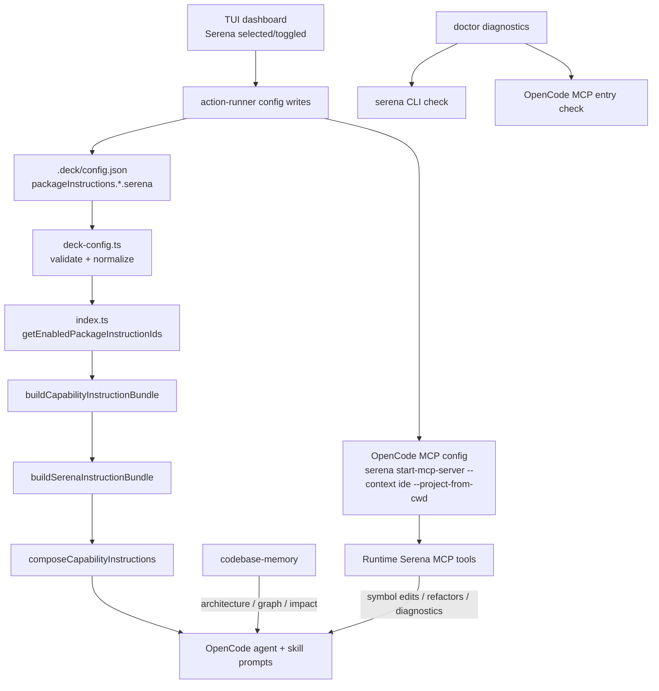

# Design: Add Serena MCP Package

## Source

- Proposal: `add-serena-package` proposal artifact
- Capabilities affected: `serena-symbolic-retrieval`, `serena-symbolic-editing`, `serena-refactoring`, `serena-diagnostics`, package instruction registry, Deck config, runner dashboard, doctor diagnostics
- Spec status: not yet available
- Adaptive context: loaded; no authoritative Serena-specific prior design found

## Current Architecture Context

- Package instructions are runner-neutral core prompt fragments under `packages/core/src/teams/developer/instruction-bundles/`.
- `index.ts` owns package ID typing, builder registration, canonical ordering, enabled-ID resolution, and prompt composition via `composeCapabilityInstructions()`.
- `deck-config.ts` owns valid package IDs and normalizes every known package toggle to `false` for `pi` and `opencode` defaults.
- OpenCode team install reads `.deck/config.json`, resolves enabled package IDs for runner `opencode`, builds a `CapabilityInstructionBundle`, and injects it into generated agents/skills.
- The dashboard has two related concepts:
  - `selectedCapabilities`: user-facing runner capability selection/install planning.
  - `packageInstructions`: config-write state for instruction injection.
- OpenCode capability planning/config writing is adapter-owned in `packages/adapter-opencode/src/capability-catalog.ts`, `installation-plan.ts`, and `runner-adapter.ts`; generic TUI execution also has MCP writer branches in `apps/cli/src/tui/runner-dashboard/action-runner.ts`.
- Doctor diagnostics currently check memory provider binaries and known OpenCode MCP entries for `supermemory` and `codebase-memory-mcp`.

## Proposed Architecture

Add Serena as a first-class package instruction plus OpenCode MCP capability:

1. Core adds package ID `"serena"`, builder `buildSerenaInstructionBundle()`, and canonical ordering after `adaptive-memory`.
2. Serena bundle emits two fragments (`surface: "agent"`, `surface: "skill"`) modeled after `codebase-memory`.
3. Deck config accepts and normalizes `serena` toggles, defaulting to `false`; project `.deck/config.json` enables `serena: true` for configured runners per approved scope.
4. Dashboard exposes Serena selected by default and persists `packageInstructions.<runner>.serena` through config writes.
5. OpenCode adapter treats Serena as a local MCP server configured as:
   - server name: `serena`
   - command: `["serena", "start-mcp-server", "--context", "ide", "--project-from-cwd"]`
6. Doctor checks both the Serena CLI and OpenCode MCP config entry.

### Component / Module Boundaries

| Component | Responsibility | Change Type |
|---|---|---|
| `packages/core/src/teams/developer/instruction-bundles/serena.ts` | Canonical Serena prompt guidance | new |
| `packages/core/src/teams/developer/instruction-bundles/index.ts` | Register `serena`, type it, order it, compose fragments | modified |
| `packages/core/src/config/deck-config.ts` | Validate/normalize `packageInstructions.*.serena` | modified |
| `packages/adapter-opencode/src/*` | OpenCode capability catalog/install/MCP config mapping for Serena | modified |
| `apps/cli/src/tui/runner-dashboard/*` | Show Serena toggle, persist config, report team consumption | modified |
| `apps/cli/src/doctor-command/doctor-diagnostics.ts` | Serena CLI + MCP diagnostics | modified |
| `.deck/config.json` | Enable Serena package instruction in project config | modified |

### Data Flow

```text
.deck/config.json
  └─ packageInstructions.opencode.serena=true
      └─ readDeckConfig()/validateDeckConfig()
          └─ getEnabledPackageInstructionIds(config, "opencode")
              └─ buildCapabilityInstructionBundle(["serena"])
                  └─ buildSerenaInstructionBundle()
                      └─ composeCapabilityInstructions(... surface agent/skill ...)
                          └─ generated OpenCode agents/skills include Serena guidance

TUI state
  └─ CANONICAL_INSTRUCTION_PACKAGE_IDS + selectedCapabilities include serena
      └─ Review & Install config write
          ├─ .deck/config.json packageInstructions.<runner>.serena=true/false
          └─ OpenCode MCP config: serena start-mcp-server --context ide --project-from-cwd

Runtime
  └─ OpenCode starts Serena MCP server
      └─ agents use Serena tools for symbol retrieval/edit/refactor/diagnostics
```

### API / Contract Implications

| Endpoint / Interface | Change | Backward Compatible |
|---|---|---|
| `CapabilityInstructionPackageId` | Add union member `"serena"` | yes |
| `PackageInstructionPackageId` | Add config package ID `"serena"` | yes; missing values normalize to `false` |
| `NormalizedDeckConfig.packageInstructions` | Each runner map includes `serena: boolean` | yes; defaults added |
| OpenCode capability IDs | Add user-facing `"serena"` capability | yes |
| MCP config writer contract | Add local command branch for Serena | yes |

### State / Persistence Implications

- `.deck/config.json` gains non-secret boolean fields only:
  - `packageInstructions.pi.serena`
  - `packageInstructions.opencode.serena`
- OpenCode config gains/updates an MCP server entry for `serena` when selected.
- No database, schema, or persistent application data changes.
- Serena memory tools remain disabled by instruction; no new memory persistence is introduced.

### Migration / Backward Compatibility

- Existing configs without `serena` remain valid; normalization fills `false`.
- Existing package instruction bundles retain deterministic relative order; `serena` is appended after `adaptive-memory`.
- Rollback is removing the new ID/builder/config/MCP entries; no data migration required.

## File Impact Estimate

| File / Path | Action | Rationale |
|---|---|---|
| `packages/core/src/teams/developer/instruction-bundles/serena.ts` | create | New canonical Serena package instructions |
| `packages/core/src/teams/developer/instruction-bundles/index.ts` | modify | Import/register builder; add `serena` to type, builder map, package order |
| `packages/core/src/config/deck-config.ts` | modify | Add `serena` package ID and default/normalization slots |
| `packages/adapter-opencode/src/capability-catalog.ts` | modify | Add user-facing Serena capability with command + MCP detector metadata |
| `packages/adapter-opencode/src/installation-plan.ts` | modify | Add Serena as local MCP server install/config option |
| `packages/adapter-opencode/src/runner-capabilities.ts` | modify | Include Serena in selected tool ID typing/planning if necessary |
| `packages/adapter-opencode/src/runner-adapter.ts` | modify | Add `writeMcpConfigFromCapability("serena")` command branch |
| `apps/cli/src/tui/runner-dashboard/state.ts` | modify | Add Serena to canonical package IDs/default selected state |
| `apps/cli/src/tui/runner-dashboard/input-handler.ts` | modify | Add Serena to fallback user-facing ID arrays |
| `apps/cli/src/tui/runner-dashboard/action-runner.ts` | modify | Preserve/write `serena` config and local MCP command mapping |
| `apps/cli/src/tui/runner-dashboard/selectors.ts` | modify | Add team capability consumption signal for Serena |
| `apps/cli/src/doctor-command/doctor-diagnostics.ts` | modify | Check `serena` binary and OpenCode MCP entry |
| `.deck/config.json` | modify | Enable `serena: true` under package instructions per approved config scope |
| `packages/core/src/teams/developer/instruction-bundles/*.test.ts` | modify/create | Bundle registration, order, fragment, parity coverage |
| `packages/core/src/config/deck-config.test.ts` | modify | Defaults, validation, unknown field, round-trip coverage |
| `apps/cli/src/tui/runner-dashboard/*.test.ts` | modify | Default selection, fallback arrays, config-write preservation, MCP write branch |
| `packages/adapter-opencode/src/*.test.ts` | modify | Serena catalog/install/MCP writer plan coverage |
| `apps/cli/src/doctor-command/*.test.ts` | create/modify if present | Serena doctor coverage; may require extracting helpers if no current test exists |

## Serena Tool Mapping

| Category | Instruct Agents To Use | Skip / Disable | Notes |
|---|---|---|---|
| Symbol retrieval | `find_symbol`, `find_referencing_symbols`, `find_implementations`, `find_declaration`, `get_symbols_overview` | basic file listing/search tools from Serena | Use for LSP-aware symbol discovery after project context is known |
| Symbol editing | `replace_symbol_body`, `insert_after_symbol`, `insert_before_symbol`, `safe_delete_symbol` | raw line-based Serena edit helpers if present | Prefer precise symbol edits; verify after mutation |
| Refactoring | `rename_symbol` | manual multi-file rename | Use for atomic cross-file renames |
| Diagnostics | `get_diagnostics_for_file` | none | Run after Serena edits/refactors when available |
| Memory | none | all Serena memory read/write/list tools | Explicitly disabled; Deck uses adaptive-memory/Supermemory/Engram architecture |
| Basic tools | none | shell/read/list/search equivalents | OpenCode `--context ide` should hide these, but instructions also forbid them |

## TUI Integration Design

- Add `serena` to `CANONICAL_INSTRUCTION_PACKAGE_IDS` so it is toggleable as a package instruction.
- Add `selectedCapabilities.serena = true` to dashboard defaults because Serena is high-value and expected on by default.
- Keep `packageInstructions` independent from `selectedCapabilities`; config writes must preserve both `pi` and `opencode` runner scopes and include `serena` booleans.
- Add fallback arrays in `input-handler.ts` for tests/no resolver mode.
- Add selector consumption:
  - Developer Team + Serena selected => `consumes-directly`.
  - Serena not selected => `not-used`.
- For OpenCode capability resolver, expose `serena` as a configurable local MCP server capability so package selection can produce MCP config write actions.

## Coexistence Architecture with `codebase-memory`

| Task Type | Use `codebase-memory` | Use `serena` |
|---|---:|---:|
| Architecture overview / package structure | yes | no |
| Call graph, cross-service, impact analysis | yes | no |
| Offline graph search / broad code discovery | yes | no |
| Symbol body replacement/insertion/deletion | no | yes |
| Atomic cross-file rename | no | yes |
| Real-time file diagnostics | no | yes |

Instruction rule: do not invoke both for the same subtask. Use `codebase-memory` to decide what area matters, then use Serena only for symbol-level interaction when an edit/refactor/diagnostic operation is needed.

## Testing Strategy

- Unit: `serena.ts` returns frozen bundle with exactly two fragments, both non-empty, `packageId: "serena"`, surfaces `agent` and `skill`, and required tool/coexistence/disablement text.
- Unit: `index.ts` registration/order/dedup tests include `serena` after `adaptive-memory`.
- Unit: `deck-config.test.ts` covers defaults, validation acceptance, rejection of unknown package fields, and round-trip persistence with `serena`.
- Unit: OpenCode adapter tests cover catalog entry, install plan selection, and MCP config command mapping.
- Unit: TUI tests cover default selected state, fallback toggle order, action-runner Deck config writes preserving `serena`, and local MCP writer invocation.
- Unit/diagnostic: doctor tests cover missing/present `serena` CLI and OpenCode MCP entry shape.
- Regression: existing bundle parity snapshots updated with explicit justification comment for new Serena snapshots.

## Observability / Error Handling

- Doctor should report:
  - warning/error when `serena` binary is missing from `PATH`.
  - warning when OpenCode MCP server `serena` is absent or has partial local command config.
- MCP config write failures should surface redacted diagnostics through existing action-runner result shape.
- No secrets are required or stored for Serena.

## Security / Performance / Accessibility Considerations

- Security: no credentials; keep Serena memory disabled to avoid duplicate/uncontrolled persistence.
- Performance: `--project-from-cwd` scopes server startup to current project; use tools on demand, not as a replacement for broad graph indexing.
- Accessibility: no user-facing visual accessibility impact beyond TUI labels; keep label clear (`Serena`).

## Tradeoffs

| Decision | Chosen | Rejected Alternative | Rationale |
|---|---|---|---|
| Package ID | `serena` | `serena-mcp`, `serena-tools` | Short, stable, matches CLI/server identity |
| Surfaces | `agent` + `skill` | agent-only | Matches `codebase-memory`; both prompts and skills need tool guidance |
| Ordering | After `adaptive-memory` | Before graph/context packages | Keeps existing package order stable and appends new guidance last |
| TUI default | selected `true` | opt-in only | Serena is high-value in developer workflows; config still controls persisted enablement |
| Server context | `--context ide` | default Serena context | Avoids duplicate basic tools already provided by OpenCode |
| Memory tools | Explicitly disabled | merely hidden by context | Defense in depth; preserves Deck adaptive-memory authority |
| OpenCode command | `serena start-mcp-server --context ide --project-from-cwd` | project-specific config path | CWD-based project detection avoids storing per-project server args |
| Capability layer | Add OpenCode adapter capability | core-only prompt package | MCP server needs runtime config, not just instructions |
| Coexistence | Layered by task type | let agents choose freely | Reduces overlap/confusion with `codebase-memory` |

## Risks

| Risk | Likelihood | Impact | Mitigation |
|---|---|---|---|
| Serena CLI missing | Medium | Medium | Doctor check + clear MCP write/install diagnostics |
| Config drift between core IDs and TUI IDs | Medium | Medium | Update core, TUI, adapter catalogs, and tests together |
| OpenCode MCP schema expects different local command shape | Low | Medium | Reuse existing `context7` local MCP writer path; test exact writer payload |
| Agents overuse Serena for broad search | Medium | Low | Explicit coexistence/tool-priority instructions |
| Serena memory tool usage conflicts with adaptive memory | Low | Medium | Explicit disablement in both agent and skill fragments |
| Proposal mentions Claude Code enablement but scope says OpenCode only | Medium | Low | Design keeps package instructions runner-neutral, MCP runtime config OpenCode-first |

## Open Decisions

- None — design is self-contained. Note: proposal has minor tension on `.deck/config.json` enabling both runners vs OpenCode-only runtime support; design supports runner-neutral booleans but only defines OpenCode MCP runtime config.

## Dependencies

- Serena CLI/server available as `serena` in `PATH`.
- Existing OpenCode MCP writer supports local command array entries.
- Existing package instruction composition remains the canonical prompt injection path.

## Next Steps

Ready for Task (`deck-developer-task`) to break this design into implementation tasks, combined with Spec.

## Mermaid Summary Source


