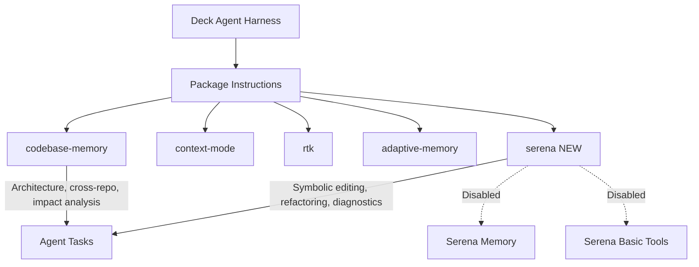

# Proposal: Add Serena MCP Package

## Intent

Deck's agent harness currently provides symbolic/code intelligence through `codebase-memory` (graph-based architecture analysis) and general tool access. However, agents lack **real-time, symbol-level editing, refactoring, and diagnostics** capabilities. Adding the **Serena** MCP package gives agents access to Language Server Protocol (LSP)-powered symbolic operations—enabling precise code edits, cross-file renames, and live diagnostics without relying on text/line-based heuristics.

Serena is complementary to `codebase-memory`: the latter excels at architecture understanding, cross-repo analysis, and offline impact analysis; Serena excels at real-time symbolic editing and refactoring.

## Goal

Integrate Serena as a first-class package instruction in Deck's harness, enabling symbolic retrieval, editing, refactoring, and diagnostics for all applicable agent roles, while ensuring clean coexistence with existing packages.

## Scope

### In Scope
- Create `packages/core/src/teams/developer/instruction-bundles/serena.ts` — instruction bundle for Serena capabilities
- Register Serena in `packages/core/src/teams/developer/instruction-bundles/index.ts`
- Add `serena` to `PACKAGE_INSTRUCTION_PACKAGE_IDS` in `packages/core/src/config/deck-config.ts`
- Add `"serena": true` to `.deck/config.json` for both runners (OpenCode and Claude Code)
- Update bundle parity tests to include Serena
- Define coexistence rules between Serena and `codebase-memory`
- Explicitly **disable** Serena's memory and basic tools (superseded by Supermemory and opencode's `ide` context)

### Out of Scope
- Installation or runtime deployment of the Serena server itself (assumed available via `serena start-mcp-server`)
- Changes to `codebase-memory` behavior or capabilities
- New agent logic or prompts beyond package instruction fragments
- Support for runners other than OpenCode (Claude Code runner can be enabled later)
- Performance benchmarking of Serena vs. codebase-memory

## Affected Capabilities

### New Capabilities
- `serena-symbolic-retrieval`: `find_symbol`, `find_referencing_symbols`, `find_implementations`, `get_symbols_overview`, `find_declaration`
- `serena-symbolic-editing`: `replace_symbol_body`, `insert_after_symbol`, `insert_before_symbol`, `safe_delete_symbol`
- `serena-refactoring`: `rename_symbol` (atomic cross-file rename)
- `serena-diagnostics`: `get_diagnostics_for_file` (real-time type checking)

### Modified Capabilities
- `package-instruction-registry`: Add Serena to canonical list of package instruction bundles
- `deck-config`: Extend `PACKAGE_INSTRUCTION_PACKAGE_IDS` array and validator defaults

### Unchanged Capabilities
- `codebase-memory`: Architecture, cross-repo, impact analysis, and offline/CI use cases remain unchanged. Coexistence rules will be documented to prevent overlap.
- `context-mode`: No changes; Serena operates independently of context-mode's indexing/tracing.
- `adaptive-memory`: No changes; Serena's internal memory is explicitly disabled in favor of Supermemory.
- `rtk`: No changes.

## Approach

1. **Instruction Bundle** (`serena.ts`): Build a `CapabilityInstructionFragment[]` for Serena. Fragments cover retrieval, editing, refactoring, and diagnostics. Each fragment carries `packageId: "serena"`, `surface: "agent"`, and concise markdown guidance.

2. **Registry Registration** (`index.ts`): Import the Serena builder and append it to the canonical `PACKAGE_INSTRUCTIONS` array with a stable order (after `adaptive-memory` or `rtk`).

3. **Config Integration** (`deck-config.ts`): Append `"serena"` to `PACKAGE_INSTRUCTION_PACKAGE_IDS` and ensure the config validator initializes `"serena": false` by default (opt-in per runner via `.deck/config.json`).

4. **Runner Config** (`.deck/config.json`): Add `"serena": true` under `packageInstructions` for both the OpenCode and Claude Code runners.

5. **Tests**: Update bundle parity tests to assert that the `serena` builder is present in `PACKAGE_INSTRUCTIONS` and produces expected fragments.

6. **Coexistence Rules**: Document in the instruction bundle markdown that:
   - Use `codebase-memory` for architecture queries, cross-repo calls, and impact analysis.
   - Use `serena` for symbol-level edits, renames, and real-time diagnostics.
   - Never use both for the same task; they serve different layers of abstraction.

## Alternatives and Tradeoffs

| Alternative | Why Considered | Why Not Chosen |
|---|---|---|
| **Use codebase-memory for everything** | Avoids adding a new dependency | codebase-memory is graph-based and offline-first; it cannot provide real-time LSP diagnostics or atomic cross-file renames. Serena fills a gap, not a duplicate. |
| **Use raw LSP directly** | More control over protocol | Adds significant complexity (protocol negotiation, server lifecycle, per-language setup). Serena wraps this into an MCP server with a clean tool interface. |
| **Defer to agent tool selection** | Let agents decide when to use Serena | Agents lack awareness of Serena unless it is explicitly exposed via package instructions. Integration is required for discoverability. |
| **Enable Serena's built-in memory** | Simpler integration (single package) | Serena's memory conflicts with Deck's Supermemory integration. Disabling it avoids duplication and preserves the existing memory architecture. |

## Risks

| Risk | Likelihood | Mitigation |
|---|---|---|
| **Serena server not installed** in user's environment | Medium | Document installation prerequisite; default `serena: false` in config so it is opt-in; fail gracefully with a clear error message if the server is unreachable. |
| **Overlap/confusion with codebase-memory** | Medium | Explicit coexistence rules in instruction markdown; agents are told which package to use for which task. No functional overlap in capabilities. |
| **Performance overhead from LSP** | Low | Serena is only active when agents invoke its tools; `--project-from-cwd` auto-detects the project without manual config. Monitor tool latency in verify phase. |
| **Runner incompatibility** (Claude Code) | Low | Start with OpenCode runner only in `.deck/config.json`; Claude Code can be enabled later after validation. The package instruction system is runner-agnostic. |
| **Symbol-level edits corrupting code** | Low | Serena's `safe_delete_symbol` and `rename_symbol` are designed to be atomic; still recommend that verify agent runs diagnostics after edits. |

## Rollback Plan

1. Revert `packages/core/src/teams/developer/instruction-bundles/serena.ts` deletion (or remove the file if newly created).
2. Remove Serena import and entry from `packages/core/src/teams/developer/instruction-bundles/index.ts`.
3. Remove `"serena"` from `PACKAGE_INSTRUCTION_PACKAGE_IDS` in `packages/core/src/config/deck-config.ts`.
4. Remove `"serena": true` from `.deck/config.json` in both runners.
5. Revert test updates.
6. Commit as a single revert commit.

Rollback is safe: no persistent data or state changes are introduced by this proposal.

## Dependencies

- **Serena CLI/server** must be installed in the user's environment (`pip install serena` or equivalent). This is a runtime dependency, not a build dependency.
- **Node.js/Bun runtime** must support the existing MCP client used by OpenCode (no new runtime requirements).

## Open Questions

- None — proposal is self-contained.

## Acceptance Direction

- [ ] `serena.ts` instruction bundle exists and exports a valid builder function.
- [ ] `index.ts` includes `serena` in `PACKAGE_INSTRUCTIONS` with correct import.
- [ ] `deck-config.ts` includes `"serena"` in `PACKAGE_INSTRUCTION_PACKAGE_IDS` and initializes default to `false`.
- [ ] `.deck/config.json` has `"serena": true` under `packageInstructions` for both runners.
- [ ] Bundle parity tests pass and cover the new `serena` entry.
- [ ] Coexistence rules are present in the `serena` instruction markdown.
- [ ] No regression in existing package instruction tests or config validation.

## Next Steps

Ready for Spec (`deck-developer-spec`) and Design (`deck-developer-design`) in parallel.

## Mermaid Summary Source

