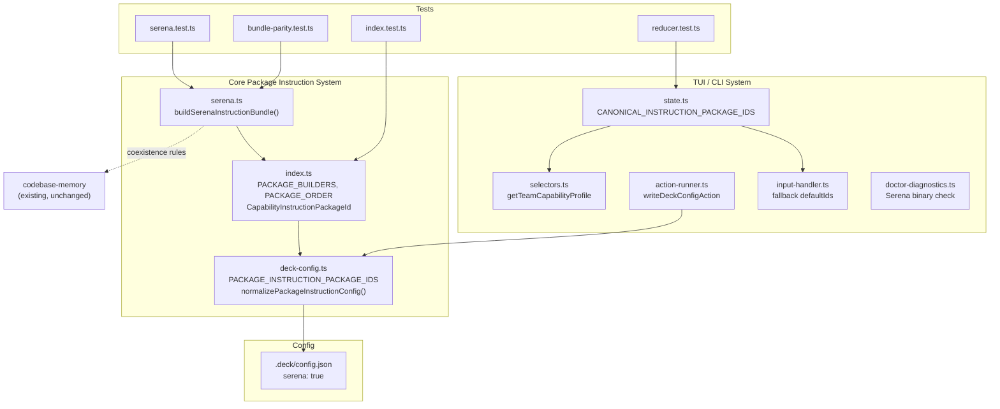

# Spec: Add Serena MCP Package

## Source

- Proposal: `add-serena-package` proposal artifact
- Capabilities affected: `serena-symbolic-retrieval`, `serena-symbolic-editing`, `serena-refactoring`, `serena-diagnostics`, `package-instruction-registry`, `deck-config`

## Requirements

### Capability: serena-instruction-bundle

REQ-SIB-001: The system MUST provide a `buildSerenaInstructionBundle` function that returns a `CapabilityInstructionBundle` containing at least two fragments: one with `surface: "agent"` and one with `surface: "skill"`.
  Priority: MUST
  Surface: Integration
  Rationale: All existing package bundles follow the agent+skill fragment pattern. Serena must conform for composability.

REQ-SIB-002: Every fragment produced by the Serena builder MUST have `packageId: "serena"`.
  Priority: MUST
  Surface: Integration
  Rationale: Package ID is the primary routing key for bundle composition and filtering.

REQ-SIB-003: The agent-surface fragment MUST document the following enabled Serena tools: `find_symbol`, `find_referencing_symbols`, `find_implementations`, `find_declaration`, `get_symbols_overview`, `get_diagnostics_for_file`, `replace_symbol_body`, `insert_after_symbol`, `insert_before_symbol`, `safe_delete_symbol`, `rename_symbol`, `activate_project`, `get_current_config`, `initial_instructions`, `onboarding`.
  Priority: MUST
  Surface: Integration
  Rationale: These are the LSP-powered tools that agents need awareness of for symbolic operations.

REQ-SIB-004: The agent-surface fragment MUST document the following disabled Serena tools with rationale: `search_for_pattern`, `replace_content`, `read_file`, `list_dir`, `find_file`, `create_text_file`, `execute_shell_command`, `write_memory`, `read_memory`, `list_memories`, `edit_memory`, `delete_memory`, `rename_memory`.
  Priority: MUST
  Surface: Integration
  Rationale: Explicitly disabling superseded tools prevents agents from invoking redundant or conflicting capabilities.

REQ-SIB-005: The agent-surface fragment MUST include coexistence rules distinguishing Serena from codebase-memory: Serena for real-time symbol editing, refactoring, and LSP diagnostics; codebase-memory for architecture queries, cross-repo analysis, impact analysis, and offline/CI graph queries.
  Priority: MUST
  Surface: Integration
  Rationale: Without explicit coexistence rules, agents may choose the wrong tool for a task, reducing effectiveness.

REQ-SIB-006: The skill-surface fragment MUST provide a condensed version of the agent instructions suitable for skill-level injection.
  Priority: MUST
  Surface: Integration
  Rationale: Mirrors the existing pattern where skill fragments are more concise than agent fragments.

REQ-SIB-007: Each fragment's `markdown` field MUST be a non-empty string longer than 50 characters.
  Priority: MUST
  Surface: Data
  Rationale: Ensures substantive instruction content is present, not placeholder text.

REQ-SIB-008: The builder function MUST return `Object.freeze(fragments)` to prevent mutation.
  Priority: MUST
  Surface: Data
  Rationale: All existing builders freeze their instruction arrays for immutability.

### Capability: package-instruction-registry

REQ-PIR-001: The `CapabilityInstructionPackageId` type in `index.ts` MUST include `"serena"` as a union member.
  Priority: MUST
  Surface: API
  Rationale: Type-level registration is required for compile-time safety and IDE autocompletion.

REQ-PIR-002: The `PACKAGE_BUILDERS` record in `index.ts` MUST map `"serena"` to the `buildSerenaInstructionBundle` function.
  Priority: MUST
  Surface: Integration
  Rationale: The builders record is the runtime dispatch mechanism for bundle construction.

REQ-PIR-003: The `PACKAGE_ORDER` array in `index.ts` MUST include `"serena"` after `"adaptive-memory"` in canonical order.
  Priority: MUST
  Surface: Integration
  Rationale: Deterministic ordering ensures reproducible bundle composition across sessions.

REQ-PIR-004: The `buildCapabilityInstructionBundle` function MUST correctly produce Serena fragments when `"serena"` is included in the input package IDs.
  Priority: MUST
  Surface: Integration
  Rationale: Core composition must work for all registered packages without special-casing.

REQ-PIR-005: The `getEnabledPackageInstructionIds` function MUST correctly include `"serena"` when it is enabled in the runner config.
  Priority: MUST
  Surface: Integration
  Rationale: Config-to-bundle resolution must handle the new package transparently.

### Capability: deck-config

REQ-DC-001: The `PACKAGE_INSTRUCTION_PACKAGE_IDS` constant MUST include `"serena"` in its array.
  Priority: MUST
  Surface: API
  Rationale: This constant defines the universe of valid package IDs for config validation.

REQ-DC-002: The `PACKAGE_INSTRUCTION_PACKAGE_FIELDS` set MUST include `"serena"` (derived automatically from the constant).
  Priority: MUST
  Surface: Integration
  Rationale: Config validation uses this set to accept or reject package keys.

REQ-DC-003: The `normalizePackageInstructionConfig` function MUST initialize `"serena": false` by default for all runners when no explicit value is provided.
  Priority: MUST
  Surface: Integration
  Rationale: Serena must be opt-in to avoid requiring the server in environments where it is not installed.

REQ-DC-004: The `getDefaultDeckConfig` function MUST include `"serena": false` in the default package instructions for both `pi` and `opencode` runners.
  Priority: MUST
  Surface: Integration
  Rationale: Default config must enumerate all known packages for consistent normalization.

REQ-DC-005: Config validation MUST accept `"serena": true` or `"serena": false` as valid boolean values under any runner's `packageInstructions`.
  Priority: MUST
  Surface: Integration
  Rationale: Config parsing must handle the new key without error.

REQ-DC-006: Config validation MUST reject non-boolean values for `"serena"` with a `DECK_CONFIG_INVALID_SHAPE` error.
  Priority: MUST
  Surface: Integration
  Rationale: Type safety enforcement consistent with existing package keys.

### Capability: tui-integration

REQ-TUI-001: The `CANONICAL_INSTRUCTION_PACKAGE_IDS` constant in `state.ts` MUST include `"serena"`.
  Priority: MUST
  Surface: UI
  Rationale: The TUI packages-detail screen uses this constant to enumerate toggleable packages.

REQ-TUI-002: The `DEFAULT_RUNNER_DASHBOARD_STATE.selectedCapabilities` MUST include `"serena": true`.
  Priority: SHOULD
  Surface: UI
  Rationale: Serena should be selected by default in the TUI for new installations, since it is a core capability.

REQ-TUI-003: The fallback `defaultIds` array in `input-handler.ts` MUST include `"serena"`.
  Priority: MUST
  Surface: UI
  Rationale: Ensures backward-compatible toggle actions in tests and environments without a resolver.

REQ-TUI-004: The `getTeamCapabilityProfile` selector in `selectors.ts` MUST include a `"serena"` consumption signal derived from `state.selectedCapabilities["serena"]`.
  Priority: MUST
  Surface: Integration
  Rationale: Team capability profiles must reflect all canonical packages.

REQ-TUI-005: The `writeDeckConfigAction` in `action-runner.ts` MUST include `"serena"` in the `updatedPackageInstructions` object for both `pi` and `opencode` runners.
  Priority: MUST
  Surface: Integration
  Rationale: Config writes must persist the Serena toggle alongside other packages.

REQ-TUI-006: The reducer MUST handle `"serena"` in `toggle-capability` and `set-capability` actions without error.
  Priority: MUST
  Surface: Integration
  Rationale: Generic toggle handling should work for any capability ID; verify no hardcoded exclusion.

### Capability: doctor-diagnostics

REQ-DOC-001: The `runDoctorDiagnostics` function SHOULD include a Serena MCP server check that verifies the `serena` binary is available in PATH.
  Priority: SHOULD
  Surface: Integration
  Rationale: Doctor diagnostics help users verify their environment before running into runtime failures.

REQ-DOC-002: If the Serena binary is not found, the diagnostic SHOULD report a `warning` status with a suggestion to install Serena.
  Priority: SHOULD
  Surface: Integration
  Rationale: Missing Serena is not critical (it is opt-in), but users should be informed.

REQ-DOC-003: The Serena diagnostic check MUST NOT throw or abort other diagnostic checks if it fails.
  Priority: MUST
  Surface: Integration
  Rationale: All doctor checks must be isolated (REQ-DIAG-007 in existing spec).

### Capability: runner-config

REQ-RC-001: `.deck/config.json` MUST include `"serena": true` under `packageInstructions` for both `pi` and `opencode` runners.
  Priority: MUST
  Surface: Config
  Rationale: Both runners in this project should have Serena enabled.

### Capability: test-parity

REQ-TP-001: The `bundle-parity.test.ts` file MUST include a `describe("serena", ...)` block with baseline hash tests for agent and skill fragments.
  Priority: MUST
  Surface: Integration
  Rationale: Parity tests ensure instruction content does not drift unintentionally.

REQ-TP-002: The `index.test.ts` file MUST include Serena in the `makeConfig` fixture for both `pi` and `opencode` runners.
  Priority: MUST
  Surface: Integration
  Rationale: Config fixtures must include all package keys for test correctness.

REQ-TP-003: A new `serena.test.ts` file MUST exist and test the `buildSerenaInstructionBundle` function.
  Priority: MUST
  Surface: Integration
  Rationale: Dedicated unit tests for the new builder, consistent with other packages.

REQ-TP-004: The `reducer.test.ts` file SHOULD include test cases for toggling `"serena"` as a capability.
  Priority: SHOULD
  Surface: Integration
  Rationale: Ensures TUI toggle handling works for the new capability ID.

REQ-TP-005: The `input-handler.test.ts` and `action-runner.test.ts` test files SHOULD be updated to include `"serena"` in fixture data.
  Priority: SHOULD
  Surface: Integration
  Rationale: Test fixtures must reflect the full set of canonical packages.

### Capability: coexistence-rules

REQ-CR-001: Instruction fragments MUST instruct agents to use `codebase-memory` for architecture queries, cross-repo analysis, impact analysis, and offline/CI graph queries.
  Priority: MUST
  Surface: Integration
  Rationale: Clear domain boundaries prevent tool confusion.

REQ-CR-002: Instruction fragments MUST instruct agents to use `serena` for symbol-level editing, cross-file refactoring, and real-time LSP diagnostics.
  Priority: MUST
  Surface: Integration
  Rationale: Clear domain boundaries prevent tool confusion.

REQ-CR-003: Instruction fragments MUST instruct agents NOT to use both Serena and codebase-memory for the same task.
  Priority: MUST
  Surface: Integration
  Rationale: They serve different abstraction layers; overlapping usage is a misuse.

## Acceptance Scenarios

### Capability: serena-instruction-bundle

#### Scenario: Serena builder produces agent and skill fragments
**Given** the `buildSerenaInstructionBundle` function is called
**When** the returned bundle is inspected
**Then** it contains at least 2 fragments, at least one with `surface: "agent"` and at least one with `surface: "skill"`, all with `packageId: "serena"`
> Covers: REQ-SIB-001, REQ-SIB-002

#### Scenario: Agent fragment documents enabled tools
**Given** the agent-surface fragment from the Serena bundle
**When** the markdown content is inspected
**Then** it mentions each of: `find_symbol`, `find_referencing_symbols`, `find_implementations`, `find_declaration`, `get_symbols_overview`, `get_diagnostics_for_file`, `replace_symbol_body`, `insert_after_symbol`, `insert_before_symbol`, `safe_delete_symbol`, `rename_symbol`, `activate_project`, `get_current_config`, `initial_instructions`, `onboarding`
> Covers: REQ-SIB-003

#### Scenario: Agent fragment documents disabled tools
**Given** the agent-surface fragment from the Serena bundle
**When** the markdown content is inspected
**Then** it mentions each disabled tool (`search_for_pattern`, `replace_content`, `read_file`, `list_dir`, `find_file`, `create_text_file`, `execute_shell_command`, `write_memory`, `read_memory`, `list_memories`, `edit_memory`, `delete_memory`, `rename_memory`) with an explanation of why each is disabled
> Covers: REQ-SIB-004

#### Scenario: Agent fragment contains coexistence rules
**Given** the agent-surface fragment from the Serena bundle
**When** the markdown content is inspected
**Then** it contains guidance distinguishing Serena from codebase-memory usage domains
> Covers: REQ-SIB-005, REQ-CR-001, REQ-CR-002, REQ-CR-003

#### Scenario: Skill fragment is non-empty and condensed
**Given** the skill-surface fragment from the Serena bundle
**When** the markdown content is inspected
**Then** it is a non-empty string and is shorter than the agent-surface fragment
> Covers: REQ-SIB-006, REQ-SIB-007

#### Scenario: Bundle is frozen
**Given** the bundle returned by `buildSerenaInstructionBundle`
**When** `Object.isFrozen(bundle.instructions)` is checked
**Then** it returns `true`
> Covers: REQ-SIB-008

### Capability: package-instruction-registry

#### Scenario: Serena type is in CapabilityInstructionPackageId
**Given** the `CapabilityInstructionPackageId` type
**When** TypeScript compilation is attempted with `"serena"` as a value
**Then** compilation succeeds without type errors
> Covers: REQ-PIR-001

#### Scenario: Serena is in PACKAGE_BUILDERS
**Given** the `PACKAGE_BUILDERS` record
**When** `PACKAGE_BUILDERS["serena"]` is accessed
**Then** it is a function that returns a valid `CapabilityInstructionBundle`
> Covers: REQ-PIR-002

#### Scenario: Serena is in PACKAGE_ORDER after adaptive-memory
**Given** the `PACKAGE_ORDER` array
**When** the position of `"serena"` is compared to `"adaptive-memory"`
**Then** `"serena"` appears after `"adaptive-memory"` in the array
> Covers: REQ-PIR-003

#### Scenario: Bundle composition includes Serena
**Given** a config with `"serena": true` for a runner
**When** `buildCapabilityInstructionBundle(["codebase-memory", "serena"])` is called
**Then** the resulting bundle contains fragments from both `codebase-memory` and `serena` in canonical order
> Covers: REQ-PIR-004

#### Scenario: Enabled packages include Serena
**Given** a normalized config with `"serena": true` under `opencode`
**When** `getEnabledPackageInstructionIds(config, "opencode")` is called
**Then** the returned array includes `"serena"`
> Covers: REQ-PIR-005

### Capability: deck-config

#### Scenario: PACKAGE_INSTRUCTION_PACKAGE_IDS includes serena
**Given** the `PACKAGE_INSTRUCTION_PACKAGE_IDS` constant
**When** the array is inspected
**Then** `"serena"` is present
> Covers: REQ-DC-001

#### Scenario: Default config initializes serena as false
**Given** `getDefaultDeckConfig()` is called
**When** `result.packageInstructions.pi["serena"]` and `result.packageInstructions.opencode["serena"]` are inspected
**Then** both values are `false`
> Covers: REQ-DC-003, REQ-DC-004

#### Scenario: Config accepts serena boolean
**Given** a config object with `packageInstructions: { opencode: { serena: true } }`
**When** `validateDeckConfig(config)` is called
**Then** validation succeeds and `result.packageInstructions.opencode["serena"]` is `true`
> Covers: REQ-DC-005

#### Scenario: Config rejects non-boolean serena
**Given** a config object with `packageInstructions: { opencode: { serena: "yes" } }`
**When** `validateDeckConfig(config)` is called
**Then** a `DeckConfigError` is thrown with code `DECK_CONFIG_INVALID_SHAPE` and fieldPath containing `"serena"`
> Covers: REQ-DC-006

#### Scenario: Config with unknown package key is rejected
**Given** a config object with `packageInstructions: { opencode: { "unknown-pkg": true } }`
**When** `validateDeckConfig(config)` is called
**Then** a `DeckConfigError` is thrown with code `DECK_CONFIG_UNKNOWN_FIELD`
> Covers: REQ-DC-002

### Capability: tui-integration

#### Scenario: CANONICAL_INSTRUCTION_PACKAGE_IDS includes serena
**Given** the `CANONICAL_INSTRUCTION_PACKAGE_IDS` constant
**When** the array is inspected
**Then** `"serena"` is present
> Covers: REQ-TUI-001

#### Scenario: Default state includes serena selected
**Given** `DEFAULT_RUNNER_DASHBOARD_STATE`
**When** `selectedCapabilities` is inspected
**Then** `"serena"` is present with value `true`
> Covers: REQ-TUI-002

#### Scenario: Toggle serena in packages-detail
**Given** a dashboard state with `screen: "packages-detail"` and cursor at the serena position
**When** a toggle-capability action is dispatched with `capabilityId: "serena"`
**Then** `state.selectedCapabilities["serena"]` is toggled
> Covers: REQ-TUI-006

#### Scenario: Team capability profile includes serena
**Given** a dashboard state with `selectedCapabilities: { serena: true }`
**When** `getTeamCapabilityProfile(state, "developer-team")` is called
**Then** the result includes `"serena"` with a consumption value other than `"not-used"`
> Covers: REQ-TUI-004

#### Scenario: Config write persists serena toggle
**Given** a dashboard state with `packageInstructions: { serena: true }` for the `opencode` runner
**When** `writeDeckConfigAction` executes
**Then** the written config includes `"serena": true` under `opencode` package instructions
> Covers: REQ-TUI-005

### Capability: doctor-diagnostics

#### Scenario: Serena binary check passes when available
**Given** the `serena` binary is available in PATH
**When** `runDoctorDiagnostics()` is called
**Then** the result includes a Serena diagnostic item with status `"ok"`
> Covers: REQ-DOC-001

#### Scenario: Serena binary check warns when unavailable
**Given** the `serena` binary is NOT available in PATH
**When** `runDoctorDiagnostics()` is called
**Then** the result includes a Serena diagnostic item with status `"warning"` and a suggestion to install Serena
> Covers: REQ-DOC-002

#### Scenario: Serena check failure does not abort other checks
**Given** the Serena binary check throws an error
**When** `runDoctorDiagnostics()` is called
**Then** all other diagnostic checks still run and return results
> Covers: REQ-DOC-003

### Capability: runner-config

#### Scenario: Both runners have serena enabled
**Given** the `.deck/config.json` file
**When** the `packageInstructions` section is read
**Then** both `pi` and `opencode` entries include `"serena": true`
> Covers: REQ-RC-001

### Capability: test-parity

#### Scenario: Bundle parity test covers serena
**Given** the `bundle-parity.test.ts` file
**When** tests are executed
**Then** a `describe("serena", ...)` block exists and tests agent and skill fragment hashes against baselines
> Covers: REQ-TP-001

#### Scenario: Index test fixture includes serena
**Given** the `index.test.ts` file
**When** the `makeConfig` fixture is inspected
**Then** it includes `"serena": false` (or appropriate default) for both runners
> Covers: REQ-TP-002

#### Scenario: Serena unit tests exist
**Given** the `serena.test.ts` file
**When** tests are executed
**Then** `buildSerenaInstructionBundle` is tested for fragment count, packageId, surfaces, and markdown content
> Covers: REQ-TP-003

#### Scenario: Reducer test covers serena toggle
**Given** the `reducer.test.ts` file
**When** tests are executed
**Then** a test case exists for toggling the `"serena"` capability
> Covers: REQ-TP-004

## Validation Rules

| Field / Input | Rule | Error Message | REQ-ID |
|---|---|---|---|
| `packageInstructions.{runner}.serena` | Must be `boolean` | `packageInstructions.{runner}.serena must be a boolean.` | REQ-DC-006 |
| `PACKAGE_ORDER` position of `"serena"` | Must be after `"adaptive-memory"` | (compile-time) | REQ-PIR-003 |
| Fragment `packageId` | Must be `"serena"` | (structural — tested via assertions) | REQ-SIB-002 |

## Error Contracts

| Condition | Error Code | Message | Status |
|---|---|---|---|
| Non-boolean `serena` value in config | `DECK_CONFIG_INVALID_SHAPE` | `packageInstructions.{runner}.serena must be a boolean.` | Config validation failure |
| Unknown package key in config | `DECK_CONFIG_UNKNOWN_FIELD` | `Unknown Deck config field: packageInstructions.{runner}.{key}` | Config validation failure |

## Open Questions

- None — spec is self-contained.

## Compliance Matrix

| REQ-ID | Scenario(s) | Status |
|---|---|---|
| REQ-SIB-001 | Serena builder produces agent and skill fragments | Defined |
| REQ-SIB-002 | Serena builder produces agent and skill fragments | Defined |
| REQ-SIB-003 | Agent fragment documents enabled tools | Defined |
| REQ-SIB-004 | Agent fragment documents disabled tools | Defined |
| REQ-SIB-005 | Agent fragment contains coexistence rules | Defined |
| REQ-SIB-006 | Skill fragment is non-empty and condensed | Defined |
| REQ-SIB-007 | Skill fragment is non-empty and condensed | Defined |
| REQ-SIB-008 | Bundle is frozen | Defined |
| REQ-PIR-001 | Serena type is in CapabilityInstructionPackageId | Defined |
| REQ-PIR-002 | Serena is in PACKAGE_BUILDERS | Defined |
| REQ-PIR-003 | Serena is in PACKAGE_ORDER after adaptive-memory | Defined |
| REQ-PIR-004 | Bundle composition includes Serena | Defined |
| REQ-PIR-005 | Enabled packages include Serena | Defined |
| REQ-DC-001 | PACKAGE_INSTRUCTION_PACKAGE_IDS includes serena | Defined |
| REQ-DC-002 | Config with unknown package key is rejected | Defined |
| REQ-DC-003 | Default config initializes serena as false | Defined |
| REQ-DC-004 | Default config initializes serena as false | Defined |
| REQ-DC-005 | Config accepts serena boolean | Defined |
| REQ-DC-006 | Config rejects non-boolean serena | Defined |
| REQ-TUI-001 | CANONICAL_INSTRUCTION_PACKAGE_IDS includes serena | Defined |
| REQ-TUI-002 | Default state includes serena selected | Defined |
| REQ-TUI-003 | (implicit via REQ-TUI-001) | Defined |
| REQ-TUI-004 | Team capability profile includes serena | Defined |
| REQ-TUI-005 | Config write persists serena toggle | Defined |
| REQ-TUI-006 | Toggle serena in packages-detail | Defined |
| REQ-DOC-001 | Serena binary check passes when available | Defined |
| REQ-DOC-002 | Serena binary check warns when unavailable | Defined |
| REQ-DOC-003 | Serena check failure does not abort other checks | Defined |
| REQ-RC-001 | Both runners have serena enabled | Defined |
| REQ-TP-001 | Bundle parity test covers serena | Defined |
| REQ-TP-002 | Index test fixture includes serena | Defined |
| REQ-TP-003 | Serena unit tests exist | Defined |
| REQ-TP-004 | Reducer test covers serena toggle | Defined |
| REQ-TP-005 | (implicit via fixture updates) | Defined |
| REQ-CR-001 | Agent fragment contains coexistence rules | Defined |
| REQ-CR-002 | Agent fragment contains coexistence rules | Defined |
| REQ-CR-003 | Agent fragment contains coexistence rules | Defined |

## Mermaid Summary Source

