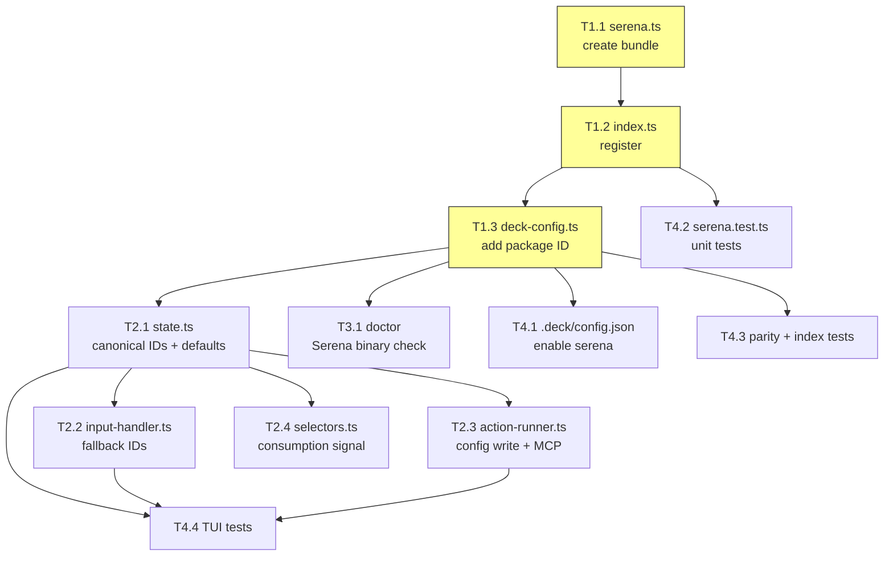

# Tasks: Add Serena MCP Package

## Source

- Spec: `add-serena-package` spec artifact
- Design: `add-serena-package` design artifact
- Capabilities affected: `serena-symbolic-retrieval`, `serena-symbolic-editing`, `serena-refactoring`, `serena-diagnostics`, `package-instruction-registry`, `deck-config`, `tui-integration`, `doctor-diagnostics`, `runner-config`, `test-parity`, `coexistence-rules`

## Task Groups

### Group G1: Core Package Instruction Bundle

> Must complete first — G2/G3/G4 depend on the core type, builder, and config changes.

#### Task T1.1: Create Serena instruction bundle

**Owner**: General Apply
**Priority**: P0
**Complexity**: Medium
**Parallel**: No — no prior tasks, but G2/G3/G4 depend on this
**Depends on**: none

**Description**
Create `packages/core/src/teams/developer/instruction-bundles/serena.ts` with a `buildSerenaInstructionBundle()` function. Follow the exact pattern from `codebase-memory.ts`: import types, define fragments array with two entries (surface `agent` and surface `skill`), return `{ instructions: Object.freeze(fragments) }`.

Agent fragment must document:
- Enabled tools: `find_symbol`, `find_referencing_symbols`, `find_implementations`, `find_declaration`, `get_symbols_overview`, `get_diagnostics_for_file`, `replace_symbol_body`, `insert_after_symbol`, `insert_before_symbol`, `safe_delete_symbol`, `rename_symbol`, `activate_project`, `get_current_config`, `initial_instructions`, `onboarding`
- Disabled tools with rationale: `search_for_pattern`, `replace_content`, `read_file`, `list_dir`, `find_file`, `create_text_file`, `execute_shell_command` (opencode provides these), `write_memory`, `read_memory`, `list_memories`, `edit_memory`, `delete_memory`, `rename_memory` (Supermemory handles memory)
- Coexistence rules: Serena for real-time symbol editing/refactoring/diagnostics; codebase-memory for architecture/cross-repo/impact analysis; never use both for same task

Skill fragment: condensed version of agent instructions (shorter markdown).

**Files**
- `packages/core/src/teams/developer/instruction-bundles/serena.ts` — create

**Verification**
- `buildSerenaInstructionBundle()` returns `{ instructions: Object.freeze(fragments) }` with 2 fragments
- All fragments have `packageId: "serena"`
- Agent markdown mentions all 15 enabled tools and 13 disabled tools
- Agent markdown contains coexistence rules distinguishing Serena from codebase-memory
- Skill markdown is non-empty and shorter than agent markdown
- `Object.isFrozen(bundle.instructions)` returns `true`
- TypeScript compiles without errors

#### Task T1.2: Register Serena in instruction bundle index

**Owner**: General Apply
**Priority**: P0
**Complexity**: Low
**Parallel**: No — depends on T1.1
**Depends on**: T1.1

**Description**
Modify `packages/core/src/teams/developer/instruction-bundles/index.ts`:
1. Import `buildSerenaInstructionBundle` from `./serena`
2. Add `"serena"` to the `CapabilityInstructionPackageId` union type
3. Add `serena: buildSerenaInstructionBundle` to `PACKAGE_BUILDERS`
4. Add `"serena"` to `PACKAGE_ORDER` after `"adaptive-memory"` (last position)

**Files**
- `packages/core/src/teams/developer/instruction-bundles/index.ts` — modify

**Verification**
- `CapabilityInstructionPackageId` includes `"serena"` as a union member
- `PACKAGE_BUILDERS["serena"]` is a function
- `PACKAGE_ORDER` includes `"serena"` after `"adaptive-memory"`
- `buildCapabilityInstructionBundle(["serena"])` produces valid Serena fragments
- `getEnabledPackageInstructionIds(config, runner)` returns `"serena"` when config has `serena: true`
- TypeScript compiles without errors

#### Task T1.3: Add Serena to deck config

**Owner**: General Apply
**Priority**: P0
**Complexity**: Low
**Parallel**: No — depends on T1.2
**Depends on**: T1.2

**Description**
Modify `packages/core/src/config/deck-config.ts`:
1. Add `"serena"` to `PACKAGE_INSTRUCTION_PACKAGE_IDS` array (last position)
2. Add `serena: false` to both `pi` and `opencode` defaults in `getDefaultDeckConfig()`
3. Add `serena: false` to both runner defaults in `normalizePackageInstructionConfig()` (lines 567-569 and 598-603)

The `PACKAGE_INSTRUCTION_PACKAGE_FIELDS` set is derived automatically from the constant, so it will pick up `"serena"` without extra code.

**Files**
- `packages/core/src/config/deck-config.ts` — modify

**Verification**
- `PACKAGE_INSTRUCTION_PACKAGE_IDS` includes `"serena"`
- `getDefaultDeckConfig().packageInstructions.pi.serena` is `false`
- `getDefaultDeckConfig().packageInstructions.opencode.serena` is `false`
- Config with `serena: true` validates successfully
- Config with `serena: "yes"` throws `DECK_CONFIG_INVALID_SHAPE`
- Config with unknown package key throws `DECK_CONFIG_UNKNOWN_FIELD`
- TypeScript compiles without errors

### Group G2: TUI Dashboard Integration

> Depends on G1 for the canonical `"serena"` package ID.

#### Task T2.1: Update TUI state constants and defaults

**Owner**: General Apply
**Priority**: P1
**Complexity**: Low
**Parallel**: No — depends on T1.3
**Depends on**: T1.3

**Description**
Modify `apps/cli/src/tui/runner-dashboard/state.ts`:
1. Add `"serena"` to `CANONICAL_INSTRUCTION_PACKAGE_IDS` array (last position)
2. Add `serena: true` to `selectedCapabilities` in `DEFAULT_RUNNER_DASHBOARD_STATE`

**Files**
- `apps/cli/src/tui/runner-dashboard/state.ts` — modify

**Verification**
- `CANONICAL_INSTRUCTION_PACKAGE_IDS` includes `"serena"`
- `DEFAULT_RUNNER_DASHBOARD_STATE.selectedCapabilities.serena` is `true`

#### Task T2.2: Update input-handler fallback IDs

**Owner**: General Apply
**Priority**: P1
**Complexity**: Low
**Parallel**: Yes
**Depends on**: T2.1

**Description**
Modify `apps/cli/src/tui/runner-dashboard/input-handler.ts`:
1. Add `"serena"` to the `defaultIds` array in `getDashboardToggleAction` fallback (line 30)
2. Add `"serena"` to the fallback resolver `getUserFacingIds` in `getDashboardContinueEffect` (line 63)

**Files**
- `apps/cli/src/tui/runner-dashboard/input-handler.ts` — modify

**Verification**
- Fallback `defaultIds` includes `"serena"`
- Fallback `getUserFacingIds` includes `"serena"`
- Existing toggle tests pass

#### Task T2.3: Update action-runner config write mapping

**Owner**: General Apply
**Priority**: P1
**Complexity**: Low
**Parallel**: Yes
**Depends on**: T2.1

**Description**
Modify `apps/cli/src/tui/runner-dashboard/action-runner.ts`:
1. Add `serena: piInstructions.serena ?? false` to the `pi` object in `updatedPackageInstructions` (line 390)
2. Add `serena: opencodeInstructions.serena ?? false` to the `opencode` object (line 396)
3. Add a `capabilityId === "serena"` branch in `writeMcpConfigAction` that writes a local MCP server config with command `["serena", "start-mcp-server", "--context", "ide", "--project-from-cwd"]`, server name `"serena"`, type `"local"`.

**Files**
- `apps/cli/src/tui/runner-dashboard/action-runner.ts` — modify

**Verification**
- `writeDeckConfigAction` includes `serena` in both runner configs
- Config write preserves `serena` boolean
- Serena MCP write branch produces correct local command

#### Task T2.4: Update selectors consumption signal

**Owner**: General Apply
**Priority**: P1
**Complexity**: Low
**Parallel**: Yes
**Depends on**: T2.1

**Description**
Modify `apps/cli/src/tui/runner-dashboard/selectors.ts`:
1. Add `"serena": state.selectedCapabilities["serena"] ? "consumes-directly" : "not-used"` to the `capabilities` object in `getTeamCapabilityProfile` (line 252)

**Files**
- `apps/cli/src/tui/runner-dashboard/selectors.ts` — modify

**Verification**
- `getTeamCapabilityProfile` returns `"consumes-directly"` for `"serena"` when selected
- `getTeamCapabilityProfile` returns `"not-used"` for `"serena"` when not selected

### Group G3: Doctor Diagnostics

> Independent of G2 but depends on G1 for package ID awareness.

#### Task T3.1: Add Serena MCP check to doctor diagnostics

**Owner**: General Apply
**Priority**: P2
**Complexity**: Low
**Parallel**: Yes
**Depends on**: T1.3

**Description**
Modify `apps/cli/src/doctor-command/doctor-diagnostics.ts`:
1. Add `{ id: "serena", label: "Serena", command: "serena" }` to `MEMORY_PROVIDERS` array (or create a separate `SERENA_PROVIDER` entry — Serena is not a memory provider but uses the same binary-check pattern)
2. Add `{ name: "serena", label: "Serena MCP" }` to `KNOWN_OPENCODE_MCP_SERVERS` array
3. In `checkOpenCodeMcp`, the Serena entry should be validated as a local MCP server (checking for `command` field instead of `url`/`type`). Adjust the validation logic to handle both remote (url/type) and local (command array) MCP entries.

Alternative: add a dedicated `checkSerenaBinary()` function that checks `serena` in PATH and reports warning if missing, following the same isolated try/catch pattern as `checkMemoryProviders`.

**Files**
- `apps/cli/src/doctor-command/doctor-diagnostics.ts` — modify

**Verification**
- `runDoctorDiagnostics()` includes a Serena diagnostic item
- Serena binary found → status `"ok"`
- Serena binary not found → status `"warning"` with install suggestion
- Serena check failure does not abort other checks
- OpenCode MCP section includes Serena validation

### Group G4: Config and Tests

> Depends on G1 for core types/builders. T4.2-T4.4 can run in parallel.

#### Task T4.1: Update .deck/config.json

**Owner**: General Apply
**Priority**: P1
**Complexity**: Low
**Parallel**: Yes
**Depends on**: T1.3

**Description**
Modify `.deck/config.json` to add `"serena": true` under `packageInstructions` for both `pi` and `opencode` runners.

**Files**
- `.deck/config.json` — modify

**Verification**
- `packageInstructions.pi.serena` is `true`
- `packageInstructions.opencode.serena` is `true`
- `readDeckConfig(".")` parses without error

#### Task T4.2: Create serena.test.ts

**Owner**: General Apply
**Priority**: P1
**Complexity**: Medium
**Parallel**: Yes
**Depends on**: T1.2

**Description**
Create `packages/core/src/teams/developer/instruction-bundles/serena.test.ts` with tests covering:
1. Builder returns bundle with 2 fragments
2. All fragments have `packageId: "serena"`
3. Surfaces are `"agent"` and `"skill"`
4. Agent markdown mentions all 15 enabled tools
5. Agent markdown mentions all 13 disabled tools
6. Agent markdown contains coexistence rules
7. Skill markdown is non-empty and shorter than agent
8. Bundle is frozen (`Object.isFrozen`)
9. Each fragment markdown is > 50 characters

Follow the test pattern from existing bundle tests (e.g., `codebase-memory.test.ts` or similar).

**Files**
- `packages/core/src/teams/developer/instruction-bundles/serena.test.ts` — create

**Verification**
- All test cases pass
- `vitest` / test runner reports green

#### Task T4.3: Update bundle parity and index tests

**Owner**: General Apply
**Priority**: P1
**Complexity**: Low
**Parallel**: Yes
**Depends on**: T1.3

**Description**
Update existing test files to include Serena:
1. `bundle-parity.test.ts` — add `describe("serena", ...)` block with baseline hash tests for agent and skill fragments
2. `index.test.ts` — add `"serena": false` to `makeConfig` fixture for both `pi` and `opencode` runners; add tests verifying Serena appears in `PACKAGE_ORDER` after `"adaptive-memory"` and `PACKAGE_BUILDERS["serena"]` is a function

**Files**
- `packages/core/src/teams/developer/instruction-bundles/bundle-parity.test.ts` — modify
- `packages/core/src/teams/developer/instruction-bundles/index.test.ts` — modify

**Verification**
- Bundle parity tests include Serena block
- Index test fixtures include `"serena"` for both runners
- All existing tests pass without regression

#### Task T4.4: Update TUI tests

**Owner**: General Apply
**Priority**: P2
**Complexity**: Medium
**Parallel**: Yes
**Depends on**: T2.1, T2.2, T2.3

**Description**
Update TUI test files to include Serena:
1. `reducer.test.ts` — add test case for toggling `"serena"` capability via `toggle-capability` and `set-capability` actions
2. `input-handler.test.ts` — update fixture data to include `"serena"` in default IDs
3. `action-runner.test.ts` — update fixtures to include `serena` in package instruction configs; add test for Serena MCP config write
4. `selectors.test.ts` — update `getTeamCapabilityProfile` tests to include `"serena"` consumption signal

**Files**
- `apps/cli/src/tui/runner-dashboard/reducer.test.ts` — modify
- `apps/cli/src/tui/runner-dashboard/input-handler.test.ts` — modify
- `apps/cli/src/tui/runner-dashboard/action-runner.test.ts` — modify
- `apps/cli/src/tui/runner-dashboard/selectors.test.ts` — modify (if exists)

**Verification**
- Reducer test covers `"serena"` toggle
- Input-handler fixtures include `"serena"`
- Action-runner fixtures include `serena` config
- All TUI tests pass

## Dependency Graph

```
T1.1 (serena.ts)
  → T1.2 (index.ts registration)
    → T1.3 (deck-config.ts)
      → T2.1 (state.ts)
        → T2.2 (input-handler.ts)
        → T2.3 (action-runner.ts)
        → T2.4 (selectors.ts)
      → T3.1 (doctor-diagnostics.ts)
      → T4.1 (.deck/config.json)
T1.2 → T4.2 (serena.test.ts)
T1.3 → T4.3 (parity + index tests)
T2.1 + T2.2 + T2.3 → T4.4 (TUI tests)
```

## Parallelization Plan

| Phase | Tasks | Can Run in Parallel |
|---|---|---|
| G1 (Core) | T1.1 → T1.2 → T1.3 | No — sequential chain |
| G2 (TUI) | T2.1 → T2.2, T2.3, T2.4 | T2.2/T2.3/T2.4 after T2.1 |
| G3 (Doctor) | T3.1 | Yes — independent after T1.3 |
| G4 (Tests) | T4.1, T4.2, T4.3 | Yes — parallel after respective deps |
| G4 (Tests) | T4.4 | No — needs T2.1+T2.2+T2.3 |

## Responsibility Contracts

| Contract / Boundary | Owner | Consumers | Notes |
|---|---|---|---|
| `CapabilityInstructionPackageId` union type | T1.2 (General Apply) | T1.3, T2.1, T4.2, T4.3 | Type must include `"serena"` before config/tests compile |
| `PACKAGE_BUILDERS` map | T1.2 (General Apply) | T1.3, T4.2, T4.3 | Builder must be registered before composition tests |
| `PACKAGE_INSTRUCTION_PACKAGE_IDS` constant | T1.3 (General Apply) | T2.1, T3.1, T4.1, T4.3 | Config validation depends on this constant |
| `CANONICAL_INSTRUCTION_PACKAGE_IDS` constant | T2.1 (General Apply) | T2.2, T2.3, T2.4, T4.4 | TUI state depends on this constant |

## Complexity Summary

| Complexity | Count | Task Numbers |
|---|---|---|
| Low | 8 | T1.2, T1.3, T2.1, T2.2, T2.3, T2.4, T3.1, T4.1, T4.3 |
| Medium | 4 | T1.1, T4.2, T4.4 |
| High | 0 | — |

## Flagged for Splitting

- None — all tasks are scoped to 1-4 files and estimated < 100 lines changed each.

## Review Workload Forecast

| Signal | Value |
|---|---|
| Estimated changed lines | 100-400 |
| 400-line budget risk | Low |
| Scope reduction recommended | No |
| Sequential work slices recommended | No |
| Decision needed before Apply | No |

**Rationale**: 13 tasks across 18 files, but most are small insertions (1-5 lines per file). The largest single task is T1.1 (creating serena.ts with ~100 lines of instruction markdown). T4.4 touches 4 test files but each change is small. Total estimated delta is under 350 lines.

## Open Questions / Blockers

None — tasks are ready for Apply. Spec and Design are consistent; all files are identified; no external dependencies beyond the Serena CLI binary (runtime-only, not blocking implementation).

## Mermaid Summary Source


