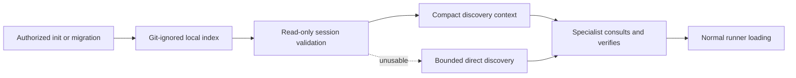

# Proposal: Agent Skill Registry Discovery

## Proposal Status

- **Change ID:** `agent-skill-registry-discovery`
- **Mode:** Interactive
- **Status:** Collaborative draft awaiting explicit approval
- **Authorized transition:** The client approved advancing from Explore to Proposal by saying `Procede`.
- **Approval boundary:** This draft does not approve the change. Spec and Design may begin only after the Orchestrator records explicit client approval.

## Context Authority

OpenSpec artifacts and the Spec Registry remain the official lifecycle authority. This proposal is grounded in the completed exploration and the product direction confirmed by the user as client, system owner, domain authority, and active stakeholder. Adaptive context was loaded only as advisory corroboration and did not alter the official direction.

The proposed `.atl/skill-registry.md` is a separate machine-local discovery index. It will not be a source of OpenSpec state, project policy, trust, precedence, permissions, delegated scope, or execution authority.

## Problem

Deck does not currently provide a dependable, bounded contract for agents to discover skills available to a project. Initialization mentions a registry without defining its sources, format, privacy behavior, freshness model, migration path, or failure handling. Orchestrator guidance is also inconsistent: legacy behavior treats registry content as injectable rules, while the active compact behavior does not validate or project registry status into delegations.

Consequently, agents can miss relevant installed or project-local skills, consult stale inventory, expose identifying local paths, or mistake discovered metadata for authoritative instructions. Already-initialized projects also have no defined path to receive an initial registry because current initialization exits early.

## Client and Agent Value

- **Client value:** More reliable use of relevant local capabilities without committing machine-specific inventory or weakening authorization controls.
- **Orchestrator value:** A compact, read-only signal describing whether skill discovery data is usable, without loading registry content as rules.
- **Specialist value:** Faster candidate discovery based on the project, delegated task, target paths, technologies, and plausible solution techniques.
- **Maintainer value:** Deterministic, testable behavior across supported runners, with explicit privacy, migration, fallback, and ownership boundaries.

## Intent

Establish `.atl/skill-registry.md` as a machine-local, Git-ignored, agent-facing index for skill discovery. `deck init` will create the initial index under normal modification authorization, including a migration path for projects that are already initialized. At session start, the Orchestrator will validate the index without writing and will pass compact Skill Discovery Context in specialist delegations. Specialists will consult relevant entries before substantial work, verify selected candidates, and load them only through the runner's normal mechanism.

The index is discovery-only. It grants no authority, trust, precedence, policy, permission, scope expansion, or right to execute or modify anything.

## Measurable Outcomes

The change will be successful when:

1. Every supported authorized initialization path either creates a valid machine-local registry with confirmed Git-ignore coverage or reports a bounded fail-open result without leaving a partial or potentially trackable file.
2. Already-initialized projects have an explicit, authorized way to create their first registry without reinitializing or relying on silent session-start writes.
3. Supported runner adapters declare the sources they can enumerate or resolve, while generated locators contain no absolute home paths, usernames, drive prefixes, or other identifying local path material.
4. Equivalent discovery inputs produce the same versioned fingerprint and canonical candidate records; `generated_at` remains informational and never determines freshness by itself.
5. Every valid duplicate observation remains independently discoverable, with no generated winner, precedence, trust, or preference designation.
6. Every specialist delegation receives bounded registry path/status guidance rather than registry bodies or inferred rules.
7. Missing, stale, invalid, or indeterminate registry states cause bounded direct discovery, do not block unrelated work, and never trigger implicit regeneration.
8. Regeneration validates a complete candidate output before atomic replacement and preserves the last valid file when regeneration fails.
9. Automated coverage demonstrates schema/version handling, source normalization, privacy, duplicate retention, deterministic freshness, Git-ignore behavior, initialization and migration, read-only validation, compact delegation context, specialist fallback, and supported-adapter parity.

Exact schemas, status vocabulary, bounds, and test cases belong to Spec and Design after approval.

## In Scope

### Required product behavior

- Define a versioned, agent-searchable Markdown index with bounded structured metadata.
- Keep the generated file machine-local and ignored by Git, preferring the root-anchored `/.atl/skill-registry.md` rule when no broader existing rule covers it.
- Let supported adapters declare runner-specific skill sources and resolve privacy-normalized or opaque locators.
- Canonicalize discovery metadata, source categories, ordering, duplicate observations, validation, rendering, and deterministic fingerprints without inventing missing metadata.
- Generate the initial registry through authorized `deck init` behavior.
- Provide an explicit authorized migration path for already-initialized projects.
- Validate registry existence, schema support, completeness, and deterministic freshness read-only at Orchestrator session start.
- Pass compact Skill Discovery Context with each specialist delegation: path, status, bounded reason, consult-or-fallback guidance, and the no-authority reminder.
- Require specialists to consult relevant candidates before substantial work, verify current availability, select the smallest relevant set, and load through normal runner mechanisms.
- Fail open to bounded direct discovery when registry state is missing, stale, invalid, or indeterminate.
- Keep regeneration separately authorized, non-silent, complete-file validated, and atomic.
- Replace legacy rule-injection semantics with the discovery-only contract across active behavior surfaces.
- Add focused tests for the full discovery lifecycle and its authority, privacy, and safety boundaries.

### Required source coverage boundary

The MVP will cover adapter-declared sources for Deck's currently supported runners and supported project-local skill roots. It may represent runner-exposed skills through opaque runner locators when no safe filesystem locator exists. The precise source list and resolver interface remain Spec/Design decisions.

## Exclusions

- Defining skill permissions, trust scores, policy, execution rights, or modification authority.
- Expanding an agent's role, delegated scope, target allowlist, or user authorization.
- Selecting a global winner or precedence rule when names or identifiers duplicate.
- Automatically loading all discovered skills or executing discovered content.
- Installing, upgrading, deleting, synchronizing, or distributing skills.
- Replacing Deck's standalone distribution catalog, runner catalogs, or runner-native loading mechanisms.
- Committing or synchronizing `.atl/skill-registry.md` across users or machines.
- Silent startup regeneration, file watchers, background refresh daemons, or a hard time-to-live based on `generated_at`.
- A human-facing marketplace, dashboard, recommendation-ranking service, or telemetry system.
- Nondeterministic inference of trust, permissions, technologies, or path relevance from arbitrary prose.
- Rewriting retained OpenSpec history.

Optional ranking, richer diagnostics, long-session revalidation, and additional runner/source integrations are follow-up candidates, not required scope unless later approved through the normal OpenSpec process.

## High-Level Approach

1. **Declare sources at adapter boundaries.** Supported adapters describe runner-owned project/user roots or runner-resolvable inventories without exposing private absolute paths.
2. **Normalize discovery in shared behavior.** Common behavior produces bounded canonical records, preserves duplicate observations, renders searchable Markdown plus structured metadata, and computes a versioned deterministic fingerprint.
3. **Generate only with authorization.** `deck init` creates the first complete file and confirms ignore coverage. An explicit migration surface handles already-initialized projects. Later regeneration remains a separate modifying action.
4. **Validate without mutation.** The Orchestrator classifies registry usability at session start and retains only a bounded status summary for delegation.
5. **Discover, verify, then load normally.** Specialists search usable entries or perform bounded direct discovery, verify candidates, and invoke the runner's ordinary skill-loading controls.
6. **Fail open safely.** Registry-specific failure degrades discovery convenience rather than becoming a general SDD blocker; all independent authorization, safety, and capability requirements continue to apply.

The diagram is explanatory only and does not define requirements or implementation architecture.

## Consequential Choices Preserved by This Proposal

- Discovery metadata remains categorically separate from OpenSpec authority, project policy, and runner loading authority.
- Deterministic fingerprints, not elapsed time, determine freshness; `generated_at` is informational.
- Read-only validation and modifying regeneration are separate operations.
- Duplicate observations are preserved without winner selection.
- Source ownership is adapter-declared; canonicalization and privacy guarantees are shared behavior.
- Registry bodies are not injected into delegations as rules; only compact status and usage guidance are passed.
- Registry failures fail open to direct discovery while unrelated work continues.
- Safe regeneration uses complete-file validation and atomic replacement.

## Dependencies

- Completed exploration: `openspec/changes/agent-skill-registry-discovery/exploration.md` (`sha256:7c93abd533ed2240deae311d1085cc9e726ba86200dd5b523cceccec964215a1`).
- Canonical lifecycle pair: `openspec/changes/agent-skill-registry-discovery/state.yaml` and `openspec/changes/agent-skill-registry-discovery/events.yaml`.
- OpenSpec initialization and Spec Registry contracts.
- Existing `deck init` behavior, including its already-initialized early exit.
- Active and legacy Orchestrator behavior surfaces that currently diverge on skill discovery.
- Supported runner adapters' current installation roots and native skill-loading mechanisms.
- Existing Git-ignore evaluation behavior and repository ignore rules.
- Applicable user/delegation modification authorization and permanent Git-safety controls.

## Risks and Mitigations

**Overall risk: Medium-High.** The artifact is local and fail-open, but the change crosses initialization, adapters, orchestration, specialist guidance, filesystem privacy, and trust boundaries.

| Risk | Potential impact | Proposal-level mitigation |
|---|---|---|
| Registry content is mistaken for policy or instructions | Prompt injection or unauthorized scope expansion | Treat records as bounded untrusted metadata, never inject bodies as rules, and repeat the no-authority boundary in delegation context. |
| Absolute paths or local identity leak | Privacy exposure in prompts, logs, or copied files | Require privacy-normalized/opaque locators and reject unsafe paths during generation and validation. |
| Stale or incomplete inventory is treated as current | Missing or incorrect skill selection | Use versioned deterministic fingerprints, explicit unusable/indeterminate handling, and immediate candidate verification before loading. |
| Duplicate-name spoofing | A local candidate appears to replace another | Preserve all observations without precedence and require source resolution plus normal loading. |
| Symlink escape, malformed input, or oversized descriptors | Unbounded reads, data exposure, or startup degradation | Define root containment and bounded parsing/scanning in Spec/Design; never execute discovered content. |
| Session-start work becomes slow | Orchestration latency | Bound source scope and I/O, fingerprint only discovery-relevant inputs, and define measurable budgets later. |
| Regeneration tears or overwrites a valid file | Loss of useful local index | Validate a complete candidate and replace atomically; preserve the last valid file on failure. |
| Initialization or migration changes Git behavior unexpectedly | Trackable local data or noisy diffs | Verify existing ignore coverage first, add only a narrowly authorized rule when needed, and fail open if safe coverage cannot be established. |
| Adapter behavior diverges | Inconsistent discovery across runners | Use adapter-declared sources behind a shared canonical contract and require parity coverage. |

## Migration Concern

Current `deck init` can return `already-initialized` before registry generation, so a generation step added only to the new-project path would leave existing projects behind. The change therefore requires a clearly named, explicit, modification-authorized migration action that creates the first registry and, only when needed and authorized, establishes narrow ignore coverage. It must not reinitialize the project, alter OpenSpec history, run silently at session start, or block unrelated work when declined or unsuccessful.

The exact user experience and command/surface for this migration remain unresolved for Spec/Design. Command-only manual refresh is not an acceptable product direction; the chosen flow must be discoverable without becoming implicit modification.

## Rollback

Rollback will disable registry generation, migration, validation projection, and delegation consumption while retaining bounded direct discovery and normal runner loading. Shared code/prompt changes can be reverted without migrating committed project data because the generated registry is machine-local and ignored. Existing local registry files may remain inert or be removed only through a separately authorized cleanup; rollback must not silently delete them or mutate Git state. A narrow ignore rule may remain harmless, or its removal may be proposed separately when safe and authorized.

## Unresolved Decisions for Spec and Design

1. Exact schema identifier, field names, compatibility policy, and status/reason vocabulary.
2. The MVP source list and adapter declaration/resolution contract, including opaque runner inventories.
3. Minimum deterministic metadata for legacy Markdown-only descriptors.
4. Exact fingerprint inputs and representation of source-scope, opaque inventories, and algorithm versions.
5. Symlink, alias, root-containment, and repeated-physical-observation behavior.
6. Descriptor, candidate, diagnostic, excerpt, parse-depth, and session-start I/O bounds.
7. The explicit authorized migration and regeneration user experience for already-initialized projects.
8. Partial-source semantics: wholly indeterminate versus bounded mixed/source-scoped usability.
9. Allowed declared task, technology, and path search signals, including deterministic behavior when only name/description exist.
10. Tracked-file detection and remediation behavior if ignore coverage changes or the registry is already tracked.
11. Whether read-only revalidation is needed during long sessions beyond required session-start validation.
12. Exact ownership boundaries among initialization, shared discovery behavior, orchestration runtime, prompt composition, and adapters.

These decisions do not block approval of intent and scope. After approval, Spec and Design should resolve them in parallel, reconcile any conflicts before Tasks, and preserve the client's authority over consequential product choices.

## Approval Question

**As the client, system owner, and domain authority, do you approve this proposal's problem framing, intent, measurable outcomes, required scope, exclusions, consequential choices, migration direction, risks, rollback, and unresolved-decision set so the Orchestrator may record approval and begin Spec and Design in parallel?**

Please respond with explicit approval or requested revisions. Draft completion alone is not approval.
