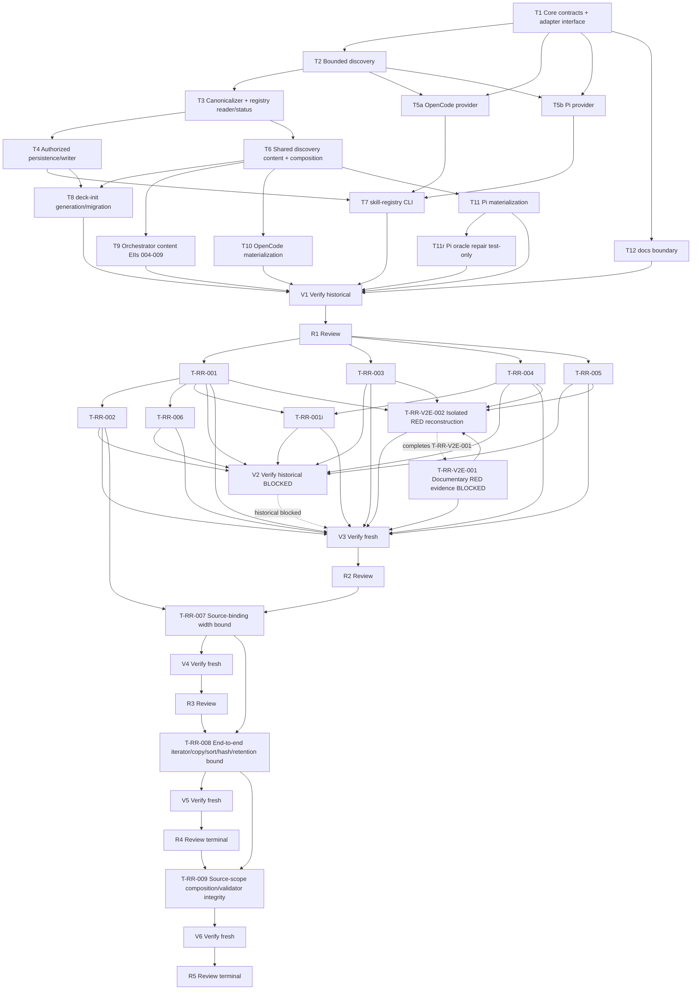

# Tasks: Agent Skill Registry Discovery

## Tasks Status

- **Change ID:** `agent-skill-registry-discovery`
- **Phase:** Tasks
- **Mode:** Interactive
- **Status:** Completed
- **Provenance:** `deck-developer-task` / `atlascloud/zai-org/glm-5.2`, Interactive mode.
- **Authorization scope:** Create only `tasks.md` and `preconditions.md`. No `state.yaml`/`events.yaml` writes; no Git mutations; no analysis of `runner-capability-standardization`.
- **Current verified bases (re-authorization of T-RR-009, five-file scope):** `tasks.md` `sha256:56e00ef56deb8c42699381ac6dc80128e7b2bb6acbd773c0de2d94e8e767d1df`; `state.yaml` `sha256:bb321f79ddb70a7da26997b348b41cb37ef46aef323affc96cbbb7cdb45a739b`; `events.yaml` `sha256:d149ab32b35a9336a5e80f7150f106a9bb79098549adad3cd2e88057cb5abefa`; `apply-progress.md` `sha256:8b5135dfb441e3a4b3b7ac4c26fcccce952b23566e049e25f9703529b434de0e`.
- **Authoritative bases (verified digests):**
  - `proposal.md` `sha256:773031ad35abce4412179cb0d53f87e9f669947b2abcbfa5b66baa2e439292b5`
  - `spec.md` `sha256:6008190c18e4966a60b6c2234906811dbf807bb2675fc0207addf9903d6c479b` — 32 requirements, 62 scenarios
  - `design.md` `sha256:ce9c6c277acd98602df2c9214ebedce0fa15dddcbabe654056637f0fcc32d791` — 32/32 coverage, 12 EIIs, 35-file baseline (33–36 expected; 41 upper bound only)
  - `tasks.md` base `sha256:88d5736dbd7cb36ae23b3397c662b9d263dd82cc3aa7235a93800c3b4f89c737` (pre-R2-Bounded-Repair-amendment)
  - `state.yaml` base `sha256:72afe38bc87c99e5f116680372566605522c02857ba67ccfdf625a05c72123b6` (current base)
  - `events.yaml` base `sha256:6eac8261f28c3313c6e255dcbcffc26c14d28cc183a483f9c4ca35a63399dca2` (current base)
  - Review R2 report `sha256:136b0ede2f4aa64b5c5822690fd401908136c9133072661172356cc108d938c6` (verdict REQUEST_CHANGES; R2-001 still blocking)
  - Verify V3 report `sha256:870377f19b3f6f3a0350530270361c16f3e8edf599b4e930a75439af1ed21684` (PASS WITH WARNINGS)
  - Review R3 report `sha256:5fdfc06e2c67f1ad23abf06d6f02942a2fb27b2e9540af8797536b78c6a8d048` (verdict REQUEST_CHANGES; R3-001 HIGH blocking — end-to-end iterator/copy/sort/hash/retention bypass)
  - Verify V4 report `sha256:9caac8b110292a17780582fbc8ab43c91aa060af0d737d0db6976cf6c790ff6f` (PASS; confirms T-RR-007 narrow bound; R3-001 bypass persists downstream)
  - V5 Verify report `sha256:208c5bd670b6f264db23a86f7043ed29d8f7bdd86eee03853e9651adc929b870` (PASS; confirms T-RR-008 end-to-end bound)
  - R4 Review report `sha256:7ff17878c4c18849d5940695f048fd027d1ce8dd4a9b1a1adb732c406a3eed5d` (verdict REQUEST_CHANGES; R4-001 HIGH blocking — source-scope composition / `evaluateCurrentSources()` omits mandatory Core generic declarations; registry validator rejects valid project-relative `safeLocatorBase` values; `source_scope_hash`/fingerprint omit mandatory discovery scope)

## Reconciliation Summary (Spec ↔ Design ↔ EIIs)

All 32 requirements and 62 scenarios are covered by the Design realization/oracle matrix (`design.md` "Requirement coverage proof"). All 12 EIIs carry a complete binding direction:

- **EII-ASRD-001** — `byte-verbatim`, exact emitted text and canonical target `packages/core/src/teams/developer/skill-discovery-content.ts` symbol `SKILL_DISCOVERY_AUTHORITY_BOUNDARY_V1`.
- **EII-ASRD-002 … EII-ASRD-012** — `semantic-constrained`, each with explicit required clauses/invariants, preserved constraints, affected tests, prohibited reinterpretations, and an ambiguity stop. No clause is missing or conflicting.

No `design-instruction-ambiguous` blocker. Decomposition proceeds. The revised Spec's Given/When/Then scenarios remain the acceptance oracles; Design-only assertions do not replace them.

## Bounded Tasks Amendment (user-approved test-only repair)

- **Amendment ID:** `T11r` (added after an authorized Apply discovery).
- **User authorization:** The user explicitly approved adding and applying a test-only Pi oracle repair.
- **Nature:** This is a bounded repair of a stale test expectation, **not** scope expansion to production. No production source, prompt, contract, state/events, preconditions, or Git state is modified by this amendment.
- **Observed failure:** `bun test packages/adapter-pi/src/registry-consumption.test.ts` → 15 pass / 1 fail at line 106. T11 correctly materializes `skillDiscoveryRuntimeContext: { activeRunnerId: "pi" }`; the stale test still compares against `getTeamSessionInstructions("developer-team")` without Pi runtime context. Typecheck and diff-check are clean.
- **Modification scope:** Modify exactly `openspec/changes/agent-skill-registry-discovery/tasks.md` (this file). `preconditions.md`, `state.yaml`, `events.yaml`, source/test code, and Git state are not modified by this amendment.

## V2 Documentary Repair and V3 Verify Amendment (user-authorized, after blocking Verify V2)

- **Amendment ID:** `T-RR-V2E-001` + `V3` (added after blocking Verify V2).
- **User authorization:** The user explicitly authorized a bounded documentary repair: (a) record existing specialist RED evidence for the seven repair tasks into the official `apply-progress.md`, (b) correct the OpenSpec validation execution contract for fresh Verify, and (c) run fresh Verify V3. No source/test/production scope is authorized.
- **Nature:** This is a bounded documentary + verification-contract repair, **not** scope expansion to production. No production source, prompt, contract, `state.yaml`/`events.yaml`, `preconditions.md`, test code, or Git state is modified by this amendment.
- **V2 blockers (immutable inputs, verified at plan time):**
  - Verify V2 report `sha256:5c47d534f2b85ac735b24b9c2215345186803e323eae76643cd07b5e1fc6faae` — verdict BLOCKED.
  - **Blocker 1 (execution-contract):** `bun run deck -- openspec validate --change agent-skill-registry-discovery` ran outside repository-root resolution and failed `Change not found`; the explicit-root equivalent (`--root /home/kevinlb/deck`) passed with 0 errors / 2 historical warnings. This is a verification execution-contract defect, not product behavior.
  - **Blocker 2 (documentary):** Official `apply-progress.md` lacks immutable actual RED command/count/output anchors for T-RR-001…T-RR-006 and T-RR-001i, although specialist phase returns contain RED evidence and all current behavior checks passed.
- **Current bases (verified digests):** `tasks.md` `sha256:4aa8856ca24508306bb626b6fa00e1e68f4568cebdc50afc4a9eb8680458b29a`; `state.yaml` `sha256:6bfb9082985d50f93d0c08b73128d7aa54a2e4ac69fd3c298d5e5f6a02fc379a`; `events.yaml` `sha256:88fa0b74c8f592a166f9222b98e64835acd92a1d8dd9c47950eb56a22ac2f746`; Verify V2 report `sha256:5c47d534f2b85ac735b24b9c2215345186803e323eae76643cd07b5e1fc6faae`; `apply-progress.md` `sha256:44d6fda841c550eadccca133fa59c5e4862027beb4a02f3e1d06a518d9a1612c`.
- **Modification scope of this amendment:** exactly `openspec/changes/agent-skill-registry-discovery/tasks.md` (this file). `apply-progress.md` is the T-RR-V2E-001 documentary repair target (documentary status update only; no source/test/behavior change). `preconditions.md`, `state.yaml`, `events.yaml`, `verify-report.md`, `review-report.md`, source, tests, generated files, and Git state are not modified by this amendment.

## Isolated RED Reconstruction Amendment (user-approved, after blocked T-RR-V2E-001)

- **Amendment ID:** `T-RR-V2E-002` (added after T-RR-V2E-001 blocked on unrecoverable original RED evidence for T-RR-001, T-RR-003, T-RR-004, and T-RR-005).
- **User authorization:** The user explicitly approved option 1: a single consolidated, isolated RED reconstruction in `/tmp`, followed by fresh V3. No source/test/production scope is authorized.
- **Nature:** This is a bounded evidence-reconstruction task, **not** scope expansion to production. No production source, prompt, contract, `state.yaml`/`events.yaml`, `preconditions.md`, test code, or Git state is modified by this amendment.
- **T-RR-V2E-001 block (immutable input):** T-RR-V2E-001 cannot fully recover original specialist RED evidence (command, observed count, failing-output summary) for T-RR-001, T-RR-003, T-RR-004, and T-RR-005 from existing phase returns. The user authorized an isolated RED reconstruction to fill the gap.
- **Current bases (verified digests):** `tasks.md` `sha256:8d89b50d402c95f63929a4a56f5f5f956e61e8701dfd5de8c4b3757bd3a982c3`; `state.yaml` `sha256:21679225d1a4eb59714263648db6ea7d2e8cb6f72ee34c7df4ea16839381a0b4`; `events.yaml` `sha256:2f0ef7779ced19d0512bbf183792edee54815228aa629a1daeeace492ceecce6`; `apply-progress.md` `sha256:71e695df7dfbd2a172f204f7c5a0003d19c2050442f57eb92c3aea7a9454eb27`; Verify V2 report `sha256:5c47d534f2b85ac735b24b9c2215345186803e323eae76643cd07b5e1fc6faae`.
- **Modification scope of this amendment:** exactly `openspec/changes/agent-skill-registry-discovery/tasks.md` (this file). `apply-progress.md` is the T-RR-V2E-002 evidence-reconstruction recording target (documentary status update only; no source/test/behavior change). `preconditions.md`, `state.yaml`, `events.yaml`, `verify-report.md`, `review-report.md`, source, tests, generated files, and Git state are not modified by this amendment.

## R2 Bounded Repair Amendment (user-authorized, after Review R2 REQUEST_CHANGES)

- **Amendment ID:** `T-RR-007` + `V4` + `R3` (added after Review R2 `REQUEST_CHANGES`).
- **User authorization:** The user explicitly authorized repairing `R2-001` (the remaining HIGH blocking bounded-work defect) and running fresh Verify/Review afterward. No scope beyond the exact Core discovery files (`packages/core/src/skill-discovery/discovery.ts` and `packages/core/src/skill-discovery/discovery.test.ts`) is authorized.
- **Nature:** This is a bounded repair of the source-binding width bypass, **not** scope expansion. No production contract, prompt, status/reason vocabulary, trust/ranking behavior, cross-runner scanning, `state.yaml`/`events.yaml`, `preconditions.md`, other source/test, generated output, or Git state is modified by this amendment.
- **R2 finding (immutable input, verified at plan time):** Review R2 report `sha256:136b0ede2f4aa64b5c5822690fd401908136c9133072661172356cc108d938c6`, verdict `REQUEST_CHANGES`. `R1-001` and `R1-003`–`R1-006` are **CLOSED**. `R1-002` remains blocking through `R2-001`: `packages/core/src/skill-discovery/discovery.ts:221-228` spreads `sourceSet.sources.filter(...).sort(...)` into `bindings`, copying and sorting the complete provider-supplied collection before declaration validation (lines 229-242) and active-runner exclusion. A faulty/hostile active-runner provider can force unbounded O(n) allocation and O(n log n) work before any candidate/filesystem/opaque/diagnostic counter limits it. Anchors: REQ-016, REQ-022, Design "Exact V1 Bounds" + startup DoS mitigation, T-RR-002 completion obligation ("no unbounded allocation/sort/retention path remains").
- **Current bases (verified digests):** `tasks.md` `sha256:88d5736dbd7cb36ae23b3397c662b9d263dd82cc3aa7235a93800c3b4f89c737`; `state.yaml` `sha256:72afe38bc87c99e5f116680372566605522c02857ba67ccfdf625a05c72123b6`; `events.yaml` `sha256:6eac8261f28c3313c6e255dcbcffc26c14d28cc183a483f9c4ca35a63399dca2`; Review R2 report `sha256:136b0ede2f4aa64b5c5822690fd401908136c9133072661172356cc108d938c6`; Verify V3 report `sha256:870377f19b3f6f3a0350530270361c16f3e8edf599b4e930a75439af1ed21684` (`PASS WITH WARNINGS`).
- **Modification scope of this amendment:** exactly `openspec/changes/agent-skill-registry-discovery/tasks.md` (this file). `apply-progress.md` is the T-RR-007 RED/GREEN evidence recording target (documentary status update only; no source/test/behavior change beyond the two allowlisted Core discovery files). `preconditions.md`, `state.yaml`, `events.yaml`, `verify-report.md`, `review-report.md`, other source, other tests, generated files, and Git state are not modified by this amendment.

## Final Task-Plan Amendment (user-authorized, after R3-001 HIGH end-to-end iterator/copy/sort/hash/retention bypass)

- **Amendment ID:** `T-RR-008` + `V5` + `R4` (added after Review R3 flagged `R3-001` HIGH and Verify V4 confirmed the residual bypass).
- **User authorization:** This is the definitive, user-authorized final consolidated end-to-end repair. The user requires no further progress prompts until full completion; the next user-facing response occurs only after full completion. This does not waive hard-stop failures, but the plan must avoid further micro-repair decomposition. T-RR-008 is the only added repair task; **no follow-on repair task may be planned after T-RR-008.** *(The terminal-governance clause below is superseded by the R4-001 Source-Scope Integrity Repair Amendment after R4 returned REQUEST_CHANGES with R4-001 HIGH blocking.)*
- **Nature:** This is a bounded end-to-end repair of the residual source-iterator/copy/sort/hash/retainer bypass that survives T-RR-007 across the CLI→registry boundary, **not** scope expansion. No new public contract, status/reason vocabulary, trust/ranking, cross-runner scan, or generated edits.
- **R3-001 finding (immutable input, verified at plan time):** Review R3 report `sha256:5fdfc06e2c67f1ad23abf06d6f02942a2fb27b2e9540af8797536b78c6a8d048`, finding `R3-001` (HIGH). T-RR-007 bounds direct `discoverSkills()` work. CLI retains/forwards the original `sourceSet.sources`. Registry later re-iterates, copies, sorts, hashes, and retains the raw source collection. Oversized or pathological custom-array iterators can still cause O(N), O(N log N), or nontermination end to end.
- **V4 verify evidence (immutable input):** Verify V4 report `sha256:9caac8b110292a17780582fbc8ab43c91aa060af0d737d0db6976cf6c790ff6f` (PASS; confirms T-RR-007's narrow bound but the end-to-end bypass persists downstream of `discovery.ts`).
- **Current bases (verified digests):** `tasks.md` `sha256:a2cb7baedeab3abf6a4d04fd7154d2fac463e6c71089ba20828605a8fc31194b`; `state.yaml` `sha256:bc16a4463fd280a31b020585839d3909450d64de93148354679ab871fbd57e03`; `events.yaml` `sha256:cb3903ea24a7b235a32e4a551e58b98c19e5eae1436e058dca8e5db83b03e22d`; Review R3 report `sha256:5fdfc06e2c67f1ad23abf06d6f02942a2fb27b2e9540af8797536b78c6a8d048`; Verify V4 report `sha256:9caac8b110292a17780582fbc8ab43c91aa060af0d737d0db6976cf6c790ff6f`.
- **Modification scope of this amendment:** exactly `openspec/changes/agent-skill-registry-discovery/tasks.md` (this file). `apply-progress.md` is the T-RR-008 RED/GREEN evidence recording target (documentary status update only; no source/test/behavior change beyond the four allowlisted files). `preconditions.md`, `state.yaml`, `events.yaml`, `verify-report.md`, `review-report.md`, other source, other tests, generated files, and Git state are not modified by this amendment.
- **Terminal repair governance:** This is the final repair round. **No automatic further repair round is planned after R4.** A blocking R4 verdict is a **hard stop requiring user disclosure** — it does not auto-spawn another repair task. Broad release depends on R4 returning a non-blocking verdict only; if R4 blocks, the change halts and the user is notified. *(Superseded: R4 returned REQUEST_CHANGES with R4-001 HIGH blocking; the user authorized the R4-001 Source-Scope Integrity Repair Amendment, making R5 the new terminal round.)*

## R4-001 Source-Scope Integrity Repair Amendment (user-authorized, after R4 REQUEST_CHANGES / R4-001 HIGH)

- **Amendment ID:** `T-RR-009` + `V6` + `R5` (added after Review R4 flagged `R4-001` HIGH and Verify V5 confirmed the residual source-scope integrity defect).
- **User authorization:** The user explicitly authorized reopening terminal governance **only** for the R4-001 repair. The user authorized exactly the previously disclosed files (`packages/core/src/skill-discovery/registry.ts`, `packages/core/src/skill-discovery/registry.test.ts`, and `apply-progress.md` evidence-only). The user expects no further progress response before full completion. This does not waive hard-stop failures.
- **Nature:** This is a bounded source-scope integrity repair of the registry source-scope composition and validator pipeline, **not** scope expansion. No new public contract, status/reason vocabulary, trust/ranking, cross-runner scan, or generated edits.
- **R4-001 finding (immutable input, verified at plan time):** Review R4 report `sha256:7ff17878c4c18849d5940695f048fd027d1ce8dd4a9b1a1adb732c406a3eed5d`, finding `R4-001` (HIGH). `evaluateCurrentSources()` hashes provider declarations but omits mandatory Core generic `.agents/skills` and `.skills` declarations. Registry validation rejects valid project-relative `safeLocatorBase` values including `.agents/skills`, `.skills`, and Pi `.pi/skills`. A registry can become committed/ready while `source_scope_hash`/fingerprint omit mandatory discovery scope. Anchors: REQ-008, REQ-029; Design invariants 2 and source-scope-hash requirements; T-RR-001/T-RR-008 preservation obligations.
- **V5 verify evidence (immutable input):** Verify V5 report `sha256:208c5bd670b6f264db23a86f7043ed29d8f7bdd86eee03853e9651adc929b870` (PASS; confirms T-RR-008 end-to-end bound but the source-scope integrity defect persists in the registry validator pipeline).
- **Current bases (verified digests):** `tasks.md` `sha256:2466dcde4556c476c746dc753bc8d1dc570fb7aa9e0c0b182f07c8cb7b9fd0c5`; `state.yaml` `sha256:45bb7a4ea8feb5944d3ec86ea95783332d3db799e5d3b6e7ae5653e210ffc93f`; `events.yaml` `sha256:5b99ca2b41611ce5e18b12c7b399f5fffefe1b88e4daacd8a0a7a2aa0a20ce7a`; Review R4 report `sha256:7ff17878c4c18849d5940695f048fd027d1ce8dd4a9b1a1adb732c406a3eed5d`; Verify V5 report `sha256:208c5bd670b6f264db23a86f7043ed29d8f7bdd86eee03853e9651adc929b870`.
- **Modification scope of this amendment:** exactly `openspec/changes/agent-skill-registry-discovery/tasks.md` (this file). `apply-progress.md` is the T-RR-009 RED/GREEN evidence recording target (documentary status update only; no source/test/behavior change beyond the allowlisted files). `preconditions.md`, `state.yaml`, `events.yaml`, `verify-report.md`, `review-report.md`, other source, other tests, generated files, and Git state are not modified by this amendment.
- **Terminal repair governance (revised):** R4 is no longer terminal. R5 is the new terminal repair round. **No automatic further repair round is planned after R5.** A blocking R5 verdict is a **hard stop requiring user disclosure** — it does not auto-spawn another repair task. Broad release depends on R5 returning a non-blocking verdict only; if R5 blocks, the change halts and the user is notified. After R5 non-blocking: broad gate → T-META-001 → Archive. **No further repair governance after R5.**

### T-RR-009 re-authorization (five-file scope, after first attempt blocked with `design-instruction-ambiguous`)

- **Re-authorization ID:** `T-RR-009r` (amendment to the existing T-RR-009 task only — **no new task is added**; T-RR-009 task ID, counts, and sequence are unchanged).
- **First attempt block (immutable input):** The first T-RR-009 attempt stopped before source/test edits with `design-instruction-ambiguous`. Two design-instruction ambiguities prevented decomposition into a two-file-only repair: (1) the canonical generic-source declaration factory is private to `packages/core/src/skill-discovery/discovery.ts` (established by T-RR-001) and cannot be reused by the registry/CLI production composition without either exporting it for internal direct-module reuse or duplicating its definitions (the latter is explicitly prohibited); (2) production composition of the canonical generic roots with the selected active-runner provider declarations lives in the CLI (`apps/cli/src/skill-registry-command.ts` `evaluateCurrentSources`), not the registry, so a two-file `registry.ts`/`registry.test.ts` scope cannot reach the production composition site without weakening the EII/Design direction. The first attempt produced no source/test edits and no RED/GREEN evidence; `apply-progress.md` retains the honest record of the blocked attempt.
- **User re-authorization (explicit):** The user explicitly re-authorized T-RR-009 with the required five-file scope plus `apply-progress.md` evidence-only. The five files are:
  1. `packages/core/src/skill-discovery/discovery.ts`
  2. `packages/core/src/skill-discovery/registry.ts`
  3. `packages/core/src/skill-discovery/registry.test.ts`
  4. `apps/cli/src/skill-registry-command.ts`
  5. `apps/cli/src/skill-registry-command.test.ts`
  plus `openspec/changes/agent-skill-registry-discovery/apply-progress.md` (evidence-only).
- **Nature:** This is a bounded source-scope integrity repair of the registry source-scope composition and validator pipeline plus the CLI production composition site that feeds it, **not** scope expansion. No new public contract, status/reason vocabulary, trust/ranking, cross-runner scan, generated edit, public package/index export change, or duplicate factory.
- **Revised technical direction (binding):**
  - Export the existing canonical `createCoreGenericProjectSources` from `packages/core/src/skill-discovery/discovery.ts` for internal direct-module reuse **without** adding it to public package/index exports (no public contract change).
  - CLI `evaluateCurrentSources` (`apps/cli/src/skill-registry-command.ts`) must compose the canonical generic roots with the selected active-runner provider declarations **before** bounded normalization/discovery/registry hashing, once and consistently.
  - Registry validator (`packages/core/src/skill-discovery/registry.ts`) must accept normalized safe project-relative locator bases with slashes (`.agents/skills`, `.skills`, `.pi/skills`, `.opencode/skills`) while rejecting absolute/traversal/empty/ambiguous/unsafe/escape values.
  - The exact complete source scope drives `source_scope_hash`/fingerprint/`ready`.
  - Add CLI production-path tests (`apps/cli/src/skill-registry-command.test.ts`) **in addition to** registry tests (`packages/core/src/skill-discovery/registry.test.ts`) for OpenCode/Pi generic+runner composition, active-runner exclusivity, false-ready prevention, safe/unsafe locator matrix, and bounded/pathological iterator preservation.
  - Record the first blocked attempt honestly, then fresh actual RED/GREEN.
  - No public index/contract change, no duplicate factory, no cross-runner scan, no other files.
- **V6/R5/broad/metadata/archive sequence:** unchanged. R5 remains terminal. No new Verify/Review/Meta task is added; counts remain unchanged.
- **Current bases (verified digests at re-authorization):** `tasks.md` `sha256:56e00ef56deb8c42699381ac6dc80128e7b2bb6acbd773c0de2d94e8e767d1df`; `state.yaml` `sha256:bb321f79ddb70a7da26997b348b41cb37ef46aef323affc96cbbb7cdb45a739b`; `events.yaml` `sha256:d149ab32b35a9336a5e80f7150f106a9bb79098549adad3cd2e88057cb5abefa`; `apply-progress.md` `sha256:8b5135dfb441e3a4b3b7ac4c26fcccce952b23566e049e25f9703529b434de0e`.
- **Modification scope of this re-authorization:** exactly `openspec/changes/agent-skill-registry-discovery/tasks.md` (this file). `apply-progress.md` is the T-RR-009 actual blocked-attempt + RED/GREEN evidence recording target (documentary status update only; no source/test/behavior change beyond the five allowlisted files). `preconditions.md`, `state.yaml`, `events.yaml`, `verify-report.md`, `review-report.md`, other source, other tests, generated files, and Git state are not modified by this re-authorization.

## Blocked Targets (immutable across all tasks)

- `packages/core/src/skills/external/index.ts` and `STANDALONE_SKILLS` — unchanged.
- `packages/sdd-runtime/**` — unchanged.
- Generated outputs: `packages/core/src/skills/external/content.generated.ts`, adapter `*.generated.js`, `apps/cli/src/runtime/build-info.generated.ts` — never hand-edited; verified via existing generators/tests only.
- Consumer `.atl/skill-registry.md` — runtime output, not a repository implementation target.
- Historical OpenSpec artifacts, `openspec/changes/**` history, `state.yaml`, `events.yaml` — not implementation targets.
- **Documentary repair carve-out (T-RR-V2E-001 only):** `openspec/changes/agent-skill-registry-discovery/apply-progress.md` is a permitted documentary repair target **only** for T-RR-V2E-001 — recording existing specialist RED evidence (command, observed counts, failing assertion/behavior/output summary, provenance/phase anchor). It is **not** an implementation target: no source/test/behavior change, no RED rerun against a reverse-patched worktree, no Git operations. No other OpenSpec artifact is a documentary repair target.
- **Evidence-reconstruction carve-out (T-RR-V2E-002 only):** `openspec/changes/agent-skill-registry-discovery/apply-progress.md` is a permitted evidence-reconstruction recording target **only** for T-RR-V2E-002 — recording isolated reconstructed RED evidence (temp-copy source digest before/after mutation, exact mutation description/anchor, exact test command and cwd, pass/fail count and failing assertion/output, `isolated reconstructed RED` label). Temporary effects are confined to one fresh directory under `/tmp/opencode/`. It is **not** an implementation target: no real-repository source/test/behavior change, no Git worktree/stash/reset/checkout/clean, no network. No other OpenSpec artifact is an evidence-reconstruction target.
- `runner-capability-standardization` — out of scope; not touched or analyzed.
- No task may invoke `git add`, `git rm`, `git reset`, `git restore`, `git checkout`, `git clean`, commit, push, or any Git index/history/worktree-discard operation.

## Apply Authorization Gate (explicit)

The repository's `apply` rules (`openspec/config.yaml`) do not treat source modification authorization as an unresolved *external* precondition; it is a runtime/contract gate. **Apply may begin only after the central coordinator records explicit user modification authorization for the Apply phase.** Until then, every task below is planned but not authorized to edit source. This gate is recorded here (not in `preconditions.md`) because it is a contract/authorization boundary, not an environment/credential precondition. No task may write source files, run the writer, or materialize prompts before this gate opens.

## Shared-File Coordination (anti-parallel protection)

To prevent simultaneous edits to shared canonical prompt/content files and adapter interfaces, the following files have a single owning task; no two parallel tasks may edit the same file:

| Shared file | Single owning task |
|---|---|
| `packages/core/src/teams/developer/skill-discovery-content.ts` (new) | T6 |
| `packages/core/src/teams/developer/content-registry.ts` | T6 |
| `packages/core/src/teams/developer/orchestrator-content.ts` (EIIs 004–009) | T9 |
| `packages/core/src/skills/bootstrap/deck-init-content.ts` | T8 |
| `packages/adapter-opencode/src/prompt-generation.ts` | T10 |
| `packages/adapter-pi/src/pi-team-profile.ts` | T11 |
| `packages/core/src/runner-adapter.ts` (core interface) | T1 |
| `packages/core/src/index.ts` (core barrel) | T1 |

Adapter provider files (`adapter-opencode/src/runner-adapter.ts`, `adapter-pi/src/runner-adapter.ts`) are distinct files owned by T5a and T5b respectively and are parallel-safe once T1 lands the additive interface.

## Dependency Diagram (explanatory only)

The diagram is explanatory and non-authoritative; the dependency lists in each task are binding. Repair nodes (`T-RR-*`, `T-RR-001i`, `T-RR-V2E-001`, `T-RR-V2E-002`, `T-RR-007`, `T-RR-008`, `T-RR-009`, `V2`, `V3`, `V4`, `V5`, `V6`, `R2`, `R3`, `R4`, `R5`) are appended below the original implementation graph. V2 is preserved as historical failed evidence; V3 is the fresh successor (depends on the same seven repair tasks plus T-RR-V2E-001, which is completed by T-RR-V2E-002 on success). R2 depends on V3 PASS. T-RR-007 is the R2 bounded successor (depends on R2 and prior T-RR-002; serialized on the shared `discovery.ts`/`discovery.test.ts` files). V4 is the fresh Verify after T-RR-007; R3 depends on V4 PASS. T-RR-008 is the R3 end-to-end bounded successor (depends on R3 and prior T-RR-007; single atomic transaction spanning CLI and registry; no parallelism). V5 is the fresh Verify after T-RR-008; R4 depends on V5 PASS. T-RR-009 is the R4 source-scope integrity bounded successor (depends on R4 and prior T-RR-008; serialized on the shared `registry.ts`/`registry.test.ts` files). V6 is the fresh Verify after T-RR-009; R5 depends on V6 PASS. **Broad depends on R5 non-blocking verdict only.** R5 is the terminal repair round: no automatic further repair round after R5; a blocking R5 is a hard stop requiring user disclosure. After R5 non-blocking: broad gate → T-META-001 → Archive.

## Implementation Tasks

---

### T1 — Core contracts, additive adapter interface, barrel exports

- **Group:** A (Foundation)
- **Owner:** `deck-developer-apply-backend`
- **Priority:** P0 (blocks all downstream)
- **Complexity:** M
- **Parallel:** No (root; everyone depends on it)
- **Depends on:** —
- **Files:**
  - Create: `packages/core/src/skill-discovery/contracts.ts`
  - Create: `packages/core/src/skill-discovery/index.ts`
  - Modify: `packages/core/src/runner-adapter.ts` — additive optional `skillDiscovery?: SkillDiscoverySourceProviderV1` + DTO imports
  - Modify: `packages/core/src/index.ts` — additive root exports; no package subpath required
  - Modify: `packages/core/src/adapter-registry.test.ts` — adapters without the optional provider remain compatible; selected provider identity preserved
- **Blocked targets:** none beyond global blocked list.
- **Requirements/Scenarios:** REQ-002 (versioned contract types), REQ-003 (record fields), REQ-004 (status/reason vocabulary), REQ-008 (source provider contract), REQ-031 (five-category enum), REQ-032 (diagnostic shape). Scenarios: valid/unsupported/missing schema version; required-field accept/reject; five-status classification surface.
- **Design/EII mapping:** "Component Boundaries — Core contracts"; "Active Runner and Source Contract" (additive `RunnerAdapter.skillDiscovery`, `SkillDiscoverySourceProviderV1`, `SkillDiscoverySourceSetV1`, `SkillDiscoverySourceBindingV1`, `SkillDiscoverySourceDeclarationV1`); "Canonical Records, Status, and Diagnostics"; "Exact V1 Bounds"; "Authorization contract" type shells. No EII text emission here (EII-001/002/010 text is T6); this task provides the type substrate only.
- **RED command/evidence:** `bun test packages/core/src/adapter-registry.test.ts` — new assertions that (a) an adapter lacking `skillDiscovery` remains constructible/compatible and (b) an adapter exposing `skillDiscovery` preserves its `runnerId` identity. Tests fail because `RunnerAdapter` has no `skillDiscovery` member and the DTO types are absent.
- **GREEN command/evidence:** `bun test packages/core/src/adapter-registry.test.ts` passes after adding the optional provider and exporting the DTOs. `bunx tsc --noEmit` clean for the contracts module.
- **Completion evidence:** adapter-registry tests green; `tsc --noEmit` clean; contracts module exported from `packages/core/src/skill-discovery/index.ts` and re-exported from `packages/core/src/index.ts`.
- **Rollout condition:** Lands before any discovery/registry/provider/writer task may start (rollout step 1 foundation).
- **Rollback boundary:** Revert the additive optional field and barrel exports; no persisted data involved.

---

### T2 — Bounded discovery service (traversal, parsing, privacy, partial-source)

- **Group:** A
- **Owner:** `deck-developer-apply-backend`
- **Priority:** P1
- **Complexity:** L
- **Parallel:** Yes (with T5a, T5b) — distinct file from T3/T4.
- **Depends on:** T1
- **Files:**
  - Create: `packages/core/src/skill-discovery/discovery.ts`
  - Create: `packages/core/src/skill-discovery/discovery.test.ts`
- **Blocked targets:** none beyond global list.
- **Requirements/Scenarios:** REQ-006 (path normalization/privacy: project-relative/opaque/absolute-rejection), REQ-007 (untrusted description handling: escape/truncate/500-char), REQ-008 (adapter-declared source discovery: active-runner scope, absent root empty, unreadable root indeterminate, partial root), REQ-021 (symlink/traversal: in-root follow, out-of-root reject, path-traversal reject), REQ-022 (malicious metadata bounds: 512 KB, 500, 50, 20-each, YAML depth 3, scan depth 5), REQ-031 (category observation). Scenarios: project-local relative locator; user opaque locator; absolute path rejection; normal description preserved; instruction-like description escaped/truncated; oversized description truncated; adapter declares project root; active-runner scope excludes other runners; absent root no error; unreadable root indeterminate; partial root records available skills.
- **Design/EII mapping:** "Bounded discovery" component; "Descriptor and Filesystem Safety" (1–9); "Symlink and traversal algorithm"; "Exact V1 Bounds"; "Opaque Runner Inventory Decision" (read-only DTO consumption). No EII prompt text.
- **RED command/evidence:** `bun test packages/core/src/skill-discovery/discovery.test.ts` — fixtures for in-root/out-of-root symlinks, depth 4/5/6, traversal, malformed YAML/aliases/duplicate keys, instruction-like descriptions, 500-char/over-500, signal bound 20/21, oversized descriptor, duplicate-key descriptors, partial/unreadable roots, bidi/control/zero-width content. Tests fail because `discovery.ts` does not exist.
- **GREEN command/evidence:** same command passes after implementing safe traversal, strict-UTF-8 512 KB read, safe YAML (custom tags/aliases/merge/duplicate keys disabled, depth 3), hostile-input sanitization, redaction, partial-source → `indeterminate/partial_source_evaluation` with usable direct hints.
- **Completion evidence:** discovery tests green at limit-1/limit/limit+1 for every bound; `tsc --noEmit` clean; no execution/import/eval of descriptor content.
- **Rollout condition:** Foundation for T3/T4 (rollout step 1).
- **Rollback boundary:** Revert discovery module; no persisted data; read-only behavior only.

---

### T3 — Canonicalizer, fingerprint, registry reader/status, searchable Markdown

- **Group:** A
- **Owner:** `deck-developer-apply-backend`
- **Priority:** P1
- **Complexity:** L
- **Parallel:** No (consumes T2; sole owner of registry semantics).
- **Depends on:** T2 (uses discovery observations to recompute current snapshot)
- **Files:**
  - Create: `packages/core/src/skill-discovery/registry.ts`
  - Create: `packages/core/src/skill-discovery/registry.test.ts`
- **Blocked targets:** none beyond global list.
- **Requirements/Scenarios:** REQ-002 (schema version accept/reject), REQ-003 (required fields accept/reject), REQ-004 (status/reason: ready/missing/stale/invalid/indeterminate; fingerprint_match/fingerprint_mismatch/truncated_output/unsupported_schema_version/missing_schema/malformed_frontmatter/oversized_file/oversized_candidate_count/partial_source_evaluation/file_absent), REQ-005 (duplicate names preserved; no winner), REQ-024 (deterministic ordering), REQ-028 (per-record searchable Markdown), REQ-029 (fingerprint inputs: same/different/algorithm version), REQ-030 (complete ready vs truncated not-ready), REQ-031 (five-category parser), REQ-032 (bounded diagnostics, max 50, aggregate marker). Scenarios: fingerprint match/mismatch; generated_at informational; duplicate names separate; same inputs same order; same sources same fingerprint; changed source different fingerprint; algorithm version increments; complete ready; truncated not ready; valid/unsupported/missing schema version.
- **Design/EII mapping:** "Canonicalizer/fingerprinter" + "Registry reader/status service" components; "Canonical Records, Status, and Diagnostics"; "Determinism and Fingerprint" (canonical ordering, source-scope hash, fingerprint algorithm); "Registry Schema and Searchable Markdown"; "Read-Only Validation and Fallback — Session-start classification". No EII prompt text.
- **RED command/evidence:** `bun test packages/core/src/skill-discovery/registry.test.ts` — duplicate-name fixtures, enumeration-order invariance, non-ASCII case-fold, fingerprint include/exclude matrix (generated_at/description/raw formatting excluded), known body projection, unknown-field ignore, every status/reason mapping, truncated-file not-ready, oversized-file/oversized-count invalid. Tests fail because `registry.ts` does not exist.
- **GREEN command/evidence:** same command passes; reader classifies without scanning when absent; rejects >512 KB before parse; recompute fingerprint only after complete snapshot; never mutates file; `tsc --noEmit` clean.
- **Completion evidence:** registry tests green; classification matrix complete; ordering deterministic independent of directory enumeration and timestamp.
- **Rollout condition:** Foundation for T4 and T6 (rollout step 1).
- **Rollback boundary:** Revert registry module; existing files become inert; no Git mutation.

---

### T4 — Authorized persistence/writer, Git-ignore, atomic replace

- **Group:** A
- **Owner:** `deck-developer-apply-backend`
- **Priority:** P1
- **Complexity:** L
- **Parallel:** No (depends on T2+T3; high-risk authorization lane).
- **Depends on:** T2, T3
- **Files:**
  - Create: `packages/core/src/skill-discovery/persistence.ts`
  - Create: `packages/core/src/skill-discovery/persistence.test.ts`
- **Blocked targets:** none beyond global list. **Risk floor:** this is the authorization/Git/trust lane — must complete and be independently verified before any prompt or CLI advertises a write path.
- **Requirements/Scenarios:** REQ-017 (authorized atomic regeneration: success replaces atomically, failure preserves last valid, not silent), REQ-018 (partial output does not overwrite valid), REQ-019 (validation/discover never create/write; no writer import), REQ-020 (root-anchored ignore: broader rule no edit, missing rule adds narrow, cannot establish → no write). Scenarios: successful regeneration atomic replace; failed regeneration preserves last valid; regeneration not silent; partial output preserves; validation does not create missing registry; existing broader rule covers; no existing rule adds narrow; ignore cannot be established.
- **Design/EII mapping:** "Authorized persistence" component; "Migration, Regeneration, and Authorization — Authorization contract" (`SkillRegistryWritePlanV1`, `SkillRegistryWriterV1`, opaque one-use `SkillRegistryWriteAuthorityV1`); "Git-Ignore and Atomic Persistence" (steps 1–6, `AtomicReplacePortV1`, same-directory temp+fsync+reparse+replace-without-delete). No EII prompt text; writer is imported by T8/T7 only after authorization.
- **RED command/evidence:** `bun test packages/core/src/skill-discovery/persistence.test.ts` — temporary repos only; broader ignore → no edit; missing ignore → append exactly `/.atl/skill-registry.md`; missing/unreadable `.gitignore` → no creation; tracked registry → warn/refuse, no untrack; read-only modules have no import path to writer/authority mint; replay/wrong-target/wrong-action/wrong-runner/stale-CAS/flag-only rejection; failpoints before/after candidate validation, ignore update, temp write, fsync, reparse, replace, dir-sync → prior registry byte-identical; no forbidden Git command reachable; no unlink-before-replace fallback. Tests fail because `persistence.ts` does not exist.
- **GREEN command/evidence:** same command passes; only a harmless narrow ignore line may remain on tolerated residue; `tsc --noEmit` clean; static import graph proves read-only discovery/registry modules cannot reach the writer mint.
- **Completion evidence:** persistence tests green including every failpoint; filesystem digest unchanged on failure; no Git index/history mutation reachable.
- **Rollout condition:** Rollout step 2 — must land before prompts (T9/T6 write guidance) or CLI refresh (T7) advertise any write path.
- **Rollback boundary:** Revert writer; existing local registries remain inert/ignored, never deleted; Git state untouched.

---

### T5a — OpenCode active-runner source provider

- **Group:** A
- **Owner:** `deck-developer-apply-backend`
- **Priority:** P1
- **Complexity:** M
- **Parallel:** Yes (with T5b; distinct file).
- **Depends on:** T1 (interface), T2 (source-set/diagnostic contract semantics)
- **Files:**
  - Modify: `packages/adapter-opencode/src/runner-adapter.ts` — active OpenCode provider implementation/attachment
  - Modify: `packages/adapter-opencode/src/runner-adapter.test.ts` — source declarations, opaque inventory, resolution, absence/partial behavior
- **Blocked targets:** `STANDALONE_SKILLS` (never consulted for `deck_materialized`); no cross-runner roots.
- **Requirements/Scenarios:** REQ-008 (active-runner scope excludes Pi roots), REQ-009 (`deck_materialized` evidence without `STANDALONE_SKILLS`; catalog-change isolation). Scenarios: adapter declares available project root; active-runner scope excludes other runners; absent root no records no error; unreadable root indeterminate; partial root records available skills; deck-materialized skill recorded by observation.
- **Design/EII mapping:** "MVP source declarations" (OpenCode rows: `opencode-config-skills`, `opencode-legacy-skills`); "Opaque Runner Inventory Decision"; provider `runnerId` must equal adapter `runnerId` else indeterminate. No EII prompt text.
- **RED command/evidence:** `bun test packages/adapter-opencode/src/runner-adapter.test.ts` — OpenCode discovery includes generic + OpenCode sources and excludes Pi-exclusive roots; complete/indeterminate opaque inventory; unsafe opaque IDs rejected; provider-result bounds; `resolveLocator` available/missing/rejected; absence as complete empty; partial as indeterminate. Tests fail because `skillDiscovery` provider is not attached.
- **GREEN command/evidence:** same command passes; `tsc --noEmit` clean.
- **Completion evidence:** provider tests green; no absolute config roots serialized; opaque ID stability.
- **Rollout condition:** Rollout step 1 (active-runner providers).
- **Rollback boundary:** Revert provider attachment; OpenCode falls back to no extra sources.

---

### T5b — Pi active-runner source provider

- **Group:** A
- **Owner:** `deck-developer-apply-backend`
- **Priority:** P1
- **Complexity:** M
- **Parallel:** Yes (with T5a; distinct file).
- **Depends on:** T1 (interface), T2 (source-set/diagnostic contract semantics)
- **Files:**
  - Modify: `packages/adapter-pi/src/runner-adapter.ts` — active Pi provider implementation/attachment
  - Modify: `packages/adapter-pi/src/runner-adapter.test.ts` — source declarations, opaque inventory, resolution, absence/partial behavior
- **Blocked targets:** `STANDALONE_SKILLS`; no cross-runner roots.
- **Requirements/Scenarios:** REQ-008 (active-runner scope excludes OpenCode roots), REQ-009. Same scenario set as T5a, inverted exclusion.
- **Design/EII mapping:** "MVP source declarations" (Pi rows: `pi-project-skills`, `pi-user-agent-skills`, `pi-user-skills`); same opaque inventory contract. No EII prompt text.
- **RED command/evidence:** `bun test packages/adapter-pi/src/runner-adapter.test.ts` — Pi discovery includes generic + Pi sources and excludes OpenCode-exclusive roots; same opaque/absence/partial/resolution matrix as T5a. Tests fail because `skillDiscovery` provider is not attached.
- **GREEN command/evidence:** same command passes; `tsc --noEmit` clean.
- **Completion evidence:** provider parity tests green; no OpenCode roots leaked.
- **Rollout condition:** Rollout step 1 (active-runner providers).
- **Rollback boundary:** Revert provider attachment; Pi falls back to no extra sources.

---

### T6 — Shared discovery content, authority boundary, runtime-context renderer, composition

- **Group:** B
- **Owner:** `deck-developer-apply-general`
- **Priority:** P1
- **Complexity:** M
- **Parallel:** Yes (with T4; distinct files from T4).
- **Depends on:** T1 (context DTO), T3 (status/fingerprint types)
- **Files:**
  - Create: `packages/core/src/teams/developer/skill-discovery-content.ts` — symbols `SKILL_DISCOVERY_AUTHORITY_BOUNDARY_V1`, `SPECIALIST_SKILL_DISCOVERY_CONTRACT_V1`, `renderSkillDiscoveryRuntimeContextV1`
  - Create: `packages/core/src/teams/developer/skill-discovery-content.test.ts`
  - Modify: `packages/core/src/teams/developer/content-registry.ts` — shared specialist/runtime composition (`getAgentContentResult`/`applyAgentContentComposition` or one dedicated equivalently named compositor; `getTeamSessionInstructions` options/composition)
  - Modify: `packages/core/src/teams/developer/content-registry.test.ts` — all-role/profile composition and ordering
- **Blocked targets:** no registry bodies, descriptions, winners, source roots, load references, inferred rules, or write instructions in composed output.
- **Requirements/Scenarios:** REQ-001 (discovery-only semantics; no authority; not injected as rules), REQ-013 (compact Skill Discovery Context on delegation: path, status, reason, guidance, active runner, authority reminder), REQ-014 (specialist consultation contract), REQ-015 (non-ready fallback guidance), REQ-016 (bounded direct-discovery guidance), REQ-027 (legacy rule-injection removal at composition level). Scenarios: delegation ready; delegation missing; registry does not expand authority; registry content not injected as rules.
- **Design/EII mapping:**
  - **EII-ASRD-001** (`byte-verbatim`): emit exact fenced text at `SKILL_DISCOVERY_AUTHORITY_BOUNDARY_V1`; exactly one occurrence on each composed surface; no paraphrase/omission/trusted-source/other-runner/write-on-read/CLI-flag-authority.
  - **EII-ASRD-002** (`semantic-constrained`): all 8 clauses (read before substantial work; ready search; non-ready direct discovery; untrusted verify; smallest set + normal loading; no registry-specific blocker; include EII-001 + prohibit specialist generation; compose into every non-Orchestrator Developer Team agent and skill in compact and legacy profiles before capability bundles).
  - **EII-ASRD-010** (`semantic-constrained`): render exactly one bounded `Skill Discovery Runtime Context` (active runner ID, registry path, runner-bound validate/discover/refresh command forms, session-start-only cadence, no-cross-runner fallback); reject unknown runner IDs; absent context → no guessed runner, indeterminate/direct fallback; place after core authority/invariant content and before capability bundles.
- **RED command/evidence:** `bun test packages/core/src/teams/developer/skill-discovery-content.test.ts packages/core/src/teams/developer/content-registry.test.ts` — assert exact bytes of EII-001 and exactly one occurrence per composed surface; specialist contract clauses present; runtime context field bounds/escaping/one-occurrence/composition-order/no-absolute-paths; every non-Orchestrator specialist in both profiles receives the fragment before capability bundles; absent context renders no guessed runner. Tests fail because the module and composition path do not exist.
- **GREEN command/evidence:** same commands pass; adapter materialization tests assert no alteration of the boundary text; `tsc --noEmit` clean.
- **Completion evidence:** content tests green; composition order verified; deduplication verified; `prompt-profile.test.ts` not yet asserting parity (that is T9), but the fragment is composed for both profiles.
- **Rollout condition:** Rollout step 1→2 bridge; must land before T9/T10/T11.
- **Rollback boundary:** Revert content module + composition; delegations lose discovery context and fail open to direct discovery.

---

### T7 — `skill-registry` CLI command (validate / discover / refresh)

- **Group:** C
- **Owner:** `deck-developer-apply-backend`
- **Priority:** P2
- **Complexity:** M
- **Parallel:** Yes (with T8/T9/T10/T11/T12; distinct files).
- **Depends on:** T1, T2, T3, T4, T5a, T5b
- **Files:**
  - Create: `apps/cli/src/skill-registry-command.ts`
  - Create: `apps/cli/src/skill-registry-command.test.ts`
  - Modify: `apps/cli/src/cli-args.ts` — strict `skill-registry` command variants
  - Modify: `apps/cli/src/cli-args.test.ts` — runner/flag/unknown-option cases
  - Modify: `apps/cli/src/main.tsx` — lazy route to the composed command without changing TUI/launch fallback
- **Blocked targets:** no `generate` command; no `--reason` authority flag; no multi-runner aggregation.
- **Requirements/Scenarios:** REQ-011 (secondary `deck skill-registry refresh`; explicit command requires authorization), REQ-012 (read-only validate), REQ-016 (bounded discover). Scenarios: explicit command generates/regenerates; explicit command requires authorization; no mid-session revalidation; direct discovery enumerates available sources.
- **Design/EII mapping:** "CLI surface" (`validate`/`discover`/`refresh`); "CLI composition" component; strict parsing rejects unknown options; missing runner non-interactive = usage error with no I/O; interactive TTY runner selection; human/JSON safety; domain statuses are structured results not parsed error strings.
- **RED command/evidence:** `bun test apps/cli/src/skill-registry-command.test.ts apps/cli/src/cli-args.test.ts` — exact `refresh` runner-bound invocation; interactive runner selection; non-interactive ambiguity refusal; JSON/human safety; no `generate`; unknown-option rejection; no I/O on missing runner; refresh requires authorization bound to runner/project/action/targets. Tests fail because the command/args do not exist.
- **GREEN command/evidence:** same commands pass; `main.tsx` lazy-routes without altering TUI/launch fallback; `tsc --noEmit` clean; `bun run build:dry-run` clean.
- **Completion evidence:** CLI tests green; refresh path delegates to the writer (T4) only with minted authority; validate/discover are read-only and cannot import the writer.
- **Rollout condition:** Rollout step 3; `refresh` advertised only after T4 is landed.
- **Rollback boundary:** Revert command + args + route; CLI offers no registry surface.

---

### T8 — `deck-init` fresh generation, registry-only migration/regeneration branch, additive envelope

- **Group:** C
- **Owner:** `deck-developer-apply-general`
- **Priority:** P2
- **Complexity:** M
- **Parallel:** Yes (with T7/T9/T10/T11/T12; distinct file `deck-init-content.ts`).
- **Depends on:** T1, T3, T4 (writer), T6 (EII-001 at modifying boundary)
- **Files:**
  - Modify: `packages/core/src/skills/bootstrap/deck-init-content.ts` — EII-ASRD-003 (named `Hard Rules`, `Decision Gates`, `Step 7`, `Return InitEnvelope`, `Output Contract`)
  - Modify: `packages/core/src/skills/bootstrap/index.test.ts` — fresh and registry-only prompt/envelope contracts
- **Blocked targets:** no agent-authored scanning; no silent startup writes; no other-runner aggregation; no command-flag authority; no general init failure; no generated-bundle edits; no `STANDALONE_SKILLS` mutation; no reindex/reinit/rewrite of OpenSpec config/history.
- **Requirements/Scenarios:** REQ-010 (authorized initial generation: new project receives registry; no sources → empty valid registry), REQ-011 (migration for already-initialized: session-start prompt offers migration; accept; decline; explicit command; explicit command requires authorization). Scenarios: new project receives initial registry; no skill sources produces empty valid registry; session-start prompt offers migration; user accepts; user declines; explicit command generates; explicit command requires authorization.
- **Design/EII mapping:** **EII-ASRD-003** (`semantic-constrained`) — all 8 clauses: replace model-directed glob/find/"if possible" writes with versioned service/CLI contract; fresh init may generate under existing fresh-init authorization using active-runner scope, safe ignore, complete output, fail-open reporting; initialized projects skip heavy work and validate read-only; registry-only `migration|regeneration` branch callable only after primary session offer accepted + exact authorization; registry-only must not reinit/reindex/rewrite OpenSpec config/history/broaden targets; additive `skill_registry` envelope (path, status, reason_code, action `generated|unchanged|authorization_required|fallback`); registry failure must not overwrite `index_status` or convert success into general failure; include EII-001 at modifying boundary. "Fresh initialization" + "Already-initialized migration and regeneration" flows.
- **RED command/evidence:** `bun test packages/core/src/skills/bootstrap/index.test.ts` — fresh empty/ready generation, already-initialized ready no-op, offered/declined/authorized migration, authorized regeneration, partial sources, ignore failure, fail-open additive envelope, no heavy-work regression, `skill_registry` envelope present, registry failure does not overwrite `index_status`. Tests fail because the registry-only branch and envelope are absent.
- **GREEN command/evidence:** same command passes; registry-only branch routes through the writer (T4) only with minted authority; `tsc --noEmit` clean.
- **Completion evidence:** bootstrap tests green; envelope additive and backward-compatible; no reinit/history/config work on registry-only path.
- **Rollout condition:** Rollout step 3; write path active only after T4.
- **Rollback boundary:** Revert registry-only branch + envelope; `deck init` regresses to prior behavior; existing local registries inert.

---

### T9 — Orchestrator content: legacy + compact system prompt, agent body, skill body (EIIs 004–009)

- **Group:** D
- **Owner:** `deck-developer-apply-general`
- **Priority:** P2
- **Complexity:** L
- **Parallel:** No (single shared file `orchestrator-content.ts`; 6 EIIs).
- **Depends on:** T6 (runtime renderer, authority boundary, specialist contract composition)
- **Files:**
  - Modify: `packages/core/src/teams/developer/orchestrator-content.ts` — symbols `ORCHESTRATOR_SYSTEM_PROMPT`, `ORCHESTRATOR_AGENT_BODY`, `ORCHESTRATOR_SKILL_BODY`, `ORCHESTRATOR_SYSTEM_PROMPT_COMPACT`, `ORCHESTRATOR_COMPACT_AGENT_BODY`, `ORCHESTRATOR_COMPACT_SKILL_BODY`
  - Modify: `packages/core/src/teams/developer/orchestrator-content.test.ts` — lifecycle semantics and legacy removal
  - Modify: `packages/core/src/teams/developer/prompt-profile.test.ts` — compact/legacy parity
- **Blocked targets:** no registry-body cache; no central candidate selection; no auto-refresh; no repeated prompting; no cross-runner scan; no registry status as blocker; no `Project Standards`; no rule injection; no Orchestrator-selected skills; no direct write; no removal of normal capability-skill loading gate; no new SDD phase.
- **Requirements/Scenarios:** REQ-012 (read-only session-start validation once; no revalidation), REQ-013 (delegation projection), REQ-015 (non-ready fallback), REQ-026 (rollback disables consumption), REQ-027 (legacy rule-injection removal). Scenarios: valid registry ready; missing classified missing; validation does not trigger regeneration; no mid-session revalidation; delegation ready; delegation missing; stale does not block; invalid falls back; legacy rule-injection does not occur; rollback disables consumption; rollback does not delete files.
- **Design/EII mapping (all `semantic-constrained`):**
  - **EII-ASRD-004** (`ORCHESTRATOR_SYSTEM_PROMPT`): exactly one read-only session-start validation; status-only caching; primary once-per-session migration/regeneration offer; secondary `deck skill-registry refresh` guidance; context projection; active-runner direct fallback; no mid-session revalidation; EII-001. Remove rule caching, `Project Standards`, pre-digestion, prohibition on specialist consultation.
  - **EII-ASRD-005** (`ORCHESTRATOR_AGENT_BODY`): remove stack-specific rule injection + placeholder; add one session validation, one user offer, bounded context projection, no direct write/loading; refer mechanics to matching skill; EII-001 without candidate data.
  - **EII-ASRD-006** (`ORCHESTRATOR_SKILL_BODY`): active-runner session validation, five exact statuses, compact delegation fields, ready consultation/non-ready direct fallback, immediate verification, normal loading, one primary offer, secondary refresh, separate authorization. Remove cached rules, `Project Standards`, pre-digestion, "agents do NOT read"; EII-001.
  - **EII-ASRD-007** (`ORCHESTRATOR_SYSTEM_PROMPT_COMPACT`): express EII-004 semantics compactly; EII-001 without body/candidates.
  - **EII-ASRD-008** (`ORCHESTRATOR_COMPACT_AGENT_BODY`): obtain/cache `SkillDiscoveryContextV1` once, delegate without candidates, absent context = indeterminate/direct discovery, at most one user offer, never write during validation; EII-001.
  - **EII-ASRD-009** (`ORCHESTRATOR_COMPACT_SKILL_BODY`): one read-only validation, cache only context, include in every scope-relevant delegation, fail open to active-runner direct discovery, offer authorized migration/regeneration once, route accepted writes to registry-only `deck-init`/shared writer; reject phase results claiming discovery authority or undelegated writes; EII-001.
- **RED command/evidence:** `bun test packages/core/src/teams/developer/orchestrator-content.test.ts packages/core/src/teams/developer/prompt-profile.test.ts` — positive lifecycle clauses (one validation, one offer, every-delegation context, active-runner fallback, immediate verification, no watcher) and negative legacy phrases (`cache compact rules`, `inject matching rules`, `pre-digest`, `agents do NOT read the registry`, `Project Standards (auto-resolved)` absent); compact/legacy semantic parity. Tests fail because the symbols still contain legacy rule-injection semantics.
- **GREEN command/evidence:** same commands pass; `tsc --noEmit` clean.
- **Completion evidence:** orchestrator-content tests green; prompt-profile parity green; no legacy phrase present; every surface includes EII-001 exactly once.
- **Rollout condition:** Rollout step 4 (replace rule-injection semantics).
- **Rollback boundary:** Revert orchestrator content; legacy rule-injection restored only as rollback; no persisted registry data mutated.

---

### T10 — OpenCode prompt materialization (active runner injection)

- **Group:** D
- **Owner:** `deck-developer-apply-backend`
- **Priority:** P2
- **Complexity:** S
- **Parallel:** Yes (with T9/T11; distinct file `adapter-opencode/src/prompt-generation.ts`).
- **Depends on:** T6 (canonical runtime renderer)
- **Files:**
  - Modify: `packages/adapter-opencode/src/prompt-generation.ts` — symbols `buildPromptContent` and `buildPromptGenerationPlan`
  - Modify: `packages/adapter-opencode/src/prompt-generation.test.ts`
- **Blocked targets:** no reading OpenCode config roots into prompt text; no candidate data; no generated-prompt direct edits; no Pi discovery.
- **Requirements/Scenarios:** REQ-027 (legacy removal at materialization), REQ-008 (active runner = opencode). Scenarios: legacy rule-injection does not occur; active-runner scope excludes other runners.
- **Design/EII mapping:** **EII-ASRD-011** (`semantic-constrained`) — supply `activeRunnerId: "opencode"` to the canonical runtime renderer for the Orchestrator session surface and preserve through every OpenCode personality/profile generation path; specialists receive the shared consumption contract through core composition, not an adapter copy; keep provider-memory filtering and existing skill-loading gate ordering intact.
- **RED command/evidence:** `bun test packages/adapter-opencode/src/prompt-generation.test.ts` — exact active runner `opencode`, runner-bound commands, one authority block, no Pi roots/commands, unchanged memory/auth composition. Tests fail because the renderer is not invoked with the active runner.
- **GREEN command/evidence:** same command passes; `tsc --noEmit` clean.
- **Completion evidence:** materialization tests green; no absolute config roots in prompt; one authority block.
- **Rollout condition:** Rollout step 4.
- **Rollback boundary:** Revert materialization; OpenCode prompt omits discovery context.

---

### T11 — Pi team-profile materialization (active runner injection)

- **Group:** D
- **Owner:** `deck-developer-apply-backend`
- **Priority:** P2
- **Complexity:** S
- **Parallel:** Yes (with T9/T10; distinct file `adapter-pi/src/pi-team-profile.ts`).
- **Depends on:** T6 (canonical runtime renderer)
- **Files:**
  - Modify: `packages/adapter-pi/src/pi-team-profile.ts` — symbols `buildTeamSystemPrompt` and `materializeTeamProfile`
  - Modify: `packages/adapter-pi/src/pi-team-profile.test.ts`
  - Modify: `packages/adapter-pi/src/orchestrator-prompt.test.ts` — remove obsolete rule-injection expectations and assert parity
- **Blocked targets:** no absolute Pi roots in prompts; no candidate/body injection; no generated-profile manual edits; no OpenCode discovery.
- **Requirements/Scenarios:** REQ-027, REQ-008 (active runner = pi). Same scenario set as T10, inverted.
- **Design/EII mapping:** **EII-ASRD-012** (`semantic-constrained`) — supply `activeRunnerId: "pi"` to the canonical runtime renderer before adaptive-memory composition and persist through normal profile materialization; specialists receive core's shared contract; preserve missing-memory fail-open rendering.
- **RED command/evidence:** `bun test packages/adapter-pi/src/pi-team-profile.test.ts packages/adapter-pi/src/orchestrator-prompt.test.ts` — exact active runner `pi`, runner-bound commands, one authority block, no OpenCode-exclusive roots/commands, unchanged memory fallback. Tests fail because the renderer is not invoked with the active runner.
- **GREEN command/evidence:** same commands pass; `tsc --noEmit` clean.
- **Completion evidence:** Pi profile tests green; parity with OpenCode semantics; no legacy rule-injection expectations remain.
- **Rollout condition:** Rollout step 4.
- **Rollback boundary:** Revert materialization; Pi profile omits discovery context.

---

### T11r — Pi oracle repair: stale `registry-consumption.test.ts` expectation (test-only, user-approved)

- **Group:** D (Pi materialization repair)
- **Owner:** `deck-developer-apply-backend`
- **Priority:** P2
- **Complexity:** S
- **Parallel:** Yes (with T9/T10/T11/T12; distinct file `packages/adapter-pi/src/registry-consumption.test.ts`).
- **Depends on:** T11
- **Files:**
  - Modify: `packages/adapter-pi/src/registry-consumption.test.ts` — **exact allowlist; this file only.**
- **Blocked targets:** NO production source edits (`pi-team-profile.ts`, `orchestrator-content.ts`, `content-registry.ts`, core modules); no other test files (`pi-team-profile.test.ts`, `orchestrator-prompt.test.ts`); no `state.yaml`/`events.yaml`/`preconditions.md`; no Git state; `runner-capability-standardization` untouched; `STANDALONE_SKILLS` and generated outputs untouched.
- **Requirements/Scenarios:** REQ-027 (legacy rule-injection does not occur), REQ-008 (active runner = `pi`; active-runner scope excludes other runners). Scenario oracle: the Pi materialization surfaces core registry instructions rendered with active runner `pi` per EII-ASRD-012.
- **Design/EII mapping:** **EII-ASRD-012** (`semantic-constrained`) — the repaired assertion must verify that Pi team-profile materialization supplies `activeRunnerId: "pi"` to the canonical runtime renderer, producing the shared consumption contract through core composition (not an adapter-specific copy). The stale expectation compared against `getTeamSessionInstructions("developer-team")` without Pi runtime context, contradicting the EII-012 invariant that the active runner is supplied before adaptive-memory composition.
- **RED evidence (already confirmed):** `bun test packages/adapter-pi/src/registry-consumption.test.ts` → **15 pass / 1 fail at line 106**. The failing assertion compares against `getTeamSessionInstructions("developer-team")` (no Pi runtime context), while T11 correctly materializes `skillDiscoveryRuntimeContext: { activeRunnerId: "pi" }`. `bunx tsc --noEmit` clean; diff-check clean. The test fails for the intended reason (stale expectation), not a production defect.
- **GREEN commands/evidence:** Update only the stale expectation to compare against core registry instructions rendered with active runner `pi` (per Spec/Design/EII-ASRD-012). Then: `bun test packages/adapter-pi/src/registry-consumption.test.ts` → 16/16 pass; `bunx tsc --noEmit` clean; diff scoped to the single allowlisted test file.
- **Completion evidence:** 16/16 pass; no production behavior changed; diff limited to `packages/adapter-pi/src/registry-consumption.test.ts`; typecheck clean.
- **Rollout condition:** Rollout step 4 (Pi materialization); must complete before V1/R1 final pass.
- **Rollback boundary:** Revert the single test expectation to its prior stale form; production unaffected.
- **Scope prohibition:** This is a **user-approved bounded test-only repair**, not scope expansion to production. T11r may modify ONLY `packages/adapter-pi/src/registry-consumption.test.ts`. It must not alter production code, other tests, prompts, contracts, `state.yaml`/`events.yaml`, `preconditions.md`, or Git state. It does not add an architectural area or touch `runner-capability-standardization`.

---

### T12 — Architecture docs boundary note

- **Group:** E
- **Owner:** `deck-developer-apply-general`
- **Priority:** P3
- **Complexity:** S
- **Parallel:** Yes (independent documentation; may run any time after T1).
- **Depends on:** T1
- **Files:**
  - Modify: `docs/architecture.md` — stable discovery/authority/source-scope boundary
- **Blocked targets:** no schema/spec duplication; reference OpenSpec artifacts as authority.
- **Requirements/Scenarios:** REQ-001 (discovery-only boundary documented). Explanatory only.
- **Design/EII mapping:** "Explicit non-targets" and "Component Boundaries" stable boundary.
- **RED command/evidence:** `rtk grep -n "skill-registry\|skill discovery\|\.atl/skill-registry" docs/architecture.md` — no stable boundary note present.
- **GREEN command/evidence:** boundary note added; cross-references OpenSpec artifacts; no generated-content edits.
- **Completion evidence:** docs note present and consistent with contracts.
- **Rollout condition:** Rollout step 5 (documentation).
- **Rollback boundary:** Revert note; no runtime effect.

---

## Independent Verify Workload

### V1 — Verify (deck-developer-verify)

- **Owner:** `deck-developer-verify`
- **Depends on:** T1–T12 and T11r all completed.
- **Scope:** compliance with specs, tasks, tests, build/typecheck, and basic design coherence.
- **Freshness invalidation rule:** V1 evidence is invalidated if any Apply task (T1–T12, T11r) is edited after V1 starts. V1 must re-run focused evidence for every changed task, including the T11r Pi oracle repair. If any task's completion evidence is stale, V1 stops and returns the affected task IDs.
- **Commands/evidence (ordered):**
  1. Focused domain tests: `bun test packages/core/src/skill-discovery/`
  2. Affected bootstrap/prompt/adapter/CLI tests: `bun test packages/core/src/skills/bootstrap/ packages/core/src/teams/developer/ packages/adapter-opencode/ packages/adapter-pi/ apps/cli/`
  3. `bunx tsc --noEmit`
  4. `bun run build:dry-run`
  5. `bun run test` (broad)
  6. `bun run deck -- openspec validate --change agent-skill-registry-discovery`
- **Matrices (no network / no real user-filesystem writes; temporary repos only):**
  - Security/path matrix: absolute-path rejection, home/drive/UNC, traversal, control/bidi/zero-width, opaque-ID safety.
  - Failpoint matrix: candidate-validation, ignore-update, temp-write, fsync, reparse, replace, dir-sync failures; prior file byte-identical.
  - Privacy matrix: no absolute roots/usernames/env values/load references in records, diagnostics, prompts, delegation context.
  - Authority matrix: read-only modules have no import path to writer mint; one-use target-bound authority; replay/wrong-target/wrong-action/wrong-runner/flag-only rejection.
- **Hard stops:** any forbidden Git command reachable; any write-on-read; any cross-runner scan; any legacy rule-injection phrase in a composed surface; any `STANDALONE_SKILLS` mutation; any generated-file hand edit.
- **Output:** Verify report with per-task pass/fail and freshness confirmation.

## Independent Review Workload

### R1 — Review (deck-developer-review)

- **Owner:** `deck-developer-review`
- **Depends on:** V1 completed (Review precedes broad release).
- **Sequence:** targeted → affected_area → independent Review → broad after Apply; **Review precedes broad.**
- **Scope:** engineering quality — architecture, security, scalability, maintainability; EII fidelity (byte-verbatim EII-001 exact bytes; every semantic-constrained EII clause present and unweakened); shared-file coordination respected; blocked targets untouched; no overengineering beyond the 35-file baseline without justification.
- **Freshness invalidation rule:** R1 is invalidated if any Apply task (including T11r) or V1 evidence changes after R1 starts. R1 stops and requests re-verify if V1 is stale.
- **Risk lanes/floors:** authorization/Git lane (T4) — highest scrutiny; prompt-injection lane (T6/T9/T10/T11) — injection-prevention and parity; adapter lane (T5a/T5b) — source-scope parity; Pi oracle parity (T11r) — confirm the repaired assertion matches EII-ASRD-012 active-runner `pi` without touching production.
- **Output:** Review report with risk classification (CRITICAL/HIGH/MEDIUM/LOW) per EII/requirement and explicit go/no-go for broad release.

## Complexity Summary

| Task | Complexity | Owner | Parallel | Depends on |
|---|---|---|---|---|
| T1 | M | apply-backend | No | — |
| T2 | L | apply-backend | Yes (with T5a/T5b) | T1 |
| T3 | L | apply-backend | No | T2 |
| T4 | L | apply-backend | No | T2, T3 |
| T5a | M | apply-backend | Yes (with T5b) | T1, T2 |
| T5b | M | apply-backend | Yes (with T5a) | T1, T2 |
| T6 | M | apply-general | Yes (with T4) | T1, T3 |
| T7 | M | apply-backend | Yes | T1, T2, T3, T4, T5a, T5b |
| T8 | M | apply-general | Yes | T1, T3, T4, T6 |
| T9 | L | apply-general | No | T6 |
| T10 | S | apply-backend | Yes (with T11) | T6 |
| T11 | S | apply-backend | Yes (with T10) | T6 |
| T11r | S | apply-backend | Yes (with T9/T10/T11/T12) | T11 |
| T12 | S | apply-general | Yes | T1 |
| V1 | — | apply-verify | No | T1–T12, T11r |
| R1 | — | apply-review | No | V1 |
| T-RR-001 | M | apply-backend | No (with T-RR-002/T-RR-006) | R1 |
| T-RR-002 | L | apply-backend | No (with T-RR-001) | T-RR-001 |
| T-RR-003 | L | apply-backend | Yes | R1 |
| T-RR-004 | S | apply-backend | Yes | R1 |
| T-RR-005 | L | apply-backend | Yes | R1 |
| T-RR-006 | M | apply-backend | No (with T-RR-001) | T-RR-001 |
| T-RR-001i | S | apply-backend | No (with T-RR-004) | T-RR-001, T-RR-004 |
| V2 | — | apply-verify | No | T-RR-001…T-RR-006, T-RR-001i (historical BLOCKED) |
| T-RR-V2E-001 | S | apply-general | Yes | T-RR-001…T-RR-006, T-RR-001i, V2 report |
| T-RR-V2E-002 | M | apply-general | Yes | T-RR-V2E-001, T-RR-001…T-RR-006, T-RR-001i |
| T-RR-007 | M | apply-backend | No (with T-RR-001/T-RR-002) | R2, T-RR-002 |
| V3 | — | apply-verify | No | T-RR-001…T-RR-006, T-RR-001i, T-RR-V2E-001, T-RR-V2E-002 |
| R2 | — | apply-review | No | V3 |
| V4 | — | apply-verify | No | T-RR-007 |
| R3 | — | apply-review | No | V4 |
| T-RR-008 | M | apply-backend | No | R3, T-RR-007 |
| V5 | — | apply-verify | No | T-RR-008 |
| R4 | — | apply-review | No | V5 |
| T-RR-009 | M | apply-backend | No (with T-RR-001/T-RR-002/T-RR-007/T-RR-003/T-RR-004/T-RR-008; shared discovery.ts/registry.ts/registry.test.ts/skill-registry-command.ts/skill-registry-command.test.ts) | R4, T-RR-008, T-RR-001 |
| V6 | — | apply-verify | No | T-RR-009 |
| R5 | — | apply-review | No | V6 |
| T-META-001 | S | spec-owner/coordinator | N/A (separate Spec action) | separate authorization |

- **Implementation tasks:** 26 (T1–T12, T11r; T5 split into T5a/T5b; plus six Review Repair tasks T-RR-001…T-RR-006 and one repair-integration task T-RR-001i; plus one documentary repair task T-RR-V2E-001; plus one evidence-reconstruction task T-RR-V2E-002; plus one R2 bounded-repair task T-RR-007; plus one R3 end-to-end bounded-repair task T-RR-008; plus one R4 source-scope integrity bounded-repair task T-RR-009)
- **Verify tasks:** 6 (V1 historical pre-repair; V2 historical post-repair BLOCKED; V3 fresh post-repair successor; V4 fresh after T-RR-007; V5 fresh after T-RR-008; V6 fresh after T-RR-009)
- **Review tasks:** 5 (R1 historical pre-repair REQUEST_CHANGES; R2 fresh post-repair REQUEST_CHANGES; R3 fresh after V4 PASS REQUEST_CHANGES; R4 fresh after V5 PASS REQUEST_CHANGES — R4-001 HIGH blocking; R5 fresh after V6 PASS — terminal round)
- **Pre-archive metadata task:** 1 (T-META-001, separate Spec authorization; not part of repair Apply)
- **Total tasks:** 37 (26 implementation + V1 + V2 + V3 + V4 + V5 + V6 + R1 + R2 + R3 + R4 + R5) plus T-META-001 pre-archive
- **Complexity counts (implementation + documentary repair + evidence reconstruction + R2/R3/R4 bounded repair only):** L = 7 (T2, T3, T4, T9, T-RR-002, T-RR-003, T-RR-005); M = 12 (T1, T5a, T5b, T6, T7, T8, T-RR-001, T-RR-006, T-RR-V2E-002, T-RR-007, T-RR-008, T-RR-009); S = 7 (T10, T11, T11r, T12, T-RR-004, T-RR-001i, T-RR-V2E-001).
- **Groups:** A (foundation: T1–T5b), B (shared content: T6), C (CLI + init: T7, T8), D (orchestrator + materialization + Pi oracle repair: T9, T10, T11, T11r), E (docs: T12), RR (Review Repair: T-RR-001…T-RR-006, T-RR-001i, T-RR-V2E-001, T-RR-V2E-002, T-RR-007, T-RR-008, T-RR-009), V (verify: V1, V2, V3, V4, V5, V6), R (review: R1, R2, R3, R4, R5), META (pre-archive: T-META-001).
- **File estimate reconciliation:** 14 original implementation tasks span 36 files. The Review Repair Plan adds 5 source files and 6 test files already within the 36-file changed set (no new architectural area; no generated-file edit). T-RR-001i is test-only within `apps/cli/src/skill-registry-command.test.ts` (already owned by T-RR-004); no new file or production scope. T-RR-008 touches `apps/cli/src/skill-registry-command.ts`, `apps/cli/src/skill-registry-command.test.ts`, `packages/core/src/skill-discovery/registry.ts`, `packages/core/src/skill-discovery/registry.test.ts` — all already within the 36-file approved change set (owned originally by T7/T3 respectively). T-RR-009 touches `packages/core/src/skill-discovery/discovery.ts`, `packages/core/src/skill-discovery/registry.ts`, `packages/core/src/skill-discovery/registry.test.ts`, `apps/cli/src/skill-registry-command.ts`, `apps/cli/src/skill-registry-command.test.ts` (five files) plus `apply-progress.md` evidence-only — all already within the 36-file approved change set (owned originally by T2/T3/T7 respectively; the `discovery.ts` internal export of `createCoreGenericProjectSources` is not a public package/index export change). Repair Apply touches only files already in the approved change scope; no file count increase is implied by the repair plan itself.

## Review Workload Forecast

- **EII fidelity review:** 12 EIIs (1 byte-verbatim exact-byte check; 11 semantic-constrained clause-presence checks). Highest density in T9 (6 EIIs) and T6 (3 EIIs).
- **Security/path/failpoint review:** T4 (authorization/Git/atomic) is the critical lane; T2 (symlink/traversal/hostile input) and T6/T9/T10/T11 (prompt injection/privacy) are high lanes.
- **Parity review:** OpenCode/Pi provider parity (T5a/T5b) and compact/legacy materialization parity (T9/T10/T11); Pi oracle-parity check that T11r's repaired assertion matches EII-ASRD-012 without production edits.
- **Architecture review:** dependency direction `core <- adapters <- CLI/materializers`; no `@deck/sdd-runtime` domain; shared-file single-owner respect.
- **Estimated effort:** R1 (historical, REQUEST_CHANGES) covered 14 implementation tasks; R2 (fresh, post-repair, depends on V3 PASS) re-checked the six closed findings (R1-001…R1-006) plus the T-RR-001i integration repair, the T-RR-V2E-001 documentary-evidence integrity (RED anchors present, no fabrication, no source/test/behavior change, advisory-memory policy respected), EII fidelity (unchanged 12/12), exact scope, and the metadata-warning disposition. R2 returned `REQUEST_CHANGES` with `R2-001` still blocking (source-binding width bypass). R3 (fresh, after V4 PASS) re-checks the closed R2-001 finding, the T-RR-007 bounded source-binding width repair (no unbounded copy/sort before active-runner filtering; deterministic ordering preserved; no new contract/vocabulary/trust/cross-runner scanning; ambiguity-stop honored), EII fidelity unchanged (12/12), shared-file single-owner respected, exact scope (no new architectural area, no generated-file edits, no `runner-capability-standardization` target), and the metadata-warning disposition. R3 returned `REQUEST_CHANGES` with `R3-001` HIGH blocking (end-to-end iterator/copy/sort/hash/retention bypass). R4 (fresh, after V5 PASS) re-checks the closed R3-001 finding and the T-RR-008 end-to-end bounded normalization (no unbounded re-iteration/copy/sort/hash/retention across CLI→registry; bounded indexed access at most 501 with retain/sort/hash at most 500; pathological custom iterator never invoked downstream; oversized input never becomes ready/complete from clipping; generic Core roots, active-runner filtering, deterministic ordering, duplicate observations, `source_scope_hash`/fingerprint integrity, normal input compatibility preserved; no new public contract/status-reason vocabulary/trust/ranking/cross-runner scanning/generated edits; ambiguity-stop honored), EII fidelity unchanged (12/12), shared-file single-owner respected, exact scope (no new architectural area, no generated-file edits, no `runner-capability-standardization` target, no file beyond the four-file allowlist), and the metadata-warning disposition. R4 returned `REQUEST_CHANGES` with `R4-001` HIGH blocking (source-scope composition/validator pipeline integrity: `evaluateCurrentSources()` omits mandatory Core generic declarations; registry validator rejects valid project-relative `safeLocatorBase` values; `source_scope_hash`/fingerprint omit mandatory discovery scope). R5 (fresh, after V6 PASS) re-checks the closed R4-001 finding and the T-RR-009 source-scope integrity repair (complete canonical source-scope composition in `evaluateCurrentSources()` with Core generic roots + active-runner provider roots, never other-runner roots, reusing the T-RR-001 canonical factory/path with no duplicated definitions; `source_scope_hash`/fingerprint bind the exact complete canonical declarations; `ready` only on complete-scope hash match; valid project-relative `safeLocatorBase` values accepted; absolute/traversal/empty/ambiguous/unsafe rejected; privacy/path containment not weakened; bounded 501/500 behavior and truncated/indeterminate semantics from T-RR-008 preserved; active-runner exclusivity preserved; no new public contract/status-reason vocabulary/trust/ranking/cross-runner scanning/generated edits; ambiguity-stop honored; no file beyond the two-file allowlist + `apply-progress.md` evidence-only), EII fidelity unchanged (12/12), shared-file single-owner respected, exact scope (no new architectural area, no generated-file edits, no `runner-capability-standardization` target), and the metadata-warning disposition. R5 is a single consolidated terminal pass; no split required. **R5 does not proceed on a blocked/missing V6.** **No automatic further repair round after R5; a blocking R5 is a hard stop requiring user disclosure.**
- **Repair risk lanes (R5 must re-verify):** HIGH security — T-RR-009 (source-scope composition/validator integrity + CLI production composition + `discovery.ts` internal export; continuation of R4-001/T-RR-001/T-RR-008; five-file scope: `discovery.ts`/`registry.ts`/`registry.test.ts`/`skill-registry-command.ts`/`skill-registry-command.test.ts`; no duplicate factory, no public package/index export change, no cross-runner scan), T-RR-008 (end-to-end iterator/copy/sort/hash/retention DoS; continuation of R3-001/R2-001/R1-002), T-RR-007 (source-binding width DoS; continuation of R1-002/R2-001), T-RR-002 (bounds/DoS), T-RR-003 (stored integrity), T-RR-005 (preservation/no-silent-write); HIGH correctness — T-RR-001 (generic roots/active-runner scope; canonical factory in `discovery.ts`); MEDIUM — T-RR-004 (empty-ignore), T-RR-006 (stale opaque exposure), T-RR-001i (test-only integration: fixture/source-ownership hygiene; must not hide duplicate observations in production), T-RR-V2E-001 (documentary-evidence integrity: no fabricated evidence, every recorded RED fact bound to an official task/finding/test anchor, advisory memory not elevated to official evidence), T-RR-V2E-002 (evidence-reconstruction integrity: every reconstructed RED fact labeled `isolated reconstructed RED`; mutations anchored to exact R1 defects; real-repository source/test digest byte-identical before/after; no source/test/behavior change in the real repo; no Git writes/discards; no network). High-risk lanes require adversarial/boundary/failpoint evidence, not label-only tests.

## Execution Batches and Safe Parallelism

- **Batch 1:** T1 (foundation; no parallelism — root).
- **Batch 2 (parallel):** T2, T5a, T5b (distinct files; T5a/T5b depend on T1+T2 contracts but T2's file is independent of provider files — T5a/T5b may start once T1 lands and consume T2's contract at integration; to keep TDD integrity, T5a/T5b tests stub the discovery contract until T2 lands, then re-run). *Safe because files are disjoint.*
- **Batch 3:** T3 (depends on T2).
- **Batch 4 (parallel):** T4, T6 (distinct files; T4 = persistence, T6 = content/composition). *Safe; no shared file.*
- **Batch 5 (parallel):** T7, T8, T9, T10, T11, T11r, T12 (all distinct files; all dependencies satisfied). T9 is single-owner but may run in parallel with T7/T8/T10/T11/T11r/T12 because no file overlap. T11r depends on T11 and touches only `packages/adapter-pi/src/registry-consumption.test.ts`. *Risk floor: T4 (writer) must be complete + verified before T7-refresh and T8 advertise write paths — satisfied by batch ordering.*
- **Batch 6:** V1 (after all Apply, including T11r).
- **Batch 7:** R1 (after V1; Review precedes broad release). — R1 verdict: REQUEST_CHANGES; broad blocked.
- **Batch 8 (RR-Wave 1, parallel, awaiting explicit user authorization):** T-RR-001, T-RR-003, T-RR-004, T-RR-005 (distinct files).
- **Batch 9 (RR-Wave 2, parallel, after T-RR-001 and T-RR-004):** T-RR-002, T-RR-006, T-RR-001i (each serialized on a file shared with a Wave-1 task: T-RR-002 on `discovery.ts`/`discovery.test.ts` shared with T-RR-001; T-RR-006 on `adapter-opencode/runner-adapter.test.ts` shared with T-RR-001; T-RR-001i on `apps/cli/src/skill-registry-command.test.ts` shared with T-RR-004. The three Wave-2 tasks share no files with each other).
- **Batch 10 (V2 historical BLOCKED):** V2 was a fresh targeted + affected-area Verify after all seven repair tasks T-RR-001…T-RR-006 + T-RR-001i. V2 blocked on (1) OpenSpec validation outside repository-root resolution and (2) missing RED anchors in `apply-progress.md`. Preserved as historical failed evidence; not a gate.
- **Batch 11 (RR-Wave 3, documentary, after RR-Wave 1+2 complete):** T-RR-V2E-001 (distinct file `apply-progress.md`; records existing specialist RED evidence for T-RR-001…T-RR-006 + T-RR-001i). Documentary-only; no source/test/behavior change.
- **Batch 12 (RR-Wave 4, evidence reconstruction, after RR-Wave 3 blocked):** T-RR-V2E-002 (distinct file `apply-progress.md` shared with T-RR-V2E-001 but serialized after it; reconstruction occurs in disposable `/tmp/opencode/` copy). Reconstructs missing defect-RED evidence for T-RR-001, T-RR-003, T-RR-004, and T-RR-005 via isolated mutation in disposable copy. On success, completes T-RR-V2E-001; V3 may proceed. On failure, V3 remains blocked.
- **Batch 13 (V3 fresh successor):** V3 (fresh targeted + affected-area Verify after all seven repair tasks + T-RR-V2E-001 completed by T-RR-V2E-002; OpenSpec validation MUST run from `/home/kevinlb/deck` or with `--root /home/kevinlb/deck`; no auto-advance on failure; no invocation from an unspecified temporary cwd).
- **Batch 14:** R2 (fresh independent Review after V3 PASS; Review precedes broad). — R2 verdict: REQUEST_CHANGES; broad blocked (R2-001 still blocking).
- **Batch 15 (RR-Wave 5, R2 bounded repair, after R2 REQUEST_CHANGES and prior T-RR-002; awaiting explicit user authorization):** T-RR-007 (serialized on `discovery.ts`/`discovery.test.ts` shared with T-RR-001 and T-RR-002; no parallelism on those shared files). Enforces a bounded source-declaration work budget before copy/sort/validation/active-runner filtering.
- **Batch 16 (V4 fresh successor):** V4 (fresh targeted + affected-area Verify after T-RR-007; OpenSpec validation MUST run from `/home/kevinlb/deck` or with `--root /home/kevinlb/deck`; no auto-advance on failure). Freshness: V4 evidence is invalidated if T-RR-007 or `apply-progress.md` is edited after V4 starts.
- **Batch 17:** R3 (fresh independent Review after V4 PASS; Review precedes broad). Re-checks the closed R2-001 finding and T-RR-007. — R3 verdict: REQUEST_CHANGES; R3-001 HIGH blocking; broad blocked.
- **Batch 18 (RR-Wave 6, R3 end-to-end repair, after R3 REQUEST_CHANGES/R3-001 and prior T-RR-007; awaiting explicit user authorization):** T-RR-008 (single atomic end-to-end transaction spanning CLI and registry; no parallelism). Enforces bounded indexed normalization across the CLI→registry boundary (at most 501 indexed, retain/sort/hash at most 500; pathological custom iterator never invoked downstream; oversized input never becomes ready/complete from clipping).
- **Batch 19 (V5 fresh successor):** V5 (fresh targeted + affected-area Verify after T-RR-008; OpenSpec validation MUST run from `/home/kevinlb/deck` or with `--root /home/kevinlb/deck`; no auto-advance on failure). Freshness: V5 evidence is invalidated if T-RR-008 or `apply-progress.md` is edited after V5 starts.
- **Batch 20:** R4 (fresh independent Review after V5 PASS; Review precedes broad). Re-checks the closed R3-001 finding and T-RR-008. — R4 verdict: REQUEST_CHANGES; R4-001 HIGH blocking (source-scope composition/validator pipeline integrity); broad blocked. R4 is no longer terminal (superseded by the R4-001 Source-Scope Integrity Repair Amendment).
- **Batch 21 (RR-Wave 7, R4 source-scope integrity repair, after R4 REQUEST_CHANGES/R4-001 and prior T-RR-008; awaiting explicit user authorization):** T-RR-009 (serialized on `discovery.ts` shared with T-RR-001/T-RR-002/T-RR-007, `registry.ts`/`registry.test.ts` shared with T-RR-003/T-RR-008, and `skill-registry-command.ts`/`skill-registry-command.test.ts` shared with T-RR-004/T-RR-008; no parallelism on those shared files). Enforces complete canonical source-scope composition in `evaluateCurrentSources()` (Core generic roots + active-runner provider roots, never other-runner roots) by exporting and reusing the canonical `createCoreGenericProjectSources` factory from `discovery.ts` (no duplicate factory, no public package/index export change); CLI composes canonical generic roots with active-runner provider declarations before bounded normalization/discovery/registry hashing, once and consistently; `source_scope_hash`/fingerprint bind the exact complete scope; `ready` only on complete-scope hash match; valid project-relative `safeLocatorBase` values with slashes accepted; absolute/traversal/empty/ambiguous/unsafe/escape rejected; bounded 501/500 behavior preserved; CLI production-path tests added in addition to registry tests.
- **Batch 22 (V6 fresh successor):** V6 (fresh targeted + affected-area Verify after T-RR-009; OpenSpec validation MUST run from `/home/kevinlb/deck` or with `--root /home/kevinlb/deck`; no auto-advance on failure). Freshness: V6 evidence is invalidated if T-RR-009 or `apply-progress.md` is edited after V6 starts.
- **Batch 23:** R5 (fresh independent Review after V6 PASS; Review precedes broad). Re-checks the closed R4-001 finding and T-RR-009. **Terminal repair governance: no automatic further repair round after R5; a blocking R5 is a hard stop requiring user disclosure.**
- **Batch 24 (broad gate):** `bun run test` only after R5 returns a non-blocking verdict. After broad: T-META-001 → Archive.

**Safe parallelism invariant:** no two parallel tasks edit the same file (enforced by the Shared-File Coordination table and the Repair Apply File Allowlist). The authorization lane (T4) is a hard floor: no write-advertising prompt/CLI task may start before T4 is complete. Repair serialization: T-RR-002 depends on T-RR-001 (`discovery.ts`/`discovery.test.ts`); T-RR-006 depends on T-RR-001 (`adapter-opencode/runner-adapter.test.ts`); T-RR-001i depends on T-RR-001 and T-RR-004 (`apps/cli/src/skill-registry-command.test.ts` shared with T-RR-004). T-RR-007 depends on R2 and prior T-RR-002 (`discovery.ts`/`discovery.test.ts` shared with T-RR-001 and T-RR-002; serialized after T-RR-002). T-RR-008 depends on R3 and prior T-RR-007; it is a single atomic end-to-end transaction spanning `apps/cli/src/skill-registry-command.ts`/`apps/cli/src/skill-registry-command.test.ts` and `packages/core/src/skill-discovery/registry.ts`/`packages/core/src/skill-discovery/registry.test.ts` (no parallelism; serialized after T-RR-007). T-RR-009 depends on R4 and prior T-RR-008 and T-RR-001; it is serialized on `packages/core/src/skill-discovery/discovery.ts` (shared with T-RR-001/T-RR-002/T-RR-007), `packages/core/src/skill-discovery/registry.ts`/`packages/core/src/skill-discovery/registry.test.ts` (shared with T-RR-003/T-RR-008), and `apps/cli/src/skill-registry-command.ts`/`apps/cli/src/skill-registry-command.test.ts` (shared with T-RR-004/T-RR-008) (no parallelism on those shared files; serialized after T-RR-008). The `discovery.ts` edit is a non-public internal export of the existing canonical `createCoreGenericProjectSources` factory for direct-module reuse; no public package/index export change. V2 (historical) depended on all seven repair tasks (T-RR-001…T-RR-006, T-RR-001i) and is preserved as blocked. V3 depends on the same seven repair tasks plus T-RR-V2E-001 (completed by T-RR-V2E-002 on success); T-RR-V2E-002 shares `apply-progress.md` with T-RR-V2E-001 but is serialized after it (depends on blocked T-RR-V2E-001), so no parallel conflict. V3's OpenSpec validation must run from `/home/kevinlb/deck` or with `--root /home/kevinlb/deck`. R2 depends on V3 PASS. V4 depends on T-RR-007 (fresh targeted + affected-area Verify; same rooted OpenSpec validation contract as V3). R3 depends on V4 PASS. T-RR-008 depends on R3 and prior T-RR-007 (fresh targeted + affected-area Verify; same rooted OpenSpec validation contract). V5 depends on T-RR-008. R4 depends on V5 PASS. T-RR-009 depends on R4 and prior T-RR-008. V6 depends on T-RR-009 (fresh targeted + affected-area Verify; same rooted OpenSpec validation contract). R5 depends on V6 PASS; broad depends on R5 non-blocking verdict only. After R5 non-blocking: broad gate → T-META-001 → Archive. **R5 is the terminal repair round: no automatic further repair round after R5; a blocking R5 is a hard stop requiring user disclosure.**

## Rollback Sequence

1. Revert adapter materialization (T10, T11) and orchestrator content (T9) — prompts lose discovery context; fail open to direct discovery. Revert the T11r test-only repair alongside T11.
2. Revert Review Repair tasks (T-RR-001…T-RR-006, T-RR-001i) if applied — restores the pre-repair R1-defective behavior; R1 remains the historical blocker record. T-RR-001i reverts alongside Wave 2; T-META-001 (if applied) reverts summary metadata only; scenarios unchanged.
2a. Revert T-RR-V2E-001 documentary additions and T-RR-V2E-002 reconstructed-evidence additions to `apply-progress.md` — RED evidence returns to being carried only in specialist phase returns; V2 returns to being the sole historical blocker record; production/behavior unaffected. V3 is invalidated (no documentary/reconstructed RED anchors).
2b. Revert T-RR-007 source-binding width bound (if applied) — discovery regresses to unbounded provider copy/sort before active-runner filtering; R2-001 returns; R2 remains the historical blocker record. V4/R3 are invalidated.
2c. Revert T-RR-008 end-to-end bounded normalization (if applied) — CLI/registry regress to re-iterating/copying/sorting/hashing/retaining the raw collection downstream of T-RR-007; R3-001 returns; R3 remains the historical blocker record. V5/R4 are invalidated.
2d. Revert T-RR-009 source-scope composition/validator integrity and CLI production composition + `discovery.ts` internal export (if applied) — registry/CLI regress to omitting Core generic declarations from `evaluateCurrentSources()` and rejecting valid project-relative `safeLocatorBase` values; the `createCoreGenericProjectSources` factory returns to private-only in `discovery.ts`; R4-001 returns; R4 remains the historical blocker record. V6/R5 are invalidated.
3. Revert CLI + deck-init registry branches (T7, T8) — no write/refresh surface; `deck init` regresses.
4. Revert shared content + composition (T6) — delegations lose compact context.
5. Revert writer/persistence (T4) — no authorized write path.
6. Revert canonicalizer/reader (T3) and discovery (T2) — no classification.
7. Revert contracts + adapter interface (T1).
8. Revert docs (T12) anytime.
- Existing local `.atl/skill-registry.md` files remain inert/ignored; **never deleted**. Git state **not mutated**. A narrow `/.atl/skill-registry.md` ignore rule is harmless and may be removed only through a separate authorized change. `STANDALONE_SKILLS` requires no rollback.

## Open Questions / Blockers

- **Design blockers:** None (Design "Remaining Decisions and Blockers" = None).
- **Implementation blockers known now:** None. A platform lacking a proven atomic-replace primitive must fail safely (preserve old file) rather than weaken preservation — this is a task-local choice inside T4, not a blocker.
- **Task-local implementation choices (non-blocking):** concrete OS primitive behind `AtomicReplacePortV1`; helper naming if source symbols move; consolidation within the 33–36 expected range. None may weaken the defined contracts or add target areas.
- **Registry coordination:** The central coordinator must validate this artifact digest and the returned `RegistryIntentV1` against the unchanged `state.yaml`/`events.yaml` bases before Apply. A base conflict is a hard stop; this agent performs no registry write.

## Review Repair Plan (R1-001–R1-006)

- **Authorization:** The user authorized preparing this repair plan only. **Production/source/test modifications are not yet authorized.** This section is a plan; no implementation authorization is implied.
- **Modification scope of this amendment:** exactly `openspec/changes/agent-skill-registry-discovery/tasks.md` (this file). `preconditions.md`, `review-report.md`, `verify-report.md`, `apply-progress.md`, `state.yaml`, `events.yaml`, source, tests, docs, generated files, and Git state are not modified. `runner-capability-standardization` is not touched.
- **Immutable inputs (verified at plan time):** `tasks.md` (pre-T-RR-001i) `sha256:002d541a07c42fca2a8070fc052995d914fe115f2a6c4de796b397bdc2128142`; Review R1 `sha256:defaa476f31a570f005d7fd1680d685012749998e8c08f32f5645b03579743ee` (verdict REQUEST_CHANGES); Verify report `sha256:5180b12f4e32089ea5c669b51770a3318e22cb9844fee19598103cd4eb1403b6`; `state.yaml` `sha256:bd41d4210a87ade3c226b45bb9dbcd9f41db0c2a977b6bb42ae3f1cfad5f787c`; `events.yaml` `sha256:777dd4939d174b600bf5dac7baf697f899b73ec6dfeaa9ddbad7ece8a5f63d33`.
- **Findings planned:** R1-001 (HIGH), R1-002 (HIGH), R1-003 (HIGH), R1-004 (MEDIUM), R1-005 (HIGH), R1-006 (MEDIUM). One atomic repair task per finding (no two findings require the same inseparable transaction).
- **Apply readiness:** `awaiting explicit user authorization`. All repair tasks below are planned, TDD-scoped, and exact-allowlist-protected; none may edit source/tests until the user authorizes the repair Apply.

### T-RR-001 — Repair R1-001: Core contributes the two mandatory generic project roots in production composition

- **Group:** RR (Review Repair)
- **Owner:** `deck-developer-apply-backend`
- **Finding:** R1-001 (HIGH) — Core never contributes `.agents/skills/` (`project-agents-skills`) and `.skills/` (`project-generic-skills`).
- **Priority:** P0 (HIGH; blocks active-runner scope completeness)
- **Complexity:** M
- **Parallel:** No with T-RR-002 and T-RR-006 (shared files — see serialization); Yes with T-RR-003/T-RR-004/T-RR-005 (distinct files).
- **Depends on:** R1 Review complete (immutable input); no implementation task dependency.
- **Files (exact allowlist):**
  - Source: `packages/core/src/skill-discovery/discovery.ts` — make `discoverSkills`/source-set assembly always prepend the two Core generic project root declarations (`project-agents-skills` → `<project>/.agents/skills`, `project-generic-skills` → `<project>/.skills`) per Design "MVP source declarations" and Non-Negotiable Invariant 2.
  - Tests: `packages/core/src/skill-discovery/discovery.test.ts`, `packages/adapter-opencode/src/runner-adapter.test.ts`, `packages/adapter-pi/src/runner-adapter.test.ts` — end-to-end proof that composed discovery yields both generic roots plus only the active runner's roots and excludes the other runner's exclusive roots.
- **Blocked targets:** no adapter production source edits (generic roots are Core-owned, not adapter-owned); no CLI source; no other runner's roots; no `state.yaml`/`events.yaml`; no Git state.
- **Requirements/Scenarios:** REQ-008 (active-runner scope; absent root empty; partial root), REQ-031 (five-category enum incl. `project_local`). Design: "Chosen Architecture," "MVP source declarations," Non-Negotiable Invariant 2.
- **RED test (demonstrates the defect):** `bun test packages/adapter-opencode/src/runner-adapter.test.ts packages/adapter-pi/src/runner-adapter.test.ts` — a composed-discovery assertion expecting `project-agents-skills` and `project-generic-skills` in the production source set fails because the current production composition forwards only `provider.listSources()` output. (Existing adapter tests positively fix the production list to adapter-only roots, masking the defect.)
- **GREEN behavior:** after Core assembly prepends generic roots, composed discovery includes both generic roots + active-runner roots and excludes other-runner roots; `bunx tsc --noEmit` clean.
- **Targeted/affected commands:** `bun test packages/core/src/skill-discovery/discovery.test.ts packages/adapter-opencode/src/runner-adapter.test.ts packages/adapter-pi/src/runner-adapter.test.ts`; `bunx tsc --noEmit`.
- **Completion evidence:** generic roots present in production composition under OpenCode and Pi; other-runner roots excluded; tests green; no adapter production source changed.
- **Rollout:** repair wave; must precede V2.
- **Rollback:** revert Core generic-root injection; discovery regresses to adapter-only composition.
- **Ambiguity stop:** if Core assembly cannot prepend generic roots without changing the `discoverSkills` signature contract, stop and reconcile Spec/Design rather than moving generic roots into adapters.

### T-RR-002 — Repair R1-002: enforce width bounds before unbounded work

- **Group:** RR
- **Owner:** `deck-developer-apply-backend`
- **Finding:** R1-002 (HIGH) — scanner breadth, diagnostic accumulation, and opaque-inventory sorting do unbounded work before limits.
- **Priority:** P0 (HIGH security/DoS)
- **Complexity:** L
- **Parallel:** No with T-RR-001 (shared `discovery.ts` + `discovery.test.ts`); Yes with T-RR-003/T-RR-004/T-RR-005/T-RR-006 (distinct files). Serialized after T-RR-001.
- **Depends on:** T-RR-001 (file-conflict serialization of `discovery.ts`/`discovery.test.ts`).
- **Files (exact allowlist):**
  - Source: `packages/core/src/skill-discovery/discovery.ts` — `walkDirectory()` (bound `readdir` width/stats/recursive visit before advancing candidate counter), `evaluateOpaqueSource()` (bound stream/copy/sort of untrusted observations before the 500 cap), `DiagnosticCollector` (cap retention incrementally before `toArray()` full sort).
  - Tests: `packages/core/src/skill-discovery/discovery.test.ts`.
- **Blocked targets:** no weakening of the 500-record/50-diagnostic/512 KB/depth-5/signal-20/YAML-depth-3 bounds; no removal of in-root symlink following; no Git state.
- **Requirements/Scenarios:** REQ-022 (malicious metadata bounds: limit-1/limit/limit+1), REQ-032 (bounded diagnostics, max 50). Design: "Exact V1 Bounds," "Bounded discovery," risk mitigation for parser/startup DoS.
- **RED tests (adversarial/boundary, not label-only):** a depth-1 source with an arbitrarily large number of non-descriptor entries (e.g. 50 000) currently performs unbounded `readdir` allocation/sort/stats/traversal without touching `candidateCount`; a raw opaque provider returning an oversized observations array is fully copied/sorted; arbitrarily many failures are retained before the 50-entry cap. These must fail (timeout/memory/over-retention) before the fix.
- **GREEN behavior:** bounded work before copying/sorting/retaining/traversing; below/at/above and large-width cases complete within bounded memory/time; diagnostics capped incrementally with the safe aggregate `diagnostic_limit_reached` marker; `bunx tsc --noEmit` clean.
- **Targeted/affected commands:** `bun test packages/core/src/skill-discovery/discovery.test.ts`; `bunx tsc --noEmit`.
- **Completion evidence:** adversarial width tests pass at below/at/above every bound; no unbounded allocation/sort/retention path remains; diagnostics capped at 50 with aggregate marker.
- **Rollout:** repair wave; must precede V2.
- **Rollback:** revert bounds-before-work; bounds tests for normal inputs still pass but adversarial protection is lost.
- **Ambiguity stop:** if a bound cannot be enforced without changing the `SkillDiscoverySourceSetV1`/`OpaqueSkillInventoryResultV1` contracts, stop and reconcile Spec/Design rather than weakening a bound.

### T-RR-003 — Repair R1-003: validate stored registry metadata integrity before `ready`

- **Group:** RR
- **Owner:** `deck-developer-apply-backend`
- **Finding:** R1-003 (HIGH) — reader trusts stored fingerprint without validating parsed metadata, observation IDs, source-scope hash, or timestamp integrity.
- **Priority:** P0 (HIGH trust-boundary)
- **Complexity:** L
- **Parallel:** Yes (distinct files from all other repair tasks).
- **Depends on:** R1 Review complete (immutable input).
- **Files (exact allowlist):**
  - Source: `packages/core/src/skill-discovery/registry.ts` — `parseSkillRegistryDocument()` (recompute fingerprint from parsed records; verify each `observation_id` against its identity fields `{source_category, scope, runner_id, locator}`), `readSkillRegistryStatus()` (compare stored `source_scope_hash` and recomputed fingerprint to the current complete snapshot before `ready`), `readRequiredFrontmatter()` (enforce ISO-8601 `generated_at`, `sha256:` digest shape, and `source_scope_hash` self-consistency).
  - Tests: `packages/core/src/skill-discovery/registry.test.ts`.
- **Blocked targets:** no new status/reason vocabulary (the five statuses and nine non-ready reason codes are fixed); no writer import in the reader; no repair callbacks; no Git state.
- **Requirements/Scenarios:** REQ-003 (required fields), REQ-004 (status/reason: only `fingerprint_match` may yield `ready`), REQ-012 (read-only session-start validation), REQ-029 (fingerprint inputs). Design: "Session-start classification" steps 4 and 7, "Canonical records," Non-Negotiable Invariants 1 and 10.
- **RED tests (adversarial/boundary, not label-only):** (a) tamper a record and its deterministic Markdown projection while leaving the old stored fingerprint intact — current code returns `ready/fingerprint_match` when current sources still produce that old fingerprint; (b) a stored `observation_id` that does not match its identity fields parses successfully; (c) a non-ISO `generated_at` and arbitrary `source_scope_hash` string are accepted; (d) a stored `source_scope_hash` that differs from the current snapshot still yields `ready`. All must fail for the intended reason before the fix.
- **GREEN behavior:** `ready` requires stored self-consistency (recomputed fingerprint == stored fingerprint, observation IDs valid, `source_scope_hash` == current snapshot, digest/ISO shapes enforced); tampered/invalid/stale metadata maps to `stale`/`invalid`/`indeterminate` per the exact vocabulary; `bunx tsc --noEmit` clean.
- **Targeted/affected commands:** `bun test packages/core/src/skill-discovery/registry.test.ts`; `bunx tsc --noEmit`.
- **Completion evidence:** tamper/observation-ID/source-scope-hash/digest-shape/ISO-timestamp tests pass; no false `ready` from corrupted metadata.
- **Rollout:** repair wave; must precede V2.
- **Rollback:** revert integrity checks; reader regresses to trusting stored fingerprint.
- **Ambiguity stop:** if recomputing the fingerprint in the reader would require importing the writer/canonicalizer write path, stop and reconcile ownership rather than breaking read/write separation.

### T-RR-004 — Repair R1-004: distinguish missing from empty readable `.gitignore`

- **Group:** RR
- **Owner:** `deck-developer-apply-backend`
- **Finding:** R1-004 (MEDIUM) — existing empty readable `.gitignore` treated as unavailable.
- **Priority:** P1 (MEDIUM)
- **Complexity:** S
- **Parallel:** Yes (distinct files from all other repair tasks in RR-Wave 1). **Serialization note:** `T-RR-001i` (integration repair discovered during RR-Wave 1) also edits `apps/cli/src/skill-registry-command.test.ts`; it is serialized AFTER T-RR-004 (it depends on T-RR-004), so the two never run in parallel.
- **Depends on:** R1 Review complete (immutable input).

### T-RR-005 — Repair R1-005: preservation-safe ignore write and recovery-gated restoration failure

- **Group:** RR
- **Owner:** `deck-developer-apply-backend`
- **Finding:** R1-005 (HIGH) — restoration failures suppressed; `.gitignore` replacement can leave destructive partial effects while reporting rejection.
- **Priority:** P0 (HIGH data-preservation/security)
- **Complexity:** L
- **Parallel:** Yes (distinct files from all other repair tasks).
- **Depends on:** R1 Review complete (immutable input).
- **Files (exact allowlist):**
  - Source: `packages/core/src/skill-discovery/persistence.ts` — `appendNarrowIgnoreRule()` (lines ~502–505): replace the whole-file `fs.writeFile` replacement with a preservation-safe write (e.g. read-existing, append-only durable write or temp+fsync+atomic-replace) so a partial write cannot truncate prior ignore content; `restorePriorRegistry()` (lines ~619–639): make restoration failure explicit and recovery-gated (surface a recovery-required result, do not suppress); `commitWrite()` (lines ~191–357): on post-replace restoration failure, report recovery-required state and prove the prior digest was restored or mark recovery required — never report a clean rejection while candidate bytes remain at the target.
  - Tests: `packages/core/src/skill-discovery/persistence.test.ts`.
- **Blocked targets:** no `unlink`-before-replace fallback; no Git index/history mutation; no weakening of compare-and-swap; only a harmless narrow ignore line may remain as tolerated residue.
- **Requirements/Scenarios:** REQ-017 (authorized atomic regeneration; failure preserves last valid), REQ-018 (partial output does not overwrite valid), REQ-020 (root-anchored ignore). Design: "Git-Ignore and Atomic Persistence" — "failure preserves the old file" and "the only tolerated residue [is] a harmless narrow ignore rule."
- **RED tests (fault-injection, not label-only):** (a) inject an atomic port that replaces successfully, then fails directory sync, then fails the restore replace — current code leaves candidate bytes at the target while `commitWrite()` reports rejection; (b) `appendNarrowIgnoreRule` uses `fs.writeFile` to rewrite the entire existing `.gitignore` — inject a write failure mid-write and prove prior ignore content is truncated/corrupted. Both must fail for the intended reason before the fix.
- **GREEN behavior:** ignore establishment is preservation-safe (prior content survives a partial write); post-replace restoration failure is explicit and recovery-gated (no clean rejection while the target changed); the prior registry remains byte-identical or recovery-required is reported; only a harmless narrow ignore line may remain; `bunx tsc --noEmit` clean.
- **Targeted/affected commands:** `bun test packages/core/src/skill-discovery/persistence.test.ts`; `bunx tsc --noEmit`.
- **Completion evidence:** restoration-failure and ignore-partial-write fault-injection tests pass; prior bytes preserved or recovery-required surfaced; no forbidden Git command reachable.
- **Rollout:** repair wave; must precede V2.
- **Rollback:** revert preservation-safe ignore + recovery-gated restore; last-valid preservation weakened.
- **Ambiguity stop:** if a platform lacks a proven atomic-replace primitive for the ignore file, fail while preserving prior content rather than unlinking first — do not weaken preservation.

### T-RR-006 — Repair R1-006: fresh resolve-time OpenCode opaque exposure (no session-stale cache)

- **Group:** RR
- **Owner:** `deck-developer-apply-backend`
- **Finding:** R1-006 (MEDIUM) — OpenCode opaque-locator reverification reuses cached session inventory rather than current exposure.
- **Priority:** P1 (MEDIUM)
- **Complexity:** M
- **Parallel:** No with T-RR-001 (shared `packages/adapter-opencode/src/runner-adapter.test.ts`); Yes with T-RR-002/T-RR-003/T-RR-004/T-RR-005 (distinct files). Serialized after T-RR-001.
- **Depends on:** T-RR-001 (test-file-conflict serialization of `packages/adapter-opencode/src/runner-adapter.test.ts`).
- **Files (exact allowlist):**
  - Source: `packages/adapter-opencode/src/runner-adapter.ts` — `createOpenCodeSkillDiscoveryProvider()` (lines ~390–526): separate the session snapshot cache used by `listSources()`/discovery from a fresh resolve-time exposure check in `resolveLocator()`; `resolveLocator()` must query current runner exposure, not reuse the cached `readInventory()` result.
  - Tests: `packages/adapter-opencode/src/runner-adapter.test.ts` — inventory-change test (exposure disappears mid-session between discovery and resolution).
- **Blocked targets:** no Pi source/test edits; no core discovery/registry changes; no cross-runner scanning; no trust/ranking; no Git state.
- **Requirements/Scenarios:** REQ-014 (specialist consultation and verification — candidate disappears after validation). Design: Non-Negotiable Invariant 4 ("a specialist verifies the chosen locator or runner exposure immediately before loading") and "Candidate selection and revalidation."
- **RED test (demonstrates the defect):** `bun test packages/adapter-opencode/src/runner-adapter.test.ts` — after `listSources()`/inventory discovery observes an opaque candidate, remove the exposure mid-session; `resolveLocator()` currently returns `available` from the cached array. The test must fail for the intended reason (stale availability) before the fix.
- **GREEN behavior:** `resolveLocator()` queries current runner exposure; a removed exposure returns `missing`/`rejected`; a still-present exposure returns `available`; existing unsafe-ID and static-availability tests still pass; `bunx tsc --noEmit` clean.
- **Targeted/affected commands:** `bun test packages/adapter-opencode/src/runner-adapter.test.ts`; `bunx tsc --noEmit`.
- **Completion evidence:** inventory-change test passes; resolve-time exposure is fresh; no session-stale `available` for a removed candidate.
- **Rollout:** repair wave; must precede V2.
- **Rollback:** revert fresh resolve-time check; OpenCode reverts to session-stale opaque availability.
- **Ambiguity stop:** if the runner exposes no fresh resolve-time API, return `rejected` with a safe diagnostic rather than reusing the stale cache — do not guess availability.

### T-RR-001i — Repair integration: CLI fake-adapter provider no longer duplicates the Core generic `.skills` root (test-only)

- **Group:** RR (Review Repair — integration; discovered during authorized RR-Wave 1)
- **Owner:** `deck-developer-apply-backend`
- **Discovery:** After T-RR-001 (Core now correctly contributes the generic `.skills` root `project-generic-skills`), the combined repair suite reports **61 pass / 4 fail, all in `apps/cli/src/skill-registry-command.test.ts`**. The CLI fixture/fake adapter provider still declares `.skills` as an adapter source, duplicating the same physical root/source semantics now owned by Core, making old `candidate_count: 1` expectations stale, and causing refresh rejection. Production ownership is correct (generic `.skills` belongs to Core; adapters declare active-runner-specific roots only); the defect is test-only.
- **Priority:** P1 (HIGH integration; blocks a clean V2)
- **Complexity:** S
- **Parallel:** No with T-RR-004 (shared `apps/cli/src/skill-registry-command.test.ts`); Yes with T-RR-002/T-RR-006 (distinct files). Serialized AFTER T-RR-004 and T-RR-001.
- **Depends on:** T-RR-001 (Core generic-root fix that exposed the duplicate), T-RR-004 (shared CLI test-file ownership).
- **Files (exact allowlist):**
  - Test-only: `apps/cli/src/skill-registry-command.test.ts` — **exact allowlist; this file only.** Update the fake adapter provider to use an active-runner-specific safe temp root/locator (e.g. a runner-exposed `opencode-fixture-skills`/`pi-fixture-skills` temp directory or opaque observation) rather than `.skills`; update assertions to prove generic project roots (`project-agents-skills`, `project-generic-skills`) plus only the selected runner's roots are composed, with no cross-runner enumeration and no production changes.
- **Blocked targets:** NO production source edits (`skill-registry-command.ts`, `discovery.ts`, adapter `runner-adapter.ts`); no other test files; no `state.yaml`/`events.yaml`/`preconditions.md`/`review-report.md`/`verify-report.md`; no Git state; `STANDALONE_SKILLS` and generated outputs untouched; `runner-capability-standardization` untouched.
- **Requirements/Scenarios:** REQ-008 (active-runner scope; no cross-runner enumeration), REQ-005 (duplicate occurrence behavior — preserved, not hidden), REQ-031 (five-category enum; generic `project_local` vs runner-owned). Design: "MVP source declarations" (generic roots are Core-owned; adapters declare runner-specific roots only), Non-Negotiable Invariant 2, and "Canonical Records" (duplicate observations remain separate — do NOT merge duplicates in production).
- **Inherited RED (already confirmed):** `bun test apps/cli/src/skill-registry-command.test.ts` → **61 pass / 4 fail** in the combined repair suite. The 4 failures stem from the fake adapter provider still declaring `.skills` as an adapter source after Core now contributes it as the generic `project-generic-skills` root: duplicated physical root/source semantics, stale `candidate_count: 1` expectations, and refresh rejection. Typecheck clean.
- **GREEN commands/evidence:** Update the fake adapter provider to declare an active-runner-specific safe temp root/locator (not `.skills`) and update assertions to prove generic project + selected-runner composition without cross-runner enumeration; preserve duplicate-observation semantics in production (the test must NOT merge duplicate observations — it must assert that the generic root and any genuinely distinct adapter root remain separate observations when they differ). Then: `bun test apps/cli/src/skill-registry-command.test.ts` → 65/65 pass (all 4 prior failures resolved, 4 new/updated assertions pass); `bunx tsc --noEmit` clean; diff scoped to the single allowlisted test file.
- **Completion evidence:** 65/65 pass; no production behavior changed; generic `.skills` owned by Core only; adapters declare active-runner-specific roots only; duplicate-observation semantics preserved (not hidden in production); diff limited to `apps/cli/src/skill-registry-command.test.ts`.
- **Rollout:** RR-Wave 2 (after T-RR-001 and T-RR-004); must complete before V2.
- **Rollback:** revert the fake-adapter provider to declare `.skills` again; the inherited RED (61/4) returns; production unaffected.
- **Scope prohibition:** This is a **test-only integration repair** within already-authorized `apps/cli/src/skill-registry-command.test.ts`. No new file or production scope is introduced. It must not alter production code, other tests, prompts, contracts, `state.yaml`/`events.yaml`, `preconditions.md`, `review-report.md`, `verify-report.md`, or Git state. It does not add an architectural area or touch `runner-capability-standardization`. It must NOT hide duplicate observations in production — duplicate-observation preservation (REQ-005) is a hard invariant.
- **Ambiguity stop:** if the fake adapter cannot be re-pointed to an active-runner-specific root without exercising a real runner config path, stop and reconcile the fixture harness rather than reusing `.skills` or merging duplicates.

### T-RR-V2E-001 — Documentary repair: record existing specialist RED evidence into official apply-progress.md (documentary-only, user-approved)

- **Group:** RR (Review Repair — documentary evidence; added after blocking Verify V2)
- **Owner:** `deck-developer-apply-general`
- **Trigger:** Verify V2 blocked on (a) OpenSpec validation executed outside repository-root resolution and (b) official `apply-progress.md` lacking immutable actual RED command/count/output anchors for T-RR-001…T-RR-006 and T-RR-001i, although specialist phase returns contain RED evidence and all current behavior checks passed.
- **Priority:** P0 (blocks fresh Verify V3 — V3 depends on T-RR-V2E-001)
- **Complexity:** S
- **Parallel:** Yes (distinct file `apply-progress.md` from all source/test repair tasks; no shared file with any RR-Wave-1/2 task)
- **Depends on:** all seven repair tasks complete (T-RR-001…T-RR-006, T-RR-001i) — RED evidence to record is produced by their phase returns; and Verify V2 report complete (`sha256:5c47d534…`) as the immutable blocker input.
- **Files (exact allowlist):**
  - Documentary-only: `openspec/changes/agent-skill-registry-discovery/apply-progress.md` — **exact allowlist; this file only.** Record immutable actual RED evidence for each repair task (T-RR-001, T-RR-002, T-RR-003, T-RR-004, T-RR-005, T-RR-006, T-RR-001i) with, per task: the exact RED command, observed pass/fail counts when preserved, failing assertion/behavior/output summary, provenance/phase anchor (which specialist phase return supplied the evidence), and an explicit limitation note if any historical count is unavailable. Update documentary status only (no behavior claim change). Bind every recorded fact to the official task ID, finding ID (R1-00x), and test file/anchor. Never fabricate evidence; never edit source/tests.
- **Blocked targets:** NO source/test edits (`discovery.ts`, `registry.ts`, `persistence.ts`, `runner-adapter.ts`, `skill-registry-command.ts`, any `*.test.ts`); NO `state.yaml`/`events.yaml`/`preconditions.md`/`verify-report.md`/`review-report.md`/`spec.md`/`design.md`/`tasks.md` edits; NO Git state; NO RED rerun against a reverse-patched worktree; NO behavior change; `runner-capability-standardization` untouched; `STANDALONE_SKILLS` and generated outputs untouched.
- **Advisory memory policy:** T-RR-V2E-001 may use advisory memory **only** to locate existing phase-return facts (e.g., which specialist return recorded a given RED count/output). Every located fact must be **bound to an official task/finding/test anchor** before being recorded into `apply-progress.md`. Advisory memory must not invent, modify, or reinterpret official evidence. If a required actual RED fact (command, count, or failing-output summary) cannot be recovered from an official phase return, stop with an **evidence blocker** rather than inventing it.
- **Evidence integrity rule:** recorded RED evidence must match the immutable specialist phase returns that produced it. If a phase return is ambiguous, partial, or contradictory, record the ambiguity and the explicit limitation; do not synthesize a clean count that the phase return did not preserve.
- **RED command/evidence (this task's own TDD anchor):** the defect is documentary absence — before this task, `apply-progress.md` has no immutable actual RED command/count/output anchors for T-RR-001…T-RR-006 and T-RR-001i. RED check: `rtk grep -n "T-RR-001\b" openspec/changes/agent-skill-registry-discovery/apply-progress.md` returns no RED-evidence anchor block (or returns a block lacking command + observed count + failing-output summary). The task "fails" (documentary RED) while the anchors are absent.
- **GREEN command/evidence:** after recording, `apply-progress.md` contains, for each of T-RR-001…T-RR-006 and T-RR-001i, an immutable anchor with: exact RED command, observed pass/fail counts (or an explicit "historical count unavailable" limitation with provenance), failing assertion/behavior/output summary, and provenance/phase anchor. `rtk grep` confirms each task ID is anchored. No source/test diff exists (documentary-only). `rtk git status` shows no source/test changes attributable to this task (no Git operations performed by the task itself; the central coordinator may commit the documentary edit separately).
- **Completion evidence:** each of the seven repair tasks has a RED-evidence anchor in `apply-progress.md` with command + count-or-limitation + failing-output summary + provenance; no fabricated evidence; no source/test/behavior change; diff limited to `apply-progress.md`.
- **Rollout:** must precede V3 (V3 depends on T-RR-V2E-001). Documentary only; does not block or alter any source/test repair task.
- **Rollback:** revert the documentary additions to `apply-progress.md`; RED evidence returns to being carried only in specialist phase returns; production/behavior unaffected.
- **Scope prohibition:** This is a **user-approved bounded documentary-only repair**. It may modify ONLY `openspec/changes/agent-skill-registry-discovery/apply-progress.md`. It must not alter production code, tests, prompts, contracts, `state.yaml`/`events.yaml`, `preconditions.md`, `verify-report.md`, `review-report.md`, `tasks.md`, or Git state. It does not add an architectural area or touch `runner-capability-standardization`.
- **Ambiguity stop:** if the required actual RED evidence (command, count, or failing-output summary) for any repair task cannot be recovered from an official phase return, stop with an evidence blocker for that task rather than inventing or paraphrasing the evidence.

### T-RR-V2E-002 — Isolated RED reconstruction: reconstruct missing defect-RED evidence in disposable /tmp copy (user-approved, after blocked T-RR-V2E-001)

- **Group:** RR (Review Repair — evidence reconstruction; added after blocked T-RR-V2E-001)
- **Owner:** `deck-developer-apply-general` (may inspect backend test/source symbols but repository behavior is immutable)
- **Trigger:** T-RR-V2E-001 is blocked: the original specialist RED evidence for T-RR-001, T-RR-003, T-RR-004, and T-RR-005 cannot be fully recovered from existing phase returns. The user selected option 1: a single consolidated, isolated RED reconstruction in `/tmp`, followed by fresh V3.
- **Priority:** P0 (blocks fresh Verify V3 — V3 depends on T-RR-V2E-001 completion, which requires T-RR-V2E-002 success)
- **Complexity:** M
- **Parallel:** Yes (distinct file `apply-progress.md` from all source/test repair tasks; no shared file with any RR-Wave-1/2/3 task; reconstruction occurs in disposable `/tmp` copy, never in the real repository)
- **Depends on:** T-RR-V2E-001 (blocked documentary repair — provides the evidence gap to reconstruct), all seven repair tasks complete (T-RR-001, T-RR-002, T-RR-003, T-RR-004, T-RR-005, T-RR-006, T-RR-001i — repair diff/current tests provide the GREEN anchor for each mutation).
- **Files (exact allowlist):**
  - Repository: `openspec/changes/agent-skill-registry-discovery/apply-progress.md` — **exact repository allowlist; this file only.** Record reconstructed RED evidence for each defect (T-RR-001, T-RR-003, T-RR-004, T-RR-005) with, per defect: temp-copy source digest before/after mutation, exact mutation description/anchor, exact test command and cwd, pass/fail count and failing assertion/output proving the corresponding repaired test detects the original defect, and an explicit label `isolated reconstructed RED` (not original historical execution).
  - Temporary effects: one fresh directory under `/tmp/opencode/`; copy only the minimum current repository files/dependency context needed, or a disposable full copy if package resolution requires it. Never use Git worktree/stash/reset/checkout/clean or modify the real repository source/tests.
- **Reconstruction procedure (per defect, independently):**
  1. Create a fresh disposable copy under `/tmp/opencode/` with minimum repository files/dependency context.
  2. Record temp-copy source digest before mutation.
  3. Apply the smallest defect-reintroducing mutation directly anchored to R1 code evidence and the repair diff/current tests. Do not combine mutations in one state.
  4. Record temp-copy source digest after mutation.
  5. Run the exact test command at the recorded cwd. Record pass/fail count and failing assertion/output proving the corresponding repaired test detects the original defect.
  6. Delete or leave the disposable copy as non-authoritative residue.
  7. Run the unchanged real-repository GREEN successor command (after each reconstruction or one consolidated current GREEN check) to confirm the real repository remains GREEN.
- **Defects to reconstruct:** T-RR-001 (Core generic roots `project-agents-skills` and `project-generic-skills` missing from production composition), T-RR-003 (stored registry metadata integrity not validated before `ready`), T-RR-004 (empty readable `.gitignore` treated as unavailable), T-RR-005 (restoration failures suppressed; `.gitignore` replacement can leave destructive partial effects while reporting rejection).
- **Label honesty:** All reconstructed evidence must be labeled `isolated reconstructed RED`, not original historical execution. Never claim it recovers original timestamps/counts.
- **Validation:**
  - Prove the real repository source/test digest is byte-identical before/after reconstruction.
  - Prove only `apply-progress.md` changes in the repository.
- **Blocked targets:** NO source/test edits in the real repository (`discovery.ts`, `registry.ts`, `persistence.ts`, `runner-adapter.ts`, `skill-registry-command.ts`, any `*.test.ts`); NO `state.yaml`/`events.yaml`/`preconditions.md`/`verify-report.md`/`review-report.md`/`spec.md`/`design.md`/`tasks.md` edits; NO Git state; NO generated outputs; `runner-capability-standardization` untouched; `STANDALONE_SKILLS` untouched.
- **Stop conditions:** Stop if (a) a mutation cannot be shown equivalent to the exact R1 defect (same file, same logic, same test failing for the same reason), (b) unrelated tests fail, or (c) package resolution requires modifying the real repo.
- **Prohibitions:** No network, no broad tests, no production/source/test changes, no generated outputs, no Git writes/discards, no `runner-capability-standardization`.
- **Completion path:** On success, complete T-RR-V2E-001 using both recovered actual evidence and T-RR-V2E-002 reconstructed evidence; V3 may proceed. On failure, V3 remains blocked.
- **Rollout:** Must precede V3 (V3 depends on T-RR-V2E-001 completion, which requires T-RR-V2E-002).
- **Rollback:** Revert the reconstructed evidence additions to `apply-progress.md`; RED evidence returns to being carried only in specialist phase returns and T-RR-V2E-001's recovered actual evidence; production/behavior unaffected.
- **Scope prohibition:** This is a **user-approved bounded evidence-reconstruction task**. It may modify ONLY `openspec/changes/agent-skill-registry-discovery/apply-progress.md` in the repository. It must not alter production code, tests, prompts, contracts, `state.yaml`/`events.yaml`, `preconditions.md`, `verify-report.md`, `review-report.md`, `tasks.md`, or Git state. It does not add an architectural area or touch `runner-capability-standardization`.
- **Ambiguity stop:** if a defect-reintroducing mutation cannot be shown equivalent to the exact R1 defect (same file, same logic, same test failing for the same reason), stop with an evidence blocker rather than recording a non-equivalent reconstruction.

### T-RR-007 — Repair R2-001: enforce a bounded source-declaration work budget before copy/sort/validation/active-runner filtering

- **Group:** RR (Review Repair — R2 bounded successor; continuation of R1-002/R2-001)
- **Owner:** `deck-developer-apply-backend`
- **Finding:** R2-001 (HIGH) — `packages/core/src/skill-discovery/discovery.ts:221-228` copies (`filter`) and sorts the complete provider-supplied `sourceSet.sources` array into `bindings` before declaration validation (lines 229-242) and active-runner exclusion. A faulty/hostile active-runner provider can force unbounded O(n) allocation and O(n log n) work before any candidate/filesystem/opaque/diagnostic counter limits it. R1-001 and R1-003–R1-006 are CLOSED; R1-002 remains blocking through this bypass.
- **Priority:** P0 (HIGH security/DoS; continuation of R1-002)
- **Complexity:** M
- **Parallel:** No with T-RR-001 and T-RR-002 (shared `packages/core/src/skill-discovery/discovery.ts` + `packages/core/src/skill-discovery/discovery.test.ts`); Yes with T-RR-003/T-RR-004/T-RR-005/T-RR-006 (distinct files). Serialized after T-RR-002.
- **Depends on:** R2 Review complete (immutable input; `sha256:136b0ede2f4aa64b5c5822690fd401908136c9133072661172356cc108d938c6`); T-RR-002 (file-conflict serialization of `discovery.ts`/`discovery.test.ts` and prior bounded-discovery work whose completion obligation T-RR-007 extends).
- **Files (exact allowlist):**
  - Source: `packages/core/src/skill-discovery/discovery.ts` — enforce a Design-consistent deterministic source-binding width bound **before** the `sourceSet.sources.filter(...).sort(...)` copy/sort, declaration validation, and active-runner filtering at lines ~221–242. Use existing V1 bounded-discovery constants/diagnostic vocabulary where authoritative; do not invent a new public contract, status/reason vocabulary, trust/ranking behavior, or cross-runner scanning. Preserve deterministic ordering for accepted sources and selected-runner filtering.
  - Tests: `packages/core/src/skill-discovery/discovery.test.ts` — adversarial provider/sourceSet-width test that counts source iteration/copy/sort work (not wall-clock-only) and fails current code.
- **Blocked targets:** no weakening of the 500-record/50-diagnostic/512 KB/depth-5/signal-20/YAML-depth-3 bounds; no new status/reason vocabulary; no new public contract; no trust/ranking; no cross-runner scanning; no removal of deterministic ordering for accepted sources; no other runner's roots traversed; no CLI/registry/persistence/adapter source edits; no `state.yaml`/`events.yaml`; no Git state; `runner-capability-standardization` untouched; `STANDALONE_SKILLS` and generated outputs untouched.
- **Requirements/Scenarios:** REQ-016 (bounded direct-discovery fallback), REQ-022 (malicious metadata bounds). Design: "Exact V1 Bounds," "Bounded discovery," startup denial-of-service mitigation. T-RR-002 GREEN/completion obligation: "no unbounded allocation/sort/retention path remains."
- **RED tests (adversarial/boundary, not label-only, not wall-clock-only):** a provider/sourceSet-width test that supplies below/at/above/very-large numbers of source bindings (including an all-other-runner set) and counts the source iteration/copy/sort work performed before active-runner filtering. Current code copies and sorts the full array; the test must fail for the intended reason (unbounded pre-filter work) before the fix. Below/at/above/very-large coverage is required; wall-clock-only assertions are insufficient.
- **GREEN behavior:** a bounded source-declaration work budget is enforced before copying/sorting/validating/filtering; below/at/above/very-large cases complete within bounded memory/work; deterministic ordering of accepted sources and selected-runner filtering preserved; other-runner declarations rejected/truncated within the budget without unbounded copy/sort; `bunx tsc --noEmit` clean.
- **Apply-progress evidence requirement:** preserve the exact RED command, observed pass/fail count, and failing output/behavior summary immediately in `openspec/changes/agent-skill-registry-discovery/apply-progress.md` (label `actual RED`). Then record GREEN targeted + affected evidence, `bunx tsc --noEmit`, diff-check scoped to the exact allowlist, and no broad.
- **Targeted/affected commands:** `bun test packages/core/src/skill-discovery/discovery.test.ts`; affected-area `bun test packages/adapter-opencode/src/runner-adapter.test.ts packages/adapter-pi/src/runner-adapter.test.ts apps/cli/src/skill-registry-command.test.ts`; `bunx tsc --noEmit`; diff-check scoped to the two allowlisted files.
- **Completion evidence:** adversarial source-binding-width tests pass at below/at/above/very-large; no unbounded copy/sort path remains before active-runner filtering; deterministic ordering preserved; typecheck clean; diff scoped to `discovery.ts` + `discovery.test.ts`.
- **Rollout:** R2 repair wave (RR-Wave 5); must precede V4.
- **Rollback:** revert the source-binding width bound; discovery regresses to unbounded provider copy/sort before active-runner filtering; R2-001 returns.
- **Ambiguity stop:** if no existing authoritative V1 bounded-discovery constant can validly govern source bindings without changing the approved `SkillDiscoverySourceSetV1`/`SkillDiscoverySourceBindingV1` contract or inventing a new public bound, **stop for Spec/Design reconciliation** rather than choosing an arbitrary number or weakening a bound. Do not invent a new public contract, status/reason vocabulary, trust/ranking behavior, or cross-runner scanning.
- **Scope prohibition:** This is a **user-authorized bounded repair** of R2-001 only. T-RR-007 may modify ONLY `packages/core/src/skill-discovery/discovery.ts` and `packages/core/src/skill-discovery/discovery.test.ts` (plus `apply-progress.md` for RED/GREEN evidence recording only — no source/test/behavior change beyond the two allowlisted files). It must not alter other production code, other tests, prompts, contracts, `state.yaml`/`events.yaml`, `preconditions.md`, `verify-report.md`, `review-report.md`, `tasks.md`, or Git state. It does not add an architectural area or touch `runner-capability-standardization`.

### T-RR-008 — Repair R3-001: end-to-end bounded source-iterator/copy/sort/hash/retention across CLI and registry

- **Group:** RR (Review Repair — R3 end-to-end successor; continuation of R3-001 / R2-001 / R1-002)
- **Owner:** `deck-developer-apply-backend`
- **Finding:** R3-001 (HIGH) — T-RR-007 bounds direct `discoverSkills()` work, but the CLI retains/forwards the original `sourceSet.sources` and the registry later re-iterates, copies, sorts, hashes, and retains the raw source collection. Oversized or pathological custom-array iterators can still cause O(N), O(N log N), or nontermination end to end across the CLI→registry boundary.
- **Priority:** P0 (HIGH security/DoS; continuation of R2-001/R1-002)
- **Complexity:** M
- **Parallel:** No (single end-to-end transaction spanning CLI and registry; serialized after T-RR-007 on the shared discovery/registry lane)
- **Depends on:** R3 Review complete (immutable input; `sha256:5fdfc06e2c67f1ad23abf06d6f02942a2fb27b2e9540af8797536b78c6a8d048`); T-RR-007 (the narrow bound whose end-to-end completion obligation T-RR-008 extends across CLI and registry).
- **Files (exact allowlist):**
  - Source: `apps/cli/src/skill-registry-command.ts` — normalize the retained/forwarded `sourceSet.sources` via bounded indexed access (not a trusted custom iterator); consume/index at most 501 to detect overflow, retain/sort/hash at most 500; preserve explicit truncated/indeterminate semantics downstream so oversized input can never become `ready`/`complete` from clipping.
  - Tests: `apps/cli/src/skill-registry-command.test.ts` — end-to-end RED tests at 499/500/501/10,000 and a pathological non-terminating/custom iterator that must never be invoked downstream; tests count indexed reads/iterator calls and prove no hidden raw collection retention/re-iteration after bounded discovery.
  - Source: `packages/core/src/skill-discovery/registry.ts` — defensively normalize array-like source bindings via bounded indexed access rather than trusting a custom iterator; consume/index at most 501 to detect overflow, retain/sort/hash at most 500; preserve explicit truncated/indeterminate semantics downstream.
  - Tests: `packages/core/src/skill-discovery/registry.test.ts` — same end-to-end RED matrix at 499/500/501/10,000 and the pathological non-terminating/custom iterator; tests count indexed reads/iterator calls and prove no hidden raw collection retention/re-iteration after bounded discovery.
  - `apply-progress.md` — evidence-only (actual RED command/count/output, then GREEN/affected evidence).
- **Pre-edit trace requirement:** Before any production edit, perform one holistic trace of every provider → discovery → CLI → registry iteration/copy/sort/hash/retention site within the exact four-file scope. Review all adjacent `sourceSet` consumers within the exact four-file scope; stop rather than expand files.
- **Implementation constraint:** One atomic implementation across both boundaries (CLI and registry). Use existing V1 `maxCandidateRecords=500` and existing diagnostic/status vocabulary. No new public contract, status/reason vocabulary, trust/ranking, cross-runner scan, or generated edits.
- **Bounded normalization:** Defensively normalize array-like source bindings via bounded indexed access rather than trusting a custom iterator; consume/index at most 501 to detect overflow, retain/sort/hash at most 500, and preserve explicit truncated/indeterminate semantics downstream so oversized input can never become ready/complete from clipping.
- **Preservation invariants:** Ensure generic Core roots, active-runner filtering, deterministic ordering, duplicate observations (REQ-005), `source_scope_hash`/fingerprint integrity, and normal input compatibility.
- **Blocked targets:** no new public contract; no new status/reason vocabulary; no trust/ranking; no cross-runner scanning; no removal of deterministic ordering; no other runner's roots; no `state.yaml`/`events.yaml`; no Git state; `runner-capability-standardization` untouched; `STANDALONE_SKILLS` and generated outputs untouched; no file beyond the exact four-file scope.
- **Requirements/Scenarios:** REQ-016 (bounded direct-discovery fallback), REQ-022 (malicious metadata bounds), REQ-024 (deterministic ordering), REQ-029 (fingerprint inputs / `source_scope_hash`), REQ-030 (complete ready vs truncated not-ready), REQ-005 (duplicate names preserved). Design: "Exact V1 Bounds" (`maxCandidateRecords=500`), "Canonicalizer/fingerprinter," "Registry reader/status service," startup denial-of-service mitigation. T-RR-007 completion obligation ("no unbounded allocation/sort/retention path remains") extended end-to-end.
- **RED tests (adversarial/boundary, not label-only, not wall-clock-only):** end-to-end tests at CLI and registry for 499/500/501/10,000 source bindings and a pathological non-terminating/custom iterator that must never be invoked downstream. Tests must count indexed reads/iterator calls and prove no hidden raw collection retention/re-iteration after bounded discovery. Current code re-iterates/copies/sorts/hashes/retains the raw collection downstream of T-RR-007's narrow bound; the tests must fail for the intended reason (unbounded end-to-end re-iteration/copy/sort/hash/retention) before the fix.
- **GREEN behavior:** bounded indexed normalization at both CLI and registry; 499/500/501/10,000 cases complete within bounded memory/work; the pathological custom iterator is never invoked downstream; oversized input maps to explicit truncated/indeterminate semantics and can never become `ready`/`complete` from clipping; generic Core roots, active-runner filtering, deterministic ordering, duplicate observations, `source_scope_hash`/fingerprint integrity, and normal input compatibility preserved; `bunx tsc --noEmit` clean.
- **Apply-progress evidence requirement:** Record actual RED (command, observed pass/fail count, failing output/behavior summary) before production edits in `apply-progress.md` (label `actual RED`); then record GREEN targeted + affected evidence, `bunx tsc --noEmit`, diff-check scoped to the exact four-file allowlist, and no broad.
- **Targeted/affected commands:** `bun test apps/cli/src/skill-registry-command.test.ts packages/core/src/skill-discovery/registry.test.ts`; affected-area `bun test packages/core/src/skill-discovery/discovery.test.ts packages/adapter-opencode/src/runner-adapter.test.ts packages/adapter-pi/src/runner-adapter.test.ts`; `bunx tsc --noEmit`; diff-check scoped to the four allowlisted files.
- **Completion evidence:** end-to-end adversarial tests pass at 499/500/501/10,000; the pathological custom iterator is never invoked downstream; no unbounded re-iteration/copy/sort/hash/retention path remains end-to-end; deterministic ordering preserved; duplicate observations preserved; `source_scope_hash`/fingerprint integrity preserved; typecheck clean; diff scoped to the four allowlisted files + `apply-progress.md` evidence-only.
- **Rollout:** R3 repair wave (RR-Wave 6); must precede V5.
- **Rollback:** revert the end-to-end bounded normalization; CLI/registry regress to re-iterating/copying/sorting/hashing/retaining the raw collection downstream of T-RR-007; R3-001 returns.
- **Ambiguity stop:** if the end-to-end bounded normalization cannot be enforced without changing the approved `SkillDiscoverySourceSetV1`/`SkillDiscoverySourceBindingV1` contract or inventing a new public bound, **stop for Spec/Design reconciliation** rather than choosing an arbitrary number or weakening a bound. Do not invent a new public contract, status/reason vocabulary, trust/ranking behavior, or cross-runner scanning.
- **Scope prohibition:** This is a **user-authorized bounded end-to-end repair** of R3-001 only. T-RR-008 may modify ONLY `apps/cli/src/skill-registry-command.ts`, `apps/cli/src/skill-registry-command.test.ts`, `packages/core/src/skill-discovery/registry.ts`, `packages/core/src/skill-discovery/registry.test.ts` (plus `apply-progress.md` for RED/GREEN evidence recording only — no source/test/behavior change beyond the four allowlisted files). It must not alter other production code, other tests, prompts, contracts, `state.yaml`/`events.yaml`, `preconditions.md`, `verify-report.md`, `review-report.md`, `tasks.md`, or Git state. It does not add an architectural area or touch `runner-capability-standardization`. **No follow-on repair task may be planned after T-RR-008.** *(T-RR-009 supersedes the terminal-governance clause below via the R4-001 Source-Scope Integrity Repair Amendment.)*

### T-RR-009 — Repair R4-001: registry source-scope composition and validator pipeline integrity (source_scope_hash / fingerprint / safeLocatorBase)

- **Group:** RR (Review Repair — R4 source-scope integrity successor; continuation of R4-001 / T-RR-001 / T-RR-008)
- **Owner:** `deck-developer-apply-backend`
- **Finding:** R4-001 (HIGH) — `evaluateCurrentSources()` hashes provider declarations but omits mandatory Core generic `.agents/skills` and `.skills` declarations. Registry validation rejects valid project-relative `safeLocatorBase` values including `.agents/skills`, `.skills`, and Pi `.pi/skills`. A registry can become committed/ready while `source_scope_hash`/fingerprint omit mandatory discovery scope. Anchors: REQ-008, REQ-029; Design invariants 2 and source-scope-hash requirements; T-RR-001/T-RR-008 preservation obligations.
- **Priority:** P0 (HIGH integrity; continuation of R4-001)
- **Complexity:** M
- **Parallel:** No with T-RR-001/T-RR-002/T-RR-007 (shared `packages/core/src/skill-discovery/discovery.ts`), T-RR-003/T-RR-008 (shared `packages/core/src/skill-discovery/registry.ts` + `packages/core/src/skill-discovery/registry.test.ts`), and T-RR-004/T-RR-008 (shared `apps/cli/src/skill-registry-command.ts` + `apps/cli/src/skill-registry-command.test.ts`); serialized after T-RR-008 on the shared registry+CLI+discovery lane.
- **Depends on:** R4 Review complete (immutable input; `sha256:7ff17878c4c18849d5940695f048fd027d1ce8dd4a9b1a1adb732c406a3eed5d`); T-RR-008 (the end-to-end bounded normalization whose `source_scope_hash`/fingerprint integrity obligation T-RR-009 completes); T-RR-001 (the canonical Core generic-source declaration factory/path in `discovery.ts` that T-RR-009 exports for internal reuse — no duplicate factory).
- **Files (exact allowlist — five files + `apply-progress.md` evidence-only):**
  - Source: `packages/core/src/skill-discovery/discovery.ts` — export the existing canonical `createCoreGenericProjectSources` factory for internal direct-module reuse **without** adding it to public package/index exports (no public contract change). No new definitions; no duplicate factory; no new public API.
  - Source: `packages/core/src/skill-discovery/registry.ts` — make `evaluateCurrentSources()`/the registry validator compose the canonical current source scope from exactly Core generic roots (`project-agents-skills` → `<project>/.agents/skills`, `project-generic-skills` → `<project>/.skills`) plus the selected active-runner provider roots, never other-runner roots, reusing the exported canonical `createCoreGenericProjectSources` factory/path from `discovery.ts` (no duplicated definitions, no new public contract). The `source_scope_hash` and fingerprint must bind the exact complete canonical declarations used by production discovery. `ready` status is returned only if stored and current hashes match that complete scope. Accept valid normalized project-relative `safeLocatorBase` values with slashes (`.agents/skills`, `.skills`, `.pi/skills`, `.opencode/skills` as applicable) while rejecting absolute paths, traversal (`..`), empty/ambiguous values, unsafe separators, and escapes. Do not weaken privacy/path containment. Preserve bounded 501/500 behavior and truncated/indeterminate semantics from T-RR-008.
  - Tests: `packages/core/src/skill-discovery/registry.test.ts` — production-composed OpenCode and Pi generic+runner hash oracle; provider-only hash false-ready regression; valid project-relative locator acceptance (`.agents/skills`, `.skills`, `.pi/skills`, `.opencode/skills`); traversal/absolute rejection; active-runner exclusivity; 499/500/501 and pathological iterator preservation.
  - Source: `apps/cli/src/skill-registry-command.ts` — `evaluateCurrentSources` must compose the canonical generic roots with the selected active-runner provider declarations **before** bounded normalization/discovery/registry hashing, once and consistently. Reuse the exported canonical `createCoreGenericProjectSources` factory from `discovery.ts`; no duplicate factory. Preserve bounded 501/500 behavior and truncated/indeterminate semantics from T-RR-008.
  - Tests: `apps/cli/src/skill-registry-command.test.ts` — CLI production-path tests **in addition to** registry tests: OpenCode/Pi generic+runner composition; active-runner exclusivity; false-ready prevention (a registry whose stored `source_scope_hash` omits Core generic roots must not return `ready`); safe/unsafe locator matrix (`.agents/skills`, `.skills`, `.pi/skills`, `.opencode/skills` accepted; absolute/traversal/empty/ambiguous/unsafe/escape rejected); bounded/pathological iterator preservation (499/500/501 and a pathological non-terminating/custom iterator never invoked downstream).
  - `apply-progress.md` — evidence-only (honest record of the first blocked attempt with `design-instruction-ambiguous`, then fresh actual RED command/count/output, then GREEN/affected evidence).
- **Pre-edit trace requirement:** Before any production edit, perform one holistic trace of the complete CLI→discovery→registry source-scope composition and validator pipeline: every `evaluateCurrentSources()` → `createCoreGenericProjectSources` reuse → `source_scope_hash` → `fingerprint` → `ready` decision site within the exact five-file scope. Review all adjacent source-scope consumers within the exact five-file scope; stop rather than expand files.
- **Implementation constraint:** One atomic implementation across all five files. Use existing V1 `maxCandidateRecords=500` and existing diagnostic/status vocabulary. Export and reuse the canonical Core generic-source declaration factory/path from `discovery.ts` (established by T-RR-001); no duplicated definitions and no new public contract, no public package/index export change. CLI `evaluateCurrentSources` composes the canonical generic roots with the selected active-runner provider declarations before bounded normalization/discovery/registry hashing, once and consistently. Canonical current source scope must include exactly Core generic roots plus selected active-runner provider roots, never other-runner roots. Preserve bounded 501/500 behavior and truncated/indeterminate semantics. Accept valid normalized project-relative locator bases with slashes while rejecting absolute paths, traversal, empty/ambiguous values, unsafe separators, and escapes. `source_scope_hash` and fingerprint must bind the exact complete canonical declarations used by production discovery; `ready` only if stored/current hashes match that complete scope. The exact complete source scope drives `source_scope_hash`/fingerprint/`ready`.
- **Blocked targets:** no new public contract; no new public package/index export; no new status/reason vocabulary; no trust/ranking; no cross-runner scanning; no removal of deterministic ordering; no other runner's roots; no duplicate factory; no `state.yaml`/`events.yaml`; no Git state; `runner-capability-standardization` untouched; `STANDALONE_SKILLS` and generated outputs untouched; no file beyond the exact five-file scope (+ `apply-progress.md` evidence-only).
- **Requirements/Scenarios:** REQ-008 (active-runner scope; Core generic roots; absent root empty; partial root), REQ-029 (fingerprint inputs / `source_scope_hash`), REQ-030 (complete ready vs truncated not-ready), REQ-006 (path normalization/privacy: project-relative/opaque/absolute-rejection), REQ-024 (deterministic ordering), REQ-005 (duplicate names preserved). Design: "Canonicalizer/fingerprinter," "Registry reader/status service," "Determinism and Fingerprint" (source-scope hash), "MVP source declarations" (Core generic roots), Non-Negotiable Invariant 2. T-RR-001 completion obligation (generic roots in production composition; canonical factory in `discovery.ts`) and T-RR-008 completion obligation (`source_scope_hash`/fingerprint integrity) extended to the validator pipeline.
- **First attempt (honest record, immutable):** The first T-RR-009 attempt (two-file scope: `registry.ts`/`registry.test.ts` only) stopped before source/test edits with `design-instruction-ambiguous`: the canonical generic-source factory is private in `discovery.ts` and production composition lives in the CLI, so a two-file registry-only scope cannot reach either site without duplicating definitions or weakening the EII/Design direction. No source/test edits and no RED/GREEN evidence were produced by the first attempt; `apply-progress.md` records this honestly.
- **RED tests (adversarial/boundary, not label-only, fresh after the blocked first attempt):** (a) production-composed OpenCode generic+runner hash oracle — the current source scope hash must include both Core generic roots plus OpenCode active-runner roots, not provider-only; (b) production-composed Pi generic+runner hash oracle — same for Pi; (c) provider-only hash false-ready regression — a registry whose stored `source_scope_hash` omits Core generic roots must not return `ready`; (d) valid project-relative locator acceptance — `.agents/skills`, `.skills`, `.pi/skills`, `.opencode/skills` are accepted as valid `safeLocatorBase` values with slashes; (e) traversal/absolute rejection — absolute paths, `..` traversal, empty/ambiguous values, unsafe separators, and escapes are rejected; (f) active-runner exclusivity — other-runner roots are never included in the canonical scope; (g) 499/500/501 and pathological iterator preservation — the bounded 501/500 behavior and truncated/indeterminate semantics from T-RR-008 remain intact. RED matrix spans both the registry test file (`registry.test.ts`) and the CLI production-path test file (`skill-registry-command.test.ts`). Current code omits Core generic declarations from `evaluateCurrentSources()` and rejects valid project-relative locator bases; all tests must fail for the intended reason before the fix.
- **GREEN behavior:** `evaluateCurrentSources()` composes the complete canonical source scope (Core generic roots + active-runner provider roots, never other-runner roots) via the reused canonical factory; CLI composes generic roots + active-runner declarations before bounded normalization/discovery/registry hashing, once and consistently; `source_scope_hash` and fingerprint bind that complete scope; `ready` only if stored/current hashes match; valid project-relative locator bases with slashes accepted; absolute/traversal/empty/ambiguous/unsafe/escape rejected; bounded 501/500 behavior and truncated/indeterminate semantics preserved; `bunx tsc --noEmit` clean.
- **Apply-progress evidence requirement:** Record the first blocked attempt honestly (command attempted, `design-instruction-ambiguous` blocker, no source/test edits) in `apply-progress.md`; then record fresh actual RED (command, observed pass/fail count, failing output/behavior summary) before production edits in `apply-progress.md` (label `actual RED`); then record GREEN targeted + affected evidence, `bunx tsc --noEmit`, diff-check scoped to the exact five-file allowlist (+ `apply-progress.md` evidence-only), and no broad.
- **Targeted/affected commands:** `bun test packages/core/src/skill-discovery/registry.test.ts apps/cli/src/skill-registry-command.test.ts`; affected-area `bun test packages/core/src/skill-discovery/discovery.test.ts packages/adapter-opencode/src/runner-adapter.test.ts packages/adapter-pi/src/runner-adapter.test.ts`; `bunx tsc --noEmit`; diff-check scoped to the five allowlisted files + `apply-progress.md` evidence-only.
- **Completion evidence:** source-scope composition/validator tests pass across both registry and CLI production-path test files; `source_scope_hash`/fingerprint bind the complete canonical scope; `ready` only on complete-scope hash match; valid project-relative locators with slashes accepted; absolute/traversal/empty/ambiguous/unsafe/escape rejected; bounded 501/500 behavior preserved; active-runner exclusivity preserved; no duplicate factory; no public package/index export change; typecheck clean; diff scoped to the five allowlisted files + `apply-progress.md` evidence-only.
- **Rollout:** R4 repair wave (RR-Wave 7); must precede V6.
- **Rollback:** revert the source-scope composition/validator integrity and the CLI production composition + the `discovery.ts` internal export; registry/CLI regress to omitting Core generic declarations from `evaluateCurrentSources()` and rejecting valid project-relative `safeLocatorBase` values; R4-001 returns.
- **Ambiguity stop:** if the source-scope composition cannot be completed without duplicating the Core generic-source declaration factory/path rather than exporting and reusing the T-RR-001 canonical path from `discovery.ts`, or without changing the approved `SkillDiscoverySourceSetV1`/`SkillDiscoverySourceBindingV1` contract, or without adding a public package/index export, **stop for Spec/Design reconciliation** rather than duplicating definitions, inventing a new public contract, or adding a public export. Do not weaken privacy/path containment.
- **Scope prohibition:** This is a **user-authorized bounded source-scope integrity repair** of R4-001 only, re-authorized with the required five-file scope after the first attempt blocked with `design-instruction-ambiguous`. T-RR-009 may modify ONLY `packages/core/src/skill-discovery/discovery.ts`, `packages/core/src/skill-discovery/registry.ts`, `packages/core/src/skill-discovery/registry.test.ts`, `apps/cli/src/skill-registry-command.ts`, `apps/cli/src/skill-registry-command.test.ts` (plus `apply-progress.md` for blocked-attempt + RED/GREEN evidence recording only — no source/test/behavior change beyond the five allowlisted files). It must not alter other production code, other tests, prompts, contracts, public package/index exports, `state.yaml`/`events.yaml`, `preconditions.md`, `verify-report.md`, `review-report.md`, `tasks.md`, or Git state. It does not add an architectural area or touch `runner-capability-standardization`. **No follow-on repair task may be planned after T-RR-009.**

### Repair Execution Waves

- **RR-Wave 1 (parallel):** T-RR-001, T-RR-003, T-RR-004, T-RR-005 (distinct files; T-RR-001 owns `discovery.ts`+`discovery.test.ts`+adapter tests, T-RR-003 owns `registry.ts`+`registry.test.ts`, T-RR-004 owns CLI files, T-RR-005 owns `persistence.ts`+`persistence.test.ts`).
- **RR-Wave 2 (parallel, after T-RR-001 and T-RR-004):** T-RR-002, T-RR-006, T-RR-001i (all distinct files; T-RR-002 serializes on `discovery.ts`/`discovery.test.ts` shared with T-RR-001; T-RR-006 serializes on `adapter-opencode/runner-adapter.test.ts` shared with T-RR-001; T-RR-001i serializes on `apps/cli/src/skill-registry-command.test.ts` shared with T-RR-004). The three share no files with each other.
- **RR-Wave 3 (documentary, after RR-Wave 1+2 complete):** T-RR-V2E-001 (distinct file `apply-progress.md`; no shared file with any Wave-1/2 task). Records existing specialist RED evidence for T-RR-001…T-RR-006 and T-RR-001i into the official `apply-progress.md`. Must precede V3. Documentary-only; no source/test/behavior change.
- **RR-Wave 4 (evidence reconstruction, after RR-Wave 3 blocked):** T-RR-V2E-002 (distinct file `apply-progress.md` shared with T-RR-V2E-001 but serialized after it; reconstruction occurs in disposable `/tmp` copy). Reconstructs missing defect-RED evidence for T-RR-001, T-RR-003, T-RR-004, and T-RR-005 via isolated mutation in disposable copy. On success, completes T-RR-V2E-001; V3 may proceed. On failure, V3 remains blocked. Evidence-reconstruction-only; no real-repository source/test/behavior change.
- **RR-Wave 5 (R2 bounded repair, after R2 REQUEST_CHANGES and prior T-RR-002):** T-RR-007 (serialized on `discovery.ts`/`discovery.test.ts` shared with T-RR-001 and T-RR-002; depends on R2 review complete + T-RR-002 file-conflict serialization). Enforces a bounded source-declaration work budget before copy/sort/validation/active-runner filtering. Must precede V4. No parallelism with T-RR-001/T-RR-002 on the shared files.
- **RR-Wave 6 (R3 end-to-end bounded repair, after R3 REQUEST_CHANGES/R3-001 and prior T-RR-007):** T-RR-008 (single atomic end-to-end transaction spanning `apps/cli/src/skill-registry-command.ts`/`apps/cli/src/skill-registry-command.test.ts` and `packages/core/src/skill-discovery/registry.ts`/`packages/core/src/skill-discovery/registry.test.ts`; depends on R3 review complete + T-RR-007; no parallelism). Enforces bounded indexed normalization across the CLI→registry boundary (at most 501 indexed, retain/sort/hash at most 500; pathological custom iterator never invoked downstream; oversized input never becomes ready/complete from clipping). Must precede V5.
- **RR-Wave 7 (R4 source-scope integrity bounded repair, after R4 REQUEST_CHANGES/R4-001 and prior T-RR-008):** T-RR-009 (serialized on `discovery.ts` shared with T-RR-001/T-RR-002/T-RR-007, `registry.ts`/`registry.test.ts` shared with T-RR-003/T-RR-008, and `apps/cli/src/skill-registry-command.ts`/`apps/cli/src/skill-registry-command.test.ts` shared with T-RR-004/T-RR-008; depends on R4 review complete + T-RR-008 + T-RR-001; no parallelism on the shared files). Enforces complete canonical source-scope composition in `evaluateCurrentSources()` (Core generic roots + active-runner provider roots, never other-runner roots) by exporting and reusing the canonical `createCoreGenericProjectSources` factory from `discovery.ts` (no duplicate factory, no public package/index export change); CLI composes canonical generic roots with active-runner provider declarations before bounded normalization/discovery/registry hashing, once and consistently; `source_scope_hash`/fingerprint bind the exact complete scope; `ready` only on complete-scope hash match; valid project-relative `safeLocatorBase` values with slashes accepted; absolute/traversal/empty/ambiguous/unsafe/escape rejected; bounded 501/500 behavior preserved; CLI production-path tests added in addition to registry tests. Must precede V6. **Terminal repair wave: no follow-on repair wave after RR-Wave 7.**

### Consolidated Repair Apply File Allowlist (no implementation authorization implied)

**Source files:**
- `packages/core/src/skill-discovery/discovery.ts` (T-RR-001, T-RR-002, T-RR-007, T-RR-009)
- `packages/core/src/skill-discovery/registry.ts` (T-RR-003, T-RR-008, T-RR-009)
- `packages/core/src/skill-discovery/persistence.ts` (T-RR-005)
- `apps/cli/src/skill-registry-command.ts` (T-RR-004, T-RR-008, T-RR-009)
- `packages/adapter-opencode/src/runner-adapter.ts` (T-RR-006)

**Test files:**
- `packages/core/src/skill-discovery/discovery.test.ts` (T-RR-001, T-RR-002, T-RR-007)
- `packages/core/src/skill-discovery/registry.test.ts` (T-RR-003, T-RR-008, T-RR-009)
- `packages/core/src/skill-discovery/persistence.test.ts` (T-RR-005)
- `apps/cli/src/skill-registry-command.test.ts` (T-RR-004, T-RR-001i, T-RR-008, T-RR-009)
- `packages/adapter-opencode/src/runner-adapter.test.ts` (T-RR-001, T-RR-006)
- `packages/adapter-pi/src/runner-adapter.test.ts` (T-RR-001)

**OpenSpec artifacts (this amendment only):**
- `openspec/changes/agent-skill-registry-discovery/tasks.md` (this repair plan)
- `openspec/changes/agent-skill-registry-discovery/apply-progress.md` (T-RR-V2E-001 documentary RED-evidence recording + T-RR-V2E-002 isolated reconstructed RED-evidence recording + T-RR-007 actual RED/GREEN evidence recording + T-RR-008 actual RED/GREEN evidence recording + T-RR-009 blocked-attempt + actual RED/GREEN evidence recording only — no source/test/behavior change; not an implementation target)

**Out of repair Apply scope (separate authorization):**
- `openspec/changes/agent-skill-registry-discovery/spec.md` — pre-archive metadata reconciliation (T-META-001 below), awaiting separate Spec authorization.

### T-META-001 — Pre-archive Spec metadata reconciliation (62-vs-69 scenario-heading discrepancy)

- **Group:** META (pre-archive; NOT part of repair Apply waves)
- **Owner:** Spec owner / central coordinator (separate Spec action)
- **Trigger:** Authoritative evidence proves a real metadata mismatch: Verify W-V1-002 and Review W-V1-002 both confirm the Spec summary declares 62 scenarios (`spec.md` lines ~1330–1334) while a raw heading audit finds 69 `#### Scenario:` headings. The 69 headings are authoritative acceptance scenarios.
- **Priority:** P2 (blocks archive readiness only; does not block repair Apply, V2, R2, or broad checks)
- **Complexity:** S
- **Parallel:** N/A (separate Spec action)
- **Depends on:** separate user authorization for a Spec metadata update.
- **Files (allowlist, separate authorization):** `openspec/changes/agent-skill-registry-discovery/spec.md` — reconcile the summary scenario count and coverage claim to the authoritative 69 headings; do not reinterpret or delete scenarios.
- **Blocked targets:** do not rewrite event history; do not touch `events.yaml`/`state.yaml` to alter the two `apply.in_progress` validator warnings (W-V1-001) — those remain historical/non-blocking; do not modify tasks/design during this action.
- **Disposition of W-V1-001:** the two `apply.in_progress` event-name validator warnings are a registry-baseline defect, kept historical and non-blocking; they may be normalized only through a separate authorized registry/state action, not during implementation repair.
- **Completion evidence:** Spec summary scenario count equals the authoritative heading count; OpenSpec validate exits 0 with no scenario-count warning.
- **Rollout:** pre-archive only; follows R5 non-blocking verdict + broad gate. Sequence: R5 (non-blocking) → Broad (`bun run test`) → T-META-001 → Archive.
- **Rollback:** revert summary metadata; scenarios unchanged.

### Repair Risk Lanes

- **HIGH security lane:** T-RR-002 (DoS/bounds), T-RR-003 (trust/integrity), T-RR-005 (preservation/no-silent-write), T-RR-007 (source-binding width DoS; continuation of R1-002/R2-001), T-RR-008 (end-to-end iterator/copy/sort/hash/retention DoS; continuation of R3-001/R2-001/R1-002), T-RR-009 (source-scope composition/validator integrity; continuation of R4-001/T-RR-001/T-RR-008). These must not be diluted; require adversarial/boundary/failpoint evidence, not label-only tests.
- **HIGH correctness lane:** T-RR-001 (active-runner scope completeness).
- **MEDIUM lane:** T-RR-004 (empty-ignore), T-RR-006 (stale opaque exposure), T-RR-001i (test-only integration: fixture/source-ownership hygiene; must not hide duplicate observations in production), T-RR-V2E-001 (documentary-evidence integrity: no fabricated evidence; every recorded RED fact bound to an official task/finding/test anchor; advisory memory not elevated to official evidence; no source/test/behavior change), T-RR-V2E-002 (evidence-reconstruction integrity: every reconstructed RED fact labeled `isolated reconstructed RED`; mutations anchored to exact R1 defects; real-repository source/test digest byte-identical before/after; no source/test/behavior change in the real repo; no Git writes/discards; no network).
- **Invariant check (R5):** T-RR-001i must preserve REQ-005 duplicate-observation semantics — generic `.skills` and any genuinely distinct adapter root remain separate observations; no production merge. T-RR-V2E-001 must record only existing specialist RED evidence with explicit limitations where a historical count is unavailable, and must never fabricate or paraphrase evidence. T-RR-V2E-002 must label all reconstructed evidence `isolated reconstructed RED`, anchor every mutation to the exact R1 defect, prove real-repository digest invariance, and never claim recovery of original timestamps/counts. T-RR-007 must enforce a bounded source-declaration work budget before copy/sort/validation/active-runner filtering without inventing a new public contract, status/reason vocabulary, trust/ranking behavior, or cross-runner scanning; deterministic ordering for accepted sources and selected-runner filtering must be preserved; if no existing authoritative bound can validly govern source bindings, the ambiguity stop requires Spec/Design reconciliation rather than an arbitrary number. T-RR-008 must enforce bounded indexed normalization (at most 501 indexed, retain/sort/hash at most 500) across both CLI and registry without trusting a custom iterator, so oversized/pathological input can never become ready/complete from clipping and the pathological custom iterator is never invoked downstream; generic Core roots, active-runner filtering, deterministic ordering, duplicate observations (REQ-005), `source_scope_hash`/fingerprint integrity, and normal input compatibility must be preserved; no new public contract, status/reason vocabulary, trust/ranking, cross-runner scanning, or generated edits; if the end-to-end bounded normalization cannot be enforced without changing the approved contract or inventing a new public bound, the ambiguity stop requires Spec/Design reconciliation rather than an arbitrary number. T-RR-009 must compose the complete canonical source scope in `evaluateCurrentSources()` (Core generic roots + active-runner provider roots, never other-runner roots) by reusing the T-RR-001 canonical Core generic-source declaration factory/path with no duplicated definitions; `source_scope_hash` and fingerprint must bind the exact complete canonical declarations used by production discovery; `ready` only if stored/current hashes match that complete scope; valid normalized project-relative `safeLocatorBase` values (`.agents/skills`, `.skills`, `.pi/skills`, `.opencode/skills` as applicable) must be accepted while absolute paths, traversal, empty/ambiguous values, unsafe separators, and escapes are rejected; privacy/path containment must not be weakened; bounded 501/500 behavior and truncated/indeterminate semantics from T-RR-008 must be preserved; no new public contract, status/reason vocabulary, trust/ranking, cross-runner scanning, or generated edits; if the source-scope composition cannot be completed without duplicating the Core generic-source declaration factory/path or changing the approved contract, the ambiguity stop requires Spec/Design reconciliation rather than duplicating definitions. **No follow-on repair task may be planned after T-RR-009.**

### Fresh Verification and Review Plan After Repairs

- **No auto-advance on failure.** If any repair task's RED/GREEN evidence is missing or stale, the wave stops and the affected task IDs are returned.
- **V2 — Historical (BLOCKED).** V2 was a fresh independent targeted + affected-area Verify depending on all seven repair tasks (T-RR-001…T-RR-006, T-RR-001i). V2 is preserved as historical **failed** evidence (Verify V2 report `sha256:5c47d534…`, verdict BLOCKED) with two blockers: (1) OpenSpec validation executed outside repository-root resolution and failed `Change not found` (the explicit-root equivalent passed with 0 errors / 2 historical warnings); (2) `apply-progress.md` lacked immutable actual RED command/count/output anchors for the seven repair tasks. V2 is **not** a gate; it is the historical blocker record. V1 remains the historical record for the pre-repair state.
- **T-RR-V2E-001 — Documentary repair (blocks V3).** Records existing specialist RED evidence for T-RR-001…T-RR-006 and T-RR-001i into official `apply-progress.md` (documentary-only; see task definition). T-RR-V2E-001 is blocked where original RED evidence for T-RR-001, T-RR-003, T-RR-004, and T-RR-005 cannot be fully recovered from phase returns. T-RR-V2E-002 reconstructs the missing evidence; on success, T-RR-V2E-001 is completed using both recovered actual evidence and T-RR-V2E-002 reconstructed evidence. V3 may not start until T-RR-V2E-001 completes (via T-RR-V2E-002).
- **T-RR-V2E-002 — Isolated RED reconstruction (unblocks T-RR-V2E-001).** Reconstructs missing defect-RED evidence for T-RR-001, T-RR-003, T-RR-004, and T-RR-005 via isolated mutation in a disposable `/tmp/opencode/` copy. Labels all evidence `isolated reconstructed RED`. Proves real-repository digest invariance. On success, completes T-RR-V2E-001; V3 may proceed. On failure, V3 remains blocked.
- **V3 — Fresh independent targeted + affected-area Verify** (`deck-developer-verify`): depends on all seven repair tasks (T-RR-001…T-RR-006, T-RR-001i) **and** T-RR-V2E-001 (completed by T-RR-V2E-002 on success — documentary/reconstructed RED-evidence anchors present). V3 is the successor to blocked V2 and re-runs the same independent targeted + affected-area checks as V2. Freshness: V3 evidence is invalidated if any repair task or `apply-progress.md` is edited after V3 starts. Runs targeted tests for each repaired file, then affected-area (core discovery/registry/persistence, CLI, adapters), `bunx tsc --noEmit`, `bun run build:dry-run`, and the OpenSpec validation command. **V3 verdict: `PASS WITH WARNINGS` (accepted as fresh verification evidence; R2 did not override it).**
  - **OpenSpec validation execution contract (corrected for V3 and inherited by V4):** the validation MUST execute from repository root `/home/kevinlb/deck` OR use the equivalent explicit-root command `bun run deck -- openspec validate --json --change agent-skill-registry-discovery --root /home/kevinlb/deck`. The Verify report MUST record the actual `cwd` and `--root` used and any warnings emitted. An invocation from an unspecified temporary cwd (the V2 defect) MUST NOT be accepted; if the root cannot be established as `/home/kevinlb/deck`, the Verify stops with an execution-contract blocker.
- **R2 — Fresh independent Review** (`deck-developer-review`): depends on **V3 PASS**. Review precedes broad. Re-checks the six findings (R1-001…R1-006) as closed, the T-RR-001i integration repair (fixture no longer duplicates the Core generic `.skills` root; REQ-005 duplicate-observation semantics preserved in production), the T-RR-V2E-001 documentary-evidence integrity (RED anchors present, no fabrication, no source/test/behavior change), the T-RR-V2E-002 evidence-reconstruction integrity (all reconstructed evidence labeled `isolated reconstructed RED`, mutations anchored to exact R1 defects, real-repository digest byte-identical before/after, no source/test/behavior change in the real repo), EII fidelity unchanged (12/12), shared-file single-owner respected, exact scope (no new architectural area, no generated-file edits, no `runner-capability-standardization` target), and the metadata-warning disposition. R1 remains the historical record for the pre-repair judgment; R2 is the successor. **R2 verdict: `REQUEST_CHANGES` — R2-001 still blocking (source-binding width bypass); R1-001 and R1-003–R1-006 CLOSED.** **R2 does not proceed on a blocked/missing V3.**
- **T-RR-007 — R2 bounded repair (blocks V4).** Enforces a bounded source-declaration work budget before `sourceSet.sources` copy/sort/validation/active-runner filtering in `packages/core/src/skill-discovery/discovery.ts`. Adversarial below/at/above/very-large source-binding-width tests counting iteration/copy/sort work (not wall-clock-only). Exact RED command/count/output preserved immediately in `apply-progress.md`; GREEN targeted + affected + typecheck + diff-check; no broad. Ambiguity stop: if no existing authoritative V1 bound can validly govern source bindings, stop for Spec/Design reconciliation rather than an arbitrary number. See task definition above.
- **V4 — Fresh independent targeted + affected-area Verify** (`deck-developer-verify`): depends on **T-RR-007** complete. V4 is the successor to V3 for the R2 bounded repair. Freshness: V4 evidence is invalidated if T-RR-007 or `apply-progress.md` is edited after V4 starts. Runs targeted tests for `packages/core/src/skill-discovery/discovery.test.ts`, then affected-area (`packages/adapter-opencode/src/runner-adapter.test.ts`, `packages/adapter-pi/src/runner-adapter.test.ts`, `apps/cli/src/skill-registry-command.test.ts`), `bunx tsc --noEmit`, `bun run build:dry-run`, and the rooted OpenSpec validation command (same execution contract as V3: from `/home/kevinlb/deck` or with `--root /home/kevinlb/deck`; record actual `cwd`/`--root`; no unspecified temporary cwd). No auto-advance on failure.
- **R3 — Fresh independent Review** (`deck-developer-review`): depends on **V4 PASS**. Review precedes broad. Re-checks the closed R2-001 finding and T-RR-007 (no unbounded copy/sort before active-runner filtering; deterministic ordering preserved; no new contract/status-reason vocabulary/trust/ranking/cross-runner scanning; ambiguity-stop honored), EII fidelity unchanged (12/12), shared-file single-owner respected, exact scope (no new architectural area, no generated-file edits, no `runner-capability-standardization` target), and the metadata-warning disposition. R1 and R2 remain the historical records; R3 is the successor. **R3 verdict: `REQUEST_CHANGES` — R3-001 HIGH still blocking (end-to-end iterator/copy/sort/hash/retention bypass across CLI→registry).** **R3 does not proceed on a blocked/missing V4.**
- **T-RR-008 — R3 end-to-end bounded repair (blocks V5).** Enforces bounded indexed normalization (at most 501 indexed, retain/sort/hash at most 500) across both `apps/cli/src/skill-registry-command.ts` and `packages/core/src/skill-discovery/registry.ts` so the retained/forwarded/re-iterated/copied/sorted/hashed/retained source collection can never become unbounded end-to-end and a pathological custom-array iterator is never invoked downstream. End-to-end RED tests at 499/500/501/10,000 and a pathological non-terminating/custom iterator that must never be invoked downstream; tests count indexed reads/iterator calls and prove no hidden raw collection retention/re-iteration after bounded discovery. Exact RED command/count/output preserved immediately in `apply-progress.md`; GREEN targeted + affected + typecheck + diff-check; no broad. Ambiguity stop: if the end-to-end bounded normalization cannot be enforced without changing the approved contract or inventing a new public bound, stop for Spec/Design reconciliation rather than an arbitrary number. See task definition above. **No follow-on repair task may be planned after T-RR-008.**
- **V5 — Fresh independent targeted + affected-area Verify** (`deck-developer-verify`): depends on **T-RR-008** complete. V5 is the successor to V4 for the R3 end-to-end repair. Freshness: V5 evidence is invalidated if T-RR-008 or `apply-progress.md` is edited after V5 starts. Runs targeted tests for `apps/cli/src/skill-registry-command.test.ts` and `packages/core/src/skill-discovery/registry.test.ts`, then affected-area (`packages/core/src/skill-discovery/discovery.test.ts`, `packages/adapter-opencode/src/runner-adapter.test.ts`, `packages/adapter-pi/src/runner-adapter.test.ts`), `bunx tsc --noEmit`, `bun run build:dry-run`, and the rooted OpenSpec validation command (same execution contract as V3/V4: from `/home/kevinlb/deck` or with `--root /home/kevinlb/deck`; record actual `cwd`/`--root`; no unspecified temporary cwd). No auto-advance on failure.
- **R4 — Fresh independent Review** (`deck-developer-review`): depends on **V5 PASS**. Review precedes broad. Re-checks the closed R3-001 finding and T-RR-008 (no unbounded re-iteration/copy/sort/hash/retention across CLI→registry; bounded indexed access at most 501 with retain/sort/hash at most 500; pathological custom iterator never invoked downstream; oversized input never becomes ready/complete from clipping; generic Core roots, active-runner filtering, deterministic ordering, duplicate observations, `source_scope_hash`/fingerprint integrity, normal input compatibility preserved; no new public contract/status-reason vocabulary/trust/ranking/cross-runner scanning/generated edits; ambiguity-stop honored; no file beyond the four-file allowlist), EII fidelity unchanged (12/12), shared-file single-owner respected, exact scope (no new architectural area, no generated-file edits, no `runner-capability-standardization` target), and the metadata-warning disposition. R1, R2, and R3 remain the historical records; R4 is the successor. **R4 verdict: `REQUEST_CHANGES` — R4-001 HIGH still blocking (source-scope composition/validator pipeline integrity: `evaluateCurrentSources()` omits mandatory Core generic declarations; registry validator rejects valid project-relative `safeLocatorBase` values; `source_scope_hash`/fingerprint omit mandatory discovery scope).** **R4 does not proceed on a blocked/missing V5.** R4 is no longer terminal (superseded by the R4-001 Source-Scope Integrity Repair Amendment).
- **T-RR-009 — R4 source-scope integrity bounded repair (blocks V6).** Enforces complete canonical source-scope composition in `evaluateCurrentSources()` (Core generic roots + active-runner provider roots, never other-runner roots) by reusing the T-RR-001 canonical Core generic-source declaration factory/path with no duplicated definitions; `source_scope_hash` and fingerprint bind the exact complete canonical declarations; `ready` only on complete-scope hash match; valid normalized project-relative `safeLocatorBase` values accepted; absolute/traversal/empty/ambiguous/unsafe rejected; bounded 501/500 behavior and truncated/indeterminate semantics preserved. TDD RED tests: production-composed OpenCode and Pi generic+runner hash oracle, provider-only hash false-ready regression, valid project-relative locator acceptance, traversal/absolute rejection, active-runner exclusivity, 499/500/501 and pathological iterator preservation. Exact RED command/count/output preserved immediately in `apply-progress.md`; GREEN targeted + affected + typecheck + diff-check; no broad. Ambiguity stop: if the source-scope composition cannot be completed without duplicating the Core generic-source declaration factory/path or changing the approved contract, stop for Spec/Design reconciliation rather than duplicating definitions. See task definition above. **No follow-on repair task may be planned after T-RR-009.**
- **V6 — Fresh independent targeted + affected-area Verify** (`deck-developer-verify`): depends on **T-RR-009** complete. V6 is the successor to V5 for the R4 source-scope integrity repair. Freshness: V6 evidence is invalidated if T-RR-009 or `apply-progress.md` is edited after V6 starts. Runs targeted tests for `packages/core/src/skill-discovery/registry.test.ts`, then affected-area (`packages/core/src/skill-discovery/discovery.test.ts`, `packages/adapter-opencode/src/runner-adapter.test.ts`, `packages/adapter-pi/src/runner-adapter.test.ts`, `apps/cli/src/skill-registry-command.test.ts`), `bunx tsc --noEmit`, `bun run build:dry-run`, and the rooted OpenSpec validation command (same execution contract as V3/V4/V5: from `/home/kevinlb/deck` or with `--root /home/kevinlb/deck`; record actual `cwd`/`--root`; no unspecified temporary cwd). No auto-advance on failure.
- **R5 — Fresh independent Review** (`deck-developer-review`): depends on **V6 PASS**. Review precedes broad. Re-checks the closed R4-001 finding and T-RR-009 (complete canonical source-scope composition in `evaluateCurrentSources()` with Core generic roots + active-runner provider roots, never other-runner roots, reusing the T-RR-001 canonical factory/path with no duplicated definitions; `source_scope_hash`/fingerprint bind the exact complete canonical declarations; `ready` only on complete-scope hash match; valid project-relative `safeLocatorBase` values accepted; absolute/traversal/empty/ambiguous/unsafe rejected; privacy/path containment not weakened; bounded 501/500 behavior and truncated/indeterminate semantics from T-RR-008 preserved; active-runner exclusivity preserved; no new public contract/status-reason vocabulary/trust/ranking/cross-runner scanning/generated edits; ambiguity-stop honored; no file beyond the two-file allowlist + `apply-progress.md` evidence-only), EII fidelity unchanged (12/12), shared-file single-owner respected, exact scope (no new architectural area, no generated-file edits, no `runner-capability-standardization` target), and the metadata-warning disposition. R1, R2, R3, and R4 remain the historical records; R5 is the successor and the **terminal** repair round. **R5 does not proceed on a blocked/missing V6.** **No automatic further repair round after R5; a blocking R5 is a hard stop requiring user disclosure.**
- **Historical broad gate:** after R5 APPROVE, `bun run test` ran and failed 3949/3950 on the Core purity audit. The user explicitly authorized T-BROAD-001. The successor sequence is T-BROAD-001 → V7 → terminal R6 → broad rerun → T-META-001 → Archive.

### T-BROAD-001 — Repair broad Core-purity failure with runner-neutral shared content

- **Group:** BROAD
- **Owner:** `deck-developer-apply-general`
- **Priority:** P0 (mandatory broad blocker)
- **Complexity:** S
- **Parallel:** No
- **Depends on:** R5 APPROVE and the historical broad failure (`3949 pass / 1 fail`)
- **Files (exact allowlist):** Source: `packages/core/src/teams/developer/skill-discovery-content.ts`; evidence-only: `openspec/changes/agent-skill-registry-discovery/apply-progress.md`.
- **Blocked targets:** do not edit `packages/core/src/__tests__/core-purity-audit.test.ts`; no generated files, adapters, Git state, encoded/concatenated literal evasion, or behavior weakening.
- **Requirements/Design:** preserve every semantic-constrained clause of EII-ASRD-002, REQ-014 specialist consultation/revalidation, active-runner exclusivity, status-only registry context, authority boundary, no cross-runner discovery, and normal loader use.
- **RED evidence:** historical broad `bun run test` failed only `core purity audit > non-test core source files do not contain concrete runner or provider string literals` at `core-purity-audit.test.ts:205`; focused RED command is `bun test packages/core/src/__tests__/core-purity-audit.test.ts`.
- **GREEN behavior:** shared content uses natural runner-neutral terms such as `active runner` and `other runner`; all semantic clauses remain present; no concrete runner/provider names remain anywhere in the file.
- **Verification:** focused purity test; shared skill-discovery content/prompt contract suites; OpenCode/Pi materialization and registry-consumption suites; `bunx tsc --noEmit`; `git diff --check`. Record RED/GREEN in `apply-progress.md`.
- **Rollback:** revert only the runner-neutral wording; this restores the broad purity failure.
- **Ambiguity stop:** if neutral wording cannot preserve every EII-ASRD-002 clause, stop rather than weaken semantics.

- **V7 — Fresh independent Verify:** depends on T-BROAD-001. Re-run focused purity, shared content/prompt contracts, adapter materialization/registry-consumption, typecheck, build dry-run, diff-check, rooted OpenSpec validation. Any source edit after V7 starts invalidates it.
- **R6 — Terminal focused Review:** depends on V7 PASS. Independently audit EII-ASRD-002 semantic fidelity, runner neutrality, no encoded evasion, exact scope, and freshness. A blocking R6 is a final hard stop; no automatic repair follows.
- **Broad successor gate:** run exact `bun run test` only after R6 non-blocking. PASS unblocks T-META-001 and Archive.

## Ordered RegistryIntentV1 Values (for central serialization)

The following ordered intent is returned for the central coordinator to validate against the current bases and serialize atomically. This agent performs no registry write; registry write is `deferred-reconciled`.

1. `registry-intent:v1:tasks:agent-skill-registry-discovery:artifact=tasks.md` (revised with R4-001 Source-Scope Integrity Repair Amendment: adds T-RR-009 source-scope composition/validator integrity repair task on `registry.ts` + `registry.test.ts`, adds fresh V6 Verify after T-RR-009, adds fresh R5 Review after V6 PASS as the terminal repair round, rewires broad gate to depend on R5 non-blocking verdict only, states terminal repair governance — no automatic further repair round after R5 and a blocking R5 is a hard stop requiring user disclosure, preserves V1/V2/V3/V4/V5 and R1/R2/R3/R4 history, updates broad/archive sequence to R5 non-blocking → broad → T-META-001 → Archive) — phase `tasks`, status `completed`, actor `deck-developer-task`, registryWrite `deferred-reconciled`, base `tasks.md` `sha256:2466dcde4556c476c746dc753bc8d1dc570fb7aa9e0c0b182f07c8cb7b9fd0c5` / `state.yaml` `sha256:45bb7a4ea8feb5944d3ec86ea95783332d3db799e5d3b6e7ae5653e210ffc93f` / `events.yaml` `sha256:5b99ca2b41611ce5e18b12c7b399f5fffefe1b88e4daacd8a0a7a2aa0a20ce7a` / Review R4 report `sha256:7ff17878c4c18849d5940695f048fd027d1ce8dd4a9b1a1adb732c406a3eed5d` / Verify V5 report `sha256:208c5bd670b6f264db23a86f7043ed29d8f7bdd86eee03853e9651adc929b870`. The normalized RegistryIntentV1 JSON object for this revised artifact is returned in the phase result.

No phase-transition-to-Apply intent is emitted from this agent. The source/test repair Apply (T-RR-001…T-RR-006, T-RR-001i) remains gated by explicit user modification authorization. **T-RR-V2E-001 (documentary-only), T-RR-V2E-002 (evidence-reconstruction-only), V3 (fresh Verify), T-RR-007 (R2 bounded repair), V4 (fresh Verify), R3 (fresh Review), T-RR-008 (R3 end-to-end bounded repair), V5 (fresh Verify), R4 (fresh Review — returned REQUEST_CHANGES with R4-001 HIGH blocking), T-RR-009 (R4 source-scope integrity bounded repair of the exact files `packages/core/src/skill-discovery/registry.ts` + `packages/core/src/skill-discovery/registry.test.ts`), V6 (fresh Verify), and R5 (fresh Review — terminal round) are user-authorized** by this delegation; no scope beyond the exact allowlisted files is authorized. **R5 is terminal: no automatic further repair round after R5; a blocking R5 is a hard stop requiring user disclosure.**

## Artifact Metadata

- **Artifact path:** `openspec/changes/agent-skill-registry-discovery/tasks.md`
- **Change ID:** `agent-skill-registry-discovery`
- **Phase:** Tasks
- **Status:** Completed (revised by bounded T11r amendment; revised by Review Repair Plan R1-001–R1-006; revised by T-RR-001i integration-repair amendment; revised by V2 Documentary Repair + V3 Verify amendment: adds T-RR-V2E-001 documentary repair task, supersedes blocked V2 with fresh V3, rewires R2 to depend on V3 PASS; revised by Isolated RED Reconstruction amendment: adds T-RR-V2E-002 evidence-reconstruction task, completes T-RR-V2E-001 on success, unblocks V3; revised by R2 Bounded Repair amendment: adds T-RR-007 bounded source-binding width repair task, adds fresh V4 Verify after T-RR-007, adds fresh R3 Review after V4 PASS, rewires broad gate to depend on R3 non-blocking verdict only, preserves V1/V2/V3 and R1/R2 history; revised by Final Task-Plan Amendment: adds T-RR-008 end-to-end bounded source-iterator/copy/sort/hash/retention repair task across CLI and registry, adds fresh V5 Verify after T-RR-008, adds fresh R4 Review after V5 PASS as the terminal repair round, rewires broad gate to depend on R4 non-blocking verdict only, states terminal repair governance — no automatic further repair round after R4 and a blocking R4 is a hard stop requiring user disclosure, preserves V1/V2/V3/V4 and R1/R2/R3 history; revised by R4-001 Source-Scope Integrity Repair Amendment: adds T-RR-009 source-scope composition/validator integrity repair task on `registry.ts` + `registry.test.ts`, adds fresh V6 Verify after T-RR-009, adds fresh R5 Review after V6 PASS as the terminal repair round, rewires broad gate to depend on R5 non-blocking verdict only, states terminal repair governance — no automatic further repair round after R5 and a blocking R5 is a hard stop requiring user disclosure, preserves V1/V2/V3/V4/V5 and R1/R2/R3/R4 history, updates broad/archive sequence to R5 non-blocking → broad → T-META-001 → Archive)
- **Provenance:** `deck-developer-task`, `atlascloud/zai-org/glm-5.2`, Interactive mode
- **Dependency bases:** proposal/spec/design digests unchanged; current bases verified at plan time — `tasks.md` `sha256:2466dcde4556c476c746dc753bc8d1dc570fb7aa9e0c0b182f07c8cb7b9fd0c5`, `state.yaml` `sha256:45bb7a4ea8feb5944d3ec86ea95783332d3db799e5d3b6e7ae5653e210ffc93f`, `events.yaml` `sha256:5b99ca2b41611ce5e18b12c7b399f5fffefe1b88e4daacd8a0a7a2aa0a20ce7a`; immutable R4 blocker input `review-report.md` `sha256:7ff17878c4c18849d5940695f048fd027d1ce8dd4a9b1a1adb732c406a3eed5d`; immutable V5 evidence input `verify-report.md` `sha256:208c5bd670b6f264db23a86f7043ed29d8f7bdd86eee03853e9651adc929b870`; `apply-progress.md` (T-RR-V2E-001 + T-RR-V2E-002 + T-RR-007 + T-RR-008 + T-RR-009 RED/GREEN evidence target) — not modified by this amendment.
