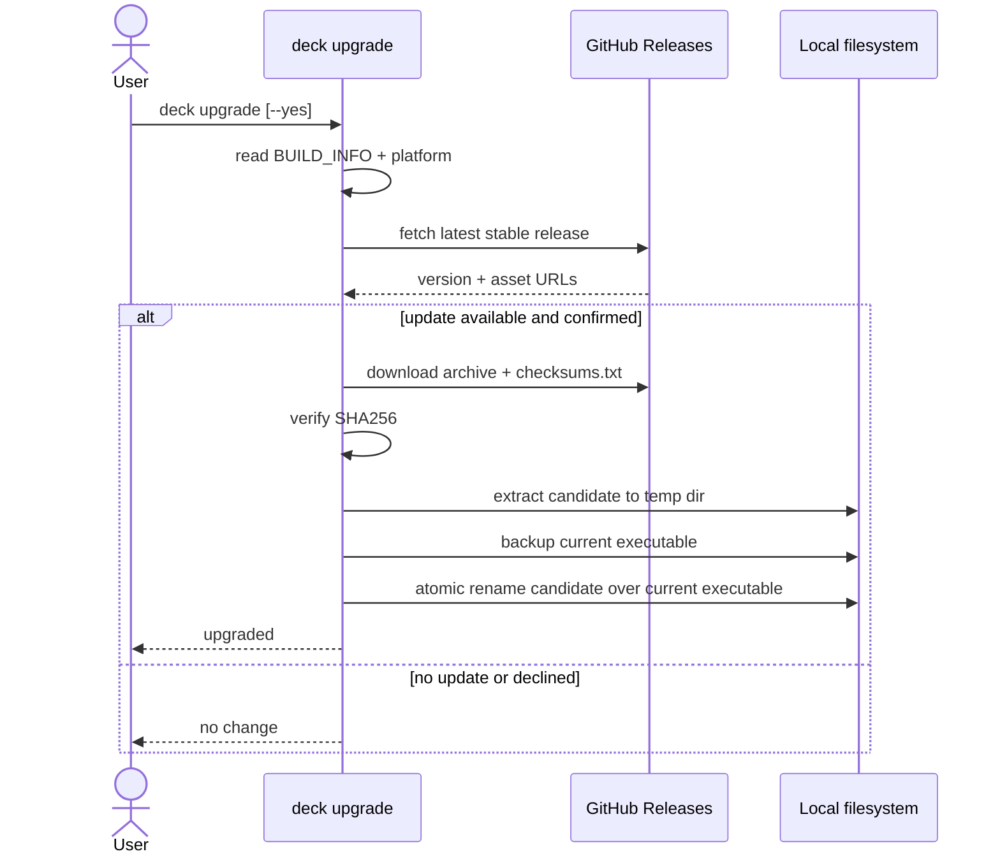
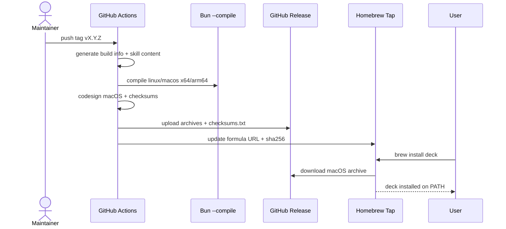
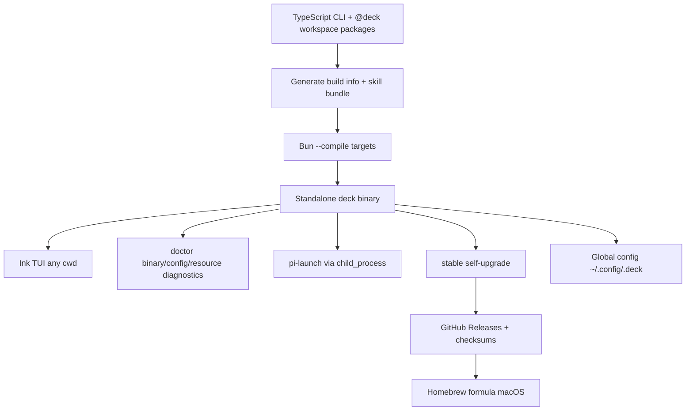

# Design: Binary Compilation

## Source

- Proposal: `binary-compilation` proposal artifact
- Spec status: available (`openspec/changes/binary-compilation/spec.md`)
- Exploration: `openspec/changes/binary-compatibility-audit/exploration.md`
- Capabilities affected: `standalone-binary-distribution`, `binary-self-upgrade`, `bundled-skill-runtime`, `binary-version-metadata`, `cli-process-launch`, `runtime-config-resolution`, `doctor`, `pi-launch`
- Adaptive context: loaded from project memory; OpenSpec artifacts remain authoritative

## Current Architecture Context

| Area | Current state | Binary issue |
|---|---|---|
| CLI entrypoint | `apps/cli/src/main.tsx` parses args, runs `doctor`, runs `pi-launch`, or renders Ink TUI. | `pi-launch` directly calls `Bun.spawn()` and `resolveProjectRoot()` defaults to `process.cwd()`. |
| Project root | `apps/cli/src/project-root.ts` walks upward from cwd looking for Deck monorepo markers (`package.json` workspaces, `definition.md` + `apps/` + `packages/`). | Installed Deck is global; core TUI/config flows must not require a Deck checkout or project cwd. |
| Config | `packages/core/src/config/deck-config.ts` uses `getDeckConfigPath(projectRoot)` with `.deck/config.json` below a supplied root. | Resolved decision requires global config at `~/.config/.deck/` (fallback `~/.deck/`). |
| Skills | Bootstrap skills are embedded string modules in `packages/core/src/skills/bootstrap/*`; external standalone skills in `packages/core/src/skills/external/index.ts` use `readFileSync(join(__dirname, sourcePath))`. | Runtime filesystem reads of source-adjacent `SKILL.md` files are fragile after `bun --compile`. |
| Workspace deps | `apps/cli/package.json` depends on `@deck/*` packages via `workspace:*`. | Acceptable at build time only; compiled artifact must inline workspace packages. |
| Runner install/preflight | `packages/adapter-opencode` and `packages/adapter-pi` contain Bun process helpers (`Bun.spawn`, `Bun.spawnSync`). | Proposal names `main.tsx` blocker, but binary-safe process abstraction should cover all runtime process launches. |
| Doctor | `apps/cli/src/doctor-command/*` reports runtime/tool diagnostics. | Needs binary metadata, resource availability, config path, and platform checks. |
| Distribution | No release binary pipeline, Homebrew formula, checksums, or `deck upgrade`. | Needed for Linux/macOS standalone distribution. |

## Proposed Architecture

Compile the existing TypeScript/Ink CLI with Bun `--compile`, but insert small runtime boundaries so the executable does not depend on Bun-only process APIs, monorepo-relative skill files, or development cwd.

### Architecture Overview

```text
deck executable
├─ CLI entrypoint (`apps/cli/src/main.tsx`)
│  ├─ TUI (`apps/cli/src/tui/*`) — unchanged behavior
│  ├─ doctor (`apps/cli/src/doctor-command/*`) — extended diagnostics
│  ├─ pi-launch — uses binary-safe process runner
│  └─ upgrade — release download/checksum/atomic replace
├─ runtime layer (`apps/cli/src/runtime/*`)
│  ├─ process runner: Node `child_process.spawn/spawnSync`
│  ├─ path/config resolver: global Deck config + optional target cwd
│  ├─ build info: generated version/commit/date/target
│  └─ bundled resource registry validation
├─ bundled packages (`@deck/*`) inlined by `bun build --compile`
└─ bundled skills/resources from canonical TypeScript/generated modules
```

### Component / Module Boundaries

| Component | Responsibility | Change Type |
|---|---|---|
| `apps/cli/src/main.tsx` | CLI command routing and TUI composition | modified |
| `apps/cli/src/runtime/process.ts` | Binary-compatible async/sync process execution wrappers over `node:child_process` | new |
| `apps/cli/src/runtime/paths.ts` | Global Deck config path and optional target cwd/project context resolution | new |
| `apps/cli/src/runtime/build-info.ts` + generated module | Runtime access to version, commit, build date, and target platform | new |
| `apps/cli/src/upgrade-command/*` | Stable-channel self-upgrade flow | new |
| `apps/cli/src/doctor-command/*` | Runtime diagnostics rendering and checks | modified |
| `apps/cli/src/project-root.ts` | Optional target project resolver only; no longer core Deck config root | modified |
| `packages/core/src/config/deck-config.ts` | Support global config path resolution while preserving testable config APIs | modified |
| `packages/core/src/skills/bootstrap/*` | Already embedded bootstrap skills | unchanged/validated |
| `packages/core/src/skills/external/*` | Replace source-relative `readFileSync` with generated/embedded skill content | modified |
| `packages/adapter-opencode/src/*` process helpers | Use injected/shared Node-compatible command runner | modified |
| `packages/adapter-pi/src/*` process helpers | Use injected/shared Node-compatible command runner | modified |
| `scripts/build-binaries.ts` | Multi-target compile, metadata generation, checksum generation, macOS ad-hoc signing | new |
| `.github/workflows/release.yml` | Release matrix and artifact upload | new/modified |
| `Formula/deck.rb` or tap formula template | Homebrew install metadata | new |

## Runtime Abstractions

### Process launch

- Replace direct `Bun.spawn()` / `Bun.spawnSync()` in runtime code with a Node-compatible command runner.
- Async shape should preserve current call sites: `{ exitCode, stdout, stderr }` for install commands, inherited stdio for `pi-launch`.
- `pi-launch` should use `spawn(plan.command, plan.args, { cwd: plan.cwd, env: plan.env, stdio: "inherit" })`, then exit with child exit code/signal-derived failure.
- Keep runner adapters testable by dependency injection; default implementation uses `node:child_process`.

### Path and config resolution

- Introduce a global Deck config resolver:
  - primary: `$XDG_CONFIG_HOME/.deck/config.json` when `XDG_CONFIG_HOME` is set;
  - default: `~/.config/.deck/config.json`;
  - fallback/migration read: `~/.deck/config.json` if primary is absent;
  - writes should target the primary location unless an existing fallback config is explicitly being migrated.
- `resolveProjectRoot()` remains only for flows that explicitly need target project context; TUI, doctor, install/configure, and upgrade must work from any cwd.
- `deck pi-launch` may pass cwd as target context to Pi, but Deck config resolution must not use cwd as the Deck config root.

### Bundled assets

- Treat bundled skills as compile-time TypeScript data, not runtime files.
- Bootstrap skills already use embedded content (`deck-init-content.ts`, `deck-onboard-content.ts`).
- External standalone skills must be generated into a TypeScript content map before compile, replacing `readFileSync(join(__dirname, ...))` at runtime.
- `doctor` should validate expected skill IDs are present in the in-memory registry.

## Build Pipeline

### Build targets and commands

Use `apps/cli/src/main.tsx` as the single executable entrypoint. A build script should set metadata, compile each target, sign macOS binaries, and emit checksums.

```bash
# Linux x64
bun build --compile \
  --target=bun-linux-x64 \
  --outfile=dist/deck-linux-x64 \
  apps/cli/src/main.tsx

# Linux arm64
bun build --compile \
  --target=bun-linux-arm64 \
  --outfile=dist/deck-linux-arm64 \
  apps/cli/src/main.tsx

# macOS x64
bun build --compile \
  --target=bun-darwin-x64 \
  --outfile=dist/deck-macos-x64 \
  apps/cli/src/main.tsx
codesign -s - dist/deck-macos-x64

# macOS arm64
bun build --compile \
  --target=bun-darwin-arm64 \
  --outfile=dist/deck-macos-arm64 \
  apps/cli/src/main.tsx
codesign -s - dist/deck-macos-arm64
```

Notes:
- Use Bun target names supported by the project Bun version. If `bun-macos-*` aliases are unsupported, use `bun-darwin-*` as above.
- Package release artifacts as compressed archives using the Spec pattern: `deck_v{VERSION}_{OS}_{ARCH}.tar.gz`.
- Emit `checksums.txt` with SHA256 entries for every archive.
- Build from a clean workspace after generated skill/build-info modules are updated.

### Version Injection

- Add a generated module, e.g. `apps/cli/src/runtime/build-info.generated.ts`, before compilation:
  ```ts
  export const BUILD_INFO = {
    version: "<semver>",
    commit: "<git-sha>",
    date: "<iso-8601>",
    target: "<linux-x64|linux-arm64|macos-x64|macos-arm64>",
    channel: "stable",
  } as const;
  ```
- `apps/cli/src/runtime/build-info.ts` should expose a stable `getBuildInfo()` API with safe dev defaults (`0.0.0-dev`, `unknown`, current platform).
- `deck --version`, `deck doctor`, and `deck upgrade` should consume this API.
- Rejected: relying only on `package.json` version at runtime; compiled binaries should not need manifest file reads.

## Skills Bundling

| Skill source | Current state | Build-time strategy | Runtime strategy |
|---|---|---|---|
| Bootstrap skills | `packages/core/src/skills/bootstrap/*-content.ts` strings | Include through normal TS imports | In-memory registry |
| Developer team agent skills/prompts | Canonical TS prompt/content modules under `packages/core/src/teams/developer/*` | Inlined by Bun compile | Existing install plan APIs |
| External standalone skills | `packages/core/src/skills/external/index.ts` reads `SKILL.md` from filesystem | Generate `external-content.generated.ts` from canonical `SKILL.md` files | In-memory lookup by `skillId` |

Build validation should fail if any declared skill ID has empty/missing content. Runtime `doctor` should report bundled skill count and missing IDs.

## Data Flow

### Normal TUI launch

1. User runs `deck` from any directory.
2. CLI parses args.
3. Runtime path resolver computes global Deck config path.
4. TUI renders with existing Ink screens.
5. Install/config screens materialize bundled skill content into runner config directories.

### `deck pi-launch`

1. CLI parses `pi-launch` args.
2. Optional target context is cwd or explicit future flag; Deck global config remains independent.
3. `runPiLaunch()` returns launch plan.
4. Runtime process runner spawns Pi with inherited stdio.
5. Deck exits with Pi child status.

### `deck upgrade`

1. Read local `BUILD_INFO.version` and platform target.
2. Query stable GitHub latest release metadata.
3. If newer, prompt user unless `--yes` is present.
4. Download matching archive and `checksums.txt` to temp dir.
5. Verify SHA256.
6. Extract binary, backup current executable, atomically replace.
7. On failure after backup, restore backup and report manual fallback.

## Sequence Diagrams

### Upgrade flow



### Install/distribution flow



## API / Contract Implications

| Endpoint / Interface | Change | Backward Compatible |
|---|---|---|
| CLI `deck` | Runs from any cwd using global Deck config | yes |
| CLI `deck doctor` | Adds binary/build/resource/config diagnostics | yes |
| CLI `deck pi-launch` | Uses Node-compatible process runner; config independent from cwd | yes |
| CLI `deck upgrade [--yes]` | New stable-channel self-upgrade command | yes |
| CLI `deck --version` | Exposes injected semver/build metadata | yes |
| `getStandaloneSkillBody(skillId)` | Returns embedded/generated content instead of source file reads | yes |
| Deck config APIs | Add global config path/read/write helpers; preserve existing project-root APIs where tests need them | partial |

## State / Persistence Implications

- New global config location: `~/.config/.deck/config.json` or `$XDG_CONFIG_HOME/.deck/config.json`.
- Fallback read path: `~/.deck/config.json`.
- No database/schema migration.
- Optional config migration can copy fallback config to primary path after explicit user confirmation; not required for first binary release if fallback read is supported.
- Upgrade creates temporary files and short-lived backups near the installed executable or in a temp dir; backups should be removed after success or retained with clear warning after rollback.

## Migration / Backward Compatibility

- Development workflow remains `bun run` compatible; generated files should have dev defaults or be generated by a prebuild script.
- Existing `.deck/config.json` project-local configs should not be treated as global Deck config unless an explicit migration path is later added.
- Existing runner config directories (`~/.config/opencode`, Pi config locations) remain unchanged.
- Release pipeline is additive; if binary release fails, stop publishing artifacts without changing SDD behavior.

## Distribution

### GitHub Releases

Release layout:

```text
vX.Y.Z/
  deck_vX.Y.Z_linux_x64.tar.gz
  deck_vX.Y.Z_linux_arm64.tar.gz
  deck_vX.Y.Z_macos_x64.tar.gz
  deck_vX.Y.Z_macos_arm64.tar.gz
  checksums.txt
```

Archive contents:

```text
deck
LICENSE
README.md or INSTALL.md
```

### Homebrew formula structure

```ruby
class Deck < Formula
  desc "Standalone Deck CLI for AI runner setup and SDD workflows"
  homepage "https://github.com/<owner>/deck"
  version "X.Y.Z"

  on_macos do
    if Hardware::CPU.arm?
      url "https://github.com/<owner>/deck/releases/download/vX.Y.Z/deck_vX.Y.Z_macos_arm64.tar.gz"
      sha256 "<arm64-sha>"
    else
      url "https://github.com/<owner>/deck/releases/download/vX.Y.Z/deck_vX.Y.Z_macos_x64.tar.gz"
      sha256 "<x64-sha>"
    end
  end

  def install
    bin.install "deck"
  end

  test do
    assert_match version.to_s, shell_output("#{bin}/deck --version")
  end
end
```

Linux install path should use GitHub Releases direct download plus checksum verification, either via documented commands or an install script that mirrors the same checksum policy.

## File Impact Analysis

| File / Path | Action | Current state summary | Required changes | Risk | Effort |
|---|---|---|---|---|---|
| `apps/cli/src/main.tsx` | modify | Routes `doctor`, `pi-launch`, TUI; uses `Bun.spawn()` for Pi. | Import runtime process runner; add `upgrade`/`--version` routing; stop using Deck project root for global flows. | Medium | M |
| `apps/cli/src/cli-args.ts` | modify | Parses current command set. | Add `upgrade`, `--yes`, and `--version` parse support. | Low | S |
| `apps/cli/src/runtime/process.ts` | create | No shared binary-safe runner. | Provide async inherited stdio spawn, captured spawn, sync command helpers using `node:child_process`. | Medium | M |
| `apps/cli/src/runtime/paths.ts` | create | Global config path not centralized. | Resolve `$XDG_CONFIG_HOME/.deck`, `~/.config/.deck`, fallback `~/.deck`, cwd target context. | Medium | M |
| `apps/cli/src/runtime/build-info.ts` | create | No runtime build metadata API. | Expose `getBuildInfo()` over generated metadata with dev fallback. | Low | S |
| `apps/cli/src/runtime/build-info.generated.ts` | create/generated | Not present. | Generated by build script; ignored or overwritten deterministically. | Low | S |
| `apps/cli/src/upgrade-command/index.ts` | create | No upgrade command. | Implement stable release check/download/verify/replace orchestration. | High | L |
| `apps/cli/src/upgrade-command/github-release.ts` | create | No release client. | Fetch latest stable release and resolve target asset/checksum URL. | Medium | M |
| `apps/cli/src/upgrade-command/install.ts` | create | No atomic replacement helper. | Temp download, checksum, extract, backup, atomic rename, rollback. | High | L |
| `apps/cli/src/doctor-command/doctor-diagnostics.ts` | modify | Checks runner/runtime readiness. | Add build info, platform target, executable path, global config path, bundled skill availability. | Medium | M |
| `apps/cli/src/doctor-command/doctor-report.ts` | modify | Renders current diagnostics. | Render new binary/config/resource fields. | Low | S |
| `apps/cli/src/project-root.ts` | modify | Detects Deck monorepo root from cwd. | Re-scope to optional target project discovery; do not drive Deck global config. | Medium | M |
| `apps/cli/src/tui/app.tsx` | modify | Calls `resolveProjectRoot()` for TUI/install context. | Use global Deck config resolver; keep cwd only as optional target context. | Medium | M |
| `apps/cli/package.json` | modify | Only `deck` script; workspace deps. | Add build scripts (`build:binary`, target helpers), keep workspace deps for build-time bundling. | Low | S |
| `packages/core/src/config/deck-config.ts` | modify | Reads/writes `.deck/config.json` below supplied project root. | Add global path helpers and read/write APIs; preserve validation and old helper where needed. | Medium | M |
| `packages/core/src/skills/external/index.ts` | modify | Reads `SKILL.md` with `readFileSync` + `import.meta.url`. | Replace runtime file reads with generated/inlined skill content map. | High | M |
| `packages/core/src/skills/external/content.generated.ts` | create/generated | Not present. | Generated from canonical external skill files before compile. | Medium | S |
| `packages/core/src/skills/bootstrap/index.ts` | unchanged/validate | Already returns embedded bootstrap skill content. | Add build/doctor validation only if needed. | Low | XS |
| `packages/adapter-opencode/src/install-tools.ts` | modify | Uses `Bun.spawn()` for install commands. | Use injected/default command runner compatible with binary. | Medium | S |
| `packages/adapter-opencode/src/preflight.ts` | modify | Uses `Bun.spawnSync()`. | Use sync command runner abstraction. | Medium | S |
| `packages/adapter-pi/src/install-tools.ts` | modify | Uses `Bun.spawn()` for installs. | Use injected/default command runner compatible with binary. | Medium | S |
| `packages/adapter-pi/src/preflight.ts` | modify | Uses `Bun.spawnSync()`. | Use sync command runner abstraction. | Medium | S |
| `packages/adapter-pi/src/required-tools.ts` | modify | Uses `Bun.spawnSync()`. | Use sync command runner abstraction. | Medium | S |
| `scripts/generate-build-info.ts` | create | Not present. | Emit target-specific generated build info. | Low | S |
| `scripts/generate-skill-bundle.ts` | create | Not present. | Generate external skill content TS map and fail on missing skills. | Medium | M |
| `scripts/build-binaries.ts` | create | Not present. | Run generation, target builds, macOS ad-hoc signing, archive/checksum output. | High | L |
| `.github/workflows/release.yml` | create/modify | No binary release workflow identified. | Matrix build/upload release artifacts and checksums; update Homebrew tap/formula. | High | L |
| `Formula/deck.rb` or tap template | create | Not present. | Homebrew formula with arch-specific macOS artifacts. | Medium | M |
| `docs/install.md` / `README.md` | modify | Binary install docs not defined. | Document GitHub Releases, Homebrew, upgrade, troubleshooting. | Low | M |
| `apps/cli/src/__tests__/*`, adapter/core tests | modify/create | Existing tests cover TUI boundary and config/adapter behavior. | Add unit tests for process runner, global paths, bundled skills, build info, upgrade planning. | Medium | M |

## Testing Strategy

- Unit tests:
  - process runner exit/stdout/stderr behavior;
  - global config path precedence and fallback;
  - build info dev fallback;
  - bundled skill lookup completeness;
  - release asset name/checksum matching;
  - atomic replace rollback planning with mocked filesystem.
- Integration tests:
  - `bun build --compile` smoke for host platform;
  - run compiled binary `--version`, `doctor`, TUI non-interactive fallback, and `pi-launch` plan path with mocked runner.
- Release validation:
  - artifact naming and `checksums.txt` coverage;
  - macOS `codesign --verify` for ad-hoc signatures;
  - Homebrew formula `brew test` in macOS CI if available.

## Observability / Error Handling

- `doctor` reports build info, supported target, executable path, config path, bundled skill status, and actionable remediation.
- `upgrade` errors must distinguish: no update, declined, network failure, missing asset, checksum mismatch, permission failure, rollback success/failure, manual fallback required.
- Redact credentials in all diagnostics; preserve existing memory-token redaction behavior.

## Security / Performance / Accessibility Considerations

- Security:
  - Mandatory SHA256 verification before replacement.
  - Fail closed on missing/mismatched `checksums.txt`.
  - Ad-hoc macOS signing only; notarization remains deferred.
  - Never execute downloaded content before checksum verification.
- Performance:
  - Bundled skill maps increase binary size but remove runtime file IO and version skew.
  - `doctor` bundled-resource checks should be in-memory and cheap.
- Accessibility:
  - Preserve existing Ink TUI behavior; no UI redesign in this change.

## Tradeoffs

| Decision | Chosen | Rejected Alternative | Rationale |
|---|---|---|---|
| Build tool | Bun `--compile` | Go rewrite | Preserves TypeScript/Ink behavior and avoids full rewrite. |
| Process API | Node `child_process` wrapper | Keep direct `Bun.spawn()` | Works in Bun compiled output and reduces Bun API coupling. |
| Skill delivery | Embedded/generated TypeScript content | Runtime source file reads | Single executable, offline use, no monorepo dependency. |
| Config model | Global Deck config | Per-project `.deck` as primary | Deck is a global runner installer; TUI must work from any directory. |
| Version metadata | Generated TS module | Runtime package manifest reads | Compiled binary should not depend on `package.json` on disk. |
| Upgrade integrity | Checksums + backup + atomic replace | Download and overwrite directly | Matches gentle-ai safety pattern and reduces corruption risk. |
| macOS trust | Ad-hoc signing | Notarization now | Meets current decision with lower release complexity; notarization can be future work. |
| Version channel | Stable only | Beta/nightly channels | Simpler UX and release policy for binary users. |

## Risks

| Risk | Likelihood | Impact | Mitigation |
|---|---|---|---|
| Bun target names/compile behavior differ by Bun version | Medium | High | Pin Bun version in CI and validate all target commands. |
| Runtime dynamic imports fail in compiled binary | Medium | High | Compile smoke tests for `doctor`, TUI fallback, `pi-launch`; avoid file-relative resources. |
| External skill content generation drifts | Medium | Medium | Generate from canonical files and fail build if declared skill missing/empty. |
| Global config change breaks existing project-local config users | Medium | Medium | Preserve old APIs; document global behavior; optionally read fallback only. |
| Self-upgrade cannot replace executable due permissions/filesystem | Medium | High | Backup/rollback/manual fallback; clear error messages. |
| Cross-architecture artifacts untested locally | Medium | High | CI matrix and release artifact checksum validation. |
| Homebrew tap automation credentials/process unknown | Medium | Medium | Keep formula template in repo; publish tap update as explicit release step until automated. |

## Open Decisions

- GitHub release owner/repo and Homebrew tap owner/name need confirmation before workflow/formula finalization.
- Whether to migrate existing project-local `.deck/config.json` into global config or only document the new global config behavior.
- Whether Linux installation should include an install script or only documented direct archive download plus checksum verification.

## Dependencies

- Bun version supporting `--compile` and required Linux/macOS targets.
- GitHub Releases for artifacts.
- Homebrew tap repository or release process.
- Existing runner binaries/tools remain externally installed as today.
- gentle-ai update patterns for checksum, backup, atomic replace, and manual fallback.

## Next Steps

Ready for Task (`deck-developer-task`) to break this design into implementation tasks, combined with Spec.

## Mermaid Summary Source


