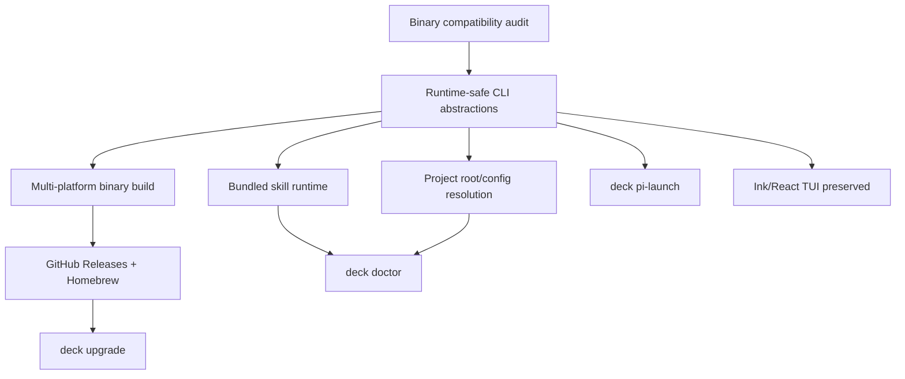

# Proposal: Binary Compilation

## Intent

Make Deck distributable and usable as a standalone CLI binary for Linux and macOS while preserving the current Ink/React TUI experience, doctor checks, Pi launch flow, and SDD skill behavior. This removes development-workspace assumptions identified by the binary compatibility audit and aligns Deck distribution with the gentle-ai release model: platform binaries, Homebrew for macOS, GitHub Releases for Linux, build-time version metadata, and a self-upgrade path.

Reference: `openspec/changes/binary-compatibility-audit/exploration.md`.

## Goal

Deck can be built, released, installed, upgraded, and run as standalone `deck` binaries for Linux x64/arm64 and macOS x64/arm64 without requiring a checked-out monorepo or Bun runtime at execution time.

## Scope

### In Scope
- Replace or isolate runtime blockers from the audit:
  - `apps/cli/src/main.tsx` `Bun.spawn()` process launch usage.
  - `apps/cli/package.json` `workspace:*` runtime dependency assumptions.
  - `process.cwd()`-based project-root assumptions in project root discovery.
- Define a binary packaging path that preserves the Ink/React TUI.
- Bundle Deck-owned skills with the binary so command behavior does not depend on monorepo-relative skill files.
- Support `deck doctor` and `deck pi-launch` from installed binaries.
- Add Linux x64/arm64 and macOS x64/arm64 release targets.
- Follow gentle-ai-style distribution patterns:
  - GitHub Releases binary downloads for Linux.
  - Homebrew tap/formula for macOS.
  - `deck upgrade` self-upgrade command.
  - Build-time version injection.
- Update documentation needed for install, upgrade, and troubleshooting flows.

### Out of Scope
- Rewriting Deck from TypeScript/Ink to Go.
- Changing SDD phases, agent behavior, or product semantics beyond binary compatibility needs.
- Windows binary support.
- Replacing the TUI framework.
- Changing external MCP/server capabilities except where runtime path detection requires compatibility fixes.
- Full implementation task breakdown; that belongs to Task phase.

## Affected Capabilities

> This section is the contract between Proposal and Spec/Design phases.

### New Capabilities
- `standalone-binary-distribution`: Build and publish platform-specific Deck binaries for Linux and macOS.
- `binary-self-upgrade`: Allow installed Deck binaries to upgrade themselves from release artifacts.
- `bundled-skill-runtime`: Resolve Deck-owned skills from bundled binary resources instead of monorepo paths.
- `binary-version-metadata`: Expose build-time version, commit, date, and platform metadata for diagnostics and upgrade decisions.

### Modified Capabilities
- `cli-process-launch`: Replace Bun-specific spawning with a binary-compatible process launch abstraction.
- `project-root-detection`: Detect target project roots independently from the binary installation directory and current development checkout.
- `runtime-config-resolution`: Resolve config paths consistently for installed binaries, including existing `~/.config/opencode/`-style runner config paths where applicable.
- `doctor`: Validate binary installation, bundled resources, version metadata, PATH/runtime assumptions, and supported platform details.
- `pi-launch`: Continue launching Pi behavior from installed binaries without relying on workspace-local packages or files.

### Unchanged Capabilities
- `tui`: Ink/React TUI behavior should remain functionally unchanged.
- `sdd-workflow`: Explore/propose/spec/design/task/apply/verify/archive semantics remain unchanged.
- `runner-adapters`: Runner-facing behavior remains unchanged except for path/resource resolution needed by binary execution.
- `adaptive-memory`: Memory provider semantics remain unchanged; only runtime resolution may be touched if binary paths affect configuration.

## Approach

1. Establish a binary build strategy for the existing TypeScript/Ink CLI that supports Linux x64/arm64 and macOS x64/arm64, preserving TUI rendering.
2. Introduce runtime-safe abstractions for process spawning, path resolution, bundled asset loading, and version metadata.
3. Remove development-only assumptions from CLI runtime startup:
   - Replace direct `Bun.spawn()` use in `apps/cli/src/main.tsx`.
   - Eliminate `workspace:*` resolution as a runtime dependency of the compiled artifact.
   - Separate target project root detection from binary install location and process current directory assumptions.
4. Bundle Deck-owned skills/resources into the release artifact and provide a stable lookup API for installed binaries.
5. Harden `deck doctor` to report binary/runtime state, bundled resource availability, version metadata, and config path decisions.
6. Preserve and verify `deck pi-launch` under binary execution.
7. Add release automation following gentle-ai patterns: version injection, multi-platform artifacts, checksums, Linux release downloads, macOS Homebrew tap/formula, and `deck upgrade`.
8. Document install, upgrade, and troubleshooting flows.

## Alternatives and Tradeoffs

| Alternative | Why Considered | Why Not Chosen |
|---|---|---|
| Keep Bun-only execution | Lowest change cost; current CLI already runs this way | Does not satisfy standalone binary requirement and leaves `Bun.spawn()`/runtime dependency blockers unresolved |
| Rewrite CLI in Go like gentle-ai | Proven distribution model and simple static binaries | Too large a rewrite; risks TUI/Ink parity and delays binary support |
| Ship Node/Bun plus JS bundle | Easier than full native binary packaging | More complex install footprint; violates goal of standalone binary without runtime dependency |
| External skills package installed separately | Reduces binary size and bundle complexity | Violates requirement that skills be bundled with the binary; adds version skew risk |
| Chosen: compile/package existing CLI with binary-safe runtime abstractions and bundled assets | Preserves product behavior while addressing audit blockers | Requires careful packaging validation for dynamic imports, TUI behavior, and resource lookup |

## Risks

| Risk | Likelihood | Mitigation |
|---|---|---|
| Ink/React TUI behaves differently in packaged binary terminals | Medium | Add smoke tests/manual verification across target OS/architectures and preserve current terminal IO behavior |
| Dynamic imports or workspace packages fail after compilation | High | Replace runtime workspace assumptions with explicit bundled/internal package resolution and binary packaging tests |
| Bundled skills drift from source skills | Medium | Generate/bundle skills from canonical source during build and add doctor/build validation |
| Project root detection changes break existing development usage | Medium | Keep dev-mode behavior covered and separate binary install path from target project path detection |
| Config path changes break existing runner setups | Medium | Preserve existing config conventions where intentional; have `doctor` explain resolved paths |
| Self-upgrade corrupts or replaces the wrong executable | Medium | Use checksums, atomic replacement, backup/rollback behavior, and explicit platform detection |
| Release automation produces incorrect architecture artifacts | Medium | Include platform matrix validation and artifact naming/checksum verification |
| Missing audit artifact reduces traceability | Low | Preserve reference to audit registry and restore `exploration.md` if traceability is required before approval |

## Rollback Plan

- Keep source-level changes isolated behind new binary/runtime abstractions where possible.
- If binary release fails, stop publishing binary artifacts/Homebrew updates while preserving existing development execution path.
- Revert release workflow, `deck upgrade`, and packaging-specific changes independently from core CLI logic if needed.
- If a runtime abstraction regresses current CLI behavior, switch the CLI entrypoint back to the previous implementation while retaining the OpenSpec record for follow-up.
- For failed upgrades, restore the previous executable from backup or reinstall the prior release artifact manually.

## Dependencies

- Existing Deck CLI, TUI, doctor, and Pi launch code paths.
- Binary packager/build strategy selected by Design phase.
- GitHub Releases for hosted artifacts.
- Homebrew tap/formula process for macOS distribution.
- Checksums/signing policy decision for release integrity.
- gentle-ai release/distribution patterns as implementation reference.
- Existing OpenSpec audit registry at `openspec/changes/binary-compatibility-audit/`.

## Open Questions (Resolved)

All six open questions have been resolved through team discussion:

| # | Question | Decision | Rationale |
|---|----------|----------|-----------|
| 1 | Build tool | **Bun `--compile`** | Native to stack, fastest startup, direct Bun runtime compatibility |
| 2 | Skills strategy | **Embebido en binary** | Offline-first, single artifact, no version skew between binary and skills |
| 3 | macOS signing | **Ad-hoc signing** (`codesign -s -`) | Eliminates "unidentified developer" warning without notarization overhead; notarization deferred |
| 4 | Version channel | **Solo stable** | Binary users prioritize stability; beta users can use git-based dev installs |
| 5 | Upgrade UX | **Interactive** | User awareness and control; silent with `--yes` flag for CI/automation |
| 6 | Project root / global behavior | **Global config at `~/.config/.deck/`** | Deck is a global runner installer, NOT a per-project tool. Config lives globally, TUI works from any directory (home, /tmp, project dirs). No "project detection" needed — deck IS the global configuration layer. |

### Open Question 6 — Detailed Resolution

**Context**: Deck's purpose is to install and configure the AI runner environment (Pi, OpenCode, etc.) on the machine. It is NOT a per-project utility that requires being run from within a project directory.

**Behavior**:
- `deck` works from **any directory**: `$HOME`, `/tmp`, `~/code/my-project/src/`, etc.
- Global configuration lives at `~/.config/.deck/` (or `~/.deck/` if not XDG-compliant)
- The TUI always shows the full menu regardless of cwd
- Runner detection and config resolution are **global**, not per-project
- Features that need runner context (e.g., SDD with project context) resolve the runner from PATH and config, not from cwd

**Project root detection** (where it exists) applies only to:
- Detecting the runner's project structure when explicitly needed (e.g., scanning for existing config)
- NOT required for deck's core install/configure flows

**Rationale**: Making deck work only from project directories would break the global installer model. A user should be able to run `deck` from anywhere to configure their runner, check doctor status, or trigger upgrades.

## Acceptance Direction

- [ ] Release build produces `deck` binaries for Linux x64, Linux arm64, macOS x64, and macOS arm64.
- [ ] Installed binaries run without a checked-out Deck monorepo and without requiring Bun at runtime.
- [ ] TUI launches and remains usable from installed binaries on supported platforms.
- [ ] `deck doctor` reports binary version metadata, platform, resource availability, config paths, and relevant runtime diagnostics.
- [ ] `deck pi-launch` works from installed binaries without workspace-local package resolution.
- [ ] Deck-owned skills are available from the installed binary distribution and do not require separate skill installation from the repo.
- [ ] Project root detection works when `deck` is invoked from a target project directory, a nested subdirectory, and outside a project.
- [ ] `deck upgrade` can detect, download, verify, and install a newer release artifact, with rollback behavior documented.
- [ ] macOS install path is available through Homebrew; Linux install path is available through GitHub Releases.
- [ ] Existing development workflow remains usable after binary compatibility changes.

## Next Steps

Ready for Spec (`deck-developer-spec`) and Design (`deck-developer-design`) in parallel.

## Mermaid Summary Source

