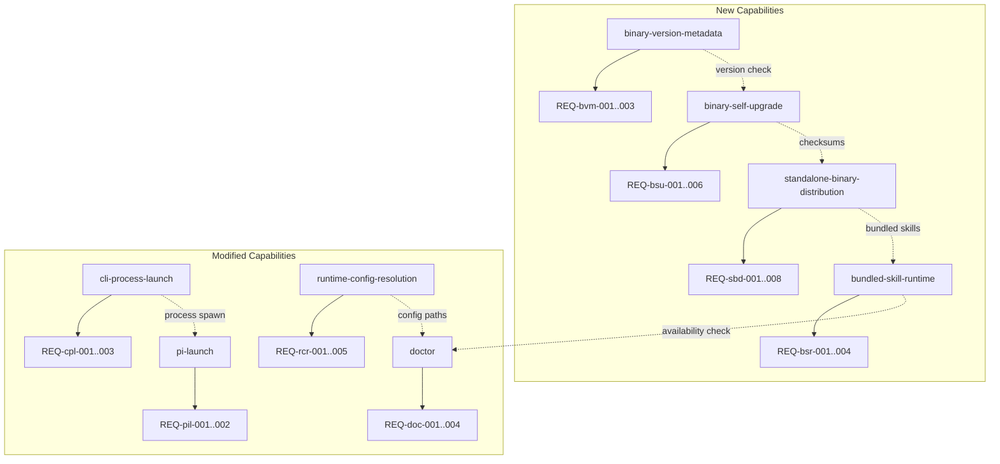

# Spec: Binary Compilation

## Source

- Proposal: binary-compilation proposal artifact
- Exploration: binary-compatibility-audit exploration artifact
- Capabilities affected:
  - New: standalone-binary-distribution, binary-self-upgrade, bundled-skill-runtime, binary-version-metadata
  - Modified: cli-process-launch, runtime-config-resolution, doctor, pi-launch

## Requirements

### Capability: standalone-binary-distribution

REQ-sbd-001: The build process SHALL produce standalone `deck` binaries for Linux x64, Linux arm64, macOS x64, and macOS arm64 that execute without requiring a Bun runtime or checked-out Deck monorepo.
  Priority: MUST
  Surface: General
  Rationale: Core goal — standalone distribution removes development-workspace dependency.

REQ-sbd-002: Each release artifact SHALL be named with the pattern `deck_v{VERSION}_{OS}_{ARCH}.tar.gz` and accompanied by a `checksums.txt` file containing SHA-256 hashes for every artifact.
  Priority: MUST
  Surface: General
  Rationale: Identifiable artifacts with integrity verification enable reliable distribution and upgrade.

REQ-sbd-003: macOS binaries SHALL be ad-hoc signed using `codesign -s -` to eliminate "unidentified developer" Gatekeeper warnings without requiring notarization.
  Priority: MUST
  Surface: Security
  Rationale: Resolved team decision — ad-hoc signing removes the most common friction for macOS users.

REQ-sbd-004: Linux binaries SHALL be published as downloadable artifacts on GitHub Releases.
  Priority: MUST
  Surface: Integration
  Rationale: Linux distribution channel per gentle-ai patterns.

REQ-sbd-005: macOS binaries SHALL be installable via a Homebrew tap formula.
  Priority: MUST
  Surface: Integration
  Rationale: Standard macOS package manager experience per gentle-ai patterns.

REQ-sbd-006: The Ink/React TUI SHALL render identically in compiled binary mode compared to development `bun run` execution.
  Priority: MUST
  Surface: UI
  Rationale: TUI parity is non-negotiable — the binary must not degrade user experience.

REQ-sbd-007: The existing development workflow (`bun run` from monorepo) SHALL remain fully functional after binary compatibility changes.
  Priority: MUST
  Surface: General
  Rationale: Binary changes must not regress developer experience.

REQ-sbd-008: The build process SHOULD produce deterministic artifacts per OS/arch target — identical source and build environment yields identical checksum.
  Priority: SHOULD
  Surface: General
  Rationale: Reproducible builds enable supply-chain verification.

### Capability: binary-self-upgrade

REQ-bsu-001: `deck upgrade` SHALL detect the latest stable release from GitHub Releases, compare it against the current binary version, and inform the user whether an upgrade is available.
  Priority: MUST
  Surface: CLI
  Rationale: Self-upgrade is a core distribution requirement; stable channel only per team decision.

REQ-bsu-002: When an upgrade is available and confirmed by the user, `deck upgrade` SHALL download the appropriate platform artifact, verify its checksum against `checksums.txt`, and atomically replace the running binary.
  Priority: MUST
  Surface: CLI
  Rationale: Integrity-verified, atomic replacement prevents corruption.

REQ-bsu-003: `deck upgrade` SHALL support a `--yes` flag that skips interactive confirmation, enabling CI/automation use.
  Priority: MUST
  Surface: CLI
  Rationale: Resolved team decision — interactive by default, silent for automation.

REQ-bsu-004: If upgrade replacement fails, the previous binary SHALL be restored from a pre-replacement backup.
  Priority: MUST
  Surface: General
  Rationale: Failed upgrades must not leave the user without a working binary.

REQ-bsu-005: `deck upgrade` SHALL NOT downgrade the binary to an older version.
  Priority: MUST
  Surface: General
  Rationale: Prevents accidental regression.

REQ-bsu-006: `deck upgrade` SHOULD preserve executable permissions and file ownership after replacement.
  Priority: SHOULD
  Surface: General
  Rationale: Ensures binary remains executable across upgrade.

### Capability: bundled-skill-runtime

REQ-bsr-001: All Deck-owned skills SHALL be embedded in the compiled binary at build time and resolvable at runtime without access to the source monorepo.
  Priority: MUST
  Surface: General
  Rationale: Resolved team decision — embedded skills eliminate version skew and offline dependency.

REQ-bsr-002: The bundled skill set SHALL be generated from canonical source during the build process, not maintained as a separate manual artifact.
  Priority: MUST
  Surface: General
  Rationale: Prevents drift between source skills and bundled skills.

REQ-bsr-003: Skill lookup from the binary SHALL return the same content as reading the skill file from the monorepo during development.
  Priority: MUST
  Surface: General
  Rationale: Behavioral parity between binary and development modes.

REQ-bsr-004: If a skill lookup fails in binary mode, the system SHOULD produce a diagnostic error identifying the missing skill and suggesting a binary reinstallation.
  Priority: SHOULD
  Surface: CLI
  Rationale: Helpful error message for diagnosing bundled skill issues.

### Capability: binary-version-metadata

REQ-bvm-001: Every compiled binary SHALL embed build-time metadata: version string, git commit SHA, build date, and target platform (OS/arch).
  Priority: MUST
  Surface: CLI
  Rationale: Version metadata is required for upgrade decisions, diagnostics, and support.

REQ-bvm-002: `deck --version` SHALL display the version, commit, build date, and platform in a human-readable format.
  Priority: MUST
  Surface: CLI
  Rationale: Primary user-facing version query.

REQ-bvm-003: `deck doctor` SHALL display version metadata as part of its diagnostic output.
  Priority: MUST
  Surface: CLI
  Rationale: Doctor is the primary diagnostic surface.

### Capability: cli-process-launch

REQ-cpl-001: The CLI SHALL use `child_process.spawn` (or equivalent Node.js-compatible API) for all process creation instead of `Bun.spawn`.
  Priority: MUST
  Surface: API
  Rationale: `Bun.spawn` is a critical blocker identified in the audit; `child_process.spawn` works in compiled binary mode.

REQ-cpl-002: Process spawn behavior (stdin/stdout/stderr inheritance, environment, cwd) SHALL be functionally identical to the current `Bun.spawn` implementation.
  Priority: MUST
  Surface: API
  Rationale: Behavioral parity — no user-visible change in process launch semantics.

REQ-cpl-003: The process launch abstraction SHALL work identically in both development (`bun run`) and compiled binary modes.
  Priority: MUST
  Surface: API
  Rationale: Single code path for both execution modes.

### Capability: runtime-config-resolution

REQ-rcr-001: The binary SHALL resolve Deck global configuration from `~/.config/.deck/` (or `~/.deck/` when XDG is not available).
  Priority: MUST
  Surface: Data
  Rationale: Resolved team decision — Deck is a global tool, not per-project.

REQ-rcr-002: The binary SHALL operate correctly when invoked from any directory: `$HOME`, `/tmp`, arbitrary project directories, or nested subdirectories.
  Priority: MUST
  Surface: CLI
  Rationale: Global tool model — no cwd dependency.

REQ-rcr-003: The TUI SHALL display the full menu regardless of the current working directory.
  Priority: MUST
  Surface: UI
  Rationale: Consistent user experience independent of invocation context.

REQ-rcr-004: Existing runner config paths (e.g., `~/.config/opencode/`) SHALL remain supported and not be relocated or removed.
  Priority: MUST
  Surface: Data
  Rationale: Backward compatibility with existing runner installations.

REQ-rcr-005: When both Deck config (`~/.config/.deck/`) and runner config exist, `deck doctor` SHALL report both paths and their contents.
  Priority: SHOULD
  Surface: CLI
  Rationale: Diagnostic visibility into config path resolution.

### Capability: doctor

REQ-doc-001: `deck doctor` SHALL report: binary version metadata, target platform, bundled resource availability, resolved config paths, and relevant runtime diagnostics.
  Priority: MUST
  Surface: CLI
  Rationale: Doctor is the primary diagnostic tool for binary users.

REQ-doc-002: `deck doctor` SHALL verify that bundled skills are accessible and report any missing or corrupted resources.
  Priority: MUST
  Surface: CLI
  Rationale: Proactive detection of bundled skill issues.

REQ-doc-003: `deck doctor` SHALL report whether the current binary is the latest stable version and, if not, indicate that `deck upgrade` is available.
  Priority: SHOULD
  Surface: CLI
  Rationale: Doctor naturally surfaces upgrade availability as a diagnostic.

REQ-doc-004: `deck doctor` SHALL report the resolved global config directory and its existence/permissions.
  Priority: MUST
  Surface: CLI
  Rationale: Config path issues are a common binary installation problem.

### Capability: pi-launch

REQ-pil-001: `deck pi-launch` SHALL work from installed binaries without requiring workspace-local packages or monorepo-relative files.
  Priority: MUST
  Surface: CLI
  Rationale: Pi launch is a core Deck capability that must work in binary mode.

REQ-pil-002: Pi launch behavior SHALL be functionally identical between development mode and compiled binary mode.
  Priority: MUST
  Surface: CLI
  Rationale: Behavioral parity — no user-visible change.

## Acceptance Scenarios

### Capability: standalone-binary-distribution

#### Scenario: Build produces all platform binaries
**Given** the Deck source repository at a tagged version
**When** the binary build process is executed
**Then** four artifacts are produced: `deck_v{VERSION}_linux_x64.tar.gz`, `deck_v{VERSION}_linux_arm64.tar.gz`, `deck_v{VERSION}_macos_x64.tar.gz`, `deck_v{VERSION}_macos_arm64.tar.gz`, plus a `checksums.txt`
> Covers: REQ-sbd-001, REQ-sbd-002

#### Scenario: Binary runs without Bun or monorepo
**Given** a compiled `deck` binary copied to a clean machine without Bun or the Deck repository
**When** the user runs `deck` from any directory
**Then** the Ink/React TUI launches and is fully interactive
> Covers: REQ-sbd-001, REQ-sbd-006

#### Scenario: macOS binary passes Gatekeeper
**Given** a macOS binary that has been ad-hoc signed
**When** the user opens the binary for the first time
**Then** no "unidentified developer" warning is displayed and the binary executes normally
> Covers: REQ-sbd-003

#### Scenario: Linux binary downloadable from GitHub Releases
**Given** a released version of Deck
**When** a user navigates to the GitHub Releases page
**Then** Linux x64 and arm64 artifacts are available for download with corresponding checksums
> Covers: REQ-sbd-004

#### Scenario: macOS binary installable via Homebrew
**Given** the Deck Homebrew tap is configured
**When** the user runs `brew install gentleman-programming/tap/deck`
**Then** the `deck` binary is installed and available in PATH
> Covers: REQ-sbd-005

#### Scenario: Development workflow unchanged
**Given** the Deck monorepo with source-level binary compatibility changes applied
**When** a developer runs `bun run` from the monorepo
**Then** the CLI launches and behaves identically to the pre-change baseline
> Covers: REQ-sbd-007

#### Scenario: Artifact naming and checksum integrity
**Given** a release build output directory
**When** examining the produced artifacts
**Then** each tarball is named `deck_v{VERSION}_{OS}_{ARCH}.tar.gz` and `checksums.txt` contains a SHA-256 hash for each tarball that matches the file content
> Covers: REQ-sbd-002

### Capability: binary-self-upgrade

#### Scenario: Upgrade detects newer version
**Given** a running `deck` binary at version 1.0.0 and a newer version 1.1.0 published on GitHub Releases
**When** the user runs `deck upgrade`
**Then** the command reports that version 1.1.0 is available and prompts for confirmation
> Covers: REQ-bsu-001

#### Scenario: Upgrade with user confirmation
**Given** an upgrade to version 1.1.0 has been detected and confirmed
**When** the download and replacement completes
**Then** the running binary is replaced with version 1.1.0, verified by checksum, and `deck --version` reports 1.1.0
> Covers: REQ-bsu-002

#### Scenario: Upgrade with --yes skips confirmation
**Given** a newer version is available
**When** the user runs `deck upgrade --yes`
**Then** the upgrade proceeds without interactive confirmation
> Covers: REQ-bsu-003

#### Scenario: Upgrade rollback on failure
**Given** an upgrade download that fails checksum verification
**When** the upgrade process detects the mismatch
**Then** the previous binary is restored from backup and `deck --version` reports the original version
> Covers: REQ-bsu-004

#### Scenario: Upgrade refuses downgrade
**Given** a running `deck` binary at version 1.1.0
**When** the user runs `deck upgrade` and the latest release is 1.0.0
**Then** the command reports that the current version is already up to date and does not download or replace
> Covers: REQ-bsu-005

#### Scenario: Already on latest version
**Given** a running `deck` binary at the latest stable version
**When** the user runs `deck upgrade`
**Then** the command reports "already up to date" and exits without downloading
> Covers: REQ-bsu-001

### Capability: bundled-skill-runtime

#### Scenario: Skills available from binary
**Given** a compiled `deck` binary on a machine without the Deck repository
**When** the Deck runtime resolves any Deck-owned skill
**Then** the skill content is returned and is identical to the source skill file
> Covers: REQ-bsr-001, REQ-bsr-003

#### Scenario: Skills generated at build time
**Given** the build process is about to compile the binary
**When** the skill bundling step runs
**Then** skills are read from canonical source files in the monorepo and embedded into the build output
> Covers: REQ-bsr-002

#### Scenario: Missing skill diagnostic
**Given** a compiled binary where a skill lookup fails
**When** the runtime attempts to resolve the missing skill
**Then** an error message identifies the missing skill and suggests reinstalling the binary
> Covers: REQ-bsr-004

### Capability: binary-version-metadata

#### Scenario: Version display
**Given** a compiled `deck` binary at version 1.0.0, commit abc1234, built on 2026-05-25
**When** the user runs `deck --version`
**Then** output includes version 1.0.0, commit abc1234, build date 2026-05-25, and the target platform
> Covers: REQ-bvm-001, REQ-bvm-002

#### Scenario: Version in doctor output
**Given** a compiled `deck` binary
**When** the user runs `deck doctor`
**Then** the diagnostic output includes version, commit, build date, and platform
> Covers: REQ-bvm-003

### Capability: cli-process-launch

#### Scenario: Process spawn in binary mode
**Given** a compiled `deck` binary
**When** the CLI spawns a child process (e.g., for pi-launch)
**Then** the child process inherits stdin/stdout/stderr, receives the correct environment and cwd, and behaves identically to development mode
> Covers: REQ-cpl-001, REQ-cpl-002, REQ-cpl-003

#### Scenario: Process spawn in development mode
**Given** the Deck monorepo with the process launch abstraction applied
**When** a developer runs the CLI via `bun run` and triggers process spawning
**Then** behavior is identical to the pre-change `Bun.spawn` implementation
> Covers: REQ-cpl-002, REQ-cpl-003

### Capability: runtime-config-resolution

#### Scenario: Binary runs from home directory
**Given** a compiled `deck` binary and the user is in `$HOME`
**When** the user runs `deck`
**Then** the TUI launches with full menu and global config resolves from `~/.config/.deck/`
> Covers: REQ-rcr-001, REQ-rcr-002, REQ-rcr-003

#### Scenario: Binary runs from arbitrary project directory
**Given** a compiled `deck` binary and the user is in `~/code/my-project/src/`
**When** the user runs `deck`
**Then** the TUI launches with full menu and global config resolves from `~/.config/.deck/`
> Covers: REQ-rcr-002, REQ-rcr-003

#### Scenario: Existing runner config paths preserved
**Given** an existing runner installation with config at `~/.config/opencode/`
**When** the `deck` binary resolves config paths
**Then** the existing runner config at `~/.config/opencode/` is accessible and not relocated
> Covers: REQ-rcr-004

#### Scenario: Doctor reports both config paths
**Given** a system with both `~/.config/.deck/` and `~/.config/opencode/` directories
**When** the user runs `deck doctor`
**Then** both paths and their contents are reported in the diagnostic output
> Covers: REQ-rcr-005

### Capability: doctor

#### Scenario: Doctor reports binary diagnostics
**Given** a compiled `deck` binary installed on a supported platform
**When** the user runs `deck doctor`
**Then** output includes: version metadata, platform, bundled skill count/availability, resolved config paths, and runtime diagnostics
> Covers: REQ-doc-001, REQ-doc-002, REQ-doc-004

#### Scenario: Doctor reports outdated binary
**Given** a `deck` binary at version 1.0.0 and latest stable release is 1.1.0
**When** the user runs `deck doctor`
**Then** output indicates that version 1.1.0 is available and suggests running `deck upgrade`
> Covers: REQ-doc-003

#### Scenario: Doctor reports missing bundled skills
**Given** a compiled binary where bundled skills are inaccessible
**When** the user runs `deck doctor`
**Then** output reports missing or corrupted bundled resources
> Covers: REQ-doc-002

### Capability: pi-launch

#### Scenario: Pi launch from binary
**Given** a compiled `deck` binary on a machine with Pi installed and accessible via PATH
**When** the user runs `deck pi-launch`
**Then** Pi launches correctly without workspace-local package resolution
> Covers: REQ-pil-001

#### Scenario: Pi launch parity
**Given** both a development CLI and a compiled binary with Pi available
**When** `deck pi-launch` is run from each
**Then** the resulting Pi process and configuration are functionally identical
> Covers: REQ-pil-002

## Validation Rules

| Field / Input | Rule | Error Message | REQ-ID |
|---|---|---|---|
| Version string | MUST follow semver (MAJOR.MINOR.PATCH) | "Invalid version format: {value}" | REQ-bvm-001 |
| Platform target | MUST be one of: linux-x64, linux-arm64, macos-x64, macos-arm64 | "Unsupported platform: {value}" | REQ-sbd-001 |
| Checksum | MUST be 64-char lowercase hex SHA-256 | "Checksum verification failed for {artifact}" | REQ-sbd-002 |
| Config directory | MUST be writable by current user | "Config directory not writable: {path}" | REQ-rcr-001 |
| Upgrade target version | MUST be greater than current version | "Current version is already up to date" | REQ-bsu-005 |
| Skill identifier | MUST match a bundled skill at runtime | "Skill not found: {id}. Reinstall deck binary." | REQ-bsr-004 |

## Error Contracts

| Condition | Error Code | Message | Surface |
|---|---|---|---|
| Checksum mismatch on upgrade | `UPGRADE_CHECKSUM_MISMATCH` | "Checksum verification failed. Upgrade aborted. Previous binary restored." | CLI |
| Network failure during upgrade check | `UPGRADE_NETWORK_ERROR` | "Could not check for updates. Verify network connectivity." | CLI |
| Binary replacement failure | `UPGRADE_REPLACE_FAILED` | "Failed to replace binary. Previous binary restored from backup." | CLI |
| Missing global config directory | `CONFIG_DIR_MISSING` | "Deck config directory not found. Run `deck doctor` for diagnostics." | CLI |
| Bundled skill not found | `SKILL_NOT_FOUND` | "Skill {id} not found in bundled resources. Reinstall deck binary." | CLI |
| Unsupported platform | `PLATFORM_UNSUPPORTED` | "Platform {os}-{arch} is not supported." | CLI |
| Pi not found in PATH | `PI_NOT_FOUND` | "Pi is not installed or not in PATH. Install Pi before launching." | CLI |

## States and Transitions

### Binary lifecycle states

| State | Description | Entry Criteria |
|---|---|---|
| `built` | Binary compiled and signed for a platform | Build process completes successfully |
| `released` | Binary published to GitHub Releases / Homebrew | Release workflow uploads artifacts |
| `installed` | Binary present on user machine in PATH | User installs via Homebrew or manual download |
| `outdated` | Installed version is behind latest stable | `deck upgrade` or `deck doctor` detects newer version |
| `corrupted` | Binary or bundled resources are damaged | Checksum verification or doctor detects inconsistency |

### Upgrade process transitions

| From | To | Trigger | Side Effects |
|---|---|---|---|
| `installed` | `outdated` | `deck upgrade` detects newer version | User prompted to confirm |
| `outdated` | `installed` | Upgrade completes successfully | Binary replaced, version metadata updated |
| `outdated` | `outdated` | Upgrade fails | Backup restored, error reported |
| `installed` | `installed` | `deck upgrade` confirms latest | "Already up to date" message |

## Open Questions

None — all six original open questions from the proposal have been resolved through team decision:
1. Build tool → Bun `--compile`
2. Skills strategy → Embedded in binary
3. macOS signing → Ad-hoc (`codesign -s -`)
4. Version channel → Stable only
5. Upgrade UX → Interactive with `--yes` flag
6. Project root behavior → Global config at `~/.config/.deck/`, TUI works from any directory

## Compliance Matrix

| REQ-ID | Scenario(s) | Status |
|---|---|---|
| REQ-sbd-001 | Build produces all platform binaries; Binary runs without Bun or monorepo | Defined |
| REQ-sbd-002 | Artifact naming and checksum integrity | Defined |
| REQ-sbd-003 | macOS binary passes Gatekeeper | Defined |
| REQ-sbd-004 | Linux binary downloadable from GitHub Releases | Defined |
| REQ-sbd-005 | macOS binary installable via Homebrew | Defined |
| REQ-sbd-006 | Binary runs without Bun or monorepo | Defined |
| REQ-sbd-007 | Development workflow unchanged | Defined |
| REQ-sbd-008 | — | Defined (no dedicated scenario — SHOULD) |
| REQ-bsu-001 | Upgrade detects newer version; Already on latest version | Defined |
| REQ-bsu-002 | Upgrade with user confirmation | Defined |
| REQ-bsu-003 | Upgrade with --yes skips confirmation | Defined |
| REQ-bsu-004 | Upgrade rollback on failure | Defined |
| REQ-bsu-005 | Upgrade refuses downgrade | Defined |
| REQ-bsu-006 | — | Defined (no dedicated scenario — SHOULD) |
| REQ-bsr-001 | Skills available from binary | Defined |
| REQ-bsr-002 | Skills generated at build time | Defined |
| REQ-bsr-003 | Skills available from binary | Defined |
| REQ-bsr-004 | Missing skill diagnostic | Defined |
| REQ-bvm-001 | Version display | Defined |
| REQ-bvm-002 | Version display | Defined |
| REQ-bvm-003 | Version in doctor output | Defined |
| REQ-cpl-001 | Process spawn in binary mode | Defined |
| REQ-cpl-002 | Process spawn in binary mode; Process spawn in development mode | Defined |
| REQ-cpl-003 | Process spawn in binary mode; Process spawn in development mode | Defined |
| REQ-rcr-001 | Binary runs from home directory | Defined |
| REQ-rcr-002 | Binary runs from home directory; Binary runs from arbitrary project directory | Defined |
| REQ-rcr-003 | Binary runs from home directory; Binary runs from arbitrary project directory | Defined |
| REQ-rcr-004 | Existing runner config paths preserved | Defined |
| REQ-rcr-005 | Doctor reports both config paths | Defined |
| REQ-doc-001 | Doctor reports binary diagnostics | Defined |
| REQ-doc-002 | Doctor reports binary diagnostics; Doctor reports missing bundled skills | Defined |
| REQ-doc-003 | Doctor reports outdated binary | Defined |
| REQ-doc-004 | Doctor reports binary diagnostics | Defined |
| REQ-pil-001 | Pi launch from binary | Defined |
| REQ-pil-002 | Pi launch parity | Defined |

## Mermaid Summary Source

