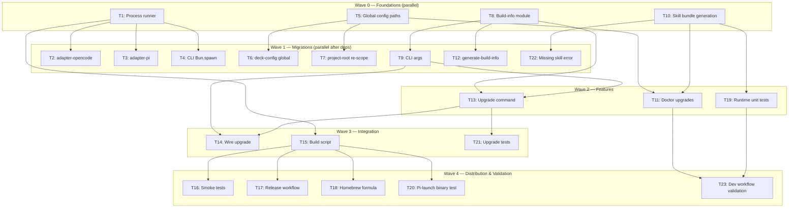

# Tasks: Binary Compilation

## Source

- Spec: binary-compilation spec artifact
- Design: binary-compilation design artifact
- Capabilities affected: standalone-binary-distribution, binary-self-upgrade, bundled-skill-runtime, binary-version-metadata, cli-process-launch, runtime-config-resolution, doctor, pi-launch

## Task Groups

### Group: Shared / Contracts

#### Task 1: Create runtime process runner abstraction
**Owner**: Backend Apply
**Priority**: P0
**Complexity**: Medium
**Parallel**: Yes
**Depends on**: none

**Description**
Create `apps/cli/src/runtime/process.ts` with async and sync process execution wrappers over `node:child_process`. Provide: `spawnAsync(command, args, opts)` returning `{ exitCode, stdout, stderr }` for captured output, `spawnInherited(command, args, opts)` for inherited-stdio spawns (pi-launch), and `spawnSync(command, args, opts)` for synchronous calls. All wrappers must preserve stdin/stdout/stderr inheritance, environment, and cwd behavior identical to current `Bun.spawn()`/`Bun.spawnSync()` usage.

**Files**
- `apps/cli/src/runtime/process.ts` — create

**Verification**
Unit tests: spawnAsync captures stdout/stderr and exit code; spawnInherited inherits stdio; spawnSync returns synchronous result. All tests pass with `bun test`.

**Traces to**: REQ-cpl-001, REQ-cpl-002, REQ-cpl-003, Design → Process launch

---

#### Task 2: Replace Bun.spawn in adapter-opencode
**Owner**: Backend Apply
**Priority**: P0
**Complexity**: Low
**Parallel**: No — depends on Task 1
**Depends on**: Task 1

**Description**
Replace all `Bun.spawn()` and `Bun.spawnSync()` calls in `packages/adapter-opencode/src/` with the runtime process runner from Task 1. Files: `install-tools.ts`, `preflight.ts`. Import the runner and use dependency-injection friendly default. Preserve all existing call-site behavior.

**Files**
- `packages/adapter-opencode/src/install-tools.ts` — modify
- `packages/adapter-opencode/src/preflight.ts` — modify

**Verification**
Existing adapter-opencode tests pass. No `Bun.spawn` or `Bun.spawnSync` references remain in adapter-opencode source files.

**Traces to**: REQ-cpl-001, REQ-cpl-002, Design → Process launch

---

#### Task 3: Replace Bun.spawn in adapter-pi
**Owner**: Backend Apply
**Priority**: P0
**Complexity**: Low
**Parallel**: Yes (parallel with Task 2 — both depend only on Task 1)
**Depends on**: Task 1

**Description**
Replace all `Bun.spawn()` and `Bun.spawnSync()` calls in `packages/adapter-pi/src/` with the runtime process runner from Task 1. Files: `install-tools.ts`, `preflight.ts`, `required-tools.ts`. Import the runner and use dependency-injection friendly default. Preserve all existing call-site behavior.

**Files**
- `packages/adapter-pi/src/install-tools.ts` — modify
- `packages/adapter-pi/src/preflight.ts` — modify
- `packages/adapter-pi/src/required-tools.ts` — modify

**Verification**
Existing adapter-pi tests pass. No `Bun.spawn` or `Bun.spawnSync` references remain in adapter-pi source files.

**Traces to**: REQ-cpl-001, REQ-cpl-002, Design → Process launch

---

#### Task 4: Replace Bun.spawn in CLI entrypoint (pi-launch, opencode-launch)
**Owner**: Backend Apply
**Priority**: P0
**Complexity**: Medium
**Parallel**: Yes (parallel with Tasks 2, 3)
**Depends on**: Task 1

**Description**
Replace `Bun.spawn()` calls in `apps/cli/src/pi-launch-command.ts` and `apps/cli/src/opencode-launch-command.ts` with the runtime process runner from Task 1. The pi-launch spawn uses inherited stdio + cwd/env from launch plan; preserve this exactly.

**Files**
- `apps/cli/src/pi-launch-command.ts` — modify
- `apps/cli/src/opencode-launch-command.ts` — modify

**Verification**
Existing CLI tests pass. Manual: `bun run apps/cli/src/main.tsx pi-launch` still works. No `Bun.spawn` in these files.

**Traces to**: REQ-cpl-001, REQ-cpl-002, REQ-cpl-003, REQ-pil-001, REQ-pil-002

---

#### Task 5: Create global config path resolver
**Owner**: Backend Apply
**Priority**: P0
**Complexity**: Medium
**Parallel**: Yes
**Depends on**: none

**Description**
Create `apps/cli/src/runtime/paths.ts` with global Deck config resolution: primary `$XDG_CONFIG_HOME/.deck/config.json`, default `~/.config/.deck/config.json`, fallback read `~/.deck/config.json`. Expose `getGlobalDeckConfigDir()`, `getGlobalDeckConfigPath()`, `getRunnerConfigDir()` (for `~/.config/opencode/` etc.). Must work from any cwd.

**Files**
- `apps/cli/src/runtime/paths.ts` — create

**Verification**
Unit tests: XDG override, default path, fallback read, cwd-independence. All pass with `bun test`.

**Traces to**: REQ-rcr-001, REQ-rcr-002, REQ-rcr-004, Design → Path and config resolution

---

#### Task 6: Update deck-config to support global config
**Owner**: Backend Apply
**Priority**: P0
**Complexity**: Medium
**Parallel**: No — depends on Task 5
**Depends on**: Task 5

**Description**
Modify `packages/core/src/config/deck-config.ts` to add global config read/write APIs that use the path resolver from Task 5. Add `getGlobalDeckConfigPath()`, `readGlobalDeckConfig()`, `writeGlobalDeckConfig()` while preserving existing `getDeckConfigPath(projectRoot)` APIs and tests.

**Files**
- `packages/core/src/config/deck-config.ts` — modify

**Verification**
Existing deck-config tests pass. New unit tests for global config read/write. No regression in project-local config behavior.

**Traces to**: REQ-rcr-001, REQ-rcr-002, REQ-rcr-004, Design → Path and config resolution

---

#### Task 7: Re-scope project-root to optional target discovery
**Owner**: Backend Apply
**Priority**: P1
**Complexity**: Medium
**Parallel**: Yes
**Depends on**: Task 5

**Description**
Modify `apps/cli/src/project-root.ts` so `resolveProjectRoot()` is scoped to optional target project discovery only. Deck global config must not depend on resolving a Deck monorepo root. TUI, doctor, install/configure, and upgrade must work when `resolveProjectRoot()` returns null. Preserve the function for flows that explicitly need target project context (e.g., pi-launch cwd).

**Files**
- `apps/cli/src/project-root.ts` — modify
- `apps/cli/src/tui/app.tsx` — modify (use global config resolver, keep cwd as optional target context)

**Verification**
Existing project-root tests pass. TUI launches from `$HOME` and `/tmp` without error. `resolveProjectRoot()` returns null outside monorepo without crashing.

**Traces to**: REQ-rcr-002, REQ-rcr-003, REQ-pil-001, Design → Path and config resolution

---

#### Task 8: Create build-info runtime module
**Owner**: General Apply
**Priority**: P0
**Complexity**: Low
**Parallel**: Yes
**Depends on**: none

**Description**
Create `apps/cli/src/runtime/build-info.ts` exposing `getBuildInfo()` that returns `{ version, commit, date, target, channel }`. Import from a generated module `build-info.generated.ts` if present, otherwise return dev defaults (`0.0.0-dev`, `unknown`, current date, host platform, `stable`). Create a placeholder `build-info.generated.ts` with dev defaults so `bun run` works without build step.

**Files**
- `apps/cli/src/runtime/build-info.ts` — create
- `apps/cli/src/runtime/build-info.generated.ts` — create (dev defaults)

**Verification**
Unit test: `getBuildInfo()` returns dev defaults in development mode. `bun run apps/cli/src/main.tsx --version` prints version info.

**Traces to**: REQ-bvm-001, REQ-bvm-002, Design → Version Injection

---

#### Task 9: Add --version and upgrade CLI arg parsing
**Owner**: General Apply
**Priority**: P1
**Complexity**: Low
**Parallel**: Yes
**Depends on**: Task 8

**Description**
Modify `apps/cli/src/cli-args.ts` and `apps/cli/src/main.tsx` to add `--version` flag (prints build info and exits) and `upgrade` command with `--yes` flag. Route `--version` to `getBuildInfo()` output. Route `upgrade` to a placeholder for now (filled in Task 13).

**Files**
- `apps/cli/src/cli-args.ts` — modify
- `apps/cli/src/main.tsx` — modify

**Verification**
`bun run apps/cli/src/main.tsx --version` prints version/commit/date/platform. `bun run apps/cli/src/main.tsx upgrade --help` shows usage. Existing command parsing unaffected.

**Traces to**: REQ-bvm-002, REQ-bsu-003, Design → CLI routing

---

#### Task 10: Generate bundled external skills at build time
**Owner**: Backend Apply
**Priority**: P0
**Complexity**: Medium
**Parallel**: Yes
**Depends on**: none

**Description**
Create `scripts/generate-skill-bundle.ts` that reads all canonical external skill `SKILL.md` files from the monorepo and generates `packages/core/src/skills/external/content.generated.ts` — a TypeScript module exporting a `Record<string, string>` map of skill ID → content. Script must fail the build if any declared skill ID has empty/missing content. Then modify `packages/core/src/skills/external/index.ts` to use the generated content map instead of `readFileSync(join(__dirname, ...))`.

**Files**
- `scripts/generate-skill-bundle.ts` — create
- `packages/core/src/skills/external/content.generated.ts` — create/generated
- `packages/core/src/skills/external/index.ts` — modify

**Verification**
Run generate script; verify generated TS file contains all external skill content. Existing skill lookup tests pass. No `readFileSync` with `import.meta.url` or `__dirname` in external skills runtime code.

**Traces to**: REQ-bsr-001, REQ-bsr-002, REQ-bsr-003, Design → Skills Bundling

---

#### Task 11: Upgrade doctor diagnostics for binary mode
**Owner**: Backend Apply
**Priority**: P1
**Complexity**: Medium
**Parallel**: No — depends on Tasks 5, 8, 10
**Depends on**: Task 5, Task 8, Task 10

**Description**
Modify `apps/cli/src/doctor-command/doctor-diagnostics.ts` and `apps/cli/src/doctor-command/doctor-report.ts` to report: build info (version/commit/date/platform), executable path, global config directory and existence/permissions, bundled skill count and availability check, and upgrade availability hint. Add new check functions for binary-specific diagnostics.

**Files**
- `apps/cli/src/doctor-command/doctor-diagnostics.ts` — modify
- `apps/cli/src/doctor-command/doctor-report.ts` — modify

**Verification**
`deck doctor` in dev mode shows dev build info, config paths, skill count. No regression in existing doctor checks.

**Traces to**: REQ-doc-001, REQ-doc-002, REQ-doc-003, REQ-doc-004, REQ-bvm-003, REQ-rcr-005

---

#### Task 12: Create build info generation script
**Owner**: General Apply
**Priority**: P1
**Complexity**: Low
**Parallel**: Yes
**Depends on**: Task 8

**Description**
Create `scripts/generate-build-info.ts` that accepts version, target platform as arguments (or reads from git/tag), and writes `apps/cli/src/runtime/build-info.generated.ts` with the `BUILD_INFO` constant. Include: version (semver from arg or `package.json`), commit (`git rev-parse --short HEAD`), date (ISO-8601), target (from arg), channel (`stable`).

**Files**
- `scripts/generate-build-info.ts` — create

**Verification**
Run script: `bun scripts/generate-build-info.ts --version 1.0.0 --target linux-x64`. Verify generated file has correct values. `getBuildInfo()` reads them.

**Traces to**: REQ-bvm-001, Design → Version Injection

---

#### Task 13: Implement upgrade command
**Owner**: Backend Apply
**Priority**: P1
**Complexity**: High
**Parallel**: No — depends on Tasks 8, 9
**Depends on**: Task 8, Task 9

**Description**
Create `apps/cli/src/upgrade-command/index.ts` (orchestration), `apps/cli/src/upgrade-command/github-release.ts` (fetch latest stable release metadata, resolve asset/checksum URLs), and `apps/cli/src/upgrade-command/install.ts` (download archive to temp dir, SHA-256 checksum verification against `checksums.txt`, extract binary, backup current executable, atomic rename, rollback on failure). Implement: version comparison (refuse downgrade), `--yes` skip confirmation, error codes from spec (`UPGRADE_CHECKSUM_MISMATCH`, `UPGRADE_NETWORK_ERROR`, `UPGRADE_REPLACE_FAILED`).

**Files**
- `apps/cli/src/upgrade-command/index.ts` — create
- `apps/cli/src/upgrade-command/github-release.ts` — create
- `apps/cli/src/upgrade-command/install.ts` — create

**Verification**
Unit tests: version comparison (refuses downgrade), checksum verification (mismatch → abort+restore), atomic replace flow (backup + rename + rollback). `bun run apps/cli/src/main.tsx upgrade` runs (will fail gracefully without network in dev).

**Traces to**: REQ-bsu-001, REQ-bsu-002, REQ-bsu-003, REQ-bsu-004, REQ-bsu-005, REQ-bsu-006, Design → Upgrade flow

---

#### Task 14: Wire upgrade command into main.tsx
**Owner**: General Apply
**Priority**: P1
**Complexity**: Low
**Parallel**: No — depends on Tasks 9, 13
**Depends on**: Task 9, Task 13

**Description**
Wire the upgrade command from Task 13 into the CLI routing in `main.tsx`. When `args.command === "upgrade"`, call the upgrade orchestrator. Pass `--yes` flag. Handle exit codes and error display.

**Files**
- `apps/cli/src/main.tsx` — modify

**Verification**
`bun run apps/cli/src/main.tsx upgrade` invokes the upgrade flow. `--version` still works. TUI still launches with no args.

**Traces to**: REQ-bsu-001, REQ-bsu-003

---

#### Task 15: Create build-binaries script
**Owner**: General Apply
**Priority**: P1
**Complexity**: High
**Parallel**: No — depends on Tasks 1–8, 10, 12
**Depends on**: Task 1, Task 5, Task 8, Task 10, Task 12

**Description**
Create `scripts/build-binaries.ts` that: (1) runs generate-build-info for each target, (2) runs generate-skill-bundle, (3) executes `bun build --compile --target=bun-{target}` for all 4 targets (linux-x64, linux-arm64, darwin-x64, darwin-arm64), (4) runs `codesign -s -` on macOS binaries, (5) creates tar.gz archives named `deck_v{VERSION}_{OS}_{ARCH}.tar.gz`, (6) generates `checksums.txt` with SHA-256 hashes. Add `build:binary` script to `apps/cli/package.json`.

**Files**
- `scripts/build-binaries.ts` — create
- `apps/cli/package.json` — modify

**Verification**
Dry-run on host platform: script compiles one target, produces archive + checksum entry. `bun run build:binary` in apps/cli works.

**Traces to**: REQ-sbd-001, REQ-sbd-002, REQ-sbd-003, Design → Build Pipeline

---

#### Task 16: Add compiled binary smoke tests
**Owner**: General Apply
**Priority**: P1
**Complexity**: Medium
**Parallel**: No — depends on Task 15
**Depends on**: Task 15

**Description**
Create integration test script or test file that compiles for the host platform and verifies: (1) `./deck --version` outputs version/commit/date/platform, (2) `./deck doctor` runs and reports binary diagnostics, (3) `./deck` launches TUI (non-interactive fallback or timeout check), (4) `./deck upgrade` reports current version or handles no-network gracefully.

**Files**
- `apps/cli/src/__tests__/binary-smoke.test.ts` — create

**Verification**
Run smoke tests on compiled binary. All pass. Dev workflow (`bun run`) unaffected per REQ-sbd-007.

**Traces to**: REQ-sbd-006, REQ-sbd-007, REQ-bvm-002, REQ-doc-001

---

#### Task 17: Create GitHub Actions release workflow
**Owner**: General Apply
**Priority**: P2
**Complexity**: High
**Parallel**: Yes (independent of Tasks 13-16)
**Depends on**: Task 15

**Description**
Create `.github/workflows/release.yml` triggered on tag push (`v*`). Matrix build for all 4 targets. Steps: checkout, setup Bun, run generate scripts, run build-binaries, upload archives + checksums.txt to GitHub Release. Use `softprops/action-gh-release` or equivalent. Pin Bun version in CI.

**Files**
- `.github/workflows/release.yml` — create

**Verification**
Workflow YAML is valid (`actionlint` or manual review). On tag push, would produce 4 archives + checksums.txt on GitHub Releases.

**Traces to**: REQ-sbd-001, REQ-sbd-004, Design → Distribution

---

#### Task 18: Create Homebrew formula template
**Owner**: General Apply
**Priority**: P2
**Complexity**: Medium
**Parallel**: Yes (independent of other tasks)
**Depends on**: Task 15

**Description**
Create `Formula/deck.rb` following the design's Homebrew formula structure. Include arch-specific macOS URLs and SHA-256 placeholders. Add `brew test` assertion for `--version`. Document that formula SHA-256 must be updated per release.

**Files**
- `Formula/deck.rb` — create

**Verification**
`brew audit --formula Formula/deck.rb` passes structural checks (local). Formula has correct arch branching and install/test blocks.

**Traces to**: REQ-sbd-005, Design → Distribution

---

#### Task 19: Add unit tests for runtime modules
**Owner**: Backend Apply
**Priority**: P1
**Complexity**: Medium
**Parallel**: No — depends on Tasks 1, 5, 8, 10
**Depends on**: Task 1, Task 5, Task 8, Task 10

**Description**
Add comprehensive unit tests for: process runner (spawnAsync, spawnInherited, spawnSync with mock child_process), global config path resolution (XDG, default, fallback, cwd-independence), build-info dev defaults and generated module fallback, bundled skill lookup completeness and missing skill error.

**Files**
- `apps/cli/src/runtime/__tests__/process.test.ts` — create
- `apps/cli/src/runtime/__tests__/paths.test.ts` — create
- `apps/cli/src/runtime/__tests__/build-info.test.ts` — create
- `packages/core/src/skills/external/__tests__/content.test.ts` — create

**Verification**
All new tests pass. `bun test` in affected packages passes.

**Traces to**: REQ-cpl-003, REQ-rcr-001, REQ-bvm-001, REQ-bsr-003, REQ-bsr-004

---

#### Task 20: Validate pi-launch from binary
**Owner**: Backend Apply
**Priority**: P1
**Complexity**: Low
**Parallel**: No — depends on Tasks 4, 7, 15
**Depends on**: Task 4, Task 7, Task 15

**Description**
Test that `deck pi-launch` works from compiled binary without monorepo-relative files. Verify process spawn uses child_process (not Bun.spawn), cwd is passed correctly, and Pi launches with inherited stdio. Test from non-project directory.

**Files**
- `apps/cli/src/__tests__/binary-pi-launch.test.ts` — create

**Verification**
Compiled binary can execute pi-launch flow. No monorepo-relative file access. Process spawn behavior identical to dev mode.

**Traces to**: REQ-pil-001, REQ-pil-002, REQ-cpl-001

---

#### Task 21: Add upgrade command unit tests
**Owner**: Backend Apply
**Priority**: P1
**Complexity**: Medium
**Parallel**: No — depends on Task 13
**Depends on**: Task 13

**Description**
Unit tests for upgrade command components: version comparison (newer → proceed, equal → up-to-date, older → refuse), checksum verification (match → proceed, mismatch → abort), atomic replace (backup + rename), rollback on failure (restore backup), `--yes` flag skips prompt, network error handling.

**Files**
- `apps/cli/src/upgrade-command/__tests__/index.test.ts` — create
- `apps/cli/src/upgrade-command/__tests__/github-release.test.ts` — create
- `apps/cli/src/upgrade-command/__tests__/install.test.ts` — create

**Verification**
All upgrade tests pass. Covers REQ-bsu-001 through REQ-bsu-006 scenarios.

**Traces to**: REQ-bsu-001, REQ-bsu-002, REQ-bsu-003, REQ-bsu-004, REQ-bsu-005, REQ-bsu-006

---

#### Task 22: Missing skill diagnostic error
**Owner**: Backend Apply
**Priority**: P2
**Complexity**: Low
**Parallel**: No — depends on Task 10
**Depends on**: Task 10

**Description**
When skill lookup fails in binary mode, produce diagnostic error identifying the missing skill ID with message: "Skill {id} not found in bundled resources. Reinstall deck binary." Use the error contract `SKILL_NOT_FOUND` from spec.

**Files**
- `packages/core/src/skills/external/index.ts` — modify

**Verification**
Test: request non-existent skill ID → error message matches spec contract. Doctor also reports missing skill via Task 11.

**Traces to**: REQ-bsr-004

---

#### Task 23: Verify development workflow unchanged
**Owner**: General Apply
**Priority**: P0
**Complexity**: Low
**Parallel**: No — depends on Tasks 1–10, 13
**Depends on**: Task 1, Task 5, Task 7, Task 8, Task 10

**Description**
Run full development workflow validation: `bun run apps/cli/src/main.tsx` launches TUI, `bun run apps/cli/src/main.tsx doctor` reports diagnostics, `bun run apps/cli/src/main.tsx pi-launch` spawns Pi, all existing tests pass across packages. Verify no regression from binary-compatibility changes.

**Files**
- No new files — validation task

**Verification**
`bun test` passes across all packages. `bun run apps/cli/src/main.tsx` works identically to pre-change baseline.

**Traces to**: REQ-sbd-007

## Dependency Graph

```
Task 1 (process runner)
  → Task 2 (adapter-opencode Bun.spawn)
  → Task 3 (adapter-pi Bun.spawn)
  → Task 4 (CLI Bun.spawn)
  → Task 15 (build script needs all Bun.spawn removed)

Task 5 (global config paths)
  → Task 6 (deck-config global APIs)
  → Task 7 (project-root re-scope)
  → Task 11 (doctor diagnostics)

Task 8 (build-info module)
  → Task 9 (CLI args --version, upgrade)
  → Task 12 (generate-build-info script)
  → Task 13 (upgrade needs build-info)

Task 9 (CLI args)
  → Task 13 (upgrade command)
  → Task 14 (wire upgrade into main)

Task 10 (skill bundle generation)
  → Task 11 (doctor skill checks)
  → Task 19 (unit tests)
  → Task 22 (missing skill diagnostic)

Task 13 (upgrade command)
  → Task 14 (wire into main)
  → Task 21 (upgrade tests)

Task 15 (build-binaries script)
  → Task 16 (smoke tests)
  → Task 17 (release workflow)
  → Task 18 (Homebrew formula)
  → Task 20 (pi-launch binary test)

Task 11, 19 (diagnostics + tests)
  → Task 23 (dev workflow validation)
```

## Parallelization Plan

| Wave | Tasks | Can Run in Parallel | Rationale |
|---|---|---|---|
| Wave 0 | 1, 5, 8, 10 | Yes | Independent foundations, no shared files |
| Wave 1 | 2, 3, 4, 6, 7, 9, 12, 22 | Partially | Tasks 2/3/4 parallel after T1; Tasks 6/7 parallel after T5; Tasks 9/12/22 parallel after T8/T10 |
| Wave 2 | 11, 13, 19 | No | T11 needs T5+T8+T10; T13 needs T8+T9; T19 needs T1+T5+T8+T10 |
| Wave 3 | 14, 15, 21 | Partially | T14 after T9+T13; T15 after all Wave 0-1; T21 after T13 |
| Wave 4 | 16, 17, 18, 20, 23 | Partially | T16/17/18/20 after T15; T23 after all implementation |

## Responsibility Contracts

| Contract / Boundary | Owner | Consumers | Notes |
|---|---|---|---|
| `runtime/process.ts` spawn API | Backend Apply (T1) | Backend Apply (T2, T3, T4) | Must be stable before adapters migrate |
| `runtime/paths.ts` global config API | Backend Apply (T5) | Backend Apply (T6, T7, T11) | Path precedence must be agreed before consumers |
| `runtime/build-info.ts` getBuildInfo() | General Apply (T8) | General Apply (T9), Backend Apply (T11, T13) | Dev defaults must exist before CLI routing |
| `external/content.generated.ts` skill map | Backend Apply (T10) | Backend Apply (T11, T19, T22) | Generation script must run before build |
| `upgrade-command/*` upgrade API | Backend Apply (T13) | General Apply (T14) | Orchestration API consumed by main.tsx routing |

## Complexity Summary

| Complexity | Count | Task Numbers |
|---|---|---|
| Low | 9 | 2, 3, 8, 9, 12, 14, 20, 22, 23 |
| Medium | 10 | 1, 5, 6, 7, 10, 11, 16, 18, 19, 21 |
| High | 4 | 13, 15, 17 |

## Flagged for Splitting

- **Task 13 (upgrade command)**: High complexity, 3 new files, covers 6 requirements. If the session struggles, split into: (13a) github-release.ts client, (13b) install.ts atomic replace, (13c) index.ts orchestration.
- **Task 15 (build-binaries script)**: High complexity, covers 6 targets + signing + archiving + checksums. If needed, split into: (15a) single-target compile + verify, (15b) multi-target matrix + packaging.
- **Task 17 (release workflow)**: High complexity but mostly CI config. Can be deferred to post-initial-release if needed.

## Review Workload Forecast

| Signal | Value |
|---|---|
| Estimated changed lines | 400-800 |
| 400-line budget risk | Medium |
| Scope reduction recommended | No — tasks are already decomposed |
| Sequential work slices recommended | Yes — use waves 0→1→2→3→4 |
| Decision needed before Apply | Yes — GitHub repo owner for release workflow (Task 17) and Homebrew tap name (Task 18) |

**Rationale**: 23 tasks across 8 capabilities, ~30 files affected. Most tasks are Low-Medium complexity. The 3 High-complexity tasks (upgrade, build script, release workflow) are the risk areas. Wave-based execution with review gates between waves keeps the review budget manageable. The only pre-Apply decision is the GitHub repo/tap owner, which can be stubbed as `<owner>` and resolved later.

## Open Questions / Blockers

- **GitHub release owner/repo** (implementation-blocking for Task 17, allowed-with-stub for Task 13): Release URLs need the actual GitHub owner/repo. Stub as `<owner>/deck` until confirmed. Upgrade command uses relative API paths that work regardless.
- **Homebrew tap name** (allowed-with-stub for Task 18): Formula uses placeholder URLs. Update when repo owner is confirmed.
- **Config migration** (non-blocking): Whether to auto-migrate `~/.deck/config.json` → `~/.config/.deck/config.json`. Design says fallback read is sufficient for first release. No task blocks on this.

None of these block the core implementation tasks (1–16, 19–23). Tasks 17–18 can proceed with placeholders.

## Mermaid Summary Source


