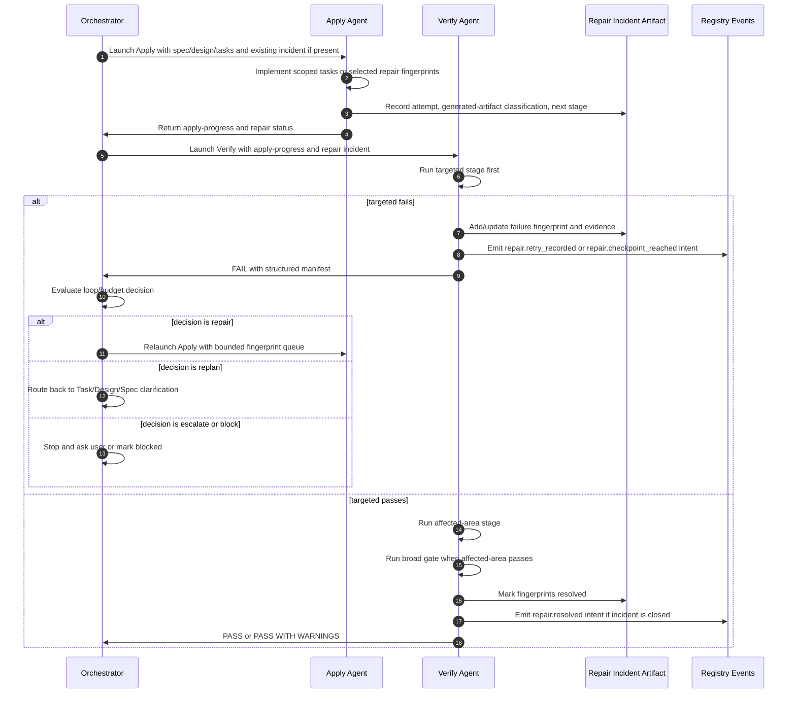
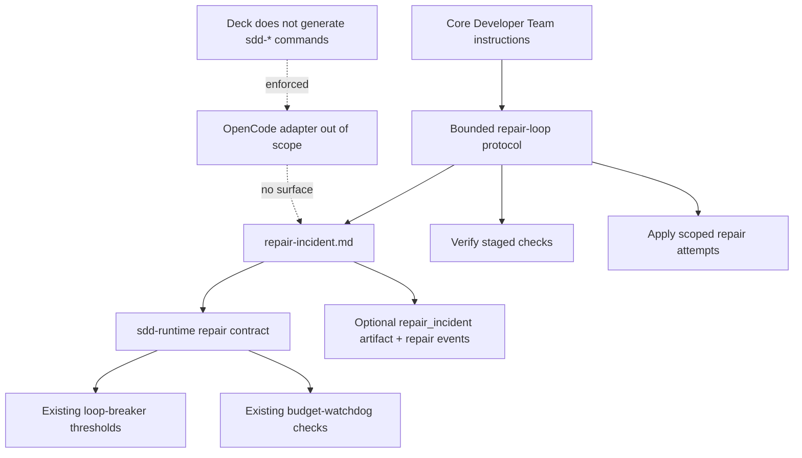

# Design: Bounded Developer Team Repair Loops

## Source

- Proposal: `bounded-developer-team-repair-loops` proposal artifact
- Exploration: `bounded-developer-team-repair-loops` exploration artifact
- Capabilities affected:
  - `bounded-repair-loop-protocol`
  - `repair-failure-manifest`
  - `staged-repair-verification`
  - `repair-incident-telemetry`
  - `generated-artifact-repair-policy`
  - `developer-team-orchestration`
  - `apply-verify-handoff`
  - `openspec-registry-usage`
- Spec status: not yet available; Design and Spec are running in parallel.

## Current Architecture Context

- `packages/core/src/teams/developer/orchestrator-content.ts` is the canonical runner-agnostic Developer Team orchestration source. Runtime adapters materialize its content for specific runners. It already defines SDD phase order, registry-deferred mode, artifact persistence, Apply routing, Verify/Review parallelism, and phase advancement gates.
- Apply agents currently write `apply-progress.md` and registry entries through `apply-*-content.ts` instructions. Their progress format records completed/in-progress/blocked tasks and verification evidence, but it does not define retry budgets, failure fingerprints, or repair-loop stop criteria.
- Verify currently reads `spec.md`, `tasks.md`, and `apply-progress.md`, then writes `verify-report.md`. It records test/build/typecheck results and findings, but it does not require a failure manifest that Apply can consume directly.
- `packages/adapter-opencode/src/command-generation.ts` historically generated OpenCode slash commands including `sdd-*`. Per the Boundary Clarification below, Deck must NOT own, install, generate, or manage OpenCode commands named `sdd-*` (including `sdd-apply`, `sdd-verify`, `sdd-continue`) going forward; existing installed user files are not deleted by Deck. Deck continues to own Developer Team subagents and skills (`deck-developer-*`).
- `packages/sdd-runtime/src/orchestrator/loop-breaker.ts` already provides a runner-agnostic `FailureFingerprint` shape and `checkLoopCondition()` thresholds: repair at 2 similar failures, replan at 3, escalate at 4.
- `packages/sdd-runtime/src/orchestrator/budget-watchdog.ts` already provides soft/hard budget checks across tokens, turns, time, and tool calls. It emits a checkpoint request for soft budget and `budget_exceeded` for hard budget.
- `packages/sdd-runtime/src/artifact-state/artifact-state-manager.ts` provides a CAS/idempotency/event-lock boundary for safe structured artifact updates. It is suitable for later runtime-backed repair incident writes, but current SDD artifacts are still file-backed OpenSpec Markdown.
- `openspec/registry-schema.md`, `packages/core/src/spec-registry/schema.ts`, and `packages/core/src/spec-registry/validator.ts` define/validate known artifact keys and event names. Current artifact keys do not include a repair incident artifact, and known auxiliary events do not include repair lifecycle events.
- `docs/prompt-methodology-modules.md` documents existing prompt/methodology modules, including Registry-Deferred Mode, Apply Routing, and Return Contracts, but not bounded repair loops.

## Boundary Clarification

Per user clarification, the OpenCode Developer Team install must observe the following boundary, which takes precedence over any other section of this design:

- **Deck must NOT own, install, generate, or manage OpenCode commands named `sdd-*`** (including `sdd-apply`, `sdd-verify`, and `sdd-continue`).
- **Deck must NOT treat SDD skills as Deck install artifacts.**
- **Deck retains Developer Team subagents and skills** (`deck-developer-apply-*`, `deck-developer-verify`, `deck-developer-archive`, `deck-developer-orchestrator`, etc.) as Deck-owned content.
- **Existing installed user files must not be deleted by Deck** as part of this fix. Deck simply stops producing or managing `sdd-*` commands going forward.
- **Any cleanup of legacy installed files** (for example, previously installed `sdd-*` command files in a user's `${configDir}/commands/`) is user/manual or a separately authorized change, not part of this OpenSpec change.

Consequences for this design:

- Repair-loop guidance belongs in Developer Team content/skills, not in OpenCode `sdd-*` commands.
- The OpenCode adapter layer is **out of scope** for surface of repair-incident context in this change. Adapter commands do not define budgets, lifecycle states, manifest schema, hard-stop semantics, or repair-incident handoff wording.
- The earlier `command-generation.ts` adapter-side repair-incident wording is rescinded and replaced by a boundary assertion: Developer Team install must not generate `sdd-*` commands at all, and existing installed `sdd-*` files are not deleted by Deck.

## Proposed Architecture

Use staged enforcement with OpenSpec artifacts as the first-class authority:

1. **Core prompt/artifact contract first**: Define the repair-loop protocol in `orchestrator-content.ts` and phase content (`verify-content.ts`, `apply-*-content.ts`, and limited `task-content.ts` replan guidance). This makes behavior runner-agnostic and immediately enforceable by Developer Team agents.
2. **Dedicated lightweight incident artifact**: Add an optional `repair-incident.md` artifact per change when a repair loop starts. Existing `apply-progress.md` and `verify-report.md` reference the active incident and echo essential summaries, but `repair-incident.md` is the durable retry/budget/failure queue record.
3. **Runtime contract helpers**: Add typed repair incident contracts and validation/evaluation helpers in `packages/sdd-runtime`. The helpers map repair manifest entries to existing `FailureFingerprint` and `BudgetUsage` concepts instead of replacing `loop-breaker.ts` or `budget-watchdog.ts`.
4. **Registry-compatible telemetry**: Add an optional `repair_incident` artifact key and auxiliary repair lifecycle events. These events are not new SDD phases and must not advance `currentPhase`; they provide auditability inside the existing registry.
5. **Adapter boundary (rescinded earlier adapter-side repair-incident surface)**: Per the Boundary Clarification above, Deck does NOT generate OpenCode `sdd-*` commands and does NOT surface repair-incident context via `/sdd-apply`, `/sdd-verify`, or `/sdd-continue`. Repair-loop guidance lives entirely in Developer Team content/skills. Adapter commands do not define budgets, lifecycle states, manifest schema, hard-stop semantics, or repair-incident handoff wording; the OpenCode adapter layer is out of scope for this change.

### Component / Module Boundaries

| Component | Responsibility | Change Type |
|---|---|---|
| `packages/core/src/teams/developer/orchestrator-content.ts` | Canonical repair-loop launch, checkpoint, hard-stop, replan, escalation, and registry-deferred reconciliation rules. | modified |
| `packages/core/src/teams/developer/verify-content.ts` | Staged verification sequence and failure manifest production when Verify fails or returns residual failures. | modified |
| `packages/core/src/teams/developer/apply-{general,backend,frontend}-content.ts` | Apply-side consumption of repair incidents, attempt accounting, scoped fixes, generated-artifact evidence, and stop behavior. | modified |
| `packages/core/src/teams/developer/task-content.ts` | Replan mode guidance when repair budgets require task/design/spec clarification rather than another Apply retry. | modified |
| `packages/sdd-runtime/src/contracts/repair-incident.ts` | New runner-agnostic TypeScript contract and validator for `repair-incident.md` machine-readable blocks. | new |
| `packages/sdd-runtime/src/orchestrator/repair-loop-governance.ts` | New evaluator that maps incident entries to `checkLoopCondition()` and `checkBudget()` decisions. | new |
| `packages/sdd-runtime/src/orchestrator/loop-breaker.ts` | Existing fingerprint threshold primitive; reused without semantic replacement. | unchanged or minor export-only modification |
| `packages/sdd-runtime/src/orchestrator/budget-watchdog.ts` | Existing soft/hard budget primitive; reused for runner-provided budget usage when available. | unchanged or minor export-only modification |
| `packages/sdd-runtime/src/artifact-state/artifact-state-manager.ts` | Existing safe update boundary; used by runtime-backed artifact stores if repair incidents are updated programmatically. | unchanged |
| `packages/adapter-opencode/src/command-generation.ts` | Boundary enforcement: Developer Team install must not generate `sdd-*` commands; existing installed user files are not deleted by Deck. | boundary check (no `sdd-*` repair-incident surface) |
| `openspec/registry-schema.md` and `packages/core/src/spec-registry/*` | Optional repair artifact key and auxiliary event validation. | modified |
| `docs/prompt-methodology-modules.md` | Methodology inventory for the new bounded repair-loop module. | modified |

### Selected Enforcement Layer and Staging Strategy

| Stage | Enforcement Layer | Purpose | Failure Behavior |
|---|---|---|---|
| Stage 1 | Prompt + artifact contract | Require Verify to emit a structured manifest and Apply to consume/update it. | Missing/invalid manifest is a phase blocker when Verify fails. |
| Stage 2 | Registry/documentation validation | Make `repair_incident` and repair events known to registry tooling. | Unknown repair telemetry becomes validator error/warning depending on strictness. |
| Stage 3 | Runtime contract helpers | Validate manifest blocks and evaluate loop/budget decisions deterministically. | Invalid structured block returns `blocked` with repair guidance. |
| Stage 4 | Adapter boundary (rescinded earlier adapter-side repair-incident surface) | Developer Team install does not generate `sdd-*` commands; existing installed user files are not deleted by Deck; repair-loop guidance lives in Developer Team content/skills. | Out of scope per Boundary Clarification. Adapter layer no longer participates in repair-incident surface; core Developer Team content/skills govern. |

This avoids a prompt-only fix while also avoiding a high-risk runtime rewrite. The first implementation can be artifact-driven; stronger runtime enforcement can be introduced without changing the user-visible protocol.

## Proposed Repair Manifest / Incident Shape

### File Strategy

- Create `openspec/changes/{change-id}/repair-incident.md` only when one of these occurs:
  - Verify returns `FAIL` after Apply.
  - Apply reports a blocker that requires another Apply/Verify pass.
  - The same failure fingerprint appears again after a repair attempt.
  - Orchestrator explicitly starts a repair incident for a repeated Review/Verify failure batch.
- Keep the artifact lightweight for small repairs: one machine-readable manifest block plus short human-readable tables.
- Do not create a new SDD phase. The incident is an auxiliary OpenSpec artifact under the current Apply/Verify/Tasks flow.
- Existing `apply-progress.md` and `verify-report.md` keep their current roles and include `Repair Incident: repair-incident.md#{incidentId}` when applicable.

### Machine-Readable Block

Use a fenced YAML block under `## Repair Manifest (machine-readable)` as the structured source inside the Markdown artifact. YAML keeps the artifact human-readable and easy to diff while allowing deterministic parsing.

```yaml
schema: repair-incident-v1
incidentId: repair-{change-id}-{sequence}
changeId: bounded-developer-team-repair-loops
status: open | checkpoint | replan_required | escalated | blocked | resolved
createdFrom:
  phase: verify | apply | review
  artifact: verify-report.md | apply-progress.md | review-report.md
budgets:
  incident:
    verifyCyclesSoft: 2
    verifyCyclesHard: 4
    repairAttemptsSoft: 2
    repairAttemptsHard: 4
  fingerprint:
    repairThreshold: 2
    replanThreshold: 3
    escalationThreshold: 4
runtimeBudget:
  tokensUsed: null
  turnsUsed: null
  timeElapsedMs: null
  toolCallsUsed: null
failures:
  - id: fp-{stable-hash}
    status: open | repairing | replan_required | escalated | blocked | resolved | pre_existing | out_of_scope
    sourcePhase: verify | apply | review
    taskGroup: "Task 3" | "unknown"
    ownerHint: General Apply | Backend Apply | Frontend Apply | Task | Spec | Design | Orchestrator
    failingContract: requirement-id-or-check-name
    requirementIds: [REQ-example-001]
    scenarioIds: []
    errorClass: assertion | typecheck | build | lint | timeout | environment | generated_artifact | unknown
    changedFiles:
      - packages/example/src/file.ts
    evidence:
      command: bun test packages/example
      latestResult: fail
      artifact: verify-report.md
      excerpt: short redacted failure summary
    attempts:
      count: 1
      history:
        - attempt: 1
          phase: apply
          artifact: apply-progress.md
          summary: scoped fix attempted
          verificationStage: targeted
          result: failed
    generatedArtifacts:
      - path: apps/cli/src/runtime/build-info.generated.ts
        classification: not_generated | checked_in_deterministic | checked_in_environment_sensitive | untracked_build_output | unknown
        generator: scripts/generate-build-info.ts
        regenerationCommand: bun scripts/generate-build-info.ts --target linux-x64
        evidence: target explicitly parameterized; no host-inferred value committed
    nextVerificationStage: targeted | affected_area | broad_gate
    nextAction: continue | repair | replan | escalate | block | verify
lifecycle:
  - event: repair.started
    phase: verify
    artifact: verify-report.md
    at: ISO-8601
    summary: initial failure manifest created
```

### Fingerprint Normalization

The manifest failure entry maps to existing `FailureFingerprint` as follows:

| Manifest Field | `FailureFingerprint` Field | Notes |
|---|---|---|
| `sourcePhase` | `phase` | Use the phase that produced the latest failing evidence. |
| `taskGroup` | `taskGroup` | Use task number/group when known; otherwise `unknown`. |
| `failingContract` | `failingContract` | Prefer requirement/scenario/check ID over prose. |
| `errorClass` | `errorClass` | Normalize to a small enum; preserve raw excerpt separately. |
| `changedFiles` | `changedFiles` | Sorted before hashing by existing loop breaker behavior. |
| `id` or evidence hash | `reviewFindingHash` | Stable hash of redacted evidence excerpt + command + contract. |

The manifest may contain richer fields, but loop decisions must depend only on normalized, stable, redacted values.

## Apply / Verify Orchestration Flow

### Staged Verification Sequence

| Stage | Trigger | Scope | Output |
|---|---|---|---|
| `targeted` | First Verify after Apply, or active repair incident has open fingerprints. | Smallest command that reproduces or confirms each open failure. | Failure manifest or resolved fingerprint evidence. |
| `affected_area` | Targeted checks pass, or changed files span a package/module. | Package/module tests, typecheck, lint, or build for affected files. | Updated manifest with residual affected-area failures. |
| `broad_gate` | Targeted and affected-area checks pass, or stage rationale requires release confidence. | Full project release gate/build/typecheck/test matrix. | Pass/fail report and residual failure classification. |

Verify should not start with broad release gates during an active repair incident unless the manifest explicitly sets `nextVerificationStage: broad_gate` or targeted evidence cannot reproduce the failure.

### Sequence Diagram



### Loop / Budget Semantics

Use the existing runtime semantics as defaults:

| Decision | Default Trigger | Required Action |
|---|---|---|
| `continue` | Fingerprint appears once and budgets are within limits. | Apply/Verify may proceed normally. |
| `repair` | Same fingerprint count reaches `repairThreshold` (default 2). | Apply may perform one scoped repair attempt and must record attempt history. |
| `checkpoint` | Incident soft budget reached, or `checkBudget()` returns `soft_budget`. | Orchestrator must state continue/replan rationale before another repair. |
| `replan` | Same fingerprint count reaches `replanThreshold` (default 3), or failure indicates incorrect tasks/design/spec. | Stop blind repair; route to Task repair or upstream clarification. |
| `escalate` | Same fingerprint count reaches `escalationThreshold` (default 4), hard incident budget reached, or `checkBudget()` returns `hard_budget`. | Mark blocked/escalated unless a human explicitly authorizes an override. |

Interactive mode may rely on attempt/verification-cycle counts when token/time/tool metrics are unavailable. Automated runners may additionally feed `BudgetUsage` into `checkBudget()`.

## Generated-Artifact Policy Design

### Classification

Each generated file touched during a repair loop must be classified:

| Classification | Meaning | Required Evidence |
|---|---|---|
| `not_generated` | Normal source file. | None beyond normal Apply evidence. |
| `checked_in_deterministic` | Generated source intentionally committed and reproducible. | Generator path and regeneration command. |
| `checked_in_environment_sensitive` | Generated source intentionally committed but can vary by OS/arch/time/path. | Explicit parameterization or normalization evidence. |
| `untracked_build_output` | Build artifact that should not be committed. | Confirmation it remains untracked/ignored or is removed. |
| `unknown` | Apply cannot prove the category. | Treat as blocker or require clarification before broad Verify pass. |

### Policy Rules

- Do not hand-edit a generated file when a generator exists, unless the artifact has no regeneration path and that limitation is recorded.
- Environment-sensitive generated files must not commit host-inferred values unless the target is explicitly part of the requirement. The repair incident must record how host sensitivity was neutralized.
- Stale generated output is an in-scope repair failure when changed files or failing checks show it affects the current change.
- Generated-artifact evidence must be redacted for secrets, absolute user paths, tokens, and runner-local session metadata.
- Broad verification should include the generator or release-preparation check when a generated artifact participates in a repair incident.

## API / Contract Implications

| Endpoint / Interface | Change | Backward Compatible |
|---|---|---|
| `repair-incident.md` OpenSpec artifact | New optional artifact with a `repair-incident-v1` machine-readable block and human summary sections. | Yes; absent artifact means no active repair incident. |
| `RepairIncident` / `RepairFailureEntry` runtime contract | New TypeScript types and validator in `packages/sdd-runtime/src/contracts/repair-incident.ts`. | Yes; additive. |
| `evaluateRepairIncident()` helper | New runtime helper that returns `continue`, `repair`, `checkpoint`, `replan`, `escalate`, or `block` using existing loop/budget primitives. | Yes; additive. |
| Spec Registry artifact keys | Add optional `repair_incident: repair-incident.md`. | Yes if optional and legacy-tolerant. |
| Spec Registry event names | Add known auxiliary events: `repair.started`, `repair.retry_recorded`, `repair.checkpoint_reached`, `repair.replanned`, `repair.escalated`, `repair.blocked`, `repair.resolved`. | Yes if events are optional and not phase transitions. |
| Apply return contracts | Include active incident id, repair decision, attempts updated, generated-artifact classifications, and next verification stage when in repair mode. | Partial; stricter only during active repair incidents. |
| Verify return contracts | Include staged verification results and failure manifest when result is `FAIL`. | Partial; stricter on failing Verify output. |
| OpenCode `sdd-*` commands | Out of scope per Boundary Clarification. Deck does NOT generate `sdd-apply`, `sdd-verify`, or `sdd-continue`. Existing installed files are not deleted by Deck. | N/A — adapter surface rescinded. |

## State / Persistence Implications

- New optional artifact: `openspec/changes/{change-id}/repair-incident.md`.
- New optional state artifact reference: `artifacts.repair_incident: repair-incident.md`.
- New auxiliary registry events should reference `repair-incident.md` but must not advance `currentPhase` on their own.
- Existing phase artifacts remain authoritative for their phase outputs:
  - `apply-progress.md` records implementation attempts and modified files.
  - `verify-report.md` records compliance results and staged check evidence.
  - `repair-incident.md` records cross-phase loop state and failure queue.
- No database or external telemetry store is introduced.
- If runtime-backed updates are introduced, use `artifact-state-manager.ts` CAS/idempotency semantics to avoid concurrent repair incident corruption.

## Migration / Backward Compatibility

- Existing OpenSpec changes without `repair-incident.md` continue to validate and run normally.
- The repair incident artifact is created lazily only when a repair loop starts.
- Registry schema updates must be optional/legacy-tolerant so archived changes are not forced to add repair artifacts.
- Adapter-specific runner data, such as session IDs or local log paths, may appear only as optional redacted evidence; it must never define the core decision.
- If the incident artifact proves too heavy, the protocol can fall back to required `## Repair Manifest` sections in `apply-progress.md` and `verify-report.md`; registry event names can remain optional.

## File Impact Estimate

| File / Path | Action | Rationale |
|---|---|---|
| `openspec/changes/bounded-developer-team-repair-loops/design.md` | create | This design artifact. |
| `packages/core/src/teams/developer/orchestrator-content.ts` | modify | Add canonical bounded repair-loop protocol, orchestration decisions, and stop/replan/escalation rules. |
| `packages/core/src/teams/developer/verify-content.ts` | modify | Add staged verification and failure manifest requirements. |
| `packages/core/src/teams/developer/apply-general-content.ts` | modify | Add repair incident consumption/update rules for General Apply. |
| `packages/core/src/teams/developer/apply-backend-content.ts` | modify | Add repair incident consumption/update rules for Backend Apply. |
| `packages/core/src/teams/developer/apply-frontend-content.ts` | modify | Add repair incident consumption/update rules for Frontend Apply. |
| `packages/core/src/teams/developer/task-content.ts` | modify | Add repair replan handoff behavior when budgets indicate planning defects. |
| `packages/sdd-runtime/src/contracts/repair-incident.ts` | create | Define and validate the structured manifest contract. |
| `packages/sdd-runtime/src/orchestrator/repair-loop-governance.ts` | create | Evaluate manifest budgets and map failures to existing loop/budget primitives. |
| `packages/core/src/spec-registry/schema.ts` | modify | Add optional `repair_incident` artifact key and any validator rule codes if needed. |
| `packages/core/src/spec-registry/types.ts` | modify | Add optional repair artifact/event typing where public registry types need it. |
| `packages/core/src/spec-registry/validator.ts` | modify | Accept known repair lifecycle event names and validate optional artifact references. |
| `openspec/registry-schema.md` | modify | Document repair incident artifact and auxiliary event conventions. |
| `docs/prompt-methodology-modules.md` | modify | Document the new bounded repair-loop methodology module. |
| `packages/adapter-opencode/src/command-generation.ts` | boundary check | Verify Deck does not generate `sdd-*` commands for repair-incident handoff. Existing installed `sdd-*` user files are not deleted by Deck. |
| `packages/**/__tests__/*` and `*.test.ts` near changed modules | modify/create | Cover prompt content, registry validation, runtime contract evaluation, and command generation. |

> This estimate intentionally separates core semantics from adapter wording. Task Agent should refine exact test file names during task breakdown.

## Testing Strategy

- **Runtime unit tests**: Validate `repair-incident-v1` parsing, required fields, fingerprint normalization, generated-artifact classification, and loop decisions for continue/repair/checkpoint/replan/escalate/block.
- **Existing primitive regression tests**: Keep current `loop-breaker.test.ts` and `budget-watchdog.test.ts` passing; add tests only if export helpers change.
- **Core prompt/content tests**: Assert orchestrator, Apply, Verify, and Task content include bounded repair-loop rules, staged verification, manifest fields, and hard-stop language.
- **Registry validator tests**: Confirm optional `repair_incident` artifacts and repair lifecycle events validate without forcing legacy changes to add them.
- **Adapter boundary tests**: Confirm Developer Team install does NOT generate `sdd-*` commands, and that Deck Developer Team skills/prompts (`deck-developer-*`) remain intact. Existing installed `sdd-*` user files are not deleted by Deck (verified via no-op behavior, not via deletion).
- **Fixture-driven artifact tests**: Add minimal valid/invalid `repair-incident.md` examples to prove parsing and failure messages are deterministic.

## Observability / Error Handling

- Repair incident lifecycle events provide durable telemetry for start, retry, checkpoint, replan, escalation, block, and resolution.
- Manifest evidence must be short, redacted, and reproducible: command, result, artifact pointer, and excerpt rather than full raw logs.
- If a manifest is missing after Verify fails, Orchestrator must request focused Verify repair before relaunching Apply.
- If a manifest is malformed, runtime helpers should return a blocked decision with field-level errors; they should not silently continue the loop.
- If a repair incident update conflicts under CAS/idempotency semantics, the writer should refresh and retry or return a Registry/Artifact Blocker.
- Residual failures must be classified as in-scope, regression, pre-existing, environment, out-of-scope, or unknown. `unknown` cannot be used to justify unbounded retries.

## Security / Performance / Accessibility Considerations

- **Security**: Failure excerpts and generated-artifact evidence must redact secrets, credentials, user-local absolute paths, and runner session metadata unless the exact literal is necessary to diagnose the failure.
- **Performance**: Staged verification reduces repeated broad release-gate runs. Manifest evaluation is linear in the number of failure entries and attempt records.
- **Accessibility**: No product UI accessibility impact. Frontend Apply keeps its existing accessibility obligations when a repair incident involves UI behavior.

## Tradeoffs

| Decision | Chosen | Rejected Alternative | Rationale |
|---|---|---|---|
| Enforcement model | Staged artifact-first enforcement with runtime helpers | Prompt-only protocol | Prompt-only is fast but too easy to omit during stressful repair loops. |
| Incident storage | Dedicated optional `repair-incident.md` plus summaries in existing artifacts | Only extend `apply-progress.md` / `verify-report.md` | A dedicated artifact makes retry history and budgets durable across phases without overloading phase reports. |
| Structured format | Fenced YAML block inside Markdown | Separate `.yaml` or `.json` artifact | Markdown remains consistent with OpenSpec artifacts and human review, while YAML remains parseable. |
| Loop semantics | Map to existing `FailureFingerprint` / `checkLoopCondition()` | Invent a new independent loop algorithm | Reuse keeps behavior consistent and reduces implementation risk. |
| Budget semantics | Count-based defaults plus optional runtime `BudgetUsage` | Require token/time/tool metrics everywhere | Interactive runners may not expose reliable metrics; count-based budgets are always available. |
| Verification order | Targeted → affected-area → broad gate | Always rerun broad gates first | Staging reduces loop cost while preserving broad gate confidence before Archive. |
| Registry model | Optional artifact key and auxiliary events, no new phase | Add a `repair` phase | A new phase would complicate the SDD lifecycle and conflict with current phase ordering. |

## Risks

| Risk | Likelihood | Impact | Mitigation |
|---|---|---|---|
| The new incident artifact becomes paperwork. | Medium | Medium | Create it lazily only for active repair loops; keep required fields tied to Apply/Verify decisions. |
| Agents omit or corrupt the structured block. | Medium | High | Add content tests, runtime validator, and Orchestrator rejection rules for failing Verify without a manifest. |
| Staged verification misses cross-cutting regressions. | Low-Medium | High | Require broad gate after targeted and affected-area checks pass before Archive. |
| Registry schema/types drift between docs and code. | Medium | Medium | Update docs, schema constants, validator known events, and tests in one task group. |
| Generated-artifact classification blocks legitimate generated sources. | Medium | Medium | Use evidence-based classification rather than blanket rejection; allow deterministic checked-in generated sources. |
| Runtime helper integration overreaches into adapter behavior. | Low | Medium | Keep core contracts in `sdd-runtime` and `packages/core`; adapters only pass evidence/context. |
| Default budgets are too strict for complex fixes. | Medium | Medium | Allow soft checkpoint continuation with rationale and hard-stop human override/escalation. |

## Open Decisions

- Exact numeric defaults for time/token/tool budgets in automated mode should be confirmed by Spec; this design uses existing `budget-watchdog` defaults as implementation guidance, not final product requirements.
- Decide whether Review findings enter `repair-incident.md` in the first implementation or remain separate until a follow-up quality-loop protocol. This design supports `sourcePhase: review` but does not require Review integration first.
- Decide whether validator strict mode should require `artifacts.repair_incident` whenever repair lifecycle events exist, or warn only when the referenced artifact is missing.

## Dependencies

- Existing OpenSpec artifact authority and Spec Registry schema.
- Existing Developer Team phase contracts and registry-deferred mode.
- Existing `loop-breaker`, `budget-watchdog`, and artifact-state concepts in `packages/sdd-runtime`.
- Spec artifact from the parallel Spec phase for final requirement names and acceptance scenarios.

## Rollout / Rollback

### Rollout

1. Add runtime contracts/tests and registry schema updates first.
2. Update core Developer Team prompts/skills and content tests next.
3. Enforce the OpenCode adapter boundary: Developer Team install must not generate `sdd-*` commands, and existing installed `sdd-*` user files are not deleted by Deck.
4. Update methodology/registry documentation last to match implemented behavior.
5. Treat `repair-incident.md` as optional during rollout so existing active changes are not interrupted.

### Rollback

- Revert prompt/content changes to remove enforcement while leaving archived incident artifacts as historical OpenSpec evidence.
- Remove optional registry event validation only if no active changes depend on it; otherwise keep known event compatibility.
- Fall back to `## Repair Manifest` sections in `apply-progress.md` and `verify-report.md` if the dedicated artifact proves too heavy.
- Do not delete existing registry events during rollback; preserve audit history.

## Next Steps

Ready for Task (`deck-developer-task`) to combine this design with Spec and break implementation into routed tasks after the Orchestrator reconciles registry-deferred Spec and Design results.

## Mermaid Summary Source


