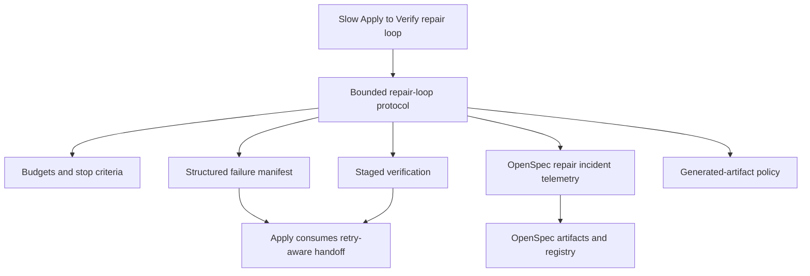

# Proposal: Bounded Developer Team Repair Loops

## Problem / Motivation

The prior Developer Team Apply → Verify → repair loop for release-gate failures was slow and difficult to bound. Exploration found repeated Apply and Verify-style sessions, prose-heavy handoffs, broad verification matrices, and no durable repair incident contract that clearly answered when to continue, retry, replan, escalate, or stop.

This change should improve Deck's runner-agnostic SDD workflow controls so repair loops remain productive, auditable, and bounded without replacing OpenSpec as the official source of truth.

## Goal

Define a runner-agnostic repair-loop protocol that bounds repeated Developer Team repairs with explicit budgets, structured failure manifests, staged verification, incident telemetry, generated-artifact handling, and improved Apply/Verify handoffs.

## Scope

### In Scope

- Define repair-loop budgets for incidents and failure fingerprints, including soft checkpoints and hard stop behavior.
- Define a structured failure manifest or repair incident contract for Apply/Verify handoffs.
- Define staged verification expectations: targeted checks first, affected-area checks second, broad release gates last.
- Define repair incident workflow states and telemetry that remain OpenSpec-backed and runner-agnostic.
- Define generated-artifact policy for repair loops, including host-specific generated outputs and regeneration evidence.
- Align the proposal direction with existing runtime concepts such as loop breaking, budget watchdogs, and artifact state management without requiring implementation details in this phase.

### Out of Scope

- Fixing the historical release-gate failures again.
- Creating OpenCode-only behavior in core Developer Team rules; OpenCode may be cited only as adapter evidence.
- Replacing OpenSpec registry state/events with adaptive memory, runner telemetry, or external logs.
- Implementing product code, changing prompts/skills/package files, or adding tests in this phase.
- Creating Spec, Design, Tasks, Apply, Verify, Review, or Archive artifacts in this phase.

## Affected Capabilities

> This section is the contract between Proposal and Spec/Design phases.

### New Capabilities

- `bounded-repair-loop-protocol`: Establishes budgets, stop/escalation criteria, and retry accounting for repeated Developer Team repair attempts.
- `repair-failure-manifest`: Provides a structured failure queue with fingerprints, evidence, ownership/routing, attempts, generated-artifact involvement, and next verification action.
- `staged-repair-verification`: Requires verification to progress from targeted checks to affected-area checks to broad release gates, with evidence at each stage.
- `repair-incident-telemetry`: Records repair incident lifecycle transitions and loop outcomes through OpenSpec-backed artifacts or registry-compatible events.
- `generated-artifact-repair-policy`: Classifies generated artifacts during repair loops and requires evidence when regenerated or intentionally committed.

### Modified Capabilities

- `developer-team-orchestration`: Adds bounded repair-loop handoff and escalation rules to the Developer Team workflow.
- `apply-verify-handoff`: Changes Apply/Verify interaction from prose-only summaries toward structured failure manifests and retry-aware updates.
- `openspec-registry-usage`: May add or clarify registry/event conventions for repair incident lifecycle tracking while preserving existing registry authority.

### Unchanged Capabilities

- `openspec-authority`: OpenSpec artifacts and registry entries remain the official change record.
- `runner-adapter-evidence`: Adapters may contribute evidence, but core behavior remains runner-agnostic.

## Proposed Approach

1. Specify a bounded repair-loop protocol with:
   - incident-level and fingerprint-level retry budgets;
   - soft checkpoints that require explicit continue/replan reasoning;
   - hard stops that require blocked/escalated status unless a human or higher-level workflow explicitly overrides.
2. Introduce a structured repair manifest contract, either as a dedicated repair incident artifact or as explicit required sections in existing phase artifacts, to capture:
   - normalized failure fingerprint;
   - failing contract or requirement;
   - evidence command and latest result;
   - owner/routing hint;
   - changed files and suspected scope;
   - retry count and previous attempt summary;
   - generated-artifact classification;
   - next verification stage.
3. Define staged verification rules so Verify reports the narrowest useful failing evidence first, then broadens only after targeted checks pass or when residual failures require classification.
4. Define repair incident lifecycle events such as started, retry-recorded, checkpoint-reached, replanned, escalated, blocked, and resolved using OpenSpec-compatible artifact and registry semantics.
5. Define generated-artifact handling rules that separate legitimate checked-in generated sources from stale, host-specific, or environment-sensitive generated outputs.
6. Let Design evaluate whether enforcement is prompt-only, artifact-schema-driven, runtime-backed, or staged across those levels.

## Affected Surfaces

| Surface | Expected Impact |
|---|---|
| `packages/core/src/teams/developer/orchestrator-content.ts` | Likely home for runner-agnostic Developer Team repair-loop rules, handoff expectations, and escalation language. |
| `packages/adapter-opencode/src/command-generation.ts` | May need adapter-local command wording updates that reflect core repair-loop protocol without making behavior OpenCode-only. |
| `packages/sdd-runtime/src/orchestrator/loop-breaker.ts` | Existing failure fingerprint and threshold concepts may inform the repair-loop contract or later enforcement. |
| `packages/sdd-runtime/src/orchestrator/budget-watchdog.ts` | Existing budget checks may inform soft/hard budget semantics. |
| `packages/sdd-runtime/src/artifact-state/artifact-state-manager.ts` | Relevant if repair manifests or incidents become structured OpenSpec artifacts with safe update requirements. |
| `openspec/registry-schema.md` | May need registry/event convention clarification if repair incident lifecycle events are formalized. |
| `docs/prompt-methodology-modules.md` | May need methodology updates to document bounded repair-loop behavior. |

## Alternatives and Tradeoffs

| Alternative | Why Considered | Why Not Chosen as Sole Direction |
|---|---|---|
| Prompt-only bounded repair protocol | Fastest path and runner-agnostic. | Harder to enforce and may drift without artifact contracts or telemetry. |
| Dedicated repair incident artifact | Durable, auditable, and OpenSpec-backed. | Adds workflow overhead; Design must ensure it scales down for small repairs. |
| Runtime-backed enforcement | Strongest budget and loop-break behavior using existing runtime concepts. | Higher implementation complexity; should be designed after requirements are explicit. |
| Minimal Verify staging only | Directly reduces broad, repeated verification cycles. | Does not solve retry budgets, escalation, generated artifacts, or incident history by itself. |

## Risks and Mitigations

| Risk | Likelihood | Mitigation |
|---|---|---|
| Repair loops stop too early and block useful fixes. | Medium | Include soft checkpoints, explicit override/escalation paths, and human-readable rationale requirements. |
| New repair artifacts become paperwork. | Medium | Tie required fields to phase gates, handoff quality, and verification decisions; allow lightweight representation when incidents are small. |
| Runner-specific telemetry leaks into core behavior. | Medium | Define core semantics in runner-agnostic terms and keep adapter session IDs or logs optional evidence only. |
| Generated-artifact policy misclassifies legitimate committed generated sources. | Medium | Require classification plus regeneration evidence rather than blanket rejection of generated files. |
| Staged Verify misses cross-cutting regressions. | Low-Medium | Require broad gates after targeted/affected checks pass or when the stage rationale says broad verification is necessary. |

## Rollback Plan

- Revert the OpenSpec change before implementation if Spec or Design finds the workflow too broad, unsafe, or not implementable.
- If implemented later and the protocol causes regressions, revert the prompt/methodology/runtime changes that introduced bounded repair-loop enforcement while keeping archived proposal/spec/design context for audit.
- If a new repair incident artifact or registry convention proves too heavy, fall back to required sections in existing Apply/Verify artifacts and mark runtime enforcement as deferred.
- Preserve OpenSpec registry history during rollback; do not delete historical events unless the normal archive/abandon workflow explicitly requires it.

## Dependencies

- Existing OpenSpec registry schema and artifact authority.
- Existing Developer Team phase contracts for Explorer, Apply, and Verify.
- Existing runtime concepts for loop breaking, budgets, and artifact-state safety, if Design chooses runtime-backed enforcement.
- Project language policy requiring generated artifacts and internal Developer Team communication to remain English.

## Open Questions

- Should the repair incident be a dedicated artifact, an extension of `apply-progress.md` and `verify-report.md`, or a hybrid?
- What default budgets should apply to interactive mode versus automated mode?
- Which manifest fields must be machine-readable in the first implementation, and which may remain structured markdown initially?
- Should failure fingerprints align exactly with the existing runtime `FailureFingerprint` shape, or should OpenSpec define a higher-level schema first?
- What telemetry is mandatory in core OpenSpec artifacts versus optional runner adapter metadata?

## Success Criteria

- Future repeated Developer Team repair loops have explicit retry budgets and stop/escalation criteria.
- Verify can return a structured failure manifest that Apply can consume without reconstructing failure context from prose.
- Repair progress records staged verification evidence and residual-failure classification.
- Generated artifacts involved in repair loops are classified with regeneration or legitimacy evidence.
- Runner-specific adapter data remains optional evidence and does not define core behavior.

## Acceptance Direction

- [ ] Spec defines formal requirements for repair budgets, failure manifests, staged verification, repair incident lifecycle, generated-artifact policy, and Apply/Verify handoff quality.
- [ ] Design identifies concrete files/modules to update and chooses the enforcement layer or staged enforcement path.
- [ ] Later implementation can be verified with tests or artifact validation that demonstrate retry accounting, staged verification, and handoff preservation.
- [ ] Registry and artifact changes preserve existing OpenSpec history and avoid runner-specific core semantics.

## Next Steps

Ready for Spec (`deck-developer-spec`) and Design (`deck-developer-design`) in parallel.

## Mermaid Summary Source

