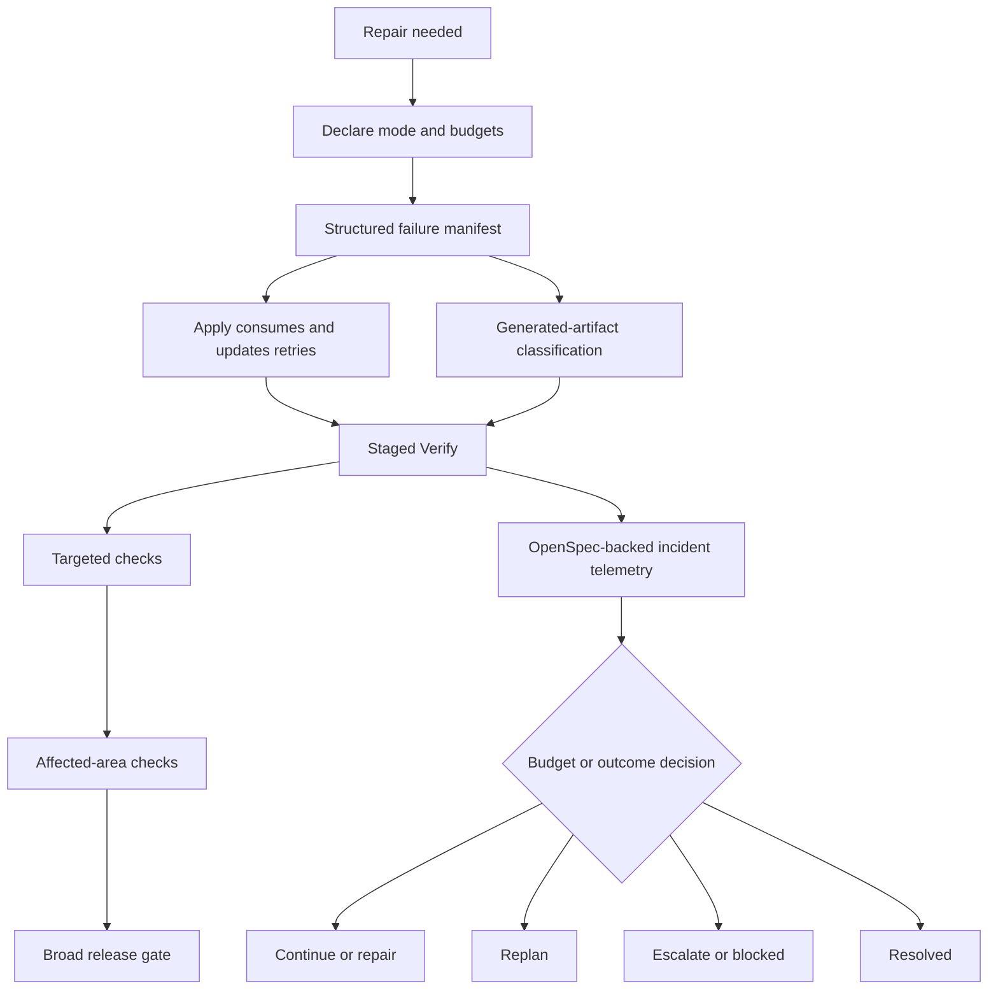

# Spec: Bounded Developer Team Repair Loops

## Source

- Exploration: `openspec/changes/bounded-developer-team-repair-loops/exploration.md`
- Proposal: `openspec/changes/bounded-developer-team-repair-loops/proposal.md`
- Capabilities affected:
  - `bounded-repair-loop-protocol`
  - `repair-failure-manifest`
  - `staged-repair-verification`
  - `repair-incident-telemetry`
  - `generated-artifact-repair-policy`
  - `developer-team-orchestration`
  - `apply-verify-handoff`
  - `openspec-registry-usage`
  - `openspec-authority`
  - `runner-adapter-evidence`

## Scope Boundary

This spec defines externally observable Developer Team repair-loop behavior. It does not choose whether the implementation is prompt-only, artifact-schema-driven, runtime-backed, or staged across those layers. It does not prescribe exact internal file structures, parser implementations, runtime APIs, or adapter-specific session mechanisms.

OpenSpec artifacts and Spec Registry entries remain the official record. Runner-specific identifiers, logs, transcript links, or session metadata MAY be attached only as optional evidence and MUST NOT define core repair-loop state.

## Requirements

### Capability: Bounded Repair Loop Protocol

REQ-BRL-001: A repair loop MUST declare its operating mode and applicable repair budgets before the first retry attempt is started.
  Priority: MUST
  Surface: General
  Rationale: Repair attempts must be bounded from the beginning instead of after repeated failures have already occurred.

REQ-BRL-002: Repair budgets MUST include incident-level limits and failure-fingerprint-level limits for retry attempts and verification cycles.
  Priority: MUST
  Surface: Data
  Rationale: A broad incident and a repeated individual failure can exhaust budget independently.

REQ-BRL-003: Repair budgets SHOULD include elapsed-time or equivalent progress-budget dimensions when the execution surface can observe them.
  Priority: SHOULD
  Surface: General
  Rationale: Prior loops were slow because time was not an explicit loop-control signal.

REQ-BRL-004: A soft checkpoint MUST require an explicit decision to continue, replan, escalate, or stop, including the current budget state and rationale.
  Priority: MUST
  Surface: General
  Rationale: Soft limits should trigger deliberate control-flow decisions rather than silent retries.

REQ-BRL-005: A hard stop MUST prevent further automatic repair attempts for the exhausted scope unless an explicit higher-level or human override is recorded.
  Priority: MUST
  Surface: Permission
  Rationale: Hard limits are not meaningful if automation can continue without authorization.

REQ-BRL-006: Every repair-loop decision MUST use one of these observable outcomes: continue, repair, replan, escalate, blocked, or resolved.
  Priority: MUST
  Surface: General
  Rationale: Common outcome labels allow Apply, Verify, and Orchestrator handoffs to remain consistent.

### Capability: Repair Failure Manifest

REQ-RFM-001: Verify MUST produce a structured failure manifest when it reports repairable or unresolved failures after an Apply attempt.
  Priority: MUST
  Surface: Data
  Rationale: Apply must not reconstruct repair context from prose-only verification output.

REQ-RFM-002: Each manifest item MUST include a normalized failure fingerprint, failing contract or requirement, evidence command or check, latest observed result, and next verification action.
  Priority: MUST
  Surface: Data
  Rationale: These fields identify the failure, why it matters, how it was observed, and how it should be rechecked.

REQ-RFM-003: Each manifest item MUST include ownership or routing guidance, suspected scope, changed files when known, retry count, and previous attempt summary.
  Priority: MUST
  Surface: Integration
  Rationale: Apply routing and retry accounting require durable handoff context.

REQ-RFM-004: Each manifest item MUST include generated-artifact involvement using the classifications defined by this spec.
  Priority: MUST
  Surface: Data
  Rationale: Generated artifacts were a concrete prior failure mode and must be visible in repair decisions.

REQ-RFM-005: Manifest updates MUST preserve prior attempts and evidence for each fingerprint instead of replacing history with only the latest prose summary.
  Priority: MUST
  Surface: Data
  Rationale: Retry limits and escalation decisions depend on accumulated history.

REQ-RFM-006: The manifest representation MUST be structured enough for consistent human review and future machine validation, while the exact serialization format is deferred to Design.
  Priority: MUST
  Surface: Data
  Rationale: The first spec must define required content without prematurely choosing a concrete storage design.

### Capability: Staged Repair Verification

REQ-SRV-001: Verify MUST run or request the narrowest useful targeted check for each active failure fingerprint before broad verification is treated as the primary repair signal.
  Priority: MUST
  Surface: General
  Rationale: Targeted checks reduce repeated broad loops and provide actionable failure evidence.

REQ-SRV-002: Verify MUST progress to affected-area checks after targeted checks pass or when targeted checks cannot isolate the failure, recording the reason.
  Priority: MUST
  Surface: General
  Rationale: Repairs can have local side effects that targeted checks alone may miss.

REQ-SRV-003: Verify MUST reserve broad release gates for after targeted and affected-area checks pass, or for cases where a recorded rationale says broad verification is necessary earlier.
  Priority: MUST
  Surface: General
  Rationale: Broad gates remain necessary but should not be the default repeated inner-loop check.

REQ-SRV-004: Each verification stage MUST record evidence, outcome, and residual-failure classification.
  Priority: MUST
  Surface: Data
  Rationale: Apply and Orchestrator need to know whether failures are fixed, unchanged, new, pre-existing, blocked, or out of scope.

REQ-SRV-005: Verification MUST NOT mark a repair loop resolved until required targeted, affected-area, and broad verification obligations are satisfied or explicitly waived with rationale.
  Priority: MUST
  Surface: General
  Rationale: Resolution must reflect staged confidence, not only a single narrow pass.

### Capability: Repair Incident Telemetry

REQ-RIT-001: A repair incident MUST have an observable lifecycle state whenever a failure requires repeated Developer Team repair attempts.
  Priority: MUST
  Surface: Data
  Rationale: Durable state is needed to know whether the loop is active, checkpointed, escalated, blocked, or resolved.

REQ-RIT-002: Repair incident telemetry MUST record lifecycle transitions for started, retry-recorded, checkpoint-reached, replanned, escalated, blocked, and resolved outcomes when those outcomes occur.
  Priority: MUST
  Surface: Data
  Rationale: These transitions are the audit trail for loop-control decisions.

REQ-RIT-003: Each lifecycle transition MUST include phase, outcome, reason, related fingerprint or incident scope, and budget state.
  Priority: MUST
  Surface: Data
  Rationale: Transitions must explain what changed and why.

REQ-RIT-004: Repair incident telemetry MUST be OpenSpec-backed through artifacts, registry-compatible events, or both; the exact representation is deferred to Design.
  Priority: MUST
  Surface: Integration
  Rationale: OpenSpec remains the official authority while Design chooses the least disruptive representation.

REQ-RIT-005: Repair incident telemetry MAY include runner-specific evidence fields only when the core transition remains understandable without them.
  Priority: MAY
  Surface: Integration
  Rationale: Runner metadata can aid debugging but must not become required for core behavior.

### Capability: Generated-Artifact Repair Policy

REQ-GAR-001: Any repair involving generated or potentially generated files MUST classify each such file as not generated, stable checked-in generated source, regenerated portable output, environment-sensitive generated output, stale generated output, or unknown.
  Priority: MUST
  Surface: Data
  Rationale: Generated-artifact handling must distinguish legitimate generated sources from stale or host-specific output.

REQ-GAR-002: Environment-sensitive or stale generated output MUST NOT be accepted as repaired unless regeneration evidence or a portability rationale is recorded.
  Priority: MUST
  Surface: General
  Rationale: Prior evidence showed a host-specific generated target committed during repair.

REQ-GAR-003: Stable checked-in generated sources MAY remain part of a repair when the manifest records why they are legitimate and how they were validated.
  Priority: MAY
  Surface: General
  Rationale: The policy must avoid blanket rejection of legitimate committed generated sources.

REQ-GAR-004: Unknown generated-artifact status MUST be treated as a repair risk and routed for explicit classification before broad verification is considered sufficient.
  Priority: MUST
  Surface: General
  Rationale: Ambiguity about generated outputs can hide portability regressions.

REQ-GAR-005: Generated-artifact decisions MUST be included in the Apply/Verify handoff when generated files are changed, suspected, or used as evidence.
  Priority: MUST
  Surface: Integration
  Rationale: Both phases need the same generated-artifact context.

### Capability: Apply/Verify Handoff

REQ-AVH-001: Verify MUST hand unresolved repair failures to Apply using the structured failure manifest contract rather than prose-only summaries.
  Priority: MUST
  Surface: Integration
  Rationale: Repair loops need durable and retry-aware phase handoffs.

REQ-AVH-002: Apply MUST consume existing manifest entries, update retry accounting for attempted fingerprints, and preserve prior Verify evidence.
  Priority: MUST
  Surface: Integration
  Rationale: Apply must continue the incident record instead of restarting context each time.

REQ-AVH-003: Apply MUST NOT start a repair attempt when required manifest fields for the target failure are missing, unless it records a clarification, replan, or blocked outcome.
  Priority: MUST
  Surface: General
  Rationale: Missing handoff context should be surfaced rather than silently guessed.

REQ-AVH-004: After Apply changes are made, the next Verify pass MUST use the manifest's next verification action and staged verification state as its starting point.
  Priority: MUST
  Surface: Integration
  Rationale: Verify should validate the intended repair path before broadening scope.

REQ-AVH-005: If Verify discovers new failures while checking a repair, it MUST classify them as same fingerprint, new related fingerprint, pre-existing, out of scope, or blocker.
  Priority: MUST
  Surface: Data
  Rationale: Residual or new failures must not be folded into undifferentiated loop noise.

### Capability: OpenSpec Authority and Runner-Agnostic Telemetry Boundaries

REQ-ORT-001: OpenSpec artifacts and Spec Registry entries MUST remain the official source for repair incident state, manifest content, decisions, and lifecycle outcomes.
  Priority: MUST
  Surface: Integration
  Rationale: The proposal explicitly preserves OpenSpec authority.

REQ-ORT-002: Adaptive memory, runner logs, and external telemetry MUST NOT replace or override OpenSpec repair-loop records.
  Priority: MUST
  Surface: Integration
  Rationale: Auxiliary evidence cannot become the authoritative workflow state.

REQ-ORT-003: Core repair-loop requirements MUST be runner-agnostic and testable without OpenCode-specific sessions, transcript identifiers, or logs.
  Priority: MUST
  Surface: Integration
  Rationale: The change is for Deck behavior, not a single runner adapter.

REQ-ORT-004: Runner adapters MAY attach optional evidence when they preserve the same core outcomes and do not introduce adapter-only required fields.
  Priority: MAY
  Surface: Integration
  Rationale: Adapters can improve traceability while preserving portable semantics.

## Acceptance Scenarios

### Capability: Bounded Repair Loop Protocol

#### Scenario: Repair loop starts with declared budgets
**Given** a Developer Team repair is about to retry an unresolved failure
**When** the repair loop begins
**Then** the loop records operating mode, incident budget, fingerprint budget, verification-cycle limits, and initial outcome before the first retry
> Covers: REQ-BRL-001, REQ-BRL-002, REQ-BRL-006

#### Scenario: Soft checkpoint requires a control decision
**Given** a repair incident has reached a soft checkpoint for attempts, verification cycles, or observable elapsed progress
**When** the next phase attempts to continue the loop
**Then** it records the current budget state and an explicit continue, replan, escalate, or stop rationale before another repair attempt proceeds
> Covers: REQ-BRL-003, REQ-BRL-004, REQ-BRL-006

#### Scenario: Hard stop blocks automatic retries
**Given** a failure fingerprint has exhausted its hard retry budget
**When** an automatic repair phase attempts another retry for the same fingerprint
**Then** the attempt is not started and the loop records blocked or escalated status unless an explicit override is already recorded
> Covers: REQ-BRL-005, REQ-BRL-006

#### Scenario: Interactive override after hard stop
**Given** a hard stop has been reached in interactive mode
**When** a human or higher-level workflow explicitly authorizes continuation with rationale
**Then** the loop may continue and the override is visible in the repair-loop record
> Covers: REQ-BRL-005, REQ-BRL-006

#### Scenario: Automatic mode cannot silently exceed hard budget
**Given** a hard stop has been reached in automatic mode
**When** no explicit higher-level override is recorded
**Then** the loop reports blocked or escalated and does not perform additional automatic repair attempts for the exhausted scope
> Covers: REQ-BRL-005, REQ-BRL-006

### Capability: Repair Failure Manifest

#### Scenario: Verify returns structured failure manifest
**Given** Verify finds unresolved repairable failures after Apply
**When** Verify reports the result
**Then** it includes manifest entries with fingerprint, failing contract, evidence check, latest result, owner or routing, retry count, generated-artifact classification, and next verification action
> Covers: REQ-RFM-001, REQ-RFM-002, REQ-RFM-003, REQ-RFM-004

#### Scenario: Manifest preserves retry history
**Given** a manifest entry already exists for a failure fingerprint
**When** another Apply or Verify pass updates that fingerprint
**Then** the entry preserves prior attempt summaries and evidence while adding the latest result
> Covers: REQ-RFM-005, REQ-RFM-006

#### Scenario: Manifest can be reviewed consistently
**Given** an Orchestrator, Apply agent, or Verify agent reads the manifest
**When** it identifies active failures and next actions
**Then** it can distinguish fingerprints, retry counts, evidence, owner routing, generated-artifact status, and verification stage without relying on unrelated prose
> Covers: REQ-RFM-002, REQ-RFM-003, REQ-RFM-004, REQ-RFM-006

#### Scenario: Missing manifest for unresolved failures is invalid
**Given** Verify reports unresolved repairable failures
**When** no structured manifest content is provided
**Then** the handoff is treated as invalid and the next repair phase records clarification, replan, or blocked status rather than guessing the failure context
> Covers: REQ-RFM-001, REQ-AVH-003

### Capability: Staged Repair Verification

#### Scenario: Targeted check precedes broad verification
**Given** a manifest entry contains an active failure fingerprint with a next targeted check
**When** Verify starts after Apply
**Then** Verify runs or requests the targeted check before treating broad release gates as the primary signal
> Covers: REQ-SRV-001, REQ-AVH-004

#### Scenario: Affected-area checks follow targeted success
**Given** targeted checks for a repaired fingerprint pass
**When** Verify continues staged verification
**Then** Verify runs or records affected-area checks before broad release gates unless a rationale explains why that stage is not applicable
> Covers: REQ-SRV-002, REQ-SRV-004

#### Scenario: Broad gate is delayed or justified
**Given** targeted or affected-area checks have not yet passed
**When** Verify runs a broad release gate first
**Then** the report records why broad verification was necessary earlier and still preserves targeted or affected-area obligations
> Covers: REQ-SRV-003, REQ-SRV-004

#### Scenario: Resolution requires staged obligations
**Given** targeted checks pass but affected-area or broad obligations remain unresolved
**When** Verify reports loop status
**Then** it does not mark the incident resolved unless remaining obligations are satisfied or explicitly waived with rationale
> Covers: REQ-SRV-005

### Capability: Repair Incident Telemetry

#### Scenario: Incident starts when repeated repair is required
**Given** a failure requires repeated Developer Team repair attempts
**When** the repair loop is opened
**Then** an observable incident state is recorded with started transition, scope, budget state, phase, and reason
> Covers: REQ-RIT-001, REQ-RIT-002, REQ-RIT-003

#### Scenario: Retry is recorded against a fingerprint
**Given** Apply attempts to repair a manifest fingerprint
**When** the attempt is completed or handed back to Verify
**Then** telemetry records a retry-recorded transition with related fingerprint, outcome, reason, and updated budget state
> Covers: REQ-RIT-002, REQ-RIT-003

#### Scenario: Escalation is auditable without runner logs
**Given** a repair incident is escalated after budget pressure or unclear failure ownership
**When** the escalation is recorded
**Then** the OpenSpec-backed record contains enough phase, outcome, reason, scope, and budget information to understand the escalation without runner-specific logs
> Covers: REQ-RIT-003, REQ-RIT-004, REQ-RIT-005, REQ-ORT-003

#### Scenario: Resolution records final outcome
**Given** required staged verification obligations pass or are explicitly waived
**When** the incident is closed
**Then** telemetry records resolved status with final manifest outcome and budget state
> Covers: REQ-RIT-001, REQ-RIT-002, REQ-RIT-003

### Capability: Generated-Artifact Repair Policy

#### Scenario: Generated files are classified during repair
**Given** Apply changes or suspects generated files during a repair
**When** the handoff is updated
**Then** each relevant file receives one of the required generated-artifact classifications and supporting rationale when needed
> Covers: REQ-GAR-001, REQ-GAR-005

#### Scenario: Host-specific generated output is not accepted silently
**Given** a changed generated output appears environment-sensitive or stale
**When** Verify evaluates the repair
**Then** Verify requires regeneration evidence or portability rationale before considering the generated-artifact portion repaired
> Covers: REQ-GAR-002, REQ-GAR-004

#### Scenario: Legitimate checked-in generated source is allowed
**Given** a repair modifies a stable checked-in generated source
**When** Apply records why the source is legitimate and Verify records validation evidence
**Then** the repair may proceed without treating the file as an automatic blocker
> Covers: REQ-GAR-003, REQ-GAR-005

#### Scenario: Unknown generated status remains a risk
**Given** a potentially generated file cannot be classified
**When** Verify reaches broad verification
**Then** the unknown status is recorded as a risk requiring explicit classification before broad verification alone can resolve the incident
> Covers: REQ-GAR-004, REQ-SRV-005

### Capability: Apply/Verify Handoff

#### Scenario: Verify handoff is structured for Apply
**Given** Verify identifies unresolved failures after an Apply pass
**When** Verify returns control to Apply
**Then** the handoff includes the structured manifest and not only prose summary text
> Covers: REQ-AVH-001, REQ-RFM-001

#### Scenario: Apply updates existing retry accounting
**Given** Apply receives a manifest with prior attempts for a fingerprint
**When** Apply attempts a repair for that fingerprint
**Then** it updates retry count and attempt summary while preserving prior Verify evidence
> Covers: REQ-AVH-002, REQ-RFM-005

#### Scenario: Incomplete handoff blocks guessing
**Given** Apply receives an unresolved failure without required manifest fields
**When** Apply evaluates whether to repair
**Then** Apply records clarification, replan, or blocked status instead of inventing missing failure context
> Covers: REQ-AVH-003

#### Scenario: New residual failure is classified
**Given** Verify checks a repair and observes a failure not previously recorded in the manifest
**When** Verify updates the result
**Then** it classifies the failure as same fingerprint, new related fingerprint, pre-existing, out of scope, or blocker
> Covers: REQ-AVH-005, REQ-SRV-004

### Capability: OpenSpec Authority and Runner-Agnostic Telemetry Boundaries

#### Scenario: OpenSpec is authoritative
**Given** OpenSpec repair-loop records and runner logs disagree
**When** the Developer Team decides the repair incident state
**Then** OpenSpec artifacts and registry-compatible records determine official state unless updated through the normal OpenSpec workflow
> Covers: REQ-ORT-001, REQ-ORT-002

#### Scenario: Runner evidence remains optional
**Given** an adapter provides session IDs, transcript links, or log references
**When** repair telemetry is recorded
**Then** those fields are optional evidence and the core incident state remains understandable without them
> Covers: REQ-ORT-003, REQ-ORT-004, REQ-RIT-005

#### Scenario: Core behavior can be tested without OpenCode
**Given** a non-OpenCode runner executes the Developer Team workflow
**When** it follows the repair-loop protocol
**Then** it can satisfy budgets, manifest, staged verification, incident telemetry, and handoff requirements without OpenCode-specific identifiers
> Covers: REQ-ORT-003, REQ-ORT-004

## Validation Rules

| Field / Input | Rule | Error Message | REQ-ID |
|---|---|---|---|
| operating mode | MUST be declared before first retry and identify interactive or automatic behavior | Repair loop cannot start without an operating mode. | REQ-BRL-001 |
| incident budget | MUST include retry and verification-cycle limits for the incident | Repair incident is missing required incident budget. | REQ-BRL-002 |
| fingerprint budget | MUST include retry and verification-cycle limits per active fingerprint | Failure fingerprint is missing required budget. | REQ-BRL-002 |
| soft checkpoint decision | MUST include budget state, outcome, and rationale | Soft checkpoint requires continue, replan, escalate, or stop rationale. | REQ-BRL-004 |
| hard stop override | MUST be explicit before additional automatic repair proceeds | Hard stop reached; additional automatic repair is not allowed without override. | REQ-BRL-005 |
| failure fingerprint | MUST be normalized and present for each unresolved manifest item | Manifest item is missing normalized failure fingerprint. | REQ-RFM-002 |
| failing contract | MUST identify the failed requirement, test contract, gate, or externally observable behavior | Manifest item is missing failing contract. | REQ-RFM-002 |
| evidence check | MUST identify the command, check, or verification evidence and latest result | Manifest item is missing latest evidence. | REQ-RFM-002 |
| retry count | MUST be present and updated when Apply attempts the fingerprint | Manifest item is missing retry accounting. | REQ-RFM-003 |
| generated-artifact classification | MUST use an allowed classification when generated files are involved or suspected | Generated-artifact status is missing or invalid. | REQ-RFM-004, REQ-GAR-001 |
| next verification action | MUST identify the next staged verification action | Manifest item is missing next verification action. | REQ-RFM-002, REQ-AVH-004 |
| residual failure classification | MUST classify residual or new failures using allowed categories | Residual failure classification is missing or invalid. | REQ-SRV-004, REQ-AVH-005 |
| runner metadata | MUST be optional and non-authoritative | Runner metadata cannot be required for core repair-loop state. | REQ-ORT-002, REQ-ORT-004 |

## Error Contracts

| Condition | Error Code | Message | Status |
|---|---|---|---|
| Repair loop begins without declared mode or budgets | REPAIR_BUDGET_MISSING | Repair loop cannot start because required budget information is missing. | blocked |
| Soft checkpoint reached without decision rationale | REPAIR_CHECKPOINT_DECISION_REQUIRED | Repair loop reached a checkpoint and needs an explicit continue, replan, escalate, or stop decision. | blocked |
| Hard stop reached without override | REPAIR_HARD_STOP_REACHED | Repair budget is exhausted; additional automatic repair is not allowed. | escalated or blocked |
| Verify reports unresolved failures without a structured manifest | REPAIR_MANIFEST_REQUIRED | Verify must provide a structured failure manifest for unresolved repair failures. | blocked |
| Manifest item lacks required fields | REPAIR_MANIFEST_INVALID | Repair manifest is missing required failure, evidence, routing, budget, generated-artifact, or next-action fields. | blocked |
| Generated artifact is stale, environment-sensitive, or unknown without evidence | GENERATED_ARTIFACT_EVIDENCE_REQUIRED | Generated-artifact repair requires classification and regeneration or portability evidence. | blocked |
| Broad verification is used early without stage rationale | VERIFY_STAGE_RATIONALE_REQUIRED | Broad verification requires targeted and affected-area context or an explicit early-broad rationale. | blocked |
| Runner metadata is treated as authoritative state | RUNNER_METADATA_NOT_AUTHORITATIVE | Runner-specific metadata may be evidence only and cannot replace OpenSpec state. | blocked |

## States and Transitions

### States

| State | Description | Entry Criteria |
|---|---|---|
| not-started | No repair incident is active for the failure scope. | Failure has not required repeated repair attempts. |
| active | A repair incident is open and within hard budget. | Incident started with declared mode and budgets. |
| checkpointed | Soft budget checkpoint has been reached and a control decision is required or recorded. | Attempt, verification-cycle, or observable progress threshold reaches soft limit. |
| repairing | Apply is attempting a manifest-backed repair for one or more fingerprints. | Active incident has a valid repair decision and manifest target. |
| verifying | Verify is executing staged verification for repaired fingerprints. | Apply has returned repair evidence and next verification action. |
| replanned | The loop has changed plan, scope, routing, or verification strategy. | Checkpoint or blocker decision records replan outcome. |
| escalated | The loop needs higher-level or human attention. | Budget pressure, ownership ambiguity, or hard stop records escalation. |
| blocked | The loop cannot continue under current requirements. | Required manifest, budget, generated-artifact evidence, or authorization is missing. |
| resolved | Required verification obligations pass or are explicitly waived with rationale. | Verify records final successful or waived outcome. |

### Transitions

| From | To | Trigger | Side Effects |
|---|---|---|---|
| not-started | active | Repeated repair is required and budgets are declared. | Records started transition and initial budget state. |
| active | repairing | Apply accepts a valid manifest-backed repair target. | Records retry intent for selected fingerprint scope. |
| repairing | verifying | Apply completes or stops the repair attempt. | Updates attempt summary and next verification action. |
| verifying | active | Verification finds unresolved failures within budget. | Updates manifest evidence and residual classifications. |
| verifying | resolved | Required staged checks pass or are waived with rationale. | Records resolved transition and final budget state. |
| active | checkpointed | Soft budget threshold is reached. | Requires explicit continue, replan, escalate, or stop decision. |
| checkpointed | active | Continue decision is recorded. | Records checkpoint rationale and preserved budget state. |
| checkpointed | replanned | Replan decision is recorded. | Records changed plan, routing, scope, or verification strategy. |
| checkpointed | escalated | Escalation decision is recorded. | Records escalation reason and owner or audience. |
| active | blocked | Required handoff fields, evidence, or authorization are missing. | Stops current repair progression until resolved. |
| active | escalated | Hard stop is reached or ownership cannot be resolved. | Prevents further automatic repair for exhausted scope without override. |
| escalated | active | Explicit higher-level or human override is recorded. | Records override rationale and revised budget or continuation scope. |

## Design-Deferred Decisions and Blocker Handling

- Dedicated artifact versus required sections: Design MUST choose whether repair incidents and manifests are represented as a dedicated artifact, extensions to existing Apply/Verify artifacts, registry-compatible events, or a hybrid. This is not a spec blocker because required content and behavior are defined here.
- Default numeric budgets: Design MUST propose defaults for interactive and automatic modes. This spec requires budget presence and behavior but intentionally does not set numeric limits.
- Machine-readable serialization: Design MUST decide which fields are machine-validated in the first implementation and which are structured markdown initially. This spec requires the contract fields and consistent reviewability.
- Runtime alignment: Design MUST decide whether and how the manifest fingerprint shape aligns with existing runtime failure fingerprint concepts. This spec requires normalized fingerprints but does not mandate an internal type shape.
- Core telemetry versus optional runner metadata: This spec defines core required transition fields and optional runner-evidence boundaries. Design MUST place those fields in the chosen artifact or registry representation.

## Open Questions

- Should the repair incident be a dedicated artifact, an extension of `apply-progress.md` and `verify-report.md`, or a hybrid?
- What default budgets should apply to interactive mode versus automated mode?
- Which manifest fields must be machine-readable in the first implementation, and which may remain structured markdown initially?
- Should failure fingerprints align exactly with the existing runtime `FailureFingerprint` shape, or should OpenSpec define a higher-level schema first?
- What telemetry is mandatory in core OpenSpec artifacts versus optional runner adapter metadata beyond the minimum fields in this spec?

## Compliance Matrix

| REQ-ID | Scenario(s) | Status |
|---|---|---|
| REQ-BRL-001 | Repair loop starts with declared budgets | Defined |
| REQ-BRL-002 | Repair loop starts with declared budgets | Defined |
| REQ-BRL-003 | Soft checkpoint requires a control decision | Defined |
| REQ-BRL-004 | Soft checkpoint requires a control decision | Defined |
| REQ-BRL-005 | Hard stop blocks automatic retries; Interactive override after hard stop; Automatic mode cannot silently exceed hard budget | Defined |
| REQ-BRL-006 | Repair loop starts with declared budgets; Soft checkpoint requires a control decision; Hard stop blocks automatic retries; Interactive override after hard stop; Automatic mode cannot silently exceed hard budget | Defined |
| REQ-RFM-001 | Verify returns structured failure manifest; Missing manifest for unresolved failures is invalid; Verify handoff is structured for Apply | Defined |
| REQ-RFM-002 | Verify returns structured failure manifest; Manifest can be reviewed consistently | Defined |
| REQ-RFM-003 | Verify returns structured failure manifest; Manifest can be reviewed consistently | Defined |
| REQ-RFM-004 | Verify returns structured failure manifest; Manifest can be reviewed consistently | Defined |
| REQ-RFM-005 | Manifest preserves retry history; Apply updates existing retry accounting | Defined |
| REQ-RFM-006 | Manifest preserves retry history; Manifest can be reviewed consistently | Defined |
| REQ-SRV-001 | Targeted check precedes broad verification | Defined |
| REQ-SRV-002 | Affected-area checks follow targeted success | Defined |
| REQ-SRV-003 | Broad gate is delayed or justified | Defined |
| REQ-SRV-004 | Affected-area checks follow targeted success; Broad gate is delayed or justified; New residual failure is classified | Defined |
| REQ-SRV-005 | Resolution requires staged obligations; Unknown generated status remains a risk | Defined |
| REQ-RIT-001 | Incident starts when repeated repair is required; Resolution records final outcome | Defined |
| REQ-RIT-002 | Incident starts when repeated repair is required; Retry is recorded against a fingerprint; Resolution records final outcome | Defined |
| REQ-RIT-003 | Incident starts when repeated repair is required; Retry is recorded against a fingerprint; Escalation is auditable without runner logs; Resolution records final outcome | Defined |
| REQ-RIT-004 | Escalation is auditable without runner logs | Defined |
| REQ-RIT-005 | Escalation is auditable without runner logs; Runner evidence remains optional | Defined |
| REQ-GAR-001 | Generated files are classified during repair | Defined |
| REQ-GAR-002 | Host-specific generated output is not accepted silently | Defined |
| REQ-GAR-003 | Legitimate checked-in generated source is allowed | Defined |
| REQ-GAR-004 | Host-specific generated output is not accepted silently; Unknown generated status remains a risk | Defined |
| REQ-GAR-005 | Generated files are classified during repair; Legitimate checked-in generated source is allowed | Defined |
| REQ-AVH-001 | Verify handoff is structured for Apply | Defined |
| REQ-AVH-002 | Apply updates existing retry accounting | Defined |
| REQ-AVH-003 | Missing manifest for unresolved failures is invalid; Incomplete handoff blocks guessing | Defined |
| REQ-AVH-004 | Targeted check precedes broad verification | Defined |
| REQ-AVH-005 | New residual failure is classified | Defined |
| REQ-ORT-001 | OpenSpec is authoritative | Defined |
| REQ-ORT-002 | OpenSpec is authoritative | Defined |
| REQ-ORT-003 | Escalation is auditable without runner logs; Runner evidence remains optional; Core behavior can be tested without OpenCode | Defined |
| REQ-ORT-004 | Runner evidence remains optional; Core behavior can be tested without OpenCode | Defined |

## Mermaid Summary Source

