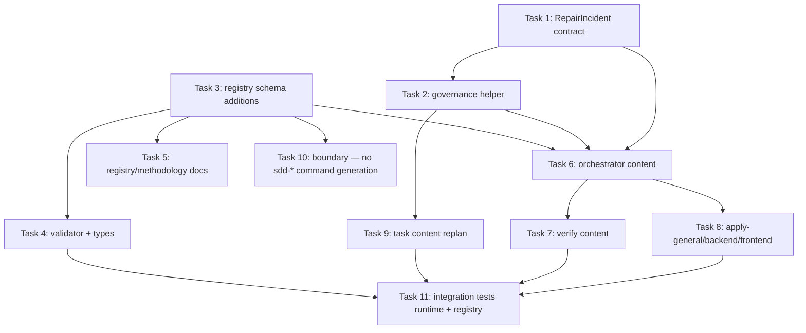

# Tasks: Bounded Developer Team Repair Loops

## Source

- Spec: `openspec/changes/bounded-developer-team-repair-loops/spec.md` (36 requirements, 28 scenarios)
- Design: `openspec/changes/bounded-developer-team-repair-loops/design.md` (artifact-first staged enforcement)
- Proposal: `openspec/changes/bounded-developer-team-repair-loops/proposal.md`
- Exploration: `openspec/changes/bounded-developer-team-repair-loops/exploration.md`

## Capabilities affected

- `bounded-repair-loop-protocol`
- `repair-failure-manifest`
- `staged-repair-verification`
- `repair-incident-telemetry`
- `generated-artifact-repair-policy`
- `developer-team-orchestration`
- `apply-verify-handoff`
- `openspec-registry-usage`
- `openspec-authority`
- `runner-adapter-evidence`

## Execution Groups

Tasks are organized into three execution groups ordered by dependency. Contracts and registry land first; core Developer Team content second; adapter wording and cross-cutting tests last.

### Group A — Shared / Contracts (foundation)

This group defines the runtime contracts, the governance helper that reuses existing primitives, and the registry schema additions. Everything in Group B depends on these contracts and event names existing.

#### Task 1: Define `RepairIncident` runtime contract and validator

**Owner**: General Apply
**Priority**: P0
**Complexity**: Medium
**Parallel**: No — foundation for Tasks 2, 3, 4
**Depends on**: none
**Blocker Classification**: unblocked

**Description**
Create a new runner-agnostic TypeScript module that defines `RepairIncident`, `RepairFailureEntry`, generated-artifact classification, lifecycle event, and budget types exactly as specified by Design (YAML-in-Markdown, schema `repair-incident-v1`). Provide a `parseRepairIncidentYAML()` helper that validates required fields, normalizes the failure fingerprint, and returns a structured `RepairIncidentValidationResult`. Reuse existing `loop-breaker.FailureFingerprint` shape as the canonical fingerprint; do not duplicate fields.

**Files**
- `packages/sdd-runtime/src/contracts/repair-incident.ts` — create
- `packages/sdd-runtime/src/contracts/repair-incident.test.ts` — create
- `packages/sdd-runtime/src/contracts/index.ts` — modify (re-export new contract)

**Verification**
- `bun test packages/sdd-runtime/src/contracts/repair-incident.test.ts` passes with: required-field rejections, allowed enum values for status / sourcePhase / errorClass / classification / nextVerificationStage / nextAction, and stable fingerprint normalization.
- Reuse verified by import-only (no duplication of `FailureFingerprint`).

#### Task 2: Implement `evaluateRepairIncident` governance helper

**Owner**: General Apply
**Priority**: P0
**Complexity**: Medium
**Parallel**: No — required by Tasks 6, 7, 8
**Depends on**: Task 1
**Blocker Classification**: allowed-with-placeholder — uses existing `DEFAULT_BUDGET_CONFIG` / `DEFAULT_LOOP_BREAKER_CONFIG` as first-implementation defaults until a follow-up tunes numeric budgets.

**Description**
Add `packages/sdd-runtime/src/orchestrator/repair-loop-governance.ts` exposing `evaluateRepairIncident(incident, history, config)` that maps incident entries to existing `checkLoopCondition()` and `checkBudget()` decisions. Return `continue`, `repair`, `checkpoint`, `replan`, `escalate`, or `block`. Soft checkpoint returns when `checkBudget()` reports `soft_budget` or incident soft limits are reached. Hard stop returns when `checkBudget()` reports `hard_budget` or fingerprint count hits `escalationThreshold`. Hard stop in automatic mode requires an explicit override entry; interactive mode may continue with rationale. Do not change `loop-breaker.ts` or `budget-watchdog.ts` semantics.

**Files**
- `packages/sdd-runtime/src/orchestrator/repair-loop-governance.ts` — create
- `packages/sdd-runtime/src/orchestrator/repair-loop-governance.test.ts` — create

**Verification**
- `bun test packages/sdd-runtime/src/orchestrator/repair-loop-governance.test.ts` passes for: continue / repair / checkpoint / replan / escalate / block across all trigger conditions.
- Existing `loop-breaker.test.ts` and `budget-watchdog.test.ts` continue to pass with no semantic change.

#### Task 3: Extend registry schema with optional `repair_incident` key and known events

**Owner**: General Apply
**Priority**: P1
**Complexity**: Low
**Parallel**: Yes — independent of Tasks 1–2 once contract names are agreed (read Spec/Design)
**Depends on**: none
**Blocker Classification**: unblocked

**Description**
Add optional `repair_incident: repair-incident.md` to the OpenSpec registry schema artifact keys, and add the seven auxiliary repair lifecycle event names (`repair.started`, `repair.retry_recorded`, `repair.checkpoint_reached`, `repair.replanned`, `repair.escalated`, `repair.blocked`, `repair.resolved`) as known event names. Events must remain auxiliary (must NOT advance `currentPhase`). Add a small `REPAIR_INCIDENT_ARTIFACT_KIND` constant to `ValidatorArtifactKind` and `REPAIR_LIFECYCLE_EVENTS` set to `KNOWN_EVENT_NAMES`.

**Files**
- `packages/core/src/spec-registry/schema.ts` — modify
- `packages/core/src/spec-registry/schema.test.ts` — modify or create if absent (verify constants are exported)

**Verification**
- `bun test packages/core/src/spec-registry/schema.test.ts` (or wider `bun test packages/core/src/spec-registry/`) passes.
- New constants exported and present in `VALIDATOR_ARTIFACT_KINDS` and `KNOWN_EVENT_NAMES`.

#### Task 4: Update registry validator + types to accept repair telemetry (warning-first)

**Owner**: General Apply
**Priority**: P1
**Complexity**: Medium
**Parallel**: No — depends on Task 3 constants
**Depends on**: Task 3
**Blocker Classification**: unblocked

**Description**
Update `packages/core/src/spec-registry/validator.ts` to recognize the optional `repair_incident` artifact key (warning, not error, when missing despite repair events) and to accept the seven `repair.*` lifecycle events as known auxiliary events. Update `packages/core/src/spec-registry/types.ts` to expose `repair-incident` as an optional `ArtifactKind` if it is part of the public registry types surface. Per Design rollout, strict mode warns only; canonical mode accepts. Do not force legacy changes to add repair artifacts.

**Files**
- `packages/core/src/spec-registry/validator.ts` — modify
- `packages/core/src/spec-registry/types.ts` — modify
- `packages/core/src/spec-registry/validator.test.ts` — modify (add tests for repair events and optional repair_incident artifact)
- `packages/core/src/spec-registry/types.test.ts` — modify if affected

**Verification**
- `bun test packages/core/src/spec-registry/` passes.
- Validator accepts `repair.*` events without reporting `events.event.name_mismatch`.
- Validator warns (not errors) when `artifacts.repair_incident` is missing but events exist; errors only when phase is `apply`/`verify` and `repair_incident` is referenced but absent.

#### Task 5: Document registry schema and methodology for repair loops

**Owner**: General Apply
**Priority**: P2
**Complexity**: Low
**Parallel**: Yes — independent of code changes once Task 3 names are fixed
**Depends on**: Task 3
**Blocker Classification**: unblocked

**Description**
Update `openspec/registry-schema.md` to document the optional `repair_incident` artifact key, the seven auxiliary lifecycle events, and the warning-first strictness policy. Update `docs/prompt-methodology-modules.md` to add a "Bounded Repair Loop" methodology module listing budgets, manifest, staged verification, generated-artifact policy, and Apply/Verify handoff quality. Reference existing registry/methodology modules without rewriting them.

**Files**
- `openspec/registry-schema.md` — modify
- `docs/prompt-methodology-modules.md` — modify

**Verification**
- Manual review confirms the new sections match Task 3 constants exactly.
- No broken cross-references (check that existing table of registry artifact keys still lists all nine prior keys).

### Group B — Core Developer Team Content (prompt + content tests)

#### Task 6: Update orchestrator content with repair-loop launch, checkpoint, hard-stop, escalation, and registry reconciliation

**Owner**: General Apply
**Priority**: P0
**Complexity**: Medium
**Parallel**: No — defines the contract that Tasks 7, 8, 9 reference
**Depends on**: Tasks 1, 2, 3
**Blocker Classification**: allowed-with-placeholder — references existing loop/budget defaults from Task 2 until follow-up budget tuning; does not block first implementation.

**Description**
Extend `packages/core/src/teams/developer/orchestrator-content.ts` (and its test) so the Orchestrator Agent content includes:
- a repair-loop launch section that requires declared operating mode, incident budget, fingerprint budget, verification-cycle limits, and initial outcome before the first retry;
- soft checkpoint rules that require explicit continue / replan / escalate / stop rationale with budget state;
- hard-stop rules that forbid additional automatic repair for the exhausted scope unless an explicit higher-level or human override is recorded;
- registry reconciliation for `repair.*` auxiliary events and the optional `repair-incident.md` artifact when a repair loop starts;
- a guidance line pointing Apply agents at `evaluateRepairIncident()` for loop decisions.

**Files**
- `packages/core/src/teams/developer/orchestrator-content.ts` — modify
- `packages/core/src/teams/developer/orchestrator-content.test.ts` — modify

**Verification**
- `bun test packages/core/src/teams/developer/orchestrator-content.test.ts` passes with new assertions covering: declared-mode requirement, soft-checkpoint rationale, hard-stop override requirement, registry reconciliation of `repair.*` events, pointer to `evaluateRepairIncident()`.

#### Task 7: Update Verify content with staged verification and structured failure manifest

**Owner**: General Apply
**Priority**: P0
**Complexity**: Medium
**Parallel**: No — depends on Task 6 framing
**Depends on**: Task 6
**Blocker Classification**: unblocked

**Description**
Extend `packages/core/src/teams/developer/verify-content.ts` (and its test) so Verify content requires:
- targeted check first when `repair-incident.md` is present or when active fingerprints exist;
- affected-area checks after targeted checks pass, with a recorded reason when targeted checks cannot isolate the failure;
- broad release gate reserved for after targeted + affected-area pass, or recorded rationale when broad is run earlier;
- a structured failure manifest when Verify returns `FAIL` with `repairable` or `unresolved` outcome, including fingerprint, failing contract, evidence command + latest result, owner/routing hint, retry count, generated-artifact classification, and next verification action;
- residual-failure classification using the allowed categories (`same fingerprint`, `new related fingerprint`, `pre-existing`, `out of scope`, `blocker`).

**Files**
- `packages/core/src/teams/developer/verify-content.ts` — modify
- `packages/core/src/teams/developer/verify-content.test.ts` — modify

**Verification**
- `bun test packages/core/src/teams/developer/verify-content.test.ts` passes with new assertions covering staged sequencing, manifest field list, and residual classification.

#### Task 8: Update Apply content (general, backend, frontend) with repair-incident consumption, scoped retries, and generated-artifact evidence

**Owner**: General Apply
**Priority**: P0
**Complexity**: Medium
**Parallel**: Yes — across the three Apply content files once Task 6 framing lands
**Depends on**: Task 6
**Blocker Classification**: unblocked

**Description**
Extend each Apply content module so Apply agents:
- consume `repair-incident.md` if present, update retry accounting for attempted fingerprints, and preserve prior Verify evidence (REQ-AVH-002);
- refuse to start a repair when required manifest fields are missing and instead record `clarification`, `replan`, or `blocked` (REQ-AVH-003);
- classify each generated file touched or suspected as `not_generated`, `checked_in_deterministic`, `checked_in_environment_sensitive`, `untracked_build_output`, or `unknown`, with regeneration evidence for `checked_in_environment_sensitive` and `untracked_build_output` (REQ-GAR-001..005);
- redact runner session IDs, absolute user paths, tokens, and credentials in evidence excerpts (REQ-ORT-002, REQ-ORT-003);
- update next verification stage (`targeted` / `affected_area` / `broad_gate`) on the failure entry.

Apply-backend additionally requires that backend contracts (API/service/database) referenced from the manifest use the existing runtime fingerprint shape rather than inventing a new one.

Apply-frontend additionally requires that UI repairs preserve accessibility obligations (keyboard, ARIA) when a repair affects UI behavior.

**Files**
- `packages/core/src/teams/developer/apply-general-content.ts` — modify
- `packages/core/src/teams/developer/apply-general-content.test.ts` — modify
- `packages/core/src/teams/developer/apply-backend-content.ts` — modify
- `packages/core/src/teams/developer/apply-backend-content.test.ts` — modify
- `packages/core/src/teams/developer/apply-frontend-content.ts` — modify
- `packages/core/src/teams/developer/apply-frontend-content.test.ts` — modify

**Verification**
- `bun test packages/core/src/teams/developer/apply-general-content.test.ts packages/core/src/teams/developer/apply-backend-content.test.ts packages/core/src/teams/developer/apply-frontend-content.test.ts` passes with new assertions covering: retry-accounting update, missing-manifest refusal, generated-artifact classification, evidence redaction, accessibility preservation in frontend content.

#### Task 9: Update Task content with repair-replan guidance

**Owner**: General Apply
**Priority**: P1
**Complexity**: Low
**Parallel**: Yes — independent once Tasks 1–2 contract shapes are stable
**Depends on**: Task 2
**Blocker Classification**: unblocked

**Description**
Extend `packages/core/src/teams/developer/task-content.ts` so the Task Agent recognizes a repair-loop replan signal (loop decision `replan` or soft checkpoint asking for replan) and routes clarification to Spec, Design, or its own breakdown rather than another Apply retry. Include the rule that a Task replan MUST record a brief rationale and may add or modify tasks only inside the existing tasks artifact unless the spec/design contract changes.

**Files**
- `packages/core/src/teams/developer/task-content.ts` — modify
- `packages/core/src/teams/developer/task-content.test.ts` — modify

**Verification**
- `bun test packages/core/src/teams/developer/task-content.test.ts` passes with new assertion that replan language and rationale requirement are present.

### Group C — Adapter Boundary and Cross-Cutting Test Coverage

> **Boundary Clarification** (per user clarification; takes precedence over any Group C description below): Deck does NOT own, install, generate, or manage OpenCode commands named `sdd-*` (including `sdd-apply`, `sdd-verify`, `sdd-continue`). Repair-loop guidance belongs in Developer Team content/skills, not in OpenCode `sdd-*` commands. Existing installed `sdd-*` user files are not deleted by Deck; any cleanup is user/manual or a separately authorized change.

#### Task 10: Enforce Developer Team install boundary — no `sdd-*` command generation

**Owner**: General Apply
**Priority**: P0
**Complexity**: Low
**Parallel**: No — must precede any integration coverage that previously assumed adapter-generated `sdd-*` repair-incident wording (Task 11)
**Depends on**: Task 3
**Blocker Classification**: unblocked

**Description**
Per the user clarification and the design Boundary Clarification, the OpenCode Developer Team install must NOT generate, write, or manage OpenCode commands named `sdd-*` (including `sdd-apply`, `sdd-verify`, and `sdd-continue`). Replace any prior adapter-side repair-incident handoff wording in `packages/adapter-opencode/src/command-generation.ts` with a boundary assertion:

- Remove `sdd-*` command-generation paths and any repair-incident handoff wording from `packages/adapter-opencode/src/command-generation.ts`. The earlier adapter-side repair-incident wording is rescinded by this change.
- Update `packages/adapter-opencode/src/command-generation.test.ts` to assert:
  - Developer Team install does NOT write `sdd-*` commands.
  - Developer Team install DOES still write Deck-owned Developer Team skills/prompts (`deck-developer-apply-*`, `deck-developer-verify`, `deck-developer-archive`, `deck-developer-orchestrator`, etc.).
- Do NOT delete or rewrite any existing installed `sdd-*` user files; Deck simply stops producing/managing them going forward. Existing installed files are out of scope and must not be touched by this change.
- Do NOT modify product code in `packages/adapter-opencode/src/developer-team-install.ts` to delete installed files. The fix is behavioral at install time (no sdd-* generation), not a destructive cleanup.

**Files**
- `packages/adapter-opencode/src/command-generation.ts` — modify (remove `sdd-*` command-generation paths related to repair-incident handoff)
- `packages/adapter-opencode/src/command-generation.test.ts` — modify (assert no `sdd-*` generation; assert `deck-developer-*` skills/prompts still generated)
- No installed OpenCode files modified or deleted.

**Verification**
- `bun test packages/adapter-opencode/src/command-generation.test.ts` passes with assertions for: no `sdd-*` commands in generated output, Developer Team skills/prompts still generated, and existing installed `sdd-*` files left untouched (verified via no-op behavior, not via deletion).

#### Task 11: Add fixture-driven integration tests and cross-module coverage (runtime + registry only)

**Owner**: General Apply
**Priority**: P1
**Complexity**: Medium
**Parallel**: No — depends on Tasks 1, 2, 4, 6, 7, 8, 9 (Task 10 is no longer a cross-module dependency because adapter `sdd-*` surface is out of scope for this change)
**Depends on**: Tasks 1, 2, 4, 6, 7, 8, 9
**Blocker Classification**: unblocked

**Description**
Add a small fixture directory (e.g. `packages/sdd-runtime/src/__tests__/fixtures/repair-incident/`) with one valid `repair-incident.md` example (containing a YAML block with two failure entries, one repair attempt history, and one generated-artifact classification) and one invalid example (missing fingerprint, invalid status enum, missing next verification action). Add tests that:
- parse the valid fixture and run `evaluateRepairIncident()` through continue → repair → checkpoint → replan paths;
- parse the invalid fixture and confirm field-level error messages;
- assert that registry validator accepts a state.yaml referencing `repair-incident.md` and a `repair.resolved` event without warnings in canonical mode but warns only in legacy-tolerant mode when the artifact is missing.

This task does NOT include adapter-side `sdd-*` integration coverage. The adapter boundary is enforced by Task 10 only. Prefer adding tests to existing test files (`repair-incident.test.ts`, `repair-loop-governance.test.ts`, `validator.test.ts`) over creating new ones.

**Files**
- `packages/sdd-runtime/src/__tests__/fixtures/repair-incident/valid.md` — create
- `packages/sdd-runtime/src/__tests__/fixtures/repair-incident/invalid.md` — create
- `packages/sdd-runtime/src/contracts/repair-incident.test.ts` — modify (extend with fixture cases)
- `packages/sdd-runtime/src/orchestrator/repair-loop-governance.test.ts` — modify (extend with fixture cases)
- `packages/core/src/spec-registry/validator.test.ts` — modify (add repair-telemetry cases)

**Verification**
- `bun test packages/sdd-runtime/src/contracts/repair-incident.test.ts packages/sdd-runtime/src/orchestrator/repair-loop-governance.test.ts packages/core/src/spec-registry/validator.test.ts` passes.
- All fixture cases produce deterministic results.

## Dependency Graph

```
Task 1 (RepairIncident contract)
  → Task 2 (governance helper)
  → Task 6 (orchestrator content)
       → Task 7 (verify content)
       → Task 8 (apply-general/backend/frontend content)
       → Task 9 (task content for replan)
  → Task 11 (integration tests)
Task 3 (registry schema additions)
  → Task 4 (registry validator + types)
  → Task 5 (docs)
  → Task 10 (Developer Team install boundary — no sdd-* generation)
Task 4 → Task 11
Task 9 → Task 11
Task 11 depends on Tasks 1, 2, 4, 6, 7, 8, 9 only (Task 10 is parallel, not a cross-module dependency)
```

## Parallelization Plan

| Phase | Tasks | Can Run in Parallel |
|---|---|---|
| Group A | Tasks 1, 3, 5 (Task 3 → Task 4 → Task 5 sequential; Task 1 → Task 2 sequential) | Partial — Task 5 can run in parallel with Task 2 once Task 3 lands. |
| Group B | Tasks 6, 7, 8, 9 (sequential within Group A) | Tasks 8 (three Apply files) can run in parallel after Task 6 lands. |
| Group C | Tasks 10, 11 | Task 10 (boundary) can start after Task 3; Task 11 starts last after Group B (no longer depends on Task 10). |
| Groups A+B | — | Sequential (Group A contract first, Group B content second). |
| Boundary vs. core | — | Task 10 (boundary assertion on Developer Team install) can run in parallel with Group B once Task 3 is committed; it does not gate Task 11. |

## Responsibility Contracts

| Contract / Boundary | Owner | Consumers | Notes |
|---|---|---|---|
| `RepairIncident` types + parser (Task 1) | General Apply | Task 2 governance, Task 11 fixtures | Source of truth for structured block shape. |
| `evaluateRepairIncident()` (Task 2) | General Apply | Task 6 orchestrator, Task 11 fixtures | Reuses `loop-breaker` / `budget-watchdog`; no semantic replacement. |
| Registry artifact key + event names (Task 3) | General Apply | Task 4 validator, Task 5 docs, Task 11 fixtures | Names must match across code, docs, and tests. |
| Registry validator behavior (Task 4) | General Apply | Apply agent content tests (Task 8), Task 11 | Warning-first rollout per Design. |
| Orchestrator repair-loop content (Task 6) | General Apply | Verify (Task 7), Apply (Task 8), Task (Task 9) | Defines the cross-phase vocabulary. |
| Verify staged verification (Task 7) | General Apply | Apply (Task 8) consumes `nextVerificationAction`. | Must precede broad gate unless rationale recorded. |
| Apply content for three owners (Task 8) | General Apply | Task 11 | Frontend preserves accessibility; backend preserves contract alignment; general covers shared. |
| Developer Team install boundary (Task 10) | General Apply | Deck Developer Team install | Asserts no `sdd-*` command generation; preserves `deck-developer-*` skills/prompts; existing installed files not deleted. |

## Complexity Summary

| Complexity | Count | Task Numbers |
|---|---|---|
| Low | 4 | 3, 5, 9, 10 |
| Medium | 7 | 1, 2, 4, 6, 7, 8, 11 |
| High | 0 | — |

> Note: Task 8 is a single "task" with three Apply content files executed together, but the underlying work is one cohesive unit; complexity stays Medium.

> Note: Task 10 was rescinded from "add adapter wording for repair-incident handoff" and rewritten as a boundary correction (no `sdd-*` command generation). Complexity remains Low; the net effect is fewer line changes in adapter code.

## Flagged for Splitting

- None. No task touches 4+ new files in isolation. Task 8 is the widest and is intentionally kept as one cohesive Apply update because the three Apply files must align with the same manifest fields and shared redaction rules; splitting risks divergence.

## Review Workload Forecast

| Signal | Value |
|---|---|
| Estimated changed lines | 400–800 (Medium) |
| 400-line budget risk | Medium |
| Scope reduction recommended | No |
| Sequential work slices recommended | No — Group A → Group B → Group C ordering is sufficient; tasks within groups can parallelize. |
| Decision needed before Apply | No (see Open Questions / Blockers; all blockers resolved with placeholders) |

**Rationale**: The change is concentrated in prompt/methodology content plus a small typed contract surface. Contracts and helpers are additive (~150–250 lines across Tasks 1–2). Six content files in Groups B–C are modified rather than rewritten (estimated 30–80 lines each = 180–480 lines). Tests add 200–400 lines. Total ≈ 530–1130 lines, but most changes are localized edits to existing strings and types. Two new files (`repair-incident.ts`, `repair-loop-governance.ts`) are small typed contracts plus their tests. After boundary repair, Task 10 becomes a smaller negative-edit task (no `sdd-*` generation) plus an updated test, slightly reducing total LOC. No new dependencies, no schema migrations, no DB changes, and no API boundary modifications. Code-economy decision ladder favored reusing existing `loop-breaker` / `budget-watchdog` rather than inventing parallel primitives. Quality override applied for completeness of manifest fields (REQ-RFM-002..004) — adding all required fields outweighs LOC pressure.

Advisory budget signal: Medium.
Justification needed: Yes — totals above 400 LOC across 11+ files; justified by Spec coverage of 36 REQs and 28 scenarios and the staged-enforcement strategy.
Economy guidance: reuse existing `FailureFingerprint`, `BudgetUsage`, and `PhaseOutcome` shapes; do not introduce parallel types. Keep fixture-driven tests small. Boundary correction in Task 10 should be a small negative edit (remove `sdd-*` generation paths), not an additive change.

## Open Questions / Blockers

All five Spec/Design open questions and three Design open decisions were resolved during planning as follows:

- **Q1 — Dedicated repair-incident artifact vs extension vs hybrid?** Design chose dedicated optional `repair-incident.md` + summaries in existing artifacts. **Classification: allowed-with-placeholder.** Implementation Task 1 will write the artifact shape exactly as Design prescribes.
- **Q2 — Default budgets for interactive vs automatic mode?** Design uses existing `budget-watchdog` defaults as implementation guidance, not final product requirements. **Classification: allowed-with-placeholder.** Tasks 2 and 3 will record the `loop-breaker` defaults (`repairThreshold: 2`, `replanThreshold: 3`, `escalationThreshold: 4`) and the `budget-watchdog` soft/hard defaults from existing exports.
- **Q3 — Machine-readable serialization in first implementation?** Design chose fenced YAML inside Markdown. **Classification: resolved.** Task 1 implements YAML parser.
- **Q4 — FailureFingerprint alignment with runtime shape?** Design mapped the manifest fields to the existing `FailureFingerprint` shape; the manifest may carry richer fields, but loop decisions must depend only on the normalized stable redacted values. **Classification: resolved.** Task 1 imports `FailureFingerprint` from `loop-breaker.ts` without redefinition.
- **Q5 — Core telemetry vs optional runner metadata?** Design chose core fields required, optional fields allowed; runner metadata is non-authoritative. **Classification: resolved.** Tasks 6, 7, and 8 enforce runner-metadata as evidence only. Task 10 (boundary correction) now enforces that no `sdd-*` adapter-side repair-incident surface is generated at all, removing the runner-metadata surface path entirely; runner-metadata concerns no longer apply to the OpenCode adapter for this change.

Design's additional open decisions:

- **D1 — Numeric defaults for time/token/tool budgets in automated mode** → **allowed-with-placeholder.** Use `DEFAULT_BUDGET_CONFIG` from `budget-watchdog.ts` as the first implementation default; revisit in a follow-up change if needed. Recorded in Tasks 2 and 6.
- **D2 — Review findings inside `repair-incident.md`** → **deferred.** Design supports `sourcePhase: review` but does not require Review integration in this change. Tasks 1, 6, 11 must remain compatible (no schema lock-out) so the follow-up is additive only.
- **D3 — Validator strictness for `artifacts.repair_incident` when repair events exist** → **resolved as warning-first per Design rollout.** Task 4 implements warning in canonical mode; error only when an artifact is referenced but missing.

> Tasks are ready for Apply. No question affects the implementation plan, contract, data model, user-facing behavior, or verification strategy in a blocking way.

## Mermaid Summary Source


