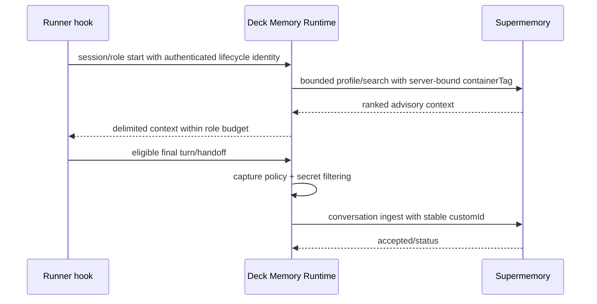
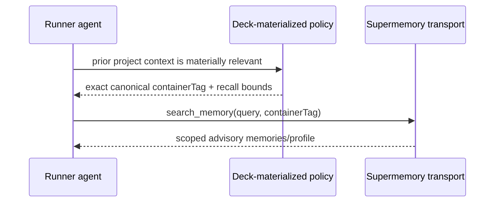

# Design: Canonical Supermemory Conversation Memory

## Decisions

### D1. Supermemory owns learning; Deck owns boundaries

Deck owns the runtime boundary that decides when to recall or capture, binds project/session identity, applies authorization, sanitization, budgets, fail-open behavior, and redacted observability. Deck sends eligible rich conversation context without semantic pre-extraction. Supermemory owns extraction, graph updates, profiles, ranking, temporal updates, deduplication, contradiction handling, and forgetting.

### D2. Enabling Adaptive Memory is the capture decision

There is no provider selector, secondary capture toggle, or per-call project-space choice. `adaptiveMemory.enabled: true` means first-class Supermemory recall and capture. Disabled means no remote memory effects. Legacy `supermemory` maps to enabled; `engram` maps to disabled with a removal warning.

### D3. Canonical scope is provider-neutral and versioned

The resolver consumes a verified project root and canonicalizes the repository owner/path across HTTPS, SSH, SCP syntax, `.git` suffixes, and SSH aliases. It emits a versioned safe tag. Ambient CWD and directory basename are forbidden fallbacks.

The initial format is:

```text
sm_project_v1_<normalized-owner>_<normalized-repository>
```

If no repository identity can be established safely, adaptive memory is unavailable rather than unscoped.

### D4. Transport is a Deck-owned runtime effect

Deck launches an ephemeral authenticated loopback memory host while supervising a runner. Runner-native lifecycle hooks emit normalized events and receive bounded context. The host alone owns the canonical scope and provider credential. This is not another MCP server or semantic engine; it is the runner-neutral lifecycle/security boundary over the official `/v3/documents`, `/v4/search`, and `/v4/profile` API.

The production runtime uses a minimal abortable HTTP client over the official `/v3/documents`, `/v4/search`, and `/v4/profile` endpoints. The 2026-08-15 spike proved `supermemory@4.25.4` could be bundled, but the SDK wrapper did not expose a stable per-operation abort contract. Deck therefore selected the smaller HTTP boundary so timeout cancels the underlying request and an explicit remember cannot report failure while an uncancelled write continues remotely. This is not a replacement SDK: it implements only the three documented operations, bearer authentication, validated response/error shapes, and injected transport tests.

Automatic memory is guaranteed for runners launched/supervised through Deck. Direct runner launches may retain ad-hoc MCP but MUST NOT be described as first-class automatic runtime behavior unless a future trusted auto-start boundary is added.

### D5. Compatibility is additive, then deprecated

Existing config that contains `maxMemoriesPerSession` remains parseable during migration, but the value no longer drives behavior. Old direct provider entries are diagnosed, not silently deleted. The replacement must be functional before old Deck-managed paths are removed.

### D6. Explicit tool scope is required

Authenticated runtime testing proved that `x-sm-project` does not populate the optional `containerTag` argument used by the active runner-exposed Supermemory tools. An omitted argument routes to active/default space, while an explicit canonical tag routes correctly. Deck therefore keeps the header for transport compatibility and diagnostics but materializes the exact canonical tag into every project-scoped save, recall, list, document, and graph instruction.

Active-space mutation is forbidden as an automatic scoping mechanism because it is shared mutable account/session state. Missing or mismatched project scope disables the memory operation instead of falling back to `sm_project_default`.

## Components

1. **Canonical identity and role policy** (`packages/core/src/memory/`): project/session identity, capture/recall decisions, budgets, advisory authority, and diagnostics.
2. **Supermemory runtime adapter** (`packages/adapter-supermemory/src/`): official SDK/API client, profile/search/capture, stable conversation aggregation, sanitization, queueing, and health.
3. **Authenticated runtime bridge** (`packages/sdd-runtime/src/execution/` and CLI launch): versioned loopback lifecycle protocol, ephemeral bridge token, replay/payload protection, context injection, and bounded shutdown drain.
4. **Runner serializers/hooks** (`packages/adapter-opencode`, `adapter-pi`, `adapter-codex`): equivalent native lifecycle/content/context events; no provider credential or caller-selected scope.
5. **Config/secrets/TUI/Doctor** (`packages/core/src/config`, `apps/cli/src/tui`, `apps/cli/src/doctor-command`): enabled/disabled capability, secret-store abstraction, setup, migration, runtime/MCP status, and actionable repair.
6. **MCP complement**: existing project-scoped ad-hoc tools, separately diagnosed and excluded from automatic capture.
7. **DeckMemoryBench and release verification** (`benchmarks/`, scripts/workflows): deterministic fake-provider scenarios plus compiled archive smoke tests.

## Sequence: first-class recall and capture



## Sequence: retrieval



## Security model

- Provider responses and stored memories are untrusted advisory input.
- Credentials are obtained through a Deck secret-store abstraction and remain in the runtime host. Generated hooks receive only an ephemeral per-launch bridge token.
- Capture eligibility excludes system/tool/provider/web/raw-workflow content; deterministic rejection/redaction occurs before transport.
- Logging uses reason codes, counts, durations, runner ID, and a one-way scope fingerprint only.
- Missing scope, invalid transport shape, or authentication mismatch disables memory effects without blocking coding work.

## Migration design

Migration is a separate command path with explicit source and destination scope. The default action is dry-run. Classification is deterministic where possible and conservative otherwise. Source data remains unchanged. This change intentionally provides no delete effect.

## Performance design

- Deck adds one local loopback hop to obtain runner-neutral lifecycle control; provider calls remain direct from the compiled Deck process.
- Conversation capture is coalesced under one stable session `customId` and skipped for trivial/tool-only activity.
- Lead profile loads once; role searches are materially triggered and budgeted rather than performed on every turn.
- Query retrieval is demand-driven and context-bounded.
- Rerank and query rewriting are evidence-gated because each adds latency.

## Profiles, buckets, and entity context

The initial runtime consumes provider-owned static and dynamic profiles. It defines no Deck semantic buckets. Profile Buckets and `entityContext` remain off until DeckMemoryBench shows a material quality gain without authority drift or excess context. If enabled later, `entityContext` must be a short project-memory description, not a duplicate Developer Team prompt.

## Credential persistence decision

Deck uses a secret-store port. OS-native secure storage is preferred where available. A dedicated owner-only Deck secret file may be implemented as the standalone fallback only with atomic writes, `0600` file/`0700` directory permissions, path/ownership validation, no backup/export, and explicit Doctor disclosure that it is filesystem-protected rather than hardware/keychain-backed. Portable `config.json`, repository files, runner config, prompts, and logs never contain the API key.
