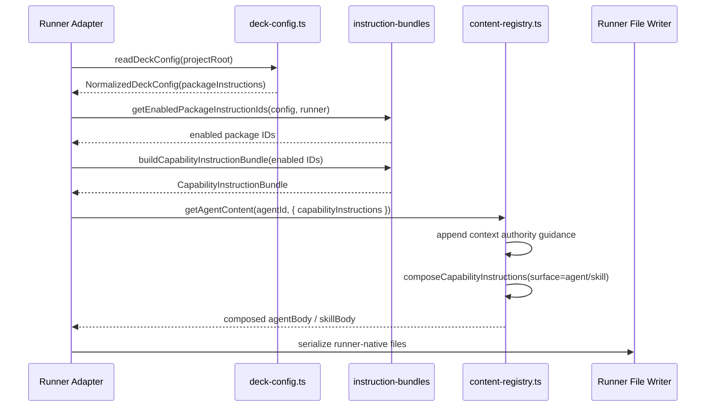
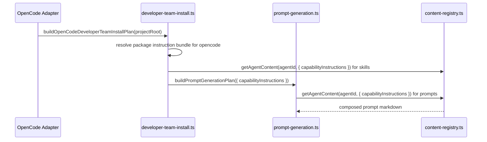
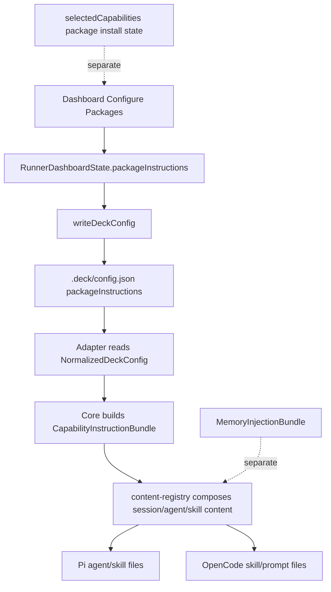

# Design: configure-packages-instruction-injection

## Source

- Proposal: `openspec/changes/configure-packages-instruction-injection/proposal.md`
- Exploration: requested at `openspec/changes/configure-packages-instruction-injection/exploration.md`, but the file was not present during design. The proposal-provided exploration summary and targeted code reads were used instead.
- Capabilities affected: `package-instruction-config`, `capability-instruction-injection`, `deck-config`, `content-registry`, `developer-team-manifest`, `pi-runner-dashboard`, `opencode-runner-dashboard`
- Spec status: not yet available
- Registry write: deferred by orchestrator instruction; intended registry phase is `design`, status `completed`, artifact `design.md`, event `design.completed`.

## Architecture Overview

Per-runner package instruction injection should be modeled as a core, runner-neutral prompt composition layer, parallel to but separate from Adaptive Memory.

High-level flow:

1. `.deck/config.json` stores explicit package-instruction toggles under `packageInstructions.{runner}.{packageId}`.
2. Runner dashboard state edits a separate `packageInstructions` selection map, distinct from `selectedCapabilities` package installation state.
3. Review/install config write actions persist both Adaptive Memory config and package-instruction toggles through `writeDeckConfig()`.
4. Runner adapters read normalized config for their runner scope.
5. Core builds an aggregate `CapabilityInstructionBundle` from enabled package IDs.
6. Core content registry composes matching instruction fragments into session, agent, and skill content.
7. Pi/OpenCode adapters serialize already-composed content into runner-native agent, skill, prompt, and session artifacts.

The key boundary is: **core owns canonical instruction content and composition semantics; adapters own runner-specific config lookup and file serialization.**

## Current Architecture Context

Relevant current modules:

- `packages/core/src/config/deck-config.ts`
  - Defines `DeckConfig` and `NormalizedDeckConfig`.
  - Currently supports only `adaptiveMemory` plus `version`.
  - Rejects unknown fields using `assertKnownFields()`.
  - Defaults missing config to `adaptiveMemory.activeProvider = "none"`.
- `packages/core/src/memory/adaptive-memory.ts`
  - Defines `MemoryInjectionBundle`, `MemoryInstructionFragment`, and `composeAdaptiveMemory()`.
  - Supports `session | agent | skill` surfaces plus `teamId`, `agentIds`, and `skillIds` filters.
  - Also carries `toolBindings`, which package instruction injection must not reuse.
- `packages/core/src/teams/developer/content-registry.ts`
  - Owns canonical Developer Team agent, skill, and team session content.
  - `getAgentContent(agentId)` returns `{ agentBody, skillBody }`.
  - `getTeamSessionInstructions(teamId)` returns Developer Team session instructions.
  - Always appends context-authority guidance today.
- `packages/core/src/teams/developer/manifest.ts`
  - Builds `DeveloperTeamManifest` from catalog/content and optional memory bundle.
  - Currently calls `getAgentContent(agentDef.id)` without package-instruction context.
- `packages/core/src/runner-capability.ts`
  - Defines runner-neutral manifest contracts.
  - `DeveloperTeamManifestInput` carries `projectRoot`, `environmentId`, model assignments, and optional memory provider ID.
- `packages/adapter-pi/src/developer-team-install.ts`
  - Builds Pi agent/skill file content by reading `getAgentContent()` and optionally wrapping with `composeAdaptiveMemory()`.
  - Resolves Adaptive Memory through core and adds memory tool bindings to Pi agent tools.
- `packages/adapter-opencode/src/developer-team-install.ts`
  - Builds OpenCode skill files with optional Adaptive Memory composition.
  - Builds prompt files through `packages/adapter-opencode/src/prompt-generation.ts`.
- `packages/adapter-opencode/src/prompt-generation.ts`
  - Reads `getAgentContent()` for agent prompt files.
  - Currently does not accept memory/package instruction context.
- `apps/cli/src/tui/pi-runner-dashboard/*`
  - Runtime-agnostic dashboard state, reducer, selectors, and input handler.
  - `selectedCapabilities` is currently package-install selection only.
  - Dashboard sections are Packages, Adaptive Memory, Teams, Review & Install.
  - Config writes are executed in `action-runner.ts` and currently persist only Adaptive Memory settings.

## Proposed Architecture

Add a new core package-instruction subsystem and thread it through existing content/manifest/install flows without changing package installation semantics.

### Data Model

#### Config schema

Extend `DeckConfig` and `NormalizedDeckConfig` in `packages/core/src/config/deck-config.ts`:

```ts
export type PackageInstructionRunnerId = "pi" | "opencode";
export type PackageInstructionPackageId = "codebase-memory" | "context-mode" | "rtk";

export type DeckPackageInstructionRunnerConfig = Partial<
  Record<PackageInstructionPackageId, boolean>
>;

export type DeckPackageInstructionConfig = Partial<
  Record<PackageInstructionRunnerId, DeckPackageInstructionRunnerConfig>
>;

export type DeckConfig = {
  version?: typeof DECK_CONFIG_VERSION;
  adaptiveMemory?: DeckAdaptiveMemoryConfig;
  packageInstructions?: DeckPackageInstructionConfig;
};

export type NormalizedDeckConfig = {
  version: typeof DECK_CONFIG_VERSION;
  adaptiveMemory: { activeProvider: AdaptiveMemoryActiveProvider; supermemory?: DeckSupermemoryConfig };
  packageInstructions: Record<PackageInstructionRunnerId, Record<PackageInstructionPackageId, boolean>>;
};
```

Default normalized value:

```json
{
  "packageInstructions": {
    "pi": { "codebase-memory": false, "context-mode": false, "rtk": false },
    "opencode": { "codebase-memory": false, "context-mode": false, "rtk": false }
  }
}
```

Validation rules:

- Unknown top-level field rejection remains in place; `packageInstructions` is added to the allowlist.
- Unknown runner keys under `packageInstructions` are rejected.
- Unknown package IDs under each runner are rejected.
- Values must be booleans when provided.
- Missing runners/packages normalize to `false`.
- Secret-field rejection continues to recurse through the new object.

#### Core instruction bundle model

Create a runner-neutral bundle type in core, parallel to `MemoryInjectionBundle` but without tool bindings:

```ts
export type CapabilityInstructionSurface = "session" | "agent" | "skill";
export type CapabilityInstructionPackageId = "codebase-memory" | "context-mode" | "rtk";

export type CapabilityInstructionFragment = {
  packageId: CapabilityInstructionPackageId;
  surface: CapabilityInstructionSurface;
  markdown: string;
  teamId?: string;
  agentIds?: readonly string[];
  skillIds?: readonly string[];
};

export type CapabilityInstructionBundle = {
  instructions: readonly CapabilityInstructionFragment[];
};

export type CapabilityInstructionCompositionContext = {
  surface: CapabilityInstructionSurface;
  teamId?: string;
  agentId?: string;
  skillId?: string;
};
```

Core helpers:

```ts
export function buildCapabilityInstructionBundle(
  packageIds: readonly CapabilityInstructionPackageId[],
): CapabilityInstructionBundle;

export function getEnabledPackageInstructionIds(
  config: NormalizedDeckConfig,
  runner: PackageInstructionRunnerId,
): CapabilityInstructionPackageId[];

export function composeCapabilityInstructions(
  base: string,
  bundle: CapabilityInstructionBundle | undefined,
  context: CapabilityInstructionCompositionContext,
): string;
```

Composition should append a deterministic section only when matching fragments exist:

```md
## Package Instructions (configured)

These instructions are enabled by `.deck/config.json` package instruction toggles.

{matching fragments}
```

Unlike Adaptive Memory, package instructions are official configured prompt content, not adaptive context. Therefore they should be appended to the base content directly and not wrapped by `renderSddContextSections()`.

### Component / Module Boundaries

| Component | Responsibility | Change Type |
|---|---|---|
| `packages/core/src/config/deck-config.ts` | Parse, validate, normalize, and write per-runner package instruction toggles. | modified |
| `packages/core/src/instructions/capability-instructions.ts` or `packages/core/src/teams/developer/instruction-bundles/index.ts` | Define bundle/fragments, supported package IDs, builder, enabled-ID resolver, and composer. | new |
| `packages/core/src/teams/developer/instruction-bundles/codebase-memory.ts` | Canonical codebase-memory usage guidance. | new |
| `packages/core/src/teams/developer/instruction-bundles/context-mode.ts` | Canonical context-mode usage guidance. | new |
| `packages/core/src/teams/developer/instruction-bundles/rtk.ts` | Canonical RTK fallback guidance. | new |
| `packages/core/src/teams/developer/content-registry.ts` | Accept optional capability instruction bundle and compose matching session/agent/skill fragments. | modified |
| `packages/core/src/teams/developer/manifest.ts` | Accept optional capability instruction bundle and request composed content from registry. | modified |
| `packages/core/src/runner-capability.ts` | Add optional package instruction config/bundle contract fields to manifest inputs and manifest entries if needed by adapters. | modified |
| `packages/core/src/index.ts` | Re-export public config/instruction types and helpers. | modified |
| `packages/adapter-pi/src/developer-team-install.ts` | Resolve runner package instruction config, build bundle, and pass bundle to content builders. | modified |
| `packages/adapter-pi/src/runner-capabilities.ts` | Pass instruction context through manifest/install-plan capability facade. | modified |
| `packages/adapter-opencode/src/developer-team-install.ts` | Resolve OpenCode package instruction config and pass bundle to skill/prompt generation. | modified |
| `packages/adapter-opencode/src/prompt-generation.ts` | Accept optional instruction bundle and compose agent prompt content. | modified |
| `packages/adapter-opencode/src/runner-capabilities.ts` | Pass instruction context through manifest/install-plan capability facade. | modified |
| `apps/cli/src/tui/pi-runner-dashboard/state.ts` | Add dashboard screen and state for package instruction toggles. | modified |
| `apps/cli/src/tui/pi-runner-dashboard/reducer.ts` | Add toggle/set actions for package instruction config. | modified |
| `apps/cli/src/tui/pi-runner-dashboard/selectors.ts` | Add Configure Packages dashboard section summaries and cursor limits. | modified |
| `apps/cli/src/tui/pi-runner-dashboard/input-handler.ts` | Route dashboard selection and toggles for the Configure Packages screen. | modified |
| `apps/cli/src/tui/screens/pi-runner-dashboard-screens.tsx` | Render Configure Packages section distinct from install Packages. | modified |
| `apps/cli/src/tui/pi-runner-dashboard/action-runner.ts` | Persist `packageInstructions` together with existing Adaptive Memory config writes. | modified |
| `packages/adapter-pi/src/capability-plan.ts` | Add a config write action when package instruction toggles differ from persisted config or when toggles are selected. | modified |
| `packages/adapter-opencode/src/capability-plan.ts` | Same as Pi for OpenCode runner scope. | modified |

## Component Design

### 1. Config normalization

`deck-config.ts` should expose runner/package ID constants as the canonical allowlists:

```ts
export const PACKAGE_INSTRUCTION_RUNNERS = ["pi", "opencode"] as const;
export const PACKAGE_INSTRUCTION_PACKAGE_IDS = ["codebase-memory", "context-mode", "rtk"] as const;
```

`normalizePackageInstructionConfig(value, configPath)` should mirror `normalizeAdaptiveMemoryConfig()` style:

- `undefined | null` -> all `false`.
- Non-object -> `DECK_CONFIG_INVALID_SHAPE`.
- Unknown key -> `DECK_CONFIG_UNKNOWN_FIELD` with exact `fieldPath`.
- Non-boolean package value -> new error code such as `PACKAGE_INSTRUCTIONS_CONFIG_INVALID` or existing invalid-shape semantics.

### 2. Capability instruction bundle builders

Canonical content lives in core because the guidance is runner-neutral and applies to both Pi and OpenCode.

Recommended file layout:

```text
packages/core/src/teams/developer/instruction-bundles/
  index.ts
  codebase-memory.ts
  context-mode.ts
  rtk.ts
```

Bundle builder behavior:

- Deduplicate input package IDs while preserving canonical package order.
- Ignore disabled packages by receiving only enabled IDs from config resolver.
- Fail closed for unknown IDs at type/validation boundary; no dynamic package strings should reach builders.
- Return `{ instructions: [] }` when no packages are enabled.

Canonical content scope:

- `codebase-memory`: prefer `search_graph`, `trace_path`, `get_code_snippet`, `query_graph` for structural code discovery; fall back to file/content search for non-code/config or insufficient graph results.
- `context-mode`: prefer `ctx_batch_execute` and `ctx_execute` for large-output commands and think-in-code processing; use `ctx_search` after indexing.
- `rtk`: provide minimal fallback guidance for hook-less environments; if RTK runtime semantics are not documented in repo, keep content intentionally conservative.

### 3. Content registry composition

Change registry signatures to accept options rather than positional parameters for forward compatibility:

```ts
export type ContentRegistryOptions = {
  capabilityInstructions?: CapabilityInstructionBundle;
};

export function getAgentContent(
  agentId: string,
  options?: ContentRegistryOptions,
): AgentContent | undefined;

export function getTeamSessionInstructions(
  teamId: string,
  options?: ContentRegistryOptions,
): string | undefined;
```

Composition order for agent/skill bodies:

1. Static canonical content or placeholder content.
2. Context-authority guidance via existing `withContextAuthorityGuidance()`.
3. Package instruction fragments via `composeCapabilityInstructions()`.

Rationale: context-authority remains a non-negotiable governance layer; package instructions are configured operational guidance appended after governance.

For session instructions:

1. `ORCHESTRATOR_SYSTEM_PROMPT`.
2. Context-authority guidance.
3. Matching `surface: "session"` package fragments.

### 4. Manifest and adapter integration

Extend core manifest options:

```ts
export type BuildManifestOptions = {
  team: TeamEntry;
  modelAssignments?: readonly DeveloperTeamModelAssignmentOverride[];
  memoryBundle?: MemoryInjectionBundle;
  memoryDiagnostics?: readonly MemoryDiagnostic[];
  capabilityInstructions?: CapabilityInstructionBundle;
};
```

Extend runner-neutral input:

```ts
export type DeveloperTeamManifestInput = {
  projectRoot: string;
  environmentId: RunnerEnvironmentId;
  modelAssignments?: readonly DeveloperTeamModelAssignmentInput[];
  memoryProviderId?: string;
  capabilityInstructions?: CapabilityInstructionBundle;
};
```

Adapter behavior:

- Read `readDeckConfig(projectRoot)` during install-plan/manifest generation.
- Resolve enabled package IDs for the current runner with `getEnabledPackageInstructionIds(config, "pi" | "opencode")`.
- Build `CapabilityInstructionBundle` once per plan.
- Pass the bundle into all content-producing paths.

Pi-specific:

- `buildSkillFileContent(agent, memoryBundle, capabilityInstructions)` composes package instructions through `getAgentContent(agent.id, { capabilityInstructions })` or explicitly calls `composeCapabilityInstructions()` after memory composition, but must avoid double composition.
- `buildAgentFileContent(...)` follows the same pattern.
- Memory composition remains responsible only for Adaptive Memory and tool bindings.

OpenCode-specific:

- `buildSkillFileContent(agent, memoryBundle, capabilityInstructions)` composes skill content.
- `buildPromptGenerationPlan({ configDir, projectRoot, capabilityInstructions })` passes the bundle to `buildPromptContent()`.
- OpenCode agent entries continue to reference prompt files; package instructions are present in the generated prompt file content.

### 5. Dashboard integration

The dashboard must separate installation selection from prompt-instruction selection.

State additions:

```ts
export type RunnerDashboardScreen =
  | "dashboard"
  | "packages-detail"
  | "package-instructions-detail"
  | ...;

export type RunnerDashboardState = {
  ...
  packageInstructions: Partial<Record<CapabilityId, boolean>>;
};
```

Reducer actions:

```ts
| { type: "toggle-package-instruction"; packageId: CapabilityId }
| { type: "set-package-instruction"; packageId: CapabilityId; enabled: boolean }
```

Selectors:

- Add dashboard section ID `package-instructions` with title `Configure Packages`.
- Count enabled instruction toggles from `state.packageInstructions`.
- Use the same injected capability resolver but filter to canonical instruction package IDs: `codebase-memory`, `context-mode`, `rtk`.
- Do not include internal packages such as `runner-mermaid`, `opencode-mermaid`, or `pi-hud` unless future scope explicitly adds instruction content for them.

Input handling:

- Dashboard Enter on Configure Packages navigates to `package-instructions-detail`.
- Space/Enter in detail toggles instruction state.
- Back returns to dashboard.

Config write:

- `writeDeckConfigAction()` should merge package instruction toggles into the config object it already writes.
- It must preserve existing Adaptive Memory behavior and keep credentials out of `.deck/config.json`.

### 6. Canonical instruction content ownership

Canonical instruction markdown belongs in core, not adapters.

Adapters may format runner-native files, but they must not maintain duplicate instruction text. This keeps wording consistent across runners and gives future runners one integration point.

## File Impact

| File / Path | Action | Rationale |
|---|---|---|
| `packages/core/src/config/deck-config.ts` | modify | Add package instruction config types, defaults, validation, and helper accessors. |
| `packages/core/src/config/deck-config.test.ts` | modify | Cover default false values, valid booleans, unknown runner/package rejection, non-boolean rejection, and write normalization. |
| `packages/core/src/teams/developer/instruction-bundles/index.ts` | create | Public builder/composer entrypoint for package instruction bundles. |
| `packages/core/src/teams/developer/instruction-bundles/codebase-memory.ts` | create | Canonical codebase-memory instruction fragments. |
| `packages/core/src/teams/developer/instruction-bundles/context-mode.ts` | create | Canonical context-mode instruction fragments. |
| `packages/core/src/teams/developer/instruction-bundles/rtk.ts` | create | Canonical RTK fallback instruction fragments. |
| `packages/core/src/teams/developer/instruction-bundles/*.test.ts` | create | Bundle build and composition tests. |
| `packages/core/src/teams/developer/content-registry.ts` | modify | Accept optional bundle and append matching fragments. |
| `packages/core/src/teams/developer/content-registry.test.ts` | modify | Assert default output unchanged and enabled fragments appear on intended surfaces only. |
| `packages/core/src/teams/developer/manifest.ts` | modify | Thread bundle into registry calls. |
| `packages/core/src/teams/developer/manifest.test.ts` | modify | Assert manifest agent/skill content includes configured package guidance. |
| `packages/core/src/runner-capability.ts` | modify | Extend runner-neutral manifest/input types for optional capability instruction bundle/config. |
| `packages/core/src/index.ts` | modify | Re-export public instruction/config helpers. |
| `packages/adapter-pi/src/developer-team-install.ts` | modify | Resolve/build/pass package instruction bundle into Pi file content builders. |
| `packages/adapter-pi/src/developer-team-install.test.ts` | modify | Assert Pi agent/skill files include enabled package instructions and omit disabled instructions. |
| `packages/adapter-pi/src/runner-capabilities.ts` | modify | Thread package instruction data through facade manifest/install-plan paths. |
| `packages/adapter-pi/src/capability-plan.ts` | modify | Add package-instruction config write action/diagnostic when toggles are enabled or changed. |
| `packages/adapter-pi/src/capability-plan.test.ts` | modify | Cover config-write planning for package instructions separately from installation packages. |
| `packages/adapter-opencode/src/developer-team-install.ts` | modify | Resolve/build/pass package instruction bundle into skill and prompt generation. |
| `packages/adapter-opencode/src/prompt-generation.ts` | modify | Accept optional bundle and compose prompt content. |
| `packages/adapter-opencode/src/prompt-generation.test.ts` | modify | Assert OpenCode prompt files include configured package instructions. |
| `packages/adapter-opencode/src/runner-capabilities.ts` | modify | Thread package instruction data through facade manifest/install-plan paths. |
| `packages/adapter-opencode/src/capability-plan.ts` | modify | Add package-instruction config write action/diagnostic for OpenCode. |
| `apps/cli/src/tui/pi-runner-dashboard/state.ts` | modify | Add screen and `packageInstructions` state. |
| `apps/cli/src/tui/pi-runner-dashboard/reducer.ts` | modify | Add package-instruction toggle actions and plan invalidation. |
| `apps/cli/src/tui/pi-runner-dashboard/selectors.ts` | modify | Add dashboard summary and cursor limits for Configure Packages. |
| `apps/cli/src/tui/pi-runner-dashboard/input-handler.ts` | modify | Add navigation/toggle behavior for Configure Packages. |
| `apps/cli/src/tui/screens/pi-runner-dashboard-screens.tsx` | modify | Render Configure Packages screen. |
| `apps/cli/src/tui/pi-runner-dashboard/action-runner.ts` | modify | Persist `packageInstructions` into `.deck/config.json`. |
| `apps/cli/src/tui/pi-runner-dashboard/*.test.ts`, `apps/cli/src/tui/screens/*.test.tsx` | modify | Cover new section, toggles, reducer, input, and render behavior. |

## Sequence Diagrams

### Config read → bundle build → prompt injection



### Dashboard toggle → config persistence

```mermaid
sequenceDiagram
    participant User
    participant UI as Dashboard UI
    participant Reducer as Dashboard Reducer
    participant Plan as Capability Plan
    participant Runner as Action Runner
    participant Config as .deck/config.json

    User->>UI: Toggle package instruction
    UI->>Reducer: toggle-package-instruction(packageId)
    Reducer-->>UI: state.packageInstructions updated; plan invalidated
    User->>UI: Review & Install
    UI->>Plan: buildRunnerReviewPlan(state, inventory)
    Plan-->>UI: write-deck-config action
    UI->>Runner: run config write action
    Runner->>Config: writeDeckConfig({ adaptiveMemory, packageInstructions })
```

### OpenCode prompt generation path



## API / Contract Implications

| Endpoint / Interface | Change | Backward Compatible |
|---|---|---|
| `DeckConfig` / `NormalizedDeckConfig` | Adds `packageInstructions` nested config. | Yes; missing field defaults to all false. |
| `validateDeckConfig()` | Accepts and validates new nested field. | Yes for existing valid configs. |
| `getDefaultDeckConfig()` | Returns normalized false toggles. | Yes; additional normalized field may affect strict object equality tests. |
| `getAgentContent()` | Adds optional options parameter. | Yes; existing single-arg calls still valid. |
| `getTeamSessionInstructions()` | Adds optional options parameter. | Yes; existing single-arg calls still valid. |
| `buildDeveloperTeamManifest()` | Adds optional `capabilityInstructions` option. | Yes. |
| `DeveloperTeamManifestInput` | Adds optional package instruction field if needed for facade calls. | Yes. |
| `buildPromptGenerationPlan()` | Adds optional `capabilityInstructions` option. | Yes if added as optional property. |
| Runner dashboard state | Adds screen/state/action variants. | Internal API; tests and UI must update. |

## State / Persistence Implications

Persistent state changes only in `.deck/config.json`:

```json
{
  "version": 1,
  "adaptiveMemory": {
    "activeProvider": "none"
  },
  "packageInstructions": {
    "pi": {
      "codebase-memory": true,
      "context-mode": false,
      "rtk": false
    },
    "opencode": {
      "codebase-memory": false,
      "context-mode": true,
      "rtk": false
    }
  }
}
```

No package installation state is persisted by this change. `selectedCapabilities` remains ephemeral and installation-focused.

## Migration / Backward Compatibility

- No migration file is required.
- Existing configs without `packageInstructions` normalize to all toggles disabled.
- Generated prompts are unchanged when all toggles are disabled.
- Unknown-field rejection remains strict; the only new accepted top-level key is `packageInstructions`.
- Rollback is config-only: remove `packageInstructions` or set toggles to `false` to stop injection.

## Testing Strategy

| Layer | Tests |
|---|---|
| Config unit tests | Missing config defaults to all false; valid per-runner booleans normalize; unknown runner/package rejected; non-boolean rejected; writeDeckConfig persists normalized shape. |
| Bundle unit tests | Each package builder returns expected surfaces; aggregate builder deduplicates/order-stabilizes; empty enabled IDs produce no instructions; composer filters by surface/team/agent/skill. |
| Content registry tests | Existing outputs unchanged without bundle; configured fragments appear in agent, skill, and session outputs; non-matching fragments are absent. |
| Manifest tests | `buildDeveloperTeamManifest()` propagates bundle into agent and skill content while retaining memory bundle behavior. |
| Pi adapter tests | Pi agent/skill files include enabled instructions; disabled packages absent; Adaptive Memory tool bindings unaffected. |
| OpenCode adapter tests | Skill files and generated prompt files include enabled instructions; disabled packages absent. |
| Capability-plan/action-runner tests | Review plan includes config write for package instructions; action runner writes both Adaptive Memory and package instruction config without credentials. |
| TUI reducer/input/render tests | Configure Packages section appears; cursor limits include new section; toggles update `packageInstructions`; installation package toggles remain independent. |

Integration-level verification should generate Pi and OpenCode Developer Team artifacts with each package individually enabled and assert representative instruction substrings appear exactly once.

## Observability / Error Handling

- Config validation errors should include exact `fieldPath` values such as `packageInstructions.pi.codebase-memory`.
- Unknown packages should fail during config validation, not during prompt generation.
- Bundle composition should be pure and side-effect free; no logging required.
- Review-plan diagnostics should describe that package instruction toggles affect prompt content, not package installation.

## Security / Performance / Accessibility Considerations

- Security: no secrets are introduced. Existing recursive secret-key rejection applies to `packageInstructions`.
- Performance: prompt generation does a small in-memory filter over static fragments; impact is negligible.
- Token usage: injected instructions increase prompt size only when explicitly enabled. Keep fragments concise and avoid duplicating generic guidance across packages.
- Accessibility: TUI labels must distinguish `Packages` from `Configure Packages` clearly. Use hints like “instruction injection only; does not install packages.”

## Tradeoffs

| Decision | Chosen | Rejected Alternative | Rationale |
|---|---|---|---|
| Config location | Single `.deck/config.json` under `packageInstructions.{runner}.{packageId}` | Runner-specific config files | Preserves existing config pattern and avoids extra I/O/migration complexity. |
| Default behavior | All package instructions disabled by default | Auto-enable when installed package detected | Preserves explicit user control and avoids surprising prompt/token changes. |
| Bundle model | New `CapabilityInstructionBundle` without tool bindings | Reuse `MemoryInjectionBundle` | Keeps package guidance semantically separate from persistence/retrieval providers and avoids accidental tool-binding behavior. |
| Canonical content location | Core `teams/developer/instruction-bundles` | Duplicate content in Pi/OpenCode adapters | Prevents drift and supports future runners from one source. |
| Composition layer | Content registry composes package instructions | Adapter-level string appends | Centralizes surface filtering and keeps adapters focused on serialization. |
| Dashboard UX | Separate `Configure Packages` section | Add toggles inside existing `Packages` install section | Avoids conflating “install package” with “inject package instructions.” |
| RTK content | Minimal fallback guidance | Empty/no-op bundle | Proposal calls for canonical RTK instruction content; conservative text satisfies scope without inventing runtime details. |

## Risks

| Risk | Likelihood | Impact | Mitigation |
|---|---|---|---|
| Prompt bloat from multiple enabled packages | Medium | Medium | Keep fragments concise; disabled by default; test for duplicate section insertion. |
| Double composition in adapters that call both registry and composer | Medium | Medium | Choose one composition path: registry receives bundle and returns composed content; adapters should not re-compose package instructions. |
| OpenCode prompt generation misses bundle while skill files receive it | Medium | High | Add OpenCode prompt-generation tests that assert package instruction substrings appear in generated prompt files. |
| Existing strict config tests fail due to new normalized field | High | Low | Update tests to expect `packageInstructions` defaults. |
| User confuses installation toggles and instruction toggles | Medium | Medium | Use separate UI section and explicit hints; config write diagnostics should say “prompt instruction injection.” |
| RTK guidance is too speculative | Medium | Low | Keep RTK content minimal and mark as fallback guidance until runtime semantics are documented. |

## Open Decisions

- RTK exact wording remains uncertain because the repository context read for this design did not expose RTK runtime semantics. Default to minimal fallback guidance unless product/domain input provides stronger behavior.
- Whether config writes should preserve unknown future `packageInstructions` package IDs is not open for this change: current Deck config validation is strict, so unknown IDs should be rejected.

## Dependencies

- No external dependencies.
- Depends on existing Deck config validation, content registry, Developer Team manifest, and dashboard reducer/selector patterns.

## Mermaid Summary Source



## Next Steps

Ready for Task (`deck-developer-task`) to combine this design with Spec and break implementation into tasks.
