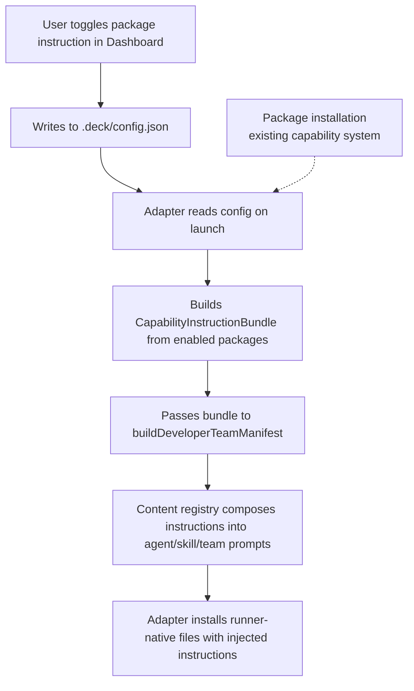

# Proposal: configure-packages-instruction-injection

## Intent

Deck installs optional packages (codebase-memory, context-mode, RTK) via adapters, but agents are not instructed to *use* them. A user may have codebase-memory installed but the agent still defaults to `grep/glob` because no package-specific usage instructions exist in prompts. We need a per-runner, user-configurable layer that conditionally injects package usage instructions into agent and team prompts.

## Goal

Enable users to toggle which optional packages' usage instructions are injected into agent prompts on a per-runner basis, so that installed packages are actually leveraged by agents during task execution.

## Scope

### In Scope
- Per-runner package instruction configuration in `.deck/config.json`
- New `CapabilityInstructionBundle` type and composition mechanism parallel to `MemoryInjectionBundle`
- Canonical instruction content for `codebase-memory`, `context-mode`, and `rtk`
- Conditional injection into agent bodies, skill bodies, and team session instructions via the content registry / manifest builder
- Dashboard/TUI "Configure Packages" section for toggling package instructions per runner
- Adapter updates to read the new config and pass instruction bundles during manifest build
- Backward compatibility: existing configs without package instruction fields must default to no injection

### Out of Scope
- Package installation logic (capability-catalog, installation-plan, install-tools)
- New packages beyond the existing three (`codebase-memory`, `context-mode`, `rtk`)
- Runner-specific prompt wording (adapters may localize, but core provides canonical content)
- Persisting dashboard `selectedCapabilities` to disk (that remains ephemeral and controls installation)
- Adaptive memory provider logic changes

## Affected Capabilities

### New Capabilities
- `package-instruction-config`: Per-runner package instruction toggle configuration
- `capability-instruction-injection`: Conditional appending of package instructions to agent/skill/team prompts

### Modified Capabilities
- `deck-config`: Extended to validate and store per-runner package instruction configuration
- `content-registry`: Modified to accept an optional instruction bundle and conditionally append fragments
- `developer-team-manifest`: Modified to accept and propagate instruction bundles alongside memory bundles
- `pi-runner-dashboard` / `opencode-runner-dashboard`: New "Configure Packages" section in the TUI

### Unchanged Capabilities
- `capability-catalog`: Remains the source of truth for package metadata; requirement levels stay the same
- `installation-plan`: Still handles tool installation; no change to install logic
- `adaptive-memory`: Memory injection bundle and provider resolution remain untouched

## Approach

1. **Config extension**: Add a `packageInstructions` field to `DeckConfig` / `NormalizedDeckConfig` in `packages/core/src/config/deck-config.ts`. Structure is per-runner (`pi`, `opencode`) with boolean toggles for each supported package ID. Validation follows existing patterns (unknown fields rejected, defaults applied).

2. **Instruction bundle types**: Introduce `CapabilityInstructionBundle` in core, modeled after `MemoryInjectionBundle`:
   - `instructions: readonly CapabilityInstructionFragment[]`
   - Fragment has `surface` (`session` | `agent` | `skill`), `markdown`, optional `agentIds`/`skillIds`
   - No tool bindings (packages are already installed via separate mechanisms)

3. **Canonical instruction content**: Create `packages/core/src/teams/developer/instruction-bundles/` with a builder per package:
   - `codebase-memory`: instructions for `search_graph`, `trace_path`, `get_code_snippet`, `query_graph` priority order
   - `context-mode`: instructions for `ctx_batch_execute`, `ctx_execute`, `ctx_search`, think-in-code paradigm
   - `rtk`: fallback instructions for hook-less environments
   Each builder returns a `CapabilityInstructionBundle`.

4. **Registry composition**: Modify `content-registry.ts` to optionally accept an instruction bundle. When present, `getAgentContent()` and `getTeamSessionInstructions()` append matching fragments using a `composeCapabilityInstructions()` helper (patterned after `composeAdaptiveMemory()`). The manifest builder passes the bundle through to agents and skills.

5. **Dashboard integration**: Extend the TUI dashboard state with `packageInstructionConfig: Partial<Record<CapabilityId, boolean>>` per runner scope. Add a new screen/section "Configure Packages" where users toggle instruction injection. The section is separate from the existing "Packages" installation section to preserve the distinction between "install package" and "inject instructions".

6. **Adapter integration**: Both `adapter-pi` and `adapter-opencode` read the new config field, resolve enabled packages, build the aggregate instruction bundle via core helpers, and pass it into `buildDeveloperTeamManifest()` and through to `composeAdaptiveMemory()` (or the adapter's equivalent prompt composition).

## Alternatives and Tradeoffs

| Alternative | Why Considered | Why Not Chosen |
|---|---|---|
| Hard-code instructions into each agent's static prompt body | Simplest implementation | Would require editing every agent content file for every new package; no per-runner configurability |
| Reuse `MemoryInjectionBundle` for package instructions | Already exists, surface/agent/skill filtering works | Overloads semantics — memory providers are about persistence/retrieval, not tool usage guidance; would confuse diagnostics |
| Store per-runner config in runner-specific files (e.g. `.deck/pi-config.json`) | True separation of concerns | Breaks the existing single-config pattern; adds file I/O complexity and migration burden |
| Inject instructions at the adapter level only | Keeps core simpler | Duplicates instruction content across Pi and OpenCode; core's role is to be runner-neutral |

## Risks

| Risk | Likelihood | Mitigation |
|---|---|---|
| Increased prompt token count from injected instructions | Medium | Instructions are concise; disabled by default; we can measure token impact during verification |
| Agent confusion if multiple optional packages provide overlapping guidance (e.g. both context-mode and codebase-memory say "prefer structured tools over bash") | Low | Each instruction fragment explicitly scopes its guidance; overlapping advice is harmonized in canonical content |
| Config field name collisions with future Deck features | Low | Use nested `packageInstructions.{runner}.{packageId}` structure; validate unknown fields strictly |
| Breaking existing configs that use `unknown field` rejection | Medium | New fields are nested under `packageInstructions`; unknown top-level fields are still rejected, but nested structure isolates the change |
| Adapters forgetting to pass the instruction bundle, causing silent no-injection | Medium | Add unit tests in both adapters that assert bundle presence when config is enabled; verify manifest agents contain expected instruction substrings |

## Rollback Plan

1. Remove or set `packageInstructions` to empty object in `.deck/config.json` — injection stops immediately because empty config yields no bundles.
2. If code changes need reversion: revert the PR/commit. Core content registry defaults to no bundle (undefined), so agent content returns to pre-change static prompts.
3. No migration needed for config removal — old configs without `packageInstructions` are already the default case.

## Dependencies

- None external. This change builds on existing `MemoryInjectionBundle` patterns and the `DeckConfig` validation framework already in core.

## Open Questions

1. Should instruction injection be automatically enabled when a package is detected as installed, or always require explicit user toggle? (User request implies explicit toggle, but auto-enable is a common UX expectation.)
2. Should RTK instruction content be a no-op (empty bundle) since RTK is mostly transparent, or should it contain explicit fallback guidance?
3. Is there a preference for the dashboard section name — "Configure Packages", "Package Instructions", or "Prompt Injections"?

> If questions 1–3 are not answered before Spec, the default is: explicit toggle, RTK gets minimal fallback guidance, section name "Configure Packages".

## Acceptance Direction

- [ ] `.deck/config.json` accepts and validates `packageInstructions.pi.{packageId}` and `packageInstructions.opencode.{packageId}` booleans
- [ ] When a package is enabled for a runner, generated agent/skill/team prompts contain package-specific usage instructions
- [ ] When a package is disabled, its instructions are absent from prompts
- [ ] Dashboard/TUI exposes a per-runner section for toggling package instruction injection
- [ ] Existing configs without `packageInstructions` continue to work (backward compatible, no injection)
- [ ] Unit tests cover config validation, bundle composition, and adapter manifest generation

## Next Steps

Ready for Spec (`deck-developer-spec`) and Design (`deck-developer-design`) in parallel.

## Mermaid Summary Source

