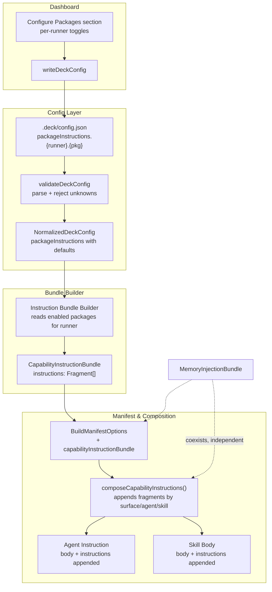

# Spec: configure-packages-instruction-injection

## Source

- Proposal: `configure-packages-instruction-injection` proposal artifact
- Exploration: not produced for this change
- Capabilities affected:
  - **New**: `package-instruction-config`, `capability-instruction-injection`
  - **Modified**: `deck-config`, `content-registry`, `developer-team-manifest`, `pi-runner-dashboard`, `opencode-runner-dashboard`

## Requirements

### Capability: package-instruction-config

REQ-PIC-001: The Deck config MUST accept a `packageInstructions` top-level field containing per-runner package instruction toggles.
  Priority: MUST
  Surface: Data
  Rationale: Existing config pattern (`adaptiveMemory`) nests runner-scoped settings under a top-level key. This follows the same convention.

REQ-PIC-002: The `packageInstructions` field MUST contain sub-objects keyed by runner scope (`pi`, `opencode`), each containing boolean toggles for known package IDs (`codebase-memory`, `context-mode`, `rtk`).
  Priority: MUST
  Surface: Data
  Rationale: Per-runner independence is a core goal — a user may enable codebase-memory instructions for Pi but not OpenCode.

REQ-PIC-003: Config validation MUST reject unknown top-level fields, unknown runner keys inside `packageInstructions`, and unknown package IDs inside runner sub-objects, using the existing `DECK_CONFIG_UNKNOWN_FIELD` error code.
  Priority: MUST
  Surface: Data
  Rationale: Strict field validation is the existing pattern (`assertKnownFields`). Allowing unknown keys silently would mask typos.

REQ-PIC-004: When `packageInstructions` is absent or `undefined`, the system MUST behave as if all package instructions are disabled (no injection occurs).
  Priority: MUST
  Surface: Data
  Rationale: Backward compatibility — existing configs without the field must work unchanged.

REQ-PIC-005: When a runner key (e.g. `pi`) is absent from `packageInstructions`, all packages for that runner MUST default to disabled.
  Priority: MUST
  Surface: Data
  Rationale: Explicit opt-in; absence means no injection.

REQ-PIC-006: The normalized config MUST include `packageInstructions` with a stable default shape so downstream consumers never receive `undefined` for a runner that exists in the system.
  Priority: SHOULD
  Surface: Data
  Rationale: Prevents null-check cascades in adapters and the manifest builder.

REQ-PIC-007: Non-boolean values for package toggle fields MUST be rejected with `DECK_CONFIG_INVALID_SHAPE`.
  Priority: MUST
  Surface: Data
  Rationale: Type safety — string `"false"` or number `0` must not silently pass validation.

### Capability: capability-instruction-injection

REQ-CII-001: A `CapabilityInstructionBundle` type MUST be introduced with the shape `{ instructions: readonly CapabilityInstructionFragment[] }`, where each fragment has `surface`, `markdown`, and optional `agentIds`/`skillIds`.
  Priority: MUST
  Surface: API
  Rationale: Mirrors the existing `MemoryInjectionBundle` pattern for consistency, but without `toolBindings` (packages are already installed via separate mechanisms).

REQ-CII-002: When a package is enabled for the active runner in the config, its canonical instruction content MUST be included in the instruction bundle built for that runner.
  Priority: MUST
  Surface: Integration
  Rationale: Core goal — enabled packages produce instruction fragments.

REQ-CII-003: When a package is disabled for the active runner, its instruction content MUST NOT appear in the bundle.
  Priority: MUST
  Surface: Integration
  Rationale: User control over prompt content is the primary requirement.

REQ-CII-004: Canonical instruction builders MUST exist for each supported package (`codebase-memory`, `context-mode`, `rtk`), each returning a `CapabilityInstructionBundle`.
  Priority: MUST
  Surface: Integration
  Rationale: Centralised content avoids duplication across adapters. Core is runner-neutral.

REQ-CII-005: The content registry's composition path MUST append capability instruction fragments to agent bodies and skill bodies when the bundle is present and fragments match the current surface/agent/skill context.
  Priority: MUST
  Surface: Integration
  Rationale: This is the injection mechanism — analogous to how `composeAdaptiveMemory` appends memory fragments.

REQ-CII-006: Capability instruction injection MUST be independent of memory injection. Both bundles can coexist; neither replaces or blocks the other.
  Priority: MUST
  Surface: Integration
  Rationale: They serve different purposes (tool usage guidance vs. persistence/retrieval). Coexistence is required.

REQ-CII-007: Capability instruction fragments MUST be appended in a distinct, labeled section within the composed prompt content so users and diagnostics can distinguish them from agent body content and memory injection sections.
  Priority: SHOULD
  Surface: UI
  Rationale: Observability — prompt provenance should be clear.

### Capability: developer-team-manifest (modified)

REQ-DTM-001: `BuildManifestOptions` MUST accept an optional `capabilityInstructionBundle` field alongside the existing `memoryBundle`.
  Priority: MUST
  Surface: API
  Rationale: The manifest builder needs the bundle to propagate it to agent/skill content composition.

REQ-DTM-002: When `capabilityInstructionBundle` is present, the manifest builder MUST compose capability instructions into each agent's instruction and each skill's body using the content registry's composition helper.
  Priority: MUST
  Surface: Integration
  Rationale: This is how instructions reach agent prompts.

REQ-DTM-003: When `capabilityInstructionBundle` is absent or empty, the manifest builder MUST produce identical output to the current behavior (no instruction injection).
  Priority: MUST
  Surface: Integration
  Rationale: Backward compatibility.

### Capability: deck-config (modified)

REQ-DC-001: `NormalizedDeckConfig` MUST include a `packageInstructions` field with normalized defaults.
  Priority: MUST
  Surface: API
  Rationale: Downstream code (adapters, manifest builder) reads normalized config and should not need to handle `undefined`.

REQ-DC-002: `readDeckConfig` and `validateDeckConfig` MUST parse, validate, and normalize the `packageInstructions` field.
  Priority: MUST
  Surface: API
  Rationale: These are the existing entry points for config resolution.

REQ-DC-003: `writeDeckConfig` MUST persist `packageInstructions` to `.deck/config.json` when present.
  Priority: MUST
  Surface: Data
  Rationale: The dashboard writes config via this function.

### Capability: pi-runner-dashboard / opencode-runner-dashboard (modified)

REQ-DASH-001: The dashboard MUST expose a "Configure Packages" section where users can toggle package instruction injection per package per runner scope.
  Priority: MUST
  Surface: UI
  Rationale: Users need a UI to control instruction injection without manually editing JSON.

REQ-DASH-002: The "Configure Packages" section MUST be distinct from the existing "Packages" installation section — toggling instruction injection does NOT install or uninstall packages.
  Priority: MUST
  Surface: UI
  Rationale: Per proposal, installation and instruction injection are separate concerns.

REQ-DASH-003: The dashboard MUST persist toggled package instruction settings to `.deck/config.json` via `writeDeckConfig`.
  Priority: MUST
  Surface: Integration
  Rationale: Settings must survive dashboard restarts.

REQ-DASH-004: When the dashboard loads, it MUST read the current `packageInstructions` config and reflect existing toggles in the UI.
  Priority: MUST
  Surface: UI
  Rationale: Settings should be idempotent — opening the dashboard shows current state.

## Acceptance Scenarios

### Capability: package-instruction-config

#### Scenario: Valid config with per-runner package toggles
**Given** `.deck/config.json` contains `{ "packageInstructions": { "pi": { "codebase-memory": true, "context-mode": false }, "opencode": { "rtk": true } } }`
**When** `readDeckConfig` or `validateDeckConfig` is called
**Then** the normalized config contains `packageInstructions.pi.codebase-memory` as `true`, `packageInstructions.pi.context-mode` as `false`, `packageInstructions.opencode.rtk` as `true`, and all other package toggles default to `false`
> Covers: REQ-PIC-001, REQ-PIC-002, REQ-PIC-004, REQ-PIC-005

#### Scenario: Config without packageInstructions field
**Given** `.deck/config.json` contains `{ "adaptiveMemory": { "activeProvider": "none" } }` (no `packageInstructions` key)
**When** `readDeckConfig` is called
**Then** the normalized config defaults all package instruction toggles to disabled for all runners, and no injection occurs during manifest build
> Covers: REQ-PIC-004, REQ-PIC-005

#### Scenario: Unknown package ID rejected
**Given** `.deck/config.json` contains `{ "packageInstructions": { "pi": { "unknown-pkg": true } } }`
**When** `validateDeckConfig` is called
**Then** a `DeckConfigError` with code `DECK_CONFIG_UNKNOWN_FIELD` is thrown, referencing `packageInstructions.pi.unknown-pkg`
> Covers: REQ-PIC-003

#### Scenario: Unknown runner key rejected
**Given** `.deck/config.json` contains `{ "packageInstructions": { "unknown-runner": { "rtk": true } } }`
**When** `validateDeckConfig` is called
**Then** a `DeckConfigError` with code `DECK_CONFIG_UNKNOWN_FIELD` is thrown
> Covers: REQ-PIC-003

#### Scenario: Non-boolean toggle value rejected
**Given** `.deck/config.json` contains `{ "packageInstructions": { "pi": { "rtk": "yes" } } }`
**When** `validateDeckConfig` is called
**Then** a `DeckConfigError` with code `DECK_CONFIG_INVALID_SHAPE` is thrown, referencing `packageInstructions.pi.rtk`
> Covers: REQ-PIC-007

#### Variant: Null config input
- **Given** `validateDeckConfig(null)` is called
- **When** validation runs
- **Then** the default config is returned with all package instructions disabled
> Covers: REQ-PIC-004

### Capability: capability-instruction-injection

#### Scenario: Single package enabled produces instruction bundle
**Given** config enables `codebase-memory` for runner `pi`
**When** the instruction bundle builder runs for runner `pi`
**Then** the resulting `CapabilityInstructionBundle` contains fragments from the `codebase-memory` builder only
> Covers: REQ-CII-002, REQ-CII-003

#### Scenario: Multiple packages enabled
**Given** config enables `codebase-memory` and `context-mode` for runner `pi`
**When** the instruction bundle builder runs for runner `pi`
**Then** the bundle contains fragments from both packages, in a deterministic order
> Covers: REQ-CII-002

#### Scenario: All packages disabled produces empty bundle
**Given** config disables all packages for runner `pi`
**When** the instruction bundle builder runs for runner `pi`
**Then** the resulting bundle has an empty `instructions` array
> Covers: REQ-CII-003

#### Scenario: Instructions composed into agent body
**Given** a `CapabilityInstructionBundle` with a fragment targeting `surface: "agent"`, `agentIds: ["deck-developer-explorer"]`
**When** the content registry composes content for agent `deck-developer-explorer`
**Then** the agent's instruction contains the fragment's markdown appended in a labeled section
**And** the agent's instruction does NOT contain fragments targeting other agents or surfaces
> Covers: REQ-CII-005, REQ-CII-007

#### Scenario: Instructions composed into skill body
**Given** a `CapabilityInstructionBundle` with a fragment targeting `surface: "skill"`, `skillIds: ["deck-developer-explorer-skill"]`
**When** the content registry composes content for that skill
**Then** the skill body contains the fragment's markdown appended in a labeled section
> Covers: REQ-CII-005

#### Scenario: Fragment with no agentIds/skillIds matches all agents of that surface
**Given** a `CapabilityInstructionBundle` with a fragment targeting `surface: "agent"` with no `agentIds` filter
**When** content is composed for any agent
**Then** the fragment's markdown is included in that agent's composed content
> Covers: REQ-CII-005

#### Scenario: Capability and memory bundles coexist
**Given** both a `MemoryInjectionBundle` and a `CapabilityInstructionBundle` are present
**When** the manifest builder composes agent content
**Then** the agent's final instruction contains BOTH the memory injection section AND the capability instruction section
**And** neither section replaces or truncates the other
> Covers: REQ-CII-006

#### Scenario: RTK package produces minimal fallback guidance
**Given** config enables `rtk` for a runner
**When** the RTK instruction builder is called
**Then** it returns a `CapabilityInstructionBundle` with at least one fragment containing fallback guidance for hook-less environments
> Covers: REQ-CII-004

### Capability: developer-team-manifest (modified)

#### Scenario: Manifest with instruction bundle
**Given** `buildDeveloperTeamManifest` is called with a `capabilityInstructionBundle` containing fragments
**When** the manifest is produced
**Then** each agent's `instruction` field contains the agent body with capability instructions composed in
**And** each skill's `body` field contains the skill body with capability instructions composed in
> Covers: REQ-DTM-001, REQ-DTM-002

#### Scenario: Manifest without instruction bundle (backward compatibility)
**Given** `buildDeveloperTeamManifest` is called without `capabilityInstructionBundle`
**When** the manifest is produced
**Then** agent instructions and skill bodies are identical to the output of the current (pre-change) `buildDeveloperTeamManifest` function
> Covers: REQ-DTM-003

### Capability: deck-config (modified)

#### Scenario: Config round-trip with packageInstructions
**Given** a normalized config with `packageInstructions.pi.codebase-memory: true`
**When** `writeDeckConfig` persists and `readDeckConfig` re-reads the config
**Then** the re-read config contains `packageInstructions.pi.codebase-memory: true`
> Covers: REQ-DC-001, REQ-DC-002, REQ-DC-003

### Capability: dashboard

#### Scenario: User toggles package instruction in dashboard
**Given** the dashboard is open for runner scope `pi`
**When** the user navigates to "Configure Packages" and enables `context-mode`
**Then** the dashboard calls `writeDeckConfig` with `packageInstructions.pi.context-mode: true`
**And** subsequent manifest builds for `pi` include `context-mode` instructions
> Covers: REQ-DASH-001, REQ-DASH-003

#### Scenario: Configure Packages section is separate from Packages installation
**Given** the dashboard displays the "Packages" section (installation) and the "Configure Packages" section (instruction injection)
**When** the user toggles a package instruction ON without selecting it in the installation section
**Then** the package is NOT installed or uninstalled — only its instruction injection state changes
> Covers: REQ-DASH-002

#### Scenario: Dashboard reflects existing config on load
**Given** `.deck/config.json` has `packageInstructions.opencode.codebase-memory: true`
**When** the dashboard loads for runner scope `opencode`
**Then** the "Configure Packages" section shows `codebase-memory` as enabled
> Covers: REQ-DASH-004

#### Scenario: No config file exists on dashboard load
**Given** no `.deck/config.json` exists
**When** the dashboard loads
**Then** the "Configure Packages" section shows all packages as disabled
> Covers: REQ-DASH-004, REQ-PIC-004

## Validation Rules

| Field / Input | Rule | Error Message | REQ-ID |
|---|---|---|---|
| `packageInstructions` | Must be a plain object if present | `packageInstructions must be an object.` | REQ-PIC-007 |
| `packageInstructions.{runner}` | Must be a plain object if present; runner must be a known runner scope | `Unknown Deck config field: packageInstructions.{runner}` | REQ-PIC-003 |
| `packageInstructions.{runner}.{packageId}` | Must be `true` or `false` | `packageInstructions.{runner}.{packageId} must be a boolean.` | REQ-PIC-007 |
| `packageInstructions.{runner}.{packageId}` | `packageId` must be one of `codebase-memory`, `context-mode`, `rtk` | `Unknown Deck config field: packageInstructions.{runner}.{packageId}` | REQ-PIC-003 |

## Error Contracts

| Condition | Error Code | Message | Context |
|---|---|---|---|
| Unknown field inside `packageInstructions` | `DECK_CONFIG_UNKNOWN_FIELD` | `Unknown Deck config field: packageInstructions.{runner}.{key}` | Config validation |
| Non-boolean value for package toggle | `DECK_CONFIG_INVALID_SHAPE` | `packageInstructions.{runner}.{packageId} must be a boolean.` | Config validation |
| Non-object `packageInstructions` value | `DECK_CONFIG_INVALID_SHAPE` | `packageInstructions must be an object.` | Config validation |

## States and Transitions

> No meaningful state lifecycle for this change. Package instruction configuration is a static boolean map read at config resolution time. There is no lifecycle (pending → active → completed etc.).

## Open Questions

1. **OpenQ-1**: Should instruction injection be automatically enabled when a package is detected as installed, or always require explicit user toggle? Default per proposal: **explicit toggle**.
2. **OpenQ-2**: Should RTK instruction content contain substantive fallback guidance or be a minimal/empty bundle? Default per proposal: **minimal fallback guidance**.
3. **OpenQ-3**: Exact dashboard section label — "Configure Packages", "Package Instructions", or "Prompt Injections"? Default per proposal: **"Configure Packages"**.
4. **OpenQ-4**: Should the `CapabilityInstructionBundle` support a `sessionId` or `teamId` field for session-scoped filtering (matching the `MemoryInstructionFragment.teamId` pattern)? The proposal does not mention this but the existing memory fragment type includes it.

## Out of Scope

- Package installation logic (capability-catalog, installation-plan, install-tools) — unchanged.
- New packages beyond `codebase-memory`, `context-mode`, `rtk`.
- Runner-specific prompt wording — adapters may localize but core provides canonical English content.
- Changes to `MemoryInjectionBundle`, `AdaptiveMemoryProvider`, or `composeAdaptiveMemory` signatures.
- Dashboard `selectedCapabilities` persistence (remains ephemeral, controls installation only).
- Adaptive memory provider resolution logic.

## Compliance Matrix

| REQ-ID | Scenario(s) | Status |
|---|---|---|
| REQ-PIC-001 | Valid config with per-runner package toggles | Defined |
| REQ-PIC-002 | Valid config with per-runner package toggles | Defined |
| REQ-PIC-003 | Unknown package ID rejected, Unknown runner key rejected | Defined |
| REQ-PIC-004 | Config without packageInstructions field, Null config input, No config file on dashboard load | Defined |
| REQ-PIC-005 | Config without packageInstructions field, Valid config (implicit default for missing toggles) | Defined |
| REQ-PIC-006 | Config round-trip with packageInstructions | Defined |
| REQ-PIC-007 | Non-boolean toggle value rejected | Defined |
| REQ-CII-001 | Single package enabled produces instruction bundle (structural) | Defined |
| REQ-CII-002 | Single package enabled, Multiple packages enabled | Defined |
| REQ-CII-003 | All packages disabled produces empty bundle | Defined |
| REQ-CII-004 | RTK package produces minimal fallback guidance | Defined |
| REQ-CII-005 | Instructions composed into agent body, skill body, no-filter fragment | Defined |
| REQ-CII-006 | Capability and memory bundles coexist | Defined |
| REQ-CII-007 | Instructions composed into agent body (labeled section) | Defined |
| REQ-DTM-001 | Manifest with instruction bundle | Defined |
| REQ-DTM-002 | Manifest with instruction bundle | Defined |
| REQ-DTM-003 | Manifest without instruction bundle (backward compatibility) | Defined |
| REQ-DC-001 | Config round-trip with packageInstructions | Defined |
| REQ-DC-002 | Config round-trip with packageInstructions | Defined |
| REQ-DC-003 | Config round-trip with packageInstructions | Defined |
| REQ-DASH-001 | User toggles package instruction in dashboard | Defined |
| REQ-DASH-002 | Configure Packages section is separate from Packages installation | Defined |
| REQ-DASH-003 | User toggles package instruction in dashboard | Defined |
| REQ-DASH-004 | Dashboard reflects existing config on load, No config file exists | Defined |

## Mermaid Summary Source

