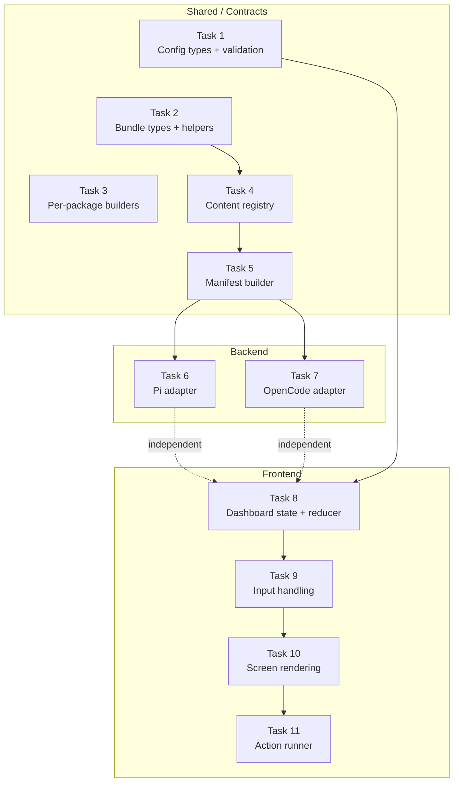

# Tasks: configure-packages-instruction-injection

## Source

- Spec: configure-packages-instruction-injection spec artifact
- Design: configure-packages-instruction-injection design artifact
- Capabilities affected: `package-instruction-config`, `capability-instruction-injection`, `deck-config`, `content-registry`, `developer-team-manifest`, `pi-runner-dashboard`, `opencode-runner-dashboard`

## Task Groups

### Group: Shared / Contracts

#### Task 1: Extend DeckConfig types and validation for packageInstructions

**Owner**: General Apply
**Priority**: P0
**Complexity**: Medium
**Parallel**: Yes
**Depends on**: none

**Description**
Add `PackageInstructionRunnerId`, `PackageInstructionPackageId`, `DeckPackageInstructionRunnerConfig`, `DeckPackageInstructionConfig` types to `packages/core/src/config/deck-config.ts`. Extend `DeckConfig` and `NormalizedDeckConfig` with the `packageInstructions` field. Add `PACKAGE_INSTRUCTION_RUNNERS` and `PACKAGE_INSTRUCTION_PACKAGE_IDS` constants. Implement `normalizePackageInstructionConfig()` with full validation: reject unknown runner keys and package IDs with `DECK_CONFIG_UNKNOWN_FIELD`, reject non-boolean values with `DECK_CONFIG_INVALID_SHAPE`, default missing runners/packages to `false`. Wire into `validateDeckConfig()`, `readDeckConfig()`, `writeDeckConfig()`, and `getDefaultDeckConfig()`. Add `packageInstructions` to the top-level allowlist so unknown-field rejection does not reject it.

**Files**
- `packages/core/src/config/deck-config.ts` — modify
- `packages/core/src/config/deck-config.test.ts` — modify

**Verification**
- `bun test packages/core/src/config/deck-config.test.ts` passes.
- Tests cover: missing field defaults all false, valid per-runner booleans normalize, unknown runner rejected, unknown package ID rejected, non-boolean rejected, writeDeckConfig persists normalized shape, null config input returns defaults.

#### Task 2: Create CapabilityInstructionBundle types and core helpers

**Owner**: General Apply
**Priority**: P0
**Complexity**: Medium
**Parallel**: Yes
**Depends on**: none

**Description**
Create `packages/core/src/teams/developer/instruction-bundles/index.ts` with the public API: `CapabilityInstructionSurface`, `CapabilityInstructionPackageId`, `CapabilityInstructionFragment`, `CapabilityInstructionBundle`, `CapabilityInstructionCompositionContext` types. Implement `buildCapabilityInstructionBundle(packageIds)` — deduplicates, preserves canonical order, delegates to per-package builders. Implement `getEnabledPackageInstructionIds(config, runner)` — reads normalized config and returns enabled IDs. Implement `composeCapabilityInstructions(base, bundle, context)` — filters fragments by surface/team/agent/skill and appends a labeled `## Package Instructions (configured)` section. Re-export all from `packages/core/src/index.ts`.

**Files**
- `packages/core/src/teams/developer/instruction-bundles/index.ts` — create
- `packages/core/src/teams/developer/instruction-bundles/index.test.ts` — create
- `packages/core/src/index.ts` — modify

**Verification**
- `bun test packages/core/src/teams/developer/instruction-bundles/` passes.
- Tests cover: empty enabled IDs → empty bundle, single/multiple packages produce fragments in deterministic order, composer filters by surface/agent/skill, composer appends labeled section, non-matching fragments absent.

#### Task 3: Create canonical instruction builders for each package

**Owner**: General Apply
**Priority**: P0
**Complexity**: Medium
**Parallel**: Yes
**Depends on**: none

**Description**
Create three instruction builder files under `packages/core/src/teams/developer/instruction-bundles/`:
- `codebase-memory.ts`: Returns a `CapabilityInstructionBundle` with fragments instructing agents to prefer `search_graph`, `trace_path`, `get_code_snippet`, `query_graph` for structural code discovery; fall back to file/content search for non-code or insufficient results. Target surfaces: `agent` and `skill` (no `agentIds`/`skillIds` filter — applies to all).
- `context-mode.ts`: Returns a `CapabilityInstructionBundle` with fragments for `ctx_batch_execute`, `ctx_execute`, `ctx_search`, think-in-code paradigm. Target surfaces: `agent` and `skill`.
- `rtk.ts`: Returns a `CapabilityInstructionBundle` with minimal fallback guidance for hook-less environments. Target surfaces: `agent` and `skill`.

Each builder is imported and used by the aggregate `buildCapabilityInstructionBundle` in `index.ts` (wired in Task 2 or verified here if Task 2 stubs them).

**Files**
- `packages/core/src/teams/developer/instruction-bundles/codebase-memory.ts` — create
- `packages/core/src/teams/developer/instruction-bundles/context-mode.ts` — create
- `packages/core/src/teams/developer/instruction-bundles/rtk.ts` — create
- `packages/core/src/teams/developer/instruction-bundles/*.test.ts` — create

**Verification**
- `bun test packages/core/src/teams/developer/instruction-bundles/` passes.
- Each builder returns at least one fragment with correct `surface`, `packageId`, and non-empty `markdown`.

#### Task 4: Extend content-registry to compose capability instructions

**Owner**: General Apply
**Priority**: P0
**Complexity**: Medium
**Parallel**: No — depends on Task 2
**Depends on**: Task 2

**Description**
Modify `packages/core/src/teams/developer/content-registry.ts` to accept `ContentRegistryOptions` with optional `capabilityInstructions?: CapabilityInstructionBundle`. Change `getAgentContent(agentId, options?)` and `getTeamSessionInstructions(teamId, options?)` signatures (backward-compatible optional second parameter). In the composition path, after context-authority guidance, call `composeCapabilityInstructions()` to append matching package instruction fragments. Composition order: (1) static canonical content, (2) context-authority guidance, (3) package instruction fragments. Ensure the function is pure and side-effect free.

**Files**
- `packages/core/src/teams/developer/content-registry.ts` — modify
- `packages/core/src/teams/developer/content-registry.test.ts` — modify

**Verification**
- `bun test packages/core/src/teams/developer/content-registry.test.ts` passes.
- Tests cover: existing output unchanged when no bundle provided, configured fragments appear in agent/skill/session output, non-matching fragments absent, labeled section present, coexistence with memory injection.

#### Task 5: Extend manifest builder for capability instruction bundle

**Owner**: General Apply
**Priority**: P0
**Complexity**: Low
**Parallel**: No — depends on Task 4
**Depends on**: Task 4

**Description**
Add `capabilityInstructions?: CapabilityInstructionBundle` to `BuildManifestOptions` in `packages/core/src/teams/developer/manifest.ts`. When present, pass it through to `getAgentContent(agentId, { capabilityInstructions })` and `getTeamSessionInstructions(teamId, { capabilityInstructions })`. When absent, behavior is identical to current. Also extend `DeveloperTeamManifestInput` in `packages/core/src/runner-capability.ts` with `capabilityInstructions?: CapabilityInstructionBundle` for runner-neutral facade use.

**Files**
- `packages/core/src/teams/developer/manifest.ts` — modify
- `packages/core/src/teams/developer/manifest.test.ts` — modify
- `packages/core/src/runner-capability.ts` — modify

**Verification**
- `bun test packages/core/src/teams/developer/manifest.test.ts` passes.
- Tests cover: manifest with bundle propagates instructions into agent/skill content, manifest without bundle produces identical output to current behavior, both memory and capability bundles coexist.

### Group: Backend

#### Task 6: Integrate package instruction bundle into Pi adapter

**Owner**: General Apply
**Priority**: P1
**Complexity**: Medium
**Parallel**: No — depends on Task 5
**Depends on**: Task 5

**Description**
In `packages/adapter-pi/src/developer-team-install.ts`, read `readDeckConfig(projectRoot)`, call `getEnabledPackageInstructionIds(config, "pi")`, build `CapabilityInstructionBundle` via `buildCapabilityInstructionBundle(enabledIds)`, and pass it into `buildDeveloperTeamManifest({ ..., capabilityInstructions })` and into skill/agent file content builders. Ensure no double composition: the registry composes instructions; adapters only pass the bundle through. Thread through `packages/adapter-pi/src/runner-capabilities.ts` facade. Update `packages/adapter-pi/src/capability-plan.ts` to add a config-write action when package instruction toggles are enabled.

**Files**
- `packages/adapter-pi/src/developer-team-install.ts` — modify
- `packages/adapter-pi/src/developer-team-install.test.ts` — modify
- `packages/adapter-pi/src/runner-capabilities.ts` — modify
- `packages/adapter-pi/src/capability-plan.ts` — modify
- `packages/adapter-pi/src/capability-plan.test.ts` — modify

**Verification**
- `bun test packages/adapter-pi/` passes.
- Tests cover: Pi agent/skill files include enabled package instruction substrings, disabled packages absent, Adaptive Memory tool bindings unaffected.

#### Task 7: Integrate package instruction bundle into OpenCode adapter

**Owner**: General Apply
**Priority**: P1
**Complexity**: Medium
**Parallel**: No — depends on Task 5
**Depends on**: Task 5

**Description**
In `packages/adapter-opencode/src/developer-team-install.ts`, read config, resolve enabled package IDs for `"opencode"`, build bundle, and pass into skill file builders. Extend `packages/adapter-opencode/src/prompt-generation.ts` to accept optional `capabilityInstructions` in its options and compose prompt content. Thread through `packages/adapter-opencode/src/runner-capabilities.ts` facade. Update `packages/adapter-opencode/src/capability-plan.ts` to add config-write action when package instruction toggles are enabled.

**Files**
- `packages/adapter-opencode/src/developer-team-install.ts` — modify
- `packages/adapter-opencode/src/prompt-generation.ts` — modify
- `packages/adapter-opencode/src/prompt-generation.test.ts` — modify
- `packages/adapter-opencode/src/runner-capabilities.ts` — modify
- `packages/adapter-opencode/src/capability-plan.ts` — modify

**Verification**
- `bun test packages/adapter-opencode/` passes.
- Tests cover: OpenCode prompt files include enabled package instruction substrings, disabled packages absent, skill files also receive instructions.

### Group: Frontend

#### Task 8: Add Configure Packages dashboard state and reducer

**Owner**: Frontend Apply
**Priority**: P1
**Complexity**: Medium
**Parallel**: No — depends on Task 1
**Depends on**: Task 1

**Description**
Extend `apps/cli/src/tui/pi-runner-dashboard/state.ts` with `"package-instructions-detail"` screen and `packageInstructions: Partial<Record<CapabilityId, boolean>>` state field. Add reducer actions `toggle-package-instruction` and `set-package-instruction` in `reducer.ts`. Add selectors for the Configure Packages dashboard section in `selectors.ts`: section ID `package-instructions`, title `Configure Packages`, enabled-count from `state.packageInstructions`, cursor limits. Filter to canonical instruction package IDs only (`codebase-memory`, `context-mode`, `rtk`).

**Files**
- `apps/cli/src/tui/pi-runner-dashboard/state.ts` — modify
- `apps/cli/src/tui/pi-runner-dashboard/reducer.ts` — modify
- `apps/cli/src/tui/pi-runner-dashboard/selectors.ts` — modify
- `apps/cli/src/tui/pi-runner-dashboard/state.test.ts` — modify (if exists)
- `apps/cli/src/tui/pi-runner-dashboard/reducer.test.ts` — modify (if exists)
- `apps/cli/src/tui/pi-runner-dashboard/selectors.test.ts` — modify (if exists)

**Verification**
- `bun test apps/cli/src/tui/pi-runner-dashboard/` passes.
- Tests cover: toggle action updates packageInstructions, set action sets explicit value, selectors return correct section summaries, cursor limits include new section.

#### Task 9: Add Configure Packages input handling

**Owner**: Frontend Apply
**Priority**: P1
**Complexity**: Low
**Parallel**: No — depends on Task 8
**Depends on**: Task 8

**Description**
Extend `apps/cli/src/tui/pi-runner-dashboard/input-handler.ts` to route dashboard Enter on Configure Packages to `package-instructions-detail` screen. Space/Enter in detail toggles instruction state. Back returns to dashboard. Existing Packages section navigation remains unchanged.

**Files**
- `apps/cli/src/tui/pi-runner-dashboard/input-handler.ts` — modify
- `apps/cli/src/tui/pi-runner-dashboard/input-handler.test.ts` — modify (if exists)

**Verification**
- `bun test apps/cli/src/tui/pi-runner-dashboard/` passes.
- Test covers: Enter on Configure Packages navigates to detail, toggle in detail updates state, Back returns to dashboard.

#### Task 10: Render Configure Packages dashboard screen

**Owner**: Frontend Apply
**Priority**: P1
**Complexity**: Medium
**Parallel**: No — depends on Task 9
**Depends on**: Task 9

**Description**
Add rendering for the `package-instructions-detail` screen in `apps/cli/src/tui/screens/pi-runner-dashboard-screens.tsx`. The screen must be visually distinct from the Packages installation section. Display package instruction toggles with clear labels and a hint: "instruction injection only; does not install packages." Show toggle state (on/off) for each canonical package ID. On load, read current `packageInstructions` from config and reflect in the UI (via state initialization in reducer).

**Files**
- `apps/cli/src/tui/screens/pi-runner-dashboard-screens.tsx` — modify
- `apps/cli/src/tui/screens/pi-runner-dashboard-screens.test.tsx` — modify (if exists)

**Verification**
- `bun test apps/cli/src/tui/screens/` passes.
- Test covers: Configure Packages section renders with correct labels, toggle states reflect config, hint text present.

#### Task 11: Persist packageInstructions in dashboard action runner

**Owner**: Frontend Apply
**Priority**: P1
**Complexity**: Low
**Parallel**: No — depends on Task 10
**Depends on**: Task 10

**Description**
Modify `apps/cli/src/tui/pi-runner-dashboard/action-runner.ts` to merge `packageInstructions` state into the config object written by `writeDeckConfig`. Preserve existing Adaptive Memory config writes. Do not include credentials. The write must map the dashboard's `packageInstructions` state to the runner-scoped config format (`{ pi: { ... }, opencode: { ... } }`).

**Files**
- `apps/cli/src/tui/pi-runner-dashboard/action-runner.ts` — modify
- `apps/cli/src/tui/pi-runner-dashboard/action-runner.test.ts` — modify (if exists)

**Verification**
- `bun test apps/cli/src/tui/pi-runner-dashboard/` passes.
- Test covers: action runner writes both adaptiveMemory and packageInstructions, credentials excluded, config round-trips correctly.

## Dependency Graph

```
Task 1 (Config types+validation) ──┐
Task 2 (Bundle types+helpers)  ────┤
Task 3 (Per-package builders)  ────┤
                                    ├→ Task 4 (Content registry)
Task 2 ────────────────────────────┘     │
                                          └→ Task 5 (Manifest builder)
                                               │
                                    ┌──────────┼──────────┐
                                    ▼                     ▼
                              Task 6 (Pi adapter)   Task 7 (OpenCode adapter)

Task 1 ─────────────────────────────→ Task 8 (Dashboard state+reducer)
                                          │
                                          └→ Task 9 (Input handling)
                                               │
                                               └→ Task 10 (Screen rendering)
                                                    │
                                                    └→ Task 11 (Action runner)
```

## Parallelization Plan

| Phase | Tasks | Can Run in Parallel |
|---|---|---|
| Shared Core | 1, 2, 3 | Yes — no file overlap, independent types |
| Shared Core (sequential) | 4 | No — needs Task 2 types |
| Shared Core (sequential) | 5 | No — needs Task 4 registry changes |
| Backend | 6, 7 | Yes — Pi and OpenCode adapters are independent; both depend on Task 5 |
| Frontend | 8 | No — depends on Task 1 config types |
| Frontend (sequential) | 9 | No — depends on Task 8 |
| Frontend (sequential) | 10 | No — depends on Task 9 |
| Frontend (sequential) | 11 | No — depends on Task 10 |
| Backend + Frontend | 6+7 vs 8 | Yes — backend adapters and frontend dashboard are independent after their shared deps |

## Responsibility Contracts

| Contract / Boundary | Owner | Consumers | Notes |
|---|---|---|---|
| `NormalizedDeckConfig.packageInstructions` shape and constants | Task 1 (General Apply) | Tasks 6, 7, 8 | All consumers read the normalized shape; must not handle `undefined` runners |
| `CapabilityInstructionBundle` type and `composeCapabilityInstructions()` | Task 2 (General Apply) | Tasks 4, 6, 7 | Adapters must not re-compose; registry is the single composition point |
| `ContentRegistryOptions` with `capabilityInstructions` | Task 4 (General Apply) | Tasks 5, 6, 7 | Registry composes; adapters only pass bundle through |
| `BuildManifestOptions.capabilityInstructions` | Task 5 (General Apply) | Tasks 6, 7 | Manifest threads bundle to registry calls |
| `RunnerDashboardState.packageInstructions` | Task 8 (Frontend Apply) | Tasks 9, 10, 11 | State is the single source of truth for dashboard toggles |

## Complexity Summary

| Complexity | Count | Task Numbers |
|---|---|---|
| Low | 3 | 5, 9, 11 |
| Medium | 8 | 1, 2, 3, 4, 6, 7, 8, 10 |
| High | 0 | — |

## Flagged for Splitting

None — all tasks are scoped to one session. Task 6 and Task 7 each touch 4-5 files but are mechanical integration (read config → build bundle → pass through) rather than complex logic.

## Review Workload Forecast

| Signal | Value |
|---|---|
| Estimated changed lines | 400-800 |
| 400-line budget risk | Medium |
| Scope reduction recommended | No |
| Sequential work slices recommended | Yes — split into 3 slices: (1) Tasks 1-5 shared core, (2) Tasks 6-7 adapters, (3) Tasks 8-11 dashboard |
| Decision needed before Apply | No — spec open questions have defaults agreed in proposal |

**Rationale**: The change touches ~25 files across 4 packages and the CLI app. Shared core (Tasks 1-5) is the largest slice at ~300-400 lines of new/modified code plus tests. Adapters (Tasks 6-7) are ~100-150 lines each. Dashboard (Tasks 8-11) is ~150-200 lines. Total estimate 500-700 lines. The three sequential slices align with the dependency graph and allow review between slices.

## Open Questions / Blockers

None — tasks are ready for Apply. All spec open questions have agreed defaults:
- OpenQ-1: explicit toggle (not auto-enable)
- OpenQ-2: RTK minimal fallback guidance
- OpenQ-3: section label "Configure Packages"
- OpenQ-4: `teamId` field included in `CapabilityInstructionFragment` (mirrors `MemoryInstructionFragment` pattern)

## Mermaid Summary Source


