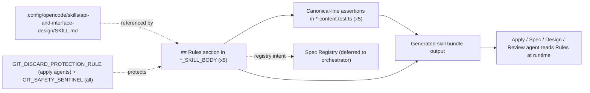

# Design: Consolidate API and Interface Design Guidance

## Source

- Proposal: `consolidate-api-and-interface-design` proposal artifact (Phase 3D)
- Exploration: `openspec/changes/consolidate-api-and-interface-design/exploration.md`
- Roadmap: `docs/skills-integration-roadmap.md` lines 339–368 (Phase 3D section)
- Capabilities affected: `developer-team-prompt-guidance`, `developer-team-content-verification`
- Spec status: not yet available (Spec runs in parallel; Design depends only on Proposal + Exploration + existing Phase 3A/3B precedent)

## Current Architecture Context

### Content-module pattern

Each Developer Team phase/apply role has a paired `*-content.ts` module exporting two TypeScript string constants consumed by the team installer:

| Constant | Purpose | Surface |
|---|---|---|
| `*_AGENT_BODY` | Thin identity + boundaries + non-goals + skill reference | Written into the agent file after runtime frontmatter |
| `*_SKILL_BODY` | Detailed methodology, structured output template, persistence, return format | Written into the skill file after runtime frontmatter |

Apply-agent files additionally inject `${GIT_DISCARD_PROTECTION_RULE}` and have a `## Serena Enforcement` block below `## Rules`. Phase-agent files (design, spec, review, task, proposal, explorer, verify) have only `## Rules` at the tail (followed by closing backtick + semicolon).

### Current `## Rules` shape of the 5 target files

Phase 3D targets 5 `*-content.ts` files. The shape of their `## Rules` block is **not uniform** — three of five are in the "old" (Phase 3A) state with a single using-agent-skills line, and two of five are in the "Phase 3A + 3B" state with two lines:

| File | Current Rules body | Lines |
|---|---|---|
| `apply-backend-content.ts` | using-agent-skills only | 1 |
| `apply-general-content.ts` | using-agent-skills only | 1 |
| `design-content.ts` | using-agent-skills + cognitive-doc-design | 2 |
| `spec-content.ts` | using-agent-skills + cognitive-doc-design | 2 |
| `review-content.ts` | using-agent-skills + cognitive-doc-design | 2 |

This asymmetry is the result of Phase 3B (cognitive-doc-design) consolidating only onto the 6 phase-agent files (proposal, spec, design, task, review, verify) plus explorer-as-bullet. The two apply-agent target files (`apply-backend`, `apply-general`) and the two phase-agent files that are NOT in the 5-target list (`task`, `proposal`) were never touched by 3B. The 5-target list for 3D is independent of the 3B target list.

### Existing test pattern (`Canonical line replacement` and `Cognitive doc design canonical line` blocks)

The two precedent consolidations (Phase 3A: using-agent-skills; Phase 3B: cognitive-doc-design) each added a `describe(...)` block to the affected `*-content.test.ts` files. Both blocks assert the same 4-test shape:

1. `SKILL_BODY` contains the canonical line exactly once (`split(LINE).length - 1 === 1`).
2. `SKILL_BODY` does **not** contain a bullet variant (`- ${LINE}`).
3. `AGENT_BODY` does **not** contain the canonical line (AGENT immutability).
4. `SKILL_BODY` preserves the `## Rules` heading.

`CANONICAL_LINE` is declared as a local `const` at the top of each `describe` block. For apply agents the existing `Canonical line replacement` block (using-agent-skills) already exists; for phase agents, the `Cognitive doc design canonical line` block (cognitive-doc-design) already exists. Phase 3D mirrors these by adding a third block to each of the 5 test files.

### Reference skill

`packages/core/src/skills/external/api-and-interface-design/SKILL.md` exists as a standalone skill (294 lines). It is registered in `packages/core/src/skills/external/index.ts` (line 50) and present in the generated `content.generated.ts`. The skill content covers Hyrum's Law, the One-Version Rule, contract-first design, validation at boundaries, consistent error semantics, REST/resource patterns, TypeScript input/output separation, and predictable naming. It is the canonical source Phase 3D is consolidating onto. The `using-agent-skills` discovery tree already routes "API work" to this skill (line 136 of `content.generated.ts`).

### Critical Git Safety context

`GIT_DISCARD_PROTECTION_RULE` is injected into every apply-agent `## Rules` section (via the `GIT_DISCARD_PROTECTION_RULE` constant in `apply-*-content.ts`) and `GIT_SAFETY_SENTINEL` is asserted in every `*-content.test.ts` `Git Safety Rule presence` describe block. The 3 apply-agent files in scope (apply-backend, apply-general) and 2 phase-agent files (design, spec, review) are all already covered. The 3D change must NOT alter or remove any of these rules/sentinels.

## Proposed Architecture

Add the canonical `api-and-interface-design` reference to the `## Rules` section of each of the 5 `*_SKILL_BODY` constants, following the established Phase 3A (using-agent-skills) and Phase 3B (cognitive-doc-design) pattern. Preserve every existing artifact contract, output template, registry instruction, return format, table, report structure, Git safety rule, and Serena enforcement block. Do not touch `*_AGENT_BODY` constants. Do not touch orchestrator, explorer, verify, task, proposal, apply-frontend, archive, visual-explanations, the generated bundle, the content registry, or the `api-and-interface-design` skill file itself.

### Component / Module Boundaries

| Component | Responsibility | Change Type |
|---|---|---|
| `packages/core/src/teams/developer/apply-backend-content.ts` | Append canonical line to `APPLY_BACKEND_SKILL_BODY` `## Rules` | modified |
| `packages/core/src/teams/developer/apply-general-content.ts` | Append canonical line to `APPLY_GENERAL_SKILL_BODY` `## Rules` | modified |
| `packages/core/src/teams/developer/design-content.ts` | Append canonical line to `DESIGN_SKILL_BODY` `## Rules` | modified |
| `packages/core/src/teams/developer/spec-content.ts` | Append canonical line to `SPEC_SKILL_BODY` `## Rules` | modified |
| `packages/core/src/teams/developer/review-content.ts` | Append canonical line to `REVIEW_SKILL_BODY` `## Rules` | modified |
| `packages/core/src/teams/developer/apply-backend-content.test.ts` | Add api-and-interface-design canonical-line assertions block | modified |
| `packages/core/src/teams/developer/apply-general-content.test.ts` | Add api-and-interface-design canonical-line assertions block | modified |
| `packages/core/src/teams/developer/design-content.test.ts` | Add api-and-interface-design canonical-line assertions block | modified |
| `packages/core/src/teams/developer/spec-content.test.ts` | Add api-and-interface-design canonical-line assertions block | modified |
| `packages/core/src/teams/developer/review-content.test.ts` | Add api-and-interface-design canonical-line assertions block | modified |
| `openspec/changes/consolidate-api-and-interface-design/design.md` | This design artifact | new |
| All other modules (orchestrator, explorer, verify, task, proposal, apply-frontend, archive, visual-explanations, content-registry, `api-and-interface-design` skill, generated bundle) | Untouched | unchanged |

### Data Flow

No data-flow change. The 5 `*_SKILL_BODY` constants are static template strings consumed by the team installer (`developer-team-install.ts`) and emitted into skill files at install time. Adding a line to the `## Rules` section propagates verbatim into the generated skill surface. The downstream consumers (agent runtime, orchestrator) read the same string and gain an additional skill reference; no parser, schema, or transport changes.

### API / Contract Implications

| Endpoint / Interface | Change | Backward Compatible |
|---|---|---|
| `APPLY_BACKEND_SKILL_BODY` exported string constant | Append 1 prose line under `## Rules` (2nd line, after using-agent-skills) | yes (additive only) |
| `APPLY_GENERAL_SKILL_BODY` exported string constant | Append 1 prose line under `## Rules` (2nd line, after using-agent-skills) | yes |
| `DESIGN_SKILL_BODY` exported string constant | Append 1 prose line under `## Rules` (3rd line, after cognitive-doc-design) | yes |
| `SPEC_SKILL_BODY` exported string constant | Append 1 prose line under `## Rules` (3rd line, after cognitive-doc-design) | yes |
| `REVIEW_SKILL_BODY` exported string constant | Append 1 prose line under `## Rules` (3rd line, after cognitive-doc-design) | yes |
| `*_AGENT_BODY` exported string constants (×5) | Unchanged | yes (no diff) |
| `developer-team-install.ts` / bundle emitter | Unchanged | yes (consumes strings as opaque blobs) |

### State / Persistence Implications

None. The 5 constants are in-memory string literals compiled into the package; no schema, database, or registry entries are affected. The OpenSpec `state.yaml` and `events.yaml` for this change are **out of scope for the design phase** (registry-deferred mode — orchestrator will serialize the registry update after the parallel batch completes).

### Migration / Backward Compatibility

None required. The change is purely additive: one new line per `*_SKILL_BODY`. No existing consumers depend on the absence of the new line; no contract surface is removed, renamed, or restructured. A developer-team-install invocation on the previous bundle output produces byte-identical files except for the added `## Rules` line.

### Canonical reference line (exact text)

The single canonical sentence, taken verbatim from the proposal and exploration (and matching the Phase 3A/3B precedent of one byte-identical string across all targets):

```text
Follow the api-and-interface-design skill for stable API and interface design guidance.
```

This line is byte-identical across all 5 target files. Tests must assert this exact string (not a regex), to keep the contract reviewable and prevent drift. The line wording is the natural mirror of the cognitive-doc-design canonical line and the using-agent-skills canonical line — the same `Follow the <skill> skill for <scope> guidance.` shape.

### Insertion rule per file

| File | Current Rules body | Append at position | Resulting line count |
|---|---|---|---|
| `apply-backend-content.ts` | `using-agent-skills` (1 line) | 2nd line, after a blank line | 2 |
| `apply-general-content.ts` | `using-agent-skills` (1 line) | 2nd line, after a blank line | 2 |
| `design-content.ts` | `using-agent-skills` + `cognitive-doc-design` (2 lines) | 3rd line, after a blank line | 3 |
| `spec-content.ts` | `using-agent-skills` + `cognitive-doc-design` (2 lines) | 3rd line, after a blank line | 3 |
| `review-content.ts` | `using-agent-skills` + `cognitive-doc-design` (2 lines) | 3rd line, after a blank line | 3 |

All 5 files use the **prose** form (one canonical sentence on its own line, separated from the previous line by a blank line). None of the 5 files have a `## Rules` body in bullet-list form, so no special-casing is needed (unlike the explorer-only exception in Phase 3B). The blank-line separation matches the existing style between the using-agent-skills line and the cognitive-doc-design line in `design-content.ts`, `spec-content.ts`, `review-content.ts`, and `proposal-content.ts` (which is in the 3B target set but not the 3D target set).

### Scope discipline — why 5 files, not 8

The proposal explicitly lists 5 target files matching the Phase 3D roadmap section. Exploration flagged 3 additional candidates (`task-content.ts`, `proposal-content.ts`, `apply-frontend-content.ts`) as "potentially relevant" but did not recommend including them. Design accepts the 5-file scope because:

1. The proposal's "Target roadmap files" section and "Acceptance Direction" section both reference exactly 5 files.
2. The roadmap Phase 3D section (lines 343–349) names exactly 5 files.
3. The 3 candidates have similar surface area but no concrete gap demonstrated in exploration. Adding them would expand blast radius without roadmap or proposal justification (the Phase 3B precedent expanded scope once for cognitive-doc-design because the case was explicit; here it is not).
4. The open questions about the 3 candidates are recorded as **Open Decisions** below; the orchestrator or user can choose to widen scope in a follow-up change.

The 5-file scope is the **minimum sufficient** set to satisfy the proposal's Acceptance Direction. It is also the **maximum safe** set given the proposal's explicit "preserve SDD artifact contracts" requirement (wider scope = wider surface to defend against accidental contract edits).

## File Impact Estimate

| File / Path | Action | Rationale |
|---|---|---|
| `packages/core/src/teams/developer/apply-backend-content.ts` | modify | Append 1 prose line to `APPLY_BACKEND_SKILL_BODY` `## Rules` |
| `packages/core/src/teams/developer/apply-general-content.ts` | modify | Append 1 prose line to `APPLY_GENERAL_SKILL_BODY` `## Rules` |
| `packages/core/src/teams/developer/design-content.ts` | modify | Append 1 prose line to `DESIGN_SKILL_BODY` `## Rules` |
| `packages/core/src/teams/developer/spec-content.ts` | modify | Append 1 prose line to `SPEC_SKILL_BODY` `## Rules` |
| `packages/core/src/teams/developer/review-content.ts` | modify | Append 1 prose line to `REVIEW_SKILL_BODY` `## Rules` |
| `packages/core/src/teams/developer/apply-backend-content.test.ts` | modify | Add `describe("API and interface design canonical line")` block with 4 assertions (mirrors cognitive-doc-design block) |
| `packages/core/src/teams/developer/apply-general-content.test.ts` | modify | Same as above |
| `packages/core/src/teams/developer/design-content.test.ts` | modify | Same as above |
| `packages/core/src/teams/developer/spec-content.test.ts` | modify | Same as above |
| `packages/core/src/teams/developer/review-content.test.ts` | modify | Same as above |
| `openspec/changes/consolidate-api-and-interface-design/design.md` | create | This artifact (registry-deferred mode: no state.yaml or events.yaml edit) |

> Task Agent will refine exact line numbers. Total: **5 source edits + 5 test edits = 10 file modifications + 1 new design.md = 11 file operations**, all additive.

## Testing Strategy

Layer: **unit (bun:test)**, applied to the exported string constants.

For each of the 5 `*_content.test.ts` files, add a `describe("API and interface design canonical line")` block (positioned after the existing `Cognitive doc design canonical line` block for the 3 phase-agent files, or after the existing `Canonical line replacement` block for the 2 apply-agent files). The block defines a local constant:

```ts
const AID_CANONICAL_LINE =
  "Follow the api-and-interface-design skill for stable API and interface design guidance.";
```

and contains the following 4 assertions, modeled on the cognitive-doc-design block:

1. `expect(*_SKILL_BODY.split(AID_CANONICAL_LINE).length - 1).toBe(1)` — present exactly once.
2. `expect(*_SKILL_BODY).not.toContain(`- ${AID_CANONICAL_LINE}`)` — no bullet variant.
3. `expect(*_AGENT_BODY).not.toContain(AID_CANONICAL_LINE)` — AGENT immutability.
4. `expect(*_SKILL_BODY).toContain("## Rules")` — Rules section preserved.

The local `AID_CANONICAL_LINE` constant is declared per-file (no shared test-helper file is introduced) to match the Phase 3A and 3B precedent.

### Existing test blocks must remain unchanged

The following existing describe blocks in each affected test file are **not touched** and must continue to pass:

- `Canonical line replacement` (Phase 3A, using-agent-skills) — exists in all 5 files; the using-agent-skills canonical line is still present exactly once.
- `Cognitive doc design canonical line` (Phase 3B) — exists in 3 of 5 files (`design`, `spec`, `review`); the cognitive-doc-design canonical line is still present exactly once.
- `Serena Enforcement preserved` (apply agents only, `apply-backend`, `apply-general`) — `## Serena Enforcement` heading still present.
- `Git Safety Rule presence` (all 5 files) — `GIT_SAFETY_SENTINEL` still present in both AGENT_BODY and SKILL_BODY.
- `Cross-differentiation`, `Output template`, `Return contract`, `Identity header`, `Placeholder detection`, `Runtime neutrality`, etc. — all other structural assertions are unaffected because the change is purely additive to `## Rules`.

### Verification of the design itself

After Task Agent applies the 5 source edits and 5 test edits, run `bun test packages/core/src/teams/developer/*-content.test.ts`. The proposal's Acceptance Direction (7 items) maps to test outcomes:

- "Canonical sentence appears once on every required surface" → assertion #1 across all 5 files.
- "Tests verify exported prompt/body surfaces" → assertions target `*_SKILL_BODY` constants, not raw file contents.
- "Design API/Contract Implications table remains inline and unchanged in purpose" → existing `design-content.ts` template/table tests still pass; the 3D edit is in `## Rules`, not the template.
- "Spec validation rules and error contracts remain inline and unchanged in purpose" → existing `spec-content.ts` template tests still pass; the 3D edit is in `## Rules`, not the template.
- "Apply progress formats and Review report structure remain intact" → existing `apply-*-content.ts` and `review-content.ts` template/return-contract tests still pass; the 3D edit is in `## Rules`, not the templates.
- "Focused Developer Team content tests pass for affected modules" → the new `describe` block in each of the 5 test files passes.
- "No destructive Git operation is used during implementation or rollback" → enforced by the `GIT_DISCARD_PROTECTION_RULE` already in apply-agent SKILL_BODY, and by the explicit design instruction to Apply agents below.

## Observability / Error Handling

None. The change is static string content consumed by the installer at build time. No new runtime paths, no new error states, no logging.

## Security / Performance / Accessibility Considerations

None specific to this change. The canonical line is a directive in an English-language prompt surface; it carries no executable code, no user input, no PII handling, and no rendering implications.

## Tradeoffs

| Decision | Chosen | Rejected Alternative | Rationale |
|---|---|---|---|
| Required surface per target | `*_SKILL_BODY` only (Option 1, Phase 3A/3B precedent) | Add to both `*_AGENT_BODY` and `*_SKILL_BODY` (Option 2) | Exploration + roadmap + 3A/3B precedent all recommend Option 1; smaller blast radius; AGENT bodies already route to the skill via "Follow the matching skill" — adding a third skill ref to the thin identity surface creates redundancy without changing runtime behavior |
| Target file count | 5 files (matches proposal + roadmap) | 8 files (add `task`, `proposal`, `apply-frontend`) | Proposal and roadmap lock the scope to 5. Exploration flagged 3 candidates as "potentially relevant" but not required. Wider scope = wider contract-defense surface with no demonstrated gap. Recorded as Open Decisions for follow-up |
| Insertion site inside `## Rules` | Append at the end (last line, after a blank line) | Prepend (before using-agent-skills) or interleave (between existing lines) | Append preserves the precedence of the existing references (using-agent-skills = operating behavior, cognitive-doc-design = artifact structure, api-and-interface-design = domain methodology). The cognitive-doc-design precedent uses the same append-at-end rule |
| Apply-agent test pattern | Add new `describe("API and interface design canonical line")` block | Reuse the existing `Canonical line replacement` block with a renamed constant | Per-file describe block is the established 3A/3B pattern. Renaming a shared block would touch a passing test suite and risk regression in a different consolidation; adding a new block is purely additive and matches the cognitive-doc-design precedent exactly |
| Canonical line exactness | Byte-identical string across all 5 files | Per-file paraphrase | One canonical sentence is reviewable in one diff, easier to grep across the bundle, and prevents drift. The proposal and exploration both specify this exact wording |
| Test target | Exported `*_SKILL_BODY` constant (structured surface) | Raw `fs.readFileSync` of the `.ts` file | The proposal's risk #2 explicitly requires the structured surface. All existing tests already import the constant; the new tests follow the same import pattern |
| Scope of edits | 5 source files + 5 test files only | Touch orchestrator, explorer, verify, task, proposal, apply-frontend, archive, visual-explanations, generated bundle, or `api-and-interface-design/SKILL.md` | Out-of-scope per the proposal; would change the blast radius and risk profile without roadmap justification |
| Git safety enforcement | Rely on the existing `GIT_DISCARD_PROTECTION_RULE` in apply-agent `## Rules` blocks (already present in 2 of 5 targets) + explicit design instruction to apply agents | Add a new git-safety rule to the change | The existing rule covers the destructive-commands concern. Adding a new rule would be a parallel policy invention; the change is purely additive content, not a git-policy change. The Phase 3A/3B precedents did not introduce a new rule and were safe |
| Inline contract preservation | Leave Design API/Contract Implications table, Spec validation/error-contract prose, Apply-progress formats, Review report structure **completely unchanged** in the source files | Trim inline contract prose to defer to the skill (e.g., remove the API/Contract Implications table from design-content.ts) | Proposal's Acceptance Direction items 3–5 and the roadmap lines 364–368 explicitly require these contracts to remain inline. The skill is a methodology reference, not a contract source. Trimming would weaken the artifact contract and risk regression in the proposal's most important acceptance criterion |
| Registry write in this design phase | **Defer** (registry-deferred mode) | Write `state.yaml` and `events.yaml` directly | Orchestrator launched this design in registry-deferred mode. The orchestrator will serialize the registry update after the parallel batch (Spec + Design) completes. No `state.yaml` or `events.yaml` edit is performed by this design phase |

## Risks

| Risk | Likelihood | Impact | Mitigation |
|---|---|---|---|
| Accidentally editing an output template, return contract, or table when inserting near the Rules block | Medium | High (breaks downstream agent consumption) | Insertion site is the very last section of the SKILL_BODY, well past the output template and return format blocks. Task Agent must verify via diff that no template/contract text changed. Existing template/contract/cross-differentiation tests will fail if any template is altered |
| Tests pass against file-level strings but miss the exported constant | Low | Medium (false sense of coverage) | Every existing test file already imports the `*_SKILL_BODY` constant from the `.ts` module. New tests follow the same import pattern. No `fs.readFileSync` of the source file is introduced |
| Canonical line drifts from roadmap wording in future edits | Low | Low (silent contract drift) | Tests assert the exact byte string; any future edit that changes the wording will fail the new tests. The using-agent-skills and cognitive-doc-design precedents already enforce this discipline |
| Git-safety / data-loss regression during this change | Low | High (loss of untracked OpenSpec artifacts) | All edits are to **tracked** files in `packages/core/src/teams/developer/`. The `openspec/changes/consolidate-api-and-interface-design/` directory (untracked) is read-only during this phase. **No destructive git commands are used.** The 2 apply-agent target files already inject `GIT_DISCARD_PROTECTION_RULE`; the 3 phase-agent target files have `GIT_SAFETY_SENTINEL` tests that must continue to pass. Apply agents must follow the existing rule. See "Critical Git safety" below |
| Registry write conflict in this design phase | Low | Low | This design is written in **registry-deferred mode**. No `state.yaml` or `events.yaml` edit. The orchestrator will serialize the registry update after the parallel batch (Spec + Design) completes. See Registry Intent in the return contract |
| `apply-frontend-content.ts` or `task-content.ts` or `proposal-content.ts` is later found to need the canonical reference, requiring a follow-up change | Low | Low | Recorded as Open Decisions. A follow-up change is a 1-line + 1-test-block addition per file, identical pattern to this change. The 5-file scope is the proposal-locked minimum, not an absolute maximum |
| `design-content.ts` / `spec-content.ts` / `review-content.ts` Rules section grows to 3 lines and visual reviewer finds the block "long" | Very Low | Very Low (cosmetic) | The block remains 3 short prose lines with blank-line separators. The roadmap allows for additional canonical skill references in later phases (Phase 3E: documentation-and-adrs, Phase 3F: security-and-hardening, etc.) — the 3-line ceiling will rise over time anyway |
| `api-and-interface-design` skill is uninstalled between Phase 1 (verified complete) and Phase 3D apply | Very Low | Medium (apply agents have a dangling reference) | Phase 1 status verified in `state.yaml` (line 12: `phase1_status: complete`) and the skill is on disk + registered. Apply agents should still pass with a missing-skill reference; the directive is harmless if the skill is absent (the agent falls back to existing inline contract language, which is preserved) |

### Critical Git safety

This change is explicitly subject to the "critical Git safety" user directive and the proposal's "No destructive Git operation" acceptance criterion. The following guardrails are mandatory for Apply agents:

1. **No `git reset`, `git clean`, `git stash drop`, `git checkout --`, `git restore --source=`, `git push --force`, or any other destructive command** is permitted during implementation or rollback. The existing `GIT_DISCARD_PROTECTION_RULE` in the apply-agent SKILL_BODY covers this for the 2 apply-agent targets; the 3 phase-agent targets (design, spec, review) do not run apply tasks but must still respect the rule if invoked.
2. **Touch only `packages/core/src/teams/developer/apply-{backend,general}-content.ts`, `packages/core/src/teams/developer/{design,spec,review}-content.ts`, and the matching 5 `*-content.test.ts` files.** Do not modify the `openspec/changes/consolidate-api-and-interface-design/` directory (the untracked worktree) by any git operation.
3. **Stage explicitly** with `git add <path>` for each of the 10 files. Never use `git add .` or `git add -A` from the repo root (risk of accidentally staging untracked OpenSpec artifacts).
4. **Verify with `git status` and `git diff --cached`** before any commit. The 10 modified files should be the only ones staged.
5. **Rollback** (if needed) is a reverse patch limited to the 10 affected files, applied via `git checkout HEAD -- <path>` for the 5 source files and the 5 test files **only** (and only with explicit user confirmation in a separate new message — not as part of the apply phase). Do not use `git stash`, `git clean`, or `git reset` to roll back.
6. **Commit message** must follow the project's conventional-commit style and reference the change name: `feat(developer-team): consolidate api-and-interface-design guidance (Phase 3D)`.

## Open Decisions

- **Should `task-content.ts` be included as a 6th target?** The proposal and roadmap do not include it. Exploration flagged it as "potentially relevant" because of "API contracts" in the task routing table. The 3D scope is locked at 5 by the proposal; a follow-up change could add it as a 1-line + 1-test-block addition. — *Open; out of scope for this design.*
- **Should `proposal-content.ts` be included as a 6th target?** Same reasoning as task-content. — *Open; out of scope for this design.*
- **Should `apply-frontend-content.ts` be included as a 6th target?** The exploration noted its "do not invent, mock, or reshape backend contracts" line as adjacent to api-and-interface-design guidance. The proposal excludes it (matching the Phase 3A precedent of skipping apply-frontend for non-domain skills). — *Open; out of scope for this design.*
- **Should a parallel line be added to `*_AGENT_BODY` for visibility at agent-instruction read time?** — *Open if user disagrees with Option 1; current design selects SKILL_BODY only, matching 3A/3B precedent.*
- **Should a shared `*-content.test-helpers.ts` be introduced to factor out `AID_CANONICAL_LINE`?** — *Open, low value. The using-agent-skills and cognitive-doc-design precedents duplicate the constant per file. Recommend duplicate-per-file for now to match precedent; refactor in a later test-helper consolidation PR if desired.*

> None of these are blocking. All are micro-decisions the Task Agent can implement with one-line edits per file if the user later prefers the other branch.

## Dependencies

- `packages/core/src/skills/external/api-and-interface-design/SKILL.md` must exist on disk (verified: present, 294 lines, registered in `index.ts` line 50, present in `content.generated.ts` line 18).
- `packages/core/src/teams/developer/*-content.ts` modules must remain importable; no source-tree restructuring is required.
- `bun test` must be available (existing test infrastructure; no new tooling).
- `docs/skills-integration-roadmap.md` Phase 3D section is the upstream authority for the canonical sentence wording and the 5-file target list.
- The change is **sequential after Phase 3C** (`consolidate-code-review-and-quality`); the `state.yaml` `depends_on` block records this advisory relationship.

## Next Steps

Ready for Task (`deck-developer-task`) to break this design into 10 atomic implementation tasks (5 source-file edits + 5 test-file edits) and route them to the apply-general agent. Spec runs in parallel; the spec agent's acceptance criteria should mirror the proposal's Acceptance Direction section, which is testable directly against the new test assertions. Registry update for the design phase is deferred to the orchestrator.

## Mermaid Summary Source


