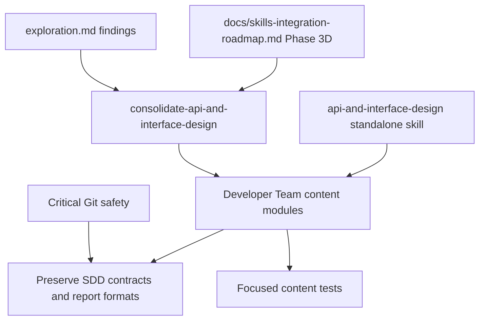

# Proposal: Consolidate API and Interface Design Guidance

## Intent

Phase 3D of the Skills Integration Roadmap needs Developer Team API, interface, contract, validation, and error-semantics guidance to point at the standalone `api-and-interface-design` skill, while preserving Deck-specific SDD contracts that downstream phases depend on.

## Goal

Add canonical `api-and-interface-design` guidance to the relevant Developer Team prompt surfaces without changing SDD artifact contracts, output formats, registries, or apply/review report structures.

## Scope

### In Scope
- Add the canonical line: `Follow the api-and-interface-design skill for stable API and interface design guidance.`
- Target roadmap files:
  - `packages/core/src/teams/developer/apply-backend-content.ts`
  - `packages/core/src/teams/developer/apply-general-content.ts`
  - `packages/core/src/teams/developer/design-content.ts`
  - `packages/core/src/teams/developer/spec-content.ts`
  - `packages/core/src/teams/developer/review-content.ts`
- Preserve inline SDD contracts: Design API/Contract Implications table, Spec validation/error-contract guidance, Apply progress formats, and Review report structure.
- Add or update focused Developer Team content tests for required prompt surfaces.

### Out of Scope
- Modifying the standalone `api-and-interface-design` skill content or external skill registry.
- Rewriting API/design/spec/review artifact formats or acceptance structures.
- Later roadmap phases such as `documentation-and-adrs`, `security-and-hardening`, or `performance-optimization` consolidation.
- Destructive Git cleanup/reset operations; rollback must be a reviewable reverse patch.

## Affected Capabilities

### New Capabilities
- None.

### Modified Capabilities
- `developer-team-prompt-guidance`: Developer Team agents receive canonical API/interface methodology through `api-and-interface-design` references.
- `developer-team-content-verification`: Tests should verify the canonical reference appears on required exported prompt/body surfaces.

### Unchanged Capabilities
- `sdd-artifact-contracts`: Output templates, artifact filenames, registry persistence, return contracts, tables, and report structures remain authoritative inline.
- `standalone-skill-installation`: `api-and-interface-design` already exists and remains unchanged.
- `critical-git-safety`: Existing destructive-Git protections remain unchanged and must be preserved.

## Approach

Follow the roadmap and exploration recommendation: add one canonical `api-and-interface-design` sentence where Developer Team prompts discuss contracts, validation, API design, shared schemas, and review checks. Keep edits minimal, prefer `SKILL_BODY` surfaces following Phase 3A/3B precedent unless Spec/Design confirms additional surfaces, and validate with focused content tests.

## Alternatives and Tradeoffs

| Alternative | Why Considered | Why Not Chosen |
|---|---|---|
| Add references only to the 5 roadmap targets | Matches Phase 3D roadmap and keeps scope small | May miss `task-content.ts`, `proposal-content.ts`, or `apply-frontend-content.ts` if Spec/Design decides they materially participate in API-contract behavior. |
| Include all discovered contract-related files | Covers every surface found during exploration | Larger blast radius and higher redundancy risk; should be decided in Spec/Design. |
| Replace inline contract tables/checklists with the skill reference | Maximizes deduplication | Too risky: SDD-specific contracts and report formats must remain inline and authoritative. |
| Modify the standalone skill itself | Could centralize more guidance | Exploration confirms the skill is already installed and sufficient for this phase. |

## Risks

| Risk | Likelihood | Mitigation |
|---|---|---|
| SDD artifact/report contracts are weakened by over-consolidation | Medium | Preserve all inline tables, templates, registry instructions, progress formats, and review structures. |
| Required prompt surface is ambiguous (`AGENT_BODY`, `SKILL_BODY`, or both) | Medium | Spec/Design must define exact required surfaces before Apply. |
| Duplicate references overlap with `code-review-and-quality` in Review Agent | Medium | Use one canonical API/interface sentence and keep review methodology references distinct. |
| Tests only assert raw file string presence | Medium | Require tests against exported prompt/body constants or structured content surfaces. |
| Existing untracked OpenSpec work is accidentally disturbed | Low | Touch only `openspec/changes/consolidate-api-and-interface-design/`; avoid destructive Git commands. |

## Rollback Plan

If the change causes prompt/test regressions, remove the canonical `api-and-interface-design` references and associated focused test assertions with a reviewable reverse patch limited to affected Developer Team content/test files. Preserve existing OpenSpec artifacts unless the normal OpenSpec workflow archives or supersedes them. Do not use `git reset`, `git clean`, `stash drop`, or similar destructive Git commands without explicit user confirmation in a separate new message.

## Dependencies

- Roadmap Phase 3D guidance in `docs/skills-integration-roadmap.md`.
- Existing standalone skill at `packages/core/src/skills/external/api-and-interface-design/SKILL.md`.
- Existing external skill registration in `packages/core/src/skills/external/index.ts`.
- Existing Developer Team content test infrastructure.
- Sequential dependency on verified Phase 3C `consolidate-code-review-and-quality` remains advisory from the current registry state.

## Open Questions

- Should `task-content.ts` be included because it routes API/contract work?
- Should `proposal-content.ts` be included because proposals assess API/contract risk?
- Should `apply-frontend-content.ts` be included because frontend agents consume backend contracts?
- Which prompt surfaces are mandatory per target: `AGENT_BODY`, `SKILL_BODY`, or both?
- Are new tests needed for Phase 3D, or can existing Developer Team content tests be extended?

## Acceptance Direction

- [ ] The exact canonical sentence appears once on every required surface for all approved target content modules.
- [ ] Tests verify exported prompt/body surfaces, not only raw file-level string presence.
- [ ] Design API/Contract Implications table remains inline and unchanged in purpose.
- [ ] Spec validation rules and error contracts remain inline and unchanged in purpose.
- [ ] Apply progress formats and Review report structure remain intact.
- [ ] Focused Developer Team content tests pass for affected modules.
- [ ] No destructive Git operation is used during implementation or rollback.

## Next Steps

Ready for Spec (`deck-developer-spec`) and Design (`deck-developer-design`) in parallel.

## Mermaid Summary Source

