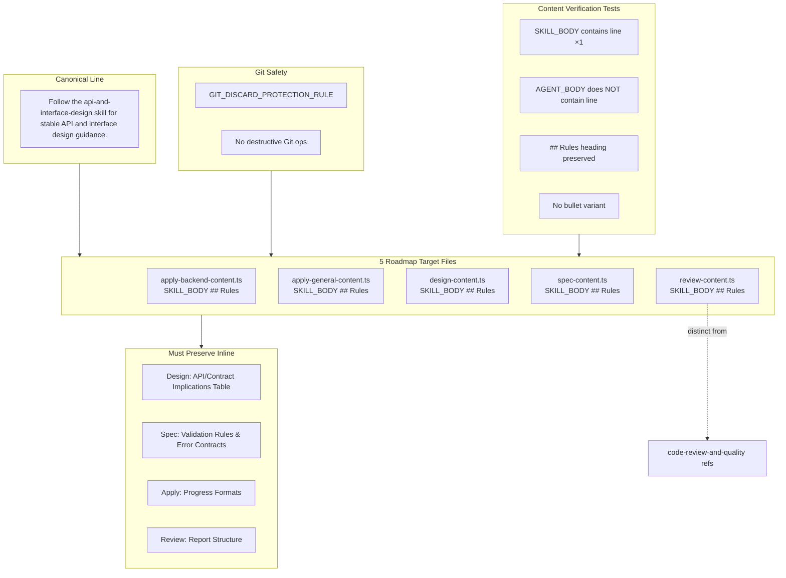

# Spec: Consolidate API and Interface Design Guidance

## Source

- Proposal: consolidate-api-and-interface-design proposal artifact
- Exploration: consolidate-api-and-interface-design exploration artifact
- Capabilities affected: developer-team-prompt-guidance (modified), developer-team-content-verification (modified)

## Requirements

### Capability: developer-team-prompt-guidance

REQ-prompt-001: Each of the five roadmap target content modules MUST contain the canonical line `Follow the api-and-interface-design skill for stable API and interface design guidance.` exactly once in its exported `SKILL_BODY` constant.
  Priority: MUST
  Surface: API (exported prompt constants)
  Rationale: Phase 3D roadmap requires canonical api-and-interface-design reference on all five targets; the canonical line follows the established Phase 3A/3B/3C pattern.

REQ-prompt-002: The canonical line MUST appear in the `## Rules` section of the `SKILL_BODY` constant, after any existing `Follow the ...` lines and before any `## Serena Enforcement` or closing section.
  Priority: MUST
  Surface: API (prompt structure)
  Rationale: Follows the established insertion pattern from Phase 3B (cognitive-doc-design) and Phase 3C (code-review-and-quality); ensures consistent placement across all targets.

REQ-prompt-003: The canonical line MUST NOT appear in any `AGENT_BODY` constant.
  Priority: MUST
  Surface: API (exported prompt constants)
  Rationale: Agent bodies are thin identity + boundaries; skill methodology references belong in SKILL_BODY only (Phase 3A/3B/3C precedent).

REQ-prompt-004: No existing inline SDD artifact template, table, checklist, output format, registry instruction, progress format, or report structure in any target file MUST be altered in purpose, position, or content.
  Priority: MUST
  Surface: Data (SDD artifact contracts)
  Rationale: Proposal explicitly preserves: Design API/Contract Implications table, Spec validation/error-contract guidance, Apply progress formats, Review report structure. These are authoritative inline contracts.

REQ-prompt-005: The canonical line in `review-content.ts` SKILL_BODY MUST NOT duplicate or conflict with the existing `code-review-and-quality` reference.
  Priority: MUST
  Surface: API (prompt content)
  Rationale: Review Agent already references code-review-and-quality for five-axis criteria; api-and-interface-design covers contract-first design, validation boundaries, and error semantics — distinct concerns that must remain clearly delineated.

REQ-prompt-006: The `apply-backend-content.ts` SKILL_BODY canonical line MUST appear after the `using-agent-skills` line and before the `## Serena Enforcement` section.
  Priority: MUST
  Surface: API (prompt structure)
  Rationale: apply-backend and apply-general have a `## Serena Enforcement` section after `## Rules`; canonical line must fit within `## Rules` before that section starts.

REQ-prompt-007: The `apply-general-content.ts` SKILL_BODY canonical line MUST appear after the `using-agent-skills` line and before the `## Serena Enforcement` section.
  Priority: MUST
  Surface: API (prompt structure)
  Rationale: Same structural constraint as apply-backend (REQ-prompt-006).

REQ-prompt-008: The `design-content.ts` SKILL_BODY canonical line MUST appear in the `## Rules` section after the `cognitive-doc-design` line.
  Priority: MUST
  Surface: API (prompt structure)
  Rationale: design-content already has `cognitive-doc-design` in Rules; the api-and-interface-design line adds alongside it.

REQ-prompt-009: The `spec-content.ts` SKILL_BODY canonical line MUST appear in the `## Rules` section after the `cognitive-doc-design` line.
  Priority: MUST
  Surface: API (prompt structure)
  Rationale: spec-content already has `cognitive-doc-design` in Rules; the api-and-interface-design line adds alongside it.

REQ-prompt-010: The `review-content.ts` SKILL_BODY canonical line MUST appear in the `## Rules` section after the `cognitive-doc-design` line.
  Priority: MUST
  Surface: API (prompt structure)
  Rationale: review-content already has `cognitive-doc-design` in Rules; the api-and-interface-design line adds alongside it.

### Capability: developer-team-content-verification

REQ-verify-001: Each of the five target test files MUST include a dedicated describe block that asserts the canonical line appears exactly once in the exported `SKILL_BODY` constant.
  Priority: MUST
  Surface: General (test coverage)
  Rationale: Tests must verify exported prompt surfaces (not raw file string presence) per proposal acceptance direction and Phase 3B/3C test precedent.

REQ-verify-002: Each target test describe block MUST assert that the canonical line does NOT appear in the exported `AGENT_BODY` constant.
  Priority: MUST
  Surface: General (test coverage)
  Rationale: Ensures immutability of AGENT_BODY surfaces; follows cognitive-doc-design test precedent.

REQ-verify-003: Each target test describe block MUST assert that the `## Rules` heading is preserved in `SKILL_BODY`.
  Priority: SHOULD
  Surface: General (test coverage)
  Rationale: Structural sanity check that insertion did not corrupt the Rules section heading; follows cognitive-doc-design test precedent.

REQ-verify-004: Each target test describe block MUST assert that no bullet variant of the canonical line exists in `SKILL_BODY`.
  Priority: SHOULD
  Surface: General (test coverage)
  Rationale: Prevents accidental duplication as a bullet-point variant; follows cognitive-doc-design test precedent.

### Capability: critical-git-safety

REQ-safety-001: No destructive Git operation (reset, clean, stash drop, force push, rebase) MUST be used during implementation or rollback.
  Priority: MUST
  Surface: Security (version control)
  Rationale: Proposal rollback plan and existing critical-git-safety capability require non-destructive operations; reverse patch is the only permitted rollback mechanism.

REQ-safety-002: The existing `GIT_DISCARD_PROTECTION_RULE` import and interpolation in each target file MUST remain intact and unchanged.
  Priority: MUST
  Surface: Security (version control)
  Rationale: The Git safety rule is a pre-existing capability that must not be disturbed by this change.

## Acceptance Scenarios

### Capability: developer-team-prompt-guidance

#### Scenario: Canonical line appears in all five target SKILL_BODYs
**Given** the five roadmap target content modules exist with exported `*_SKILL_BODY` constants
**When** each SKILL_BODY is inspected for the string `Follow the api-and-interface-design skill for stable API and interface design guidance.`
**Then** the string is found exactly once in each of the five SKILL_BODY constants
> Covers: REQ-prompt-001

#### Scenario: Canonical line is absent from all five AGENT_BODYs
**Given** the five roadmap target content modules exist with exported `*_AGENT_BODY` constants
**When** each AGENT_BODY is inspected for the canonical line
**Then** the canonical line is NOT found in any AGENT_BODY constant
> Covers: REQ-prompt-003

#### Scenario: Canonical line placement in design-content.ts Rules section
**Given** `design-content.ts` exports `DESIGN_SKILL_BODY` with a `## Rules` section
**When** the Rules section content is examined
**Then** the canonical line appears after the `cognitive-doc-design` line and before the closing backtick
> Covers: REQ-prompt-002, REQ-prompt-008

#### Scenario: Canonical line placement in spec-content.ts Rules section
**Given** `spec-content.ts` exports `SPEC_SKILL_BODY` with a `## Rules` section
**When** the Rules section content is examined
**Then** the canonical line appears after the `cognitive-doc-design` line and before the closing backtick
> Covers: REQ-prompt-002, REQ-prompt-009

#### Scenario: Canonical line placement in review-content.ts Rules section
**Given** `review-content.ts` exports `REVIEW_SKILL_BODY` with a `## Rules` section
**When** the Rules section content is examined
**Then** the canonical line appears after the `cognitive-doc-design` line and before the closing backtick
> Covers: REQ-prompt-002, REQ-prompt-010

#### Scenario: Canonical line placement in apply-backend-content.ts Rules section
**Given** `apply-backend-content.ts` exports `APPLY_BACKEND_SKILL_BODY` with `## Rules` followed by `## Serena Enforcement`
**When** the Rules section content is examined
**Then** the canonical line appears after the `using-agent-skills` line and before the `## Serena Enforcement` heading
> Covers: REQ-prompt-002, REQ-prompt-006

#### Scenario: Canonical line placement in apply-general-content.ts Rules section
**Given** `apply-general-content.ts` exports `APPLY_GENERAL_SKILL_BODY` with `## Rules` followed by `## Serena Enforcement`
**When** the Rules section content is examined
**Then** the canonical line appears after the `using-agent-skills` line and before the `## Serena Enforcement` heading
> Covers: REQ-prompt-002, REQ-prompt-007

#### Scenario: Inline Design API/Contract Implications table is preserved
**Given** `design-content.ts` SKILL_BODY contains an `### API / Contract Implications` table with `| Endpoint / Interface | Change | Backward Compatible |` headers
**When** the content module is read after modification
**Then** the API/Contract Implications table header, structure, and template rows remain unchanged
> Covers: REQ-prompt-004

#### Scenario: Inline Spec validation/error-contract guidance is preserved
**Given** `spec-content.ts` SKILL_BODY contains Step 4 "Define Validation Rules and Error Contracts" with table templates for validation rules and error responses
**When** the content module is read after modification
**Then** the validation rules table, error responses table, and step instructions remain unchanged
> Covers: REQ-prompt-004

#### Scenario: Inline Apply progress formats are preserved
**Given** `apply-backend-content.ts` and `apply-general-content.ts` SKILL_BODYs contain apply-progress markdown templates with Completed/In-Progress/Blocked/Remaining sections
**When** the content modules are read after modification
**Then** all apply-progress template sections remain unchanged
> Covers: REQ-prompt-004

#### Scenario: Inline Review report structure is preserved
**Given** `review-content.ts` SKILL_BODY contains the Review Report template with Summary, Ratings by Dimension, Findings (BLOCKER/MAJOR/MINOR/NIT), Design Fidelity, and Open Questions sections
**When** the content module is read after modification
**Then** the review report template structure remains unchanged
> Covers: REQ-prompt-004

#### Scenario: Review api-and-interface-design line is distinct from code-review-and-quality
**Given** `review-content.ts` SKILL_BODY contains both `code-review-and-quality` references and the new `api-and-interface-design` canonical line
**When** the Rules section is examined
**Then** the api-and-interface-design line is a separate line from any code-review-and-quality line
**And** the code-review-and-quality references retain their existing text and positions unchanged
> Covers: REQ-prompt-005

### Capability: developer-team-content-verification

#### Scenario: Target test files verify canonical line in SKILL_BODY
**Given** test files exist for each of the five target content modules
**When** the test suite is run
**Then** each test file has a describe block asserting the canonical line appears exactly once in its SKILL_BODY export
> Covers: REQ-verify-001

#### Scenario: Target test files verify canonical line absent from AGENT_BODY
**Given** test files exist for each of the five target content modules
**When** the test suite is run
**Then** each test file asserts the canonical line does NOT appear in its AGENT_BODY export
> Covers: REQ-verify-002

#### Scenario: Target test files verify Rules heading preserved
**Given** test files exist for each of the five target content modules
**When** the test suite is run
**Then** each test file asserts `## Rules` is present in its SKILL_BODY export
> Covers: REQ-verify-003

#### Scenario: Target test files verify no bullet variant
**Given** test files exist for each of the five target content modules
**When** the test suite is run
**Then** each test file asserts `- Follow the api-and-interface-design skill` does NOT appear in its SKILL_BODY export
> Covers: REQ-verify-004

### Capability: critical-git-safety

#### Scenario: No destructive Git operations during implementation
**Given** the change is implemented
**When** the Git history and reflog are inspected
**Then** no `git reset --hard`, `git clean`, `git stash drop`, `git push --force`, or `git rebase` operations were performed
> Covers: REQ-safety-001

#### Scenario: GIT_DISCARD_PROTECTION_RULE import preserved in all targets
**Given** each target content module imports `GIT_DISCARD_PROTECTION_RULE` from `./git-safety`
**When** the modules are read after modification
**Then** the import statement and `${GIT_DISCARD_PROTECTION_RULE}` interpolation remain present and unchanged in all five files
> Covers: REQ-safety-002

## Validation Rules

| Field / Input | Rule | Error Message | REQ-ID |
|---|---|---|---|
| Canonical line text | Must be exactly `Follow the api-and-interface-design skill for stable API and interface design guidance.` | "Canonical line text mismatch" | REQ-prompt-001 |
| Canonical line count per SKILL_BODY | Must be exactly 1 | "Canonical line appears {N} times, expected 1" | REQ-prompt-001 |
| Canonical line in AGENT_BODY | Must be 0 | "AGENT_BODY must not contain canonical line" | REQ-prompt-003 |
| Rules section presence | Must exist in SKILL_BODY | "## Rules section missing from SKILL_BODY" | REQ-prompt-002 |

## Error Contracts

| Condition | Error Code | Message | Status |
|---|---|---|---|
| Canonical line missing from target SKILL_BODY | MISSING_REFERENCE | "Target {file} SKILL_BODY does not contain api-and-interface-design canonical line" | N/A (test failure) |
| Canonical line appears more than once | DUPLICATE_REFERENCE | "Target {file} SKILL_BODY contains {N} occurrences of api-and-interface-design canonical line" | N/A (test failure) |
| Canonical line found in AGENT_BODY | IMMUTABILITY_VIOLATION | "Target {file} AGENT_BODY must not contain api-and-interface-design canonical line" | N/A (test failure) |
| Inline SDD artifact table/format altered | CONTRACT_VIOLATION | "Target {file} inline {artifact_section} was modified beyond canonical line addition" | N/A (review finding) |
| GIT_DISCARD_PROTECTION_RULE disturbed | SAFETY_VIOLATION | "Target {file} GIT_DISCARD_PROTECTION_RULE import or interpolation was modified" | N/A (test failure) |

## States and Transitions

> Omitted — this capability has no meaningful state lifecycle. The change is a static content addition.

## Open Questions

1. Should `task-content.ts` be included as a target? It contains "Identify shared/contracts work" and "API contracts" in its task routing table, but the Phase 3D roadmap does not list it.
2. Should `proposal-content.ts` be included as a target? Proposals assess API/contract risk, but the roadmap targets only the five listed files.
3. Should `apply-frontend-content.ts` be included as a target? It contains "Do not invent, mock, or reshape backend contracts" in AGENT_BODY, but no SKILL_BODY contract language.
4. Are existing Developer Team content tests (Phase 3B cognitive-doc-design pattern) sufficient to extend, or should Phase 3D get its own standalone test file?

## Compliance Matrix

| REQ-ID | Scenario(s) | Status |
|---|---|---|
| REQ-prompt-001 | Canonical line appears in all five target SKILL_BODYs | Defined |
| REQ-prompt-002 | Canonical line placement (all placement scenarios) | Defined |
| REQ-prompt-003 | Canonical line is absent from all five AGENT_BODYs | Defined |
| REQ-prompt-004 | Inline Design/Spec/Apply/Review structures preserved (4 scenarios) | Defined |
| REQ-prompt-005 | Review api-and-interface-design line distinct from code-review-and-quality | Defined |
| REQ-prompt-006 | Canonical line placement in apply-backend Rules | Defined |
| REQ-prompt-007 | Canonical line placement in apply-general Rules | Defined |
| REQ-prompt-008 | Canonical line placement in design-content Rules | Defined |
| REQ-prompt-009 | Canonical line placement in spec-content Rules | Defined |
| REQ-prompt-010 | Canonical line placement in review-content Rules | Defined |
| REQ-verify-001 | Target test files verify canonical line in SKILL_BODY | Defined |
| REQ-verify-002 | Target test files verify canonical line absent from AGENT_BODY | Defined |
| REQ-verify-003 | Target test files verify Rules heading preserved | Defined |
| REQ-verify-004 | Target test files verify no bullet variant | Defined |
| REQ-safety-001 | No destructive Git operations during implementation | Defined |
| REQ-safety-002 | GIT_DISCARD_PROTECTION_RULE import preserved in all targets | Defined |

## Mermaid Summary Source

