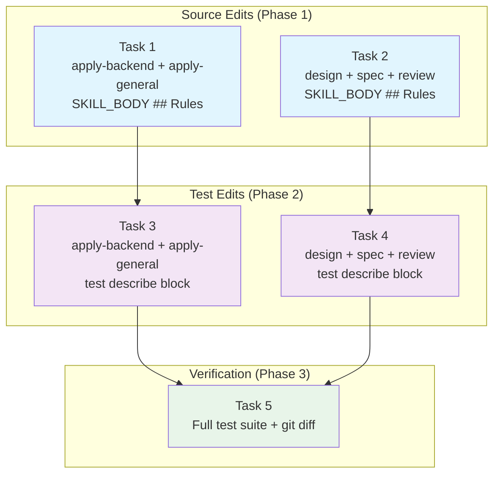

# Tasks: Consolidate API and Interface Design Guidance

## Source

- Spec: consolidate-api-and-interface-design spec artifact
- Design: consolidate-api-and-interface-design design artifact
- Capabilities affected: developer-team-prompt-guidance, developer-team-content-verification, critical-git-safety

## Task Groups

### Group: Shared / Contracts

#### Task 1: Add canonical line to apply-agent source files
**Owner**: General Apply
**Priority**: P0
**Complexity**: Low
**Parallel**: Yes
**Depends on**: none

**Description**
Add the canonical line `Follow the api-and-interface-design skill for stable API and interface design guidance.` to the `## Rules` section of `APPLY_BACKEND_SKILL_BODY` and `APPLY_GENERAL_SKILL_BODY`. Insert after the existing `using-agent-skills` line and before the `## Serena Enforcement` section, separated by a blank line. Do not modify `*_AGENT_BODY` constants, `GIT_DISCARD_PROTECTION_RULE` imports/interpolations, or any inline templates.

**Files**
- `packages/core/src/teams/developer/apply-backend-content.ts` — modify
- `packages/core/src/teams/developer/apply-general-content.ts` — modify

**Verification**
Grep each modified file for the exact canonical string. Confirm: (1) string appears exactly once per `*_SKILL_BODY`, (2) string does NOT appear in `*_AGENT_BODY`, (3) `GIT_DISCARD_PROTECTION_RULE` import and interpolation are unchanged, (4) `## Serena Enforcement` heading is still present.

---

#### Task 2: Add canonical line to phase-agent source files
**Owner**: General Apply
**Priority**: P0
**Complexity**: Low
**Parallel**: Yes
**Depends on**: none

**Description**
Add the canonical line `Follow the api-and-interface-design skill for stable API and interface design guidance.` to the `## Rules` section of `DESIGN_SKILL_BODY`, `SPEC_SKILL_BODY`, and `REVIEW_SKILL_BODY`. Insert after the existing `cognitive-doc-design` line, separated by a blank line. Do not modify `*_AGENT_BODY` constants, `GIT_SAFETY_SENTINEL` references, or any inline artifact contracts (Design API/Contract Implications table, Spec validation/error-contract tables, Review report structure).

**Files**
- `packages/core/src/teams/developer/design-content.ts` — modify
- `packages/core/src/teams/developer/spec-content.ts` — modify
- `packages/core/src/teams/developer/review-content.ts` — modify

**Verification**
Grep each modified file for the exact canonical string. Confirm: (1) string appears exactly once per `*_SKILL_BODY`, (2) string does NOT appear in `*_AGENT_BODY`, (3) `GIT_SAFETY_SENTINEL` is still present, (4) all inline template sections (Design API/Contract table, Spec validation/error tables, Review report template) are unchanged.

---

#### Task 3: Add test assertions to apply-agent test files
**Owner**: General Apply
**Priority**: P0
**Complexity**: Low
**Parallel**: Yes — independent of Task 2 and Task 4
**Depends on**: Task 1

**Description**
Add a `describe("API and interface design canonical line")` block to `apply-backend-content.test.ts` and `apply-general-content.test.ts`. Each block declares a local `const AID_CANONICAL_LINE = "Follow the api-and-interface-design skill for stable API and interface design guidance.";` and contains 4 assertions: (1) `SKILL_BODY` contains the line exactly once, (2) `SKILL_BODY` does not contain bullet variant `- ${AID_CANONICAL_LINE}`, (3) `AGENT_BODY` does not contain the line, (4) `SKILL_BODY` contains `## Rules`. Place the new block after the existing `Canonical line replacement` describe block. Do not alter any existing describe blocks.

**Files**
- `packages/core/src/teams/developer/apply-backend-content.test.ts` — modify
- `packages/core/src/teams/developer/apply-general-content.test.ts` — modify

**Verification**
Run `bun test packages/core/src/teams/developer/apply-backend-content.test.ts packages/core/src/teams/developer/apply-general-content.test.ts`. All existing tests plus the new `API and interface design canonical line` block must pass.

---

#### Task 4: Add test assertions to phase-agent test files
**Owner**: General Apply
**Priority**: P0
**Complexity**: Low
**Parallel**: Yes — independent of Task 1 and Task 3
**Depends on**: Task 2

**Description**
Add a `describe("API and interface design canonical line")` block to `design-content.test.ts`, `spec-content.test.ts`, and `review-content.test.ts`. Each block declares a local `const AID_CANONICAL_LINE = "Follow the api-and-interface-design skill for stable API and interface design guidance.";` and contains 4 assertions: (1) `SKILL_BODY` contains the line exactly once, (2) `SKILL_BODY` does not contain bullet variant, (3) `AGENT_BODY` does not contain the line, (4) `SKILL_BODY` contains `## Rules`. Place the new block after the existing `Cognitive doc design canonical line` describe block. Do not alter any existing describe blocks. For `review-content.test.ts` specifically, confirm the new block asserts distinctness from `code-review-and-quality` references (i.e., both lines exist as separate entries in Rules).

**Files**
- `packages/core/src/teams/developer/design-content.test.ts` — modify
- `packages/core/src/teams/developer/spec-content.test.ts` — modify
- `packages/core/src/teams/developer/review-content.test.ts` — modify

**Verification**
Run `bun test packages/core/src/teams/developer/design-content.test.ts packages/core/src/teams/developer/spec-content.test.ts packages/core/src/teams/developer/review-content.test.ts`. All existing tests plus the new blocks must pass.

---

#### Task 5: Full integration verification
**Owner**: General Apply
**Priority**: P0
**Complexity**: Low
**Parallel**: No — depends on Tasks 3 and 4
**Depends on**: Task 3, Task 4

**Description**
Run the complete Developer Team content test suite and verify all acceptance scenarios from the Spec. Execute `bun test packages/core/src/teams/developer/*-content.test.ts`. Confirm: (1) all 10 test files pass (0 failures), (2) the canonical line appears exactly once in each of the 5 `*_SKILL_BODY` exports, (3) the canonical line does not appear in any `*_AGENT_BODY` export, (4) no inline artifact template/contract was altered (no regressions in existing template/return-contract/cross-differentiation tests), (5) `GIT_DISCARD_PROTECTION_RULE` and `GIT_SAFETY_SENTINEL` assertions still pass, (6) verify with `git diff --stat` that only the expected 10 files were modified.

**Files**
- `packages/core/src/teams/developer/*-content.test.ts` — unchanged (read-only verification)
- `packages/core/src/teams/developer/*-content.ts` — unchanged (read-only verification)

**Verification**
Zero test failures. `git diff --stat` shows exactly 10 modified files. No inline contract regressions.

## Dependency Graph

```
Task 1 (Source: apply-agents) ──→ Task 3 (Tests: apply-agents) ──┐
                                                                   ├──→ Task 5 (Full verification)
Task 2 (Source: phase-agents)  ──→ Task 4 (Tests: phase-agents) ──┘
```

## Parallelization Plan

| Phase | Tasks | Can Run in Parallel |
|---|---|---|
| Source edits | Task 1, Task 2 | Yes — different files, different insertion rules |
| Test edits | Task 3, Task 4 | Yes — after their respective source dependencies; independent of each other |
| Verification | Task 5 | No — final gate after all tests |

## Responsibility Contracts

| Contract / Boundary | Owner | Consumers | Notes |
|---|---|---|---|
| `APPLY_BACKEND_SKILL_BODY` / `APPLY_GENERAL_SKILL_BODY` canonical line | General Apply (Task 1) | General Apply (Task 3) | Insertion after `using-agent-skills`, before `## Serena Enforcement` |
| `DESIGN_SKILL_BODY` / `SPEC_SKILL_BODY` / `REVIEW_SKILL_BODY` canonical line | General Apply (Task 2) | General Apply (Task 4) | Insertion after `cognitive-doc-design`, at end of `## Rules` |
| `AID_CANONICAL_LINE` constant in test files | General Apply (Tasks 3, 4) | General Apply (Task 5) | Byte-identical string across all 5 test files; no shared helper |
| Inline artifact contracts (templates, tables, report structures) | Preserved by Tasks 1, 2 | Verified by Tasks 3, 4, 5 | Zero-diff required for all non-Rules content |
| `GIT_DISCARD_PROTECTION_RULE` / `GIT_SAFETY_SENTINEL` | Preserved by Tasks 1, 2 | Verified by Tasks 3, 4, 5 | Imports and interpolations must remain byte-identical |

## Complexity Summary

| Complexity | Count | Task Numbers |
|---|---|---|
| Low | 5 | 1, 2, 3, 4, 5 |
| Medium | 0 | — |
| High | 0 | — |

## Flagged for Splitting

None — all tasks touch 3 or fewer files and have Low complexity.

## Review Workload Forecast

| Signal | Value |
|---|---|
| Estimated changed lines | <100 (~90 lines across 10 files) |
| 400-line budget risk | Low |
| Scope reduction recommended | No |
| Sequential work slices recommended | No — tasks are already small and well-sliced |
| Decision needed before Apply | No — all open questions are non-blocking and scoped out |

**Rationale**: The change is purely additive: 1 prose line added to 5 source files (~15 lines total) and 1 describe block (~15 lines each) added to 5 test files (~75 lines total). No inline contracts, templates, or structural content is modified. The canonical line is byte-identical across all targets. The 400-line budget is far from exceeded. Review is straightforward: verify insertion placement and test assertion correctness.

## Open Questions / Blockers

- **Spec Open Question 1–3** (`task-content.ts`, `proposal-content.ts`, `apply-frontend-content.ts` inclusion): Non-blocking. Design locks scope at 5 files per roadmap/proposal. A follow-up change can add targets with 1-line + 1-test-block each.
- **Spec Open Question 4** (standalone test file vs. extending existing): Non-blocking. Design prescribes per-file describe blocks matching Phase 3A/3B precedent.

> None are implementation-blocking. Tasks are ready for Apply.

## Critical Git Safety

All tasks are subject to REQ-safety-001 and REQ-safety-002:

1. **No destructive Git operations**: No `git reset`, `git clean`, `git stash drop`, `git push --force`, `git rebase`, or `git checkout --` (as rollback) during implementation.
2. **Explicit staging only**: Stage each file individually with `git add <path>`. Never `git add .` or `git add -A` from repo root.
3. **Pre-commit verification**: Run `git status` and `git diff --cached` before any commit. Only the 10 target files must be staged.
4. **Rollback mechanism**: Reverse patch only (`git checkout HEAD -- <specific-file>`), with explicit user confirmation in a separate message. No `git stash`, `git clean`, or `git reset`.
5. **Commit message**: `feat(developer-team): consolidate api-and-interface-design guidance (Phase 3D)`

## Mermaid Summary Source


