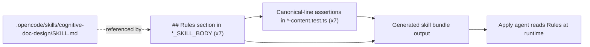

# Design: Consolidate Cognitive Doc Design Guidance

## Source

- Proposal: `consolidate-cognitive-doc-design` proposal artifact (Phase 3B)
- Exploration: `openspec/changes/consolidate-cognitive-doc-design/exploration.md`
- Capabilities affected: `developer-team-prompt-guidance`, `developer-team-content-verification`
- Spec status: not yet available (Spec runs in parallel; Design depends only on Proposal + Exploration)

## Current Architecture Context

### Content-module pattern (the 7 targets)

Each Developer Team phase has a paired `*-content.ts` module exporting two TypeScript string constants consumed by the team installer:

| Constant | Purpose | Surface |
|---|---|---|
| `*_AGENT_BODY` | Thin identity + boundaries + non-goals + skill reference | Written into the agent file after runtime frontmatter |
| `*_SKILL_BODY` | Detailed methodology, structured output template, persistence, return format | Written into the skill file after runtime frontmatter |

The 7 target modules live at `packages/core/src/teams/developer/`:

1. `explorer-content.ts` → `EXPLORER_AGENT_BODY` / `EXPLORER_SKILL_BODY`
2. `proposal-content.ts` → `PROPOSAL_AGENT_BODY` / `PROPOSAL_SKILL_BODY`
3. `spec-content.ts` → `SPEC_AGENT_BODY` / `SPEC_SKILL_BODY`
4. `design-content.ts` → `DESIGN_AGENT_BODY` / `DESIGN_SKILL_BODY`
5. `task-content.ts` → `TASK_AGENT_BODY` / `TASK_SKILL_BODY`
6. `review-content.ts` → `REVIEW_AGENT_BODY` / `REVIEW_SKILL_BODY`
7. `verify-content.ts` → `VERIFY_AGENT_BODY` / `VERIFY_SKILL_BODY`

### Existing `## Rules` section shape

All 7 `*_SKILL_BODY` constants already end with a `## Rules` section. The shape is uniform except for `explorer-content.ts`:

- **6 of 7 files** (`proposal`, `spec`, `design`, `task`, `review`, `verify`): `## Rules` contains a single prose line — `Follow the using-agent-skills skill for operating behaviors and failure mode guidance.`
- **`explorer-content.ts`**: `## Rules` is a bullet list (9 bullets, lines 218–226) of phase-specific guardrails. It does **not** contain the using-agent-skills canonical line.

### Existing test pattern (the `Canonical line replacement` block)

Each of the 6 files above (excluding explorer) has a paired `*-content.test.ts` with a `describe("Canonical line replacement")` block at the end. The block defines `CANONICAL_LINE = "Follow the using-agent-skills skill for operating behaviors and failure mode guidance."` and asserts:

- `*_SKILL_BODY` contains the canonical line exactly once
- `*_SKILL_BODY` does **not** contain a bullet variant (`- ${CANONICAL_LINE}`)
- `*_AGENT_BODY` does **not** contain the canonical line (immutability)
- `*_SKILL_BODY` preserves the `## Rules` heading

`explorer-content.test.ts` does **not** have this block (no using-agent-skills canonical line exists in that file's Rules section).

### Reference skill

`.opencode/skills/cognitive-doc-design/SKILL.md` exists as a standalone skill (81 lines). It defines documentation shape, critical patterns (lead with the answer, progressive disclosure, chunking, signposting, recognition over recall, review empathy), PR/review-doc guidance, and a default markdown template. It is the canonical source Phase 3B is consolidating onto.

## Proposed Architecture

Add the canonical cognitive-doc-design reference to the `## Rules` section of each of the 7 `*_SKILL_BODY` constants, following the established Phase 3A (using-agent-skills) pattern. Preserve every existing artifact contract, output template, registry instruction, return format, table, and matrix. Do not touch `*_AGENT_BODY` constants. Do not touch orchestrator, apply agents, archive, visual-explanations, the generated bundle, or the `cognitive-doc-design` skill file itself.

### Component / Module Boundaries

| Component | Responsibility | Change Type |
|---|---|---|
| `packages/core/src/teams/developer/explorer-content.ts` | Add cognitive-doc-design ref to `EXPLORER_SKILL_BODY` `## Rules` | modified |
| `packages/core/src/teams/developer/proposal-content.ts` | Add cognitive-doc-design ref to `PROPOSAL_SKILL_BODY` `## Rules` | modified |
| `packages/core/src/teams/developer/spec-content.ts` | Add cognitive-doc-design ref to `SPEC_SKILL_BODY` `## Rules` | modified |
| `packages/core/src/teams/developer/design-content.ts` | Add cognitive-doc-design ref to `DESIGN_SKILL_BODY` `## Rules` | modified |
| `packages/core/src/teams/developer/task-content.ts` | Add cognitive-doc-design ref to `TASK_SKILL_BODY` `## Rules` | modified |
| `packages/core/src/teams/developer/review-content.ts` | Add cognitive-doc-design ref to `REVIEW_SKILL_BODY` `## Rules` | modified |
| `packages/core/src/teams/developer/verify-content.ts` | Add cognitive-doc-design ref to `VERIFY_SKILL_BODY` `## Rules` | modified |
| `packages/core/src/teams/developer/*-content.test.ts` (×7) | Extend canonical-line assertions to cover cognitive-doc-design | modified |
| `openspec/changes/consolidate-cognitive-doc-design/design.md` | This design artifact | new |
| All other modules (orchestrator, apply-*, archive, visual-explanations, `cognitive-doc-design` skill) | Untouched | unchanged |

### Data Flow

No data-flow change. The 7 `*_SKILL_BODY` constants are static template strings consumed by the team installer (`developer-team-install.ts`) and emitted into skill files at install time. Adding a line to the `## Rules` section propagates verbatim into the generated skill surface. The downstream consumers (agent runtime, orchestrator) read the same string and gain an additional skill reference; no parser, schema, or transport changes.

### API / Contract Implications

| Endpoint / Interface | Change | Backward Compatible |
|---|---|---|
| `EXPLORER_SKILL_BODY` exported string constant | Append one bullet to `## Rules` list | yes (string content is additive; consumers parsing the value see the existing 9 bullets plus 1 new bullet) |
| `PROPOSAL_SKILL_BODY` exported string constant | Append one canonical line under `## Rules` | yes |
| `SPEC_SKILL_BODY` exported string constant | Append one canonical line under `## Rules` | yes |
| `DESIGN_SKILL_BODY` exported string constant | Append one canonical line under `## Rules` | yes |
| `TASK_SKILL_BODY` exported string constant | Append one canonical line under `## Rules` | yes |
| `REVIEW_SKILL_BODY` exported string constant | Append one canonical line under `## Rules` | yes |
| `VERIFY_SKILL_BODY` exported string constant | Append one canonical line under `## Rules` | yes |
| `*_AGENT_BODY` exported string constants (×7) | Unchanged | yes (no diff) |
| `developer-team-install.ts` / bundle emitter | Unchanged | yes (consumes strings as opaque blobs) |

### State / Persistence Implications

None. The 7 constants are in-memory string literals compiled into the package; no schema, database, or registry entries are affected. The OpenSpec `state.yaml` and `events.yaml` for this change are out of scope for the design phase (registry-deferred mode).

### Migration / Backward Compatibility

None required. The change is purely additive: one new line per `*_SKILL_BODY`. No existing consumers depend on the absence of the new line; no contract surface is removed, renamed, or restructured. A developer-team-install invocation on the previous bundle output produces byte-identical files except for the added `## Rules` line.

### Canonical reference line (exact text)

The single canonical sentence, taken verbatim from the Phase 3B roadmap intent:

```text
Follow the cognitive-doc-design skill for artifact structure and documentation patterns.
```

This line is byte-identical across all 7 target files. Tests must assert this exact string (not a regex), to keep the contract reviewable and prevent drift.

### Insertion rule per file

| File | Current Rules shape | Insertion action |
|---|---|---|
| `explorer-content.ts` | Bullet list (9 items, lines 218–226) | Append the canonical line as the **10th bullet** at the end of the list (preserves existing list shape; matches the file's local convention) |
| `proposal-content.ts` | Single prose line | Append the canonical line as a **second prose line** under `## Rules`, after the using-agent-skills line, separated by a blank line |
| `spec-content.ts` | Single prose line | Append as second prose line (same pattern) |
| `design-content.ts` | Single prose line | Append as second prose line (same pattern) |
| `task-content.ts` | Single prose line | Append as second prose line (same pattern) |
| `review-content.ts` | Single prose line | Append as second prose line (same pattern) |
| `verify-content.ts` | Single prose line | Append as second prose line (same pattern) |

Rationale for the explorer split: explorer's Rules is already a list, so the file-local convention is bullet form. Inserting a prose line under a bullet list would create a visually inconsistent Rules block. Adding a 10th bullet matches the file's own style while remaining semantically identical (a directive under `## Rules`).

## File Impact Estimate

| File / Path | Action | Rationale |
|---|---|---|
| `packages/core/src/teams/developer/explorer-content.ts` | modify | Append 1 bullet to `EXPLORER_SKILL_BODY` `## Rules` |
| `packages/core/src/teams/developer/proposal-content.ts` | modify | Append 1 line to `PROPOSAL_SKILL_BODY` `## Rules` |
| `packages/core/src/teams/developer/spec-content.ts` | modify | Append 1 line to `SPEC_SKILL_BODY` `## Rules` |
| `packages/core/src/teams/developer/design-content.ts` | modify | Append 1 line to `DESIGN_SKILL_BODY` `## Rules` |
| `packages/core/src/teams/developer/task-content.ts` | modify | Append 1 line to `TASK_SKILL_BODY` `## Rules` |
| `packages/core/src/teams/developer/review-content.ts` | modify | Append 1 line to `REVIEW_SKILL_BODY` `## Rules` |
| `packages/core/src/teams/developer/verify-content.ts` | modify | Append 1 line to `VERIFY_SKILL_BODY` `## Rules` |
| `packages/core/src/teams/developer/explorer-content.test.ts` | modify | Add canonical-line assertions block (mirrors the using-agent-skills block in other test files; assert SKILL_BODY contains canonical line, AGENT_BODY does not, no bullet variant present in 6 prose files) |
| `packages/core/src/teams/developer/proposal-content.test.ts` | modify | Extend `Canonical line replacement` block with cognitive-doc-design assertions (4 tests, parallel to using-agent-skills) |
| `packages/core/src/teams/developer/spec-content.test.ts` | modify | Same extension as proposal |
| `packages/core/src/teams/developer/design-content.test.ts` | modify | Same extension |
| `packages/core/src/teams/developer/task-content.test.ts` | modify | Same extension |
| `packages/core/src/teams/developer/review-content.test.ts` | modify | Same extension |
| `packages/core/src/teams/developer/verify-content.test.ts` | modify | Same extension |
| `openspec/changes/consolidate-cognitive-doc-design/design.md` | create | This artifact (registry-deferred mode: no state.yaml or events.yaml edit) |

> Task Agent will refine exact line numbers and review the 7 test-file diffs to ensure no orphaned or duplicated canonical-line tests.

## Testing Strategy

Layer: **unit (bun:test)**, applied to the exported string constants.

For each of the 7 `*_content.test.ts` files, add a `describe("Cognitive doc design canonical line")` block (or extend the existing `Canonical line replacement` block) with the following 3–4 assertions, modeled on the using-agent-skills block:

1. `expect(*_SKILL_BODY).toContain(CDD_CANONICAL_LINE)` — present exactly once. For 6 prose files, use `split(CDD_CANONICAL_LINE).length - 1 === 1`. For `explorer` (bullet form), the test allows `=== 1` (still one occurrence even though rendered as a bullet).
2. `expect(*_SKILL_BODY).not.toContain(`- ${CDD_CANONICAL_LINE}`)` — applies only to the 6 prose-shape files. For `explorer`, the bullet form is the *expected* shape, so this assertion is **not added** for explorer (otherwise it would fail by design).
3. `expect(*_AGENT_BODY).not.toContain(CDD_CANONICAL_LINE)` — AGENT immutability.
4. `expect(*_SKILL_BODY).toContain("## Rules")` — Rules section preserved.

`CDD_CANONICAL_LINE` is defined at the top of each test block (or in a shared test helper if a `*-content.test-helpers.ts` already exists; otherwise duplicate the constant per file to keep each test file self-contained, matching the using-agent-skills pattern).

Existing test blocks (placeholder detection, identity headers, artifact persistence, runtime neutrality, Git Safety Rule presence, cross-differentiation) are **not touched** — they already pass and the change must not regress them.

Verification of the design itself: after Task Agent applies the 7 source edits and 7 test edits, run `bun test packages/core/src/teams/developer/*-content.test.ts`. The acceptance direction in the proposal (4 items) maps to test outcomes:
- "Canonical sentence appears on every required surface" → assertion #1 across all 7 files.
- "Tests verify exported prompt/body surfaces" → assertions target `*_SKILL_BODY` constants, not raw file contents.
- "Artifact contracts intact" → existing tests continue to pass; no template/return-format/matrix text was edited.
- "Focused content tests pass" → the new `describe` block in each of the 7 test files passes.

## Observability / Error Handling

None. The change is static string content consumed by the installer at build time. No new runtime paths, no new error states, no logging.

## Security / Performance / Accessibility Considerations

None specific to this change. The canonical line is a directive in an English-language prompt surface; it carries no executable code, no user input, no PII handling, and no rendering implications.

## Tradeoffs

| Decision | Chosen | Rejected Alternative | Rationale |
|---|---|---|---|
| Required surface per target | `*_SKILL_BODY` only (Option 1) | Add to both `*_AGENT_BODY` and `*_SKILL_BODY` (Option 2) | Exploration recommends Option 1; matches the Phase 3A (using-agent-skills) precedent; smaller blast radius; AGENT bodies already route to the skill via "Follow the matching skill" — adding a second skill ref to the thin identity surface creates redundancy without changing runtime behavior |
| Insertion site inside `## Rules` | Append, after existing using-agent-skills line / at end of bullet list | Prepend (before using-agent-skills) | Cognitive-doc-design governs *artifact structure* (a static concern); using-agent-skills governs *operating behavior* (a runtime concern). Behavioral refs read first; structural refs read alongside — appending keeps the more-frequently-evaluated behavior line earlier in the section and avoids reordering existing content |
| Explorer Rules shape | Append as a 10th bullet (match local list convention) | Force prose form to match the other 6 files | Explorar's Rules is already a list; introducing a mixed prose/bullet block would be a style regression. The semantic contract ("a directive under `## Rules`") is satisfied either way; visual consistency with the file's local convention wins |
| Canonical line exactness | Byte-identical string across all 7 files | Per-file paraphrase | One canonical sentence is reviewable in one diff, easier to grep across the bundle, and prevents drift. The roadmap intent specifies this exact wording |
| Test target | Exported `*_SKILL_BODY` constant (structured surface) | Raw `fs.readFileSync` of the `.ts` file | The proposal's risk #2 explicitly requires the structured surface. All existing tests already import the constant; the new tests follow the same import pattern |
| Scope of edits | 7 source files + 7 test files only | Touch orchestrator, apply-*, archive, visual-explanations, generated bundle, or `cognitive-doc-design/SKILL.md` | Out-of-scope per the proposal; would change the blast radius and risk profile without roadmap justification |
| Generic doc guidance inside Proposal/Design content | Leave generic documentation guidance prose **unchanged**; only add the canonical line | Edit the inline "Use tables and bullet points over prose" / "Cognitive load reduction" type prose to defer to the skill | Proposal's Approach section explicitly states: "If duplicate generic documentation guidance is changed in Proposal/Design, limit edits to non-contract prose and keep all templates intact." Modifying prose alongside templates risks weakening the inline artifact contracts the proposal commits to preserve. Defer this micro-dedup to a later roadmap phase |

## Risks

| Risk | Likelihood | Impact | Mitigation |
|---|---|---|---|
| Accidentally editing an output template, return contract, or table when inserting near the Rules block | Medium | High (breaks downstream agent consumption) | Insertion site is the very last section of the SKILL_BODY, well past the output template and return format blocks. Task Agent must verify via diff that no template/contract text changed. Existing cross-differentiation tests will fail if Proposal/Spec/Design templates are altered |
| Tests pass against file-level strings but miss the exported constant | Low | Medium (false sense of coverage) | Every existing test file already imports the `*_SKILL_BODY` constant from the `.ts` module. New tests follow the same import pattern. No `fs.readFileSync` of the source file is introduced |
| Explorer Rules shape becomes inconsistent with the other 6 (bullet vs prose) | Low | Low (cosmetic) | Design explicitly accepts this asymmetry with rationale (file-local convention). The semantic contract is identical. A future cleanup PR could normalize Rules to a uniform bullet list across all 7 files, but that is out of scope for Phase 3B |
| Cognitive-doc-design line drifts from roadmap wording in future edits | Low | Low (silent contract drift) | Tests assert the exact byte string; any future edit that changes the wording will fail the new tests. The using-agent-skills precedent already enforces this discipline |
| Git-safety / data-loss regression during this change | Low | High (loss of untracked OpenSpec artifacts) | All edits are to *tracked* files in `packages/core/src/teams/developer/`. The `openspec/changes/consolidate-cognitive-doc-design/` directory (untracked) is read-only during this phase. **No destructive git commands are used.** Apply agents must follow the GIT_DISCARD_PROTECTION_RULE already embedded in each SKILL_BODY |
| Registry write conflict in this design phase | Low | Low | This design is written in **registry-deferred mode**. No `state.yaml` or `events.yaml` edit. The orchestrator will serialize the registry update after the parallel batch (Spec + Design) completes. See Registry Intent in the return contract |
| Apply agent reads old vs new content during parallel wave | Low | Medium | The canonical line is purely additive. If an apply agent reads an old cached copy of the content module, it sees the using-agent-skills line only — which is a strict subset of the new content. No instruction is removed or weakened, so the apply agent's behavior is unchanged for the missing-cdd case. After the new content is built, subsequent apply runs see the full Rules section |

## Open Decisions

- **Insertion point ordering within `## Rules`** (after using-agent-skills, before, or grouped separately): design recommends **after** using-agent-skills for the 6 prose-shape files, **at end of bullet list** for explorer. If the user wants all 7 to follow a single ordering rule, the change becomes a 1-line swap per file with no semantic impact. — *Resolved by this design: append-at-end is the chosen rule.*
- **Should a parallel line be added to `*_AGENT_BODY` for visibility at agent-instruction read time?** — *Open if user disagrees with Option 1; current design selects SKILL_BODY only.*
- **Should Proposal/Design `## Critical rules` prose that already mentions tables/bullets/prose be edited to defer to cognitive-doc-design?** — *Open but out of scope per proposal; recommended defer to a later roadmap phase.*
- **Should a shared `*-content.test-helpers.ts` be introduced to factor out `CDD_CANONICAL_LINE`?** — *Open, low value. The using-agent-skills precedent duplicates the constant per file. Recommend duplicate-per-file for now to match precedent; refactor in a later test-helper consolidation PR if desired.*

> Of these, none are blocking. All are micro-decisions the Task Agent can make with one-line edits if the user later prefers the other branch.

## Dependencies

- `.opencode/skills/cognitive-doc-design/SKILL.md` must exist on disk (verified: present, 81 lines).
- `packages/core/src/teams/developer/*-content.ts` modules must remain importable; no source-tree restructuring is required.
- `bun test` must be available (existing test infrastructure; no new tooling).
- `docs/skills-integration-roadmap.md` Phase 3B section is the upstream authority for the canonical sentence wording (referenced for traceability only; the design does not edit the roadmap).

## Next Steps

Ready for Task (`deck-developer-task`) to break this design into 14 atomic implementation tasks (7 source-file edits + 7 test-file edits) and route them to the apply-general agent. Spec runs in parallel; the spec agent's acceptance criteria should mirror the proposal's Acceptance Direction section, which is testable directly against the new test assertions.

## Mermaid Summary Source


