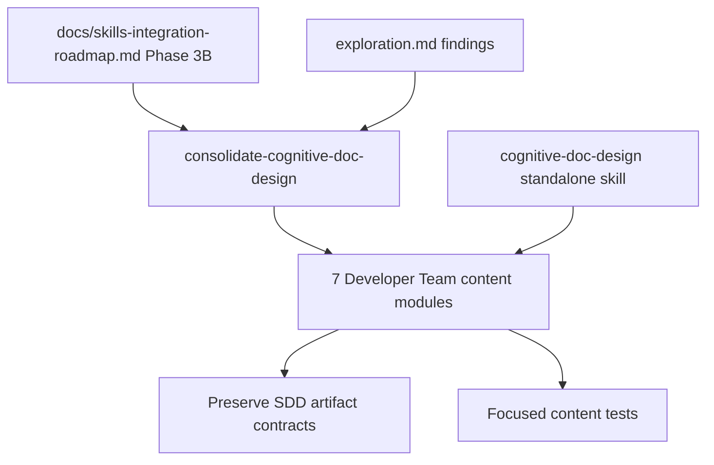

# Proposal: Consolidate Cognitive Doc Design Guidance

## Intent

Phase 3B of the Skills Integration Roadmap needs Developer Team documentation/artifact-structure guidance to point at the standalone `cognitive-doc-design` skill, while preserving Deck-specific SDD contracts that downstream agents depend on.

## Goal

Add the canonical `cognitive-doc-design` reference across the 7 target Developer Team content modules without changing artifact contracts, return formats, registry behavior, or output templates.

## Scope

### In Scope
- Add the canonical line: `Follow the cognitive-doc-design skill for artifact structure and documentation patterns.`
- Target these content modules:
  - `packages/core/src/teams/developer/explorer-content.ts`
  - `packages/core/src/teams/developer/proposal-content.ts`
  - `packages/core/src/teams/developer/spec-content.ts`
  - `packages/core/src/teams/developer/design-content.ts`
  - `packages/core/src/teams/developer/task-content.ts`
  - `packages/core/src/teams/developer/review-content.ts`
  - `packages/core/src/teams/developer/verify-content.ts`
- Preserve inline output templates, artifact contracts, registry instructions, return formats, and tables/matrices.
- Update focused Developer Team content tests to verify the canonical reference on required prompt surfaces.

### Out of Scope
- Changes to orchestrator, apply agents, archive, visual explanations, generated skill bundle output, or `.opencode/skills/cognitive-doc-design/SKILL.md`.
- Rewriting SDD artifact formats or replacing Deck-specific contracts with generic skill guidance.
- Implementing later roadmap phases such as `code-review-and-quality`, `api-and-interface-design`, or ADR/documentation consolidation.

## Affected Capabilities

### New Capabilities
- None.

### Modified Capabilities
- `developer-team-prompt-guidance`: Developer Team agents receive canonical documentation/artifact-structure guidance through `cognitive-doc-design` references.
- `developer-team-content-verification`: Tests should verify required cognitive-doc-design references without treating file-level string presence as sufficient.

### Unchanged Capabilities
- `sdd-artifact-contracts`: Artifact filenames, registry persistence rules, output templates, return contracts, and acceptance/report formats remain unchanged.
- `standalone-skill-installation`: `cognitive-doc-design` already exists as a standalone skill and is not modified by this change.

## Approach

Follow the roadmap intent and exploration constraints: add the canonical `cognitive-doc-design` sentence to required prompt surfaces for the 7 target content modules, preserve all inline SDD contracts, and validate via focused content tests. If duplicate generic documentation guidance is changed in Proposal/Design, limit edits to non-contract prose and keep all templates intact.

## Alternatives and Tradeoffs

| Alternative | Why Considered | Why Not Chosen |
|---|---|---|
| Add only to `SKILL_BODY` Rules sections | Exploration recommends it; low blast radius; matches Phase 3A pattern | Roadmap explicitly calls for relevant `AGENT_BODY` instructions and required `SKILL_BODY` surfaces, so Spec/Design must decide exact required surfaces. |
| Add to both `AGENT_BODY` and `SKILL_BODY` where relevant | Satisfies roadmap visibility and avoids launcher-surface ambiguity | Slightly more churn and potential redundancy; must be tested structurally. |
| Replace broad inline templates with the skill reference | Maximizes deduplication | Too risky: artifact contracts and downstream formats must remain inline and authoritative. |

## Risks

| Risk | Likelihood | Mitigation |
|---|---|---|
| Accidentally changing SDD output contracts | Medium | Keep templates, registry instructions, return formats, and matrices inline; verify diffs and tests. |
| Tests pass by matching file-level strings but miss required exported bodies | Medium | Require tests against exported prompt/body constants or equivalent structured surfaces. |
| Redundant guidance creates ambiguity | Low | Use one canonical sentence and keep Deck-specific contracts authoritative. |
| Git safety/data-loss regression during recovery | Low | Do not run destructive Git commands; preserve existing untracked OpenSpec artifacts. |

## Rollback Plan

Revert only files changed for this OpenSpec change: remove the canonical `cognitive-doc-design` references and associated focused test updates from the 7 target modules/tests, then remove or archive this change directory through the normal OpenSpec workflow. Do not use destructive Git cleanup/reset; if rollback is needed, produce a reviewable reverse patch.

## Dependencies

- Existing standalone `cognitive-doc-design` skill at `.opencode/skills/cognitive-doc-design/SKILL.md`.
- Roadmap Phase 3B guidance in `docs/skills-integration-roadmap.md`.
- Existing Developer Team content test infrastructure.

## Open Questions

- Which prompt surfaces are mandatory for each target file: `AGENT_BODY`, `SKILL_BODY`, or both?
- In Proposal and Design content, which generic documentation guidance is safe to replace without weakening artifact-specific contracts?

## Acceptance Direction

- [ ] The exact canonical sentence appears on every required surface for all 7 target content modules.
- [ ] Tests verify exported prompt/body surfaces, not just raw file-level string presence.
- [ ] SDD artifact contracts, output templates, registry instructions, return formats, and tables/matrices remain intact.
- [ ] Focused Developer Team content tests pass for affected modules.

## Next Steps

Ready for Spec (`deck-developer-spec`) and Design (`deck-developer-design`) in parallel.

## Mermaid Summary Source

