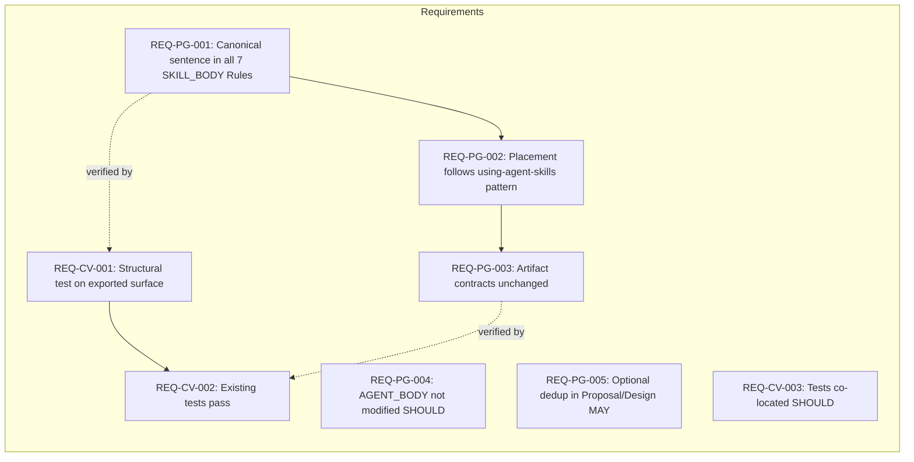

# Spec: Consolidate Cognitive Doc Design Guidance

## Source

- Proposal: `consolidate-cognitive-doc-design` proposal artifact
- Capabilities affected: `developer-team-prompt-guidance` (modified), `developer-team-content-verification` (modified)

## Requirements

### Capability: developer-team-prompt-guidance

REQ-PG-001: Each of the 7 target Developer Team content modules (`explorer-content.ts`, `proposal-content.ts`, `spec-content.ts`, `design-content.ts`, `task-content.ts`, `review-content.ts`, `verify-content.ts`) MUST include the exact canonical sentence `Follow the cognitive-doc-design skill for artifact structure and documentation patterns.` in its SKILL_BODY `## Rules` section.
  Priority: MUST
  Surface: Integration
  Rationale: Ensures all Developer Team agents receive uniform documentation-structure guidance through the standalone skill, per Phase 3B roadmap.

REQ-PG-002: The canonical sentence MUST be placed within the existing SKILL_BODY `## Rules` section, following the established pattern used by `using-agent-skills` references in the same files.
  Priority: MUST
  Surface: Integration
  Rationale: Maintains consistency with the Phase 3A consolidation pattern and minimizes blast radius.

REQ-PG-003: No existing inline artifact contracts, output templates, registry instructions, return formats, tables, or matrices within any target file MUST be altered or removed by this change.
  Priority: MUST
  Surface: Data
  Rationale: SDD artifact contracts are authoritative and downstream agents depend on them. Any alteration risks breaking existing workflows.

REQ-PG-004: The canonical sentence SHOULD NOT be added to AGENT_BODY sections; the required surface is SKILL_BODY only.
  Priority: SHOULD
  Surface: Integration
  Rationale: Exploration recommends SKILL_BODY-only to match the Phase 3A `using-agent-skills` precedent and minimize blast radius.

REQ-PG-005: In `proposal-content.ts` and `design-content.ts`, any duplicate generic documentation guidance in non-contract prose paragraphs MAY be replaced with the canonical reference, provided all artifact-specific output templates, return contracts, and structured guidance remain intact.
  Priority: MAY
  Surface: General
  Rationale: Allows optional deduplication where safe, but does not require it — risk of losing Deck-specific nuance is too high to mandate.

### Capability: developer-team-content-verification

REQ-CV-001: Focused content tests MUST verify the canonical sentence is present on each target module's exported SKILL_BODY (or equivalent structured prompt surface), not merely as a raw file-level string match.
  Priority: MUST
  Surface: General
  Rationale: File-level string presence does not guarantee the reference is in the correct exported prompt surface that agents actually consume. Structural verification prevents false passes.

REQ-CV-002: Existing Developer Team content tests for the 7 target modules MUST continue to pass after the canonical reference is added.
  Priority: MUST
  Surface: General
  Rationale: Confirms no regression in existing content contracts or test expectations.

REQ-CV-003: New focused tests for the canonical reference SHOULD be co-located with existing content tests for each target module.
  Priority: SHOULD
  Surface: General
  Rationale: Maintains test organization consistency and discoverability.

## Acceptance Scenarios

### Capability: developer-team-prompt-guidance

#### Scenario: Canonical reference added to all 7 target modules
**Given** the 7 Developer Team content modules exist under `packages/core/src/teams/developer/`
**When** the canonical `cognitive-doc-design` sentence is added to each module's SKILL_BODY `## Rules` section
**Then** each of the 7 modules contains the exact sentence `Follow the cognitive-doc-design skill for artifact structure and documentation patterns.` within its SKILL_BODY Rules section
> Covers: REQ-PG-001, REQ-PG-002

#### Scenario: Explorer content module receives canonical reference
**Given** `explorer-content.ts` has no existing `cognitive-doc-design` reference and no `using-agent-skills` reference in SKILL_BODY Rules
**When** the canonical sentence is added to its SKILL_BODY `## Rules` section
**Then** the explorer SKILL_BODY contains the canonical sentence in its Rules section and all existing output templates (including Step 5 return format) remain unchanged
> Covers: REQ-PG-001, REQ-PG-003

#### Scenario: Proposal content module canonical reference placement
**Given** `proposal-content.ts` already has a `using-agent-skills` reference at approximately line 273 in SKILL_BODY Rules
**When** the canonical `cognitive-doc-design` sentence is added
**Then** it appears in the same Rules section alongside `using-agent-skills` and the existing proposal output template, registry instructions, and return format remain intact
> Covers: REQ-PG-001, REQ-PG-002, REQ-PG-003

#### Scenario: Artifact contracts remain intact after edit
**Given** a target content module with existing output templates, registry instructions, return formats, and structured tables
**When** the canonical sentence is inserted into the Rules section
**Then** the byte content of all non-Rules sections (templates, contracts, matrices) is identical to its pre-edit state
> Covers: REQ-PG-003

#### Variant: Artifact contract drift detected
- **Given** a diff shows a non-Rules section changed during insertion
- **When** the change is reviewed
- **Then** the change MUST be reverted and re-applied without modifying non-Rules content
> Covers: REQ-PG-003

#### Scenario: AGENT_BODY sections are not modified
**Given** a target content module has both AGENT_BODY and SKILL_BODY sections
**When** the canonical reference is added
**Then** the AGENT_BODY section content is unchanged
> Covers: REQ-PG-004

### Capability: developer-team-content-verification

#### Scenario: Structural test verifies exported SKILL_BODY surface
**Given** the canonical sentence has been added to a target module
**When** focused content tests run
**Then** the test asserts the presence of the canonical sentence on the module's exported SKILL_BODY constant or equivalent structured surface (not merely as a file-level string)
> Covers: REQ-CV-001

#### Scenario: Raw file-level string test is insufficient
**Given** a test that only checks for string presence in the raw file content via `fs.readFileSync` or equivalent
**When** the test is evaluated for acceptance
**Then** it does NOT satisfy REQ-CV-001; the test must target the exported prompt/body constant
> Covers: REQ-CV-001

#### Scenario: Existing content tests pass
**Given** all existing Developer Team content tests for the 7 target modules
**When** the canonical reference is added and the full test suite runs
**Then** all existing tests pass without modification to their assertions
> Covers: REQ-CV-002

#### Variant: Existing test fails due to test matching raw file content
- **Given** an existing test matches the full file content as a snapshot
- **When** the canonical line is added
- **Then** the test snapshot MUST be updated to reflect the legitimate addition (this is an expected update, not a regression)
> Covers: REQ-CV-002

## Validation Rules

| Field / Input | Rule | Error Message | REQ-ID |
|---|---|---|---|
| Canonical sentence text | Must exactly equal `Follow the cognitive-doc-design skill for artifact structure and documentation patterns.` | Canonical sentence mismatch in {module-name} | REQ-PG-001 |
| Canonical sentence location | Must be within SKILL_BODY `## Rules` section | Canonical sentence not found in Rules section of {module-name} | REQ-PG-002 |
| Non-Rules section content | Must be byte-identical to pre-edit state | Artifact contract drift detected in {module-name} | REQ-PG-003 |
| Test assertion target | Must assert against exported prompt/body constant, not raw file string | Test for {module-name} uses file-level string match instead of exported surface | REQ-CV-001 |

## Error Contracts

| Condition | Error Code | Message | Status |
|---|---|---|---|
| Canonical sentence missing from a target module | `MISSING_CANONICAL_REF` | `Module {name} does not contain the cognitive-doc-design canonical reference in SKILL_BODY Rules` | Fail |
| Canonical sentence found outside Rules section | `MISPLACED_CANONICAL_REF` | `Module {name} contains cognitive-doc-design reference outside SKILL_BODY Rules section` | Fail |
| Artifact contract drift detected | `CONTRACT_DRIFT` | `Non-Rules content changed in {name}; expected byte-identical pre-edit state` | Fail |
| Test targets raw file instead of exported surface | `INSUFFICIENT_TEST_SURFACE` | `Test for {name} does not verify exported SKILL_BODY surface` | Fail |

## States and Transitions

> Omitted — no meaningful state lifecycle. This is a one-time content insertion with no state machine.

## Open Questions

- **Prompt surface decision**: The proposal flags uncertainty about whether `AGENT_BODY`, `SKILL_BODY`, or both are mandatory. Exploration recommends SKILL_BODY only (Option 1). This spec adopts that recommendation (REQ-PG-004) as a SHOULD, but the Design agent may elevate or adjust this based on roadmap interpretation.
- **Generic guidance deduplication in Proposal/Design**: Which generic documentation guidance paragraphs in `proposal-content.ts` and `design-content.ts` can be safely replaced without weakening artifact-specific contracts remains an open question. This spec makes it optional (REQ-PG-005, MAY priority) to avoid mandating uncertain changes.

## Compliance Matrix

| REQ-ID | Scenario(s) | Status |
|---|---|---|
| REQ-PG-001 | Canonical reference added to all 7 modules; Explorer content module; Proposal content module placement | Defined |
| REQ-PG-002 | Canonical reference added to all 7 modules; Proposal content module placement | Defined |
| REQ-PG-003 | Artifact contracts remain intact; Artifact contract drift detected | Defined |
| REQ-PG-004 | AGENT_BODY sections are not modified | Defined |
| REQ-PG-005 | (Optional — no dedicated scenario; covered by general contract-intact scenario) | Defined |
| REQ-CV-001 | Structural test verifies exported SKILL_BODY surface; Raw file-level string test is insufficient | Defined |
| REQ-CV-002 | Existing content tests pass; Existing test fails due to snapshot matching | Defined |
| REQ-CV-003 | (Organizational preference — no dedicated scenario) | Defined |

## Mermaid Summary Source

