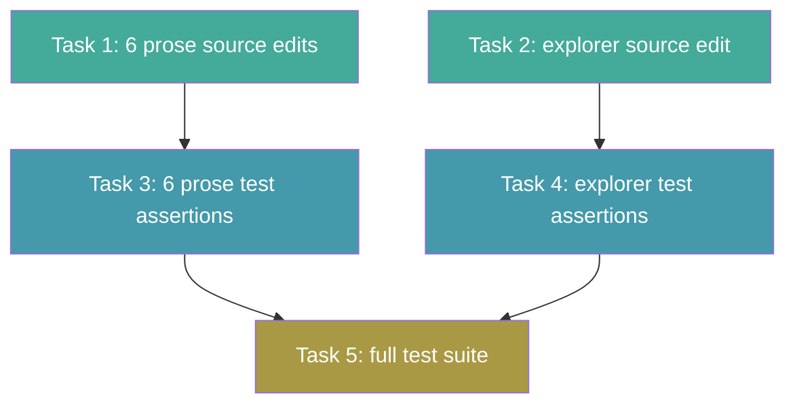

# Tasks: Consolidate Cognitive Doc Design Guidance

## Source

- Spec: `consolidate-cognitive-doc-design` spec artifact
- Design: `consolidate-cognitive-doc-design` design artifact
- Capabilities affected: `developer-team-prompt-guidance`, `developer-team-content-verification`

## Task Groups

### Group: Shared / Contracts

#### Task 1: Add canonical line to 6 prose-shape SKILL_BODY modules

**Owner**: General Apply
**Priority**: P0
**Complexity**: Low
**Parallel**: No — groups with Task 2 as a batch
**Depends on**: none

**Description**
Add the canonical sentence `Follow the cognitive-doc-design skill for artifact structure and documentation patterns.` as a second prose line under the `## Rules` section in each of the 6 prose-shape SKILL_BODY constants. The line is appended after the existing `using-agent-skills` line, separated by a blank line. Do NOT modify `*_AGENT_BODY` constants, output templates, return formats, tables, matrices, or any section outside `## Rules`.

The 6 files (all at `packages/core/src/teams/developer/`):
- `proposal-content.ts` — insert after line ~273
- `spec-content.ts` — insert after line ~367
- `design-content.ts` — insert after line ~328
- `task-content.ts` — insert after line ~399
- `review-content.ts` — insert after line ~308
- `verify-content.ts` — insert after line ~277

Exact canonical line (byte-identical across all files):
```
Follow the cognitive-doc-design skill for artifact structure and documentation patterns.
```

**Files**
- `packages/core/src/teams/developer/proposal-content.ts` — modify
- `packages/core/src/teams/developer/spec-content.ts` — modify
- `packages/core/src/teams/developer/design-content.ts` — modify
- `packages/core/src/teams/developer/task-content.ts` — modify
- `packages/core/src/teams/developer/review-content.ts` — modify
- `packages/core/src/teams/developer/verify-content.ts` — modify

**Verification**
- For each file: `git diff` shows only the new canonical line added under `## Rules`, with no other changes.
- Each `*_SKILL_BODY` ends with `## Rules` section containing both the `using-agent-skills` line and the new `cognitive-doc-design` line.
- Each `*_AGENT_BODY` is unchanged in the diff.

---

#### Task 2: Add canonical line to explorer SKILL_BODY module

**Owner**: General Apply
**Priority**: P0
**Complexity**: Low
**Parallel**: Yes — independent of Task 1
**Depends on**: none

**Description**
Add the canonical sentence as the **10th bullet** at the end of the bullet list in `EXPLORER_SKILL_BODY`'s `## Rules` section (currently lines 216–226, 9 bullets). The bullet form matches explorer's local convention (the other 6 files use prose form). Do NOT modify `EXPLORER_AGENT_BODY` or any section outside `## Rules`.

Exact canonical line in bullet form:
```
- Follow the cognitive-doc-design skill for artifact structure and documentation patterns.
```

**Files**
- `packages/core/src/teams/developer/explorer-content.ts` — modify

**Verification**
- `git diff` shows only 1 new bullet line appended at end of Rules bullet list.
- `EXPLORER_AGENT_BODY` is unchanged in the diff.
- The 9 existing bullets are unchanged; the new bullet is the 10th.

---

#### Task 3: Add cognitive-doc-design canonical-line assertions to 6 prose-shape test files

**Owner**: General Apply
**Priority**: P0
**Complexity**: Low
**Parallel**: No — depends on Task 1
**Depends on**: Task 1

**Description**
Extend the existing `describe("Canonical line replacement")` block in each of the 6 prose-shape test files with a parallel set of assertions for the `cognitive-doc-design` canonical line. Define `CDD_CANONICAL_LINE = "Follow the cognitive-doc-design skill for artifact structure and documentation patterns."` at the top of the block (same pattern as the existing `CANONICAL_LINE` for using-agent-skills). Add 4 assertions:

1. `*_SKILL_BODY` contains `CDD_CANONICAL_LINE` exactly once (`split(CDD_CANONICAL_LINE).length - 1 === 1`)
2. `*_SKILL_BODY` does NOT contain `- ${CDD_CANONICAL_LINE}` (bullet variant must not exist in prose files)
3. `*_AGENT_BODY` does NOT contain `CDD_CANONICAL_LINE` (AGENT immutability)
4. `*_SKILL_BODY` contains `## Rules` (section preserved)

The 6 test files (all at `packages/core/src/teams/developer/`):
- `proposal-content.test.ts`
- `spec-content.test.ts`
- `design-content.test.ts`
- `task-content.test.ts`
- `review-content.test.ts`
- `verify-content.test.ts`

**Files**
- `packages/core/src/teams/developer/proposal-content.test.ts` — modify
- `packages/core/src/teams/developer/spec-content.test.ts` — modify
- `packages/core/src/teams/developer/design-content.test.ts` — modify
- `packages/core/src/teams/developer/task-content.test.ts` — modify
- `packages/core/src/teams/developer/review-content.test.ts` — modify
- `packages/core/src/teams/developer/verify-content.test.ts` — modify

**Verification**
- Each test file compiles without errors.
- New assertions follow the exact pattern of the existing `CANONICAL_LINE` block.
- Tests assert against the imported `*_SKILL_BODY` constant, not raw file content (satisfies REQ-CV-001).

---

#### Task 4: Add cognitive-doc-design canonical-line assertions to explorer test file

**Owner**: General Apply
**Priority**: P0
**Complexity**: Low
**Parallel**: No — depends on Task 2
**Depends on**: Task 2

**Description**
Add a new `describe("Cognitive doc design canonical line")` block to `explorer-content.test.ts`. Explorer does NOT have an existing `Canonical line replacement` block (it has no using-agent-skills canonical line). Define `CDD_CANONICAL_LINE` and add 3 assertions:

1. `EXPLORER_SKILL_BODY` contains `CDD_CANONICAL_LINE` exactly once
2. `EXPLORER_AGENT_BODY` does NOT contain `CDD_CANONICAL_LINE` (AGENT immutability)
3. `EXPLORER_SKILL_BODY` contains `## Rules` (section preserved)

Note: Do NOT assert the bullet-variant negation (`- ${CDD_CANONICAL_LINE}`) — explorer uses bullet form by design, so the bullet variant IS the expected shape.

**Files**
- `packages/core/src/teams/developer/explorer-content.test.ts` — modify

**Verification**
- Test file compiles without errors.
- New assertions target the imported `EXPLORER_SKILL_BODY` constant (not raw file).
- No bullet-variant negation assertion for explorer (different from the 6 prose files).

---

#### Task 5: Run full test suite and verify no regression

**Owner**: General Apply
**Priority**: P0
**Complexity**: Low
**Parallel**: No — depends on Tasks 3 and 4
**Depends on**: Task 3, Task 4

**Description**
Run the full Developer Team content test suite to confirm:
1. All new cognitive-doc-design assertions pass (7 files).
2. All existing `Canonical line replacement` assertions pass (6 files, unchanged).
3. All existing non-canonical test blocks pass (placeholder detection, identity headers, artifact persistence, runtime neutrality, Git Safety Rule, cross-differentiation, etc.).
4. No test file modifications are needed beyond what Tasks 3 and 4 introduced.

Command: `bun test packages/core/src/teams/developer/*-content.test.ts`

If any snapshot tests fail due to the legitimate addition (per Spec variant "Existing test fails due to test matching raw file content"), update the snapshot — this is an expected update, not a regression (REQ-CV-002 variant).

**Files**
- (no new file changes; verification only)

**Verification**
- `bun test` exits with code 0.
- All test counts match expectations: 7 source files × new assertions + 6 existing canonical blocks + all other existing tests.

---

## Dependency Graph

```
Task 1 (6 prose source edits)
  → Task 3 (6 prose test assertions)
Task 2 (explorer source edit)
  → Task 4 (explorer test assertions)
Task 3 + Task 4
  → Task 5 (full test suite verification)

Task 1 ‖ Task 2  (parallel)
Task 3 ‖ Task 4  (parallel, after their respective source deps)
```

## Parallelization Plan

| Phase | Tasks | Can Run in Parallel |
|---|---|---|
| Source edits | 1, 2 | Yes — Task 1 and Task 2 are independent |
| Test assertions | 3, 4 | Yes — Task 3 and Task 4 are independent (after their source deps) |
| Verification | 5 | No — must wait for all prior tasks |

## Responsibility Contracts

| Contract / Boundary | Owner | Consumers | Notes |
|---|---|---|---|
| Canonical sentence exact text | General Apply (Task 1, 2) | General Apply (Task 3, 4) | Byte-identical string across all 7 files; tests enforce exact match |
| SKILL_BODY `## Rules` insertion site | General Apply (Task 1, 2) | General Apply (Task 3, 4) | Prose form for 6 files; bullet form for explorer; tests verify section preserved |
| `*_AGENT_BODY` immutability | General Apply (Task 1, 2) | General Apply (Task 3, 4) | Tests assert AGENT_BODY does not contain the canonical line |
| Non-Rules section preservation | General Apply (Task 1, 2) | General Apply (Task 5) | Verified by: existing tests continue passing + diff review |

## Complexity Summary

| Complexity | Count | Task Numbers |
|---|---|---|
| Low | 5 | 1, 2, 3, 4, 5 |
| Medium | 0 | — |
| High | 0 | — |

## Flagged for Splitting

None — all tasks are Low complexity. Task 1 touches 6 files but each edit is a single-line insertion with identical shape, well within one session.

## Review Workload Forecast

| Signal | Value |
|---|---|
| Estimated changed lines | 100-400 |
| 400-line budget risk | Low |
| Scope reduction recommended | No |
| Sequential work slices recommended | No |
| Decision needed before Apply | No |

**Rationale**: 7 source files gain 1 line each (7 lines). 6 prose test files gain ~10-12 lines each (~60-72 lines). Explorer test gains ~10-12 lines. Total: ~80-90 added lines across 14 files, with zero deletions. Well under the 400-line budget. Each edit is a mechanical append to a known section boundary. No architectural decisions remain open. No sequential slices needed — the parallelization plan handles dependencies cleanly.

## Open Questions / Blockers

- None — tasks are ready for Apply.

**Blocker classification**:
- No implementation-blocking issues.
- No allowed-with-stub items needed.
- Non-blocking notes: REQ-PG-005 (optional dedup in proposal/design) is explicitly deferred per Design tradeoffs. If desired later, it would be a separate change.

## Mermaid Summary Source


