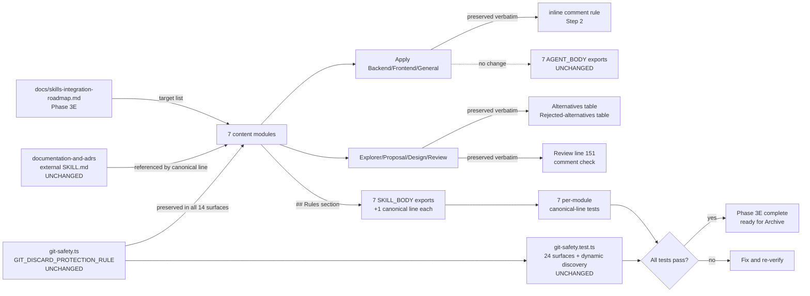

# Design: Consolidate Documentation and ADR Guidance (Phase 3E)

## Source

- **Proposal**: `consolidate-documentation-and-adrs` proposal artifact (`openspec/changes/consolidate-documentation-and-adrs/proposal.md`)
- **Exploration**: `openspec/changes/consolidate-documentation-and-adrs/exploration.md`
- **Capabilities affected**:
  - `developer-team-prompt-guidance` (modified — Phase 3E target agents receive canonical `documentation-and-adrs` reference)
  - `developer-team-content-verification` (modified — focused tests assert exported surfaces)
- **Spec status**: not yet available (Spec runs in parallel; Design does not depend on it)

## Current Architecture Context

### Developer Team Content Module Pattern

Each of the 12 Developer Team agents lives in `packages/core/src/teams/developer/{agent}-content.ts` and exports **two markdown constants** (TypeScript template literals, no backticks inside):

| Surface | Audience | Purpose |
|---|---|---|
| `{AGENT}_AGENT_BODY` | Runtime agent file (slim) | Identity, role, scope, non-goals, Git safety rule, return contract |
| `{AGENT}_SKILL_BODY` | Runtime skill file (detailed) | Full methodology, step-by-step procedure, output template, `## Rules` section |

The `## Rules` section of each `SKILL_BODY` is the canonical home for "Follow the {skill} skill for {purpose}." lines. Existing canonical lines already in use across the 14 target surfaces:

| Canonical line | Targets | Phase |
|---|---|---|
| `Follow the using-agent-skills skill for operating behaviors and failure mode guidance.` | All 12 SKILL_BODY (24 surfaces × ½) | 3A |
| `Follow the cognitive-doc-design skill for artifact structure and documentation patterns.` | Explorer, Proposal, Design, Review | 3B |
| `Follow the api-and-interface-design skill for stable API and interface design guidance.` | Apply Backend, Apply General, Design, Review | (post-3A, pre-3E) |
| `Follow the code-review-and-quality skill for five-axis criteria (architecture, security, scalability, maintainability, best practices).` | Review only | 3C |

### Git Safety (Critical — Must Not Change)

`packages/core/src/teams/developer/git-safety.ts` exports:
- `GIT_DISCARD_PROTECTION_RULE` — full canonical rule text (template literal)
- `GIT_SAFETY_SENTINEL` — `"CRITICAL_SAFETY_GIT_DISCARD_PROTECTION"` for presence detection
- `assertGitSafetyRulePresent(body, label)` — helper

The rule is interpolated (via `${GIT_DISCARD_PROTECTION_RULE}`) into both `AGENT_BODY` and `SKILL_BODY` of every content module. `git-safety.test.ts` (157 lines) enforces:
1. All 24 surfaces contain the rule (byte-identity test)
2. All 24 surfaces contain the sentinel
3. Every `*-content.ts` file (except `visual-explanations-content.ts`) imports `GIT_DISCARD_PROTECTION_RULE` from `./git-safety` (dynamic discovery test)
4. The rule contains required destructive command families and behavior elements
5. `docs/skills-integration-roadmap.md` contains a Git safety sentinel phrase

**The rule is the single non-negotiable invariant. Phase 3E must not edit `git-safety.ts`, remove the import, or remove the interpolation in any of the 7 content modules.**

### Current Overlap Areas (per Exploration)

1. **Comment guidance** — three identical inline lines in Apply Backend/Frontend/General:
   `Write clean, readable code with appropriate comments for non-obvious decisions.`
   Lines 126 (backend), 129 (frontend), 125 (general). `documentation-and-adrs` provides deeper why-vs-what methodology.

2. **Alternatives/tradeoffs** — `proposal-content.ts` (line 36, 174-175 in template) and `design-content.ts` (line 40, 144 in template) already enforce Alternatives and Rejected Alternatives tables via their output templates. `documentation-and-adrs` provides an ADR-style "Alternatives Considered" section with rejected-rationale capture.

3. **Review comment check** — `review-content.ts` line 151: `Are comments appropriate (not excessive, not missing for non-obvious decisions)?`

4. **Git safety** — already implemented and enforced; not duplicated in `documentation-and-adrs`.

## Proposed Architecture

**Approach**: add a single canonical sentence to the `## Rules` section of each of the 7 target `SKILL_BODY` exports. Keep all inline contracts, alternatives tables, return templates, and the Git safety rule untouched. Tests assert the canonical line lives on the exported constant (not just file text), exactly once, in SKILL_BODY only.

### Canonical Sentence (Design-Proposed)

> `Follow the documentation-and-adrs skill for comment guidance and ADR-style alternatives/rationale documentation.`

Rationale:
- Mirrors Phase 3A/B/C sentence shape (declarative, scope-explicit, no backticks).
- Covers both overlap areas: comment guidance (Apply agents) and alternatives/rationale documentation (Proposal, Design, Review).
- Fits on a single line alongside the other `## Rules` canonical lines.
- No raw backticks — safe inside TypeScript template literals (parses cleanly, no escape risk).

### Treatment Per Target

| Target | AGENT_BODY | SKILL_BODY | Inline comment rule | Other contract |
|---|---|---|---|---|
| Apply Backend | unchanged | `## Rules` +1 canonical line | keep | apply-progress template, registry steps, return contract |
| Apply Frontend | unchanged | `## Rules` +1 canonical line | keep | apply-progress template, registry steps, return contract |
| Apply General | unchanged | `## Rules` +1 canonical line | keep | apply-progress template, registry steps, return contract |
| Explorer | unchanged | `## Rules` +1 canonical line | n/a | options analysis table, finding format, registry steps |
| Proposal | unchanged | `## Rules` +1 canonical line | n/a | output template (alternatives table), return contract |
| Design | unchanged | `## Rules` +1 canonical line | n/a | output template (rejected alternatives table), return contract |
| Review | unchanged | `## Rules` +1 canonical line | n/a | comment check (line 151) kept verbatim, severity classification, review report template |

**Apply agent decision (resolves Proposal Open Question 2)**: keep the inline comment rule **and** add the canonical reference. Reasons:
- The inline rule is a one-line contract baked into Step 2 of every apply skill. Removing it changes the surface of what Apply agents tell the model.
- The canonical line provides depth ("why-vs-what" + ADR methodology) without forcing deletion of the terse inline rule.
- Matches Phase 3B precedent for `cognitive-doc-design`: deeper reference sits in `## Rules`; the existing inline rules stay.

**Review agent decision**: do not edit the line-151 comment check. It is a check, not a generation rule. The canonical line in `## Rules` provides the cross-reference; the check text stays concrete and verbatim.

### Component / Module Boundaries

| Component | Responsibility | Change Type |
|---|---|---|
| `packages/core/src/teams/developer/apply-backend-content.ts` | Apply Backend SKILL_BODY `## Rules` | modified |
| `packages/core/src/teams/developer/apply-frontend-content.ts` | Apply Frontend SKILL_BODY `## Rules` | modified |
| `packages/core/src/teams/developer/apply-general-content.ts` | Apply General SKILL_BODY `## Rules` | modified |
| `packages/core/src/teams/developer/explorer-content.ts` | Explorer SKILL_BODY `## Rules` | modified |
| `packages/core/src/teams/developer/proposal-content.ts` | Proposal SKILL_BODY `## Rules` | modified |
| `packages/core/src/teams/developer/design-content.ts` | Design SKILL_BODY `## Rules` | modified |
| `packages/core/src/teams/developer/review-content.ts` | Review SKILL_BODY `## Rules` | modified |
| `packages/core/src/teams/developer/git-safety.ts` | Critical Git discard protection rule | unchanged |
| `packages/core/src/teams/developer/git-safety.test.ts` | Centralized git-safety test (24 surfaces + dynamic discovery) | unchanged |
| `packages/core/src/teams/developer/{apply-backend,apply-frontend,apply-general,explorer,proposal,design,review}-content.test.ts` (7 files) | Per-module exported-surface tests | modified (add canonical-line test block) |
| `packages/core/src/skills/external/documentation-and-adrs/SKILL.md` | Standalone ADR/comment guidance | unchanged (out of scope per Proposal §Out of Scope) |
| `openspec/changes/consolidate-documentation-and-adrs/design.md` | This design artifact | create |

### Data Flow

No data flow changes. The change is additive text inside 7 TypeScript-exported string constants. Build-time consumption:

```
content.ts exports → developer-team-install.ts → runtime agent/skill files → model context
```

The model receives one additional sentence in each of 7 `SKILL_BODY` files at runtime. AGENT_BODY (slim identity) is unchanged. The build pipeline (`bun run build` and the agent installer) does not need new logic — it reads the same exported constants and writes the same files.

### API / Contract Implications

| Endpoint / Interface | Change | Backward Compatible |
|---|---|---|
| `APPLY_BACKEND_AGENT_BODY` | unchanged content | yes |
| `APPLY_BACKEND_SKILL_BODY` | +1 canonical line in `## Rules` | yes (additive) |
| `APPLY_FRONTEND_AGENT_BODY` | unchanged content | yes |
| `APPLY_FRONTEND_SKILL_BODY` | +1 canonical line in `## Rules` | yes (additive) |
| `APPLY_GENERAL_AGENT_BODY` | unchanged content | yes |
| `APPLY_GENERAL_SKILL_BODY` | +1 canonical line in `## Rules` | yes (additive) |
| `EXPLORER_AGENT_BODY` | unchanged content | yes |
| `EXPLORER_SKILL_BODY` | +1 canonical line in `## Rules` | yes (additive) |
| `PROPOSAL_AGENT_BODY` | unchanged content | yes |
| `PROPOSAL_SKILL_BODY` | +1 canonical line in `## Rules` | yes (additive) |
| `DESIGN_AGENT_BODY` | unchanged content | yes |
| `DESIGN_SKILL_BODY` | +1 canonical line in `## Rules` | yes (additive) |
| `REVIEW_AGENT_BODY` | unchanged content | yes |
| `REVIEW_SKILL_BODY` | +1 canonical line in `## Rules` | yes (additive) |
| `GIT_DISCARD_PROTECTION_RULE` | unchanged | yes |
| `GIT_SAFETY_SENTINEL` | unchanged | yes |
| `assertGitSafetyRulePresent` | unchanged | yes |

All 14 `AGENT_BODY` and `SKILL_BODY` exports continue to import and interpolate `GIT_DISCARD_PROTECTION_RULE`. The existing `git-safety.test.ts` byte-identity and dynamic-discovery tests must continue to pass.

### State / Persistence Implications

**None.** No data models, schemas, storage, or runtime state change. The change is content-only. No Spec Registry `state.yaml` or `events.yaml` write is performed in this design phase (registry-deferred mode; see §Migration).

### Migration / Backward Compatibility

**None required.** Additive text in 7 `SKILL_BODY` exports:
- No removal of any existing rule, canonical line, or template.
- No schema change.
- No Spec Registry change in this phase (orchestrator serializes `state.yaml`/`events.yaml` updates after the parallel batch completes).
- No git history rewrite — the rollback plan in the Proposal §Rollback applies: revert only the Phase 3E prompt/test edits via a reviewable reverse patch. No destructive Git cleanup/reset.

## File Impact Estimate

| File / Path | Action | Rationale |
|---|---|---|
| `packages/core/src/teams/developer/apply-backend-content.ts` | modify | Add canonical line to `APPLY_BACKEND_SKILL_BODY` `## Rules` |
| `packages/core/src/teams/developer/apply-frontend-content.ts` | modify | Add canonical line to `APPLY_FRONTEND_SKILL_BODY` `## Rules` |
| `packages/core/src/teams/developer/apply-general-content.ts` | modify | Add canonical line to `APPLY_GENERAL_SKILL_BODY` `## Rules` |
| `packages/core/src/teams/developer/explorer-content.ts` | modify | Add canonical line to `EXPLORER_SKILL_BODY` `## Rules` |
| `packages/core/src/teams/developer/proposal-content.ts` | modify | Add canonical line to `PROPOSAL_SKILL_BODY` `## Rules` |
| `packages/core/src/teams/developer/design-content.ts` | modify | Add canonical line to `DESIGN_SKILL_BODY` `## Rules` |
| `packages/core/src/teams/developer/review-content.ts` | modify | Add canonical line to `REVIEW_SKILL_BODY` `## Rules` |
| `packages/core/src/teams/developer/apply-backend-content.test.ts` | modify | Add canonical-line test block (SKILL_BODY exact-once, no bullet variant, AGENT_BODY absent, ## Rules preserved) |
| `packages/core/src/teams/developer/apply-frontend-content.test.ts` | modify | Same canonical-line test block |
| `packages/core/src/teams/developer/apply-general-content.test.ts` | modify | Same canonical-line test block |
| `packages/core/src/teams/developer/explorer-content.test.ts` | modify | Same canonical-line test block |
| `packages/core/src/teams/developer/proposal-content.test.ts` | modify | Same canonical-line test block |
| `packages/core/src/teams/developer/design-content.test.ts` | modify | Same canonical-line test block |
| `packages/core/src/teams/developer/review-content.test.ts` | modify | Same canonical-line test block |
| `packages/core/src/teams/developer/git-safety.ts` | unchanged | Critical Git safety — invariant; do not edit |
| `packages/core/src/teams/developer/git-safety.test.ts` | unchanged | Already covers all 24 surfaces + dynamic discovery; will re-validate after edits |
| `packages/core/src/skills/external/documentation-and-adrs/SKILL.md` | unchanged | Out of scope per Proposal §Out of Scope |
| `openspec/changes/consolidate-documentation-and-adrs/design.md` | create | This artifact |

**Total**: 7 content modules modified, 7 test files modified, 1 design artifact created. 2 files (`git-safety.ts`, `git-safety.test.ts`) explicitly unchanged.

## Testing Strategy

### Per-Module Canonical-Line Tests (added to 7 test files)

For each of the 7 targets, add a `describe("Documentation and ADRs canonical line", ...)` block following the existing `using-agent-skills` / `cognitive-doc-design` / `api-and-interface-design` precedent (see `apply-backend-content.test.ts` lines 150-198 for the shape):

1. `SKILL_BODY` contains the canonical line **exactly once** (assert via `.split(line).length - 1 === 1`).
2. `SKILL_BODY` contains **no bullet variant** of the canonical line (assert `.not.toContain(\`- ${CANONICAL_LINE}\`)`).
3. `AGENT_BODY` does **not** contain the canonical line (immutability; AGENT_BODY stays slim).
4. `SKILL_BODY` preserves the `## Rules` heading.
5. `SKILL_BODY` canonical line is **distinct** from existing `using-agent-skills`, `cognitive-doc-design`, `api-and-interface-design`, and `code-review-and-quality` canonical lines (no substring overlap).

### Existing Test Continuity

The Phase 3E edit must not regress any existing test:
- `git-safety.test.ts` — all 24 surfaces must still pass byte-identity, sentinel, dynamic-discovery, and roadmap-presence tests.
- Each `{module}-content.test.ts` — placeholder, identity, role, scope, team-ID, terminal, artifact-persistence, Pi-launcher, contract tests.
- Existing canonical-line tests for `using-agent-skills`, `cognitive-doc-design`, `api-and-interface-design`, `code-review-and-quality`.

### Verification Commands

```
bun test packages/core/src/teams/developer/git-safety.test.ts
bun test packages/core/src/teams/developer/apply-backend-content.test.ts
bun test packages/core/src/teams/developer/apply-frontend-content.test.ts
bun test packages/core/src/teams/developer/apply-general-content.test.ts
bun test packages/core/src/teams/developer/explorer-content.test.ts
bun test packages/core/src/teams/developer/proposal-content.test.ts
bun test packages/core/src/teams/developer/design-content.test.ts
bun test packages/core/src/teams/developer/review-content.test.ts
```

(Or a single `bun test packages/core/src/teams/developer/` for the full sweep.)

## Observability / Error Handling

None specific to this change. The Phase 3E edit does not introduce runtime errors, async I/O, or observable surfaces. Existing Git safety error handling (`assertGitSafetyRulePresent`) is unchanged and continues to throw on missing sentinel.

## Security / Performance / Accessibility Considerations

**None specific to this change.** The change is additive markdown text in 7 SKILL_BODY exports. No security surface, no performance hot path, no accessibility concern is introduced or modified. The Git safety rule (security-critical) is explicitly preserved unchanged.

## Tradeoffs

| Decision | Chosen | Rejected Alternative | Rationale |
|---|---|---|---|
| Canonical sentence text | `Follow the documentation-and-adrs skill for comment guidance and ADR-style alternatives/rationale documentation.` | Multiple sentences / longer prose / numbered bullets | Matches Phase 3A/B/C single-sentence precedent; covers both overlap areas; no backticks; safe inside TS template literal |
| Apply agent inline comment rule | Keep inline rule **and** add canonical reference | Replace inline rule with reference | Lower contract risk (Step 2 unchanged); resolves Proposal Open Question 2 toward "keep both"; matches Phase 3B cognitive-doc-design pattern |
| Surface scope | `SKILL_BODY` only | Both `AGENT_BODY` and `SKILL_BODY` | Matches Phase 3A/B/C precedent; AGENT_BODY stays slim; tests enforce immutability; resolves Proposal Open Question 3 |
| Placement in `SKILL_BODY` | `## Rules` section (alongside other skill-following lines) | New `## Documentation` section | Lower change surface; reuses existing structure; matches where `cognitive-doc-design` and `api-and-interface-design` lines already live |
| Review comment check text | Unchanged (line 151 verbatim) | Add reference inline to comment check | The check is an evaluation criterion, not a generation rule; `## Rules` is the right place for skill-following references |
| Git safety | Unchanged (`git-safety.ts` and rule text) | Add documentation-and-adrs to `git-safety.ts` or expand it | Out of scope; risk of over-broadening; existing protections already comprehensive and tested |
| `documentation-and-adrs/SKILL.md` | Unchanged | Restructure to match Phase 3E needs | Proposal §Out of Scope: "Changing the standalone `documentation-and-adrs` skill content" is explicitly excluded |
| Spec Registry write in this phase | Deferred to Orchestrator | Write `state.yaml`/`events.yaml` now | Per Orchestrator instruction ("Registry-deferred"); parallel batch serialization responsibility belongs to the Orchestrator |

## Risks

| Risk | Likelihood | Impact | Mitigation |
|---|---|---|---|
| Tests match file text but miss exported prompt surfaces | Medium | Medium | Add canonical-line tests that import the constants directly (following existing pattern in `apply-backend-content.test.ts` lines 154-165); do not use `fs.readFile` |
| Canonical line breaks TypeScript template literal parsing (raw backticks) | Low | High | The proposed sentence contains no backticks; matches the prior `cognitive-doc-design` and `api-and-interface-design` line shapes; previous Phase 3E attempt failed on this exact issue per Exploration §Risks — avoided by design |
| Apply agent inline comment rule becomes redundant | Low | Low | Proposal already accepts the redundancy trade-off (Open Question 2); keep both per Option B from Exploration |
| Git safety regression from accidental edit | Low | **Critical** | Do not modify `git-safety.ts`; do not remove the import line `import { GIT_DISCARD_PROTECTION_RULE } from "./git-safety";`; do not remove the `${GIT_DISCARD_PROTECTION_RULE}` interpolation in any of the 7 content modules; re-run `git-safety.test.ts` after every content edit |
| New canonical line collides as substring of an existing canonical line | Low | Medium | Verify the new line does not contain the `using-agent-skills`, `cognitive-doc-design`, `api-and-interface-design`, or `code-review-and-quality` canonical lines; add a "distinct from existing canonical lines" test |
| Over-consolidation removes an essential contract structure | Low | High | Preserve Proposal alternatives table, Design rejected-alternatives table, return contracts, apply-progress templates, and registry-update instructions verbatim; only the `## Rules` section is touched |
| Pre-existing content tests regress | Low | Medium | New canonical line is the only addition in each SKILL_BODY; all other sections are unchanged; full test sweep after edits |
| Registry write happens in this phase (breaking registry-deferred contract) | None (mitigated) | None | The Orchestrator's instruction is explicit; this design does not touch `state.yaml` or `events.yaml`; return-contract reports `Registry Write: deferred` and `Registry Intent` only |

## Open Decisions

**None blocking — design is self-contained.** The 3 Open Questions from the proposal are resolved by the choices above:

- **Q1 (canonical sentence)**: `Follow the documentation-and-adrs skill for comment guidance and ADR-style alternatives/rationale documentation.`
- **Q2 (Apply agents — keep inline rule or replace)**: keep both inline rule and canonical reference.
- **Q3 (surface scope)**: `SKILL_BODY` only.

These three choices are recommendations to Spec; Spec may ratify or refine. If Spec diverges, Task Agent must reconcile before implementation.

## Dependencies

- **`packages/core/src/skills/external/documentation-and-adrs/SKILL.md`** — must exist as the canonical reference target. Verified present at 278 lines.
- **`packages/core/src/teams/developer/git-safety.ts`** — must remain unchanged. Verified present at 75 lines, exports `GIT_DISCARD_PROTECTION_RULE`, `GIT_SAFETY_SENTINEL`, and `assertGitSafetyRulePresent`.
- **`docs/skills-integration-roadmap.md` Phase 3E** — roadmap source-of-truth (verified via `git-safety.test.ts` line 152: sentinel phrase `Phase 3Z` already present in roadmap, indicating Git safety is documented there).
- **Existing Developer Team content test infrastructure** — `bun:test` + per-module `*-content.test.ts` files (7 already exist, each between 7.5K-12K bytes).
- **Spec artifact** — runs in parallel; Design does not formally depend on it. Spec may ratify the 3 resolved open questions.

## Next Steps

Ready for Task (`deck-developer-task`) to combine this design with the Spec artifact and break it into atomic implementation tasks. Critical sequencing reminders for Task Agent:

1. Touch **only** the 14 files listed in the File Impact Estimate. Do not edit `git-safety.ts`.
2. In each of the 7 content modules, add the canonical line to `## Rules` of `SKILL_BODY`; do not edit `AGENT_BODY`.
3. Add the canonical-line test block to each of the 7 test files; do not edit the placeholder, identity, role, scope, or Git-safety tests.
4. Re-run `bun test packages/core/src/teams/developer/` after every edit.
5. Do not modify `state.yaml` or `events.yaml` (registry-deferred). The Orchestrator will serialize the registry update.

## Mermaid Summary Source



## Artifacts Reference

- **This design**: `openspec/changes/consolidate-documentation-and-adrs/design.md`
- **Proposal**: `openspec/changes/consolidate-documentation-and-adrs/proposal.md`
- **Exploration**: `openspec/changes/consolidate-documentation-and-adrs/exploration.md`
- **External skill (referenced, unchanged)**: `packages/core/src/skills/external/documentation-and-adrs/SKILL.md`
- **Git safety (critical, unchanged)**: `packages/core/src/teams/developer/git-safety.ts`
- **Git safety test (unchanged)**: `packages/core/src/teams/developer/git-safety.test.ts`
- **Roadmap**: `docs/skills-integration-roadmap.md` (Phase 3E)
