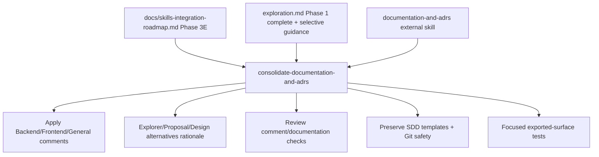

# Proposal: Consolidate Documentation and ADR Guidance

## Intent

Phase 3E of the Skills Integration Roadmap should reduce duplicated documentation/comment/alternatives guidance in Developer Team prompts by referencing the standalone `documentation-and-adrs` skill, while preserving Deck SDD artifact contracts and Git safety protections.

## Goal

Add `documentation-and-adrs` guidance to the 7 Phase 3E target Developer Team content modules without changing output templates, registry behavior, or destructive Git safety rules.

## Scope

### In Scope
- Reference `documentation-and-adrs` for why-vs-what comments and ADR-style alternatives/rationale documentation.
- Target these content modules:
  - `packages/core/src/teams/developer/apply-backend-content.ts`
  - `packages/core/src/teams/developer/apply-frontend-content.ts`
  - `packages/core/src/teams/developer/apply-general-content.ts`
  - `packages/core/src/teams/developer/explorer-content.ts`
  - `packages/core/src/teams/developer/proposal-content.ts`
  - `packages/core/src/teams/developer/design-content.ts`
  - `packages/core/src/teams/developer/review-content.ts`
- Preserve artifact-specific templates, alternatives/tradeoffs tables, return contracts, registry rules, and existing Git discard protections.
- Add/update focused content tests for required prompt surfaces.

### Out of Scope
- Changing the standalone `documentation-and-adrs` skill content.
- Rewriting SDD artifact formats, proposal/design templates, or review report structure.
- Modifying `git-safety.ts` beyond preserving existing protections.
- Later roadmap Phase 3F consolidations.

## Affected Capabilities

### New Capabilities
- None.

### Modified Capabilities
- `developer-team-prompt-guidance`: Phase 3E target agents receive canonical `documentation-and-adrs` guidance for comments and rationale capture.
- `developer-team-content-verification`: Tests should verify the required guidance appears on the intended exported prompt/body surfaces.

### Unchanged Capabilities
- `sdd-artifact-contracts`: Artifact filenames, templates, registry persistence, return formats, and acceptance/report structures stay authoritative inline.
- `git-discard-protection`: Existing critical Git safety rule remains unchanged and present in agent/skill bodies.
- `standalone-skill-installation`: Phase 1 is treated as complete; the existing external skill remains a dependency, not a target for this change.

## Approach

Follow roadmap Phase 3E with selective consolidation: add canonical `documentation-and-adrs` references where agents discuss comments, alternatives, tradeoffs, ADR-style rationale, or future-agent documentation; keep Deck-specific templates and contracts inline. Apply agents may retain concise inline comment guidance while also referencing the skill if Spec/Design require full target coverage.

## Alternatives and Tradeoffs

| Alternative | Why Considered | Why Not Chosen |
|---|---|---|
| Full replacement of inline guidance with skill references | Maximizes deduplication | Too risky: downstream SDD contracts and templates must remain inline and authoritative. |
| Reference only Explorer/Proposal/Design/Review | Lowest risk and matches strongest overlap areas | Roadmap Phase 3E lists Apply Backend/Frontend/General as expected targets too. |
| Add canonical references to all 7 targets while preserving inline contracts | Satisfies roadmap coverage and preserves contracts | Slight redundancy in Apply agents, but safer than deleting existing comment guidance. |

## Risks

| Risk | Likelihood | Mitigation |
|---|---|---|
| Artifact templates weakened by over-consolidation | Medium | Preserve proposal/design/review templates and registry instructions verbatim unless Spec/Design explicitly narrows safe edits. |
| Apply agent comment guidance becomes redundant | Low | Prefer small canonical reference plus existing concise rule; remove only clearly duplicate non-contract prose. |
| Tests match raw files but miss exported prompt surfaces | Medium | Verify `AGENT_BODY`/`SKILL_BODY` or equivalent exported constants directly. |
| Git safety regression | Low | Keep `git-safety.ts` unchanged; include focused assertions if existing tests cover body propagation. |

## Rollback Plan

Revert only the Phase 3E prompt/test edits through a reviewable reverse patch: remove added `documentation-and-adrs` references, restore prior inline guidance if changed, and revert focused test additions. Do not use destructive Git cleanup/reset; preserve OpenSpec history and registry events.

## Dependencies

- Phase 1 external skill availability is complete for this proposal; `packages/core/src/skills/external/documentation-and-adrs/SKILL.md` exists.
- Roadmap Phase 3E in `docs/skills-integration-roadmap.md`.
- Existing Developer Team content test infrastructure.

## Open Questions

- What exact canonical sentence should Spec require across all target surfaces?
- Should Apply agents keep both the concise inline comment rule and the skill reference, or replace the inline rule with the canonical reference?
- Which exported surfaces are mandatory per file: `AGENT_BODY`, `SKILL_BODY`, or both?

## Acceptance Direction

- [ ] Required `documentation-and-adrs` references appear on all Spec-defined surfaces for the 7 Phase 3E target content modules.
- [ ] Proposal/design alternatives and rejected-rationale templates remain intact.
- [ ] Critical Git safety/discard-protection guidance remains present and unchanged.
- [ ] Focused Developer Team content tests pass and assert exported prompt/body surfaces, not only file-level text.

## Next Steps

Ready for Spec (`deck-developer-spec`) and Design (`deck-developer-design`) in parallel.

## Mermaid Summary Source

