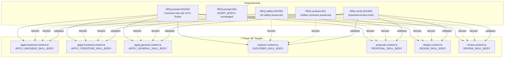

# Spec: Consolidate Documentation and ADR Guidance

## Source

- Proposal: consolidate-documentation-and-adrs proposal artifact
- Capabilities affected: developer-team-prompt-guidance (modified), developer-team-content-verification (modified), critical-git-safety (unchanged), sdd-artifact-contracts (unchanged)

## Requirements

### Capability: developer-team-prompt-guidance

REQ-prompt-001: Each of the 7 Phase 3E target SKILL_BODY exported constants MUST include a reference to the `documentation-and-adrs` skill in its `## Rules` section, placed after the existing `using-agent-skills` reference line and before any subsequent heading.
  Priority: MUST
  Surface: Data
  Rationale: Provides canonical comment/ADR/rationale guidance to all Phase 3E agents from a single source, reducing duplicated inline guidance while preserving Deck-specific contracts.

REQ-prompt-002: The `documentation-and-adrs` reference line MUST use the format: "Follow the `documentation-and-adrs` skill for comment guidance (why-vs-what, gotchas, no commented-out code) and ADR-style rationale capture."
  Priority: MUST
  Surface: Data
  Rationale: Canonical sentence ensures testable consistency across all 7 surfaces. Captures the two key overlap areas identified in the exploration: comment guidance and ADR-style rationale.

REQ-prompt-003: The 3 Apply agent SKILL_BODYs (apply-backend, apply-frontend, apply-general) MAY retain their existing concise inline comment guidance alongside the canonical `documentation-and-adrs` reference.
  Priority: MAY
  Surface: Data
  Rationale: Apply agents have domain-specific comment concerns (e.g., backend error handling, frontend accessibility); preserving concise inline rules alongside the skill reference avoids information loss.

REQ-prompt-004: None of the 7 AGENT_BODY exported constants MUST be modified.
  Priority: MUST
  Surface: Data
  Rationale: Agent bodies contain identity, scope, and boundaries only. Skill references belong in SKILL_BODY where methodology rules reside. Changing AGENT_BODYs would violate the established content surface contract.

REQ-prompt-005: The Explorer, Proposal, Design, and Review SKILL_BODYs MUST include the `documentation-and-adrs` reference in their respective contexts: Explorer for documentation discovery during investigation, Proposal for alternatives/rationale, Design for tradeoffs/decisions, and Review for documentation quality checks.
  Priority: MUST
  Surface: Data
  Rationale: Each reasoning agent has a distinct documentation surface where ADR/comment guidance applies. The reference must be present but the surrounding context determines the agent-specific emphasis.

### Capability: developer-team-content-verification

REQ-verify-001: Each target content file MUST have at least one focused test asserting the `documentation-and-adrs` skill reference is present in the exported SKILL_BODY constant.
  Priority: MUST
  Surface: General
  Rationale: Previous phases demonstrated that file-level text matching misses exported-surface regressions. Tests must assert on the actual exported constant value.

REQ-verify-002: Existing tests for AGENT_BODY constants, Git safety presence, and SDD artifact contract elements MUST continue to pass without modification.
  Priority: MUST
  Surface: General
  Rationale: Additive-only changes must not break existing test contracts. Any existing test failure is a blocker.

REQ-verify-003: Test assertions MUST verify the reference appears within the `## Rules` section of the SKILL_BODY, not merely anywhere in the file.
  Priority: SHOULD
  Surface: General
  Rationale: Ensures the reference is in the correct structural location. File-level string matching is insufficient.

### Capability: critical-git-safety

REQ-safety-001: The `GIT_DISCARD_PROTECTION_RULE` import and interpolation (`${GIT_DISCARD_PROTECTION_RULE}`) MUST remain present and unchanged in all 7 target content modules.
  Priority: MUST
  Surface: Data
  Rationale: Git discard protection is a critical safety requirement. Any regression in safety rule presence is a blocker for the entire change.

REQ-safety-002: No modification to `git-safety.ts` is permitted.
  Priority: MUST
  Surface: Data
  Rationale: The proposal explicitly scopes out git-safety.ts changes. The canonical rule source must remain untouched.

### Capability: sdd-artifact-contracts

REQ-contract-001: All existing SDD artifact templates, return format contracts, and registry persistence instructions in the 7 target files MUST remain verbatim present and unchanged.
  Priority: MUST
  Surface: Data
  Rationale: Artifact contracts are authoritative inline content. Consolidation targets only the Rules section — templates, return formats, and registry instructions are not subject to modification.

## Acceptance Scenarios

### Capability: developer-team-prompt-guidance

#### Scenario: Canonical documentation-and-adrs reference in all 7 SKILL_BODYs
**Given** the 7 target content files export SKILL_BODY constants:
  - `APPLY_BACKEND_SKILL_BODY` in apply-backend-content.ts
  - `APPLY_FRONTEND_SKILL_BODY` in apply-frontend-content.ts
  - `APPLY_GENERAL_SKILL_BODY` in apply-general-content.ts
  - `EXPLORER_SKILL_BODY` in explorer-content.ts
  - `PROPOSAL_SKILL_BODY` in proposal-content.ts
  - `DESIGN_SKILL_BODY` in design-content.ts
  - `REVIEW_SKILL_BODY` in review-content.ts
**When** each SKILL_BODY is examined
**Then** each contains the exact phrase "Follow the \`documentation-and-adrs\` skill for comment guidance" within its `## Rules` section
> Covers: REQ-prompt-001, REQ-prompt-002

#### Variant: Apply agent retains inline comment guidance
  - Given `APPLY_BACKEND_SKILL_BODY`, `APPLY_FRONTEND_SKILL_BODY`, or `APPLY_GENERAL_SKILL_BODY`
  - When the SKILL_BODY is examined
  - Then the existing concise comment guidance (if present before this change) remains alongside the new `documentation-and-adrs` reference
> Covers: REQ-prompt-003

#### Scenario: AGENT_BODY constants unchanged
**Given** the 7 target content files export AGENT_BODY constants
**When** each AGENT_BODY is compared to its pre-change content
**Then** no AGENT_BODY content has been modified
> Covers: REQ-prompt-004

#### Scenario: Reasoning agent context-specific placement
**Given** EXPLORER_SKILL_BODY, PROPOSAL_SKILL_BODY, DESIGN_SKILL_BODY, and REVIEW_SKILL_BODY
**When** each is examined
**Then** the `documentation-and-adrs` reference appears in the `## Rules` section with the canonical format
> Covers: REQ-prompt-005

### Capability: developer-team-content-verification

#### Scenario: Focused test for each SKILL_BODY surface
**Given** each of the 7 target content files has a corresponding test file
**When** the test suite runs
**Then** each test file contains at least one assertion verifying the `documentation-and-adrs` skill reference in the exported SKILL_BODY constant, and all tests pass
> Covers: REQ-verify-001

#### Scenario: Existing tests pass without modification
**Given** the existing test suite for all 7 target content files
**When** the full test suite is executed
**Then** all existing tests pass without any modification to their assertions
> Covers: REQ-verify-002

#### Scenario: Rules-section structural placement verified
**Given** a test asserting `documentation-and-adrs` presence
**When** the test extracts the `## Rules` section from the SKILL_BODY
**Then** the reference is found within that section, not elsewhere in the file
> Covers: REQ-verify-003

### Capability: critical-git-safety

#### Scenario: GIT_DISCARD_PROTECTION_RULE preserved in all targets
**Given** each of the 7 target content modules imports `GIT_DISCARD_PROTECTION_RULE` from `./git-safety`
**When** the modules are read after modification
**Then** the import statement and `${GIT_DISCARD_PROTECTION_RULE}` interpolation remain present and unchanged in all 7 files
> Covers: REQ-safety-001

#### Scenario: git-safety.ts unchanged
**Given** the current content of `git-safety.ts`
**When** compared after the change is complete
**Then** `git-safety.ts` is byte-identical to its pre-change state
> Covers: REQ-safety-002

### Capability: sdd-artifact-contracts

#### Scenario: Artifact templates preserved in all targets
**Given** each target SKILL_BODY contains SDD artifact templates (apply-progress, proposal, design, review report, etc.)
**When** the SKILL_BODYs are compared pre- and post-change
**Then** all artifact template sections, return format contracts, and registry persistence instructions are verbatim unchanged
> Covers: REQ-contract-001

## Validation Rules

| Field / Input | Rule | Error Message | REQ-ID |
|---|---|---|---|
| Canonical reference text | Must exactly match the prescribed format | "documentation-and-adrs reference does not match canonical format" | REQ-prompt-002 |
| Reference placement | Must appear within `## Rules` section after using-agent-skills line | "Reference not found in Rules section" | REQ-prompt-001 |
| AGENT_BODY content | Must be byte-identical to pre-change version | "AGENT_BODY was modified — only SKILL_BODY targets allowed" | REQ-prompt-004 |
| Git safety sentinel | GIT_SAFETY_SENTINEL must be present in all SKILL_BODYs | "Missing Git safety rule sentinel" | REQ-safety-001 |

## Error Contracts

| Condition | Error Code | Message | Status |
|---|---|---|---|
| Canonical reference missing from any SKILL_BODY | CONTENT_MISSING | "documentation-and-adrs reference not found in {file} SKILL_BODY Rules section" | blocker |
| Git safety sentinel absent after change | SAFETY_REGRESSION | "GIT_DISCARD_PROTECTION_RULE missing from {file}" | blocker |
| Existing test fails | TEST_REGRESSION | "Existing test {name} in {file} fails after change" | blocker |
| AGENT_BODY modified | CONTRACT_VIOLATION | "AGENT_BODY in {file} was modified — only SKILL_BODY changes permitted" | blocker |

## States and Transitions

> Omitted — no meaningful state lifecycle for this content-only change.

## Open Questions

- Should the canonical reference appear as a bullet point or a standalone prose line within `## Rules`? Previous consolidations (using-agent-skills, api-and-interface-design) used prose lines — this spec assumes prose line format for consistency.
- Should Explorer SKILL_BODY receive the reference only in `## Rules`, or also in the investigation methodology steps where documentation discovery is mentioned? This spec assumes `## Rules` only, matching the established pattern.

## Compliance Matrix

| REQ-ID | Scenario(s) | Status |
|---|---|---|
| REQ-prompt-001 | Canonical documentation-and-adrs reference in all 7 SKILL_BODYs | Defined |
| REQ-prompt-002 | Canonical documentation-and-adrs reference in all 7 SKILL_BODYs | Defined |
| REQ-prompt-003 | Apply agent retains inline comment guidance | Defined |
| REQ-prompt-004 | AGENT_BODY constants unchanged | Defined |
| REQ-prompt-005 | Reasoning agent context-specific placement | Defined |
| REQ-verify-001 | Focused test for each SKILL_BODY surface | Defined |
| REQ-verify-002 | Existing tests pass without modification | Defined |
| REQ-verify-003 | Rules-section structural placement verified | Defined |
| REQ-safety-001 | GIT_DISCARD_PROTECTION_RULE preserved in all targets | Defined |
| REQ-safety-002 | git-safety.ts unchanged | Defined |
| REQ-contract-001 | Artifact templates preserved in all targets | Defined |

## Mermaid Summary Source

