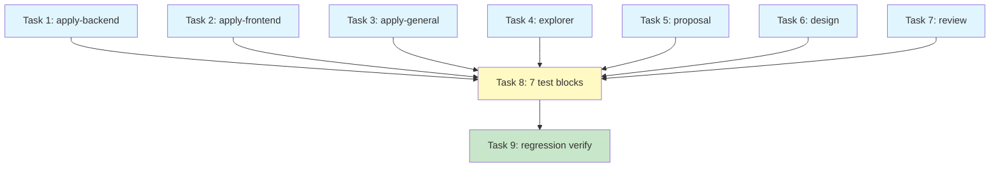

# Tasks: Consolidate Documentation and ADR Guidance

## Source

- Spec: consolidate-documentation-and-adrs spec artifact
- Design: consolidate-documentation-and-adrs design artifact
- Capabilities affected: developer-team-prompt-guidance, developer-team-content-verification, critical-git-safety, sdd-artifact-contracts

## Conflict: Canonical Sentence (Spec vs Design)

| Aspect | Spec (REQ-prompt-002) | Design (§Canonical Sentence) |
|---|---|---|
| Text | `Follow the documentation-and-adrs skill for comment guidance (why-vs-what, gotchas, no commented-out code) and ADR-style rationale capture.` | `Follow the documentation-and-adrs skill for comment guidance and ADR-style alternatives/rationale documentation.` |
| Key differences | Parenthetical examples `(why-vs-what, gotchas, no commented-out code)`; uses "rationale capture" | No parenthetical; uses "alternatives/rationale documentation" |

**Classification**: allowed-with-stub — both versions achieve the same intent. The Apply agent should use the **Spec version** (REQ-prompt-002) as authoritative unless the Orchestrator resolves otherwise. The design version was a proposal to Spec; Spec ratified a different sentence.

## Task Groups

### Group: Shared / Contracts

#### Task 1: Add canonical documentation-and-adrs line to apply-backend-content.ts
**Owner**: General Apply
**Priority**: P0
**Complexity**: Low
**Parallel**: Yes
**Depends on**: none

**Description**
Add the canonical `documentation-and-adrs` reference line to the `## Rules` section of `APPLY_BACKEND_SKILL_BODY`, placed after the existing `using-agent-skills` reference line and before any subsequent heading. Use the Spec canonical sentence (REQ-prompt-002). Preserve the existing inline comment guidance (Step 2) unchanged. Preserve `GIT_DISCARD_PROTECTION_RULE` import and interpolation unchanged.

**Files**
- `packages/core/src/teams/developer/apply-backend-content.ts` — modify

**Verification**
- `bun test packages/core/src/teams/developer/apply-backend-content.test.ts` — all tests pass
- `bun test packages/core/src/teams/developer/git-safety.test.ts` — all 24 surfaces pass

#### Task 2: Add canonical documentation-and-adrs line to apply-frontend-content.ts
**Owner**: General Apply
**Priority**: P0
**Complexity**: Low
**Parallel**: Yes
**Depends on**: none

**Description**
Add the canonical `documentation-and-adrs` reference line to the `## Rules` section of `APPLY_FRONTEND_SKILL_BODY`, same placement as Task 1. Use Spec canonical sentence. Preserve inline comment guidance. Preserve `GIT_DISCARD_PROTECTION_RULE`.

**Files**
- `packages/core/src/teams/developer/apply-frontend-content.ts` — modify

**Verification**
- `bun test packages/core/src/teams/developer/apply-frontend-content.test.ts` — all tests pass
- `bun test packages/core/src/teams/developer/git-safety.test.ts` — all 24 surfaces pass

#### Task 3: Add canonical documentation-and-adrs line to apply-general-content.ts
**Owner**: General Apply
**Priority**: P0
**Complexity**: Low
**Parallel**: Yes
**Depends on**: none

**Description**
Add the canonical `documentation-and-adrs` reference line to the `## Rules` section of `APPLY_GENERAL_SKILL_BODY`, same placement as Task 1. Use Spec canonical sentence. Preserve inline comment guidance. Preserve `GIT_DISCARD_PROTECTION_RULE`.

**Files**
- `packages/core/src/teams/developer/apply-general-content.ts` — modify

**Verification**
- `bun test packages/core/src/teams/developer/apply-general-content.test.ts` — all tests pass
- `bun test packages/core/src/teams/developer/git-safety.test.ts` — all 24 surfaces pass

#### Task 4: Add canonical documentation-and-adrs line to explorer-content.ts
**Owner**: General Apply
**Priority**: P0
**Complexity**: Low
**Parallel**: Yes
**Depends on**: none

**Description**
Add the canonical `documentation-and-adrs` reference line to the `## Rules` section of `EXPLORER_SKILL_BODY`. No inline comment rule exists for Explorer. Preserve `GIT_DISCARD_PROTECTION_RULE`.

**Files**
- `packages/core/src/teams/developer/explorer-content.ts` — modify

**Verification**
- `bun test packages/core/src/teams/developer/explorer-content.test.ts` — all tests pass
- `bun test packages/core/src/teams/developer/git-safety.test.ts` — all 24 surfaces pass

#### Task 5: Add canonical documentation-and-adrs line to proposal-content.ts
**Owner**: General Apply
**Priority**: P0
**Complexity**: Low
**Parallel**: Yes
**Depends on**: none

**Description**
Add the canonical `documentation-and-adrs` reference line to the `## Rules` section of `PROPOSAL_SKILL_BODY`. No inline comment rule exists for Proposal. Preserve alternatives table in output template. Preserve `GIT_DISCARD_PROTECTION_RULE`.

**Files**
- `packages/core/src/teams/developer/proposal-content.ts` — modify

**Verification**
- `bun test packages/core/src/teams/developer/proposal-content.test.ts` — all tests pass
- `bun test packages/core/src/teams/developer/git-safety.test.ts` — all 24 surfaces pass

#### Task 6: Add canonical documentation-and-adrs line to design-content.ts
**Owner**: General Apply
**Priority**: P0
**Complexity**: Low
**Parallel**: Yes
**Depends on**: none

**Description**
Add the canonical `documentation-and-adrs` reference line to the `## Rules` section of `DESIGN_SKILL_BODY`. No inline comment rule exists for Design. Preserve rejected-alternatives table in output template. Preserve `GIT_DISCARD_PROTECTION_RULE`.

**Files**
- `packages/core/src/teams/developer/design-content.ts` — modify

**Verification**
- `bun test packages/core/src/teams/developer/design-content.test.ts` — all tests pass
- `bun test packages/core/src/teams/developer/git-safety.test.ts` — all 24 surfaces pass

#### Task 7: Add canonical documentation-and-adrs line to review-content.ts
**Owner**: General Apply
**Priority**: P0
**Complexity**: Low
**Parallel**: Yes
**Depends on**: none

**Description**
Add the canonical `documentation-and-adrs` reference line to the `## Rules` section of `REVIEW_SKILL_BODY`. No inline comment rule exists for Review. Preserve comment check (line 151) verbatim. Preserve `GIT_DISCARD_PROTECTION_RULE`.

**Files**
- `packages/core/src/teams/developer/review-content.ts` — modify

**Verification**
- `bun test packages/core/src/teams/developer/review-content.test.ts` — all tests pass
- `bun test packages/core/src/teams/developer/git-safety.test.ts` — all 24 surfaces pass

#### Task 8: Add canonical-line tests for all 7 target modules
**Owner**: General Apply
**Priority**: P0
**Complexity**: Medium
**Parallel**: No — depends on Tasks 1-7
**Depends on**: Tasks 1, 2, 3, 4, 5, 6, 7

**Description**
Add a `describe("Documentation and ADRs canonical line", ...)` block to each of the 7 target test files, following the existing `using-agent-skills`/`cognitive-doc-design`/`api-and-interface-design` test precedent (see `apply-backend-content.test.ts` lines 150-198 for the shape). Each block asserts:
1. `SKILL_BODY` contains the canonical line exactly once.
2. `SKILL_BODY` contains no bullet variant of the canonical line.
3. `AGENT_BODY` does not contain the canonical line.
4. `SKILL_BODY` preserves the `## Rules` heading.
5. `SKILL_BODY` canonical line is distinct from existing `using-agent-skills`, `cognitive-doc-design`, `api-and-interface-design`, and `code-review-and-quality` canonical lines.

**Files**
- `packages/core/src/teams/developer/apply-backend-content.test.ts` — modify
- `packages/core/src/teams/developer/apply-frontend-content.test.ts` — modify
- `packages/core/src/teams/developer/apply-general-content.test.ts` — modify
- `packages/core/src/teams/developer/explorer-content.test.ts` — modify
- `packages/core/src/teams/developer/proposal-content.test.ts` — modify
- `packages/core/src/teams/developer/design-content.test.ts` — modify
- `packages/core/src/teams/developer/review-content.test.ts` — modify

**Verification**
- `bun test packages/core/src/teams/developer/` — all tests pass (existing + new)
- Verify no existing test assertions were modified

#### Task 9: Full regression verification
**Owner**: General Apply
**Priority**: P0
**Complexity**: Low
**Parallel**: No — depends on Tasks 1-8
**Depends on**: Tasks 1, 2, 3, 4, 5, 6, 7, 8

**Description**
Run the full developer team test suite and git-safety test suite to confirm:
- All 7 content module tests pass (existing + new canonical-line tests)
- `git-safety.test.ts` passes all 24 surfaces + dynamic discovery
- No `AGENT_BODY` was modified in any target (immutability check)
- No `git-safety.ts` was modified (invariant check)
- No artifact templates or return format contracts were modified

**Files**
- No file changes — verification only

**Verification**
- `bun test packages/core/src/teams/developer/` — zero failures
- `git diff --stat packages/core/src/teams/developer/git-safety.ts` — empty (no changes)
- Manual grep: `AGENT_BODY` exports are byte-identical to pre-change state

## Dependency Graph

```
Tasks 1-7 (content modules, all parallel)
  └─→ Task 8 (test blocks)
       └─→ Task 9 (regression verification)
```

## Parallelization Plan

| Phase | Tasks | Can Run in Parallel |
|---|---|---|
| Content Edits | 1, 2, 3, 4, 5, 6, 7 | Yes — all 7 are independent file edits |
| Test Authoring | 8 | No — depends on all content edits being correct |
| Verification | 9 | No — depends on all tests existing |

## Responsibility Contracts

| Contract / Boundary | Owner | Consumers | Notes |
|---|---|---|---|
| Canonical sentence text (REQ-prompt-002) | Spec (authoritative) | Tasks 1-7, Task 8 | Spec sentence is authoritative over Design-proposed sentence; Apply agents use Spec version |
| AGENT_BODY immutability | Task 8 (test assertion) | All Tasks 1-7 | No AGENT_BODY may be modified; Task 8 asserts this |
| git-safety.ts invariance | Task 9 (verification) | All Tasks 1-7 | `git-safety.ts` and `git-safety.test.ts` must not be touched |
| Inline comment rule preservation (Apply agents) | Tasks 1, 2, 3 | Task 8 | Apply agent Step 2 inline rules must remain verbatim |

## Complexity Summary

| Complexity | Count | Task Numbers |
|---|---|---|
| Low | 8 | 1, 2, 3, 4, 5, 6, 7, 9 |
| Medium | 1 | 8 |
| High | 0 | — |

## Flagged for Splitting

None — all tasks are small enough for one session.

## Review Workload Forecast

| Signal | Value |
|---|---|
| Estimated changed lines | 100-400 |
| 400-line budget risk | Low |
| Scope reduction recommended | No |
| Sequential work slices recommended | No |
| Decision needed before Apply | Yes — canonical sentence conflict (Spec vs Design) must be resolved |

**Rationale**: Tasks 1-7 are mechanical single-line insertions into 7 parallel files (~7 lines changed in content). Task 8 adds ~35-50 lines per test file (7 files × ~7 lines per describe block = ~49 lines of new test code). Total estimated: ~56 lines of content changes + ~49 lines of test code ≈ 105 lines net new, well under 400. Risk is low. The only decision needed is the canonical sentence conflict resolution between Spec REQ-prompt-002 and the Design-proposed sentence.

## Open Questions / Blockers

### OQ-1: Canonical Sentence Conflict (allowed-with-stub)
- **Classification**: allowed-with-stub — Apply agent can proceed using Spec REQ-prompt-002 version while awaiting Orchestrator resolution.
- **Details**: Spec mandates `Follow the documentation-and-adrs skill for comment guidance (why-vs-what, gotchas, no commented-out code) and ADR-style rationale capture.`; Design proposes `Follow the documentation-and-adrs skill for comment guidance and ADR-style alternatives/rationale documentation.`
- **Recommendation**: Use Spec version (REQ-prompt-002). If Orchestrator resolves to Design version, Apply agent updates the sentence in all 7 targets (trivial find-replace).

### OQ-2: Spec/Design Registry Not Updated (non-blocking)
- **Classification**: non-blocking — registry was left at phase `proposal`; spec.md and design.md exist on disk but state.yaml hasn't recorded them.
- **Details**: The current state.yaml shows `phase: proposal, status: completed` and events.yaml has no spec.completed or design.completed entries. This Task phase will update the registry to include all missing phases (spec, design, tasks).

> No implementation-blocking issues. Tasks are ready for Apply.

## Mermaid Summary Source


