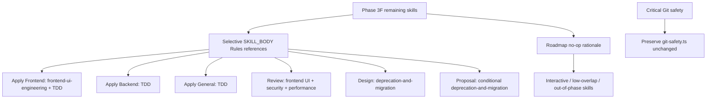

# Design: Consolidate Remaining Skill Guidance

## Source

- Proposal: `consolidate-remaining-skill-guidance` proposal artifact
- Capabilities affected: `developer-team-skill-guidance`; unchanged `openspec-registry`, `critical-git-safety`, `standalone-external-skills`
- Spec status: not yet available
- Registry mode: deferred — write `design.md` only

## Current Architecture Context

- Developer Team prompt content lives in `packages/core/src/teams/developer/*-content.ts`.
- Each agent content module exposes two prompt surfaces:
  - `*_AGENT_BODY`: thin identity/boundaries/instructions/return contract.
  - `*_SKILL_BODY`: detailed methodology, output templates, phase persistence, and `## Rules`.
- Prior consolidation phases use canonical, unbulleted SKILL_BODY Rules lines and structural tests:
  - `Follow the using-agent-skills skill for operating behaviors and failure mode guidance.`
  - `Follow the cognitive-doc-design skill for artifact structure and documentation patterns.`
  - `Follow the api-and-interface-design skill for stable API and interface design guidance.`
  - `Follow the \`documentation-and-adrs\` skill for comment guidance (why-vs-what, gotchas, no commented-out code) and ADR-style rationale capture.`
- Review also contains an existing `code-review-and-quality` reference in review methodology and tests.
- Critical Git Discard Protection is centralized in `packages/core/src/teams/developer/git-safety.ts` and injected into Developer Team agent/skill bodies; this change must not edit or weaken it.
- `docs/skills-integration-roadmap.md` has Phase 3F skill targets but lacks the final selective no-op rationale from exploration.

## Proposed Architecture

Use selective SKILL_BODY Rules references only. Do not edit AGENT_BODY surfaces. Do not replace SDD-specific templates, registry instructions, phase contracts, return formats, Serena Enforcement sections, or Git discard protection. Add exact canonical lines to target Rules blocks and add tests that prove each line appears exactly once, is not bullet-wrapped, and does not appear in AGENT_BODY unless already intentionally present from older phases.

### Component / Module Boundaries

| Component | Responsibility | Change Type |
|---|---|---|
| `apply-backend-content.ts` | Backend implementation prompt; test guidance | modified |
| `apply-frontend-content.ts` | Frontend implementation prompt; UI/accessibility/test guidance | modified |
| `apply-general-content.ts` | Shared/cross-cutting implementation prompt; unit test guidance | modified |
| `review-content.ts` | Engineering quality review prompt | modified |
| `design-content.ts` | Architecture design prompt; migration/backward compatibility section | modified |
| `proposal-content.ts` | Proposal prompt; conditional migration/removal framing | modified |
| `*-content.test.ts` for affected modules | Structural prompt-contract tests | modified |
| `docs/skills-integration-roadmap.md` | Roadmap rationale and no-op documentation | modified |
| `git-safety.ts` / `git-safety.test.ts` | Central destructive Git safety contract | unchanged |

### Data Flow

1. Content modules define prompt template strings.
2. Installer/registry consumes content exports to generate Developer Team agent/skill files.
3. Runtime injects project/package context around these stable prompt bodies.
4. Structural tests import content exports and assert exact prompt invariants.
5. Roadmap documentation records final no-op rationale for skills intentionally not referenced.

### API / Contract Implications

| Endpoint / Interface | Change | Backward Compatible |
|---|---|---|
| `APPLY_BACKEND_SKILL_BODY` | Add TDD canonical Rules line | yes |
| `APPLY_FRONTEND_SKILL_BODY` | Add frontend-ui-engineering + TDD canonical Rules lines | yes |
| `APPLY_GENERAL_SKILL_BODY` | Add TDD canonical Rules line | yes |
| `REVIEW_SKILL_BODY` | Add frontend-ui-engineering + security-and-hardening + performance-optimization canonical Rules lines | yes |
| `DESIGN_SKILL_BODY` | Add deprecation-and-migration canonical Rules line | yes |
| `PROPOSAL_SKILL_BODY` | Add conditional deprecation-and-migration Rules note | yes |
| `*_AGENT_BODY` | No change | yes |

### State / Persistence Implications

None. Prompt content and tests only. OpenSpec registry write is deferred by orchestrator instruction.

### Migration / Backward Compatibility

- No runtime migration.
- Prompt change is additive and backward-compatible.
- Preserve prior Phase 3A–3E canonical lines and tests.
- Preserve `Serena Enforcement` sections in apply skill bodies.
- Preserve all critical Git safety surfaces byte/semantics; do not touch `git-safety.ts` unless tests reveal an unrelated pre-existing issue.

## Exact Prompt Edit Matrix

Add these exact lines inside each target `*_SKILL_BODY` `## Rules` block, adjacent to existing canonical skill lines. Do not prefix with `-`, indentation, or markdown bullets.

| Skill | Action | Agents affected | Placement in `SKILL_BODY ## Rules` | Exact line | Tests |
|---|---|---|---|---|---|
| `frontend-ui-engineering` | add | Apply Frontend, Review | After existing generic/canonical skill refs; before safety/Serena-specific prose if present | `Follow the frontend-ui-engineering skill for production-quality UI/component, state, accessibility, responsive, loading/error/empty-state, and frontend quality guidance.` | `apply-frontend-content.test.ts`, `review-content.test.ts`: exact once; no bullet variants; absent from AGENT_BODY |
| `test-driven-development` | add | Apply Backend, Apply Frontend, Apply General | In each Apply `## Rules` block after existing canonical skill refs | `Follow the test-driven-development skill for RED-GREEN-REFACTOR, Prove-It testing, test pyramid, and real-over-mocks guidance when authoring or changing tests.` | `apply-backend-content.test.ts`, `apply-frontend-content.test.ts`, `apply-general-content.test.ts`: exact once; no bullet variants; absent from AGENT_BODY |
| `debugging-and-error-recovery` | no-op | Verify targeted by roadmap; Apply agents possible future target | None | None | No prompt test; roadmap no-op section documents Verify reports failures instead of debugging |
| `security-and-hardening` | add | Review | In Review `## Rules` block near quality/review skill refs | `Follow the security-and-hardening skill for security review of input validation, auth, secrets, injection, exposure, and external integration risks.` | `review-content.test.ts`: exact once; no bullet variants; absent from AGENT_BODY |
| `performance-optimization` | add | Review | In Review `## Rules` block near quality/review skill refs | `Follow the performance-optimization skill for performance review of scalability, Core Web Vitals, load behavior, data access, bundle size, and latency risks.` | `review-content.test.ts`: exact once; no bullet variants; absent from AGENT_BODY |
| `deprecation-and-migration` | add/keep | Design add; Proposal conditional keep/add | Design Rules: add always. Proposal Rules: add conditional note only. | Design: `Follow the deprecation-and-migration skill for migration, replacement, removal, rollout, rollback, and backward-compatibility design decisions.` Proposal: `For proposals involving replacement, removal, or migration of existing systems, follow the deprecation-and-migration skill for deprecation strategy and migration planning.` | `design-content.test.ts`, `proposal-content.test.ts`: exact once; no bullet variants; absent from AGENT_BODY |
| `idea-refine` | no-op | Explorer roadmap target | None | None | Roadmap no-op section documents interactive-dialogue mismatch |
| `interview-me` | no-op | Explorer, Proposal, Spec roadmap targets | None | None | Roadmap no-op section documents autonomous-agent mismatch; agents should flag vagueness via existing blockers |
| `git-workflow-and-versioning` | keep/no-op | Orchestrator advisory git suggestions | None | None | No prompt test; preserve existing critical Git safety tests; roadmap documents execution-guidance mismatch |
| `doubt-driven-development` | keep/no-op | Orchestrator, Review possible overlap | None | None | Roadmap documents in-flight adversarial review mismatch with post-hoc Review/orchestrator invariants |
| `ci-cd-and-automation` | no-op | None | None | None | Roadmap documents no SDD prompt redundancy |
| `code-simplification` | no-op | None | None | None | Roadmap documents task-context-specific refactor skill, not baseline Apply behavior |
| `comment-writer` | no-op | None | None | None | Roadmap documents human-facing comment scope mismatch |
| `shipping-and-launch` | no-op | None | None | None | Roadmap documents post-SDD operational phase mismatch |
| `judgment-day` | no-op | None | None | None | Roadmap documents standalone dual-review workflow; no consolidation needed |

## No-op Documentation Section

Add a section to `docs/skills-integration-roadmap.md` under Phase 3F, or alternatively append a small no-op rationale section to this change artifact if roadmap edits are deferred by Task. Preferred roadmap section title:

```md
#### Phase 3F selective no-op decisions

The following skills are intentionally not referenced in Developer Team prompt bodies for this phase. They are either interactive/main-session skills, operational phases outside SDD, execution guidance for future task contexts, or low-overlap with autonomous SDD agents.

| Skill | Decision | Rationale |
|---|---|---|
| `debugging-and-error-recovery` | No-op | Verify reports failures; Apply debugging guidance can be revisited in a future Apply-focused phase. |
| `idea-refine` | No-op | Interactive user-dialogue workflow is incompatible with autonomous Explorer delegation. |
| `interview-me` | No-op | Requires live one-question-at-a-time interview; autonomous agents should flag blockers instead. |
| `git-workflow-and-versioning` | Keep inline/no-op | Orchestrator git suggestions are advisory; critical Git discard protection remains centralized. |
| `doubt-driven-development` | Keep inline/no-op | In-flight adversarial review does not replace post-hoc Review or Deck orchestrator invariants. |
| `ci-cd-and-automation` | No-op | CI/CD setup is outside current Developer Team prompt redundancy. |
| `code-simplification` | No-op | Applies to explicit refactor/simplification tasks, not baseline implementation guidance. |
| `comment-writer` | No-op | Human-facing collaboration comments are outside structured SDD artifacts. |
| `shipping-and-launch` | No-op | Launch operations occur after SDD Archive. |
| `judgment-day` | No-op | Unique standalone dual-review workflow; no prompt consolidation needed. |
```

## File Impact Estimate

| File / Path | Action | Rationale |
|---|---|---|
| `packages/core/src/teams/developer/apply-backend-content.ts` | modify | Add TDD canonical Rules line |
| `packages/core/src/teams/developer/apply-frontend-content.ts` | modify | Add frontend UI + TDD canonical Rules lines |
| `packages/core/src/teams/developer/apply-general-content.ts` | modify | Add TDD canonical Rules line |
| `packages/core/src/teams/developer/review-content.ts` | modify | Add frontend UI, security, performance canonical Rules lines |
| `packages/core/src/teams/developer/design-content.ts` | modify | Add deprecation/migration canonical Rules line |
| `packages/core/src/teams/developer/proposal-content.ts` | modify | Add conditional deprecation/migration Rules note |
| `packages/core/src/teams/developer/apply-backend-content.test.ts` | modify | Assert TDD line invariants |
| `packages/core/src/teams/developer/apply-frontend-content.test.ts` | modify | Assert frontend UI + TDD line invariants |
| `packages/core/src/teams/developer/apply-general-content.test.ts` | modify | Assert TDD line invariants |
| `packages/core/src/teams/developer/review-content.test.ts` | modify | Assert frontend UI, security, performance line invariants |
| `packages/core/src/teams/developer/design-content.test.ts` | modify | Assert deprecation/migration line invariants |
| `packages/core/src/teams/developer/proposal-content.test.ts` | modify | Assert conditional deprecation/migration line invariants |
| `docs/skills-integration-roadmap.md` | modify | Add final Phase 3F no-op rationale section |
| `packages/core/src/teams/developer/git-safety.ts` | unchanged | Preserve centralized critical Git discard protection |
| `packages/core/src/teams/developer/git-safety.test.ts` | unchanged | Existing safety tests remain authoritative |

## Testing Strategy

- Focused structural tests per affected prompt module:
  - exact canonical line appears once in target `*_SKILL_BODY`.
  - no bullet-wrapped variants: e.g. not `- ${LINE}` and not indented bullet forms.
  - target line absent from corresponding `*_AGENT_BODY`.
  - existing prior Phase 3A–3E canonical-line tests still pass.
- Add no-op documentation assertion only if existing docs tests cover roadmap text; otherwise rely on roadmap artifact review.
- Run targeted Developer Team suite: `bun test packages/core/src/teams/developer/`.
- If repo-wide `tsc --noEmit` or broad tests fail due known unrelated issues, report as unrelated; do not hide affected-file failures.

## Observability / Error Handling

None beyond test failure clarity. This is static prompt/test documentation.

## Security / Performance / Accessibility Considerations

- Security: add Review reference to `security-and-hardening`; do not alter critical Git discard protection.
- Performance: add Review reference to `performance-optimization`.
- Accessibility: add Apply Frontend and Review reference to `frontend-ui-engineering` for WCAG/UI quality guidance.

## Tradeoffs

| Decision | Chosen | Rejected Alternative | Rationale |
|---|---|---|---|
| Consolidation scope | Selective references | Blanket references to all roadmap skills | Avoids dead guidance and interactive-skill mismatch |
| Prompt surface | SKILL_BODY Rules only | Edit AGENT_BODY too | Preserves thin identity surfaces and prior immutability pattern |
| Existing SDD contracts | Keep inline | Replace templates/contracts with skill refs | External skills are methodology sources, not SDD artifact contracts |
| No-op rationale | Roadmap section | Silent omission | Makes non-actions reviewable and prevents future mechanical additions |
| Git safety | Preserve centralized rule unchanged | Reword or move safety text | Safety is critical, cross-cutting, and already tested centrally |

## Risks

| Risk | Likelihood | Impact | Mitigation |
|---|---|---|---|
| Prompt bloat | Medium | Medium | Add only matrix-approved lines; document no-ops |
| Contract dilution | Low | High | Do not remove templates, registry rules, return contracts, or Git safety |
| Test fragility from exact strings | Medium | Medium | Use constants in tests; assert exact once/no bullet variants |
| Backtick syntax break in template literals | Medium | High | Avoid raw unescaped backticks in TypeScript template strings; canonical new lines mostly avoid backticks except existing docs line |
| Misplaced debugging/git workflow guidance | Medium | Medium | Keep no-op now; future phase can target Apply/git execution explicitly |

## Open Decisions

- Whether a future Apply-agent phase should reference `debugging-and-error-recovery` after failures; out of scope here.
- Whether future Apply agents should receive `git-workflow-and-versioning`; out of scope here and must not replace critical Git safety.

## Dependencies

- Prior Phase 3A–3E references remain intact.
- Existing external standalone skills are installed/available.
- Registry write is deferred to Orchestrator for this phase.

## Next Steps

Ready for Task (`deck-developer-task`) to break this design into implementation tasks, combined with Spec.

## Mermaid Summary Source


