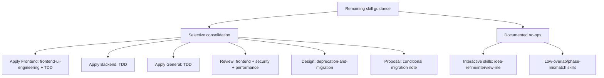

# Proposal: Consolidate Remaining Skill Guidance

## Intent

Developer Team prompts still duplicate or under-reference several standalone external skills after Phases 3A–3E. The change should selectively consolidate remaining high-overlap guidance while preserving SDD agent identity, artifact contracts, registry behavior, and explicit no-op rationale for low-overlap or interactive skills.

## Goal

Add only useful remaining external-skill references to Developer Team agent guidance, with tests proving canonical references and documented no-op decisions for mismatched skills.

## Scope

### In Scope
- Add canonical skill references for high-overlap targets identified by exploration:
  - `frontend-ui-engineering`: Apply Frontend, Review
  - `test-driven-development`: Apply Backend, Apply Frontend, Apply General
  - `security-and-hardening`: Review
  - `performance-optimization`: Review
  - `deprecation-and-migration`: Design; conditional Proposal note for replacement/removal changes
- Preserve all artifact-specific templates, return contracts, registry rules, Git discard protection, and prior Phase 3A–3E references.
- Add/update structural tests that assert exact canonical reference presence once in target surfaces.
- Document no-op rationale in the implementation/design notes or tests for low-overlap and interactive skills:
  - `debugging-and-error-recovery`, `idea-refine`, `interview-me`, `git-workflow-and-versioning`, `doubt-driven-development`, `ci-cd-and-automation`, `code-simplification`, `comment-writer`, `shipping-and-launch`, `judgment-day`.

### Out of Scope
- Mechanical references to every roadmap-listed target.
- Removing or weakening Deck-specific SDD contracts, output templates, or registry behavior.
- Rewriting external skill content.
- Changing product/runtime behavior outside Developer Team prompt content and related tests.
- Solving unrelated typecheck/build failures.

## Affected Capabilities

### New Capabilities
- None.

### Modified Capabilities
- `developer-team-skill-guidance`: Developer Team prompt content gains selective references to remaining applicable external skills while preserving SDD contracts.

### Unchanged Capabilities
- `openspec-registry`: Registry file behavior remains unchanged; this change only records phase artifacts.
- `critical-git-safety`: Destructive Git discard protection remains centralized and non-negotiable.
- `standalone-external-skills`: External skill installation/bundling remains unchanged.

## Approach

Use the Explorer matrix as the source of truth. Implement selective consolidation only where overlap is substantial and the agent can use the skill autonomously. Keep inline SDD-specific contracts intact. For no-op skills, preserve explicit rationale rather than adding dead references.

## Alternatives and Tradeoffs

| Alternative | Why Considered | Why Not Chosen |
|---|---|---|
| Mechanical blanket references | Simple and follows roadmap targets literally. | Violates quality requirement; adds dead guidance for interactive/low-overlap skills and bloats prompts. |
| No-op all remaining skills | Lowest risk. | Misses clear consolidation opportunities for frontend, TDD, security, performance, and migration guidance. |
| Selective consolidation | Matches exploration recommendation and quality requirement. | Requires careful tests and documented no-op rationale. |

## Risks

| Risk | Likelihood | Mitigation |
|---|---|---|
| Prompt bloat from over-referencing | Medium | Add only matrix-approved references; document no-ops. |
| Contract dilution | Medium | Preserve output templates, return contracts, registry rules, Git safety, and prior phase references. |
| Interactive skill mismatch | Medium | Do not reference `idea-refine` or `interview-me` in autonomous agent bodies; document rationale. |
| Structural test fragility | Medium | Assert exact canonical lines once; avoid bullet-wrapped or mechanically duplicated references. |
| Unrelated verification failures | Low | Use targeted Developer Team tests; report unrelated repo-wide failures separately. |

## Rollback Plan

Revert the modified Developer Team content files and their corresponding tests for this change. Remove only the added canonical reference lines/no-op assertions introduced by this change; leave prior 3A–3E references and centralized Git safety untouched. Registry rollback is normal OpenSpec archive/revert handling, not product-code rollback.

## Dependencies

- Existing standalone external skills are available from prior installation work.
- Prior Phase 3A–3E references remain present and must not be removed.
- `docs/skills-integration-roadmap.md` and `exploration.md` remain the rationale sources.

## Open Questions

- Should the Task Agent receive a future, explicit TDD routing note, or should TDD remain Apply-agent-only as proposed here?
- Should git workflow guidance be considered in a future Apply-agent-specific phase, despite being no-op for this roadmap scope?

## Acceptance Direction

- [ ] Target Developer Team content files contain each approved canonical skill reference exactly once.
- [ ] No interactive-only or low-overlap skills are mechanically referenced; their no-op rationale is documented.
- [ ] Artifact templates, return contracts, registry behavior, prior Phase 3A–3E references, and critical Git safety remain intact.
- [ ] Focused Developer Team tests pass, especially structural tests for canonical references.
- [ ] Any unrelated build/typecheck failures are identified as unrelated rather than hidden.

## Next Steps

Ready for Spec (`deck-developer-spec`) and Design (`deck-developer-design`) in parallel.

## Mermaid Summary Source

