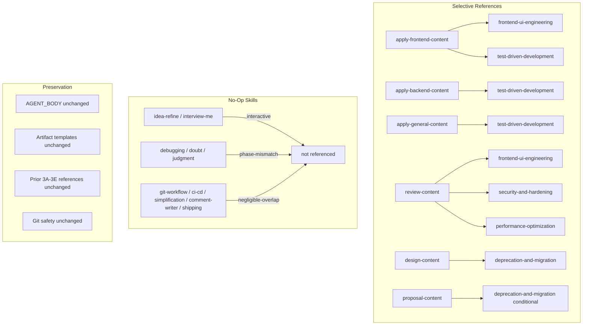

# Spec: Consolidate Remaining Skill Guidance

## Source

- Proposal: `consolidate-remaining-skill-guidance` proposal artifact
- Exploration: `exploration.md` per-skill/per-agent consolidation matrix
- Capabilities affected: `developer-team-skill-guidance` (modified)

## Requirements

### Capability: selective-skill-reference

REQ-sel-001: `APPLY_FRONTEND_SKILL_BODY` MUST include a canonical reference to `frontend-ui-engineering` in its `## Rules` section, placed after the existing `documentation-and-adrs` line.
  Priority: MUST
  Surface: Data
  Rationale: High overlap — skill provides canonical component architecture, accessibility (WCAG 2.1 AA), responsive design, loading patterns. Agent's inline guidance is thin per exploration matrix.

REQ-sel-002: `REVIEW_SKILL_BODY` MUST include a canonical reference to `frontend-ui-engineering` in its `## Rules` section, placed alongside the Frontend Best Practices dimension or after existing skill reference lines.
  Priority: MUST
  Surface: Data
  Rationale: High overlap — review's Frontend Best Practices dimension covers accessibility, state, performance, component design. Skill provides deeper methodology per exploration matrix.

REQ-sel-003: `APPLY_BACKEND_SKILL_BODY` MUST include a canonical reference to `test-driven-development` in its `## Rules` section, placed after the existing `documentation-and-adrs` line.
  Priority: MUST
  Surface: Data
  Rationale: High overlap — Apply agents implement code and must follow TDD methodology. Skill provides canonical red-green-refactor, test-first patterns.

REQ-sel-004: `APPLY_FRONTEND_SKILL_BODY` MUST include a canonical reference to `test-driven-development` in its `## Rules` section, placed after the `frontend-ui-engineering` line.
  Priority: MUST
  Surface: Data
  Rationale: Same as REQ-sel-003 — frontend implementation benefits from TDD methodology.

REQ-sel-005: `APPLY_GENERAL_SKILL_BODY` MUST include a canonical reference to `test-driven-development` in its `## Rules` section, placed after the existing `documentation-and-adrs` line.
  Priority: MUST
  Surface: Data
  Rationale: Same as REQ-sel-003 — general implementation benefits from TDD methodology.

REQ-sel-006: `REVIEW_SKILL_BODY` MUST include a canonical reference to `security-and-hardening` in its `## Rules` section, placed after existing skill reference lines.
  Priority: MUST
  Surface: Data
  Rationale: High overlap — review's Security dimension assesses vulnerability handling. Skill provides canonical input validation, auth, injection prevention methodology.

REQ-sel-007: `REVIEW_SKILL_BODY` MUST include a canonical reference to `performance-optimization` in its `## Rules` section, placed after existing skill reference lines.
  Priority: MUST
  Surface: Data
  Rationale: High overlap — review's Scalability and Frontend dimensions assess performance. Skill provides canonical profiling, bottleneck identification, load-time methodology.

REQ-sel-008: `DESIGN_SKILL_BODY` MUST include a canonical reference to `deprecation-and-migration` in its `## Rules` section, placed after the existing `documentation-and-adrs` line.
  Priority: MUST
  Surface: Data
  Rationale: High overlap — Design agent defines migration strategy, backward compatibility, versioning. Skill provides canonical deprecation lifecycle, user migration, sunset methodology.

REQ-sel-009: `PROPOSAL_SKILL_BODY` SHOULD include a conditional reference to `deprecation-and-migration` noting it applies only for replacement/removal type changes.
  Priority: SHOULD
  Surface: Data
  Rationale: Conditional overlap — proposals for replacement/removal changes benefit from deprecation rationale, but not all proposals involve migration.

### Capability: no-op-documentation

REQ-noop-001: Each of the following skills MUST NOT be referenced in any Developer Team content file, and the rationale for exclusion MUST be documented in a code comment or test description block: `debugging-and-error-recovery`, `idea-refine`, `interview-me`, `git-workflow-and-versioning`, `doubt-driven-development`, `ci-cd-and-automation`, `code-simplification`, `comment-writer`, `shipping-and-launch`, `judgment-day`.
  Priority: MUST
  Surface: Data
  Rationale: These skills are either interactive (require user conversation), phase-mismatched (not applicable during construction/review), or have negligible overlap with autonomous agent work. Mechanical references would bloat prompts with dead guidance.

REQ-noop-002: The no-op rationale for each excluded skill MUST state the specific reason: interactive (requires user interaction), phase-mismatch (not applicable to agent's phase), or negligible-overlap (skill scope does not overlap with agent's responsibilities).
  Priority: MUST
  Surface: Data
  Rationale: Explicit rationale prevents future mechanical re-addition and provides auditable decision trail.

### Capability: contract-preservation

REQ-con-001: All existing AGENT_BODY exported constants in the 6 target files MUST remain verbatim unchanged.
  Priority: MUST
  Surface: Data
  Rationale: Agent bodies contain identity, scope, and boundaries only. Skill references belong in SKILL_BODY per established content surface contract (Phase 3E precedent).

REQ-con-002: All existing SDD artifact templates, return format contracts, and registry persistence instructions in the 6 target files MUST remain verbatim present and unchanged.
  Priority: MUST
  Surface: Data
  Rationale: Artifact contracts are authoritative inline content. Consolidation targets only the Rules section — templates, return formats, and registry instructions are not subject to modification.

REQ-con-003: All prior Phase 3A–3E skill references (`using-agent-skills`, `cognitive-doc-design`, `code-review-and-quality`, `api-and-interface-design`, `documentation-and-adrs`) MUST remain present and unchanged in their respective content files.
  Priority: MUST
  Surface: Data
  Rationale: Prior phase references are established and tested. Removing or weakening them violates prior phase contracts.

REQ-con-004: The `CRITICAL_SAFETY_RULE — Git Discard Protection` section and `git-safety.ts` MUST remain unchanged.
  Priority: MUST
  Surface: Security
  Rationale: Centralized Git safety is non-negotiable and not subject to consolidation.

### Capability: structural-verification

REQ-ver-001: For each target SKILL_BODY surface receiving a new reference, a focused test MUST assert that the canonical reference line appears exactly once and contains no bullet-wrapped or mechanically duplicated variants.
  Priority: MUST
  Surface: General
  Rationale: Prevents reference drift and ensures structural consistency with prior phase test patterns.

REQ-ver-002: For each target AGENT_BODY, a test MUST assert that the new skill reference does NOT appear in the AGENT_BODY constant (immutability guard).
  Priority: MUST
  Surface: General
  Rationale: AGENT_BODY immutability is a standing contract from Phase 3E.

REQ-ver-003: A test or documented test description MUST assert that each of the 10 no-op skills does not appear as a reference in any target SKILL_BODY or AGENT_BODY, alongside the documented rationale.
  Priority: MUST
  Surface: General
  Rationale: Prevents accidental mechanical addition of excluded skills and verifies no-op documentation.

REQ-ver-004: All existing tests in the 6 target test files MUST continue to pass without modification.
  Priority: MUST
  Surface: General
  Rationale: Existing tests guard prior phase contracts. New references must not break established test assertions.

## Acceptance Scenarios

### Capability: selective-skill-reference

#### Scenario: Apply Frontend gains frontend-ui-engineering reference
**Given** `APPLY_FRONTEND_SKILL_BODY` currently references `using-agent-skills` and `documentation-and-adrs`
**When** the canonical `frontend-ui-engineering` reference line is added to `## Rules`
**Then** `APPLY_FRONTEND_SKILL_BODY` contains exactly one line referencing `frontend-ui-engineering`, placed after `documentation-and-adrs`, and `APPLY_FRONTEND_AGENT_BODY` is unchanged
> Covers: REQ-sel-001, REQ-con-001

#### Scenario: Review gains frontend-ui-engineering reference
**Given** `REVIEW_SKILL_BODY` contains a Frontend Best Practices dimension and existing skill references
**When** the canonical `frontend-ui-engineering` reference line is added to `## Rules`
**Then** `REVIEW_SKILL_BODY` contains exactly one line referencing `frontend-ui-engineering`, and `REVIEW_AGENT_BODY` is unchanged
> Covers: REQ-sel-002, REQ-con-001

#### Scenario: Apply Backend gains test-driven-development reference
**Given** `APPLY_BACKEND_SKILL_BODY` currently references `using-agent-skills`, `api-and-interface-design`, and `documentation-and-adrs`
**When** the canonical `test-driven-development` reference line is added to `## Rules`
**Then** `APPLY_BACKEND_SKILL_BODY` contains exactly one line referencing `test-driven-development`, and `APPLY_BACKEND_AGENT_BODY` is unchanged
> Covers: REQ-sel-003, REQ-con-001

#### Scenario: Apply Frontend gains test-driven-development reference
**Given** `APPLY_FRONTEND_SKILL_BODY` has the new `frontend-ui-engineering` reference
**When** the canonical `test-driven-development` reference line is added after it
**Then** `APPLY_FRONTEND_SKILL_BODY` contains exactly one line referencing `test-driven-development`, placed after `frontend-ui-engineering`
> Covers: REQ-sel-004

#### Scenario: Apply General gains test-driven-development reference
**Given** `APPLY_GENERAL_SKILL_BODY` currently references `using-agent-skills`, `api-and-interface-design`, and `documentation-and-adrs`
**When** the canonical `test-driven-development` reference line is added to `## Rules`
**Then** `APPLY_GENERAL_SKILL_BODY` contains exactly one line referencing `test-driven-development`, and `APPLY_GENERAL_AGENT_BODY` is unchanged
> Covers: REQ-sel-005, REQ-con-001

#### Scenario: Review gains security-and-hardening reference
**Given** `REVIEW_SKILL_BODY` contains a Security dimension and existing skill references
**When** the canonical `security-and-hardening` reference line is added to `## Rules`
**Then** `REVIEW_SKILL_BODY` contains exactly one line referencing `security-and-hardening`
> Covers: REQ-sel-006

#### Scenario: Review gains performance-optimization reference
**Given** `REVIEW_SKILL_BODY` has the new `security-and-hardening` reference
**When** the canonical `performance-optimization` reference line is added to `## Rules`
**Then** `REVIEW_SKILL_BODY` contains exactly one line referencing `performance-optimization`
> Covers: REQ-sel-007

#### Scenario: Design gains deprecation-and-migration reference
**Given** `DESIGN_SKILL_BODY` currently references `using-agent-skills`, `cognitive-doc-design`, `api-and-interface-design`, and `documentation-and-adrs`
**When** the canonical `deprecation-and-migration` reference line is added to `## Rules`
**Then** `DESIGN_SKILL_BODY` contains exactly one line referencing `deprecation-and-migration`, and `DESIGN_AGENT_BODY` is unchanged
> Covers: REQ-sel-008, REQ-con-001

#### Scenario: Proposal gains conditional deprecation-and-migration reference
**Given** `PROPOSAL_SKILL_BODY` currently references `using-agent-skills`, `cognitive-doc-design`, and `documentation-and-adrs`
**When** the conditional `deprecation-and-migration` reference is added noting it applies for replacement/removal changes
**Then** `PROPOSAL_SKILL_BODY` contains exactly one line referencing `deprecation-and-migration` with the conditional qualifier
> Covers: REQ-sel-009

### Capability: no-op-documentation

#### Scenario: No-op skills are not referenced and rationale is documented
**Given** the 10 no-op skills are identified in the proposal
**When** the implementation is complete
**Then** none of the 10 no-op skills appear as references in any target SKILL_BODY or AGENT_BODY, and each excluded skill has a documented rationale (interactive, phase-mismatch, or negligible-overlap) in the codebase
> Covers: REQ-noop-001, REQ-noop-002

#### Variant: Interactive skills excluded
- Given `idea-refine` and `interview-me` require user interaction
- When consolidation is implemented
- Then neither appears in any content file; rationale documents "interactive"

#### Variant: Phase-mismatch skills excluded
- Given `debugging-and-error-recovery`, `doubt-driven-development`, `judgment-day` are adversarial/debugging tools not applicable to autonomous construction/review
- When consolidation is implemented
- Then none appears in any content file; rationale documents "phase-mismatch"

#### Variant: Negligible-overlap skills excluded
- Given `git-workflow-and-versioning`, `ci-cd-and-automation`, `code-simplification`, `comment-writer`, `shipping-and-launch` have negligible overlap with target agent responsibilities
- When consolidation is implemented
- Then none appears in any content file; rationale documents "negligible-overlap"

### Capability: contract-preservation

#### Scenario: Prior phase references preserved
**Given** Phase 3A–3E references exist in target content files
**When** the new references are added
**Then** all prior references (`using-agent-skills`, `cognitive-doc-design`, `code-review-and-quality`, `api-and-interface-design`, `documentation-and-adrs`) remain verbatim present and unchanged
> Covers: REQ-con-003

#### Scenario: Artifact templates and return formats preserved
**Given** the 6 target files contain SDD artifact templates, return format contracts, and registry instructions
**When** the new references are added to `## Rules` sections
**Then** all artifact templates, return formats, and registry instructions remain verbatim unchanged
> Covers: REQ-con-002

#### Scenario: Git safety preserved
**Given** `git-safety.ts` and `CRITICAL_SAFETY_RULE` sections exist
**When** the change is implemented
**Then** `git-safety.ts` content is unchanged and all Git Discard Protection sections are verbatim preserved
> Covers: REQ-con-004

### Capability: structural-verification

#### Scenario: Canonical reference appears exactly once per target surface
**Given** a target SKILL_BODY surface receives a new reference
**When** the test suite runs
**Then** the canonical reference line appears exactly once (count = 1), no bullet variants exist, and the corresponding AGENT_BODY does not contain the reference
> Covers: REQ-ver-001, REQ-ver-002

#### Scenario: No-op skills absent from all content files
**Given** the 10 no-op skills are documented with rationale
**When** the test suite runs
**Then** each no-op skill name does not appear as a reference line in any target SKILL_BODY or AGENT_BODY
> Covers: REQ-ver-003

#### Scenario: Existing tests pass
**Given** all existing tests in the 6 target test files
**When** the test suite runs
**Then** all existing tests pass without modification (no regressions)
> Covers: REQ-ver-004

## Validation Rules

| Field / Input | Rule | Error Message | REQ-ID |
|---|---|---|---|
| Canonical reference line | Appears exactly once in target SKILL_BODY | "Expected exactly 1 occurrence of {skill} reference in {surface}" | REQ-ver-001 |
| Canonical reference line | No bullet-wrapped variants (`- Follow...`, `* Follow...`) | "Found bullet variant of {skill} reference in {surface}" | REQ-ver-001 |
| AGENT_BODY | Must not contain any new skill reference | "AGENT_BODY {name} unexpectedly contains {skill} reference" | REQ-ver-002 |
| No-op skill | Must not appear as reference in any content file | "No-op skill {name} unexpectedly found in {surface}" | REQ-ver-003 |
| Prior phase reference | Must remain verbatim present | "Prior phase reference {skill} missing or modified in {surface}" | REQ-con-003 |

## Error Contracts

| Condition | Error Code | Message | Status |
|---|---|---|---|
| Canonical reference missing from target | TEST_FAIL | "{skill} reference not found in {surface}_SKILL_BODY" | Test assertion |
| Canonical reference duplicated | TEST_FAIL | "Expected 1 occurrence of {skill} in {surface}, found {n}" | Test assertion |
| AGENT_BODY modified | TEST_FAIL | "{surface}_AGENT_BODY unexpectedly contains {skill}" | Test assertion |
| Prior reference removed/changed | TEST_FAIL | "Prior phase reference {skill} missing or modified" | Test assertion |
| No-op skill present in content | TEST_FAIL | "No-op skill {name} found in {surface}" | Test assertion |

## States and Transitions

> No meaningful state lifecycle for this change. The modification is atomic: content files are updated and tests verify the final state.

## Open Questions

- Should the Task Agent receive a future, explicit TDD routing note, or should TDD remain Apply-agent-only as proposed here?
- Should git workflow guidance be considered in a future Apply-agent-specific phase, despite being no-op for this roadmap scope?

## Compliance Matrix

| REQ-ID | Scenario(s) | Status |
|---|---|---|
| REQ-sel-001 | Apply Frontend gains frontend-ui-engineering reference | Defined |
| REQ-sel-002 | Review gains frontend-ui-engineering reference | Defined |
| REQ-sel-003 | Apply Backend gains test-driven-development reference | Defined |
| REQ-sel-004 | Apply Frontend gains test-driven-development reference | Defined |
| REQ-sel-005 | Apply General gains test-driven-development reference | Defined |
| REQ-sel-006 | Review gains security-and-hardening reference | Defined |
| REQ-sel-007 | Review gains performance-optimization reference | Defined |
| REQ-sel-008 | Design gains deprecation-and-migration reference | Defined |
| REQ-sel-009 | Proposal gains conditional deprecation-and-migration reference | Defined |
| REQ-noop-001 | No-op skills are not referenced and rationale is documented | Defined |
| REQ-noop-002 | No-op skills are not referenced and rationale is documented | Defined |
| REQ-con-001 | All AGENT_BODY immutability scenarios | Defined |
| REQ-con-002 | Artifact templates and return formats preserved | Defined |
| REQ-con-003 | Prior phase references preserved | Defined |
| REQ-con-004 | Git safety preserved | Defined |
| REQ-ver-001 | Canonical reference appears exactly once per target surface | Defined |
| REQ-ver-002 | Canonical reference appears exactly once per target surface | Defined |
| REQ-ver-003 | No-op skills absent from all content files | Defined |
| REQ-ver-004 | Existing tests pass | Defined |

## Mermaid Summary Source

