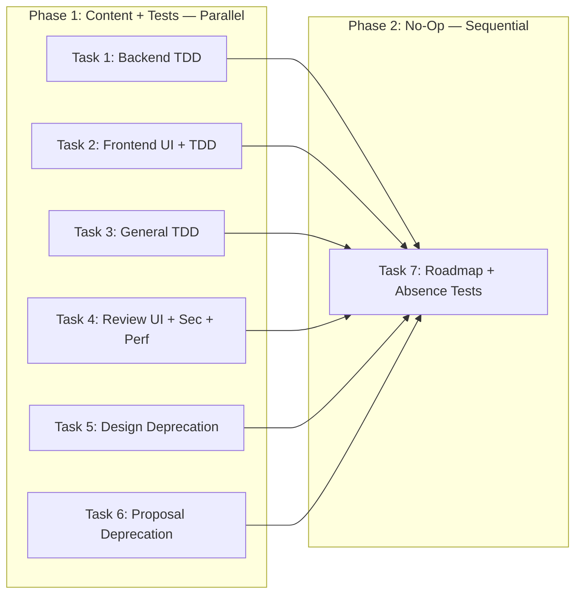

# Tasks: Consolidate Remaining Skill Guidance

## Source

- Spec: `consolidate-remaining-skill-guidance` spec artifact
- Design: `consolidate-remaining-skill-guidance` design artifact
- Capabilities affected: `developer-team-skill-guidance` (modified), `selective-skill-reference`, `no-op-documentation`, `contract-preservation`, `structural-verification`

## Add/No-Op Matrix

| Skill | Apply Backend | Apply Frontend | Apply General | Review | Design | Proposal | Action |
|---|---|---|---|---|---|---|---|
| `frontend-ui-engineering` | no-op | **add** | no-op | **add** | no-op | no-op | Selective |
| `test-driven-development` | **add** | **add** | **add** | no-op | no-op | no-op | Selective |
| `security-and-hardening` | no-op | no-op | no-op | **add** | no-op | no-op | Selective |
| `performance-optimization` | no-op | no-op | no-op | **add** | no-op | no-op | Selective |
| `deprecation-and-migration` | no-op | no-op | no-op | no-op | **add** | **add** (conditional) | Selective |
| `debugging-and-error-recovery` | no-op | no-op | no-op | no-op | no-op | no-op | Phase-mismatch |
| `idea-refine` | no-op | no-op | no-op | no-op | no-op | no-op | Interactive |
| `interview-me` | no-op | no-op | no-op | no-op | no-op | no-op | Interactive |
| `git-workflow-and-versioning` | no-op | no-op | no-op | no-op | no-op | no-op | Negligible-overlap |
| `doubt-driven-development` | no-op | no-op | no-op | no-op | no-op | no-op | Phase-mismatch |
| `ci-cd-and-automation` | no-op | no-op | no-op | no-op | no-op | no-op | Negligible-overlap |
| `code-simplification` | no-op | no-op | no-op | no-op | no-op | no-op | Negligible-overlap |
| `comment-writer` | no-op | no-op | no-op | no-op | no-op | no-op | Negligible-overlap |
| `shipping-and-launch` | no-op | no-op | no-op | no-op | no-op | no-op | Negligible-overlap |
| `judgment-day` | no-op | no-op | no-op | no-op | no-op | no-op | Phase-mismatch |

## Task Groups

### Group: Shared / Contracts — Content + Tests

#### Task 1: Apply Backend — add TDD reference + structural tests

**Owner**: General Apply
**Priority**: P0
**Complexity**: Low
**Parallel**: Yes
**Depends on**: none

**Description**
Add the canonical `test-driven-development` reference line to `APPLY_BACKEND_SKILL_BODY` `## Rules` section, placed after the existing `documentation-and-adrs` line. Add test assertions in the corresponding test file: exact once, no bullet variants, absent from `APPLY_BACKEND_AGENT_BODY`.

Exact line to add:
```
Follow the test-driven-development skill for RED-GREEN-REFACTOR, Prove-It testing, test pyramid, and real-over-mocks guidance when authoring or changing tests.
```

**Files**
- `packages/core/src/teams/developer/apply-backend-content.ts` — modify
- `packages/core/src/teams/developer/apply-backend-content.test.ts` — modify

**Verification**
- `bun test packages/core/src/teams/developer/apply-backend-content.test.ts` passes
- TDD line appears exactly once in `APPLY_BACKEND_SKILL_BODY`
- No `- Follow` or `* Follow` bullet variant exists
- TDD line does NOT appear in `APPLY_BACKEND_AGENT_BODY`
- All existing tests in the file pass unchanged

**REQ coverage**: REQ-sel-003, REQ-con-001, REQ-ver-001, REQ-ver-002, REQ-ver-004

---

#### Task 2: Apply Frontend — add frontend-ui-engineering + TDD references + structural tests

**Owner**: General Apply
**Priority**: P0
**Complexity**: Low
**Parallel**: Yes
**Depends on**: none

**Description**
Add two canonical reference lines to `APPLY_FRONTEND_SKILL_BODY` `## Rules` section:
1. `frontend-ui-engineering` — placed after existing `documentation-and-adrs` line
2. `test-driven-development` — placed after the new `frontend-ui-engineering` line

Add test assertions: exact once per line, no bullet variants, absent from `APPLY_FRONTEND_AGENT_BODY`.

Exact lines to add (in order):
```
Follow the frontend-ui-engineering skill for production-quality UI/component, state, accessibility, responsive, loading/error/empty-state, and frontend quality guidance.
Follow the test-driven-development skill for RED-GREEN-REFACTOR, Prove-It testing, test pyramid, and real-over-mocks guidance when authoring or changing tests.
```

**Files**
- `packages/core/src/teams/developer/apply-frontend-content.ts` — modify
- `packages/core/src/teams/developer/apply-frontend-content.test.ts` — modify

**Verification**
- `bun test packages/core/src/teams/developer/apply-frontend-content.test.ts` passes
- Each new line appears exactly once in `APPLY_FRONTEND_SKILL_BODY`
- No bullet variants exist
- Neither new line appears in `APPLY_FRONTEND_AGENT_BODY`
- All existing tests pass unchanged

**REQ coverage**: REQ-sel-001, REQ-sel-004, REQ-con-001, REQ-ver-001, REQ-ver-002, REQ-ver-004

---

#### Task 3: Apply General — add TDD reference + structural tests

**Owner**: General Apply
**Priority**: P0
**Complexity**: Low
**Parallel**: Yes
**Depends on**: none

**Description**
Add the canonical `test-driven-development` reference line to `APPLY_GENERAL_SKILL_BODY` `## Rules` section, placed after the existing `documentation-and-adrs` line. Add test assertions: exact once, no bullet variants, absent from `APPLY_GENERAL_AGENT_BODY`.

Exact line to add:
```
Follow the test-driven-development skill for RED-GREEN-REFACTOR, Prove-It testing, test pyramid, and real-over-mocks guidance when authoring or changing tests.
```

**Files**
- `packages/core/src/teams/developer/apply-general-content.ts` — modify
- `packages/core/src/teams/developer/apply-general-content.test.ts` — modify

**Verification**
- `bun test packages/core/src/teams/developer/apply-general-content.test.ts` passes
- TDD line appears exactly once in `APPLY_GENERAL_SKILL_BODY`
- No bullet variants exist
- TDD line does NOT appear in `APPLY_GENERAL_AGENT_BODY`
- All existing tests pass unchanged

**REQ coverage**: REQ-sel-005, REQ-con-001, REQ-ver-001, REQ-ver-002, REQ-ver-004

---

#### Task 4: Review — add frontend-ui + security + performance references + structural tests

**Owner**: General Apply
**Priority**: P0
**Complexity**: Medium
**Parallel**: Yes
**Depends on**: none

**Description**
Add three canonical reference lines to `REVIEW_SKILL_BODY` `## Rules` section, placed after the existing `documentation-and-adrs` line:
1. `frontend-ui-engineering`
2. `security-and-hardening`
3. `performance-optimization`

Add test assertions for each: exact once, no bullet variants, absent from `REVIEW_AGENT_BODY`.

Exact lines to add (in order):
```
Follow the frontend-ui-engineering skill for production-quality UI/component, state, accessibility, responsive, loading/error/empty-state, and frontend quality guidance.
Follow the security-and-hardening skill for security review of input validation, auth, secrets, injection, exposure, and external integration risks.
Follow the performance-optimization skill for performance review of scalability, Core Web Vitals, load behavior, data access, bundle size, and latency risks.
```

**Files**
- `packages/core/src/teams/developer/review-content.ts` — modify
- `packages/core/src/teams/developer/review-content.test.ts` — modify

**Verification**
- `bun test packages/core/src/teams/developer/review-content.test.ts` passes
- Each of the 3 new lines appears exactly once in `REVIEW_SKILL_BODY`
- No bullet variants exist for any new line
- None of the 3 new lines appear in `REVIEW_AGENT_BODY`
- Existing `code-review-and-quality` reference in review methodology remains unchanged
- All existing tests pass unchanged

**REQ coverage**: REQ-sel-002, REQ-sel-006, REQ-sel-007, REQ-con-001, REQ-ver-001, REQ-ver-002, REQ-ver-004

---

#### Task 5: Design — add deprecation-and-migration reference + structural tests

**Owner**: General Apply
**Priority**: P0
**Complexity**: Low
**Parallel**: Yes
**Depends on**: none

**Description**
Add the canonical `deprecation-and-migration` reference line to `DESIGN_SKILL_BODY` `## Rules` section, placed after the existing `documentation-and-adrs` line. Add test assertions: exact once, no bullet variants, absent from `DESIGN_AGENT_BODY`.

Exact line to add:
```
Follow the deprecation-and-migration skill for migration, replacement, removal, rollout, rollback, and backward-compatibility design decisions.
```

**Files**
- `packages/core/src/teams/developer/design-content.ts` — modify
- `packages/core/src/teams/developer/design-content.test.ts` — modify

**Verification**
- `bun test packages/core/src/teams/developer/design-content.test.ts` passes
- Deprecation line appears exactly once in `DESIGN_SKILL_BODY`
- No bullet variants exist
- Deprecation line does NOT appear in `DESIGN_AGENT_BODY`
- All existing tests pass unchanged

**REQ coverage**: REQ-sel-008, REQ-con-001, REQ-ver-001, REQ-ver-002, REQ-ver-004

---

#### Task 6: Proposal — add conditional deprecation-and-migration reference + structural tests

**Owner**: General Apply
**Priority**: P0
**Complexity**: Low
**Parallel**: Yes
**Depends on**: none

**Description**
Add the conditional `deprecation-and-migration` reference to `PROPOSAL_SKILL_BODY` `## Rules` section, placed after the existing `documentation-and-adrs` line. This reference is conditional — it notes applicability only for replacement/removal type changes. Add test assertions: exact once, no bullet variants, absent from `PROPOSAL_AGENT_BODY`.

Exact line to add:
```
For proposals involving replacement, removal, or migration of existing systems, follow the deprecation-and-migration skill for deprecation strategy and migration planning.
```

**Files**
- `packages/core/src/teams/developer/proposal-content.ts` — modify
- `packages/core/src/teams/developer/proposal-content.test.ts` — modify

**Verification**
- `bun test packages/core/src/teams/developer/proposal-content.test.ts` passes
- Conditional deprecation line appears exactly once in `PROPOSAL_SKILL_BODY`
- No bullet variants exist
- Line does NOT appear in `PROPOSAL_AGENT_BODY`
- All existing tests pass unchanged

**REQ coverage**: REQ-sel-009, REQ-con-001, REQ-ver-001, REQ-ver-002, REQ-ver-004

---

### Group: Shared / Contracts — No-Op Documentation + Absence Verification

#### Task 7: Roadmap no-op rationale + absence verification tests

**Owner**: General Apply
**Priority**: P0
**Complexity**: Medium
**Parallel**: No — depends on Tasks 1–6 (must verify absence against final content state)
**Depends on**: Task 1, Task 2, Task 3, Task 4, Task 5, Task 6

**Description**
Add a "Phase 3F selective no-op decisions" section to `docs/skills-integration-roadmap.md` documenting the rationale for each of the 10 excluded skills. Add test assertions that each no-op skill name does not appear as a `Follow the ...` reference in any of the 6 target `*_SKILL_BODY` or `*_AGENT_BODY` exports.

No-op skills with rationale classification:
- **Interactive** (requires user conversation): `idea-refine`, `interview-me`
- **Phase-mismatch** (not applicable to autonomous construction/review): `debugging-and-error-recovery`, `doubt-driven-development`, `judgment-day`
- **Negligible-overlap** (scope does not overlap with agent responsibilities): `git-workflow-and-versioning`, `ci-cd-and-automation`, `code-simplification`, `comment-writer`, `shipping-and-launch`

Roadmap section to add (under Phase 3F):
```md
#### Phase 3F selective no-op decisions

The following skills are intentionally not referenced in Developer Team prompt bodies for this phase. They are either interactive/main-session skills, operational phases outside SDD, execution guidance for future task contexts, or low-overlap with autonomous SDD agents.

| Skill | Decision | Rationale |
|---|---|---|
| `debugging-and-error-recovery` | No-op | Verify reports failures; Apply debugging guidance can be revisited in a future Apply-focused phase. |
| `idea-refine` | No-op | Interactive user-dialogue workflow is incompatible with autonomous Explorer delegation. |
| `interview-me` | No-op | Requires live one-question-at-a-time interview; autonomous agents should flag blockers instead. |
| `git-workflow-and-versioning` | Keep inline/no-op | Orchestrator git suggestions are advisory; critical Git discard protection remains centralized. |
| `doubt-driven-development` | Keep inline/no-op | In-flight adversarial review does not replace post-hoc Review or Deck orchestrator invariants. |
| `ci-cd-and-automation` | No-op | CI/CD setup is outside current Developer Team prompt redundancy. |
| `code-simplification` | No-op | Applies to explicit refactor/simplification tasks, not baseline implementation guidance. |
| `comment-writer` | No-op | Human-facing collaboration comments are outside structured SDD artifacts. |
| `shipping-and-launch` | No-op | Launch operations occur after SDD Archive. |
| `judgment-day` | No-op | Unique standalone dual-review workflow; no prompt consolidation needed. |
```

**Files**
- `docs/skills-integration-roadmap.md` — modify
- One of the 6 existing test files or a new shared test file — modify/create (add absence assertions)

**Verification**
- Roadmap contains the no-op rationale table with all 10 skills
- Test asserts each of the 10 no-op skill names does not appear as a `Follow the` reference in any target SKILL_BODY
- Test asserts each of the 10 no-op skill names does not appear as a `Follow the` reference in any target AGENT_BODY
- `bun test packages/core/src/teams/developer/` passes (full suite)
- Existing tests pass unchanged

**REQ coverage**: REQ-noop-001, REQ-noop-002, REQ-ver-003, REQ-ver-004

---

## Dependency Graph

```
Tasks 1–6 (independent, parallel)
  └─→ Task 7 (depends on all)
```

## Parallelization Plan

| Phase | Tasks | Can Run in Parallel |
|---|---|---|
| Content + Tests | 1, 2, 3, 4, 5, 6 | Yes — each touches distinct file pairs |
| No-Op + Absence | 7 | No — must run after 1–6 to verify absence against final state |

## Responsibility Contracts

| Contract / Boundary | Owner | Consumers | Notes |
|---|---|---|---|
| SKILL_BODY canonical line format | General Apply (per task) | All 6 content files | Unbulleted, exact wording from design matrix |
| AGENT_BODY immutability | General Apply (per task test) | All 6 test files | New refs must not leak into AGENT_BODY |
| No-op absence guarantee | Task 7 | All 6 content files + test | 10 skills excluded with rationale |
| Git safety preservation | none (no-change) | git-safety.ts, git-safety.test.ts | No task touches these files |

## Complexity Summary

| Complexity | Count | Task Numbers |
|---|---|---|
| Low | 5 | 1, 2, 3, 5, 6 |
| Medium | 2 | 4, 7 |
| High | 0 | — |

## Flagged for Splitting

None — all tasks are within session scope.

## Review Workload Forecast

| Signal | Value |
|---|---|
| Estimated changed lines | 100-400 |
| 400-line budget risk | Low |
| Scope reduction recommended | No |
| Sequential work slices recommended | No |
| Decision needed before Apply | No |

**Rationale**: 6 files receive 1–3 canonical line additions each (~15-25 lines content total), paired with ~15-30 lines of test assertions per file (~120-180 lines test total), plus ~20 lines roadmap documentation. Total estimate ~160-225 lines. All changes are mechanical prompt string additions with structural test guards. No architectural decisions remain open.

## Open Questions / Blockers

- **[Non-blocking]** No-op absence test location: may live in a shared test file or be distributed across individual test files. Either approach satisfies REQ-ver-003. Allowed-with-stub — Apply agent may choose.
- **[Non-blocking]** State registry missing spec/design phase entries: spec.md and design.md exist as files but state.yaml only records explore and proposal. This is a prior-phase registry gap, not a blocker for tasks. Tasks phase will append to existing state.
- **[Non-blocking, out-of-scope]** Spec open question: "Should Task Agent receive TDD routing note?" — deferred to future consideration; does not block this change.
- **[Non-blocking, out-of-scope]** Spec open question: "Should git workflow be considered for future Apply-agent phase?" — deferred; does not block this change.

> No implementation-blocking issues. Tasks are ready for Apply.

## Mermaid Summary Source


