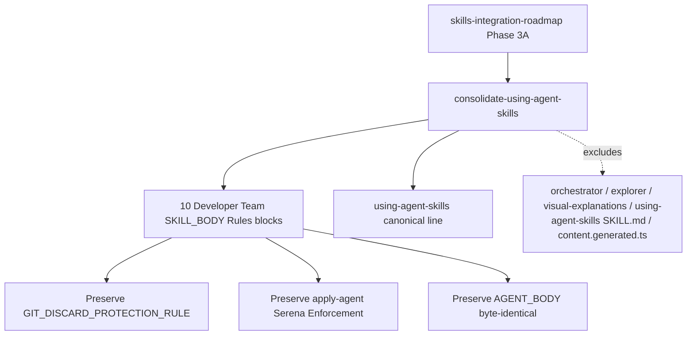

# Proposal: Consolidate Using-Agent-Skills Guidance

## Intent

Reduce duplicated generic operating-behavior and failure-mode guidance across Developer Team `SKILL_BODY` prompts by making `using-agent-skills` the canonical source for that guidance, while preserving Deck-specific agent identity, SDD contracts, Git discard protection, and apply-agent Serena enforcement.

## Goal

Replace the `SKILL_BODY` `## Rules` block bodies in 10 Developer Team content files with one canonical `using-agent-skills` reference, without changing `AGENT_BODY` or phase contracts.

## Scope

### In Scope
- Update `SKILL_BODY` `## Rules` block bodies in 10 target files under `packages/core/src/teams/developer/`.
- Use the exact canonical line: `Follow the using-agent-skills skill for operating behaviors and failure mode guidance.`
- Preserve `${GIT_DISCARD_PROTECTION_RULE}` in all target surfaces.
- Preserve `Serena Enforcement` sections in apply agents.
- Update/add focused tests that assert the canonical line appears exactly once in each target file.

### Out of Scope
- No changes to `AGENT_BODY` content.
- No changes to `orchestrator-content.ts`, `explorer-content.ts`, `visual-explanations-content.ts`, `packages/core/src/skills/external/using-agent-skills/SKILL.md`, or generated bundle files.
- No broader Phase 3B-3F prompt consolidations.
- No change to runtime behavior, skill loading, or standalone skill bundle generation.

## Affected Capabilities

### New Capabilities
- None.

### Modified Capabilities
- `developer-team-prompt-canonicalization`: Developer Team `SKILL_BODY` rules delegate generic operating behaviors to `using-agent-skills` instead of duplicating inline guidance.

### Unchanged Capabilities
- `developer-team-git-safety`: Critical Git discard protection remains inline and unchanged.
- `developer-team-sdd-contracts`: Phase roles, artifact contracts, registry behavior, and return formats remain unchanged.
- `apply-agent-serena-enforcement`: Apply-agent Serena Enforcement sections remain unchanged.

## Approach

Use the roadmap/exploration recommended Option A: replace only each target `SKILL_BODY` `## Rules` block body with the exact canonical line. Keep surrounding template-literal structure and all non-Rules sections intact. Verify with focused Developer Team tests.

## Alternatives and Tradeoffs

| Alternative | Why Considered | Why Not Chosen |
|---|---|---|
| Replace Rules block bodies with canonical line | Aligns with Phase 3A roadmap and prior successful result | Chosen |
| Append canonical line to existing Rules | Lower risk of losing explicit guidance | Keeps duplication; conflicts with forward-canonicalization intent |
| Add reference outside Rules | Minimal code churn | Does not satisfy roadmap requirement to canonicalize `## Rules` body |

## Risks

| Risk | Likelihood | Mitigation |
|---|---|---|
| Removing phase-specific guardrails that are not actually covered by `using-agent-skills` | Medium | Spec/Design must identify any non-generic rules that must remain outside `## Rules` before Apply |
| Template literal escaping breaks TypeScript parsing | Medium | Use targeted edits and run focused Developer Team tests |
| Existing tests assert old rule text/counts | Medium | Update tests to assert canonical reference and preserved invariants |
| Accidental `AGENT_BODY` mutation | Medium | Verify `AGENT_BODY` byte-identical or structurally unchanged before completion |
| Git safety rule regression | Low | Keep `${GIT_DISCARD_PROTECTION_RULE}` outside replaced body and run existing git-safety tests |

## Rollback Plan

Revert the Phase 3A prompt/test changes for the 10 target content files and related Developer Team tests. If applied through Git, revert the change commit; if uncommitted, restore only the touched target/test files from `HEAD` after explicit user confirmation, preserving unrelated working-tree changes such as `apps/cli/src/runtime/build-info.generated.ts`.

## Dependencies

- Phase 1 external skills bundle install should remain available so `using-agent-skills` exists as a standalone skill.
- Existing `GIT_DISCARD_PROTECTION_RULE` in `packages/core/src/teams/developer/git-safety.ts` must remain intact.
- Developer Team focused tests must be runnable with Bun.

## Open Questions

- Should implementation verify `AGENT_BODY` byte identity via snapshot/hash, or is targeted test coverage sufficient?
- Are any current `SKILL_BODY` Rules bullets phase-specific enough to preserve outside the canonicalized Rules block?
- Should acceptance require full Developer Team suite only, or also centralized `git-safety.test.ts` explicitly?

## Acceptance Direction

- [ ] Each of the 10 target content files has the exact canonical line once in `SKILL_BODY` Rules.
- [ ] No target has bullet-wrapped, indented, or duplicate canonical-line variants.
- [ ] `AGENT_BODY` surfaces remain unchanged.
- [ ] `${GIT_DISCARD_PROTECTION_RULE}` remains present and effective.
- [ ] Apply-agent `Serena Enforcement` sections remain present.
- [ ] Excluded files remain unmodified.
- [ ] Focused Developer Team tests pass; unrelated baseline failures, if any, are documented separately.

## Next Steps

Ready for Spec (`deck-developer-spec`) and Design (`deck-developer-design`) in parallel.

## Mermaid Summary Source

