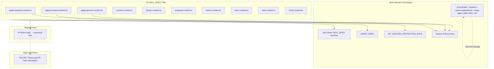

# Spec: Consolidate Using-Agent-Skills Guidance

## Source

- Proposal: consolidate-using-agent-skills proposal artifact
- Capabilities affected: developer-team-prompt-canonicalization (modified); developer-team-git-safety, developer-team-sdd-contracts, apply-agent-serena-enforcement (unchanged)

## Requirements

### Capability: developer-team-prompt-canonicalization

REQ-canonicalize-001: Each of the 10 target `SKILL_BODY` `## Rules` block bodies in Developer Team content files MUST be replaced with the exact canonical line: `Follow the using-agent-skills skill for operating behaviors and failure mode guidance.`
  Priority: MUST
  Surface: Data (prompt content)
  Rationale: Eliminates duplicated generic operating-behavior guidance across 10 files by delegating to the canonical `using-agent-skills` source.

REQ-canonicalize-002: The canonical line MUST appear exactly once per target file's `SKILL_BODY` — no bullet-wrapping, indentation variants, or duplicates.
  Priority: MUST
  Surface: Data (prompt content)
  Rationale: Prevents ambiguous or inconsistent canonical references that could confuse the agent at runtime.

REQ-canonicalize-003: `AGENT_BODY` surfaces in all target files MUST remain unchanged — structurally and textually — after the Rules block replacement.
  Priority: MUST
  Surface: Data (prompt content)
  Rationale: The proposal explicitly scopes out AGENT_BODY changes; any mutation is an unintended regression.

REQ-canonicalize-004: `${GIT_DISCARD_PROTECTION_RULE}` interpolation MUST remain present and correctly positioned in every target file's `SKILL_BODY`.
  Priority: MUST
  Surface: Security (critical Git safety)
  Rationale: Git discard protection prevents accidental data loss. Removing or misplacing this rule is a critical safety regression.

REQ-canonicalize-005: Apply-agent Serena Enforcement sections (in `apply-backend-content.ts`, `apply-frontend-content.ts`, `apply-general-content.ts`) MUST remain present and structurally unchanged.
  Priority: MUST
  Surface: Integration (tool enforcement)
  Rationale: Serena enforcement directs apply agents to use symbol-level operations. Removing it degrades code quality.

REQ-canonicalize-006: Excluded files — `orchestrator-content.ts`, `explorer-content.ts`, `visual-explanations-content.ts`, `packages/core/src/skills/external/using-agent-skills/SKILL.md`, and any generated bundle files — MUST NOT be modified.
  Priority: MUST
  Surface: General
  Rationale: These files are explicitly out of scope; modifying them risks cascading failures.

REQ-canonicalize-007: All non-Rules sections within target `SKILL_BODY` blocks — including title, description, Non-Goals, surface-awareness, context-authority, package instructions, and return contract — MUST remain structurally intact.
  Priority: MUST
  Surface: Data (prompt content)
  Rationale: Only the `## Rules` block body is in scope. Collateral changes to other sections are unintended mutations.

REQ-canonicalize-008: Template literal syntax (backtick delimiters, `${...}` interpolations) in target files MUST remain valid TypeScript after the replacement.
  Priority: MUST
  Surface: Data (code correctness)
  Rationale: Broken template literals cause TypeScript parse errors and prevent Developer Team module compilation.

REQ-canonicalize-009: Phase-specific rules that are NOT covered by `using-agent-skills` operating behaviors SHOULD be identified and preserved outside the canonicalized Rules block if they exist.
  Priority: SHOULD
  Surface: Data (prompt content)
  Rationale: The current Rules blocks contain phase-specific constraints (e.g., "Do not write specs, designs, or proposals") that are unique per agent role and not covered by the generic `using-agent-skills` guidance. These must not be silently discarded.

REQ-canonicalize-010: Existing focused Developer Team tests MUST be updated to assert the canonical line presence and preserved invariants rather than old rule text or bullet counts.
  Priority: MUST
  Surface: General (test correctness)
  Rationale: Tests asserting old Rules text will fail after canonicalization; they must validate the new contract.

REQ-canonicalize-011: The `git-safety.ts` source file containing `GIT_DISCARD_PROTECTION_RULE` MUST remain unmodified.
  Priority: MUST
  Surface: Security (critical Git safety)
  Rationale: The rule definition is out of scope and must not change.

## Acceptance Scenarios

### Capability: developer-team-prompt-canonicalization

#### Scenario: Canonical line replaces Rules body in all 10 targets
**Given** the 10 target content files under `packages/core/src/teams/developer/` (apply-backend, apply-frontend, apply-general, archive, design, proposal, review, spec, task, verify)
**When** the `## Rules` block body in each file's `SKILL_BODY` is replaced
**Then** each file contains exactly one occurrence of the line `Follow the using-agent-skills skill for operating behaviors and failure mode guidance.` within its `SKILL_BODY` `## Rules` section, with no other bullet points in that section
> Covers: REQ-canonicalize-001, REQ-canonicalize-002

#### Scenario: No canonical line variants or duplicates
**Given** a target file with the canonical line applied
**When** the file content is searched for `using-agent-skills` references
**Then** the canonical line appears exactly once in `SKILL_BODY`, with no bullet-wrapped (`- using-agent-skills`), indented, or duplicate variants
> Covers: REQ-canonicalize-002

#### Scenario: AGENT_BODY remains unchanged
**Given** the pre-change `AGENT_BODY` content of each target file
**When** the Rules block replacement is applied
**Then** each target file's `AGENT_BODY` export is byte-identical to its pre-change version
> Covers: REQ-canonicalize-003

#### Scenario: Git discard protection preserved
**Given** a target file that previously contained `${GIT_DISCARD_PROTECTION_RULE}`
**When** the Rules block replacement is applied
**Then** `${GIT_DISCARD_PROTECTION_RULE}` remains present in `SKILL_BODY` at its original structural position (not inside the replaced Rules body)
**And** the interpolation resolves correctly at runtime
> Covers: REQ-canonicalize-004

#### Scenario: Serena enforcement preserved in apply agents
**Given** the apply-agent content files (apply-backend, apply-frontend, apply-general)
**When** the Rules block replacement is applied
**Then** each file's Serena Enforcement section remains present and its text is unchanged
> Covers: REQ-canonicalize-005

#### Scenario: Excluded files remain unmodified
**Given** the excluded files: orchestrator-content.ts, explorer-content.ts, visual-explanations-content.ts, using-agent-skills SKILL.md, generated bundle files
**When** the Rules block replacement is applied across all targets
**Then** each excluded file's content is byte-identical to its pre-change version
> Covers: REQ-canonicalize-006

#### Scenario: Non-Rules SKILL_BODY sections preserved
**Given** a target file's SKILL_BODY containing sections other than `## Rules`
**When** the Rules block body is replaced with the canonical line
**Then** all sections before and after `## Rules` (title, description, Non-Goals, surface-awareness, context-authority, package instructions, return contract) remain structurally and textually unchanged
> Covers: REQ-canonicalize-007

#### Scenario: Template literal validity maintained
**Given** a target file after Rules block replacement
**When** TypeScript compilation is attempted
**Then** the file compiles without template literal parse errors
> Covers: REQ-canonicalize-008

#### Scenario: Phase-specific rules not silently lost
**Given** a target file's pre-change Rules block containing phase-specific constraints (e.g., "Do not write specs, designs, or proposals", "Do not delegate further", "Make minimal changes")
**When** the Rules block body is replaced with the canonical line
**Then** any rules that are NOT covered by `using-agent-skills` Core Operating Behaviors or Failure Modes sections are identified and either preserved outside `## Rules` or explicitly documented as intentionally deferred
> Covers: REQ-canonicalize-009

**Variant: No phase-specific rules need preservation**
- Given a target file whose Rules are fully covered by `using-agent-skills`
- When the Rules body is replaced
- Then no additional rules need to be preserved and the file contains only the canonical line in `## Rules`

#### Scenario: Updated tests pass
**Given** the focused Developer Team test files for the 10 target content files
**When** tests are run with `bun test`
**Then** tests assert the canonical line presence, preserved invariants (git safety, AGENT_BODY, Serena), and pass
**And** no test asserts old rule text or old bullet counts
> Covers: REQ-canonicalize-010

#### Scenario: Git safety source file unmodified
**Given** `packages/core/src/teams/developer/git-safety.ts` pre-change content
**When** the canonicalization is applied
**Then** git-safety.ts is byte-identical to its pre-change version
> Covers: REQ-canonicalize-011

#### Scenario: Rollback succeeds
**Given** a completed canonicalization with committed changes
**When** the change commit is reverted
**Then** all 10 target files and their tests are restored to their pre-change state
**And** Developer Team tests pass in the restored state
> Covers: REQ-canonicalize-001, REQ-canonicalize-003, REQ-canonicalize-004

## Validation Rules

| Field / Input | Rule | Error Message | REQ-ID |
|---|---|---|---|
| Canonical line text | Must be exactly `Follow the using-agent-skills skill for operating behaviors and failure mode guidance.` (no variants) | Canonical line mismatch or duplication in {filename} | REQ-canonicalize-001, REQ-canonicalize-002 |
| AGENT_BODY hash | Must match pre-change hash per target file | AGENT_BODY mutation detected in {filename} | REQ-canonicalize-003 |
| GIT_DISCARD_PROTECTION_RULE presence | Must exist in SKILL_BODY of every target file | Git discard protection missing from {filename} | REQ-canonicalize-004 |
| Serena Enforcement section | Must exist in apply-backend, apply-frontend, apply-general | Serena enforcement missing from {filename} | REQ-canonicalize-005 |
| Excluded file hash | Must match pre-change hash | Excluded file {filename} was modified | REQ-canonicalize-006 |
| TypeScript compilation | All target files must compile without errors | Compilation error in {filename} | REQ-canonicalize-008 |

## Error Contracts

| Condition | Error Code | Message | Status |
|---|---|---|---|
| Canonical line appears zero times in target | MISSING_CANONICAL | Target file {filename} does not contain the canonical Rules line | Blocker |
| Canonical line appears more than once in target | DUPLICATE_CANONICAL | Target file {filename} contains {count} occurrences of the canonical line | Blocker |
| AGENT_BODY mutated | AGENT_BODY_MUTATION | Target file {filename} AGENT_BODY differs from baseline | Blocker |
| GIT_DISCARD_PROTECTION_RULE missing | GIT_SAFITY_REGRESSION | Target file {filename} is missing GIT_DISCARD_PROTECTION_RULE | Critical |
| Serena Enforcement missing from apply agent | SERENA_ENFORCEMENT_MISSING | Apply agent {filename} is missing Serena Enforcement section | Blocker |
| Excluded file modified | OUT_OF_SCOPE_MUTATION | Excluded file {filename} was modified | Blocker |
| TypeScript compilation fails | COMPILATION_ERROR | Target file {filename} has template literal parse error | Blocker |

## States and Transitions

> Omitted — no meaningful state lifecycle. The change is a one-time content transformation.

## Open Questions

- **OQ-001**: Should implementation verify `AGENT_BODY` byte identity via snapshot/hash, or is targeted test coverage sufficient? (Carried from proposal)
- **OQ-002**: The current Rules blocks contain many phase-specific constraints (e.g., "Do not write specs, designs, or proposals", "Do not implement frontend UI", "Make minimal changes", "Do not delegate further — you are a terminal apply agent"). These are NOT covered by `using-agent-skills` Core Operating Behaviors or Failure Modes. The proposal says to replace Rules block *bodies* with the canonical line — does this mean these phase-specific rules should be relocated to another section (e.g., a new `## Phase Constraints` section), or is their loss intentional? Design must resolve this before Apply.
- **OQ-003**: Should acceptance require running the full Developer Team test suite, only the focused target-file tests, or also the centralized `git-safety.test.ts` explicitly? (Carried from proposal)

## Compliance Matrix

| REQ-ID | Scenario(s) | Status |
|---|---|---|
| REQ-canonicalize-001 | Canonical line replaces Rules body; Rollback succeeds | Defined |
| REQ-canonicalize-002 | No canonical line variants or duplicates | Defined |
| REQ-canonicalize-003 | AGENT_BODY remains unchanged; Rollback succeeds | Defined |
| REQ-canonicalize-004 | Git discard protection preserved; Rollback succeeds | Defined |
| REQ-canonicalize-005 | Serena enforcement preserved | Defined |
| REQ-canonicalize-006 | Excluded files remain unmodified | Defined |
| REQ-canonicalize-007 | Non-Rules SKILL_BODY sections preserved | Defined |
| REQ-canonicalize-008 | Template literal validity maintained | Defined |
| REQ-canonicalize-009 | Phase-specific rules not silently lost | Defined |
| REQ-canonicalize-010 | Updated tests pass | Defined |
| REQ-canonicalize-011 | Git safety source file unmodified | Defined |

## Mermaid Summary Source

